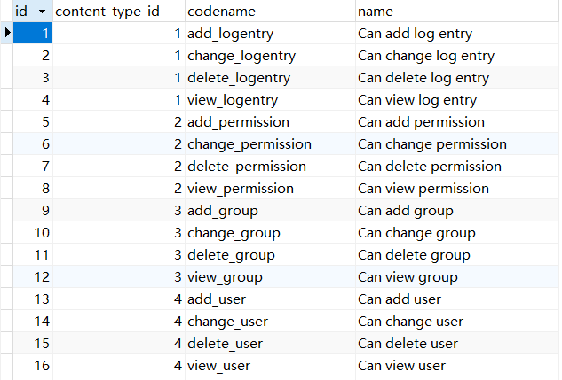

# Django 自带权限机制使用

## 功能简介

当 Django 配置文件中的 `INSTALL_APPS` 包含了 `django.contrib.auth` 时，就默认启用了一个简单的权限系统，提供了为用户或组分配权限的方法。

默认的权限系统比较简单，主要包括这些功能：

* 基于表的控制，权限最小粒度是表。

  也就是说，假如有一个 Article 表，我们可以赋予用户或组对 Article 表有 delete 的权限，那么用户或组成员就可以删除全部 article，是不能控制用户只能删除自己创建的 article 的。

  如果希望用户只能删除自己创建的 article，不能删除别人创建的 article，这种需求 Django 默认的权限管理就无法实现了，需要用到 `object permission` 对象权限，有第三方模块实现了对象权限，如 [django-guardian](https://github.com/django-guardian/django-guardian)，你可以直接使用。或者也可以自己实现对象权限，具体思路后面再单独写一篇。

* 每个 model 模型默认只有四个权限，分别是添加 `add_`、修改 `change_`、删除 `delete_`、查看 `view_`，这些权限记录在 `auth_permission` 表中，表数据如下：

<div style="text-align: center;">
  
  <p style="text-align: center; color: #888;">（auth_permission 表部分内容）</p>
</div>

默认权限的创建是通过 Django 的信号 signal 实现的，使用了 `post_migrate` 信号，在每次执行 migrate 操作时都会为新的 model 模型创建默认权限。

## 自定义权限

默认的权限名字和描述都是英文的，且只有四个，如果你不想用默认的几个权限，想要自定义的话，可以这样做：

```python
class Article(models.Model):
    title = models.CharField(max_length=100, verbose_name='标题')
    body = models.TextField(blank=True, null=True, verbose_name='正文')

    class Meta:
        default_permissions = ()

        permissions = (
            ("change_article", "修改文章"),
            ("delete_article", "查看文章"),
            ("publish_article", "发布文章"),
        )
```

其中：

* `default_permissions`：清空默认的权限
* `permissions`：设置权限，内容是一个嵌套的列表，列表第一个字段是 `codename`，第二个字段为 `name`

注意：如果你使用了 Django 默认的 Admin 的话，建议保留那 4 个默认权限，可以添加新权限。

## 权限修改

如果使用了 Django 自带的 Admin，在 migrate 之后就能在 Admin 的 `user` 和 `group` 两个表中看到新添加的权限了。

当然你也可以在程序中来添加或修改权限。

### 用户权限修改方法

```python
user = User.objects.get(id=2)

user.user_permissions.add(25, 26)
user.user_permissions.set([26, 27])
user.user_permissions.remove(26, 27)
user.user_permissions.clear()
```

### 组权限修改方法

```python
group = Group.objects.get(id=1)

group.permissions.add(25)
group.permissions.set([26,27])
group.permissions.remove(25)
group.permissions.clear()
```

其中 `add` 为添加，`set` 为设置，`remove` 为移除，`clear` 为清空，`add` 跟 `set` 的区别是 `add` 会在原有权限的基础上加新权限，而 `set` 会清空原有权限设置成新的权限，后面的参数 `25`，`26`，`27` 可以是 `Permission` 的 `ID` 或者是 `Permission` 对象，例如这样也是可以的：

```python
from django.contrib.auth.models import Permission

p = Permission.objects.get(id=25)
group.permissions.add(p)
```

给组赋予权限，组内的所有用户会自动的拥有该组的权限，即便是没有单独给该用户分配任何权限。

## 权限查看

使用 `get_all_permissions()` 可以列出用户的所有权限：

```python
User.objects.get(username='zhangsan').get_all_permissions()
```

使用 `get_group_permissions()` 可以列出用户所属组的权限：

```python
User.objects.get(username='zhangsan').get_group_permissions()
```

## 权限校验

用户对象可以通过 `has_perm` 方法来判断用户是否拥有某个权限：

```python
User.objects.get(username='zhangsan').has_perm('blog.change_article')

User.objects.get(username='zhangsan').has_perm('blog.delete_article')
```

`has_perm` 的参数由 `<app label>.<permission codename>` 两部分组成，例如 `blog.delete_article` 表示的就是名字为 `blog` 的 APP 下的 `delete_article` 权限。

### 后端 View 校验权限

可以直接在 view 中通过 if 判断用户权限，例如：

```python
def on_blog_update(request):
    if not request.user.has_perm('blog.change_article')
        return HttpResponse('403 Forbidden')
```

为了方便，Django 还提供了一个 `permission_required()` 的装饰器，可以快速的来校验用户是否拥有特定的权限，用法如下：

```python
@permission_required(perm, login_url=None, raise_exception=False)
```

三个参数的意思分别是：

* `perm`：必须有，权限名称，同 `has_perm` 一样
* `login_url`：非必须，登陆的 url 地址，当你没有权限时自动跳转到登陆页，这里可以设置登陆地址的 url
* `raise_exception`：非必须，当为 `True` 时，如果用户没有权限，则不会跳转到登陆页，而是引发 PermissionDenied 错误，返回 403 Forbidden

如下例子，判断用户是否有 `blog` 这个 APP 下的 `change_article` 权限，如果没有则返回 403 错误：

```python
@permission_required('blog.change_article', raise_exception=True)
def on_blog_update(request):
    ...
```

### 前端 Template 中校验权限

当前登陆用户的权限保存在模版变量 `perms` 中，可以在模版中通过 if 判断用户是否拥有相应的权限而开放对应的内容，例如对于侧边栏菜单只显示用户有权限访问的，就可以这么写：

```html

    <li><a href=""></i> 项目列表</a></li>



    <li><a href=""></i> 服务列表</a></li>



    <li><a href=""></i> 环境列表</a></li>

```

至此，Django 的默认权限系统介绍完成，默认权限在小型项目中能满足大部分的需求，如果对权限控制有更高的要求可以使用 django-guardian 或自己拓展实现。

（完）
