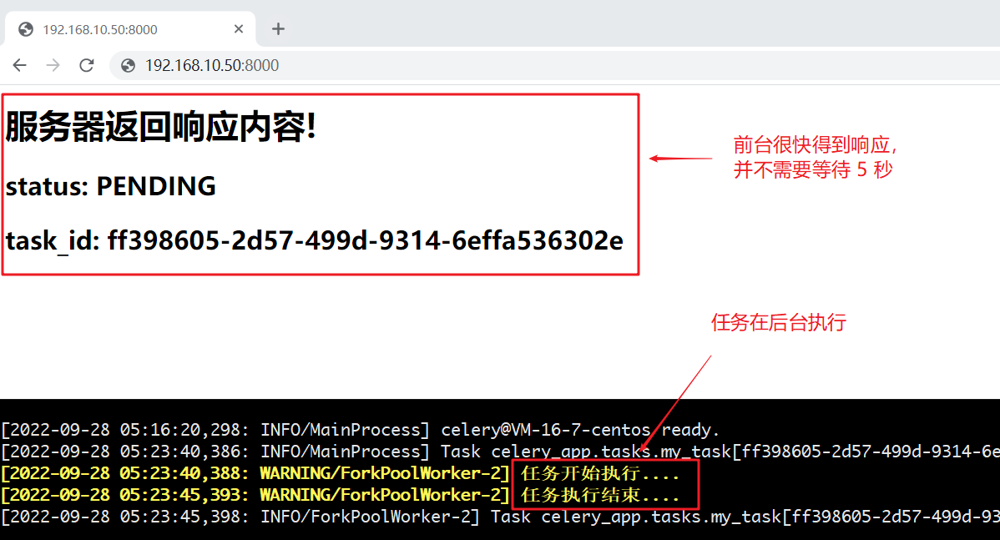
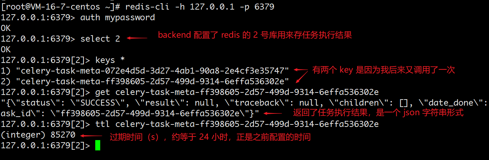
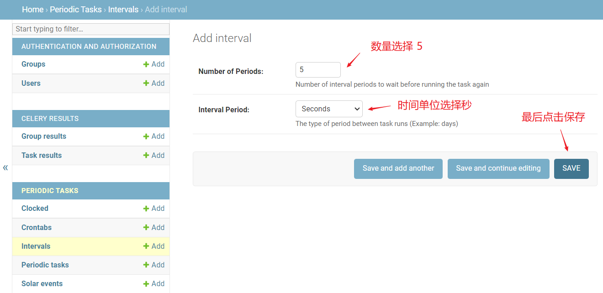
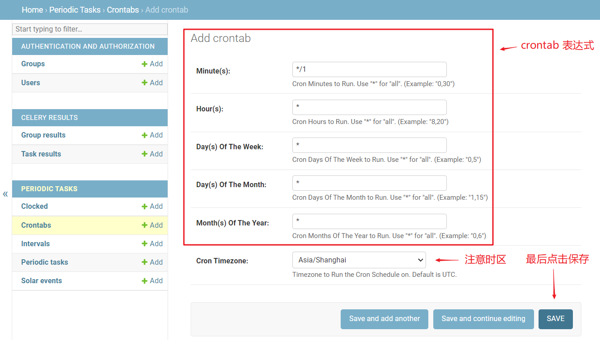
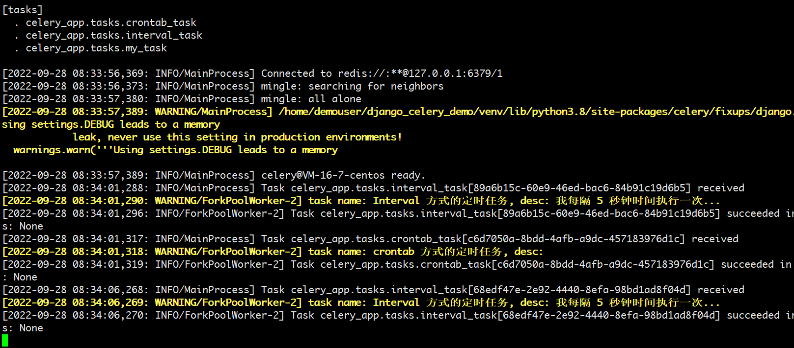

# Django 与 Celery 的集成

> 本项目的环境为：
>
> * CentOS 7
> * Python 3.8.9
> * Django 4
> * Celery 5
> * Redis 7
> 
> 虽然是 Django 4，但没有使用什么新的特性和语法，所以同样适用于 Django 3 和 2。对于 Django 1，只有少部分路由语法不一样。

## 背景

Django 框架请求/响应的过程是同步的，框架本身无法实现异步响应。

但是我们在项目过程中会经常会遇到一些耗时的任务, 比如：发送邮件、发送短信、大数据统计等等，这些操作耗时长，同步执行对用户体验非常不友好，那么在这种情况下就需要实现异步执行。

关于 Celery 介绍和使用可以查看之前写的一篇 Python 中[使用 Celery 实现任务调度](/backend-knowledge/python/python-lib-celery/)。

## 工作流程

先来看一下 Celery 集成到 Django 后的整个工作流程图：

<div style="text-align: center;">
  
  <p style="text-align: center; color: #888;">（Django - Celery 工作流程图，图来源于网络）</p>
</div>

* 客户端发送请求到 Django。
* Django 产生任务（要执行的函数），并把任务转发给消息队列（Celery 的 Broker）
* Celery 的 Worker 从 Broker 拿到任务并且执行。
* Worker 执行任务后将结果保存到后端数据库（Redis 或 Django ORM 等，也可以不存，具体看怎么配置）。

在这里我们需要用到的几个核心依赖包：

* `celery`：Celery 核心包肯定要安装
* `redis`：这里使用 Redis 数据库作为消息中间件（Broker）
* `django-celery-beat`：能够将定时任务写到数据库，并对数据库表变化检查，一旦有数据库表改变，调度器重新读取任务进行调度，实现动态添加定时任务
* `django-celery-results`：将 Celery 处理结果进行 ORM 存储（存到 Django 数据库中）

## 初始化项目

### 初始化 Django 工程

用 PyCharm 创建一个 Django 项目 `django_celery_demo`，可以看到基于我本地的 Python 版本，默认给我使用的是 Django 4。

接下来使用命令行创建应用 `celery_app`：

```bash
# 新建一个 celery 应用，名为 celery_app
python manage.py startapp celery_app
```

此时项目目录结构如下：

```
django_celery_demo/
├── celery_demo/
│   │── migrations/
│   │── __init__.py
│   │── admin.py
│   │── apps.py
│   │── models.py
│   │── tests.py
│   └── views.py
├── django_celery_demo/
│   │── __init__.py
│   │── asgi.py
│   │── settings.py
│   │── urls.py
│   └── wsgi.py
└── manage.py
```

在项目配置文件 `settings.py` 中将刚刚创建的应用 `celery_app` 添加到 `INSTALLED_APPS` 中：

```python {9}
INSTALLED_APPS = [
    'django.contrib.admin',
    'django.contrib.auth',
    'django.contrib.contenttypes',
    'django.contrib.sessions',
    'django.contrib.messages',
    'django.contrib.staticfiles',
    # my apps
    'celery_app'
]
```

### 配置 Celery 和插件

安装 Celery 所需的依赖包，也就是一开始提到的四个：

```bash
pip install celery
pip install redis
pip install django-celery-beat
pip install django-celery-results
```

在 `django_celery_demo/` 目录中（注意是项目配置文件 `settings.py` ，不是项目根目录）创建 `celery.py` 模块：

``` {13}
django_celery_demo/
├── celery_demo/
│   │── migrations/
│   │── __init__.py
│   │── admin.py
│   │── apps.py
│   │── models.py
│   │── tests.py
│   └── views.py
├── django_celery_demo/
│   │── __init__.py
│   │── asgi.py
│   │── celery.py
│   │── settings.py
│   │── urls.py
│   └── wsgi.py
└── manage.py
```

celery.py 的代码内容如下：

```python
import os
from celery import Celery
from django.conf import settings

# 为 celery 设置环境变量
os.environ.setdefault('DJANGO_SETTINGS_MODULE', 'django_celery_demo.settings')

# 创建应用
app = Celery("django_celery_demo")
# 配置应用
# namespace 表示所有与 celery 相关的配置键都有一个 CELERY_ 的前缀 
app.config_from_object('django.conf:settings', namespace='CELERY')
# 从已经安装的 app 中加载任务模块
app.autodiscover_tasks()
```

接着在同级目录下的 `__init__.py`（即 `django_celery_demo/django_celery_demo/__init__.py`）里导入刚才创建的应用，这样就能确保这个 Celery 应用在 Django 启动时被加载，以便 `@shared_task` 装饰器能使用它：

```python
# This will make sure the app is always imported when
# Django starts so that shared_task will use this app.
from .celery import app as celery_app

__all__ = ('celery_app',)
```

在项目配置文件 `settings.py` 中将插件作为应用添加到 `INSTALLED_APPS` 中：

```python {11-12}
INSTALLED_APPS = [
    'django.contrib.admin',
    'django.contrib.auth',
    'django.contrib.contenttypes',
    'django.contrib.sessions',
    'django.contrib.messages',
    'django.contrib.staticfiles',
    # my apps
    'celery_app',
    # 3rd apps
    'django_celery_results',  # 注意此处应用名为下划线
    'django_celery_beat',     # 注意此处应用名为下划线
]
```

同时在 `setting.py` 中添加 celery 相关配置，指定 Broker 和 Backend。这里我们使用 Redis 作为 Broker，Celery 执行结果也暂时存在 Redis 中：

```python
""" Celery Config Begin """
# https://docs.celeryq.dev/en/stable/userguide/configuration.html#new-lowercase-settings
# broker 配置，使用 Redis 作为消息中间件
CELERY_BROKER_URL = 'redis://:mypassword@127.0.0.1:6379/1'
# backend 配置，这里使用 Redis
CELERY_RESULT_BACKEND = 'redis://:mypassword@127.0.0.1:6379/2'
# 后端存储任务结果过期时间，秒
CELERY_RESULT_EXPIRES = 60 * 60 * 24
# 时区配置
CELERY_TIMEZONE = 'Asia/Shanghai'
""" Celery Config End """
```

当然了，如果想把 Celery 执行结果存储在 ORM 中，那么就把 backend 配置为 `django-db`，跟该 Django 项目使用的 `DATABASES` 关联起来（Django 默认的是 sqlite3，可以改成其他的，这里就不展开了）：

```python {5,6}
""" Celery Config Begin """
# https://docs.celeryq.dev/en/stable/userguide/configuration.html#new-lowercase-settings
# broker 配置，使用 Redis 作为消息中间件
CELERY_BROKER_URL = 'redis://:mypassword@127.0.0.1:6379/1'
# backend 配置，使用 Django 数据库存储任务执行结果
CELERY_RESULT_BACKEND = 'django-db'
# 时区配置
CELERY_TIMEZONE = 'Asia/Shanghai'
""" Celery Config End """
```

::: tip 小贴士
关于 Celery 的配置项，网上很多文章都是比较老的，建议参考官方文档的 [New lowercase settings](https://docs.celeryq.dev/en/stable/userguide/configuration.html#new-lowercase-settings)，会给出新老版本字段写法的对照。

另外值得一提的是（也是官方推荐的），虽然 Celery 官方文档中的配置项都是小写的，但由于前面我们在创建 celery 应用时，指定了 `namespace='CELERY'`，所以在这个 Django 项目的 settings.py 里，我们要先把官网中的那些配置名变成大写，然后统一加上 `CELERY_` 的前缀。
:::

## 创建异步任务

### 编写 tasks.py 模块

在子应用下建立各自对应的任务文件 tasks.py（必须是 tasks.py 这个名字，不允许修改），而我们这里就是在 `celery_app` 应用中创建 tasks.py 模块：

``` {8}
django_celery_demo/
├── celery_demo/
│   │── migrations/
│   │── __init__.py
│   │── admin.py
│   │── apps.py
│   │── models.py
│   │── tasks.py
│   │── tests.py
│   └── views.py
├── django_celery_demo/
│   │── __init__.py
│   │── asgi.py
│   │── celery.py
│   │── settings.py
│   │── urls.py
│   └── wsgi.py
└── manage.py
```

我们在 tasks.py 文件内创建一个任务函数 `my_task`：

```python
from django_celery_demo.celery import app
import time


# 加上 app 对象的 task 装饰器
# 此函数为任务函数
@app.task
def my_task():
    print("任务开始执行....")
    time.sleep(5)
    print("任务执行结束....")
```

这里把普通函数封装成 celery 的任务函数，可以使用的装饰器有两个：`@app.task` 和 `@shared_task`。

它们的区别是： shared_task 的源码 多了一个线程锁，我的理解是多进程情况下，控制任务分发时的资源竞争问题。

当我们使用 `@app.task` 装饰器定义我们的异步任务时，那么这个任务依赖于根据项目名 `django_celery_demo` 生成的这个 celery 实例：

```python
app = Celery("django_celery_demo")

@app.task(bind=True)
def debug_task(self):
    print("Request: {0!r}".format(self.request))
```

然而我们在进行 Django 开发时为了保证每个 app 的可重用性，我们经常会在每个 app 文件夹下编写各自的异步任务，这些任务并不依赖于具体的 Django 项目名。使用 `@shared_task` 装饰器能让我们避免对某个项目名对应 Celery 实例的依赖，使 app 的可移植性更强：

```python
from celery import shared_task

@shared_task
def add(x, y):
    return x + y
```

换言之，由 `shared_task` 装饰的任务可以被任何 app 调用。

### 编写任务调用接口

在子应用下的视图文件中创建任务调用接口，而我们这里就是在 `celery_app/views.py` 中创建视图 `index`：

```python
from django.http import HttpResponse
from celery.result import AsyncResult
from .tasks import my_task


def index(request):
    # 将 my_task 任务加入到 celery 队列中
    # 如果 my_task 函数有参数，可通过 delay() 传递
    # 例如 my_task.delay(10, 20)
    res = my_task.delay()
    result = AsyncResult(res.task_id)

    return HttpResponse(
        "<h1>服务器返回响应内容!</h1><h2>status: {0}</h2><h2>task_id: {1}</h2>"
        .format(result.status, result.task_id)
    )
```

### 编写 url 路由

在 `django_celey_demo/settings.py` 配置视图路由：

```python {3,7}
from django.contrib import admin
from django.urls import path
from celery_app.views import index

urlpatterns = [
    path('admin/', admin.site.urls),
    path('', index),
]
```

## 查看异步任务执行

### 首次运行初始化

首先进行 Django 工程运行前的初始化工作：

```bash
python manage.py makemigrations
python manage.py migrate
```

可以看到自动生成了一些表，其中以 `django_celery_beat_*` 开头的表名就是定时器信息相关的数据库表，由 `django_celery_beat` 这个 app 创建。

以 `django_celery_results_*` 开头的数据库表存储了任务执行结果的相关信息，由 `django_celery_results` 这个 app 创建，如果 backend 使用的是 Django 数据库，就会往里面写入数据，否则就是空表（因为我们 INSTALL 了这个 app，所以就创建出了表）。

接下来创建后台管理员帐号，后面可用于登录管理后台 Admin：

```bash
python manage.py createsuperuser
```

然后别忘了往 settings.py 文件的 `ALLOWED_HOSTS = []` 里添加一下允许访问的 IP，不然启动了 Django 服务后你也没法访问页面。

### 运行 Django 工程

现在可以运行 Django 工程了。

```bash
python manage.py runserver
```

访问 `ip:port/admin/` 可以进入管理后台，目前有如下配置项：

<div style="text-align: center;">
  
  <p style="text-align:center; color: #888;">（Django Celery 管理后台）</p>
</div>

### 启动 worker

创建 worker 等待处理 celery 队列中任务，在终端执行命令（需要在项目根目录下执行）：

```bash
# celery -A 你的工程名 worker -l info
celery -A django_celery_demo worker -l info
```

可以看到打印出了如下信息：

<div style="text-align: center;">
  
  <p style="text-align:center; color: #888;">（启动 worker）</p>
</div>

### 执行一次异步任务

按照我们前面写的路由，访问首页 `ip:port/` 即可调用 `index` 视图下的异步任务 `my_task`：

<div style="text-align: center;">
  
  <p style="text-align:center; color: #888;">（访问首页调用 index 视图下的异步任务）</p>
</div>

### 查看存储的任务结果

如果之前使用 `django_celery_results` 将任务执行结果存储在 Django 数据库的话，那么可以直接从管理后台 Admin 里查询任务执行结果。

不过这里我是将 backend 设置成了 Redis，所以就通过命令行简单看一下：

<div style="text-align: center;">
  
  <p style="text-align:center; color: #888;">（异步任务执行结果）</p>
</div>

## 创建定时任务

### 编写一些任务

为了方便演示，往 `django_celery_demo/celery_app/tasks.py` 中再创建一些任务：

```python {14-31}
from django_celery_demo.celery import app
import time


# 加上 app 对象的 task 装饰器
# 此函数为任务函数
@app.task
def my_task():
    print("任务开始执行....")
    time.sleep(5)
    print("任务执行结束....")


# 用于定时执行的任务
@app.task(bind=True)
def interval_task(self, *args, **kwargs):
    task_context = self.request.__dict__
    desc = args[0] if args else ''
    print('task name: {0}, desc: {1}'.format(
        task_context['properties']['periodic_task_name'], desc)
    )


# 用于定时执行的任务
@app.task(bind=True)
def crontab_task(self, *args, **kwargs):
    task_context = self.request.__dict__
    desc = args[0] if args else ''
    print('task name: {0}, desc: {1}'.format(
        task_context['properties']['periodic_task_name'], desc)
    )
```

### 定时任务配置

* 要使用定时任务，需要安装额外包 `django-celery-beat`（一开始就已经做过了）
* 将 `django_celery_beat` 这个 app 加入到 settings.py 的 `INSTALLED_APPS`（一开始也已经做过了）
* 接下来就是增加定时任务配置

回到 settings.py，在 Celery 的配置中增加这么一行：

```python {11,12}
""" Celery Config Begin """
# https://docs.celeryq.dev/en/stable/userguide/configuration.html#new-lowercase-settings
# broker 配置，使用 Redis 作为消息中间件
CELERY_BROKER_URL = 'redis://:mypassword@127.0.0.1:6379/1'
# backend 配置，这里使用 Redis
CELERY_RESULT_BACKEND = 'redis://:mypassword@127.0.0.1:6379/2'
# 后端存储任务结果过期时间，秒
CELERY_RESULT_EXPIRES = 60 * 60 * 24
# 时区配置
CELERY_TIMEZONE = 'Asia/Shanghai'
# 配置定时器模块，定时器信息存储在数据库中
CELERY_BEAT_SCHEDULER = 'django_celery_beat.schedulers:DatabaseScheduler'
""" Celery Config End """
```

### 增加定时任务计划

以前我们需要在 settings.py 中通过硬编码来定义定时规则和对应的任务，而现在引入了 `django-celery-beat` 这个插件后，就可以实现动态添加定时任务了。

启动 Django，登录管理后台 Admin：

<div style="text-align: center;">
  
  <p style="text-align:center; color: #888;">（Django Celery 管理后台）</p>
</div>

其中「Crontabs」创建的执行规则是通过 [crontab](https://tool.lu/crontab/) 语法来定义的（特定时间，比如某时某分）；「Intervals」创建的执行规则是通过纯数字和时间单位来定义的（每隔多久执行）。

* 比如我们要创建**每隔 5 秒执行**的规则，就可以在 Intervals 表名后面点击 Add 按钮：

<div style="text-align: center;">
  
  <p style="text-align:center; color: #888;">（创建每隔 5 秒执行的规则）</p>
</div>

* 比如我们要创建**每整分钟执行**（`小时:分钟:00`）的规则，就可以在 Crontabs 表名后面点击 Add 按钮：

<div style="text-align: center;">
  
  <p style="text-align:center; color: #888;">（创建每整分钟执行的规则）</p>
</div>

根据实际需要通过上述两种方式定义完规则后，具体哪个任务要采取那种规则来执行，在「Periodic tasks」表中创建：

<div style="text-align: center;">
  
  <p style="text-align:center; color: #888;">（创建定时任务：绑定具体的任务函数和定时计划）</p>
</div>

这里还支持很多配置项，比如参数传递等，具体可以尝试一下。

## 查看异步任务执行

### 运行 Django 工程

```bash
python manage.py runserver
```

### 启动 worker

```bash
# celery -A 你的工程名 worker -l info
celery -A django_celery_demo worker -l info
```

### 启动 beat

```bash
# celery -A 你的工程名 beat -l info
celery -A django_celery_demo beat -l info
```

### 观察定时任务执行

从 worker 的输出可以看到：

<div style="text-align: center;">
  
  <p style="text-align:center; color: #888;">（定时任务 - worker 输出信息）</p>
</div>

从 beat 的输出可以看到：

<div style="text-align: center;">
  
  <p style="text-align:center; color: #888;">（定时任务 - beat 输出信息）</p>
</div>

## 可视化监控 worker 状态

Celery 提供了⼀个工具 flower，将各个任务的执行情况、各个 worker 的健康状态进行监控并以可视化的方式展现。

安装：

```bash
pip install flower
```

启动 flower：

```bash
celery -A django_celery_demo flower --address=192.168.10.50 --port=5555 --basic_auth=user:password
```

查看 flower：

```bash
http://192.168.10.50:5555
```

界面如下：

<div style="text-align: center;">
  
  <p style="text-align:center; color: #888;">（flower 界面）</p>
</div>

## 使用 supervisor 进行管理

上面的 worker、beat 和 flower 都是在命令行前台启动的，虽然也可以改成后台启动，但是如果因为某个意外导致进程被杀掉了，那么整个服务就不可用了。因此实际生产中我们会使用 supervisor 进行管理。

supervisor 的配置文件（用到了虚拟环境，所以有些命令指向了虚拟环境中）：

```bash
[program:celery-worker]
numprocs=1
user={your-username}
directory=/home/{your-username}/django_celery_demo/
command=venv/bin/celery -A django_celery_demo worker -l info -c 1000
redirect_stderr=true
autostart=true
autorestart=true
startretries=3
startsecs=3
stopwaitsecs=10
stopsignal=INT
stopasgroup=true
stdout_logfile=/var/log/supervisor/celery-worker.log
stderr_logfile=/var/log/supervisor/celery-worker.log

[program:celery-beat]
numprocs=1
user={your-username}
directory=/home/{your-username}/django_celery_demo/
command=venv/bin/celery -A django_celery_demo beat -l info -S django
redirect_stderr=true
autostart=true
autorestart=true
startretries=3
startsecs=3
stopwaitsecs=10
stopsignal=INT
stopasgroup=true
stdout_logfile=/var/log/supervisor/celery-beat.log
stderr_logfile=/var/log/supervisor/celery-beat.log

[program:celery-flower]
numprocs=1
user={your-username}
directory=/home/{your-username}/django_celery_demo/
command=venv/bin/celery -A django_celery_demo flower --address=127.0.0.1 --port=5555 --basic_auth=user:password
redirect_stderr=true
autostart=true
autorestart=true
startretries=3
startsecs=3
stopwaitsecs=10
stopsignal=INT
stopasgroup=true
stdout_logfile=/var/log/supervisor/celery-flower.log
stderr_logfile=/var/log/supervisor/celery-flower.log
```

需要注意不能用 root 用户去启动 celery 进程，否则可能会报错，出问题。

## 完整代码

完整代码我放到 GitHub 了，详见 [django_celery_demo](https://github.com/wenyuan/django_celery_demo)。

## 参考文档

* [First steps with Django](https://docs.celeryq.dev/en/stable/django/first-steps-with-django.html)

（完）
