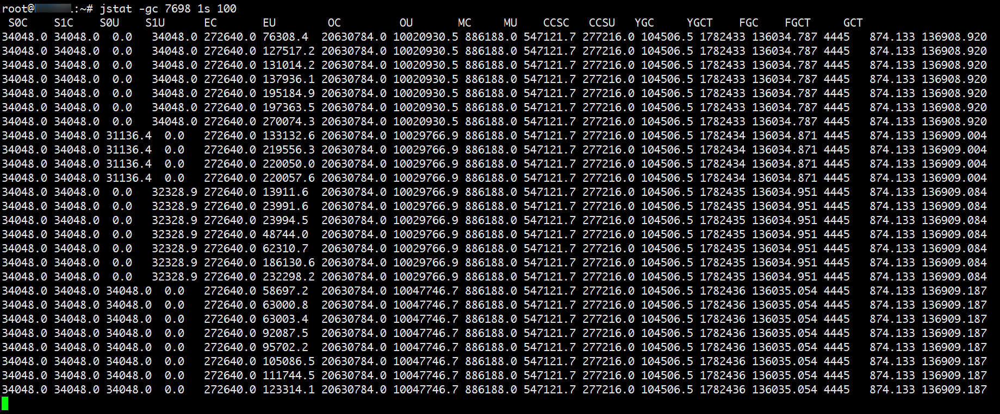
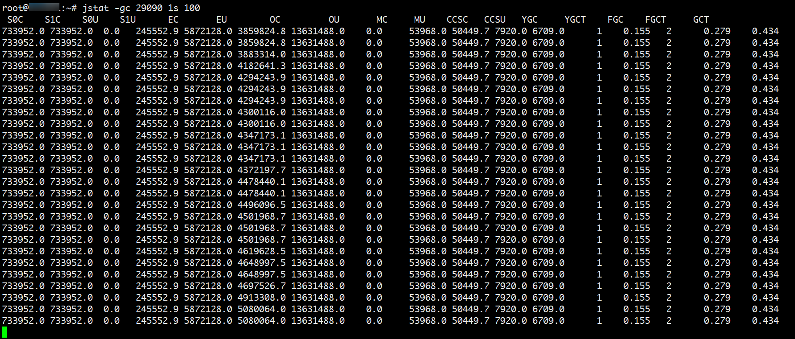

# ES 集群性能优化小记录

虽然 Elasticsearch 本身提供的默认配置已经能够支持一般大数据的搜索和分析，但是由于公司对接的数据量非常大，所以在扩充硬件资源的同时，也需要对 ES 集群本身进行调优和分析。

本文整理了在工作中涉及到的一些调优项目。

## 文件句柄优化

Elasticsearch 有大量的查询数据和插入数据的请求，需要大量文件句柄，当前服务器系统默认的是 1024 个文件句柄。如果文件句柄用完了，这就意味着操作系统会拒绝连接，意味着数据可能丢失，这是灾难性的后果，

登陆服务器，用命令查看一下：

```bash
ulimit -a
```

结果中的 `open files` 后面的数字就是文件句柄的个数，一般对于 ES 节点，可以修改为 `655360` 以应对大量请求。

临时修改可以通过执行以下命令，即可立即生效，但是机器重启后又会失效：

```bash
ulimit -n 655360
```

永久生效，修改 `/etc/security/limits.conf`，需要重启机器生效：

```bash
elasticsearch - nofile 655360
```

上述配置中 `elasticsearch` 为启动 ES 的用户，设置了该用户的文件句柄为 `655360`。

## JVM 参数优化

Elasticsearch 是运行在 JVM 上的，对其做 JVM 参数调优至关重要。最常见的调优是 Java 内存的分配。

### 分配多少内存给 ES

在实际开发中，我们对装 ES 的机器进行了升级，从最初的 16G 内存升级到了目前的 32G 内存。有的客户预算比较高的，每个 ES 节点都会采用 64G 甚至更高的机器。

但是不是把内存全部分配给 ES？官方给出的解决方案是：把一半（少于）的内存留给 Lucene，另外的内存分配给 Elasticsearch。

内存对于 ES 来说绝对是重要的，它可以被许多内存数据结构使用来提供更快的操作。但是说到这里，还有另外一个内存消耗大户，非堆内存 (off-heap)：Lucene。

Lucene 被设计为可以利用操作系统底层机制来缓存内存数据结构。Lucene 的段是分别存储到单个文件中的。因为段是不可变的，这些文件也都不会变化，这是对缓存友好的，同时操作系统也会把这些段文件缓存起来，以便更快的访问。

Lucene 的性能取决于和操作系统的相互作用。如果你把所有的内存都分配给 ES 的堆内存，那将不会有剩余的内存交给 Lucene，这将严重地影响全文检索的性能。

标准的建议是把 50% 的可用内存作为 Elasticsearch 的堆内存，保留剩下的 50％。当然它也不会被浪费，Lucene 会很乐意利用起余下的内存。

我们实际的解决办法是将机器的一半内存分给 Elasticsearch 的堆，栈内存、方法区、常量池、非堆内存占用另外一半。

### 分配的内存不要超过 32G

有的客户很大方，配备的集群都是 64G 甚至更高配置的服务器，但这个时候不能按照 50% 这个比例给 ES 分配内存了。

有这样一个原则：**分配给堆的最大内存应该小于 32766MB（≈31.99GB）**。

JVM 在内存小于 32 GB 的时候会采用一个内存对象指针压缩技术。

对于 32 位的系统，意味着堆内存大小最大为 4GB。对于 64 位的系统，可以使用更大的内存，但是 64 位的指针意味着更大的浪费，因为你的指针本身大了。更糟糕的是，更大的指针在主内存和各级缓存（例如 LLC，L1 等）之间移动数据的时候，会占用更多的带宽。

Java 使用一个叫作内存指针压缩（compressed oops）的技术来解决这个问题。它的指针不再表示对象在内存中的精确位置，而是表示偏移量。这意味着 32 位的指针可以引用 40 亿个对象，而不是 40 亿个字节。最终，也就是说堆内存增长到 32GB 的物理内存，也可以用 32 位的指针表示。

一旦你越过那个神奇的 32GB 的边界，指针就会切回普通对象的指针。每个对象的指针都变长了，就会使用更多的 CPU 内存带宽，也就是说你实际上失去了更多的内存。事实上，当内存到达 40–50GB 的时候，有效内存才相当于使用内存对象指针压缩技术时候的 32 GB 内存。

这段描述的意思就是说：即便你有足够的内存，也尽量不要超过 32GB。因为它浪费了内存，降低了 CPU 的性能，还要让 GC 应对大内存。

在 Elasticsearch 的配置文件 `jvm.options` 文件配置堆内存：

```
# 设置堆内存最小值
-Xms20g
# 设置堆内存最大值
-Xmx20g
```

::: tip 小贴士：-Xms 与 -Xmx 大小相同
在 JVM 的参数中如果 -Xms 和 -Xmx 设置的不一致，在初始化时只会初始 -Xms 大小的空间存储信息，每当空间不够用时再向操作系统申请，这样的话必然要进行一次 GC，GC 会带来 STW（Stop The World）。而剩余空间很多时，会触发缩容。再次不够用时再扩容，如此反复，这些过程会影响系统性能。
:::

### 新生代和老年代内存比例

JVM 内存分为新生代和老生代：

* 新生代（或者伊甸园）  
  新实例化的对象分配的空间。新生代空间通常都非常小，一般在 100MB–500MB。新生代也包含两个幸存空间。
* 老生代 
  较老的对象存储的空间。这些对象预计将长期留存并持续上很长一段时间。老生代通常比新生代大很多。

新生代、老生代的垃圾回收都有一个阶段会「stop the world」。在这段时间里，JVM 停止了程序运行，以便对对象进行可达性分析，收集死亡对象。在这个时间停止阶段，一切都不会发生。请求不被服务，ping 不被回应，分片不被分配。整个世界都真的停止了。

对于新生代，这不是什么大问题；那么小的空间意味着 GC 会很快执行完。但是老生代大很多，而这里面一个慢 GC 可能就意味着 1 秒乃至 15 秒的暂停——对于服务器软件来说这是不可接受的。

可以通过以下命令查看 ES 进程的 GC 情况：

```bash
# 一秒一刷执行100次，执行一次，遇不到gc 
jstat -gc es-pid 1s 100
```

<div style="text-align: center;">
  
  <p style="text-align: center; color: #888;">（使用 jstat -gc 查看内存分配情况）</p>
</div>

其中每列说明（容量的单位都是 KB）：

* **S0C**：第一个幸存区的大小（S0 Capacity）
* **S1C**：第二个幸存区的大小（S1 Capacity）
* **S0U**：第一个幸存区的使用大小（S0 Used）
* **S1U**：第二个幸存区的使用大小（S1 Used）
* **EC**：伊甸园区的大小（Eden Capacity）
* **EU**：伊甸园区的使用大小（Eden Used）
* **OC**：老年代大小（Old Capacity）
* **OU**：老年代使用大小（Old Used）
* **MC**：元空间大小（Metaspace Capacity)
* **MU**：元空间使用大小（Metaspace Used）
* **CCSC**：压缩类空间大小 （Compressed class space capacity）
* **CCSU**：压缩类空间使用大小（Compressed class space used）
* **YGC**：年轻代垃圾回收次数（young gc）
* **YGCT**：年轻代垃圾回收消耗时间（young gc time）
* **FGC**：对堆内存整体包含新生代，老年代，永久代进行垃圾回收次数（full gc）
* **FGCT**：对堆内存整体包含新生代，老年代，永久代进行垃圾回收消耗时间（full gc time）
* **GCT**：垃圾回收消耗总时间（gc time）

从图中可以看到，我这台 ES 节点目前：

* 新生代大小（S0C+S1C+EC）为：(34080+34080+272640)/1024 = 332.8125 MB
* 老生代大小为（OC）：20630784/1024 = 20147.25 MB
* 新生代:老生代 ≈ 1:60

从 `jstat gc` 结果中也可以看出来，每秒的 eden 增长速度非常快，很快就满了。而 `0.0` 换列的那个地方就是发生了 Young GC。

实际上我们在生产中也遇到了这样的问题：Young GC 很频繁，累积耗时非常多。有时候在大吞吐量数据的场景下，频繁 GC 导致 ES 集群卡死，很长时间才恢复。

::: tip 小贴士：新生代过小，老年代过大的影响
* 新生代过小
  * 会导致新生代 Eden 区很快用完，而触发 Young GC，Young GC 的过程中会 STW（Stop The World），也就是所有工作线程停止，只有 GC 的线程在进行垃圾回收，这会导致 ES 短时间停顿。频繁的 Young GC，积少成多，对系统性能影响较大。
  * 大部分对象很快进入老年代，老年代很容易用完而触发 Full GC。
* 老生代过大
  * 会导致 Full GC 的执行时间过长，Full GC 虽然有并行处理的步骤，但是还是比 Young GC 的 STW 时间更久，而 GC 导致的停顿时间在几十毫秒到几秒内，很影响 ES 的性能，同时也会导致请求 ES 服务端的客户端在一定时间内没有响应而发生 timeout 异常，导致请求失败。
:::

结合上面的 `老生代:新生代 ≈ 60:1`，显然对于这台机器而言，新生代分配的内存太小了，因此需要手动进行以下设置。

那一般我们给新生代和老年代分配多大的内存呢？他们的比例是多少呢？

一般来说，老生代和新生代的内存比例为 2：1 是比较合适的。比如给堆内存分配 20G，则新生代分配大约 7G，其余都给老年代。修改 Elasticsearch 的配置文件 `jvm.options`，加上：

```
-XX:NewSize=7g
-XX:MaxNewSize=7g
```

老年代则自动分配 20-7=13G 内存，新生代老年代的比例约为 1:2。修改后每次 Young GC 频率更低，且每次 GC 后只有少数数据会进入老年代，如下图所示：

<div style="text-align: center;">
  
  <p style="text-align: center; color: #888;">（调整后使用 jstat -gc 查看内存分配情况）</p>
</div>

从图中可以看到，修改后我这台 ES 节点：

* 新生代大小（S0C+S1C+EC）为：(733962+733962+5872128)/1024 = 7168 MB
* 老生代大小为（OC）：13631488/1024 = 13312 MB
* 新生代:老生代 ≈ 1:2

::: tip 小贴士：新老生代默认比例（1:2）未生效
这里有一个细节，就是 ES 默认有个配置（`-XX:NewRatio=2`）指定了 `老生代:新生代 = 1:2`，但由于 JDK8 默认使用的垃圾回收器是：老年代（CMS）+ 新生代（ParNew），

如果没有显示设置新生代大小，JVM 在使用 CMS 收集器时会自动调参，这个时候新生代的大小在没有设置的情况下是通过计算得出的，其大小可能与 NewRatio 的默认配置没什么关系。

这个时候建议还是通过 `-XX:NewSize`、`-XX:MaxNewSize` 或者 `-xmn` 这些参数来显式设置下比较好。—— 参考[CMS GC 默认新生代是多大？](https://www.jianshu.com/p/832fc4d4cb53)
:::

### 使用 G1 垃圾回收器

前面说，如果是 JDK8，ES 默认使用的垃圾回收器是：老年代（CMS）+ 新生代（ParNew）。如果是 JDK9，ES 默认使用 G1 垃圾回收器，据说它的内部算法能够在垃圾回收的时候，尽量把垃圾回收对系统造成的影响控制在我们指定的时间范围内，同时在有限的时间内尽量回收更多的垃圾对象。因此 G1 垃圾回收器一般在大数量、大内存的情况下有更好的性能。

因为使用的是 JDK8，所以并未切换垃圾回收器。后续如果再有性能问题再切换 G1 垃圾回收器，测试是否有更好的性能。切换的方式如下：

修改 `jvm.options`，把原先的：

```
## GC configuration
-XX:+UseConcMarkSweepGC
-XX:CMSInitiatingOccupancyFraction=75
-XX:+UseCMSInitiatingOccupancyOnly
```

修改为：

```
## GC configuration
-XX:+UseG1GC
-XX:MaxGCPauseMillis=200
# -XX:+UseConcMarkSweepGC
# -XX:CMSInitiatingOccupancyFraction=75
# -XX:+UseCMSInitiatingOccupancyOnly
```

其中：`-XX:MaxGCPauseMillis` 是控制预期的最高 GC 时长，默认值为 200ms，如果线上业务特性对于 GC 停顿非常敏感，可以适当设置低一些。但是这个值如果设置过小，可能会带来比较高的 CPU 消耗。

从网上的一些数据来看，G1 的停顿时间可以预测，相比 CMS 更加容易控制 GC 停顿时间。另外 G1 不会像 CMS 那样产生内存碎片，对于大堆回收垃圾的效率更高。使用 G1 以后，Young GC 的频率和耗时都可以极大的降低，Old GC 也会很少出现。

### 关于 GC 优化后的测试

**1）先观察新生代使用内存的增长率**

每秒打印一次 GC 数据，优化前新生代增长速度很快，几秒钟新生代就满了，导致 Young GC 触发很频繁，几秒钟就会触发一次。而每次 Young GC 很大可能有存活对象进入老生代，如果每次进入老年代的对象较多，加上频繁的 Young GC，会导致新老生代的分代模式失去作用，相当于老生代取代了新生代来存放近期内生成的对象。当老生代满了，触发 Full GC，存活的对象也会很多，因为这些对象很可能还是近期加入的，还存活着，所以一次 Full GC 回收对象不多。而这会恶性循环，老生代很快又满了，又 Full GC，又残留一大部分存活的，又很容易满了，所以导致一直频繁 Full GC。

理想状态下，优化后新生代增长速度慢了许多（比如至少要 60 秒才会满），进入老生代的对象相比优化前少了很多。因此要很久才会触发一次 Full GC。而且等到 Full GC 时，老生代里很多对象都是存活了很久的，一般都是不会被引用，所以很大一部分会被回收掉，留一个比较干净的老生代空间，可以继续放很多对象。

**2）新生代和老生代 GC 频率更低**

ES 启动后，运行几十个小时观察，优化前 Young GC 频率非常频繁，也耗时也较长。

理想状态下，Young GC 次数极大地减少，Young GC 时间也减少。Full GC 的次数和时间也随之减少。

## 关掉 swap

内存交换到磁盘对服务器性能来说是致命的。

如果内存交换到磁盘上，一个 100 微秒的操作可能变成 10 毫秒。再想想那么多 10 微秒的操作时延累加起来。不难看出 swapping 对于性能是多么可怕。

用以下命令关掉 swap：

```bash
sudo swapoff -a
```

## 合理设置最小主节点

`minimum_master_nodes` 设置及其重要，为了防止集群脑裂，这个参数应该设置的推荐个数就是 `( master 候选节点个数 / 2) + 1`。

## 分片均匀，磁盘优化，剔除掉高负载的 Master 竞选

我们在实际生产环境中遇到了有一个节点的负载是其他节点的几倍，从虚拟机监控上看，所有的节点的 qps（每秒查询数）是差不多的。机器的配置是一样的，为什么负载会有如此大的差距？

* 首先，我们怀疑数据分配不均匀，我们排查了下，没有这种现象。
* 然后，我们监控到了高负载的节点磁盘 IO 非常的高，经常达到 100%，我们怀疑是那个虚拟机磁盘性能不行。但是我们当时那个测试环境没有更好的磁盘。
* 我们找到了一个适中的解决办法是将这台高负载的节点剔除 Master 竞选，即将 `elasticsearch.yml` 文件中的 `node.master` 改为 `false` 然后重启，负载下降了一些。

## 数据存储天数的优化

存储天数的优化，这个需要根据实际的业务来，对于过期的数据，可以编写一个脚本进行定时检测和删除。

当然了网上也有一些开源的软件开源用来清理过期数据，具体看自己的需求吧。

## 集群分片设置

ES 一旦创建好索引后，就无法调整分片的设置，而在 ES 中，一个分片实际上对应一个 lucene 索引，而 lucene 索引的读写会占用很多的系统资源，因此分片数不能设置过大。所以在创建索引时，合理配置分片数是非常重要的。一般来说，我们遵循一些原则：

* 控制每个分片占用的硬盘容量不超过 ES 的最大 JVM 的堆空间设置（一般设置不超过 32G，参加上文的 JVM 设置原则），因此如果索引的总容量在 500G 左右，那分片大小在 16 个左右即可。当然，最好同时考虑原则 2。
* 考虑一下节点数量，一般一个节点有时候就是一台物理机，如果分片数过多，大大超过了节点数，很可能会导致一个节点上存在多个分片，一旦该节点故障，即使保持了 1 个以上的副本，同样有可能会导致数据丢失，集群无法恢复。所以一般都设置分片数不超过节点数的 3 倍。

## 索引优化

* 修改 `index_buffer_size` 的设置，可以设置成百分数，也可设置成具体的大小，大小可根据集群的规模做不同的设置测试。

  ```
  indices.memory.index_buffer_size      默认为整个堆空间的10%
  indices.memory.min_index_buffer_size  默认为 48MB
  indices.memory.max_index_buffer_size  默认为无限制
  ```

* `_id` 字段的使用，应尽可能避免自定义 `_id`，以避免针对 ID 的版本管理；建议使用 ES 的默认 ID 生成策略或使用数字类型 ID 作为主键。
* `_all` 字段及 `_source` 字段的使用，应该注意场景和需要，`_all` 字段包含了所有的索引字段，方便做全文检索，如果无此需求，可以禁用；`_source` 存储了原始的 document 内容，如果没有获取原始文档数据的需求，可通过设置 `includes`、`excludes` 属性来定义放入 `_source` 的字段。
* 合理的配置使用 index 属性比如 `analyzed` 和 `not_analyzed`，根据业务需求来控制字段是否分词或不分词。只有 groupby 需求的字段，配置时就设置成 `not_analyzed` 以提高查询或聚类的效率。

## 查询优化

* 查询语法优化，调整 filter 过滤顺序  
  如果把过滤效果不明显的条件放在了前面，导致查询出大量不需要的数据，会使查询变慢。应把过滤效果明显的条件提前，按照过滤效果把过滤条件排序。
* 索引时间精度优化  
  研究 Filter 的工作原理可以看出，它每次工作都是遍历整个索引的，所以时间粒度越大，对比越快，搜索时间越短，在不影响功能的情况下，时间精度越低越好，有时甚至牺牲一点精度也值得，当然最好的情况是根本不作时间限制。可以让 ES 重新刷索引，增加冗余的时间字段，精确到天。带有时间范围的查询使用该字段进行查询。
* 查询 Fetch Source 优化  
  业务查询语句获取的数据集比较大，并且从 source 中获取了非必须的字段，导致查询较慢。举例：只需要从 ES 中查询 `id` 这一个字段，却把所有字段查询了出来。

## 总结

总的来说，Elasticsearch 的优化，可以从以下几方面的考虑：

* 硬件的优化：机器分配，机器配置，机器内存，机器 CPU，机器网络，机器磁盘性能
* 操作系统设置优化：文件句柄优化、swap 关闭
* ES 合理分配节点，合理分配参加竞选 Master 的节点
* ES 的存储的优化，副本数量、索引数量、分片数量
* ES 的使用优化，索引的优化，查询的优化

（完）
