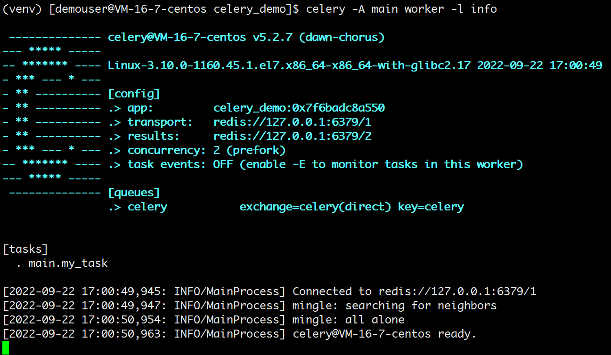
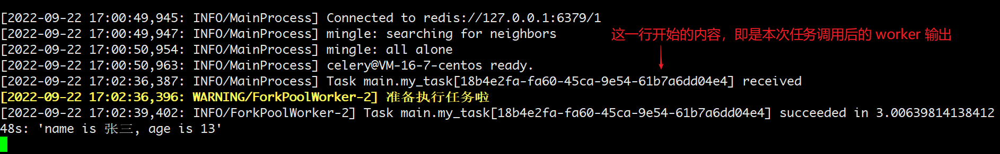
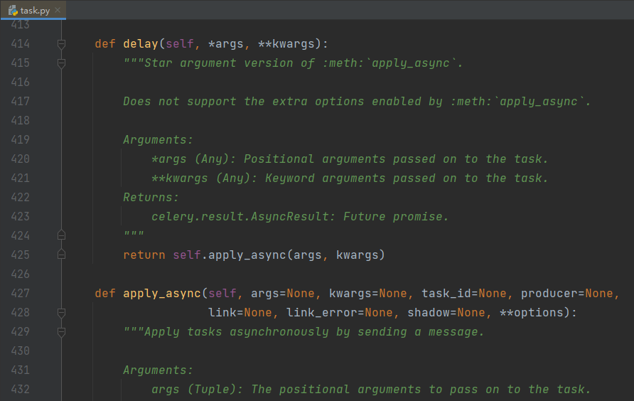
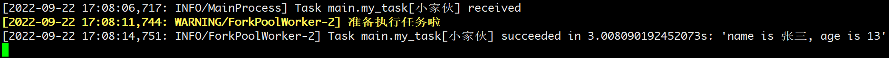
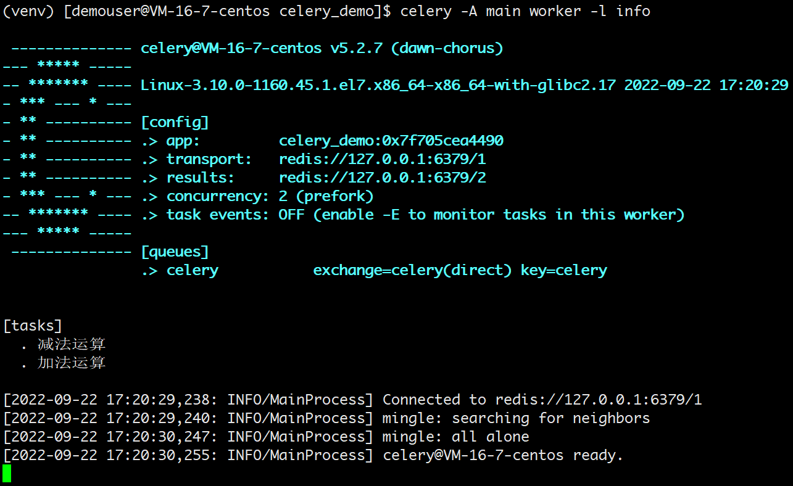

# 使用 celery 实现任务调度

> 这个库的使用需要基于 Linux 环境，本案例的环境为：
> * CentOS 7
> * Python 3.8.9
> * Redis 7
> * 其中 celery 大版本为 5，更低的版本可能用法会略微不同，具体参考官方文档。

## celery 介绍

celery 是 Python 的一个第三方模块，它本质上是一个任务调度框架。一般用来实现：

* **异步任务**：一些耗时的操作可以交给 celery 异步执行，而不用等着程序处理完才知道结果。比如：视频转码、邮件发送、消息推送等等。
* **定时任务**：比如定时推送消息、定时爬取数据、定时统计数据等等。

它的特点是：

* 灵活：处理大量消息的分布式系统，可以在多个节点之间处理某个任务
* 高可用：当任务执行失败或执行过程中发生连接中断，celery 会自动尝试重新执行任务。
* 快速：一个单进程的 celery 每分钟可处理上百万个任务。
* 开源：是一个完全基于 Python 语言编写的开源项目。

## celery 工作流程

有一点需要注意，celery 是用来调度任务的，但它本身并不具备存储任务的功能，而调度任务的时候肯定是要把任务存起来的。因此要使用 celery 的话，还需要搭配一些具备存储、访问功能的工具，比如：消息队列、Redis 缓存、数据库等等。

一般最常用的是 RabbitMQ 或者 Redis，而我接下来的演示都会使用 Redis。

先来看一下 celery 的工作流程图：

<div style="text-align: center;">
  <svg id="SvgjsSvg1006" width="506.6000061035156" height="535.3999786376953" xmlns="http://www.w3.org/2000/svg" version="1.1" xmlns:xlink="http://www.w3.org/1999/xlink" xmlns:svgjs="http://svgjs.com/svgjs"><defs id="SvgjsDefs1007"><marker id="SvgjsMarker1034" markerWidth="12" markerHeight="8" refX="9" refY="4" viewBox="0 0 12 8" orient="auto" markerUnits="userSpaceOnUse" stroke-dasharray="0,0"><path id="SvgjsPath1035" d="M0,0 L12,4 L0,8 L0,0" fill="#323232" stroke="#323232" stroke-width="1"></path></marker><marker id="SvgjsMarker1038" markerWidth="12" markerHeight="8" refX="9" refY="4" viewBox="0 0 12 8" orient="auto" markerUnits="userSpaceOnUse" stroke-dasharray="0,0"><path id="SvgjsPath1039" d="M0,0 L12,4 L0,8 L0,0" fill="#323232" stroke="#323232" stroke-width="1"></path></marker><marker id="SvgjsMarker1064" markerWidth="12" markerHeight="8" refX="9" refY="4" viewBox="0 0 12 8" orient="auto" markerUnits="userSpaceOnUse" stroke-dasharray="0,0"><path id="SvgjsPath1065" d="M0,0 L12,4 L0,8 L0,0" fill="#323232" stroke="#323232" stroke-width="1"></path></marker><marker id="SvgjsMarker1068" markerWidth="12" markerHeight="8" refX="9" refY="4" viewBox="0 0 12 8" orient="auto" markerUnits="userSpaceOnUse" stroke-dasharray="0,0"><path id="SvgjsPath1069" d="M0,0 L12,4 L0,8 L0,0" fill="#323232" stroke="#323232" stroke-width="1"></path></marker><marker id="SvgjsMarker1072" markerWidth="12" markerHeight="8" refX="9" refY="4" viewBox="0 0 12 8" orient="auto" markerUnits="userSpaceOnUse" stroke-dasharray="0,0"><path id="SvgjsPath1073" d="M0,0 L12,4 L0,8 L0,0" fill="#323232" stroke="#323232" stroke-width="1"></path></marker><marker id="SvgjsMarker1084" markerWidth="12" markerHeight="8" refX="9" refY="4" viewBox="0 0 12 8" orient="auto" markerUnits="userSpaceOnUse" stroke-dasharray="0,0"><path id="SvgjsPath1085" d="M0,0 L12,4 L0,8 L0,0" fill="#323232" stroke="#323232" stroke-width="1"></path></marker><marker id="SvgjsMarker1088" markerWidth="12" markerHeight="8" refX="9" refY="4" viewBox="0 0 12 8" orient="auto" markerUnits="userSpaceOnUse" stroke-dasharray="0,0"><path id="SvgjsPath1089" d="M0,0 L12,4 L0,8 L0,0" fill="#323232" stroke="#323232" stroke-width="1"></path></marker><marker id="SvgjsMarker1092" markerWidth="12" markerHeight="8" refX="9" refY="4" viewBox="0 0 12 8" orient="auto" markerUnits="userSpaceOnUse" stroke-dasharray="0,0"><path id="SvgjsPath1093" d="M0,0 L12,4 L0,8 L0,0" fill="#323232" stroke="#323232" stroke-width="1"></path></marker></defs><g id="SvgjsG1008" transform="translate(60.79999542236328,24.999990463256836)"><path id="SvgjsPath1009" d="M 0 4Q 0 0 4 0L 127 0Q 131 0 131 4L 131 50Q 131 54 127 54L 4 54Q 0 54 0 50Z" stroke="none" fill-opacity="1" fill="#d1f0eb"></path><g id="SvgjsG1010"><text id="SvgjsText1011" font-family="微软雅黑" text-anchor="middle" font-size="14px" width="111px" fill="#323232" font-weight="400" align="middle" lineHeight="150%" anchor="middle" family="微软雅黑" size="14px" weight="400" font-style="" opacity="1" y="1.5" transform="rotate(0)"><tspan id="SvgjsTspan1012" dy="21" x="65.5"><tspan id="SvgjsTspan1013" style="text-decoration:;">异步任务</tspan></tspan><tspan id="SvgjsTspan1014" dy="21" x="65.5"><tspan id="SvgjsTspan1015" style="text-decoration:;">（async task）</tspan></tspan></text></g></g><g id="SvgjsG1016" transform="translate(329.39998626708984,24.999990463256836)"><path id="SvgjsPath1017" d="M 0 4Q 0 0 4 0L 127 0Q 131 0 131 4L 131 50Q 131 54 127 54L 4 54Q 0 54 0 50Z" stroke="none" fill-opacity="1" fill="#d0d8ff"></path><g id="SvgjsG1018"><text id="SvgjsText1019" font-family="微软雅黑" text-anchor="middle" font-size="14px" width="111px" fill="#323232" font-weight="400" align="middle" lineHeight="150%" anchor="middle" family="微软雅黑" size="14px" weight="400" font-style="" opacity="1" y="1.5" transform="rotate(0)"><tspan id="SvgjsTspan1020" dy="21" x="65.5"><tspan id="SvgjsTspan1021" style="text-decoration:;">定时任务</tspan></tspan><tspan id="SvgjsTspan1022" dy="21" x="65.5"><tspan id="SvgjsTspan1023" style="text-decoration:;">（celery beat）</tspan></tspan></text></g></g><g id="SvgjsG1024" transform="translate(187.59999084472656,168.39999198913574)"><path id="SvgjsPath1025" d="M 0 4Q 0 0 4 0L 127 0Q 131 0 131 4L 131 50Q 131 54 127 54L 4 54Q 0 54 0 50Z" stroke="none" fill-opacity="1" fill="#ffd9d8"></path><g id="SvgjsG1026"><text id="SvgjsText1027" font-family="微软雅黑" text-anchor="middle" font-size="14px" width="111px" fill="#323232" font-weight="400" align="middle" lineHeight="150%" anchor="middle" family="微软雅黑" size="14px" weight="400" font-style="" opacity="1" y="1.5" transform="rotate(0)"><tspan id="SvgjsTspan1028" dy="21" x="65.5"><tspan id="SvgjsTspan1029" style="text-decoration:;">消息中间件</tspan></tspan><tspan id="SvgjsTspan1030" dy="21" x="65.5"><tspan id="SvgjsTspan1031" style="text-decoration:;">（broker）</tspan></tspan></text></g></g><g id="SvgjsG1032"><path id="SvgjsPath1033" d="M126.29999542236328 78.99999046325684L222.24549290715788 167.7174068366799" stroke-dasharray="8,5" stroke="#323232" stroke-width="1" fill="none" marker-end="url(#SvgjsMarker1034)"></path></g><g id="SvgjsG1036"><path id="SvgjsPath1037" d="M394.89998626708984 78.99999046325684L283.21757299663705 167.7909722925902" stroke-dasharray="8,5" stroke="#323232" stroke-width="1" fill="none" marker-end="url(#SvgjsMarker1038)"></path></g><g id="SvgjsG1040" transform="translate(25,307.99999046325684)"><path id="SvgjsPath1041" d="M 0 4Q 0 0 4 0L 134.59999084472656 0Q 138.59999084472656 0 138.59999084472656 4L 138.59999084472656 49.599998474121094Q 138.59999084472656 53.599998474121094 134.59999084472656 53.599998474121094L 4 53.599998474121094Q 0 53.599998474121094 0 49.599998474121094Z" stroke="none" fill-opacity="1" fill="#ffedd2"></path><g id="SvgjsG1042"><text id="SvgjsText1043" font-family="微软雅黑" text-anchor="middle" font-size="14px" width="119px" fill="#323232" font-weight="400" align="middle" lineHeight="150%" anchor="middle" family="微软雅黑" size="14px" weight="400" font-style="" opacity="1" y="1.2999992370605469" transform="rotate(0)"><tspan id="SvgjsTspan1044" dy="21" x="69.5"><tspan id="SvgjsTspan1045" style="text-decoration:;">任务执行单元</tspan></tspan><tspan id="SvgjsTspan1046" dy="21" x="69.5"><tspan id="SvgjsTspan1047" style="text-decoration:;">（celery worker）</tspan></tspan></text></g></g><g id="SvgjsG1048" transform="translate(342.59999084472656,307.99999046325684)"><path id="SvgjsPath1049" d="M 0 4Q 0 0 4 0L 134.59999084472656 0Q 138.59999084472656 0 138.59999084472656 4L 138.59999084472656 49.599998474121094Q 138.59999084472656 53.599998474121094 134.59999084472656 53.599998474121094L 4 53.599998474121094Q 0 53.599998474121094 0 49.599998474121094Z" stroke="none" fill-opacity="1" fill="#ffedd2"></path><g id="SvgjsG1050"><text id="SvgjsText1051" font-family="微软雅黑" text-anchor="middle" font-size="14px" width="119px" fill="#323232" font-weight="400" align="middle" lineHeight="150%" anchor="middle" family="微软雅黑" size="14px" weight="400" font-style="" opacity="1" y="1.2999992370605469" transform="rotate(0)"><tspan id="SvgjsTspan1052" dy="21" x="69.5"><tspan id="SvgjsTspan1053" style="text-decoration:;">任务执行单元</tspan></tspan><tspan id="SvgjsTspan1054" dy="21" x="69.5"><tspan id="SvgjsTspan1055" style="text-decoration:;">（celery worker）</tspan></tspan></text></g></g><g id="SvgjsG1056" transform="translate(183.79999542236328,307.99999046325684)"><path id="SvgjsPath1057" d="M 0 4Q 0 0 4 0L 134.59999084472656 0Q 138.59999084472656 0 138.59999084472656 4L 138.59999084472656 49.599998474121094Q 138.59999084472656 53.599998474121094 134.59999084472656 53.599998474121094L 4 53.599998474121094Q 0 53.599998474121094 0 49.599998474121094Z" stroke="none" fill-opacity="1" fill="#ffedd2"></path><g id="SvgjsG1058"><text id="SvgjsText1059" font-family="微软雅黑" text-anchor="middle" font-size="14px" width="119px" fill="#323232" font-weight="400" align="middle" lineHeight="150%" anchor="middle" family="微软雅黑" size="14px" weight="400" font-style="" opacity="1" y="11.799999237060547" transform="rotate(0)"><tspan id="SvgjsTspan1060" dy="21" x="69.5"><tspan id="SvgjsTspan1061" style="text-decoration:;">......</tspan></tspan></text></g></g><g id="SvgjsG1062"><path id="SvgjsPath1063" d="M94.29999542236328 307.99999046325684L219.12651793682755 222.73325410738425" stroke-dasharray="8,5" stroke="#323232" stroke-width="1" fill="none" marker-end="url(#SvgjsMarker1064)"></path></g><g id="SvgjsG1066"><path id="SvgjsPath1067" d="M253.09999084472656 307.99999046325684L253.09999084472656 223.69999198913575" stroke-dasharray="8,5" stroke="#323232" stroke-width="1" fill="none" marker-end="url(#SvgjsMarker1068)"></path></g><g id="SvgjsG1070"><path id="SvgjsPath1071" d="M411.89998626708984 307.99999046325684L293.25574535538544 222.75851737886182" stroke-dasharray="8,5" stroke="#323232" stroke-width="1" fill="none" marker-end="url(#SvgjsMarker1072)"></path></g><g id="SvgjsG1074" transform="translate(187.59999084472656,456.39999198913574)"><path id="SvgjsPath1075" d="M 0 4Q 0 0 4 0L 127 0Q 131 0 131 4L 131 50Q 131 54 127 54L 4 54Q 0 54 0 50Z" stroke="none" fill-opacity="1" fill="#f2c32b"></path><g id="SvgjsG1076"><text id="SvgjsText1077" font-family="微软雅黑" text-anchor="middle" font-size="14px" width="111px" fill="#323232" font-weight="400" align="middle" lineHeight="150%" anchor="middle" family="微软雅黑" size="14px" weight="400" font-style="" opacity="1" y="1.5" transform="rotate(0)"><tspan id="SvgjsTspan1078" dy="21" x="65.5"><tspan id="SvgjsTspan1079" style="text-decoration:;">结果存储</tspan></tspan><tspan id="SvgjsTspan1080" dy="21" x="65.5"><tspan id="SvgjsTspan1081" style="text-decoration:;">（backend）</tspan></tspan></text></g></g><g id="SvgjsG1082"><path id="SvgjsPath1083" d="M253.09999084472656 361.59998893737793L253.09999084472656 455.0999919891358" stroke-dasharray="8,5" stroke="#323232" stroke-width="1" fill="none" marker-end="url(#SvgjsMarker1084)"></path></g><g id="SvgjsG1086"><path id="SvgjsPath1087" d="M94.29999542236328 361.59998893737793L211.18770652506964 455.78433031296913" stroke-dasharray="8,5" stroke="#323232" stroke-width="1" fill="none" marker-end="url(#SvgjsMarker1088)"></path></g><g id="SvgjsG1090"><path id="SvgjsPath1091" d="M411.89998626708984 361.59998893737793L289.23101227175414 455.80817081535747" stroke-dasharray="8,5" stroke="#323232" stroke-width="1" fill="none" marker-end="url(#SvgjsMarker1092)"></path></g><g id="SvgjsG1094" transform="translate(144.20000457763672,104.0999927520752)"><path id="SvgjsPath1095" d="M 0 0L 47.59999084472656 0L 47.59999084472656 31.199996948242188L 0 31.199996948242188Z" stroke-dasharray="10,6" stroke="rgba(50,50,50,1)" stroke-width="1" fill-opacity="1" fill="#ffffff"></path><g id="SvgjsG1096"><text id="SvgjsText1097" font-family="微软雅黑" text-anchor="middle" font-size="13px" width="28px" fill="#323232" font-weight="400" align="middle" lineHeight="125%" anchor="middle" family="微软雅黑" size="13px" weight="400" font-style="" opacity="1" y="4.974998474121094" transform="rotate(0)"><tspan id="SvgjsTspan1098" dy="16" x="24"><tspan id="SvgjsTspan1099" style="text-decoration:;">发送</tspan></tspan></text></g></g><g id="SvgjsG1100" transform="translate(322.39998626708984,104.0999927520752)"><path id="SvgjsPath1101" d="M 0 0L 47.399986267089844 0L 47.399986267089844 31.199996948242188L 0 31.199996948242188Z" stroke-dasharray="10,6" stroke="rgba(50,50,50,1)" stroke-width="1" fill-opacity="1" fill="#ffffff"></path><g id="SvgjsG1102"><text id="SvgjsText1103" font-family="微软雅黑" text-anchor="middle" font-size="13px" width="28px" fill="#323232" font-weight="400" align="middle" lineHeight="125%" anchor="middle" family="微软雅黑" size="13px" weight="400" font-style="" opacity="1" y="4.974998474121094" transform="rotate(0)"><tspan id="SvgjsTspan1104" dy="16" x="24"><tspan id="SvgjsTspan1105" style="text-decoration:;">发送</tspan></tspan></text></g></g><g id="SvgjsG1106" transform="translate(129.79999542236328,251.79999351501465)"><path id="SvgjsPath1107" d="M 0 0L 47.399986267089844 0L 47.399986267089844 31.199996948242188L 0 31.199996948242188Z" stroke-dasharray="10,6" stroke="rgba(50,50,50,1)" stroke-width="1" fill-opacity="1" fill="#ffffff"></path><g id="SvgjsG1108"><text id="SvgjsText1109" font-family="微软雅黑" text-anchor="middle" font-size="13px" width="28px" fill="#323232" font-weight="400" align="middle" lineHeight="125%" anchor="middle" family="微软雅黑" size="13px" weight="400" font-style="" opacity="1" y="4.974998474121094" transform="rotate(0)"><tspan id="SvgjsTspan1110" dy="16" x="24"><tspan id="SvgjsTspan1111" style="text-decoration:;">监控</tspan></tspan></text></g></g><g id="SvgjsG1112" transform="translate(229.39999771118164,251.79999351501465)"><path id="SvgjsPath1113" d="M 0 0L 47.399986267089844 0L 47.399986267089844 31.199996948242188L 0 31.199996948242188Z" stroke-dasharray="10,6" stroke="rgba(50,50,50,1)" stroke-width="1" fill-opacity="1" fill="#ffffff"></path><g id="SvgjsG1114"><text id="SvgjsText1115" font-family="微软雅黑" text-anchor="middle" font-size="13px" width="28px" fill="#323232" font-weight="400" align="middle" lineHeight="125%" anchor="middle" family="微软雅黑" size="13px" weight="400" font-style="" opacity="1" y="4.974998474121094" transform="rotate(0)"><tspan id="SvgjsTspan1116" dy="16" x="24"><tspan id="SvgjsTspan1117" style="text-decoration:;">监控</tspan></tspan></text></g></g><g id="SvgjsG1118" transform="translate(329.39998626708984,251.79999351501465)"><path id="SvgjsPath1119" d="M 0 0L 47.399986267089844 0L 47.399986267089844 31.199996948242188L 0 31.199996948242188Z" stroke-dasharray="10,6" stroke="rgba(50,50,50,1)" stroke-width="1" fill-opacity="1" fill="#ffffff"></path><g id="SvgjsG1120"><text id="SvgjsText1121" font-family="微软雅黑" text-anchor="middle" font-size="13px" width="28px" fill="#323232" font-weight="400" align="middle" lineHeight="125%" anchor="middle" family="微软雅黑" size="13px" weight="400" font-style="" opacity="1" y="4.974998474121094" transform="rotate(0)"><tspan id="SvgjsTspan1122" dy="16" x="24"><tspan id="SvgjsTspan1123" style="text-decoration:;">监控</tspan></tspan></text></g></g><g id="SvgjsG1124" transform="translate(332.39998626708984,392.59998893737793)"><path id="SvgjsPath1125" d="M 0 0L 47.399986267089844 0L 47.399986267089844 31.199996948242188L 0 31.199996948242188Z" stroke-dasharray="10,6" stroke="rgba(50,50,50,1)" stroke-width="1" fill-opacity="1" fill="#ffffff"></path><g id="SvgjsG1126"><text id="SvgjsText1127" font-family="微软雅黑" text-anchor="middle" font-size="13px" width="28px" fill="#323232" font-weight="400" align="middle" lineHeight="125%" anchor="middle" family="微软雅黑" size="13px" weight="400" font-style="" opacity="1" y="4.974998474121094" transform="rotate(0)"><tspan id="SvgjsTspan1128" dy="16" x="24"><tspan id="SvgjsTspan1129" style="text-decoration:;">存储</tspan></tspan></text></g></g><g id="SvgjsG1130" transform="translate(124.79999542236328,392.59998893737793)"><path id="SvgjsPath1131" d="M 0 0L 47.399986267089844 0L 47.399986267089844 31.199996948242188L 0 31.199996948242188Z" stroke-dasharray="10,6" stroke="rgba(50,50,50,1)" stroke-width="1" fill-opacity="1" fill="#ffffff"></path><g id="SvgjsG1132"><text id="SvgjsText1133" font-family="微软雅黑" text-anchor="middle" font-size="13px" width="28px" fill="#323232" font-weight="400" align="middle" lineHeight="125%" anchor="middle" family="微软雅黑" size="13px" weight="400" font-style="" opacity="1" y="4.974998474121094" transform="rotate(0)"><tspan id="SvgjsTspan1134" dy="16" x="24"><tspan id="SvgjsTspan1135" style="text-decoration:;">存储</tspan></tspan></text></g></g><g id="SvgjsG1136" transform="translate(229.39999771118164,392.59998893737793)"><path id="SvgjsPath1137" d="M 0 0L 47.399986267089844 0L 47.399986267089844 31.199996948242188L 0 31.199996948242188Z" stroke-dasharray="10,6" stroke="rgba(50,50,50,1)" stroke-width="1" fill-opacity="1" fill="#ffffff"></path><g id="SvgjsG1138"><text id="SvgjsText1139" font-family="微软雅黑" text-anchor="middle" font-size="13px" width="28px" fill="#323232" font-weight="400" align="middle" lineHeight="125%" anchor="middle" family="微软雅黑" size="13px" weight="400" font-style="" opacity="1" y="4.974998474121094" transform="rotate(0)"><tspan id="SvgjsTspan1140" dy="16" x="24"><tspan id="SvgjsTspan1141" style="text-decoration:;">存储</tspan></tspan></text></g></g></svg>
  <p style="text-align:center; color: #888;">（celery 工作流程图）</p>
</div>

* **async task**：异步任务生产者，专门用来生产异步任务；
* **celery beat**：任务调度器，调度器进程会读取配置文件的内容，周期性地将配置文件里面到期需要执行的任务发送给消息队列，说白了就是生产定时任务。
* **broker**：任务队列，用于存放生产者和调度器生产的任务。一般使用消息队列或者 Redis 来存储，当然具有存储功能的数据库也是可以的。这一部分是 celery 所不提供的，需要依赖第三方。作用就是接收任务，存进队列。
* **celery worker**：任务的执行单元，会将任务从队列中顺序取出并执行。
* **backend**：用于在任务结束之后保存状态信息和结果，以便查询，一般是数据库，当然只要具备存储功能都可以作为 backend。

## 安装 celery

celery 的安装比较简单，直接 `pip install celery` 即可。这里我本地的 Python 版本是 3.8.9，celery 版本是 5.2.7。

另外，由于 celery 本身不提供任务存储的功能，所以这里我使用 Redis 作为消息队列，负责存储任务。

后续 celery 就会将任务存到 broker 里面，要想实现这一点，就必须还要有能够操作相应 broker 的驱动。Python 操作 Redis 的驱动也叫 redis，操作 RabbitMQ 的驱动叫 pika，根据实际情况选择，安装方式如下：

```bash
# Redis 驱动
pip install redis

# RabbitMQ 驱动
pip install pika
```

## 最简易代码示例

### celery 实现异步任务

#### 1）编写任务

新建一个 `main.py`：

```python
# celery_demo/main.py
import time
from celery import Celery

broker_url = "redis://127.0.0.1:6379/1"
result_backend = "redis://127.0.0.1:6379/2"

app = Celery(
    "celery_demo",
    broker=broker_url,
    backend=result_backend
)


@app.task
def my_task(name, age):
    print("准备执行任务啦")
    time.sleep(3)
    return f"name is {name}, age is {age}"
```

* `broker_url` 配置 Redis 数据库地址，格式为 `redis://:password@hostname:port/db_number`。
* `result_backend` 配置任务结果存储位置，将保存每个任务的执行结果。
* 实例化 `Celery` 类
  * 第一个参数是指定一个 `name`，名称可自定义
  * 后面两个参数分别是 broker 的地址、backend 的地址

这里需要注意的是，只有通过 `@app.task` 装饰后的函数，后面才可以通过 `my_task.delay` 来创建成一个待执行的任务。

::: tip 小贴士

函数被 `@app.task` 装饰之后，可以理解为它就变成了一个任务工厂，然后调用任务工厂的 `delay` 方法即可创建任务并发送到队列里面。我们也可以创建很多个任务工厂，但是这些任务工厂必须要让 worker 知道，否则不会生效。所以如果修改了某个任务工厂、或者添加、删除了某个任务工厂，那么一定要让 worker 知道，而做法就是先停止 celery worker 进程，然后再重新启动。

如果我们新建了一个任务工厂，然后在没有重启 worker 的情况下，就用调用它的 delay 方法创建任务、并发送到队列的话，那么会抛出一个 `KeyError`，提示找不到相应的任务工厂。

这点其实很好理解，因为代码已经加载到内存里面了，光修改了源文件而不重启是没用的。因为加载到内存里面的还是原来的代码，不是修改过后的。
:::

#### 2）启动 work

我们说执行任务的对象是 worker，那么我们是不是需要创建一个 worker 呢？显然是需要的，而创建 worker 可以使用如下命令创建：

```bash
celery -A main worker -l info
```

* -A 参数：表示 celery 对象所在的 py 文件的文件名，会自动记录 `main.py`（上述示例）里面被 `@app.task` 装饰的函数。
* -l 参数：日志级别
* -c 参数：表示明发数量，比如再加上 `-c 10`，表示限制并发数量为 10。
* -D：启动 worker 默认是前台启动，加上 `-D` 会后台启动。

执行命令后可以看到输出如下：

<div style="text-align: center;">
  
  <p style="text-align: center; color: #888;">（启动 work）</p>
</div>

以上就是在前台启动了一个 worker，正在等待从队列中获取任务，图中也显示了相应的信息。然而此时队列中并没有任务，所以我们需要在另一个文件中创建任务并发送到队列里面去。

#### 3）创建并调用任务

再新建一个 Python 文件：

```python
# # celery_demo/test.py
import time
from main import my_task

start = time.perf_counter()
my_task.delay("张三", 13)
print(time.perf_counter() - start)
```

这个文件没几行，主要做了三件事：

* 从刚才的 `main` 中导入 `my_task`。
* 创建任务。
* 统计任务执行时间。

::: tip 小贴士
这里要注意，创建任务不是直接调用 `my_task` 函数，因为那样的话就是在本地执行了，我们的目的是将任务发送到队列里面去，进而让监听队列的 worker 从队列里面获取任务并执行。

因为在 `main.py` 里面，`my_task` 被 `@app.task` 装饰了，所以我们需要调用它的 `delay` 方法。

调用 `delay` 之后，就会创建一个任务，然后发送到队列里面去（也就是我们这里的 Redis）。至于参数，普通函数调用的时候怎么传，在 `delay` 里面依旧怎么传。
:::

现在，执行该文件，发现只用了约 0.07 秒，而 `my_task` 函数里面明明 sleep 了 3 秒。所以说明这一步是不会阻塞的，调用 `my_task.delay` 只是创建一个任务并发送至队列。再看一下 worker 的输出信息：

<div style="text-align: center;">
  
  <p style="text-align: center; color: #888;">（work 的输出信息）</p>
</div>

可以看到任务已经被消费者接收并且消费了，而且调用 delay 方法是不会阻塞的，花费的那 0.006 秒是用在了其他地方，比如连接 Redis 发送任务等等。

#### 4）Redis 中存储的信息

再看看 Redis 中存储的信息，1 号库用作 broker，负责存储任务；2 号库用作 backend，负责存储执行结果。我们来看 2 号库：

```bash
# 选择 2 号库
127.0.0.1:6379> select 2
OK

# 查看里面所有的 key
# 因为我只将任务执行了一遍，所以只有一个 key
127.0.0.1:6379[2]> keys *
1) "celery-task-meta-18b4e2fa-fa60-45ca-9e54-61b7a6dd04e4"

# 查看任务的相关信息，会返回一个 JSON 字符串
# 里面包含了任务的状态、返回值、异常回溯信息（如果执行没有出错则为 None）等等
127.0.0.1:6379[2]> get celery-task-meta-18b4e2fa-fa60-45ca-9e54-61b7a6dd04e4
"{\"status\": \"SUCCESS\", \"result\": \"name is \\u5f20\\u4e09, age is 13\", \"traceback\": null, \"children\": [], \"date_done\": \"2022-09-22T09:02:39.397314\", \"task_id\": \"18b4e2fa-fa60-45ca-9e54-61b7a6dd04e4\"}"

# 再看看这个 key 是否有过期时间
# 瞧，原来它会在大约 24 小时后过期，这样就不用担心数据积压了（至少大部分情况下不用去手动清除消息了）
127.0.0.1:6379[2]> ttl celery-task-meta-18b4e2fa-fa60-45ca-9e54-61b7a6dd04e4
(integer) 86191
127.0.0.1:6379[2]>
```

以上我们就启动了一个 worker 并成功消费了队列中的任务，并且还从 Redis 里面拿到了执行信息。当然啦，如果只能通过查询 backend 才能拿到信息的话，那 celery 就太不智能了。我们也可以直接从程序中获取。

### 查询任务执行信息

Redis（backend）里面存储了很多关于任务的信息，这些信息我们可以直接在程序中获取。

比如新建一个 Python 脚本去调用任务，然后打印一些结果看看：

```python
# celery_demo/test.py
from main import my_task


# 调用任务
res = my_task.delay("张三", 13)

# 打印返回值类型
print(type(res))
"""
<class 'celery.result.AsyncResult'>
"""

# 直接打印，显示任务的 id
print(res)
"""
d4f663c0-00e7-48f5-b98f-6d75bcfe4b13
"""

# 获取状态, 显然此刻没有执行完
# 因此结果是PENDING, 表示等待状态
print(res.status)
"""
PENDING
"""

# 获取 id，两种方式均可
print(res.task_id)
print(res.id)
"""
d4f663c0-00e7-48f5-b98f-6d75bcfe4b13
d4f663c0-00e7-48f5-b98f-6d75bcfe4b13
"""

# 获取任务执行结束时的时间
# 任务还没有结束, 所以返回None
print(res.date_done)
"""
None
"""

# 获取任务的返回值, 可以通过 result 或者 get()
# 注意: 如果是 result, 那么任务还没有执行完的话会直接返回 None
# 如果是 get(), 那么会阻塞直到任务完成
print(res.result)
print(res.get())
"""
None
name is 张三, age is 13
"""

# 再次查看状态和执行结束时的时间
# 发现 status 变成 SUCCESS
# date_done 变成了执行结束时的时间
print(res.status)
# 但显示的是 UTC 时间
print(res.date_done)
"""
SUCCESS
2022-09-22 07:24:47.822369
"""
```

可以打印结果可以发现，调用完任务工厂的 `delay` 方法之后，会创建一个任务并发送至队列，同时返回一个 `AsyncResult` 对象，基于此对象我们可以拿到任务执行时的所有信息，具体可参考[官方文档](https://docs.celeryq.dev/en/stable/reference/celery.result.html)。

另外我们说结果需要存储在 backend 中，如果没有配置 backend，那么获取结果的时候会报错。至于 backend，因为它是存储结果的，所以一般会保存在数据库中，因为要持久化。我这里为了方便，就还是保存在 Redis 中。

### 发送任务时指定参数

前面在发送任务到队列的时候，使用的是 `delay` 方法，里面直接传递函数所需的参数即可。

而 `delay` 方法实际上是调用的 `apply_async` 方法，它们的区别在于前者只接收函数的参数，而后者接收的参数就很多了，看看它的[源码](https://github.com/celery/celery/blob/master/celery/app/task.py)：

<div style="text-align: center;">
  
  <p style="text-align:center; color: #888;">（delay 方法和 apply_async 方法的源码）</p>
</div>

delay 方法的 `*args` 和 `**kwargs` 就是函数的参数，它会传递给 `apply_async` 的 `args` 和 `kwargs`。而其它的参数就是发送任务时所设置的一些参数，这里重点介绍一下 `apply_async` 的其它参数。

* `countdown`：倒计时，表示任务延迟多少秒之后再执行，参数为整型。
* `eta`：任务的开始时间，datetime 类型，如果指定了 countdown，那么这个参数就不应该再指定。
* `expires`：datetime 或者整型，如果到规定时间、或者未来的多少秒之内，任务还没有发送到队列被 worker 执行，那么该任务将被丢弃。
* `shadow`：重新指定任务的名称，覆盖 main.py 创建任务时日志上所指定的名字。
* `retry`：任务失败之后是否重试，bool 类型。
* `retry_policy`：重试所采用的策略，如果指定这个参数，那么 retry 必须要为 True。参数类型是一个字典，里面参数如下：
  * `max_retries`：最大重试次数，默认为 3 次。
  * `interval_start`：重试等待的时间间隔秒数，默认为 0，表示直接重试不等待。
  * `interval_step`：每次重试让重试间隔增加的秒数，可以是数字或浮点数，默认为 0.2。
  * `interval_max`：重试间隔最大的秒数，即通过 `interval_step` 增大到多少秒之后, 就不在增加了, 可以是数字或者浮点数。
* `routing_key`：自定义路由键，针对 RabbitMQ。
* `queue`：指定发送到哪个队列，针对 RabbitMQ。
* `exchange`：指定发送到哪个交换机，针对 RabbitMQ。
* `priority`：任务队列的优先级，0-9 之间，对于 RabbitMQ 而言，0是最高级。
* `serializer`：任务序列化方法，通常不设置。
* `compression`：压缩方案，通常有 zlib、bzip2。
* `headers`：为任务添加额外的消息头。
* `link`：任务成功执行后的回调方法，是一个 signature对 象，可以用作关联任务。
* `link_error`: 任务失败后的回调方法，是一个 signature 对象；

随便举个例子：

```python
# celery_demo/test.py
from main import my_task

# 使用 apply_async，要注意参数的传递
# 位置参数使用元组或者列表，关键字参数使用字典
# 因为是 args 和 kwargs，不是 *args 和 **kwargs

my_task.apply_async(['张三'], {"age": 13}, task_id="小家伙", countdown=5).get()
```

查看一下 worker 的输出：

<div style="text-align: center;">
  
  <p style="text-align: center; color: #888;">（用 apply_async 调用任务的输出）</p>
</div>

注意左边的时间，17:08:06 收到的消息，但 5 秒后才执行完毕，因为我们将 countdown 参数设置为 5。并且任务的 id 也被我们修改了。

另外还需要注意一下那些接收时间的参数，比如 eta。如果我们手动指定了eta，那么一定要注意时区的问题，要保证 celery 所使用的时区和你传递的 datetime 的时区是统一的。

其它的参数可以自己手动测试一下，这里不细说了，根据自身的业务选择合适的参数即可。

### Task 对象的一些参数

我们之前通过对一个函数使用 `@app.task` 即可将其变成一个任务工厂，而这个任务工厂就是一个 Task 实例对象。而我们在使用 `@app.task` 的时候，其实是可以加上很多的参数的，常用参数如下：

* `name`：默认的任务名是一个 uuid，我们可以通过 name 参数指定任务名，当然这个 name 就是 `apply_async` 的参数 name。如果在 `apply_async` 中指定了，那么以 `apply_async` 指定的为准。
* `bind`：一个 bool 值，表示是否和任务工厂进行绑定。如果绑定，任务工厂会作为参数传递到方法中。
* `base`：定义任务的基类，用于定义回调函数，当任务到达某个状态时触发不同的回调函数，默认是 Task，所以我们一般会自己写一个类然后继承 Task。
* `default_retry_delay`：设置该任务重试的延迟机制，当任务执行失败后，会自动重试，单位是秒，默认是 3 分钟。
* `serializer`：指定序列化的方法。

当然 `app.task` 还有很多不常用的参数，这里就不说了，有兴趣可以去查看[官网](https://docs.celeryq.dev/en/stable/userguide/tasks.html#list-of-options)或[源码](https://github.com/celery/celery/blob/master/celery/app/task.py)，我们演示一下几个常用的参数：

```python
# celery_demo/main.py
from celery import Celery

broker_url = "redis://127.0.0.1:6379/1"
result_backend = "redis://127.0.0.1:6379/2"

app = Celery(
    "celery_demo",
    broker=broker_url,
    backend=result_backend
)


@app.task(name="加法运算")
def add(x, y):
    return x + y


@app.task(name="减法运算", bind=True)
def sub(self, x, y):
    """
    如果 bind=True，则需要多指定一个 self
    这个 self 就是对应的任务工厂
    """
    # self.request 是一个 celery.task.Context 对象
    # 获取它的属性字典，即可拿到该任务的所有属性
    print(self.request.__dict__)
    return x - y
```

重新启动 worker：

<div style="text-align: center;">
  
  <p style="text-align: center; color: #888;">（@app.task 传参后，启动 worker 观察输出）</p>
</div>

然后创建任务发送至队列，再由 worker 取出执行：

```python
# celery_demo/test.py
from main import add, sub


add.delay(111, 222).get()
sub.delay(111, 222).get()
```

执行成功后，可以观察一下 worker 的输出，这里就不贴图了。

需要注意的是，创建任务工厂时，如果指定了 bind=True，那么执行任务时会将任务工厂本身作为第一个参数传过去。任务工厂本质上就是 Task 实例对象，调用它的 delay 方法即可创建任务。

所以如果我们在 sub 内部继续调用 `self.delay(11, 22)`，会有什么后果呢？没错，worker 会进入无限递归。因为执行任务的时候，在任务的内部又创建了任务，所以会死循环下去。

当然 self 还有很多其它属性和方法，具体有哪些可以通过 Task 这个类来查看。这里面比较重要的是 self.request，它包含了某个具体任务的相关信息，而且信息非常多。

比如当前传递的参数是什么，就可以通过 self.request 拿到。当然啦，self.request 是一个 Context 对象，因为不同任务获取 self.request 的结果肯定是不同的，但 self（任务工厂）却只有一个，所以要基于 Context 进行隔离。

我们可以通过 `__dict__` 拿到 Context 对象的属性字典，然后再进行操作。

最后再来说一说 `@app.task` 里面的 `base` 参数。

```python
# celery_demo/main.py
from celery import Celery, Task

broker_url = "redis://127.0.0.1:6379/1"
result_backend = "redis://127.0.0.1:6379/2"

app = Celery(
    "celery_demo",
    broker=broker_url,
    backend=result_backend
)


class MyTask(Task):
    """
    自定义一个类，继承自celery.Task
    exc: 失败时的错误的类型；
    task_id: 任务的id；
    args: 任务函数的位置参数；
    kwargs: 任务函数的关键字参数；
    einfo: 失败时的异常详细信息；
    retval: 任务成功执行的返回值；
    """
    def on_failure(self, exc, task_id, args, kwargs, einfo):
        """任务失败时执行"""

    def on_success(self, retval, task_id, args, kwargs):
        """任务成功时执行"""
        print("任务执行成功")

    def on_retry(self, exc, task_id, args, kwargs, einfo):
        """任务重试时执行"""


# 使用 @app.task 的时候，指定 base 即可
# 然后任务在执行的时候，会触发 MyTask 里面的回调函数
@app.task(name="地灵殿", base=MyTask)
def add(x, y):
    print("加法计算")
    return x + y
```

没错，现在指定了 base 为自定义的 MyTask 后，任务在执行的时候会根据执行状态的不同，触发 MyTask 里面的不同方法。

## 实战化模板

上面的最简易代码示例主要是实现功能，让代码能跑通。而在实际开发中，我们需要做一些封装和抽象。

### 提取配置文件

比如 [celery 的配置](https://docs.celeryq.dev/en/stable/userguide/configuration.html#general-settings)其实非常多，可以考虑提取到配置文件，然后通过加载配置文件的方式来指定这些配置项：

配置文件 `celery_demo/config.py`：

```python
broker_url = "redis://127.0.0.1:6379/1"
result_backend = "redis://127.0.0.1:6379/2"
```

主文件 `main.py`：

```python
from celery import Celery
import config


# 指定一个 name 即可
app = Celery("celery_demo")
# 其它参数通过加载配置文件的方式指定
app.config_from_object(config)
```

::: details celery 常用配置文件
celery 都有那些配置呢？稍微列一些常用的：

```
broker_url：broker 的地址，就是类 Celery 里面传入的 broker 参数。
result_backend：存储结果地址，就是类 Celery 里面传入的 backend 参数。

task_serializer：任务序列化方式，支持以下几种：
    binary：二进制序列化方式，pickle 模块默认的序列化方法；
    json：支持多种语言，可解决多语言的问题，但通用性不高；
    xml：标签语言，和 json 定位相似；
    msgpack：二进制的类 json 序列化，但比 json 更小、更快；
    yaml：表达能力更强、支持的类型更多，但是在 Python里面的性能不如 json；
根据情况，选择合适的类型。如果不是跨语言的话，直接选择 binary 即可，默认是 json。

result_serializer：任务执行结果序列化方式，支持的方式和任务序列化方式一致。
result_expires：任务结果的过期时间，单位是秒。
accept_content：指定任务接受的内容序列化类型(序列化)，一个列表，比如：["msgpack", "binary", "json"]。
timezone：时区，默认是 UTC 时区。
enable_utc：是否开启 UTC 时区，默认为 True；如果为 False，则使用本地时区。
task_publish_retry：发送消息失败时是否重试，默认为 True。
worker_concurrency：并发的 worker 数量。
worker_prefetch_multiplier：每次 worker 从任务队列中获取的任务数量。
worker_max_tasks_per_child：每个 worker 执行多少次就会被杀掉，默认是无限的。
task_time_limit：单个任务执行的最大时间，单位是秒。
task_default_queue：设置默认的队列名称，如果一个消息不符合其它的队列规则，就会放在默认队列里面。如果什么都不设置的话，数据都会发送到默认的队列中。
task_queues：设置详细的队列（将 RabbitMQ 作为 broker 时需要使用）
```
:::

### 将任务抽离出来

celery 可以支持非常多的定时任务，而不同种类的定时任务我们一般都会写在不同的模块中（当然这里的案例目前只有一个），然后再将这些模块组织在一个单独的目录中。

比如单独创建一个 `celery_demo/tasks/async_task.py` 用来放置一部分任务，随便往里面写点东西，当然你也可以创建更多的文件：

```python
from main import app


@app.task
def add(x, y):
    return x + y


@app.task
def sub(x, y):
    return x - y


@app.task
def mul(x, y):
    return x * y


@app.task
def div(x, y):
    return x / y
```

然后回到 `celery_demo/main.py`，通过 `include` 来加载这些任务：

```python {5,6}
from celery import Celery
import config


# 通过 include 指定存放任务的 py 文件
app = Celery("celery_demo", include=["tasks.async_task"])

# 其它参数通过加载配置文件的方式指定
app.config_from_object(config)
```

这里需要注意，通过 `include` 指定存放任务的 py 文件时，它和 worker 启动路径之间的关系：

* 我们是在 `celery_demo/` 目录下启动的 worker，所以上面应该写成 `"tasks.async_task"`
  * 启动时的 -A 参数就是 `-A main`
* 如果是在 `celery_demo/` 的上一级目录启动 worker，这里就要写成 `"celery_demo.tasks.async_task"`
  * 启动时的 -A 参数也要换成 `-A celery_demo.main`

如果还有其它文件，比如 task2.py，task3.py，按照同样的方式加进这个参数列表就行了。

### 完整代码

通过上面这些微小的抽象封装，添加任务就更加方便和优雅一些了。

完整代码我放到 GitHub 了，详见 []()。

## 参考文档

* [官方文档](https://docs.celeryq.dev)

（完）
