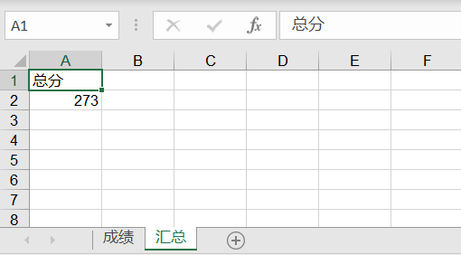
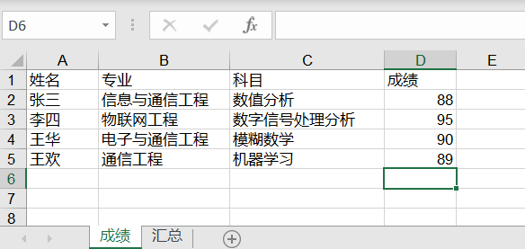
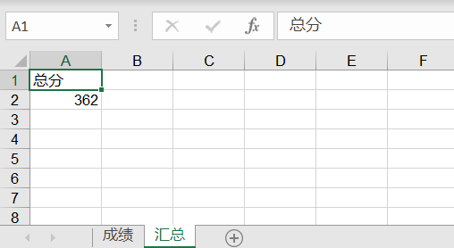

# 使用 xlrd 处理旧版本 Excel

## 关于 xlrd

xlrd 用于读取旧版本 Excel（`.xls`） 中的数据，配合 xlwt 和 xlutils 也可以对 Excel 进行写入和编辑。

这三个库的职责分工如下：

* xlrd：用于读取 Excel 文件；
* xlwt：用于写入 Excel 文件；
* xlutils：用于操作 Excel 文件的实用工具，比如复制、分割、筛选等。

安装比较简单，直接用 pip 工具安装三个库即可，安装命令如下：

```bash
sudo pip install xlrd xlwt xlutils
```

## 写入 Excel

下面是一个使用 xlwt 写入数据到 Excel 的代码示例：

```python
#!/usr/bin/env python
# -*- coding: utf-8 -*-

"""
使用第三方库：pip install xlwt
一般用于处理老版本 Excel(.xls)
"""

import xlwt


def write_excel():
    # 创建 xls 文件对象
    workbook = xlwt.Workbook()

    # 新增两个表单页
    sheet_1 = workbook.add_sheet('成绩')
    sheet_2 = workbook.add_sheet('汇总')

    # 然后按照位置来添加数据,第一个参数是行，第二个参数是列
    # 写入第一个 sheet
    sheet_1.write(0, 0, '姓名')
    sheet_1.write(0, 1, '专业')
    sheet_1.write(0, 2, '科目')
    sheet_1.write(0, 3, '成绩')

    sheet_1.write(1, 0, '张三')
    sheet_1.write(1, 1, '信息与通信工程')
    sheet_1.write(1, 2, '数值分析')
    sheet_1.write(1, 3, 88)

    sheet_1.write(2, 0, '李四')
    sheet_1.write(2, 1, '物联网工程')
    sheet_1.write(2, 2, '数字信号处理分析')
    sheet_1.write(2, 3, 95)

    sheet_1.write(3, 0, '王华')
    sheet_1.write(3, 1, '电子与通信工程')
    sheet_1.write(3, 2, '模糊数学')
    sheet_1.write(3, 3, 90)

    # 写入第二个 sheet
    sheet_2.write(0, 0, '总分')
    sheet_2.write(1, 0, 273)

    # 最后保存文件即可
    workbook.save('student.xls')


if __name__ == "__main__":
    write_excel()
```

运行代码，结果会看到生成名为 student.xls 的 Excel 文件，打开文件查看如下图所示：

<div style="text-align: center;">
  
  <p style="text-align: center; color: #888;">（使用 xlwt 写入数据到 sheet1）</p>
</div>

<div style="text-align: center;">
  
  <p style="text-align: center; color: #888;">（使用 xlwt 写入数据到 sheet2）</p>
</div>

## 读取 Excel

下面是一个使用 xlrd 读取 Excel 数据的代码示例：

```python
#!/usr/bin/env python
# -*- coding: utf-8 -*-

"""
使用第三方库：pip install xlrd
一般用于处理老版本 Excel(.xls)
"""

import xlrd


def read_excel():
    # 打开刚才我们写入的 student.xls 文件
    workbook = xlrd.open_workbook("student.xls")

    # 获取并打印 sheet 数量
    print("sheet 数量:", workbook.nsheets)

    # 获取并打印 sheet 名称
    print("sheet 名称:", workbook.sheet_names())

    # 根据 sheet 索引获取内容
    sheet_1 = workbook.sheet_by_index(0)
    # 或者
    # 也可根据 sheet 名称获取内容
    # sh = workbook.sheet_by_name('成绩')

    # 获取并打印该 sheet 行数和列数
    print("sheet %s 共 %d 行 %d 列" % (sheet_1.name, sheet_1.nrows, sheet_1.ncols))

    # 获取并打印某个单元格的值
    print("第一行第二列的值为:", sheet_1.cell_value(0, 1))

    # 获取整行或整列的值
    rows = sheet_1.row_values(0)  # 获取第一行内容
    cols = sheet_1.col_values(1)  # 获取第二列内容

    # 打印获取的行列值
    print("第一行的值为:", rows)
    print("第二列的值为:", cols)

    # 获取单元格内容的数据类型
    print("第二行第一列的值类型为:", sheet_1.cell(1, 0).ctype)

    # 遍历所有表单内容
    for sh in workbook.sheets():
        for r in range(sh.nrows):
            # 输出指定行
            print(sh.row(r))


if __name__ == "__main__":
    read_excel()
```

输出如下结果：

<div style="text-align: center;">
  
  <p style="text-align: center; color: #888;">（使用 xlrd 从 Excel 读取数据）</p>
</div>

从输出结果我们看到：`第二行第一列的值类型为: 1`，这里返回的**单元格的类型**是个数字，它的实际对应关系如下表所示：

| 数值   | 类型     | 说明   |
| :---- | :------ | :---- |
| 0     | empty   | 空     |
| 1     | string  | 字符串  |
| 2     | number  | 数字    |
| 3     | date    | 日期    |
| 4     | boolean | 布尔值  |
| 5     | error   | 错误    |

通过上面表格，我们可以知道刚才获取单元格类型返回的数字 `1` 对应的就是字符串类型。


## 修改 Excel

上面介绍了写入和读取 Excel 数据，如果要修改 Excel，就需要用到 xlutils 中的方法了。直接上代码，来看下最简单的修改操作：

```python
#!/usr/bin/env python
# -*- coding: utf-8 -*-

"""
使用第三方库：pip install xlrd xlutils
一般用于处理老版本 Excel(.xls)
"""

import xlrd
from xlutils.copy import copy


# 修改 Excel
def edit_excel():
    # 打开刚才我们写入的 student.xls 文件
    workbook = xlrd.open_workbook("student.xls")

    # 复制一份
    new_workbook = copy(workbook)

    # 选取第一个表单
    sheet_1 = new_workbook.get_sheet(0)

    # 在第五行新增写入数据
    sheet_1.write(4, 0, '王欢')
    sheet_1.write(4, 1, '通信工程')
    sheet_1.write(4, 2, '机器学习')
    sheet_1.write(4, 3, 89)

    # 选取第二个表单
    sheet_2 = new_workbook.get_sheet(1)

    # 替换总成绩数据
    sheet_2.write(1, 0, 362)

    # 保存
    new_workbook.save('new_student.xls')


if __name__ == "__main__":
    edit_excel()
```

从上面代码可以看出，这里的修改 Excel 是通过 xlutils 库的 copy 方法将原来的 Excel 整个复制一份，然后再做修改操作，最后再保存。看下修改结果如下：

<div style="text-align: center;">
  
  <p style="text-align: center; color: #888;">（使用 xlutils 修改 sheet1 的数据）</p>
</div>

<div style="text-align: center;">
  
  <p style="text-align: center; color: #888;">（使用 xlutils 修改 sheet2 的数据）</p>
</div>

## 格式化 Excel

在平时我们使用 Excel 时会对数据进行格式化，或者样式设置，接下来还是使用上面的数据，但在写入时对 Excel 进行格式化，使输出的格式稍微美观一点，代码如下：

```python
#!/usr/bin/env python
# -*- coding: utf-8 -*-

"""
使用第三方库：pip install xlwt
一般用于处理老版本 Excel(.xls)
"""

import xlwt


def format_excel():
    # 设置写出格式字体红色加粗
    style_head = xlwt.easyxf('font: name Times New Roman, color-index red, bold on')

    # 设置数字型格式为小数点后保留两位
    style_num = xlwt.easyxf(num_format_str='#,##0.00')

    # 设置日期型格式显示为YYYY-MM-DD
    style_date = xlwt.easyxf(num_format_str='YYYY-MM-DD')

    # 创建 xls 文件对象
    workbook = xlwt.Workbook()

    # 新增两个表单页
    sheet_1 = workbook.add_sheet('成绩')
    sheet_2 = workbook.add_sheet('汇总')

    # 然后按照位置来添加数据，第一个参数是行，第二个参数是列
    sheet_1.write(0, 0, '姓名', style_head)  # 设置表头字体为红色加粗
    sheet_1.write(0, 1, '日期', style_head)  # 设置表头字体为红色加粗
    sheet_1.write(0, 2, '成绩', style_head)  # 设置表头字体为红色加粗

    # 插入数据
    sheet_1.write(1, 0, '张三', )
    sheet_1.write(1, 1, '2021-07-01', style_date)
    sheet_1.write(1, 2, 90, style_num)
    sheet_1.write(2, 0, '李四')
    sheet_1.write(2, 1, '2021-08-02')
    sheet_1.write(2, 2, 95, style_num)

    # 设置单元格内容居中的格式
    alignment = xlwt.Alignment()
    alignment.horz = xlwt.Alignment.HORZ_CENTER
    style = xlwt.XFStyle()
    style.alignment = alignment

    # 合并 A4，B4 单元格，并将内容设置为居中
    sheet_1.write_merge(3, 3, 0, 1, '总分', style)

    # 通过公式，计算 C2+C3 单元格的和
    sheet_1.write(3, 2, xlwt.Formula("C2+C3"))

    # 对 sheet2 写入数据
    sheet_2.write(0, 0, '总分', style_head)
    sheet_2.write(1, 0, 185)

    # 最后保存文件即可
    workbook.save('student.xls')


if __name__ == "__main__":
    format_excel()
```

输出结果：

<div style="text-align: center;">
  
  <p style="text-align: center; color: #888;">（使用 xlwt 格式化 Excel 的数据）</p>
</div>

我们可以对字体、颜色、对齐、合并等平时 Excel 的操作进行设置，也可以格式化日期和数字类型的数据。

当然了这里只是介绍了部分功能，想了解更多功能操作可以参考官网。

## 参考资料

* [xlrd](https://pypi.org/project/xlrd/)
* [xlwt](https://pypi.org/project/xlwt/)
* [python-excel](http://www.python-excel.org/)

（完）
