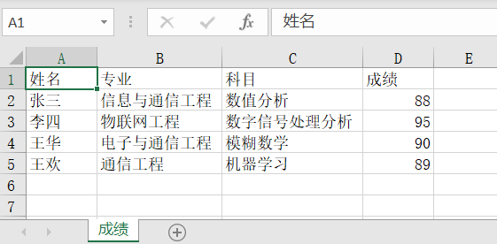
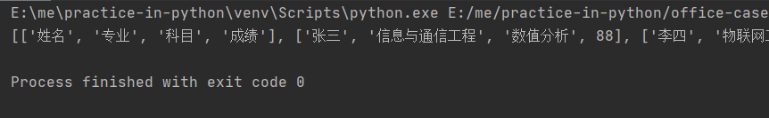

# 使用 openpyxl 处理新版本 Excel

## 关于 openpyxl

openpyxl 是读写新版本 Excel（`.xlsx`） 的第三方库，是一个比较综合的工具，能够同时读取和修改 Excel 文档。支持的格式有 `.xlsx`、`.xlsm`、`.xltx` 和 `.xltm`。

安装比较简单，直接用 pip 工具即可，安装命令如下：

```bash
sudo pip install openpyxl
```

## 写入 Excel

下面是一个使用 openpyxl 写入数据到 Excel 的代码示例，大致逻辑是：遍历源数据，通过指定行号和列号，依次插入 Excel 表格的每个单元格中。

::: warning
* Python 中数组的索引是从 0 开始的，
* 而 openpyxl 在指定单元格时索引是从 1 开始的（`sheet.cell(row, column, value)`），
* 因此，openpyxl 的首行、首列是 (1, 1) 而不是 (0, 0)。
:::

```python
#!/usr/bin/env python
# -*- coding: utf-8 -*-

"""
使用第三方库：pip install openpyxl
一般用于处理新版本 Excel(.xlsx)
"""

import openpyxl


# 数据形如：[['张三', '信息与通信工程', '数值分析', 88]]
def write_excel(sheet_name, head, data, path):
    # 实例化一个工作薄对象
    workbook = openpyxl.Workbook()
    # 激活一个 Sheet 表（工作表），并为它设置一个 title
    sheet = workbook.active
    sheet.title = sheet_name

    # data 中添加表头（不需要表头可以不用加）
    data.insert(0, list(head))

    # 开始遍历并插入数据
    # row: 行  col: 列
    for row_index, row_item in enumerate(data):
        for col_index, col_item in enumerate(row_item):
            # 写入单元格
            sheet.cell(row=row_index + 1, column=col_index + 1, value=col_item)

    workbook.save(path)


if __name__ == "__main__":
    # mock 数据
    sheet_name = '成绩'
    head = ['姓名', '专业', '科目', '成绩']
    data = [
        ['张三', '信息与通信工程', '数值分析', 88],
        ['李四', '物联网工程', '数字信号处理分析', 95],
        ['王华', '电子与通信工程', '模糊数学', 90],
        ['王欢', '通信工程', '机器学习', 89]
    ]
    path = 'student.xlsx'

    # 执行方法
    write_excel(sheet_name， head, data, path)
```

运行代码，结果会看到生成名为 student.xlsx 的 Excel 文件，打开文件查看如下图所示：

<div style="text-align: center;">
  
  <p style="text-align: center; color: #888;">（使用 openpyxl 写入数据到 Excel）</p>
</div>

拓展：

* 在实例化一个工作薄对象时，默认会产生一个 Sheet，默认名字是：`"Sheet"`，激活它后就可使用。

```python
workbook = openpyxl.Workbook()
sheet = workbook.active
sheet.title = sheet_name
```

* 新增第二个 Sheet 并使用。

```python
sheet_2 = workbook.create_sheet(title="Sheet名")
sheet_2['F5'] = 3.14
```

* 遍历 Sheet 对象。

```python
for sheet in workbook:
    print('sheet:', sheet)
```

* 遍历 Sheet 名然后通过名字获取 Sheet 对象。

```python
sheet_names = workbook.sheet_names
for sheet_name in sheet_names:
    sheet = workbook[sheet_name]
    print('sheet:', sheet)
```

## 读取 Excel

下面是一个使用 openpyxl 读取 Excel 数据的代码示例，逻辑比较简单：先执行要读取的 Sheet 表，然后逐行遍历，每一行中依次读取每一列（即每个单元格的数据）。

```python
#!/usr/bin/env python
# -*- coding: utf-8 -*-

"""
使用第三方库：pip install openpyxl
一般用于处理新版本 Excel(.xlsx)
"""

import openpyxl


def read_excel(path, sheet_name):
    # 实例化一个工作薄对象
    workbook = openpyxl.load_workbook(path)
    # 获取指定名字的 Sheet 表
    sheet = workbook[sheet_name]

    # 定义一个数组，存放要输出的数据
    result = []

    # sheet.rows 为表格内的每一行数据
    # 循环获取表格内的每一行数据
    for row_index, row_item in enumerate(sheet.rows):
        # 定义一个空的数组用来存放每一行数据单元格的数据
        current_row = []
        for col_index, col_item in enumerate(row_item):
            # 获取单元格数据 追加到 return_row
            current_row.append(col_item.value)
        # 把每一行数据追加到结果 return_data 中，最后输出
        result.append(current_row)

    return result


if __name__ == "__main__":
    # mock 数据
    sheet_name = '成绩'
    path = 'student.xlsx'

    # 执行方法
    result = read_excel(path, sheet_name)
    print(result)
```

输出如下结果：

<div style="text-align: center;">
  
  <p style="text-align: center; color: #888;">（使用 openpyxl 从 Excel 读取数据）</p>
</div>

## 常用读取 API

接下来列举通过 openpyxl 读写 Excel 时常用的 API。

> 如无特别标注，以下所有代码中的 `workbook` 为工作薄的实例对象，`sheet` 为工作表的实力对象。

### 打开 Excel 表格并获取表格名称

```python
from openpyxl import load_workbook
workbook = load_workbook(filename="test.xlsx")
workbook.sheetnames
```

### 通过 Sheet 名称获取表格

```python
from openpyxl import load_workbook
workbook = load_workbook(filename="test.xlsx")
workbook.sheetnames
sheet = workbook["Sheet1"]
print(sheet)
```

### 获取表格的尺寸大小

这里所说的尺寸大小，指的是 Excel 表格中的数据有几行几列，针对的是不同的 Sheet 而言。

```python
sheet.dimensions
```

### 获取最大行、最大列

注意：获取到的最大行与最大列都是基于起始索引 1 计算的。

```python
sheet.max_row     # 最大行
sheet.max_column  # 最大列
```

### 获取表格内某个格子的数据

* `sheet["A1"]` 方式

```python
"""
workbook.active 打开激活的表格；
sheet["A1"] 获取A1格子的数据；
cell.value 获取格子中的值；
"""

workbook = load_workbook(filename="test.xlsx")
sheet = workbook.active

cell1 = sheet["A1"]
cell2 = sheet["C11"]
print(cell1.value, cell2.value)
```

* `sheet.cell(row=, column=)` 方式，这种方式更简单

```python
workbook = load_workbook(filename="test.xlsx")
sheet = workbook.active

cell1 = sheet.cell(row=1,column=1)
cell2 = sheet.cell(row=11,column=3)
print(cell1.value, cell2.value)
```

### 获取某个单元格的行数、列数、坐标

```python
"""
.row 获取某个格子的行数；
.columns 获取某个格子的列数；
.corordinate 获取某个格子的坐标；
"""

workbook = load_workbook(filename="test.xlsx")
sheet = workbook.active

cell1 = sheet["A1"]
cell2 = sheet["C11"]
print(cell1.value, cell1.row, cell1.column, cell1.coordinate)
print(cell2.value, cell2.row, cell2.column, cell2.coordinate)
```

### 获取一系列单元格

* `sheet[]` 方式

```python
workbook = load_workbook(filename="test.xlsx")
sheet = workbook.active

# 获取 A1:C2 区域的值
cells = sheet["A1:C2"]
print(cells)
for row in cells:
    for col in row:
        print(col.value)

# 如果我们只想获取"A列"，或者获取"A-C列"，可以采取如下方式：
# sheet["A"]    --- 获取 A 列的数据
# sheet["A:C"]  --- 获取 A,B,C 三列的数据
# sheet[5]      --- 获取第 5 行的数据
```

* `.iter_rows()` 和 `.iter_cols()` 方式

```python
workbook = load_workbook(filename="test.xlsx")
sheet = workbook.active

# 按行获取值
for row_item in sheet.iter_rows(min_row=2, max_row=5, min_col=1, max_col=2):
    for col_item in row_item:
        print(col_item.value)

# 按列获取值
for col_item in sheet.iter_cols(min_row=2, max_row=5, min_col=1, max_col=2):
    for row_item in col_item:
        print(row_item.value)
```

* `sheet.rows` 获取所有行

```python
workbook = load_workbook(filename="test.xlsx")
sheet = workbook.active

for row_item in sheet.rows:
    print(row_item)
```

## 常用写入 API

### 向指定单元格写入数据并保存

```python
"""
注意：下方代码将"A1"单元格的数据改为了"哈喽"，并另存为"哈喽.xlsx"文件。
如果我们保存的时候，不修改表名，相当于直接修改源文件。
"""

workbook = load_workbook(filename="test.xlsx")
sheet = workbook.active

sheet["A1"] = "哈喽"  # 这句代码也可以改为 cell = sheet["A1"] cell.value = "哈喽"
workbook.save(filename="哈喽.xlsx")
```

### 向表格中插入行数据

* 使用 `.append()` 方法：会在表格已有的数据后面，追加新数据（按行插入）；
* 这个操作很有用，爬虫得到的数据，可以使用该方式保存成 Excel 文件。

```python
"""
下方代码会将 data 中的数据逐行追加到原表格数据后面
"""

workbook = load_workbook(filename="test.xlsx")
sheet = workbook.active

data = [
    ["唐僧", "男", "180cm"],
    ["孙悟空", "男", "188cm"],
    ["猪八戒", "男", "175cm"],
    ["沙僧", "男", "176cm"]
]
for row in data:
    sheet.append(row)
workbook.save(filename="test.xlsx")
```

### 使用 Excel 函数公式(很有用)

```python
"""
这是在 Excel 中输入的公式：
=IF(RIGHT(C2,2)="cm",C2,SUBSTITUTE(C2,"m","")*100&"cm")
"""

workbook = load_workbook(filename="test.xlsx")
sheet = workbook.active

sheet["D1"] = "标准身高"
for i in range(2, 16):
    sheet["D{}".format(i)] = '=IF(RIGHT(C{},2)="cm",C{},SUBSTITUTE(C{},"m","")*100&"cm")'.format(i, i, i)
workbook.save(filename="test.xlsx")
```

### 插入空行和空列

使用 `.insert_cols()` 和 `.insert_rows()` 方法：

* `.insert_cols(idx=数字编号, amount=要插入的列数)`，插入的位置是在 idx 列数的左侧插入；
* `.insert_rows(idx=数字编号, amount=要插入的行数)`，插入的位置是在 idx 行数的下方插入。

```python
workbook = load_workbook(filename="test.xlsx")
sheet = workbook.active

sheet.insert_cols(idx=4,amount=2)
sheet.insert_rows(idx=5,amount=4)
workbook.save(filename="test.xlsx")
```

### 删除指定行和列

使用 `.delete_rows()` 和 `.delete_cols()` 方法：

* `.delete_rows(idx=数字编号, amount=要删除的行数)`
* `.delete_cols(idx=数字编号, amount=要删除的列数)`

```python
workbook = load_workbook(filename="test.xlsx")
sheet = workbook.active

# 删除第一列，第一行
sheet.delete_cols(idx=1)
sheet.delete_rows(idx=1)
workbook.save(filename="test.xlsx")
```

### 移动指定单元格

使用 `.move_range("数据区域",rows=,cols=)` 方法：正整数为向下或向右、负整数为向左或向上。

```python
# 向左移动两列，向下移动两行
sheet.move_range("C1:D4", rows=2, cols=-1)
```

### 创建新的 Sheet 表

使用 `.create_sheet("新的Sheet名")` 方法。

```python
workbook = load_workbook(filename="test.xlsx")
sheet = workbook.active

workbook.create_sheet("一个新的Sheet")
print(workbook.sheetnames)
workbook.save(filename="test.xlsx")
```

### 删除指定 Sheet 表

使用 `.remove("Sheet名")` 方法。

```python
workbook = load_workbook(filename="test.xlsx")
sheet = workbook.active
print(workbook.sheetnames)

# 这个相当于通过名字来激活指定 Sheet 表，激活状态下，才可以操作
sheet = workbook['一个新的Sheet']
workbook.remove(sheet)

print(workbook.sheetnames)
workbook.save(filename="test.xlsx")
```

### 复制一个 Sheet 表到另外一份 Excel

使用 `.copy_worksheet()` 方法：复制某个 Excel 表中的 Sheet 表，然后将文件存储到另外一个 Excel 中（追加到最后）。

```python
workbook = load_workbook(filename="test_src.xlsx")
sheet = workbook.active
print("test_src.xlsx 中有这几个 Sheet 表：", workbook.sheetnames)

sheet = workbook['姓名']  
workbook.copy_worksheet(sheet)
workbook.save(filename="test_dst.xlsx")
```

### 修改 Sheet 表的名称

使用 `.title = "新的sheet表名"`。

```python
workbook = load_workbook(filename="test.xlsx")
sheet = workbook.active
print(sheet)

sheet.title = "我是修改后的sheet名"
print(sheet)
```

### 创建新的 Excel 文件

```python
from openpyxl import Workbook

workbook = Workbook()
sheet = workbook.active
sheet.title = "表格1"
workbook.save(filename="新建的Excel")
```

### 冻结窗口

> 冻结窗口以后，滑动垂直/水平滚动条，该单元格的位置不会改变。

使用 `.freeze_panes = "单元格"` 方法：需要确保指定的单元格不在第一行，因为 `freeze_panes` 将冻结给定单元格上方的行和左侧的列。

```python
"""
sheet.freeze_panes = "B1"  # 冻结第一列
sheet.freeze_panes = "A2"  # 冻结第一行
sheet.freeze_panes = "B2"  # 同时冻结第一行和第一列
"""

workbook=load_workbook(filename="test.xlsx")
sheet = workbook.active

sheet.freeze_panes = "A2"  # 冻结第一行
workbook.save(filename="test.xlsx")
```

### 给表格添加筛选器

使用 `sheet.auto_filter.ref` 方法。

* `.auto_filter.ref = sheet.dimension`：给所有字段添加筛选器；
* `.auto_filter.ref = "A1"`：给 A1 这个格子添加筛选器，就是给第一列添加筛选器。

```python
workbook = load_workbook(filename="test.xlsx")
sheet = workbook.active

sheet.auto_filter.ref = sheet["A1"]
workbook.save(filename="test.xlsx")
```

## 常用格式化 API

### 修改字体样式

* `Font(name=字体名称, size=字体大小, bold=是否加粗, italic=是否斜体, color=字体颜色)`

其中，color 是 RGB 的 16 进制表示。

```python
from openpyxl.styles import Font
from openpyxl import load_workbook


workbook = load_workbook(filename="test.xlsx")
sheet = workbook.active
cell = sheet["A1"]
font = Font(name="微软雅黑",size=20,bold=True,italic=True,color="FF0000")
cell.font = font
workbook.save(filename = "花园.xlsx")
```

### 获取单元格的字体样式

```python
from openpyxl.styles import Font
from openpyxl import load_workbook


workbook = load_workbook(filename="test.xlsx")
sheet = workbook.active
cell = sheet["A2"]
font = cell.font
print(font.name, font.size, font.bold, font.italic, font.color)
```

### 设置对齐样式

* `Alignment(horizontal=水平对齐模式, vertical=垂直对齐模式, text_rotation=旋转角度, wrap_text=是否自动换行)`
  * 水平对齐模式：'distributed'，'justify'，'center'，'leftfill'， 'centerContinuous'，'right'，'general'。
  * 垂直对齐模式：'bottom'，'distributed'，'justify'，'center'，'top'。

```python
from openpyxl.styles import Alignment
from openpyxl import load_workbook


workbook = load_workbook(filename="test.xlsx")
sheet = workbook.active
cell = sheet["A1"]
alignment = Alignment(horizontal="center", vertical="center", text_rotation=45, wrap_text=True)
cell.alignment = alignment
workbook.save(filename ="test.xlsx")
```

### 设置边框样式

* `Side(style=边线样式, color=边线颜色)` 和 `Border(left=左边线样式, right=右边线样式, top=上边线样式, bottom=下边线样式)`
  * style 参数：'double', 'mediumDashDotDot', 'slantDashDot', 'dashDotDot', 'dotted', 'hair', 'mediumDashed, 'dashed', 'dashDot', 'thin', 'mediumDashDot', 'medium', 'thick'

```python
from openpyxl.styles import Side, Border
from openpyxl import load_workbook


workbook = load_workbook(filename="test.xlsx")
sheet = workbook.active
cell = sheet["D6"]
side1 = Side(style="thin", color="FF0000")
side2 = Side(style="thick", color="FFFF00")
border = Border(left=side1, right=side1, top=side2, bottom=side2)
cell.border = border
workbook.save(filename="test.xlsx")
```

### 设置填充样式

* `PatternFill(fill_type=填充样式，fgColor=填充颜色）`
* `GradientFill(stop=(渐变颜色1，渐变颜色2……))`

```python
from openpyxl.styles import PatternFill,GradientFill
from openpyxl import load_workbook


workbook = load_workbook(filename="test.xlsx")
sheet = workbook.active
cell_b9 = sheet["B9"]
pattern_fill = PatternFill(fill_type="solid",fgColor="99ccff")
cell_b9.fill = pattern_fill
cell_b10 = sheet["B10"]
gradient_fill = GradientFill(stop=("FFFFFF","99ccff","000000"))
cell_b10.fill = gradient_fill
workbook.save(filename="test.xlsx")
```

### 设置行高和列宽

* `.row_dimensions[行编号].height = 行高`
* `.column_dimensions[列编号].width = 列宽`

```python
workbook = load_workbook(filename="test.xlsx")
sheet = workbook.active
# 设置第1行的高度
sheet.row_dimensions[1].height = 50
# 设置B列的宽度
sheet.column_dimensions["B"].width = 20
workbook.save(filename="test.xlsx")

"""
也可以设置整个 Sheet 表的行高和列宽：
sheet.row_dimensions.height = 50
sheet.column_dimensions.width = 30
"""
```

### 合并单元格

* `.merge_cells(待合并的格子编号)`
* `.merge_cells(start_row=起始行号，start_column=起始列号，end_row=结束行号，end_column=结束列号)`

```python
workbook = load_workbook(filename="test.xlsx")
sheet = workbook.active
sheet.merge_cells("C1:D2")
sheet.merge_cells(start_row=7, start_column=1, end_row=8, end_column=3)
workbook.save(filename="test.xlsx")
```

也可以取消合并单元格，用法一致。

* `.unmerge_cells(待合并的格子编号)`
* `.unmerge_cells(start_row=起始行号，start_column=起始列号，end_row=结束行号，end_column=结束列号)`

## 参考资料

* [openpyxl](https://openpyxl.readthedocs.io/en/stable/)

（完）
