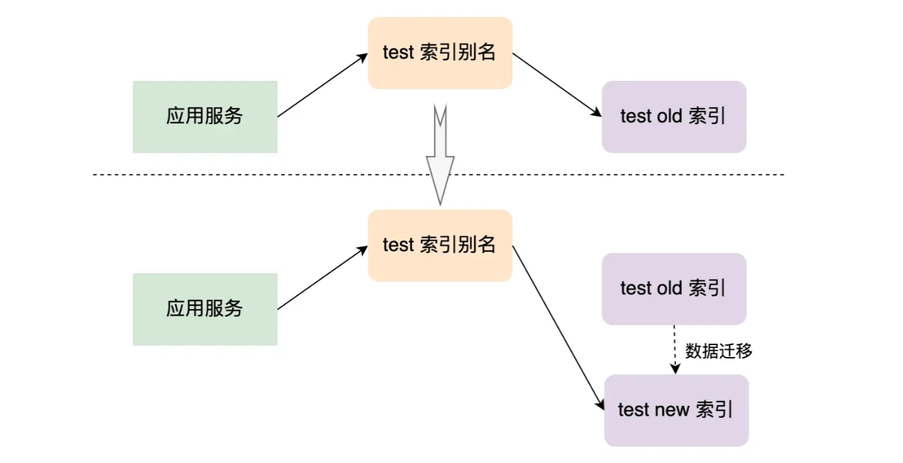

# 索引管理 API

## 前言

索引管理的 API 提供了单个索引的管理（创建和删除）、别名管理、索引设置、定义 Mapping、Reindex、索引模板、索引收缩等功能。

## 单个索引的管理

### 创建索引

```bash
# 创建索引的最基本形式，没有指定 Mapping
PUT test_index

# 创建带 setting 和 Mapping 的 books 索引
PUT books
{
  "mappings": {
    "properties": {
      "book_id": {
        "type": "keyword"
      },
      "name": {
        "type": "text"
      }
    }
  },
  "settings": {
    "number_of_shards": 3,  # 指定了 3 个主分片
    "number_of_replicas": 1 # 指定了一个副本分片
  }
}
```

创建索引的限制有以下几个：

* 只能是小写字母。
* 不能包含 `\`，`/`，`*`，`?`，`"`，`<`，`>`，`|`，(空格)，`,`，`#` 等字符。
* 7.0 之后的版本不能再包含 `:`（冒号）字符了。
* 不能以 `-`，`_`，`+` 开头。名字不能是 `.` 或者 `..`。
* 不能长于 255 字节。需要注意的是某些字符是需要多个字节来表示的。

### 删除索引

```bash
# 删除一个索引
DELETE test_index
```

## 索引别名管理

当业务需求发生改变，而不得不创建一个新索引来代替旧索引的时候，我们必须更新应用服务（后端代码）的索引名称，使用索引别名可以解决这个问题。假设应用中用 `test` 别名指向旧索引 `test_old`，在创建新索引 `test_new` 并将 `test_old` 的数据迁移到 `test_new` 后，我们可以将 `test` 索引别名指向 `test_new`，这样可以做到在新旧索引间的无缝切换。

<div style="text-align: center;">
  
  <p style="text-align: center; color: #888;">（索引别名 - 以 test 为例）</p>
</div>

**别名就是一个索引另外的名字，其就像一个软连接或者快捷方式。每个索引可以有多个别名，而不同的索引也可以使用相同的别名，这样使得不同的别名可以适用于不同的情景**。

### 别名创建

```bash
# 为 test1 索引创建了 "alias1" 别名
POST /_aliases
{
  "actions" : [
    { "add" : { "index" : "test1", "alias" : "alias1" } }
  ]
}
```

### 别名删除

```bash
# 删除了索引 test1 的别名 "alias1"
POST /_aliases
{
  "actions" : [
    { "remove" : { "index" : "test1", "alias" : "alias1" } }
  ]
}
```

### 别名重命名

别名重命名的操作是先将原先的别名删除了，然后再创建新的别名。这操作是原子的，不需担心别名不指向索引的短暂时间。

```bash
POST /_aliases
{
  "actions" : [
    { "remove" : { "index" : "test1", "alias" : "alias1" } },
    { "add" : { "index" : "test1", "alias" : "alias2" } }
  ]
}
```

### 关联多个索引

```bash
# 将别名 alias1 指向了索引 test1、test2 。
POST /_aliases
{
  "actions" : [
    { "add" : { "indices" : ["test1", "test2"], "alias" : "alias1" } }
  ]
}
```

更多的别名使用示例可以参考[官方文档](https://www.elastic.co/guide/en/elasticsearch/reference/7.13/indices-aliases.html)。

## 索引设置

在创建索引的时候，可以在 `"settings"` 字段中指定索引的设置。`number_of_shards` 和 `number_of_replicas` 是索引非常重要的两个配置，设置它们值的示例如下：

```bash
PUT test_index
{
  "settings": {
    "number_of_shards": 3,  # 指定了 3 个主分片
    "number_of_replicas": 1 # 指定了一个副本分片
  }
}
```

也可以动态修改索引的配置，其示例如下：

```bash
PUT /test_index/_settings
{
  "number_of_replicas": 2
}
```

但要注意的是，**`number_of_shards` 设定后是无法改变的，要修改索引的分片数量可以通过 Reindex API 或者收缩索引的 API 做处理**。

## 定义索引的 Mapping

在创建索引的时候可以设置索引的 Mapping（使用 `"mappings"` 字段）。其示例如下：

```bash
PUT test_index
{
  "mappings": {
    "properties": {
        "test_id": {
          "type": "keyword"
        }
      }
  }
}
```

如果增加了某些需求，想要增加索引 Mapping 的设置，其示例如下：

```bash
PUT test_index/_mapping
{
  "properties": {
    "test_name": {
      "type": "keyword"
    }
  }
}
```

需要注意的是，**在 Mapping 中已经定义好的字段是不能修改的**，如果尝试修改将会返回错误提示。

## Reindex API

对于已经创建过的 Mapping ，既不能修改已经定义过的字段类型，同时也不能改变分片的数量。而如果需求上必须要我们修改，就可以使用 Reindex API 来解决这个问题。

首先创建一个新的索引，使其 Mapping 等设置满足新的需求，然后将数据从旧的索引中迁移到新的索引。具体步骤如下：

```bash
# 创建新的索引，并且满足需求
PUT test_index_reindex
{
  "mappings": {
    "properties": {
      "test_id": { "type": "keyword" },
      "test_name": { "type": "text" }
    }
  }
}

# 执行 reindex 操作
POST _reindex
{
  "source": { "index": "test_index" },
  "dest": { "index": "test_index_reindex" }
}

# 在迁移数据后的 test_index_reindex 索引中获取数据
GET test_index_reindex/_doc/1
```

需要注意的是，如果索引中的数据很多，并且是需要同步返回的情况下，在 Kibana 中执行这个操作可能会发生超时的现象。可以使用 `wait_for_completion=false` 参数来进行异步操作，其示例如下：

```bash
# 异步地执行 _reindex
POST _reindex?wait_for_completion=false
{
  "source": { "index": "test_index" },
  "dest": { "index": "test_index_reindex" }
}

# 结果
{
  "task" : "26d0dAjcRYygigd0shfz5w:35995695"
}
```

异步的 reindex 操作返回的结果将会是个 task id，可以使用 Task API 查看这个任务的情况：

```bash
GET /_tasks/26d0dAjcRYygigd0shfz5w:35995695
```

Reindex API 还提供很多丰富的参数和操作示例，可以参考[官方文档](https://www.elastic.co/guide/en/elasticsearch/reference/7.13/docs-reindex.html)。

## 索引模板

可以使用 Index templates 按照一定的规则对新创建的索引进行 Mapping 设定和 Settings 设定。需要注意的是，索引模板只在索引被新创建时起作用。

创建一个模板：

```bash
PUT /_index_template/my_tmp1
{
  "index_patterns" : ["tmp_*"], # 以tmp_ 开头的索引都引用这个模板
  "priority" : 1,               # 指定优先级, 数值越大优先级越高, 这个模板就越先被应用
  "template": {
    "settings" : {
      "number_of_shards" : 3
    },
    "mappings": {
      "date_detection": false
    }
  }
}
```

## 打开和关闭索引

当我们需要执行某些操作的时候，需要关闭索引或者打开索引，可以使用 `_close` API 和 `_open` API 来关闭或者打开索引。

**关闭索引的操作开销很小，并且会阻塞读写操作，关闭后的索引不再允许执行打开状态时的所有操作**。关闭和打开一个索引的示例如下：

```bash
# 关闭索引
POST /test_index/_close

# 打开索引
POST /test_index/_open
```

## 判断索引是否存在

可以使用 Exists API 来判断一个索引是否存在，其示例如下：

```bash
HEAD test_index
```

如果索引存在，那么返回的 HTTP 状态码为 200，不存在的话为 404。更多关于 Exists API 的使用示例，可以参考[官方文档](https://www.elastic.co/guide/en/elasticsearch/reference/7.13/indices-exists.html)。

## 收缩索引

如果一开始创建的索引其分片太多，可以使用收缩索引的 API 将索引**收缩为具有较少主分片的新索引**。

**收缩后的新索引的主分片数量必须为源索引主分片数量的一个因子**。例如，源索引的主分片分配了 12 个，那么收缩后的新索引的主分片数只能为 1、2、3、4、6。

在进行索引收缩前需要进行以下操作：

* 源索引必须只读。
* 源索引所有的副本（主分片也行，副分片也行）必须在同一个节点上，也就是在这个节点上必须有这个索引的所有数据，不管分片数据是主分片的还是副分片的。
* 源索引的状态必须为健康状态（green）。

下面示例：将拥有 12 个主分片、2 个副本分片的索引（`test_index`）收缩为拥有 3 个主分片和 1 个副分片的索引（`test_index_new`）。

### 第一步：创建原索引

先创建索引 `test_index`，设置 `number_of_shards = 12`，`number_of_replicas = 2`：

```bash
# 创建原索引（测试用）
PUT test_index
{
  "mappings": {
    "properties": { "test_name": { "type": "keyword"} }
  },
  "settings": {
    "number_of_shards": 12, 
    "number_of_replicas": 2
  }
}
```

### 第二步：收缩前准备

下面将索引 `test_index` 所有的主分片转移到节点 `my_ndoe_1` 上，并且设置索引的副本分片数量为 0、设置这个索引为只读状态：

```bash
PUT /test_index/_settings
{
  # 分片分配到 my_node_1 节点
  "index.routing.allocation.require._name": "my_node_1",
  "index.number_of_replicas": 0,
  "index.blocks.write": true  
}
```

### 第三步：开始进行收缩

OK，这个时候 `test_index` 满足了收缩索引的 3 个条件了，下面开始进行收缩：

```bash
POST /test_index/_shrink/test_index_new
{
  "settings": {
    "index.number_of_replicas": 1,
    "index.number_of_shards": 3,
    "index.routing.allocation.require._name": null, # 系统随机分配分片
    "index.blocks.write": null # 不阻塞写操作
  }
}
```

如上示例，我们设置了新索引的主分片数量为 3，每个主分片的副本数量为 1，并且这些分片是系统自动、随机分配的，不阻塞新索引的写操作。

更多关于收缩索引 API 的使用参数和示例，可以参考[官方文档](https://www.elastic.co/guide/en/elasticsearch/reference/7.13/indices-shrink-index.html)。

## 参考资料

* [Index APIs](https://www.elastic.co/guide/en/elasticsearch/reference/7.13/indices.html)

（完）
