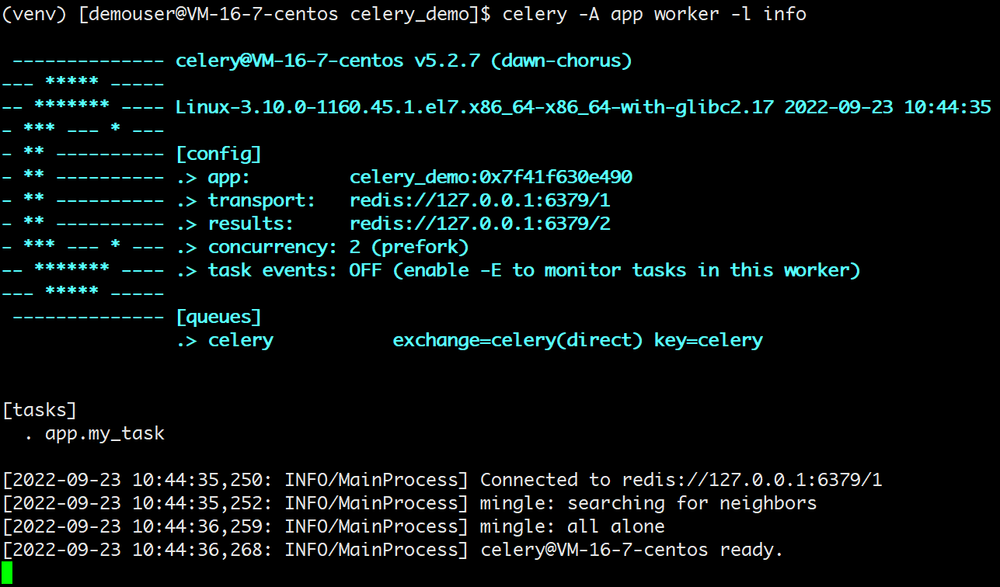
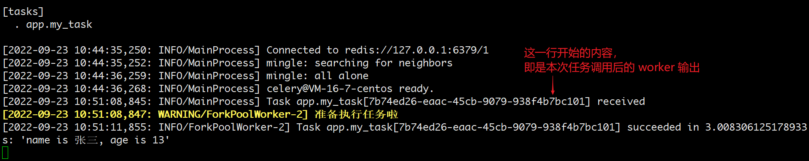
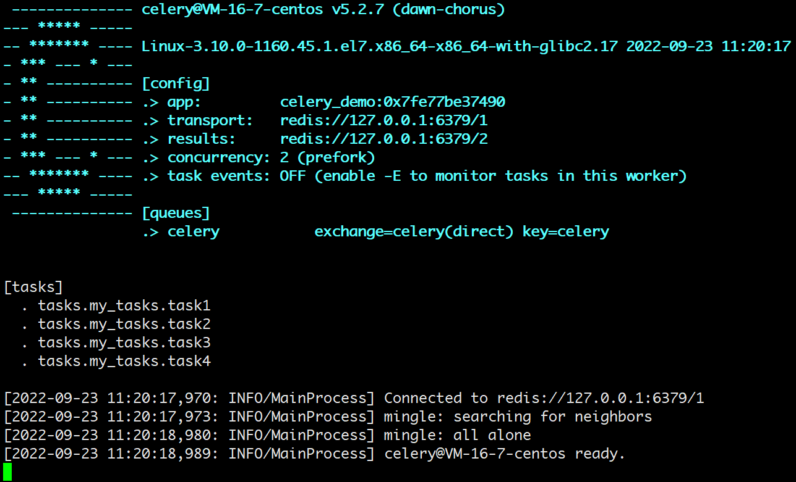
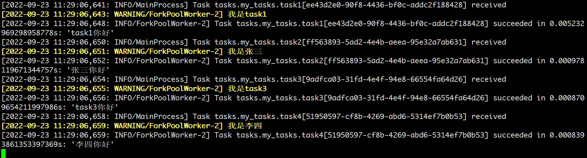
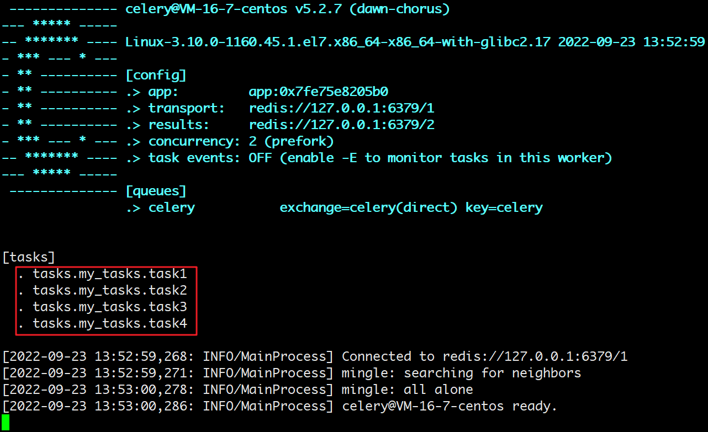
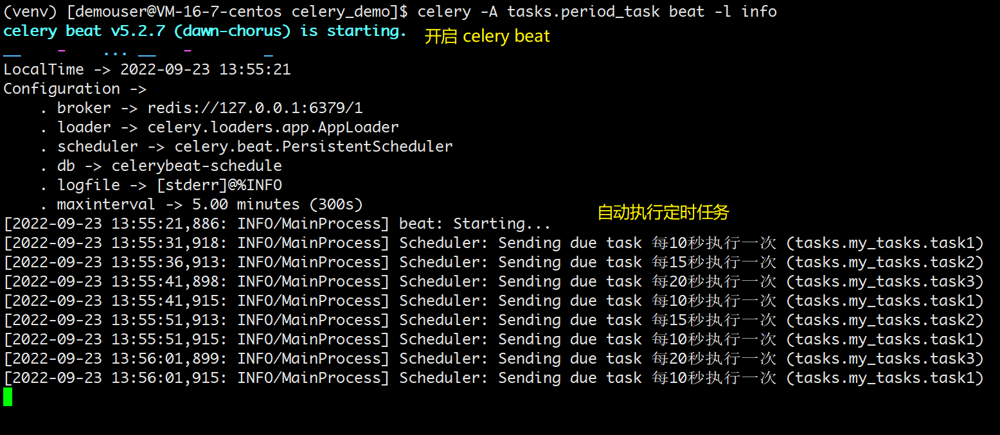
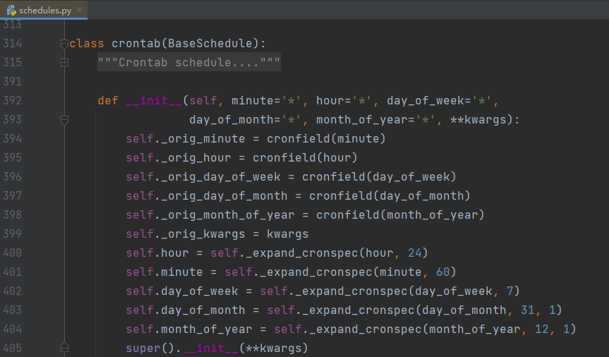
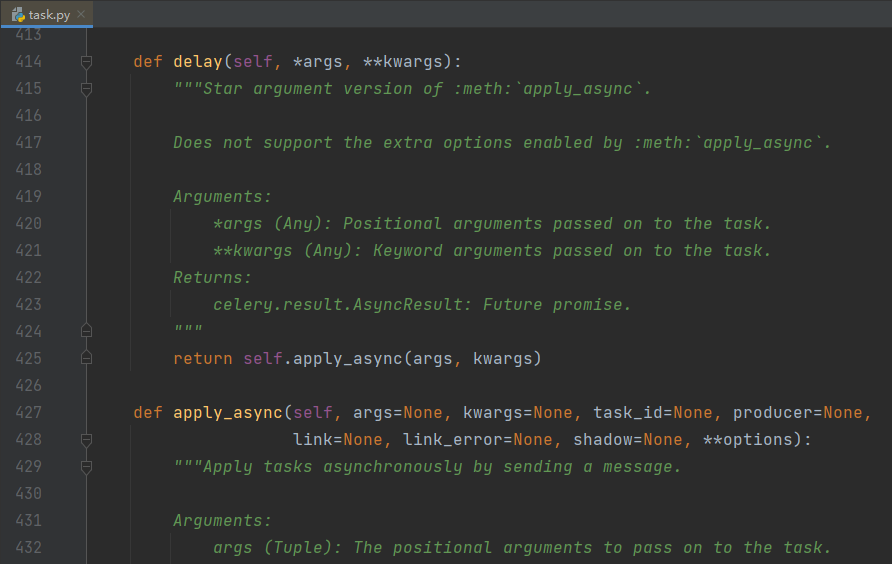
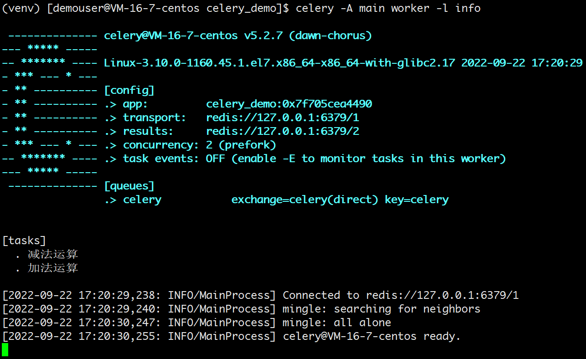

# 使用 Celery 实现任务调度

> 这个库的使用需要基于 Linux 环境，本案例的环境为：
> 
> * CentOS 7
> * Python 3.8.9
> * Redis 7
> * 其中 Celery 大版本为 5，更低的版本可能用法会略微不同，具体参考官方文档。

## Celery 介绍

Celery 是 Python 的一个第三方模块，它本质上是一个任务调度框架。一般用来实现：

* **异步任务**：一些耗时的操作可以交给 celery 异步执行，而不用等着程序处理完才知道结果。比如：视频转码、邮件发送、消息推送等等。
* **定时任务**：比如定时推送消息、定时爬取数据、定时统计数据等等。

### 模块特点

* 灵活：是一个强大的分布式任务队列，它可以让任务的执行完全脱离主程序，甚至可以被分配到其他主机上运行。
* 高可用：当任务执行失败或执行过程中发生连接中断，celery 会自动尝试重新执行任务。
* 快速：一个单进程的 celery 每分钟可处理上百万个任务。
* 开源：是一个完全基于 Python 语言编写的开源项目。

### 使用场景

前面刚提到，celery 适用于一些耗时耗资源的操作，为了避免它们阻塞主程序的运行，我们经常会采用多线程或异步任务。比如：

* 场景一：在 Web 开发中，对新用户的注册，我们通常会给他发一封激活邮件，而发邮件是个 IO 阻塞式任务，如果直接把它放到应用当中，就需要等邮件发出去之后才能进行下一步操作，此时用户只能等待再等待。更好的方式是在业务逻辑中触发一个发邮件的异步任务，而主程序可以继续往下运行。
* 场景二：接口自动化测试平台中，当选择 N 条 case 后点击执行按钮，因为运行选择的多条 case 是一个比较耗时的过程，所以不可能在点击按钮后，页面一直处于等待运行结果的状态，那样会给用户一个页面卡住或者夯住的体验，所以运行用例的过程就应该是一个异步任务去处理。

### 工作流程

有一点需要注意，celery 是用来调度任务的，但它本身并不具备存储任务的功能，而调度任务的时候肯定是要把任务存起来的。因此要使用 celery 的话，还需要搭配一些具备存储、访问功能的工具，比如：消息队列、Redis 缓存、数据库等等。

一般最常用的是 RabbitMQ 或者 Redis，而我接下来的演示都会使用 Redis。

先来看一下 celery 的工作流程图：

<div style="text-align: center;">
  <svg id="SvgjsSvg1006" width="517" height="535.390625" xmlns="http://www.w3.org/2000/svg" version="1.1" xmlns:xlink="http://www.w3.org/1999/xlink" xmlns:svgjs="http://svgjs.com/svgjs"><defs id="SvgjsDefs1007"><marker id="SvgjsMarker1034" markerWidth="12" markerHeight="8" refX="9" refY="4" viewBox="0 0 12 8" orient="auto" markerUnits="userSpaceOnUse" stroke-dasharray="0,0"><path id="SvgjsPath1035" d="M0,0 L12,4 L0,8 L0,0" fill="#323232" stroke="#323232" stroke-width="1"></path></marker><marker id="SvgjsMarker1038" markerWidth="12" markerHeight="8" refX="9" refY="4" viewBox="0 0 12 8" orient="auto" markerUnits="userSpaceOnUse" stroke-dasharray="0,0"><path id="SvgjsPath1039" d="M0,0 L12,4 L0,8 L0,0" fill="#323232" stroke="#323232" stroke-width="1"></path></marker><marker id="SvgjsMarker1064" markerWidth="12" markerHeight="8" refX="9" refY="4" viewBox="0 0 12 8" orient="auto" markerUnits="userSpaceOnUse" stroke-dasharray="0,0"><path id="SvgjsPath1065" d="M0,0 L12,4 L0,8 L0,0" fill="#323232" stroke="#323232" stroke-width="1"></path></marker><marker id="SvgjsMarker1068" markerWidth="12" markerHeight="8" refX="9" refY="4" viewBox="0 0 12 8" orient="auto" markerUnits="userSpaceOnUse" stroke-dasharray="0,0"><path id="SvgjsPath1069" d="M0,0 L12,4 L0,8 L0,0" fill="#323232" stroke="#323232" stroke-width="1"></path></marker><marker id="SvgjsMarker1072" markerWidth="12" markerHeight="8" refX="9" refY="4" viewBox="0 0 12 8" orient="auto" markerUnits="userSpaceOnUse" stroke-dasharray="0,0"><path id="SvgjsPath1073" d="M0,0 L12,4 L0,8 L0,0" fill="#323232" stroke="#323232" stroke-width="1"></path></marker><marker id="SvgjsMarker1084" markerWidth="12" markerHeight="8" refX="9" refY="4" viewBox="0 0 12 8" orient="auto" markerUnits="userSpaceOnUse" stroke-dasharray="0,0"><path id="SvgjsPath1085" d="M0,0 L12,4 L0,8 L0,0" fill="#323232" stroke="#323232" stroke-width="1"></path></marker><marker id="SvgjsMarker1088" markerWidth="12" markerHeight="8" refX="9" refY="4" viewBox="0 0 12 8" orient="auto" markerUnits="userSpaceOnUse" stroke-dasharray="0,0"><path id="SvgjsPath1089" d="M0,0 L12,4 L0,8 L0,0" fill="#323232" stroke="#323232" stroke-width="1"></path></marker><marker id="SvgjsMarker1092" markerWidth="12" markerHeight="8" refX="9" refY="4" viewBox="0 0 12 8" orient="auto" markerUnits="userSpaceOnUse" stroke-dasharray="0,0"><path id="SvgjsPath1093" d="M0,0 L12,4 L0,8 L0,0" fill="#323232" stroke="#323232" stroke-width="1"></path></marker></defs><g id="SvgjsG1008" transform="translate(66.20000457763672,25)"><path id="SvgjsPath1009" d="M 0 4Q 0 0 4 0L 127 0Q 131 0 131 4L 131 50Q 131 54 127 54L 4 54Q 0 54 0 50Z" stroke="none" fill-opacity="1" fill="#d1f0eb"></path><g id="SvgjsG1010"><text id="SvgjsText1011" font-family="微软雅黑" text-anchor="middle" font-size="14px" width="111px" fill="#323232" font-weight="400" align="middle" lineHeight="150%" anchor="middle" family="微软雅黑" size="14px" weight="400" font-style="" opacity="1" y="1.5" transform="rotate(0)"><tspan id="SvgjsTspan1012" dy="21" x="65.5"><tspan id="SvgjsTspan1013" style="text-decoration:;">异步任务</tspan></tspan><tspan id="SvgjsTspan1014" dy="21" x="65.5"><tspan id="SvgjsTspan1015" style="text-decoration:;">（Async Task）</tspan></tspan></text></g></g><g id="SvgjsG1016" transform="translate(334.7999954223633,25)"><path id="SvgjsPath1017" d="M 0 4Q 0 0 4 0L 127 0Q 131 0 131 4L 131 50Q 131 54 127 54L 4 54Q 0 54 0 50Z" stroke="none" fill-opacity="1" fill="#d0d8ff"></path><g id="SvgjsG1018"><text id="SvgjsText1019" font-family="微软雅黑" text-anchor="middle" font-size="14px" width="111px" fill="#323232" font-weight="400" align="middle" lineHeight="150%" anchor="middle" family="微软雅黑" size="14px" weight="400" font-style="" opacity="1" y="1.5" transform="rotate(0)"><tspan id="SvgjsTspan1020" dy="21" x="65.5"><tspan id="SvgjsTspan1021" style="text-decoration:;">定时任务</tspan></tspan><tspan id="SvgjsTspan1022" dy="21" x="65.5"><tspan id="SvgjsTspan1023" style="text-decoration:;">（Celery Beat）</tspan></tspan></text></g></g><g id="SvgjsG1024" transform="translate(193,168.4000015258789)"><path id="SvgjsPath1025" d="M 0 4Q 0 0 4 0L 127 0Q 131 0 131 4L 131 50Q 131 54 127 54L 4 54Q 0 54 0 50Z" stroke="none" fill-opacity="1" fill="#ffd9d8"></path><g id="SvgjsG1026"><text id="SvgjsText1027" font-family="微软雅黑" text-anchor="middle" font-size="14px" width="111px" fill="#323232" font-weight="400" align="middle" lineHeight="150%" anchor="middle" family="微软雅黑" size="14px" weight="400" font-style="" opacity="1" y="1.5" transform="rotate(0)"><tspan id="SvgjsTspan1028" dy="21" x="65.5"><tspan id="SvgjsTspan1029" style="text-decoration:;">消息中间件</tspan></tspan><tspan id="SvgjsTspan1030" dy="21" x="65.5"><tspan id="SvgjsTspan1031" style="text-decoration:;">（Broker）</tspan></tspan></text></g></g><g id="SvgjsG1032"><path id="SvgjsPath1033" d="M131.70000457763672 79L227.64550206243132 167.71741637342308" stroke-dasharray="8,5" stroke="#323232" stroke-width="1" fill="none" marker-end="url(#SvgjsMarker1034)"></path></g><g id="SvgjsG1036"><path id="SvgjsPath1037" d="M400.2999954223633 79L288.6175821519105 167.79098182933336" stroke-dasharray="8,5" stroke="#323232" stroke-width="1" fill="none" marker-end="url(#SvgjsMarker1038)"></path></g><g id="SvgjsG1040" transform="translate(25,308)"><path id="SvgjsPath1041" d="M 0 4Q 0 0 4 0L 140 0Q 144 0 144 4L 144 49.599998474121094Q 144 53.599998474121094 140 53.599998474121094L 4 53.599998474121094Q 0 53.599998474121094 0 49.599998474121094Z" stroke="none" fill-opacity="1" fill="#ffedd2"></path><g id="SvgjsG1042"><text id="SvgjsText1043" font-family="微软雅黑" text-anchor="middle" font-size="14px" width="124px" fill="#323232" font-weight="400" align="middle" lineHeight="150%" anchor="middle" family="微软雅黑" size="14px" weight="400" font-style="" opacity="1" y="1.2999992370605469" transform="rotate(0)"><tspan id="SvgjsTspan1044" dy="21" x="72"><tspan id="SvgjsTspan1045" style="text-decoration:;">任务执行单元</tspan></tspan><tspan id="SvgjsTspan1046" dy="21" x="72"><tspan id="SvgjsTspan1047" style="text-decoration:;">（Celery Worker）</tspan></tspan></text></g></g><g id="SvgjsG1048" transform="translate(348,308)"><path id="SvgjsPath1049" d="M 0 4Q 0 0 4 0L 140 0Q 144 0 144 4L 144 49.599998474121094Q 144 53.599998474121094 140 53.599998474121094L 4 53.599998474121094Q 0 53.599998474121094 0 49.599998474121094Z" stroke="none" fill-opacity="1" fill="#ffedd2"></path><g id="SvgjsG1050"><text id="SvgjsText1051" font-family="微软雅黑" text-anchor="middle" font-size="14px" width="124px" fill="#323232" font-weight="400" align="middle" lineHeight="150%" anchor="middle" family="微软雅黑" size="14px" weight="400" font-style="" opacity="1" y="1.2999992370605469" transform="rotate(0)"><tspan id="SvgjsTspan1052" dy="21" x="72"><tspan id="SvgjsTspan1053" style="text-decoration:;">任务执行单元</tspan></tspan><tspan id="SvgjsTspan1054" dy="21" x="72"><tspan id="SvgjsTspan1055" style="text-decoration:;">（Celery Worker）</tspan></tspan></text></g></g><g id="SvgjsG1056" transform="translate(189.20000457763672,308)"><path id="SvgjsPath1057" d="M 0 4Q 0 0 4 0L 134.59999084472656 0Q 138.59999084472656 0 138.59999084472656 4L 138.59999084472656 49.599998474121094Q 138.59999084472656 53.599998474121094 134.59999084472656 53.599998474121094L 4 53.599998474121094Q 0 53.599998474121094 0 49.599998474121094Z" stroke="none" fill-opacity="1" fill="#ffedd2"></path><g id="SvgjsG1058"><text id="SvgjsText1059" font-family="微软雅黑" text-anchor="middle" font-size="14px" width="119px" fill="#323232" font-weight="400" align="middle" lineHeight="150%" anchor="middle" family="微软雅黑" size="14px" weight="400" font-style="" opacity="1" y="11.799999237060547" transform="rotate(0)"><tspan id="SvgjsTspan1060" dy="21" x="69.5"><tspan id="SvgjsTspan1061" style="text-decoration:;">......</tspan></tspan></text></g></g><g id="SvgjsG1062"><path id="SvgjsPath1063" d="M97 308L224.51936081777558 222.72266087817997" stroke-dasharray="8,5" stroke="#323232" stroke-width="1" fill="none" marker-end="url(#SvgjsMarker1064)"></path></g><g id="SvgjsG1066"><path id="SvgjsPath1067" d="M258.5 308L258.5 223.70000152587892" stroke-dasharray="8,5" stroke="#323232" stroke-width="1" fill="none" marker-end="url(#SvgjsMarker1068)"></path></g><g id="SvgjsG1070"><path id="SvgjsPath1071" d="M420 308L298.66368427027874 222.7473662398296" stroke-dasharray="8,5" stroke="#323232" stroke-width="1" fill="none" marker-end="url(#SvgjsMarker1072)"></path></g><g id="SvgjsG1074" transform="translate(193,456.4000015258789)"><path id="SvgjsPath1075" d="M 0 4Q 0 0 4 0L 127 0Q 131 0 131 4L 131 50Q 131 54 127 54L 4 54Q 0 54 0 50Z" stroke="none" fill-opacity="1" fill="#f2c32b"></path><g id="SvgjsG1076"><text id="SvgjsText1077" font-family="微软雅黑" text-anchor="middle" font-size="14px" width="111px" fill="#323232" font-weight="400" align="middle" lineHeight="150%" anchor="middle" family="微软雅黑" size="14px" weight="400" font-style="" opacity="1" y="1.5" transform="rotate(0)"><tspan id="SvgjsTspan1078" dy="21" x="65.5"><tspan id="SvgjsTspan1079" style="text-decoration:;">结果存储</tspan></tspan><tspan id="SvgjsTspan1080" dy="21" x="65.5"><tspan id="SvgjsTspan1081" style="text-decoration:;">（Backend）</tspan></tspan></text></g></g><g id="SvgjsG1082"><path id="SvgjsPath1083" d="M258.5 361.5999984741211L258.5 455.10000152587895" stroke-dasharray="8,5" stroke="#323232" stroke-width="1" fill="none" marker-end="url(#SvgjsMarker1084)"></path></g><g id="SvgjsG1086"><path id="SvgjsPath1087" d="M97 361.5999984741211L216.57877686225174 455.79555953796876" stroke-dasharray="8,5" stroke="#323232" stroke-width="1" fill="none" marker-end="url(#SvgjsMarker1088)"></path></g><g id="SvgjsG1090"><path id="SvgjsPath1091" d="M420 361.5999984741211L294.63920106589376 455.8189465448478" stroke-dasharray="8,5" stroke="#323232" stroke-width="1" fill="none" marker-end="url(#SvgjsMarker1092)"></path></g><g id="SvgjsG1094" transform="translate(149.60001373291016,104.10000228881836)"><path id="SvgjsPath1095" d="M 0 0L 47.59999084472656 0L 47.59999084472656 31.199996948242188L 0 31.199996948242188Z" stroke-dasharray="10,6" stroke="rgba(50,50,50,1)" stroke-width="1" fill-opacity="1" fill="#ffffff"></path><g id="SvgjsG1096"><text id="SvgjsText1097" font-family="微软雅黑" text-anchor="middle" font-size="13px" width="28px" fill="#323232" font-weight="400" align="middle" lineHeight="125%" anchor="middle" family="微软雅黑" size="13px" weight="400" font-style="" opacity="1" y="4.974998474121094" transform="rotate(0)"><tspan id="SvgjsTspan1098" dy="16" x="24"><tspan id="SvgjsTspan1099" style="text-decoration:;">发送</tspan></tspan></text></g></g><g id="SvgjsG1100" transform="translate(327.7999954223633,104.10000228881836)"><path id="SvgjsPath1101" d="M 0 0L 47.399986267089844 0L 47.399986267089844 31.199996948242188L 0 31.199996948242188Z" stroke-dasharray="10,6" stroke="rgba(50,50,50,1)" stroke-width="1" fill-opacity="1" fill="#ffffff"></path><g id="SvgjsG1102"><text id="SvgjsText1103" font-family="微软雅黑" text-anchor="middle" font-size="13px" width="28px" fill="#323232" font-weight="400" align="middle" lineHeight="125%" anchor="middle" family="微软雅黑" size="13px" weight="400" font-style="" opacity="1" y="4.974998474121094" transform="rotate(0)"><tspan id="SvgjsTspan1104" dy="16" x="24"><tspan id="SvgjsTspan1105" style="text-decoration:;">发送</tspan></tspan></text></g></g><g id="SvgjsG1106" transform="translate(135.20000457763672,251.8000030517578)"><path id="SvgjsPath1107" d="M 0 0L 47.399986267089844 0L 47.399986267089844 31.199996948242188L 0 31.199996948242188Z" stroke-dasharray="10,6" stroke="rgba(50,50,50,1)" stroke-width="1" fill-opacity="1" fill="#ffffff"></path><g id="SvgjsG1108"><text id="SvgjsText1109" font-family="微软雅黑" text-anchor="middle" font-size="13px" width="28px" fill="#323232" font-weight="400" align="middle" lineHeight="125%" anchor="middle" family="微软雅黑" size="13px" weight="400" font-style="" opacity="1" y="4.974998474121094" transform="rotate(0)"><tspan id="SvgjsTspan1110" dy="16" x="24"><tspan id="SvgjsTspan1111" style="text-decoration:;">监控</tspan></tspan></text></g></g><g id="SvgjsG1112" transform="translate(234.80000686645508,251.8000030517578)"><path id="SvgjsPath1113" d="M 0 0L 47.399986267089844 0L 47.399986267089844 31.199996948242188L 0 31.199996948242188Z" stroke-dasharray="10,6" stroke="rgba(50,50,50,1)" stroke-width="1" fill-opacity="1" fill="#ffffff"></path><g id="SvgjsG1114"><text id="SvgjsText1115" font-family="微软雅黑" text-anchor="middle" font-size="13px" width="28px" fill="#323232" font-weight="400" align="middle" lineHeight="125%" anchor="middle" family="微软雅黑" size="13px" weight="400" font-style="" opacity="1" y="4.974998474121094" transform="rotate(0)"><tspan id="SvgjsTspan1116" dy="16" x="24"><tspan id="SvgjsTspan1117" style="text-decoration:;">监控</tspan></tspan></text></g></g><g id="SvgjsG1118" transform="translate(334.7999954223633,251.8000030517578)"><path id="SvgjsPath1119" d="M 0 0L 47.399986267089844 0L 47.399986267089844 31.199996948242188L 0 31.199996948242188Z" stroke-dasharray="10,6" stroke="rgba(50,50,50,1)" stroke-width="1" fill-opacity="1" fill="#ffffff"></path><g id="SvgjsG1120"><text id="SvgjsText1121" font-family="微软雅黑" text-anchor="middle" font-size="13px" width="28px" fill="#323232" font-weight="400" align="middle" lineHeight="125%" anchor="middle" family="微软雅黑" size="13px" weight="400" font-style="" opacity="1" y="4.974998474121094" transform="rotate(0)"><tspan id="SvgjsTspan1122" dy="16" x="24"><tspan id="SvgjsTspan1123" style="text-decoration:;">监控</tspan></tspan></text></g></g><g id="SvgjsG1124" transform="translate(337.7999954223633,392.5999984741211)"><path id="SvgjsPath1125" d="M 0 0L 47.399986267089844 0L 47.399986267089844 31.199996948242188L 0 31.199996948242188Z" stroke-dasharray="10,6" stroke="rgba(50,50,50,1)" stroke-width="1" fill-opacity="1" fill="#ffffff"></path><g id="SvgjsG1126"><text id="SvgjsText1127" font-family="微软雅黑" text-anchor="middle" font-size="13px" width="28px" fill="#323232" font-weight="400" align="middle" lineHeight="125%" anchor="middle" family="微软雅黑" size="13px" weight="400" font-style="" opacity="1" y="4.974998474121094" transform="rotate(0)"><tspan id="SvgjsTspan1128" dy="16" x="24"><tspan id="SvgjsTspan1129" style="text-decoration:;">存储</tspan></tspan></text></g></g><g id="SvgjsG1130" transform="translate(130.20000457763672,392.5999984741211)"><path id="SvgjsPath1131" d="M 0 0L 47.399986267089844 0L 47.399986267089844 31.199996948242188L 0 31.199996948242188Z" stroke-dasharray="10,6" stroke="rgba(50,50,50,1)" stroke-width="1" fill-opacity="1" fill="#ffffff"></path><g id="SvgjsG1132"><text id="SvgjsText1133" font-family="微软雅黑" text-anchor="middle" font-size="13px" width="28px" fill="#323232" font-weight="400" align="middle" lineHeight="125%" anchor="middle" family="微软雅黑" size="13px" weight="400" font-style="" opacity="1" y="4.974998474121094" transform="rotate(0)"><tspan id="SvgjsTspan1134" dy="16" x="24"><tspan id="SvgjsTspan1135" style="text-decoration:;">存储</tspan></tspan></text></g></g><g id="SvgjsG1136" transform="translate(234.80000686645508,392.5999984741211)"><path id="SvgjsPath1137" d="M 0 0L 47.399986267089844 0L 47.399986267089844 31.199996948242188L 0 31.199996948242188Z" stroke-dasharray="10,6" stroke="rgba(50,50,50,1)" stroke-width="1" fill-opacity="1" fill="#ffffff"></path><g id="SvgjsG1138"><text id="SvgjsText1139" font-family="微软雅黑" text-anchor="middle" font-size="13px" width="28px" fill="#323232" font-weight="400" align="middle" lineHeight="125%" anchor="middle" family="微软雅黑" size="13px" weight="400" font-style="" opacity="1" y="4.974998474121094" transform="rotate(0)"><tspan id="SvgjsTspan1140" dy="16" x="24"><tspan id="SvgjsTspan1141" style="text-decoration:;">存储</tspan></tspan></text></g></g></svg>
  <p style="text-align:center; color: #888;">（celery 工作流程图）</p>
</div>

主要包含以下几个模块：

* **任务模块 Task**：包含异步任务和定时任务。其中，异步任务通常在业务逻辑中被触发并发往任务队列，而定时任务由 Celery Beat 进程周期性地将任务发往任务队列。
* **消息中间件 Broker**：即为任务调度队列，接收任务生产者发来的消息（即任务），将任务存入队列。Celery 本身不提供队列服务，官方推荐使用 RabbitMQ 和 Redis 等。
* **任务执行单元 Worker**：是任务的执行单元，它实时监控消息队列，会将任务从队列中顺序取出并执行。
* **任务结果存储 Backend**：用于在任务结束之后保存状态信息和结果，以便查询，一般是数据库，当然只要具备存储功能都可以作为 Backend，比如 RabbitMQ，Redis 和 MongoDB 等。

### 安装 Celery

Celery 的安装比较简单，直接 `pip install celery` 即可。这里我本地的 Python 版本是 3.8.9，celery 版本是 5.2.7。

另外，由于 celery 本身不提供任务存储的功能，所以这里我使用 Redis 作为消息队列，负责存储任务。

后续 celery 就会将任务存到 broker 里面，要想实现这一点，就必须还要有能够操作相应 broker 的驱动。Python 操作 Redis 的驱动也叫 redis，操作 RabbitMQ 的驱动叫 pika，根据实际情况选择，安装方式如下：

```bash
# Redis 驱动
pip install redis

# RabbitMQ 驱动
pip install pika
```

## 实现异步任务示例

### 最简易代码

使用 celery 实现异步任务主要包含三个步骤：

* 创建一个 celery 实例，并编写要变成异步任务的函数
* 启动 celery worker
* 调用异步任务

#### 1）编写任务

新建一个工程，就叫 `celery_demo`，然后在里面新建一个 `app.py` 文件。

```python
# celery_demo/app.py
import time
from celery import Celery

broker_url = "redis://127.0.0.1:6379/1"
result_backend = "redis://127.0.0.1:6379/2"

app = Celery(
    "celery_demo",
    broker=broker_url,
    backend=result_backend
)


@app.task
def my_task(name, age):
    print("准备执行任务啦")
    time.sleep(3)
    return f"name is {name}, age is {age}"
```

在这个文件里的代码做了这三件事：

* 定义 celery 所需的配置信息
  * `broker_url` 配置 Redis 数据库地址，格式为 `redis://:password@hostname:port/db_number`。
  * `result_backend` 配置任务结果存储位置，将保存每个任务的执行结果。
* 实例化 `Celery` 类
  * 第一个参数是指定一个 `name`，名称可自定义
  * 后面两个参数分别是 broker 的地址、backend 的地址
* 编写一个异步任务，这个任务先写在这里，以后再考虑是否抽离到专门写任务的模块里
  * 只有通过 `@app.task` 装饰后的函数，才能成为可被 celery 调度的任务
  * 需要注意的是，**如果使用了多个装饰器，那么要确保 task 装饰器最后被应用，即写在最上面**

::: tip 小贴士

函数被 `@app.task` 装饰之后，可以理解为它就变成了一个任务工厂，然后调用任务工厂的 `delay` 方法即可创建任务并发送到队列里面。我们也可以创建很多个任务工厂，但是这些任务工厂必须要让 worker 知道，否则不会生效。所以如果修改了某个任务工厂、或者添加、删除了某个任务工厂，那么一定要让 worker 知道，而做法就是先停止 celery worker 进程，然后再重新启动。

如果我们新建了一个任务工厂，然后在没有重启 worker 的情况下，就用调用它的 delay 方法创建任务、并发送到队列的话，那么会抛出一个 `KeyError`，提示找不到相应的任务工厂。

这点其实很好理解，因为代码已经加载到内存里面了，光修改了源文件而不重启是没用的。因为加载到内存里面的还是原来的代码，不是修改过后的。
:::

#### 2）启动 worker

我们说执行任务的对象是 worker，那么我们是不是需要创建一个 worker 呢？显然是需要的，而创建 worker 可以使用如下命令创建：

```bash
celery -A app worker -l info
```

解释一下：

* -A 参数：表示 celery 对象所在的 py 文件的文件名，本例是在 `app.py` 中，celery 会自动在该文件中寻找 celery 对象实例。当然，我们也可以自己指定，如对于本例可使用 `-A app.app`。
* -l 参数：指定日志级别，`--loglevel` 的缩写，默认为 warning。
* -c 参数：表示明发数量，比如再加上 `-c 10`，表示限制并发数量为 10。
* -D：启动 worker 默认是前台启动，加上 `-D` 会后台启动。

执行命令后可以看到输出如下：

<div style="text-align: center;">
  
  <p style="text-align: center; color: #888;">（启动 worker）</p>
</div>

以上就是在前台启动了一个 worker，正在等待从队列中获取任务，图中也显示了相应的信息。然而此时队列中并没有任务，所以我们需要在另一个文件中创建任务并发送到队列里面去。

#### 3）创建并调用任务

再新建一个 Python 文件用来调用上面编写的异步任务：

```python
# celery_demo/run_async_task.py
import time
from app import my_task

start = time.perf_counter()
my_task.delay("张三", 13)
print(time.perf_counter() - start)
```

这个文件没几行，主要做了三件事：

* 从刚才的 `app.py` 中导入 `my_task`。
* 通过 `delay()` 方法 或 `apply_async()` 方法（这个方法后面会讲）来调用任务。
* 统计任务执行时间。

::: tip 小贴士
这里要注意，创建任务不是直接调用 `my_task` 函数，因为那样的话就是在本地执行了，我们的目的是将任务发送到队列里面去，进而让监听队列的 worker 从队列里面获取任务并执行。

因为在 `app.py` 里面，`my_task` 被 `@app.task` 装饰了，所以我们需要调用它的 `delay` 方法。

调用 `delay` 之后，就会创建一个任务，然后发送到队列里面去（也就是我们这里的 Redis）。至于参数，普通函数调用的时候怎么传，在 `delay` 里面依旧怎么传。
:::

现在，执行该文件，发现只用了约 0.06 秒，而 `my_task` 函数里面明明 sleep 了 3 秒。所以说明这一步是不会阻塞的，调用 `my_task.delay()` 只是创建一个任务并发送至队列。再看一下 worker 的输出信息：

<div style="text-align: center;">
  
  <p style="text-align: center; color: #888;">（调用异步任务时 work 的输出信息）</p>
</div>

可以看到任务已经被消费者接收并且消费了，而且调用 delay 方法是不会阻塞的，花费的那 0.008 秒是用在了其他地方，比如连接 Redis 发送任务等等。

#### 4）Redis 中存储的信息

再看看 Redis 中存储的信息，1 号库用作 broker，负责存储任务；2 号库用作 backend，负责存储执行结果。我们来看 2 号库：

```bash
# 选择 2 号库
127.0.0.1:6379> select 2
OK
127.0.0.1:6379[2]>

# 查看里面所有的 key
# 因为我只将任务执行了一遍，所以只有一个 key
127.0.0.1:6379[2]> keys *
1) "celery-task-meta-7b74ed26-eaac-45cb-9079-938f4b7bc101"
127.0.0.1:6379[2]>

# 查看任务的相关信息，会返回一个 JSON 字符串
# 里面包含了任务的状态、返回值、异常回溯信息（如果执行没有出错则为 None）等等
127.0.0.1:6379[2]> get celery-task-meta-7b74ed26-eaac-45cb-9079-938f4b7bc101
"{\"status\": \"SUCCESS\", \"result\": \"name is \\u5f20\\u4e09, age is 13\", \"traceback\": null, \"children\": [], \"date_done\": \"2022-09-23T02:51:11.851307\", \"task_id\": \"7b74ed26-eaac-45cb-9079-938f4b7bc101\"}"
127.0.0.1:6379[2]>

# 再看看这个 key 是否有过期时间
# 瞧，原来它会在大约 24 小时后过期（celery 默认设置的是 24h，该值是可配置的）
127.0.0.1:6379[2]> ttl celery-task-meta-7b74ed26-eaac-45cb-9079-938f4b7bc101
(integer) 86074
127.0.0.1:6379[2]>
```

以上我们就启动了一个 worker 并成功消费了队列中的任务，并且还从 Redis 里面拿到了执行信息。当然啦，如果只能通过查询 backend 才能拿到信息的话，那 celery 就太不智能了。我们也可以直接从程序中获取。

#### 5）查询任务执行信息

Redis（backend）里面存储了很多关于任务的信息，这些信息我们可以直接在程序中获取。

比如修改此时的 `run_async_task.py`，让它在调用任务的同时打印一些结果看看：

```python
# celery_demo/run_async_task
from app import my_task

# 调用任务
res = my_task.delay("张三", 13)

# 打印返回值类型
print(type(res))
"""
<class 'celery.result.AsyncResult'>
"""

# 直接打印，显示任务的 id
print(res)
"""
7a7c8473-d918-4387-b759-f042fccced7e
"""

# 获取状态, 显然此刻没有执行完
# 因此结果是PENDING, 表示等待状态
print(res.status)
"""
PENDING
"""

# 获取 id，两种方式均可
print(res.task_id)
print(res.id)
"""
7a7c8473-d918-4387-b759-f042fccced7e
7a7c8473-d918-4387-b759-f042fccced7e
"""

# 获取任务执行结束时的时间
# 任务还没有结束, 所以返回None
print(res.date_done)
"""
None
"""

# 获取任务的返回值, 可以通过 result 或者 get()
# 注意: 如果是 result, 那么任务还没有执行完的话会直接返回 None
# 如果是 get(), 那么会阻塞直到任务完成
print(res.result)
print(res.get())
"""
None
name is 张三, age is 13
"""

# 再次查看状态和执行结束时的时间
# 发现 status 变成 SUCCESS
# date_done 变成了执行结束时的时间
print(res.status)
# 但显示的是 UTC 时间
print(res.date_done)
"""
SUCCESS
2022-09-23 03:35:26.867303
"""
```

可以打印结果可以发现，调用完任务工厂的 `delay` 方法之后，会创建一个任务并发送至队列，同时返回一个 `AsyncResult` 对象，基于此对象我们可以拿到任务执行时的所有信息，具体可参考[官方文档 - celery.result](https://docs.celeryq.dev/en/stable/reference/celery.result.html)。

另外我们说结果需要存储在 backend 中，如果没有配置 backend，那么获取结果的时候会报错。至于 backend，因为它是存储结果的，所以一般会保存在数据库中，因为要持久化。我这里为了方便，就还是保存在 Redis 中。

### 生产用代码

上面的最简易代码示例主要是实现功能，让代码能跑通。而在实际开发中，我们需要做一些封装和抽象。

封装过后的项目目录如下：

```
celery_demo/
├── app.py
├── config.py
├── run_async_task.py
├── tasks/
│   └── my_tasks.py
└── ...
```

下面逐一讲解这些文件里都是哪些内容。

#### 1）提取配置文件

实际开发中，一般都会将配置项统一写入到一个配置文件中，然后通过加载配置文件的方式来指定这些配置项。

配置文件 `celery_demo/config.py`：

```python
# celery_demo/config.py
broker_url = "redis://127.0.0.1:6379/1"
result_backend = "redis://127.0.0.1:6379/2"
```

主文件 `app.py`：

```python
# celery_demo/app.py
from celery import Celery
import config

# 指定一个 name 即可
app = Celery("celery_demo")
# 其它参数通过加载配置文件的方式指定
app.config_from_object(config)
```

#### 2）将任务抽离出来

celery 可以支持非常多的定时任务，而不同种类的定时任务我们一般都会写在不同的模块中（当然这里的案例目前只有一个），然后再将这些模块组织在一个单独的目录中。

比如单独创建一个 `celery_demo/tasks/my_tasks.py` 用来放置一部分任务，随便往里面写点东西，当然你也可以创建更多的文件：

```python
# celery_demo/tasks/my_tasks.py
from app import app


@app.task
def task1():
    print("我是task1")
    return "task1你好"


@app.task
def task2(name):
    print(f"我是{name}")
    return f"{name}你好"


@app.task
def task3():
    print("我是task3")
    return "task3你好"


@app.task
def task4(name):
    print(f"我是{name}")
    return f"{name}你好"
```

然后回到 `celery_demo/app.py`，通过 `include` 来加载这些任务：

```python {5,6}
# celery_demo/app.py
from celery import Celery
import config

# 通过 include 指定存放任务的 py 文件
app = Celery("celery_demo", include=["tasks.my_tasks"])

# 其它参数通过加载配置文件的方式指定
app.config_from_object(config)
```

这里需要注意，通过 `include` 指定存放任务的 py 文件时，它和 worker 启动路径之间的关系：

* 我们是在 `celery_demo/` 目录下启动的 worker，所以上面应该写成 `"tasks.my_tasks"`
  * 启动时的 -A 参数就是 `-A app`
* 如果是在 `celery_demo/` 的上一级目录启动 worker，这里就要写成 `"celery_demo.tasks.my_tasks"`
  * 启动时的 -A 参数也要换成 `-A celery_demo.app`

如果还有其它文件，比如 `second_tasks.py`，`third_tasks.py`，按照同样的方式加进这个参数列表就行了。

注意修改完后要重新启动 worker：

<div style="text-align: center;">
  
  <p style="text-align: center; color: #888;">（work 输出信息：此时可以看到任务工厂中有多个任务）</p>
</div>

输出结果显示，任务工厂都已经被加载进来了，接下来我们调用这些任务并发送至队列。

#### 3）调用任务

要调用这些任务，编辑现在的 `run_async_task.py` 如下：

```python
# celery_demo/run_async_task.py
from tasks.my_tasks import *

# get() 方法用于获取任务的返回值，前面讲过
task1.delay().get()
task2.delay("张三").get()
task3.delay().get()
task4.delay("李四").get()
```

执行脚本，可以发现结果正常返回了，再来看看此时的 worker 的输出：

<div style="text-align: center;">
  
  <p style="text-align: center; color: #888;">（调用多个任务时，work 输出）</p>
</div>

通过上面这些微小的抽象封装，添加任务就更加方便和优雅一些了。

## 实现定时任务示例

### 生产用代码

#### 1）后台启动 worker

既然是定时任务，那么就意味着 worker 要后台启动，否则一旦远程连接断开，就停掉了。因此 celery 是支持我们后台启动的，并且可以启动多个。

```bash
# 启动 worker
celery multi start w1 -A main -l info 
# 可以同时启动多个
celery multi start w2 w3 -A main -l info

# 以上我们就启动了 3 个 worker
# 如果想停止的话
celery multi stop w1 w2 w3 -A main -l info
```

这样启动后，celery 会默认创建两个目录，分别是 `/var/log/celery` 和 `/var/run/celery`。

不过为了更好地观察到输出，我们还是用之前的方式，选择前台启动。

#### 2）编写任务

编写定时任务时，延续使用上面的生产用代码，当前的项目目录如下：

```
celery_demo/
├── app.py
├── config.py
├── run_async_task.py
├── tasks/
│   └── my_tasks.py
└── ...
```

然后回顾一下 celery 的架构，里面还有一个 celery beat。在前面的例子里，我们调用任务工厂的 delay 方法，手动将任务发送到队列，此时就相当于手动调用异步任务。如果是设置定时任务，那么 celery beat 进程就会通过读取配置文件的内容，周期性地将定时任务发往任务队列。

现在，在 `tasks/` 目录里面再创建一个 `period_task.py` 文件，此时的项目目录如下：

``` {7}
celery_demo/
├── app.py
├── config.py
├── run_async_task.py
├── tasks/
│   │── my_tasks.py
│   └── period_task.py
└── ...
```

其中，`period_task.py` 里面的代码如下：

```python
# celery_demo/tasks/period_task.py
from celery.schedules import crontab
from app import app
from my_tasks import task1, task2, task3, task4


@app.on_after_configure.connect
def period_task(sender, **kwargs):

    # 第一个参数为 schedule，可以是 float 或者 crontab
    # 第二个参数是任务，第三个参数是名字
    sender.add_periodic_task(10.0, task1.s(),
                             name="每10秒执行一次")
    sender.add_periodic_task(15.0, task2.s("task2"),
                             name="每15秒执行一次")
    sender.add_periodic_task(20.0, task3.s(),
                             name="每20秒执行一次")
    sender.add_periodic_task(
        crontab(hour=18, minute=5, day_of_week=0),
        task4.s("task4"),
        name="每个星期天的18:05运行一次"
    )
```

其他文件里的代码暂时不变。

#### 3）设置时区

既然使用了定时任务，那么一定要设置时区。

在 `config.py` 里面增加时区相关的配置项：

```python
# celery_demo/config.py
broker_url = "redis://127.0.0.1:6379/1"
result_backend = "redis://127.0.0.1:6379/2"
# 之前说过，celery 默认使用 utc 时间
# 其实我们是可以手动禁用的，然后手动指定时区
enable_utc = False
timezone = "Asia/Shanghai"
```

#### 4）修改 app，增加定时任务

最后是修改 `app.py`，将定时任务加进去。

```python {6}
# celery_demo/app.py
from celery import Celery
import config

# 通过 include 指定存放任务的 py 文件，这里在前面的基础上新增了定时任务
app = Celery(__name__, include=["tasks.my_tasks", "tasks.period_task"])

# 其它参数通过加载配置文件的方式指定
app.config_from_object(config)
```

#### 5）启动任务

下面就来启动任务，先来启动 worker，生产上应该后台启动，这里为了看到信息，选择前台启动。

启动 celery worker 进程，在项目的根目录下执行下面命令：

```bash
celery -A app worker -l info
```

发现 `tasks.my_tasks` 里面的 4 个任务工厂都被添加进来了。

<div style="text-align: center;">
  
  <p style="text-align: center; color: #888;">（启动 celery worker）</p>
</div>

然后再来启动 celery beat 进程，定时地将任务发送到 broker，在项目根目录下执行下面命令：

```bash
celery -A tasks.period_task beat -l info
```

解释一下：

* -A 参数：
  * 对于 celery worker 而言，-A 后面跟的时 app.py
  * 对于 celery beat 而言，-A 后面跟的时定时任务所在的 py 文件
  * 共同点是，-A 必须放在 worker 和 beat 的前面，表示它是一个全局选项
* -l info：这个参数显然不是全局的，worker 和 beat 子命令都有 -l 选项，所以它要放在后面
* 如果想让 celery beat 后台启动，那么可以在结尾加上 --deatch 参数

启动之后，在 Worker 窗口可以看到：

* 任务 task1 每 10 秒执行一次
* 任务 task2 每 15 秒执行一次
* 任务 task3 每 20 秒执行一次
* 而任务 task4 每个星期天的 18:05 执行一次

<div style="text-align: center;">
  
  <p style="text-align: center; color: #888;">（启动 celery beat）</p>
</div>

此时我们就成功实现了定时任务，并且是通过定义定时函数、打上装饰器的方式实现的。

### crontab 参数

定时任务除了指定一个浮点数之外（表示每隔多少秒执行一次），还可以指定 crontab。关于 crontab 应该都知道是什么，我们在 Linux 上想启动定时任务的话，直接 `crontab -e` 然后添加即可。

而 celery 的 crontab 和 Linux 高度相似，我们看一下源码就知道了。

<div style="text-align: center;">
  
  <p style="text-align:center; color: #888;">（crontab 的源码）</p>
</div>

简单解释一下：

* `minute`：0-59，表示第几分钟触发，`*` 表示每分钟触发一次。
* `hour`：0-23，表示第几个小时触发，`*` 表示每小时都会触发。比如 `minute=2, hour=*`，表示每小时的第 2 分钟触发一次。
* `day_of_week`：0-6，表示一周的第几天触发，0 是星期天，1-6 分别是星期一到星期六，不习惯的话也可以用字符串 mon，tue，wed，thu，fri，sat，sun 表示。
* `month_of_year`：当前年份的第几个月。

以上就是这些参数的含义，并且参数接收的值还可以是一些特殊的通配符：

* `*`：所有，比如 `minute=*`，表示每分钟触发。
* `*/a`：所有可被 a 整除的时候触发。
* `a-b`：a 到 b 范围内触发。
* `a-b/c`：范围 a-b 且能够被 c 整除的时候触发。
* `2,10,40`：比如 `minute=2,10,40` 表示第 2、10、40 分钟的时候触发。

通配符之间是可以自由组合的，比如 `*/3,8-17` 就表示能被 3 整除，或范围处于 8-17 的时候触发。

## 其他常用要点

下面整理一些开发过程中可能会用到的东西。

### 调用任务：delay 和 apply_async

在上面的例子中，基本都是使用了 `delay()` 方法来调用任务。事实上，还有一个 `apply_async()` 方法也可以用来调用任务。并且前者是封装了后者。

它们的区别是：

* `delay` 方法只接收函数的参数，调用的时候里面直接传递函数所需的参数即可。
* `apply_async` 方法除了接收函数的参数，该方法自身也能接收很多参数。

看看它们的[源码](https://github.com/celery/celery/blob/master/celery/app/task.py)：

<div style="text-align: center;">
  
  <p style="text-align:center; color: #888;">（delay 方法和 apply_async 方法的源码）</p>
</div>

源码中，`delay` 方法的 `*args` 和 `**kwargs` 就是函数的参数，它会传递给 `apply_async` 的 `args` 和 `kwargs`，而其它的参数就是发送任务时所设置的一些参数。

调用 `apply_async` 的一般形式如下：

```python
apply_async(args=(), kwargs={}, route_name=None, **options)
```

这里重点介绍几个常用参数：

* `countdown`：倒计时，表示任务延迟多少秒之后再执行，参数为整型。
  ```python
  my_task.apply_async(args=(张三, 13), countdown=5)  # 5 秒后执行任务
  ```
* `eta`：指定任务被调度的具体时间（estimated time of arrival），参数为 datetime 类型，如果指定了 countdown，那么这个参数就不应该再指定。
  * 如果我们手动指定了这个参数，那么一定要注意时区的问题，要保证 celery 所使用的时区和你传递的 datetime 的时区是统一的。
  ```python
  from datetime import datetime, timedelta
 
  # 当前 UTC 时间再加 10 秒后执行任务
  task1.multiply.apply_async(args=[张三, 13], eta=datetime.utcnow() + timedelta(seconds=10)) 
  ```
* `expires`：如果到规定时间、或者未来的多少秒之内，任务还没有发送到队列被 worker 执行，那么该任务将被丢弃。参数为 datetime 或者整型。
* `retry`：任务失败之后是否重试，bool 类型。
* `retry_policy`：重试所采用的策略，如果指定这个参数，那么 retry 必须要为 True。参数类型是一个字典，里面参数如下：
  * `max_retries`：最大重试次数，默认为 3 次。
  * `interval_start`：重试等待的时间间隔秒数，默认为 0，表示直接重试不等待。
  * `interval_step`：每次重试让重试间隔增加的秒数，可以是数字或浮点数，默认为 0.2。
  * `interval_max`：重试间隔最大的秒数，即通过 `interval_step` 增大到多少秒之后, 就不在增加了, 可以是数字或者浮点数。

其它的参数可以自己手动测试一下，这里不细说了，根据自身的业务选择合适的参数即可。

对了，使用 `apply_async`，要注意参数的传递。位置参数使用元组或者列表，关键字参数使用字典。因为它接收的是 `args` 和 `kwargs`，不是 `*args` 和 `**kwargs`。

随便举个例子：

```python
my_task.apply_async(['张三'], {"age": 13}, task_id="小家伙", countdown=5).get()
```

### celery 的配置

celery 都有那些配置呢？列一些相对常用的：

```
broker_url：broker 的地址，就是类 Celery 里面传入的 broker 参数。
result_backend：存储结果地址，就是类 Celery 里面传入的 backend 参数。

task_serializer：任务序列化方式，支持以下几种：
    binary：二进制序列化方式，pickle 模块默认的序列化方法；
    json：支持多种语言，可解决多语言的问题，但通用性不高；
    xml：标签语言，和 json 定位相似；
    msgpack：二进制的类 json 序列化，但比 json 更小、更快；
    yaml：表达能力更强、支持的类型更多，但是在 Python里面的性能不如 json；
根据情况，选择合适的类型。如果不是跨语言的话，直接选择 binary 即可，默认是 json。

result_serializer：任务执行结果序列化方式，支持的方式和任务序列化方式一致。
result_expires：任务结果的过期时间，单位是秒。
accept_content：指定任务接受的内容序列化类型(序列化)，一个列表，比如：["msgpack", "binary", "json"]。
timezone：时区，默认是 UTC 时区。
enable_utc：是否开启 UTC 时区，默认为 True；如果为 False，则使用本地时区。
task_publish_retry：发送消息失败时是否重试，默认为 True。
worker_concurrency：并发的 worker 数量。
worker_prefetch_multiplier：每次 worker 从任务队列中获取的任务数量。
worker_max_tasks_per_child：每个 worker 执行多少次就会被杀掉，默认是无限的。
task_time_limit：单个任务执行的最大时间，单位是秒。
task_default_queue：设置默认的队列名称，如果一个消息不符合其它的队列规则，就会放在默认队列里面。如果什么都不设置的话，数据都会发送到默认的队列中。
task_queues：设置详细的队列（将 RabbitMQ 作为 broker 时需要使用）
```

可以看到 celery 的配置非常多而且不止我们上面说的那些，更多配置可以[查看官网](https://docs.celeryq.dev/en/stable/userguide/configuration.html#general-settings)，写的比较详细。

值得一提的是，在 celery 版本 5.0 之前配置项都是大写的，而从 5.0 开始配置项改成小写了。不过老的写法目前仍然支持，只是启动的时候会抛警告，并且在 6.0 的时候不再兼容老的写法。

关于这一块的说明可以参见[官方文档 - New lowercase settings](https://docs.celeryq.dev/en/latest/userguide/configuration.html#new-lowercase-settings)。

官网很贴心地将老版本的配置和新版本的配置罗列了出来，尽管配置有很多，但并不是每一个都要用，可以根据自身的业务合理选择。

### Task 对象

我们之前通过对一个函数使用 `@app.task` 即可将其变成一个任务工厂，而这个任务工厂就是一个 Task 实例对象。而我们在使用 `@app.task` 的时候，其实是可以加上很多的参数的，常用参数如下：

* `name`：默认的任务名是一个 uuid，我们可以通过 name 参数指定任务名，当然这个 name 就是 `apply_async` 的参数 name。如果在 `apply_async` 中指定了，那么以 `apply_async` 指定的为准。
* `bind`：一个 bool 值，表示这个任务函数是否和任务实例进行绑定。如果绑定，任务实例会作为参数（`self`）传递到这个函数。
* `base`：定义任务的基类，用于定义回调函数，当任务到达某个状态时触发不同的回调函数，默认是 Task，所以我们一般会自己写一个类然后继承 Task。
* `default_retry_delay`：设置该任务重试的延迟机制，当任务执行失败后，会自动重试，单位是秒，默认是 3 分钟。
* `serializer`：指定序列化的方法。

当然 `app.task` 还有很多不常用的参数，这里就不说了，有兴趣可以去查看[官网 - Tasks](https://docs.celeryq.dev/en/stable/userguide/tasks.html#list-of-options)或[源码](https://github.com/celery/celery/blob/master/celery/app/task.py)。

下面演示一下几个常用的参数：

```python
# celery_demo/main.py
from celery import Celery

broker_url = "redis://127.0.0.1:6379/1"
result_backend = "redis://127.0.0.1:6379/2"

app = Celery(
    "celery_demo",
    broker=broker_url,
    backend=result_backend
)


@app.task(name="加法运算")
def add(x, y):
    return x + y


@app.task(name="减法运算", bind=True)
def sub(self, x, y):
    """
    如果 bind=True，则需要多指定一个 self
    这个 self 就是对应的任务工厂
    """
    # self.request 是一个 celery.task.Context 对象
    # 获取它的属性字典，即可拿到该任务的所有属性
    print(self.request.__dict__)
    return x - y
```

重新启动 worker：

<div style="text-align: center;">
  
  <p style="text-align: center; color: #888;">（@app.task 传参后，启动 worker 观察输出）</p>
</div>

然后创建任务发送至队列，再由 worker 取出执行：

```python
# celery_demo/test.py
from main import add, sub


add.delay(111, 222).get()
sub.delay(111, 222).get()
```

执行成功后，可以观察一下 worker 的输出，这里就不贴图了。

需要注意的是，创建任务工厂时，如果指定了 `bind=True`，那么执行任务时会将任务实例本身作为第一个参数（`self`）传过去。任务实例本质上就是 Task 实例对象，调用它的 `delay` 方法即可创建任务。

所以如果我们在 sub 内部继续调用 `self.delay(11, 22)`，会有什么后果呢？没错，worker 会进入无限递归。因为执行任务的时候，在任务的内部又创建了任务，所以会死循环下去。

当然 self 还有很多其它属性和方法，具体有哪些可以通过 Task 这个类来查看。这里面比较重要的是 self.request，它包含了某个具体任务的相关信息，而且信息非常多。

比如当前传递的参数是什么，就可以通过 self.request 拿到。当然啦，self.request 是一个 Context 对象，因为不同任务获取 self.request 的结果肯定是不同的，但 self（任务工厂）却只有一个，所以要基于 Context 进行隔离。

我们可以通过 `__dict__` 拿到 Context 对象的属性字典，然后再进行操作。

**最后再来说一说 `@app.task` 里面的 `base` 参数**。

```python
# celery_demo/main.py
from celery import Celery, Task

broker_url = "redis://127.0.0.1:6379/1"
result_backend = "redis://127.0.0.1:6379/2"

app = Celery(
    "celery_demo",
    broker=broker_url,
    backend=result_backend
)


class MyTask(Task):
    """
    自定义一个类，继承自celery.Task
    exc: 失败时的错误的类型；
    task_id: 任务的id；
    args: 任务函数的位置参数；
    kwargs: 任务函数的关键字参数；
    einfo: 失败时的异常详细信息；
    retval: 任务成功执行的返回值；
    """
    def on_failure(self, exc, task_id, args, kwargs, einfo):
        """任务失败时执行"""

    def on_success(self, retval, task_id, args, kwargs):
        """任务成功时执行"""
        print("任务执行成功")

    def on_retry(self, exc, task_id, args, kwargs, einfo):
        """任务重试时执行"""


# 使用 @app.task 的时候，指定 base 即可
# 然后任务在执行的时候，会触发 MyTask 里面的回调函数
@app.task(name="地灵殿", base=MyTask)
def add(x, y):
    print("加法计算")
    return x + y
```

没错，现在指定了 base 为自定义的 MyTask 后，任务在执行的时候会根据执行状态的不同，触发 MyTask 里面的不同方法。

### 任务分组

有时候我们也可以将执行的多个任务，划分到一个组中。

```python
# celery_demo/tasks/math_tasks.py
from app import app


@app.task()
def add(x, y):
    print("加法计算")
    return x + y


@app.task()
def sub(x, y):
    print("减法计算")
    return x - y


@app.task()
def mul(x, y):
    print("乘法计算")
    return x * y


@app.task()
def div(x, y):
    print("除法计算")
    return x // y
```

记得重启 worker，因为我们修改了任务工厂。

然后来导入它们，创建任务，并将这些任务划分到一个组中。

```python
from celery import group
from tasks.math_tasks import add, sub, mul, div

# 调用 signature 方法，得到 signature 对象
# 此时 t1.delay() 和 add.delay(2, 3) 是等价的
t1 = add.signature(args=(2, 3))
t2 = sub.signature(args=(2, 3))
t3 = mul.signature(args=(2, 3))
t4 = div.signature(args=(4, 2))


# 但是变成 signature 对象之后，我们可以将其放到一个组里面
gp = group(t1, t2, t3, t4)

# 执行组任务，返回 celery.result.GroupResult 对象
res = gp()

# 每个组也有一个唯一 id
print("组id:", res.id)
"""
组id: 65f32cc4-b8ce-4bf8-916b-f5cc359a901a
"""

# 调用 get 方法也会阻塞，知道组里面任务全部完成
print("组结果:", res.get())
"""
组结果: [5, -1, 6, 2]
"""
```

可以看到整个组也是有唯一 id 的，另外 `signature` 也可以写成 `subtask` 或者 `s`，在源码里面这几个是等价的。

观察一下 worker 的输出，任务是并发执行的，所以哪个先完成不好说。但是调用组的 `get` 方法时，里面的返回值顺序一定和任务添加时候的顺序保持一致。

### 任务链式调用

除此之外，celery 还支持将多个任务像链子一样串起来，第一个任务的输出会作为第二个任务的输入，传递给下一个任务的第一个参数。

```python
# celery_demo/tasks/chain_tasks.py
from app import app


@app.task
def task1():
    l = []
    return l


@app.task
# task1 的返回值会传递给这里的 task1_return
def task2(task1_return, value):
    task1_return.append(value)
    return task1_return


@app.task
# task2 的返回值会传递给这里的 task2_return
def task3(task2_return, num):
    return [i + num for i in task2_return]


@app.task
# task3 的返回值会传递给这里的 task3_return
def task4(task3_return):
    return sum(task3_return)
```

然后我们看怎么将这些任务像链子一样串起来：

```python
from celery import chain
from tasks.chain_tasks import *

# 将多个 signature 对象进行与运算
# 当然内部肯定重写了 __or__ 这个魔法方法
my_chain = chain(
    task1.s() | task2.s(123) | task3.s(5) | task4.s()
)

# 执行任务链
res = my_chain()

# 获取返回值
print(res.get())
"""
128
"""
```

这种链式处理的场景非常常见。

## 完整代码

完整代码我放到 GitHub 了，详见 [celery_demo](https://github.com/wenyuan/celery_demo)。

## 参考资料

* [官方文档](https://docs.celeryq.dev)

（完）
