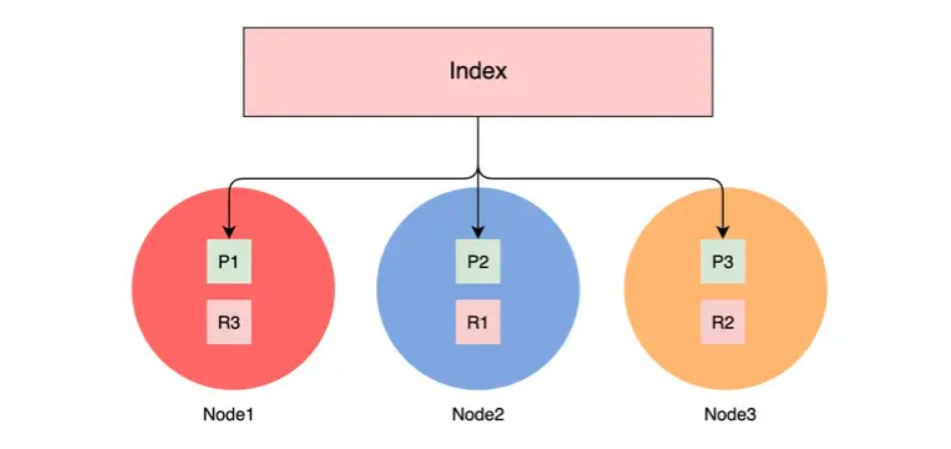

# ES 中的概念与名词

下面将自上而下介绍几个 ES 中常用的概念与名词。

## 集群层面的基本概念

### 集群（Cluster）

一台服务器安装一个 ES 称为单机 ES，因为它是支持分布式的，多个协同工作的 ES 实例就组合成了集群。分布式的 ES 集群可以存储海量的数据，也可以从容地面对更高的并发量。

得益于分布式系统的架构设计，使得 ES 集群拥有高可用性和可扩展性。

* 高可用性，分为服务可用性、数据可用性。
  * 服务可用性，在有部分节点挂掉的情况下系统还可以对外提供服务。
  * 数据可用性，部分节点挂掉，并且这些节点的数据无法恢复的情况下，也能保证数据不丢失。
* 可扩展性，当并发量提升，或者数据量增多的情况下，可以通过增加节点数来解决问题。

### 节点（Node）

在集群中，每一个 ES 服务实例就是一个节点（Node1、Node2、Node3），本质上就是一个 Java 进程。每个实例都有自己的名字，就是配置里的 `'node.name'` 设置的内容。为了标识每个节点，每个节点启动后都会分配一个 UID，存储在 data 目录。各个节点受到集群的管理，我们可以通过增加或者减少节点来达到扩容或减容的目的。

集群里的节点是有分类的，就好像一家公司的不同部门，负责不同的业务和工作，主要的节点类型如下。

* **主节点（Master）**。主节点在整个集群是唯一的，Master 从有资格进行选举的节点（Master Eligible）中选举出来。主节点主要负责管理集群变更、元数据的更改。
* **数据节点（Data Node）**。负责保存数据，要扩充存储时候需要扩展这类节点。数据节点还负责执行数据相关的操作，如：搜索、聚合、CURD 等。所以对服务器的 CPU、内存、I/O 要求都比较高。
* **协调节点（Coordinating Node）**。负责接受客户端的请求，将请求路由到对应的节点进行处理，并且把最终结果汇总到一起返回给客户端。因为需要处理结果集和对其进行排序，需要较高的 CPU 和内存资源。
* **预处理节点（Ingest Node）**。预处理操作允许在写入文档前通过定义好的一些 processors（处理器）和管道对数据进行转换。默认情况下节点启动后就是预处理节点。
* **部落节点（Tribe Node）**。部落节点可以连接到不同集群，并且支持将这些集群当成一个单独的集群处理。但它在未来的版本中将会被淘汰。
* **Hot & Warm Node**。不同硬件配置的 Data Node，用来实现 Hot & Warm 架构的节点，有利于降低集群部署成本。例如，在硬件资源好的机器中部署 Hot 类型的数据节点，而在硬件资源一般的机器上部署 Warm Node 节点。

在生产环境中建议将每个节点设置为单一角色。如果业务量或者并发量不大的情况下，为了节省成本可以调整为一个节点多种角色的集群。在开发环境中的话，为了节省资源，一个节点可以设置多种角色（伪集群模式）。

ES 版本变化比较快，所以各个节点类型的配置方式也会变动，具体的可以参考 [官方文档](https://www.elastic.co/guide/en/elasticsearch/reference/7.13/modules-node.html)。

### 分片（Shard）

一般来说，面对海量数据的时候，分布式系统可以通过增加机器数量来进行水平扩展。所以，系统需要将数据分成多个小块数据，并且尽量均匀地分配到各个机器上，然后可以通过某种策略找到对应数据块所在的位置。

分片（Shard）是 ES 底层基本的读写单元，分片是为了分割巨大的索引数据，让读写可以由多台机器来完成，从而提高系统的吞吐量。

<div style="text-align: center;">
  
  <p style="text-align: center; color: #888;">（Shard 示例）</p>
</div>

如上图，数据集 Data 按某些规则分为 4 个部分，然后被存储到 4 个节点上面（一个节点一个分片）。

### 副本（Replica）

为了保证数据可靠性，一般分布式系统都会对数据进行冗余备份，这个备份也就是副本了。

ES 将数据副本分为主从两类型：主分片（primary shard）和副分片（replica shard）。

在写入的过程中，先写主分片，成功后并发写副分片，在数据恢复时以主分片为主。多个副本除了可以保证数据可靠性外，还有一个好处是可以承担系统的读负载。

可以在 Kibana 中运行下面指令来设置分片数量和副本数量：

```bash
# 创建 mapping 的时候定义好分片和副本数量。
PUT books
{
  "mappings": {
    "properties": {
        "book_id": {
          "type": "keyword"
        },
        "name": {
          "type": "text"
        }
      }
  },
  "settings": {
    "number_of_shards": 2, # 定义了 2 个分片
    "number_of_replicas": 2 # 定义了每个分片 2 个副分片
  }
}
```

用上述指令创建 books 索引后，其在 Cerebro 中显示如下图，在红色箭头处 shards: 2 * 3 的意思是共有 2 个分片，每个分片一个主分片和 2 个副分片，加起来就是 3 个副本了。图中黄色箭头处的 0 和 1 代表的是两个分片：分片 0 、分片 1，实线代表主分片，虚线代表分片副本。

<div style="text-align: center;">
  
  <p style="text-align: center; color: #888;">（主分片和副分片示例）</p>
</div>

### 集群健康状态

通过集群的健康状态，我们可以了解集群是不是出现问题了。集群健康状态有以下 3 种。

* **Green**，集群处于健康状态，所有的主分片和副本分片都正常运行。
* **Yellow**，所有的主分片都运行正常，但是有部分副本分片不正常，意味着可能存在单点故障的风险（如果部分主分片没有备份了，一旦这个主分片数据丢失，将导致这些数据永久丢失）。如果集群只有 3 个数据节点，但是分配了 4 个副本（主分片 + 副本分片的总数），这个时候有一个副本无法分配的，因为相同的两份数据不应该被分配到同一个节点上。
* **Red**，有部分主分片没有正常运行。

需要注意的是，每个索引也有这三种状态，**如果索引丢失了一个副本分片，那么这个索引和集群的状态都变为 Yellow 状态，但是其他索引的的状态仍为 Green**。

## 集群层面的基本概念

### 索引（Index）

索引是一类相似文档的集合。ES 将数据存储在一个或者多个 Index 中，例如将用户数据存储在 User Index 中，而将订单数据存储在 Order Index 中。一个索引有一个或者多个分片，索引的数据会以某种方式分散到各个分片上去存储。

<div style="text-align: center;">
  
  <p style="text-align: center; color: #888;">（Index 示例）</p>
</div>

如上图，索引有 3 个分片。主分片分别是 P1、P2、P3，对应的副本分片为 R1、R2、R3。它们分别位于 3 个节点中。

可以发现主分片和其副本分片不会同时分配在同一个节点上，这样是为了保证当一个节点上的主分片下线时，其他节点上的从副本可以升级为主分片，保证数据的可靠性。

### Mapping
