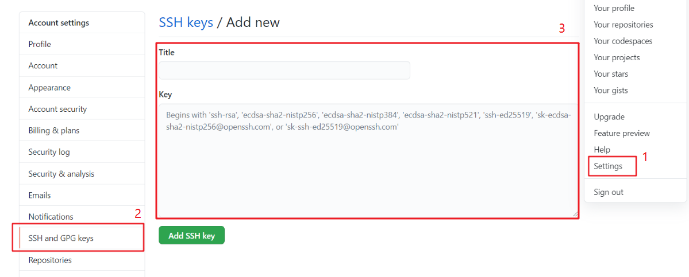

# 配置密钥实现免密操作

> 本文介绍如何在本地电脑上生成 ssh 秘钥并配置到 GitHub，实现免密 pull、push 代码。

Git 支持 https 和 git 两种传输协议，例如在 GitHub 在 clone 代码时会有两种协议可选：

* Clone with HTTPS：`https://github.com/[your-github-id]/[repo-name].git`
* Clone with SSH：`git@github.com:[your-github-id]/[repo-name].git`

若使用 https 协议，每次 pull、push 代码均提示要输入密码；若使用 git 协议，然后通过 ssh 密钥对认证，即可实现免密操作。

**本文面向使用 git 协议的情况**，我平时不是通过该协议操作的，因此仅是验证了一下操作步骤。

配置 Git 通过 ssh 协议免密需要三个步骤：

* 生成密钥对
* 配置远程仓库（这里使用 GitHub）上的公钥
* 把 Git 的 remote url 修改为 git 协议
  * 上面两个步骤初次设置过以后，以后使用都不需要再次设置；此步骤视以后项目的 remote url 而定，如果以后其他项目的协议为 https 则需要此步骤。

下面具体介绍每一步骤：

### 本地生成 ssh 秘钥

打开终端，执行 `ssh-keygen -t rsa -C "你在GitHub上使用的邮箱地址"`，如果执行成功，切换到 `~/.ssh` 目录下，此时目录应该如下所示。

```bash
├── id_rsa       # 私钥
├── id_rsa.pub   # 公钥
└── known_hosts  # 记录每个你访问过的计算机的公钥(public key), 防止 DNS 攻击
```

### 添加公钥到自己的远程仓库（GitHub）

复制公钥（`id_rsa.pub`）的内容，访问 GitHub，依次进入：`Settings --> SSH and GPG keys --> New SSH key`。

`Title` 随便填写（有意义方便区分即可），公钥粘贴到的 `Key` 文本域内，点击 `Add SSH key` 按钮，这一步就完成了将你的公钥放到了 Github 上进行托管。

<div style="text-align: center;">
  
  <p style="text-align: center; color: #888;">（Add SSH key）</p>
</div>


### 修改 git 的 remote url

在本地的某个仓库目录内使用命令 `git remote -v` 查看你当前的 remote url：

```bash
origin  https://github.com/[your-github-id]/[repo-name].git (fetch)
origin  https://github.com/[your-github-id]/[repo-name].git (push)
```

如果是以上的结果那么说明此项目是使用 https 协议进行访问的（如果地址是 git 开头则表示是 git 协议）。

登陆你的 GitHub，在上面可以看到仓库的 ssh 协议相应的 url，复制查询到的 ssh 链接，然后使用命令 `git remote set-url` 来调整 url：

```bash
git remote set-url origin git@github.com:[your-github-id]/[repo-name].git
```

再次使用命令 `git remote -v` 查看一下，url 是否已经变成了 ssh 地址：

```bash
origin git@github.com:[your-github-id]/[repo-name].git (fetch)
origin git@github.com:[your-github-id]/[repo-name].git (push)
```

接下来就可以愉快地使用 git fetch，git pull，git push，不用再输入密码。

### 后记

和 https 拉取方式不同的是，https 方式需要每次提交前都手动输入用户名和密码，ssh 的方式配置完毕后 Git 都会使用你本地的私钥和远程仓库的公钥进行验证是否是一对秘钥，从而简化了操作流程。

但是如果使用的是 Windows 电脑，在使用 ssh 的方式登录过一次后，Windows 操作系统的凭据管理器会记录我们的登录信息，下次操作就不用频繁输入账号密码了。这很方便，所以我一般还是采用 ssh 的方式来操作 Git。

（完）
