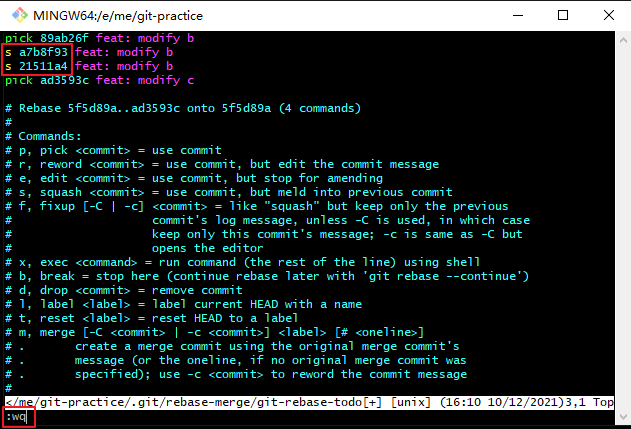
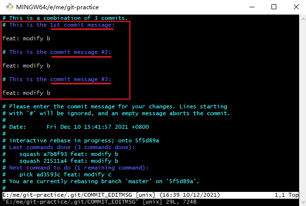
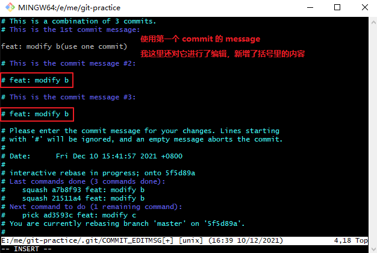
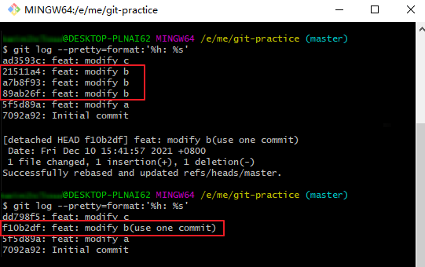
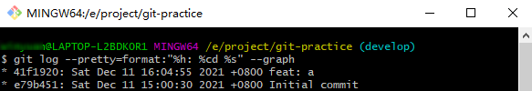
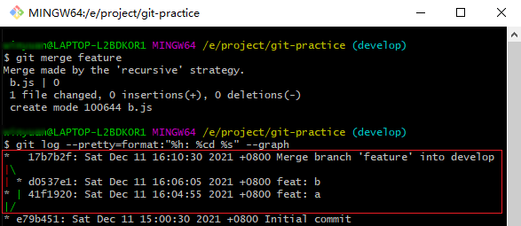
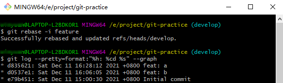

# git rebase 的两种用法

## 前言

rebase 在 Git 中是一个非常有魅力的命令，使用得当会极大提高自己的工作效率；相反，如果乱用会给团队中其他人带来麻烦。

它的作用简要概括为：可以对某一段线性提交历史进行编辑、删除、复制、粘贴；因此，合理使用 rebase 命令可以使我们的提交历史干净、简洁。

## 用法一: 合并当前分支的多个 commit 记录

有时候会遇到对同一处代码进行多次处理的场景。这会导致如下提交记录：

```bash
$ git log --pretty=format:'%h: %s'
ad3593c: feat: modify c
21511a4: feat: modify b
a7b8f93: feat: modify b
89ab26f: feat: modify b
5f5d89a: feat: modify a
7092a92: Initial commit
```

其实，中间的对 b 的 3 次提交 完全可以合并成一次 commit，这个时候 rebase 就很有用了。

### 1. 执行 rebase -i 命令

找到想要合并的 commit，使用 rebase -i：

```bash
git rebase -i 5f5d89a
```

**注意**：

* `git rebase -i [startPoint] [endPoint]`
* 前开后闭区间，这里的 `[startPoint]` 指目标 commit 的前一个 commit（即上述示例中的 `5f5d89a: feat: modify a`)。 因为三个 commit 肯定要基于上一个 commit 来合并成新的 commit。
* **谨慎使用 `[endPoint]`**，省略即默认表示从起始 commit 一直到最后一个，但是一旦填写了，则表示 `[endPoint]` 后面的 commit 全部不要了。

### 2. 进入 Interact 交互界面

终端会进入选择交互界面，让你进行变基选择操作：

<div style="text-align: center;">
  
  <p style="text-align:center; color: #888;">（git rebase 交互界面）</p>
</div>

**说明**：

* 最上面三行，就是刚刚选中的三个 commit，按时间先后顺序依次往下排序(**和 git log 的展示顺序是反的**，查看的时候需要注意)
* 前面的三个 pick 就是下面 Commands 展示的一系列命令中的第一个 p，也就是使用 commit。
  * pick：保留该 commit（缩写：p）
  * reword：保留该 commit，但我需要修改该 commit 的注释（缩写：r）
  * edit：保留该 commit，但我要停下来修改该提交（不仅仅修改注释）（缩写：e）
  * squash：将该 commit 和前一个 commit 合并（缩写：s）
  * fixup：将该 commit 和前一个 commit 合并，但我不要保留该提交的注释信息（缩写：f）
  * exec：执行 shell 命令（缩写：x）
  * drop：丢弃该 commit（缩写：d）

### 3. 使用 s 命令合并 commit

使用 s 命令，合并到上一个commit（编辑时就跟操作 vim 一样）：

* 按 `i` 进入操作，将**第二、三个 commit 的 pick 改成 s**。
* 按 `Esc` 退出操作。
* 输入 `:wq` 保存并退出。

<div style="text-align: center;">
  
  <p style="text-align:center; color: #888;">（使用 s 命令合并 commit）</p>
</div>

### 4. 修改 commit 记录

接下来会弹出第二个页面，分别展示三个 commit 的提交信息：

<div style="text-align: center;">
  
  <p style="text-align:center; color: #888;">（相关的 commit 信息列表）</p>
</div>

在这次的示例中，三个 commit 信息都是一样的。选用第一个的提交信息（也可以编辑下），将其余的全部注释掉，重复上述步骤，保存退出即可。

<div style="text-align: center;">
  
  <p style="text-align:center; color: #888;">（编辑提交信息）</p>
</div>

### 5. 查看最新合并情况

查看最新合并情况，会发现原来三个一样的提交现在合并成了一个新的 commit。

<div style="text-align: center;">
  
  <p style="text-align:center; color: #888;">（commit 合并前后对比）</p>
</div>

## 用法二: 避免出现分叉合并

接下来，将通过实际示例和场景，来分析 rebase 是如何解决分叉合并的。在此之前，我先做如下规定：

* 有两个分支: develop（主分支），feature（feature 分支）
* 新需求按时间顺序叫 `a` 、`b`……等(a 需求最早，b 其次，以此类推)
* 原 commit `a` 变基之后（hashId 改变）叫 `a'`

### 场景 1：合并时，最舒服的情况

这种场景是基于 develop 分支没有新的提交，feature 分支有新的提交后，把 feature 分支的改动合并到 develop 分支。

<div style="text-align: center;">
  <svg id="SvgjsSvg1006" width="298" height="146.75" xmlns="http://www.w3.org/2000/svg" version="1.1" xmlns:xlink="http://www.w3.org/1999/xlink" xmlns:svgjs="http://svgjs.com/svgjs"><defs id="SvgjsDefs1007"><marker id="SvgjsMarker1030" markerWidth="14" markerHeight="10" refX="10" refY="5" viewBox="0 0 14 10" orient="auto" markerUnits="userSpaceOnUse" stroke-dasharray="0,0"><path id="SvgjsPath1031" d="M0,0 L14,5 L0,10 L0,0" fill="#f44336" stroke="#f44336" stroke-width="1"></path></marker><marker id="SvgjsMarker1040" markerWidth="14" markerHeight="10" refX="10" refY="5" viewBox="0 0 14 10" orient="auto" markerUnits="userSpaceOnUse" stroke-dasharray="0,0"><path id="SvgjsPath1041" d="M0,0 L14,5 L0,10 L0,0" fill="#f44336" stroke="#f44336" stroke-width="1"></path></marker><marker id="SvgjsMarker1044" markerWidth="14" markerHeight="10" refX="10" refY="5" viewBox="0 0 14 10" orient="auto" markerUnits="userSpaceOnUse" stroke-dasharray="0,0"><path id="SvgjsPath1045" d="M0,0 L14,5 L0,10 L0,0" fill="#f44336" stroke="#f44336" stroke-width="1"></path></marker></defs><g id="SvgjsG1008" transform="translate(25,26.25)"><path id="SvgjsPath1009" d="M 0 0L 82 0L 82 27.5L 0 27.5Z" stroke="none" fill="none"></path><g id="SvgjsG1010"><text id="SvgjsText1011" font-family="微软雅黑" text-anchor="middle" font-size="16px" width="82px" fill="#f44336" font-weight="400" align="middle" lineHeight="125%" anchor="middle" family="微软雅黑" size="16px" weight="400" font-style="" opacity="1" y="1.75" transform="rotate(0)"><tspan id="SvgjsTspan1012" dy="20" x="41"><tspan id="SvgjsTspan1013" style="text-decoration:;">develop</tspan></tspan></text></g></g><g id="SvgjsG1014" transform="translate(25,92.75)"><path id="SvgjsPath1015" d="M 0 0L 82 0L 82 28.75L 0 28.75Z" stroke="none" fill="none"></path><g id="SvgjsG1016"><text id="SvgjsText1017" font-family="微软雅黑" text-anchor="middle" font-size="16px" width="82px" fill="#f44336" font-weight="400" align="middle" lineHeight="125%" anchor="middle" family="微软雅黑" size="16px" weight="400" font-style="" opacity="1" y="2.375" transform="rotate(0)"><tspan id="SvgjsTspan1018" dy="20" x="41"><tspan id="SvgjsTspan1019" style="text-decoration:;">feature</tspan></tspan></text></g></g><g id="SvgjsG1020"><path id="SvgjsPath1021" d="M66 54.75L66 73.25L66 73.25L66 91.75" stroke="#f44336" stroke-width="2" fill="none"></path></g><g id="SvgjsG1022" transform="translate(180,25)"><path id="SvgjsPath1023" d="M 0 0L 35 0L 35 30L 0 30Z" stroke="none" fill="none"></path><g id="SvgjsG1024"><text id="SvgjsText1025" font-family="微软雅黑" text-anchor="middle" font-size="16px" width="35px" fill="#f44336" font-weight="400" align="middle" lineHeight="125%" anchor="middle" family="微软雅黑" size="16px" weight="400" font-style="" opacity="1" y="3" transform="rotate(0)"><tspan id="SvgjsTspan1026" dy="20" x="17.5"><tspan id="SvgjsTspan1027" style="text-decoration:;">a</tspan></tspan></text></g></g><g id="SvgjsG1028"><path id="SvgjsPath1029" d="M108 40L143.5 40L143.5 40L176.39999999999998 40" stroke="#f44336" stroke-width="2" fill="none" marker-end="url(#SvgjsMarker1030)"></path></g><g id="SvgjsG1032" transform="translate(160,94.875)"><path id="SvgjsPath1033" d="M 0 0L 32 0L 32 24.5L 0 24.5Z" stroke="none" fill="none"></path><g id="SvgjsG1034"><text id="SvgjsText1035" font-family="微软雅黑" text-anchor="middle" font-size="16px" width="32px" fill="#f44336" font-weight="400" align="middle" lineHeight="125%" anchor="middle" family="微软雅黑" size="16px" weight="400" font-style="" opacity="1" y="0.25" transform="rotate(0)"><tspan id="SvgjsTspan1036" dy="20" x="16"><tspan id="SvgjsTspan1037" style="text-decoration:;">a</tspan></tspan></text></g></g><g id="SvgjsG1038"><path id="SvgjsPath1039" d="M108 107.125L133.5 107.125L133.5 107.125L156.39999999999998 107.125" stroke="#f44336" stroke-width="2" fill="none" marker-end="url(#SvgjsMarker1040)"></path></g><g id="SvgjsG1042"><path id="SvgjsPath1043" d="M176.4745933782927 93.99479483909673L195.7914638381464 58.168738579251766" stroke="#f44336" stroke-width="2" fill="none" marker-end="url(#SvgjsMarker1044)"></path></g><g id="SvgjsG1046" transform="translate(153,60.5)"><path id="SvgjsPath1047" d="M 0 0L 120 0L 120 40L 0 40Z" stroke="none" fill="none"></path><g id="SvgjsG1048"><text id="SvgjsText1049" font-family="微软雅黑" text-anchor="middle" font-size="16px" width="120px" fill="#f44336" font-weight="400" align="middle" lineHeight="125%" anchor="middle" family="微软雅黑" size="16px" weight="400" font-style="" opacity="1" y="8" transform="rotate(0)"><tspan id="SvgjsTspan1050" dy="20" x="60"><tspan id="SvgjsTspan1051" style="text-decoration:;">合并</tspan></tspan></text></g></g></svg>
  <p style="text-align:center; color: #888;">（最理想的合并情况）</p>
</div>

此时的合并有两点好处：

* 没有冲突
* 没有多余的 commit 提交

其实这种情况下，rebase 和 merge 的效果是一样的。而后面所有的 rebase 都是奔着这个目标来的。

### 场景 2：各分支都有自己新的 commit

develop 新增需求 a: "feat: a"

<div style="text-align: center;">
  
  <p style="text-align:center; color: #888;">（develop 分支的 log）</p>
</div>

feature  新增需求 b: "feat: b"

<div style="text-align: center;">
  
  <p style="text-align:center; color: #888;">（feature 分支的 log）</p>
</div>

#### 1）develop merge feature

develop 直接 merge feature：切换到 develop 分支执行命令 `git merge feature`。

<div style="text-align: center;">
  
  <p style="text-align:center; color: #888;">（develop 直接 merge feature）</p>
</div>

会出现以下结果：

* 会保留所有的 commit（hashId 不变）
* 按提交顺序排序
* 产生新的 commit 点（Merge branch 'xxx' into develop）

<div style="text-align: center;">
  <svg id="SvgjsSvg1052" width="611" height="146.75" xmlns="http://www.w3.org/2000/svg" version="1.1" xmlns:xlink="http://www.w3.org/1999/xlink" xmlns:svgjs="http://svgjs.com/svgjs"><defs id="SvgjsDefs1053"><marker id="SvgjsMarker1076" markerWidth="14" markerHeight="10" refX="10" refY="5" viewBox="0 0 14 10" orient="auto" markerUnits="userSpaceOnUse" stroke-dasharray="0,0"><path id="SvgjsPath1077" d="M0,0 L14,5 L0,10 L0,0" fill="#f44336" stroke="#f44336" stroke-width="1"></path></marker><marker id="SvgjsMarker1086" markerWidth="14" markerHeight="10" refX="10" refY="5" viewBox="0 0 14 10" orient="auto" markerUnits="userSpaceOnUse" stroke-dasharray="0,0"><path id="SvgjsPath1087" d="M0,0 L14,5 L0,10 L0,0" fill="#f44336" stroke="#f44336" stroke-width="1"></path></marker><marker id="SvgjsMarker1096" markerWidth="14" markerHeight="10" refX="10" refY="5" viewBox="0 0 14 10" orient="auto" markerUnits="userSpaceOnUse" stroke-dasharray="0,0"><path id="SvgjsPath1097" d="M0,0 L14,5 L0,10 L0,0" fill="#f44336" stroke="#f44336" stroke-width="1"></path></marker><marker id="SvgjsMarker1100" markerWidth="14" markerHeight="10" refX="10" refY="5" viewBox="0 0 14 10" orient="auto" markerUnits="userSpaceOnUse" stroke-dasharray="0,0"><path id="SvgjsPath1101" d="M0,0 L14,5 L0,10 L0,0" fill="#f44336" stroke="#f44336" stroke-width="1"></path></marker><marker id="SvgjsMarker1110" markerWidth="14" markerHeight="10" refX="10" refY="5" viewBox="0 0 14 10" orient="auto" markerUnits="userSpaceOnUse" stroke-dasharray="0,0"><path id="SvgjsPath1111" d="M0,0 L14,5 L0,10 L0,0" fill="#f44336" stroke="#f44336" stroke-width="1"></path></marker></defs><g id="SvgjsG1054" transform="translate(25,26.25)"><path id="SvgjsPath1055" d="M 0 0L 82 0L 82 27.5L 0 27.5Z" stroke="none" fill="none"></path><g id="SvgjsG1056"><text id="SvgjsText1057" font-family="微软雅黑" text-anchor="middle" font-size="16px" width="82px" fill="#f44336" font-weight="400" align="middle" lineHeight="125%" anchor="middle" family="微软雅黑" size="16px" weight="400" font-style="" opacity="1" y="1.75" transform="rotate(0)"><tspan id="SvgjsTspan1058" dy="20" x="41"><tspan id="SvgjsTspan1059" style="text-decoration:;">develop</tspan></tspan></text></g></g><g id="SvgjsG1060" transform="translate(25,92.75)"><path id="SvgjsPath1061" d="M 0 0L 82 0L 82 28.75L 0 28.75Z" stroke="none" fill="none"></path><g id="SvgjsG1062"><text id="SvgjsText1063" font-family="微软雅黑" text-anchor="middle" font-size="16px" width="82px" fill="#f44336" font-weight="400" align="middle" lineHeight="125%" anchor="middle" family="微软雅黑" size="16px" weight="400" font-style="" opacity="1" y="2.375" transform="rotate(0)"><tspan id="SvgjsTspan1064" dy="20" x="41"><tspan id="SvgjsTspan1065" style="text-decoration:;">feature</tspan></tspan></text></g></g><g id="SvgjsG1066"><path id="SvgjsPath1067" d="M66 54.75L66 73.25L66 73.25L66 91.75" stroke="#f44336" stroke-width="2" fill="none"></path></g><g id="SvgjsG1068" transform="translate(160,25)"><path id="SvgjsPath1069" d="M 0 0L 35 0L 35 30L 0 30Z" stroke="none" fill="none"></path><g id="SvgjsG1070"><text id="SvgjsText1071" font-family="微软雅黑" text-anchor="middle" font-size="16px" width="35px" fill="#f44336" font-weight="400" align="middle" lineHeight="125%" anchor="middle" family="微软雅黑" size="16px" weight="400" font-style="" opacity="1" y="3" transform="rotate(0)"><tspan id="SvgjsTspan1072" dy="20" x="17.5"><tspan id="SvgjsTspan1073" style="text-decoration:;">a</tspan></tspan></text></g></g><g id="SvgjsG1074"><path id="SvgjsPath1075" d="M108 40L133.5 40L133.5 40L156.39999999999998 40" stroke="#f44336" stroke-width="2" fill="none" marker-end="url(#SvgjsMarker1076)"></path></g><g id="SvgjsG1078" transform="translate(160,94.875)"><path id="SvgjsPath1079" d="M 0 0L 32 0L 32 24.5L 0 24.5Z" stroke="none" fill="none"></path><g id="SvgjsG1080"><text id="SvgjsText1081" font-family="微软雅黑" text-anchor="middle" font-size="16px" width="32px" fill="#f44336" font-weight="400" align="middle" lineHeight="125%" anchor="middle" family="微软雅黑" size="16px" weight="400" font-style="" opacity="1" y="0.25" transform="rotate(0)"><tspan id="SvgjsTspan1082" dy="20" x="16"><tspan id="SvgjsTspan1083" style="text-decoration:;">b</tspan></tspan></text></g></g><g id="SvgjsG1084"><path id="SvgjsPath1085" d="M108 107.125L133.5 107.125L133.5 107.125L156.39999999999998 107.125" stroke="#f44336" stroke-width="2" fill="none" marker-end="url(#SvgjsMarker1086)"></path></g><g id="SvgjsG1088" transform="translate(240,25)"><path id="SvgjsPath1089" d="M 0 0L 35 0L 35 30L 0 30Z" stroke="none" fill="none"></path><g id="SvgjsG1090"><text id="SvgjsText1091" font-family="微软雅黑" text-anchor="middle" font-size="16px" width="35px" fill="#f44336" font-weight="400" align="middle" lineHeight="125%" anchor="middle" family="微软雅黑" size="16px" weight="400" font-style="" opacity="1" y="3" transform="rotate(0)"><tspan id="SvgjsTspan1092" dy="20" x="17.5"><tspan id="SvgjsTspan1093" style="text-decoration:;">b</tspan></tspan></text></g></g><g id="SvgjsG1094"><path id="SvgjsPath1095" d="M196 40L236.39999999999998 40" stroke="#f44336" stroke-width="2" fill="none" marker-end="url(#SvgjsMarker1096)"></path></g><g id="SvgjsG1098"><path id="SvgjsPath1099" d="M192.7824687641022 106.50231016291866L254.68311244923206 57.24168341349278" stroke="#f44336" stroke-width="2" fill="none" marker-end="url(#SvgjsMarker1100)"></path></g><g id="SvgjsG1102" transform="translate(325,26.25)"><path id="SvgjsPath1103" d="M 0 0L 261 0L 261 27.5L 0 27.5Z" stroke="none" fill="none"></path><g id="SvgjsG1104"><text id="SvgjsText1105" font-family="微软雅黑" text-anchor="middle" font-size="16px" width="261px" fill="#f44336" font-weight="400" align="middle" lineHeight="125%" anchor="middle" family="微软雅黑" size="16px" weight="400" font-style="" opacity="1" y="1.75" transform="rotate(0)"><tspan id="SvgjsTspan1106" dy="20" x="130.5"><tspan id="SvgjsTspan1107" style="text-decoration:;">Merge branch 'xxx' into develop</tspan></tspan></text></g></g><g id="SvgjsG1108"><path id="SvgjsPath1109" d="M276 40L321.4 40" stroke="#f44336" stroke-width="2" fill="none" marker-end="url(#SvgjsMarker1110)"></path></g></svg>
  <p style="text-align:center; color: #888;">（develop 直接 merge feature）</p>
</div>

#### 2）develop rebase feature

如果在 develop 分支没有直接执行 merge 命令，而是执行的 rebase 命令 `git rebase -i feature`。

<div style="text-align: center;">
  
  <p style="text-align:center; color: #888;">（develop rebase feature）</p>
</div>

会出现以下结果：

* develop 分支的 a 会被排在合进来的 feature 分支 b 的上面（尽管 a 是先完成的）
* develop 的原 commit a 被移除，产生了新的 commit a'（hashId 已变）
* 从 feature 合进来的 b 不变（不会对合进来的 commit 进行变基）

<div style="text-align: center;">
  <svg id="SvgjsSvg1112" width="385" height="176.75" xmlns="http://www.w3.org/2000/svg" version="1.1" xmlns:xlink="http://www.w3.org/1999/xlink" xmlns:svgjs="http://svgjs.com/svgjs"><defs id="SvgjsDefs1113"><marker id="SvgjsMarker1140" markerWidth="14" markerHeight="10" refX="10" refY="5" viewBox="0 0 14 10" orient="auto" markerUnits="userSpaceOnUse" stroke-dasharray="0,0"><path id="SvgjsPath1141" d="M0,0 L14,5 L0,10 L0,0" fill="#f44336" stroke="#f44336" stroke-width="1"></path></marker><marker id="SvgjsMarker1150" markerWidth="14" markerHeight="10" refX="10" refY="5" viewBox="0 0 14 10" orient="auto" markerUnits="userSpaceOnUse" stroke-dasharray="0,0"><path id="SvgjsPath1151" d="M0,0 L14,5 L0,10 L0,0" fill="#f44336" stroke="#f44336" stroke-width="1"></path></marker><marker id="SvgjsMarker1160" markerWidth="14" markerHeight="10" refX="10" refY="5" viewBox="0 0 14 10" orient="auto" markerUnits="userSpaceOnUse" stroke-dasharray="0,0"><path id="SvgjsPath1161" d="M0,0 L14,5 L0,10 L0,0" fill="#f44336" stroke="#f44336" stroke-width="1"></path></marker><marker id="SvgjsMarker1170" markerWidth="14" markerHeight="10" refX="10" refY="5" viewBox="0 0 14 10" orient="auto" markerUnits="userSpaceOnUse" stroke-dasharray="0,0"><path id="SvgjsPath1171" d="M0,0 L14,5 L0,10 L0,0" fill="#f44336" stroke="#f44336" stroke-width="1"></path></marker><marker id="SvgjsMarker1174" markerWidth="14" markerHeight="10" refX="10" refY="5" viewBox="0 0 14 10" orient="auto" markerUnits="userSpaceOnUse" stroke-dasharray="0,0"><path id="SvgjsPath1175" d="M0,0 L14,5 L0,10 L0,0" fill="#f44336" stroke="#f44336" stroke-width="1"></path></marker></defs><g id="SvgjsG1114" transform="translate(165,56.5)"><path id="SvgjsPath1115" d="M 0 13.5C 0 -4.5 27 -4.5 27 13.5C 27 31.5 0 31.5 0 13.5Z" stroke="rgba(244,67,54,1)" stroke-width="2" fill-opacity="1" fill="#ffffff"></path><g id="SvgjsG1116"><text id="SvgjsText1117" font-family="微软雅黑" text-anchor="middle" font-size="13px" width="7px" fill="#323232" font-weight="400" align="middle" lineHeight="125%" anchor="middle" family="微软雅黑" size="13px" weight="400" font-style="" opacity="1" y="3.875" transform="rotate(0)"></text></g></g><g id="SvgjsG1118" transform="translate(158.5,55)"><path id="SvgjsPath1119" d="M 0 0L 35 0L 35 30L 0 30Z" stroke="none" fill="none"></path><g id="SvgjsG1120"><text id="SvgjsText1121" font-family="微软雅黑" text-anchor="middle" font-size="16px" width="35px" fill="#f44336" font-weight="400" align="middle" lineHeight="125%" anchor="middle" family="微软雅黑" size="16px" weight="400" font-style="" opacity="1" y="3" transform="rotate(0)"><tspan id="SvgjsTspan1122" dy="20" x="17.5"><tspan id="SvgjsTspan1123" style="text-decoration:;">a</tspan></tspan></text></g></g><g id="SvgjsG1124" transform="translate(25,56.25)"><path id="SvgjsPath1125" d="M 0 0L 82 0L 82 27.5L 0 27.5Z" stroke="none" fill="none"></path><g id="SvgjsG1126"><text id="SvgjsText1127" font-family="微软雅黑" text-anchor="middle" font-size="16px" width="82px" fill="#f44336" font-weight="400" align="middle" lineHeight="125%" anchor="middle" family="微软雅黑" size="16px" weight="400" font-style="" opacity="1" y="1.75" transform="rotate(0)"><tspan id="SvgjsTspan1128" dy="20" x="41"><tspan id="SvgjsTspan1129" style="text-decoration:;">develop</tspan></tspan></text></g></g><g id="SvgjsG1130" transform="translate(25,122.75)"><path id="SvgjsPath1131" d="M 0 0L 82 0L 82 28.75L 0 28.75Z" stroke="none" fill="none"></path><g id="SvgjsG1132"><text id="SvgjsText1133" font-family="微软雅黑" text-anchor="middle" font-size="16px" width="82px" fill="#f44336" font-weight="400" align="middle" lineHeight="125%" anchor="middle" family="微软雅黑" size="16px" weight="400" font-style="" opacity="1" y="2.375" transform="rotate(0)"><tspan id="SvgjsTspan1134" dy="20" x="41"><tspan id="SvgjsTspan1135" style="text-decoration:;">feature</tspan></tspan></text></g></g><g id="SvgjsG1136"><path id="SvgjsPath1137" d="M66 84.75L66 103.25L66 103.25L66 121.75" stroke="#f44336" stroke-width="2" fill="none"></path></g><g id="SvgjsG1138"><path id="SvgjsPath1139" d="M108 70L132.75 70L132.75 70L154.89999999999998 70" stroke="#f44336" stroke-width="2" fill="none" marker-end="url(#SvgjsMarker1140)"></path></g><g id="SvgjsG1142" transform="translate(160,124.875)"><path id="SvgjsPath1143" d="M 0 0L 32 0L 32 24.5L 0 24.5Z" stroke="none" fill="none"></path><g id="SvgjsG1144"><text id="SvgjsText1145" font-family="微软雅黑" text-anchor="middle" font-size="16px" width="32px" fill="#f44336" font-weight="400" align="middle" lineHeight="125%" anchor="middle" family="微软雅黑" size="16px" weight="400" font-style="" opacity="1" y="0.25" transform="rotate(0)"><tspan id="SvgjsTspan1146" dy="20" x="16"><tspan id="SvgjsTspan1147" style="text-decoration:;">b</tspan></tspan></text></g></g><g id="SvgjsG1148"><path id="SvgjsPath1149" d="M108 137.125L133.5 137.125L133.5 137.125L156.39999999999998 137.125" stroke="#f44336" stroke-width="2" fill="none" marker-end="url(#SvgjsMarker1150)"></path></g><g id="SvgjsG1152" transform="translate(240,55)"><path id="SvgjsPath1153" d="M 0 0L 35 0L 35 30L 0 30Z" stroke="none" fill="none"></path><g id="SvgjsG1154"><text id="SvgjsText1155" font-family="微软雅黑" text-anchor="middle" font-size="16px" width="35px" fill="#f44336" font-weight="400" align="middle" lineHeight="125%" anchor="middle" family="微软雅黑" size="16px" weight="400" font-style="" opacity="1" y="3" transform="rotate(0)"><tspan id="SvgjsTspan1156" dy="20" x="17.5"><tspan id="SvgjsTspan1157" style="text-decoration:;">b</tspan></tspan></text></g></g><g id="SvgjsG1158"><path id="SvgjsPath1159" d="M276 70L325 70" stroke="#f44336" stroke-width="2" fill="none" marker-end="url(#SvgjsMarker1160)"></path></g><g id="SvgjsG1162" transform="translate(325,55)"><path id="SvgjsPath1163" d="M 0 0L 35 0L 35 30L 0 30Z" stroke="none" fill="none"></path><g id="SvgjsG1164"><text id="SvgjsText1165" font-family="微软雅黑" text-anchor="middle" font-size="16px" width="35px" fill="#f44336" font-weight="400" align="middle" lineHeight="125%" anchor="middle" family="微软雅黑" size="16px" weight="400" font-style="" opacity="1" y="3" transform="rotate(0)"><tspan id="SvgjsTspan1166" dy="20" x="17.5"><tspan id="SvgjsTspan1167" style="text-decoration:;">a'</tspan></tspan></text></g></g><g id="SvgjsG1168"><path id="SvgjsPath1169" d="M176 54L176 25L342.5 25L342.5 51.400000000000006" stroke="#f44336" stroke-width="2" fill="none" marker-end="url(#SvgjsMarker1170)"></path></g><g id="SvgjsG1172"><path id="SvgjsPath1173" d="M193 137.125L257.5 137.125L257.5 88.6" stroke="#f44336" stroke-width="2" fill="none" marker-end="url(#SvgjsMarker1174)"></path></g></svg>
  <p style="text-align:center; color: #888;">（develop rebase feature）</p>
</div>

#### 3）rebase 两步走 - 正确姿势

* Step 1：切换到 feature 分支，去 rebase develop，即 `git rebase -i develop`
  * feature 的 commit b 会重新生成一个 b'，排在 develop 的新需求 a 的后面。
  * 这一步相当于回到场景 1 的模式，我在当前 feature 先把自己的 b 拎出来，同步完最新的 develop，再把需求 b 放在最后面。
  * 接下来回到 develop 进行 merge 的时候就很舒服了。
* Step 2：切换到 develop 分支，去 merge feature，即 `git merge feature`
  * 合并后查看 log，可以发现 develop 分支作为主分支，本次合并没有影响自己原来的 commit 历史，只在后面新增了 feature 的新内容，并没有多余的 commit。

<div style="text-align: center;">
  <svg id="SvgjsSvg1176" width="457.25" height="226.5" xmlns="http://www.w3.org/2000/svg" version="1.1" xmlns:xlink="http://www.w3.org/1999/xlink" xmlns:svgjs="http://svgjs.com/svgjs"><defs id="SvgjsDefs1177"><marker id="SvgjsMarker1224" markerWidth="14" markerHeight="10" refX="10" refY="5" viewBox="0 0 14 10" orient="auto" markerUnits="userSpaceOnUse" stroke-dasharray="0,0"><path id="SvgjsPath1225" d="M0,0 L14,5 L0,10 L0,0" fill="#f44336" stroke="#f44336" stroke-width="1"></path></marker><marker id="SvgjsMarker1228" markerWidth="14" markerHeight="10" refX="10" refY="5" viewBox="0 0 14 10" orient="auto" markerUnits="userSpaceOnUse" stroke-dasharray="0,0"><path id="SvgjsPath1229" d="M0,0 L14,5 L0,10 L0,0" fill="#f44336" stroke="#f44336" stroke-width="1"></path></marker><marker id="SvgjsMarker1232" markerWidth="14" markerHeight="10" refX="10" refY="5" viewBox="0 0 14 10" orient="auto" markerUnits="userSpaceOnUse" stroke-dasharray="0,0"><path id="SvgjsPath1233" d="M0,0 L14,5 L0,10 L0,0" fill="#f44336" stroke="#f44336" stroke-width="1"></path></marker><marker id="SvgjsMarker1254" markerWidth="14" markerHeight="10" refX="10" refY="5" viewBox="0 0 14 10" orient="auto" markerUnits="userSpaceOnUse" stroke-dasharray="0,0"><path id="SvgjsPath1255" d="M0,0 L14,5 L0,10 L0,0" fill="#f44336" stroke="#f44336" stroke-width="1"></path></marker><marker id="SvgjsMarker1258" markerWidth="14" markerHeight="10" refX="10" refY="5" viewBox="0 0 14 10" orient="auto" markerUnits="userSpaceOnUse" stroke-dasharray="0,0"><path id="SvgjsPath1259" d="M0,0 L14,5 L0,10 L0,0" fill="#f44336" stroke="#f44336" stroke-width="1"></path></marker><marker id="SvgjsMarker1262" markerWidth="14" markerHeight="10" refX="10" refY="5" viewBox="0 0 14 10" orient="auto" markerUnits="userSpaceOnUse" stroke-dasharray="0,0"><path id="SvgjsPath1263" d="M0,0 L14,5 L0,10 L0,0" fill="#f44336" stroke="#f44336" stroke-width="1"></path></marker></defs><g id="SvgjsG1178" transform="translate(245,53.5)"><path id="SvgjsPath1179" d="M 0 0L 152 0L 152 148L 0 148Z" stroke="rgba(186,104,200,1)" stroke-width="1" fill-opacity="1" fill="#ffffff"></path><g id="SvgjsG1180"><text id="SvgjsText1181" font-family="微软雅黑" text-anchor="middle" font-size="13px" width="132px" fill="#323232" font-weight="400" align="middle" lineHeight="125%" anchor="middle" family="微软雅黑" size="13px" weight="400" font-style="" opacity="1" y="64.375" transform="rotate(0)"></text></g></g><g id="SvgjsG1182" transform="translate(25,53.5)"><path id="SvgjsPath1183" d="M 0 0L 216 0L 216 148L 0 148Z" stroke="rgba(251,192,45,1)" stroke-width="1" fill-opacity="1" fill="#ffffff"></path><g id="SvgjsG1184"><text id="SvgjsText1185" font-family="微软雅黑" text-anchor="middle" font-size="13px" width="196px" fill="#323232" font-weight="400" align="middle" lineHeight="125%" anchor="middle" family="微软雅黑" size="13px" weight="400" font-style="" opacity="1" y="64.375" transform="rotate(0)"></text></g></g><g id="SvgjsG1186" transform="translate(176.5,126.625)"><path id="SvgjsPath1187" d="M 0 13.5C 0 -4.5 27 -4.5 27 13.5C 27 31.5 0 31.5 0 13.5Z" stroke="rgba(158,158,158,1)" stroke-width="2" fill-opacity="1" fill="#ffffff"></path><g id="SvgjsG1188"><text id="SvgjsText1189" font-family="微软雅黑" text-anchor="middle" font-size="13px" width="7px" fill="#323232" font-weight="400" align="middle" lineHeight="125%" anchor="middle" family="微软雅黑" size="13px" weight="400" font-style="" opacity="1" y="3.875" transform="rotate(0)"></text></g></g><g id="SvgjsG1190" transform="translate(141.75,79.578125)"><path id="SvgjsPath1191" d="M 0 0L 96.5 0L 96.5 115.921875L 0 115.921875Z" stroke="none" fill="none"></path><g id="SvgjsG1192"><text id="SvgjsText1193" font-family="微软雅黑" text-anchor="middle" font-size="35px" width="97px" fill="#9e9e9e" font-weight="400" align="middle" lineHeight="125%" anchor="middle" family="微软雅黑" size="35px" weight="400" font-style="" opacity="1" y="29.5859375" transform="rotate(0)"><tspan id="SvgjsTspan1194" dy="43" x="48.5"><tspan id="SvgjsTspan1195" style="text-decoration:;">×</tspan></tspan></text></g></g><g id="SvgjsG1196" transform="translate(174,127.875)"><path id="SvgjsPath1197" d="M 0 0L 32 0L 32 24.5L 0 24.5Z" stroke="none" fill="none"></path><g id="SvgjsG1198"><text id="SvgjsText1199" font-family="微软雅黑" text-anchor="middle" font-size="16px" width="32px" fill="#f44336" font-weight="400" align="middle" lineHeight="125%" anchor="middle" family="微软雅黑" size="16px" weight="400" font-style="" opacity="1" y="0.25" transform="rotate(0)"><tspan id="SvgjsTspan1200" dy="20" x="16"><tspan id="SvgjsTspan1201" style="text-decoration:;">b</tspan></tspan></text></g></g><g id="SvgjsG1202" transform="translate(172.5,58)"><path id="SvgjsPath1203" d="M 0 0L 35 0L 35 30L 0 30Z" stroke="none" fill="none"></path><g id="SvgjsG1204"><text id="SvgjsText1205" font-family="微软雅黑" text-anchor="middle" font-size="16px" width="35px" fill="#f44336" font-weight="400" align="middle" lineHeight="125%" anchor="middle" family="微软雅黑" size="16px" weight="400" font-style="" opacity="1" y="3" transform="rotate(0)"><tspan id="SvgjsTspan1206" dy="20" x="17.5"><tspan id="SvgjsTspan1207" style="text-decoration:;">a</tspan></tspan></text></g></g><g id="SvgjsG1208" transform="translate(39,59.25)"><path id="SvgjsPath1209" d="M 0 0L 82 0L 82 27.5L 0 27.5Z" stroke="none" fill="none"></path><g id="SvgjsG1210"><text id="SvgjsText1211" font-family="微软雅黑" text-anchor="middle" font-size="16px" width="82px" fill="#f44336" font-weight="400" align="middle" lineHeight="125%" anchor="middle" family="微软雅黑" size="16px" weight="400" font-style="" opacity="1" y="1.75" transform="rotate(0)"><tspan id="SvgjsTspan1212" dy="20" x="41"><tspan id="SvgjsTspan1213" style="text-decoration:;">develop</tspan></tspan></text></g></g><g id="SvgjsG1214" transform="translate(39,125.75)"><path id="SvgjsPath1215" d="M 0 0L 82 0L 82 28.75L 0 28.75Z" stroke="none" fill="none"></path><g id="SvgjsG1216"><text id="SvgjsText1217" font-family="微软雅黑" text-anchor="middle" font-size="16px" width="82px" fill="#f44336" font-weight="400" align="middle" lineHeight="125%" anchor="middle" family="微软雅黑" size="16px" weight="400" font-style="" opacity="1" y="2.375" transform="rotate(0)"><tspan id="SvgjsTspan1218" dy="20" x="41"><tspan id="SvgjsTspan1219" style="text-decoration:;">feature</tspan></tspan></text></g></g><g id="SvgjsG1220"><path id="SvgjsPath1221" d="M80 87.75L80 106.25L80 106.25L80 124.75" stroke="#f44336" stroke-width="2" fill="none"></path></g><g id="SvgjsG1222"><path id="SvgjsPath1223" d="M122 73L146.75 73L146.75 73L168.89999999999998 73" stroke="#f44336" stroke-width="2" fill="none" marker-end="url(#SvgjsMarker1224)"></path></g><g id="SvgjsG1226"><path id="SvgjsPath1227" d="M122 140.125L147.5 140.125L147.5 140.125L170.39999999999998 140.125" stroke="#f44336" stroke-width="2" fill="none" marker-end="url(#SvgjsMarker1228)"></path></g><g id="SvgjsG1230"><path id="SvgjsPath1231" d="M254 73L339 73" stroke="#f44336" stroke-width="2" fill="none" marker-end="url(#SvgjsMarker1232)"></path></g><g id="SvgjsG1234" transform="translate(339,58)"><path id="SvgjsPath1235" d="M 0 0L 35 0L 35 30L 0 30Z" stroke="none" fill="none"></path><g id="SvgjsG1236"><text id="SvgjsText1237" font-family="微软雅黑" text-anchor="middle" font-size="16px" width="35px" fill="#f44336" font-weight="400" align="middle" lineHeight="125%" anchor="middle" family="微软雅黑" size="16px" weight="400" font-style="" opacity="1" y="3" transform="rotate(0)"><tspan id="SvgjsTspan1238" dy="20" x="17.5"><tspan id="SvgjsTspan1239" style="text-decoration:;">b'</tspan></tspan></text></g></g><g id="SvgjsG1240" transform="translate(254,125.125)"><path id="SvgjsPath1241" d="M 0 0L 35 0L 35 30L 0 30Z" stroke="none" fill="none"></path><g id="SvgjsG1242"><text id="SvgjsText1243" font-family="微软雅黑" text-anchor="middle" font-size="16px" width="35px" fill="#f44336" font-weight="400" align="middle" lineHeight="125%" anchor="middle" family="微软雅黑" size="16px" weight="400" font-style="" opacity="1" y="3" transform="rotate(0)"><tspan id="SvgjsTspan1244" dy="20" x="17.5"><tspan id="SvgjsTspan1245" style="text-decoration:;">b'</tspan></tspan></text></g></g><g id="SvgjsG1246" transform="translate(212.5,125.125)"><path id="SvgjsPath1247" d="M 0 0L 35 0L 35 30L 0 30Z" stroke="none" fill="none"></path><g id="SvgjsG1248"><text id="SvgjsText1249" font-family="微软雅黑" text-anchor="middle" font-size="16px" width="35px" fill="#f44336" font-weight="400" align="middle" lineHeight="125%" anchor="middle" family="微软雅黑" size="16px" weight="400" font-style="" opacity="1" y="3" transform="rotate(0)"><tspan id="SvgjsTspan1250" dy="20" x="17.5"><tspan id="SvgjsTspan1251" style="text-decoration:;">a</tspan></tspan></text></g></g><g id="SvgjsG1252"><path id="SvgjsPath1253" d="M208.5 73L230 73L230 121.525" stroke="#f44336" stroke-width="2" fill="none" marker-end="url(#SvgjsMarker1254)"></path></g><g id="SvgjsG1256"><path id="SvgjsPath1257" d="M190 153.375L190 185.125L271.5 185.125L271.5 158.725" stroke="#f44336" stroke-width="2" fill="none" marker-end="url(#SvgjsMarker1258)"></path></g><g id="SvgjsG1260"><path id="SvgjsPath1261" d="M289.7914783660376 139.51380281733762L353.65067788226463 90.20030985758456" stroke="#f44336" stroke-width="2" fill="none" marker-end="url(#SvgjsMarker1262)"></path></g><g id="SvgjsG1264" transform="translate(28.5,25)"><path id="SvgjsPath1265" d="M 0 0L 193.5 0L 193.5 28.5L 0 28.5Z" stroke="none" fill="none"></path><g id="SvgjsG1266"><text id="SvgjsText1267" font-family="微软雅黑" text-anchor="middle" font-size="16px" width="194px" fill="#fbc02d" font-weight="400" align="middle" lineHeight="125%" anchor="middle" family="微软雅黑" size="16px" weight="400" font-style="" opacity="1" y="2.25" transform="rotate(0)"><tspan id="SvgjsTspan1268" dy="20" x="97"><tspan id="SvgjsTspan1269" style="text-decoration:;">feature rebase develop</tspan></tspan></text></g></g><g id="SvgjsG1270" transform="translate(238.25,25)"><path id="SvgjsPath1271" d="M 0 0L 193.5 0L 193.5 28.5L 0 28.5Z" stroke="none" fill="none"></path><g id="SvgjsG1272"><text id="SvgjsText1273" font-family="微软雅黑" text-anchor="middle" font-size="16px" width="194px" fill="#ba68c8" font-weight="400" align="middle" lineHeight="125%" anchor="middle" family="微软雅黑" size="16px" weight="400" font-style="" opacity="1" y="2.25" transform="rotate(0)"><tspan id="SvgjsTspan1274" dy="20" x="97"><tspan id="SvgjsTspan1275" style="text-decoration:;">develop merge feature </tspan></tspan></text></g></g></svg>
  <p style="text-align:center; color: #888;">（rebase 两步走）</p>
</div>

以上就是 rebase 为什么不会产生多余 commit 记录的原因了。

### rebase 时如何解决冲突

如果两个分支修改了同一文件的同一位置，在 rebase 的时候会提示发生冲突，较为优雅的解决方案：

* 先解决冲突，再保存。
* `git add .`
* `git rebase --continue`

## 使用 rebase 的注意点

::: warning
如果提交存在于你的仓库之外，而别人可能基于这些提交进行开发，那么不要执行变基。  
如果你遵循这条金科玉律，就不会出差错。否则，**人民群众会仇恨你，你的朋友和家人也会嘲笑你，唾弃你**。
—— 引用自[官网](https://git-scm.com/book/zh/v2/Git-分支-变基)
:::

### 不要基于即将 rebase 的分支去切新分支

<div style="text-align: center;">
  <svg id="SvgjsSvg1440" width="500.328125" height="228" xmlns="http://www.w3.org/2000/svg" version="1.1" xmlns:xlink="http://www.w3.org/1999/xlink" xmlns:svgjs="http://svgjs.com/svgjs"><defs id="SvgjsDefs1441"><marker id="SvgjsMarker1474" markerWidth="14" markerHeight="10" refX="10" refY="5" viewBox="0 0 14 10" orient="auto" markerUnits="userSpaceOnUse" stroke-dasharray="0,0"><path id="SvgjsPath1475" d="M0,0 L14,5 L0,10 L0,0" fill="#f44336" stroke="#f44336" stroke-width="1"></path></marker><marker id="SvgjsMarker1478" markerWidth="14" markerHeight="10" refX="10" refY="5" viewBox="0 0 14 10" orient="auto" markerUnits="userSpaceOnUse" stroke-dasharray="0,0"><path id="SvgjsPath1479" d="M0,0 L14,5 L0,10 L0,0" fill="#1976d2" stroke="#1976d2" stroke-width="1"></path></marker><marker id="SvgjsMarker1494" markerWidth="14" markerHeight="10" refX="10" refY="5" viewBox="0 0 14 10" orient="auto" markerUnits="userSpaceOnUse" stroke-dasharray="0,0"><path id="SvgjsPath1495" d="M0,0 L14,5 L0,10 L0,0" fill="#1976d2" stroke="#1976d2" stroke-width="1"></path></marker><marker id="SvgjsMarker1504" markerWidth="14" markerHeight="10" refX="10" refY="5" viewBox="0 0 14 10" orient="auto" markerUnits="userSpaceOnUse" stroke-dasharray="0,0"><path id="SvgjsPath1505" d="M0,0 L14,5 L0,10 L0,0" fill="#1976d2" stroke="#1976d2" stroke-width="1"></path></marker></defs><g id="SvgjsG1442" transform="translate(163.5,93)"><path id="SvgjsPath1443" d="M 0 14.5C 0 -4.833333333333333 27 -4.833333333333333 27 14.5C 27 33.833333333333336 0 33.833333333333336 0 14.5Z" stroke="rgba(25,118,210,1)" stroke-width="2" fill-opacity="1" fill="#ffffff"></path><g id="SvgjsG1444"><text id="SvgjsText1445" font-family="微软雅黑" text-anchor="middle" font-size="13px" width="7px" fill="#323232" font-weight="400" align="middle" lineHeight="125%" anchor="middle" family="微软雅黑" size="13px" weight="400" font-style="" opacity="1" y="4.875" transform="rotate(0)"></text></g></g><g id="SvgjsG1446" transform="translate(159.5,93)"><path id="SvgjsPath1447" d="M 0 0L 35 0L 35 29L 0 29Z" stroke="none" fill="none"></path><g id="SvgjsG1448"><text id="SvgjsText1449" font-family="微软雅黑" text-anchor="middle" font-size="16px" width="35px" fill="#1976d2" font-weight="400" align="middle" lineHeight="125%" anchor="middle" family="微软雅黑" size="16px" weight="400" font-style="" opacity="1" y="2.5" transform="rotate(0)"><tspan id="SvgjsTspan1450" dy="20" x="17.5"><tspan id="SvgjsTspan1451" style="text-decoration:;">b</tspan></tspan></text></g></g><g id="SvgjsG1452" transform="translate(159.5,25)"><path id="SvgjsPath1453" d="M 0 0L 35 0L 35 29L 0 29Z" stroke="none" fill="none"></path><g id="SvgjsG1454"><text id="SvgjsText1455" font-family="微软雅黑" text-anchor="middle" font-size="16px" width="35px" fill="#f44336" font-weight="400" align="middle" lineHeight="125%" anchor="middle" family="微软雅黑" size="16px" weight="400" font-style="" opacity="1" y="2.5" transform="rotate(0)"><tspan id="SvgjsTspan1456" dy="20" x="17.5"><tspan id="SvgjsTspan1457" style="text-decoration:;">a</tspan></tspan></text></g></g><g id="SvgjsG1458" transform="translate(25,25)"><path id="SvgjsPath1459" d="M 0 0L 82 0L 82 29L 0 29Z" stroke="none" fill="none"></path><g id="SvgjsG1460"><text id="SvgjsText1461" font-family="微软雅黑" text-anchor="middle" font-size="16px" width="82px" fill="#f44336" font-weight="400" align="middle" lineHeight="125%" anchor="middle" family="微软雅黑" size="16px" weight="400" font-style="" opacity="1" y="2.5" transform="rotate(0)"><tspan id="SvgjsTspan1462" dy="20" x="41"><tspan id="SvgjsTspan1463" style="text-decoration:;">develop</tspan></tspan></text></g></g><g id="SvgjsG1464" transform="translate(25,93)"><path id="SvgjsPath1465" d="M 0 0L 82 0L 82 29L 0 29Z" stroke="none" fill="none"></path><g id="SvgjsG1466"><text id="SvgjsText1467" font-family="微软雅黑" text-anchor="middle" font-size="16px" width="82px" fill="#1976d2" font-weight="400" align="middle" lineHeight="125%" anchor="middle" family="微软雅黑" size="16px" weight="400" font-style="" opacity="1" y="2.5" transform="rotate(0)"><tspan id="SvgjsTspan1468" dy="20" x="41"><tspan id="SvgjsTspan1469" style="text-decoration:;">feature</tspan></tspan></text></g></g><g id="SvgjsG1470"><path id="SvgjsPath1471" d="M66 55L66 72.25L66 72.25L66 92" stroke="#1976d2" stroke-width="2" fill="none"></path></g><g id="SvgjsG1472"><path id="SvgjsPath1473" d="M108 39.5L132.75 39.5L132.75 39.5L155.89999999999998 39.5" stroke="#f44336" stroke-width="2" fill="none" marker-end="url(#SvgjsMarker1474)"></path></g><g id="SvgjsG1476"><path id="SvgjsPath1477" d="M108 107.5L133.5 107.5L133.5 107.5L155.89999999999998 107.5" stroke="#1976d2" stroke-width="2" fill="none" marker-end="url(#SvgjsMarker1478)"></path></g><g id="SvgjsG1480" transform="translate(291.5,96.47916666666666)"><path id="SvgjsPath1481" d="M 0 0L 35 0L 35 22.041666666666686L 0 22.041666666666686Z" stroke="none" fill="none"></path><g id="SvgjsG1482"><text id="SvgjsText1483" font-family="微软雅黑" text-anchor="middle" font-size="16px" width="35px" fill="#1976d2" font-weight="400" align="middle" lineHeight="125%" anchor="middle" family="微软雅黑" size="16px" weight="400" font-style="" opacity="1" y="-0.9791666666666572" transform="rotate(0)"><tspan id="SvgjsTspan1484" dy="20" x="17.5"><tspan id="SvgjsTspan1485" style="text-decoration:;">b'</tspan></tspan></text></g></g><g id="SvgjsG1486" transform="translate(228.5,93)"><path id="SvgjsPath1487" d="M 0 0L 35 0L 35 29L 0 29Z" stroke="none" fill="none"></path><g id="SvgjsG1488"><text id="SvgjsText1489" font-family="微软雅黑" text-anchor="middle" font-size="16px" width="35px" fill="#f44336" font-weight="400" align="middle" lineHeight="125%" anchor="middle" family="微软雅黑" size="16px" weight="400" font-style="" opacity="1" y="2.5" transform="rotate(0)"><tspan id="SvgjsTspan1490" dy="20" x="17.5"><tspan id="SvgjsTspan1491" style="text-decoration:;">a</tspan></tspan></text></g></g><g id="SvgjsG1492"><path id="SvgjsPath1493" d="M195.5 39.5L246 39.5L246 89.4" stroke="#1976d2" stroke-width="2" fill="none" marker-end="url(#SvgjsMarker1494)"></path></g><g id="SvgjsG1496" transform="translate(136,167.00000000000003)"><path id="SvgjsPath1497" d="M 0 0L 82 0L 82 29L 0 29Z" stroke="none" fill="none"></path><g id="SvgjsG1498"><text id="SvgjsText1499" font-family="微软雅黑" text-anchor="middle" font-size="16px" width="82px" fill="#388e3c" font-weight="400" align="middle" lineHeight="125%" anchor="middle" family="微软雅黑" size="16px" weight="400" font-style="" opacity="1" y="2.5" transform="rotate(0)"><tspan id="SvgjsTspan1500" dy="20" x="41"><tspan id="SvgjsTspan1501" style="text-decoration:;">feature_b</tspan></tspan></text></g></g><g id="SvgjsG1502"><path id="SvgjsPath1503" d="M184.5 123L184.5 141.9583333333333L309 141.9583333333333L309 122.12083333333334" stroke="#1976d2" stroke-width="2" fill="none" marker-end="url(#SvgjsMarker1504)"></path></g><g id="SvgjsG1506"><path id="SvgjsPath1507" d="M177 123L177 142.08333333333334L177 142.08333333333334L177 166.00000000000003" stroke="#388e3c" stroke-width="2" fill="none"></path></g><g id="SvgjsG1508" transform="translate(257,68.16666666666663)"><path id="SvgjsPath1509" d="M 0 0L 120 0L 120 43L 0 43Z" stroke="none" fill="none"></path><g id="SvgjsG1510"><text id="SvgjsText1511" font-family="微软雅黑" text-anchor="middle" font-size="13px" width="120px" fill="#1976d2" font-weight="400" align="middle" lineHeight="125%" anchor="middle" family="微软雅黑" size="13px" weight="400" font-style="" opacity="1" y="11.875" transform="rotate(0)"><tspan id="SvgjsTspan1512" dy="16" x="60"><tspan id="SvgjsTspan1513" style="text-decoration:;">rebase develop</tspan></tspan></text></g></g><g id="SvgjsG1514" transform="translate(224.33333333333337,159.99999999999997)"><path id="SvgjsPath1515" d="M 0 0L 250.83333333333337 0L 250.83333333333337 43L 0 43Z" stroke="none" fill="none"></path><g id="SvgjsG1516"><text id="SvgjsText1517" font-family="微软雅黑" text-anchor="start" font-size="13px" width="251px" fill="#388e3c" font-weight="400" align="middle" lineHeight="125%" anchor="start" family="微软雅黑" size="13px" weight="400" font-style="" opacity="1" y="3.375" transform="rotate(0)"><tspan id="SvgjsTspan1518" dy="16" x="0"><tspan id="SvgjsTspan1519" style="text-decoration:;">此时 feature_b 还在 b 节点</tspan></tspan><tspan id="SvgjsTspan1520" dy="16" x="0"><tspan id="SvgjsTspan1521" style="text-decoration:;">然而 feature rebase 完，已经没有 b 了</tspan></tspan></text></g></g></svg>
  <p style="text-align:center; color: #888;">（不要基于 rebase 的分支，切新分支）</p>
</div>

如上图所示：

* feature 通过场景 2 中的 rebase 两步走之后，与 develop 实现了同步。
* 但是原先基于 feature 切出去的新分支 feature_b 还是原来的 commit b。
* 此时无论 develop 还是 feature，再合并 feature_b 的时候，都会产生冲突，形成两个相同的提交记录（其实就是 b 和 b'）。

所以，首先要确保你的分支已经完成新需求，然后在 rebase 操作结束之后，再去切新分支，这时他们才是同步的。

### 不要对已经合并到主分支的本地修改进行变基

首先，自己的分支，如果想对已经推送的 commit 进行修改，可以在修改完后，使用 `git push -f` 强行 push 并覆盖远程对应分支。

但是如果这些修改已经被合到了其他分支（比如主分支），那又会出现冲突，因为其他分支保存的是你 rebase 之前合进去的 commit。

典型操作（应避免）：

* feature 分支有三个新需求（a，b，c）。
* develop 合并 feature 后，保持同步完成。
* 这个时候 feature 分支使用 `rebase -i`，对中间 b 进行修改，导致 b 和 c 的 commit-id 都发生了改变。
* develop 再合并 feature 时，就会产生冲突，解决后，会多出两次重复的提交记录（以前就有 b，c，现在又多了 b'，c'）。

### 不要在预发布/正式分支上使用 rebase -i

从变基的那个节点开始往后的所有节点的 commit-id 都会发生变化，这个就不再赘述了。

所以可以想象一下，master 上有 100 个 commit，你悄悄改了第 50 个 commit，那从 50—100 的所有 commit 全部改变了。这时别人的分支合进来，就会有 51 个冲突，解决完冲突之后，就会产生 51*2 个相同的提交记录，恐怖如斯！

## 总结

总的原则是，**只对尚未推送或未分享给别人的本地修改执行变基操作清理历史**，永远不要对已推送至别处的提交执行变基操作**。这样，你才能享受到两种方式（rebase 和 merge）带来的便利。

（完）
