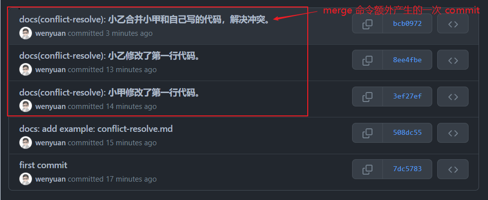
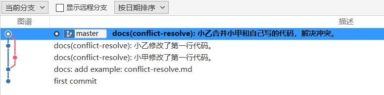
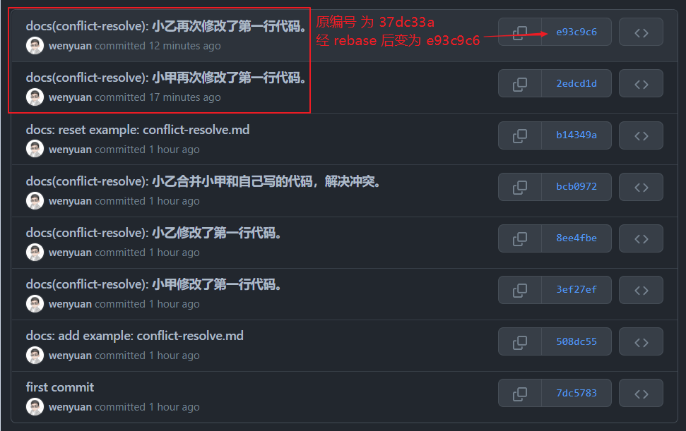
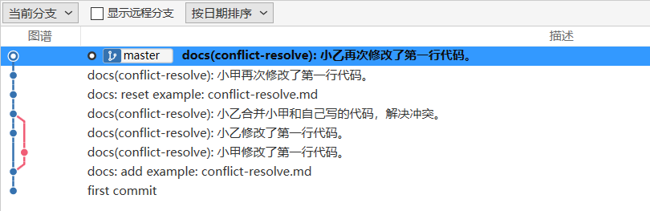

# pull 时发现代码冲突，如何妥善解决

## 冲突产生的原因

多人协作的开发模式，在代码合并/更新代码时经常会遇到冲突的情况，最常见的是在 `push` 时，Git 发现本地修改的某个文件在远端也做了修改，那么就会提示需要先进行 `pull`。

`pull` 后会有两种情况：

* Git 自动做了合并（无需理会）
* 提示有文件存在冲突 - CONFLICT

还有一种情况就是同一个文件，在合并分支的时候，如果同一行被多个分支或者不同人都修改了，合并的时候也会出现冲突。

## 解决冲突的步骤

解决冲突需要自己去判断到底要保留远端代码还是本地代码或者两端都保留。

这个操作一般借助可视化工具进行比较方便，具体步骤如下：

* 查看冲突文件内容
* 确定冲突内容保留哪些部分，修改文件
* 重新提交，done

## 冲突标记介绍

Git 提示冲突后，我们切换到对应文件，可以看到冲突内容被标记出来了。

```bash
<<<<<<< HEAD:file.txt

Hello world

=======

Goodbye

>>>>>>> 77976da35a11db4580b80ae27e8d65caf5208086:file.txt
```

可以看到Git用 `<<<<<<<`，`=======`，`>>>>>>>` 将代码分成了三个区域。

* `<<<<<<< HEAD` 和 `=======` 之间的内容表示你本地的分支。
* `=======` 和 `>>>>>>>` 之间的表示本次 `pull` 下来或 `merge` 过来的内容。

## 两种方式解决冲突

### 用 merge 来解决冲突

假设小甲和小乙是同事，两个人一起维护一个项目。某天小甲修改了一份文件（`conflict-resolve.md`）的第一行代码，提交并推送到了远程分支。

此时小乙并不知情，在没有事先 pull 最新代码的前提下，他也修改了同一份文件的同一行代码。那么在小乙操作的时候，必然会遇到代码冲突的情况了。

此时对小乙来说，他的操作顺序如下：

* 本地开发完，提交代码：`git commit`。
* 将代码推送到远程分支：`git push`（但由于小甲先一步往远程分支提交了代码，此时本地代码不是最新的，这步 push 操作会提示和远端版本不一致而中断）。
* 拉取最新远程分支代码：`git pull`（执行完命令，会提示有代码冲突，需要先解决冲突）。
* 解决代码冲突，然后使用 `git add conflict-resolve.md` 标注冲突已解决。
* 重新提交代码：`git commit`（解决冲突的过程其实存在一个 merge 操作）。
* 将代码推送到远程分支：`git push`。

通过在当前仓库目录下输入 `gitk` 或 `git log --oneline --graph --decorate --all` 命令查看节点树，也可以通过其它一些可视化工具获取更好的展示效果。

这里我在 GitHub 上查看到的 commit 记录和使用 Sourcetree 获得到的节点树界面如下：

<div style="text-align: center;">
  
  <p style="text-align:center; color: #888;">（解决代码冲突产生的 commit 记录）</p>
</div>

<div style="text-align: center;">
  
  <p style="text-align:center; color: #888;">（解决代码冲突产生的节点树）</p>
</div>

观察上述两张图的最新 3 条记录（小甲 1 条，小乙 2 条），可以发现解决代码冲突的过程其实也是一次 merge 操作。

小乙将代码推送到 Git 服务器后，整个过程他的操作一共产生了 2 个 commit 记录（一个是对第一行代码修改的提交：`8ee4fbe`，一个是刚才的 merge 动作）。同时在节点树可以看到提交历史产生了分叉，这种分叉再汇合的结构会让有些人觉得混乱而难以管理。

### 用 git rebase 消除分叉

如果你不希望 commit 历史出现分叉，可以借助 rebase 命令来消除分叉。

此时小乙的操作操作流程如下：

* 本地开发完，提交代码：`git commit`。
* 将代码推送到远程分支：`git push`（但由于小甲先一步往远程分支提交了代码，此时本地代码不是最新的，这步 push 操作会提示和远端版本不一致而中断）。
* 拉取最新远程分支代码：`git pull --rebase`（执行完命令，可以看到冲突，并且进入了 rebase 状态）。
* 解决代码冲突，然后使用 `git add conflict-resolve.md` 标注冲突已解决。
* 合并冲突，执行命令：`git rebase --continue`（执行这步操作会先进入 commit 信息确认界面，通过输入 `:wq` 退出信息确认界面完成命令的执行）。
* 将代码推送到远程分支：`git push`。

这时再登录 GitHub 查看到的 commit 记录和使用 Sourcetree 获得到的节点树界面如下：

<div style="text-align: center;">
  
  <p style="text-align:center; color: #888;">（使用 rebase 命令解决代码冲突产生的 commit 记录）</p>
</div>

<div style="text-align: center;">
  
  <p style="text-align:center; color: #888;">（使用 rebase 命令解决代码冲突产生的节点树）</p>
</div>

观察上述两张图的最新 2 条记录（小甲 1 条，小乙 1 条），可以发现此时小乙解决代码冲突的过程只产生了一个 commit 记录，而且节点树中的提交历史也没有产生分叉。

事实上，小乙在第一次 `git commit` 的时候，他的 commit 编号是 `37dc33a`，经过解决冲突后这个编号被新的编号 `e93c9c6` 所取代，commit 的内容不变。

### rebase 的优点和缺点

优点
* rebase 最大的好处是你的项目历史会非常整洁。
* rebase 导致最后的项目历史呈现出完美的线性 —— 你可以从项目终点到起点浏览而不需要任何的 fork。这让你更容易使用 git log、git bisect 和 gitk 来查看项目历史。

缺点
* 安全性，如果你违反了 rebase 黄金法则，重写项目历史可能会给你的协作工作流带来灾难性的影响。
* 可跟踪性，rebase 不会有合并提交中附带的信息 —— 你看不到 feature 分支中并入了上游的哪些更改。

## 推荐操作

在多人协作的开发模式中，为了避免一些麻烦，我一般会有两个习惯：

* 准备开始编写代码了，先看看版本库里有没有别人提交的记录，不管怎样先在本地 `pull` 一下。
* 代码编写完成了，本地环境先 `commit`，然后 `pull`，再 `push`。

::: tip 为什么要先 commit，然后 pull，再 push？
`commit` 是告诉 Git，这次提交改了哪些东西，不然只是自己改了，Git 不知道你改了，无从判断比较。  
`pull` 是为了本地 `commit` 和远程 `commit` 的对比记录，Git 按照文件的行数操作进行对比，如果同时操作了某文件的同一行那么就会产生冲突，这时候需要手动解决，保留本地分支代码还是保留远程分支代码。

本地代码进行 `commit` 后，仓库不会将本地代码与远程仓库代码进行比较，不会识别是否存在代码冲突，必须进行 `pull` 命令后，才会将本地代码与仓库远程代码进行比较，如果存在冲突，必须要解决冲突后重新 `commit` 和 `push`。不存在冲突，会在 `pull` 时直接合并代码，不会将本地代码覆盖掉。
:::

（完）
