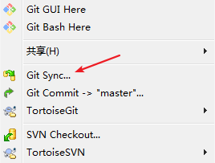
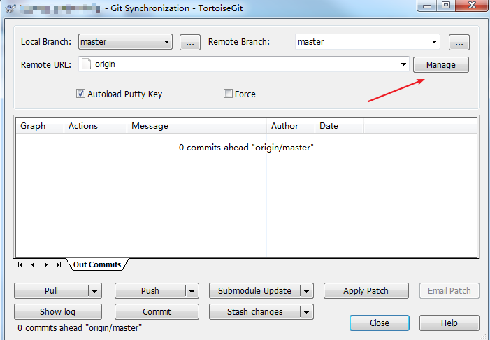
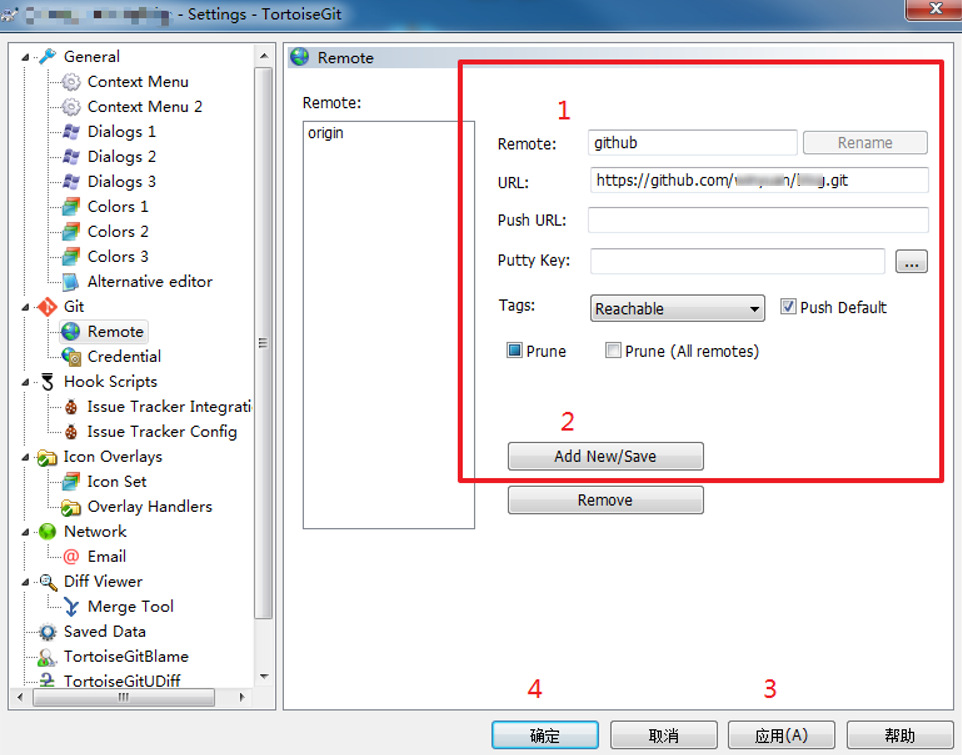
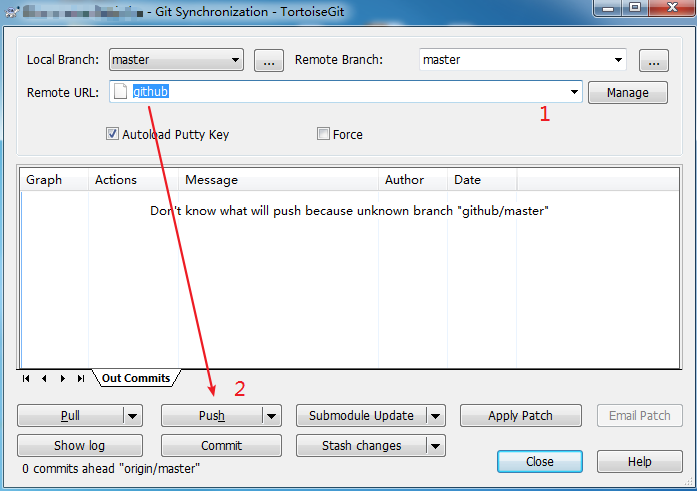
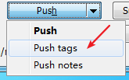

# 如何迁移仓库并保留 commits 记录

## 问题描述

假设我们需要在支持 Git 的代码托管平台间进行仓库的迁移，并保留历史 commit 记录。

例如：

将 Gitlab 上的仓库迁移到 GitHub，将 Coding 上的仓库迁移到 GitHub，将 Gitee 上的仓库迁移到 GitHub……

迁移前后保留历史 commit 记录，可以确保在迁移后的新仓库中能查询历史提交信息，便于将来出现问题时追溯过去的代码变更记录。

## 解决方案

主要分为三个步骤：

* 建立新仓库
* 克隆旧仓库
* 推送新仓库

下面以 Coding 迁移到 GitHub 为例，介绍两种迁移方式（命令行和可视化工具）的操作步骤。

## 使用 Git Bash 操作

### 在 GitHub 建立新仓库

在 GitHub 中新建一个同名项目（不同名也可以），不要添加 `README.md`，以及任何 `License` 和 `.gitignore` 文件，只需要新建一个空的仓库。

### 克隆 Coding 上的项目

将 Coding 上想要迁移的项目完整克隆到本地，执行命令：

```bash
git clone https://git.coding.net/[your-coding-id]/[repo-name].git  --bare
```

### 将克隆下来的仓库推送到 GitHub

进入刚才克隆下来的文件目录，使用新仓库页面提供的仓库地址（web URL），推送所有的分支和对象：

```bash
cd [repo-name].git
git push https://github.com/[your-github-id]/[repo-name].git --all
```

### 完成后，再执行推送所有的 Tags

```bash
git push https://github.com/[your-github-id]/[repo-name].git --tags
```

这样，整个仓库就全部迁移到 GitHub 了，如果这些 commit 关联的邮箱也同时在 GitHub 的配置中，可以看到小绿点也一起迁移过来了。

## 使用 TortoiseGit 操作

这种简单的操作我不是很喜欢用可视化工具，不过这里也记录下怎么用「小乌龟」来完成仓库的迁移。

### 在 GitHub 建立新仓库

同上，不赘述了。

### 克隆 Coding 上的项目

同上，不赘述了。

### 将克隆下来的仓库推送到 GitHub

进入项目文件夹，鼠标右键 -> Git Sync...

<div style="text-align: center;">
  
  <p style="text-align: center; color: #888;">（TortoiseGit 同步）</p>
</div>

点击 Manage。

<div style="text-align: center;">
  
  <p style="text-align: center; color: #888;">（TortoiseGit 同步-管理）</p>
</div>

填写 GitHub 远程仓库的信息，并 Add New/Save，应用，确认。

<div style="text-align: center;">
  
  <p style="text-align: center; color: #888;">（TortoiseGit 同步-管理-远程信息）</p>
</div>

Remote URL 选择刚刚添加的 GitHub，然后 Push。

<div style="text-align: center;">
  
  <p style="text-align: center; color: #888;">（TortoiseGit 同步-管理-推送）</p>
</div>

最后再提交 Tags。

<div style="text-align: center;">
  
  <p style="text-align: center; color: #888;">（TortoiseGit 同步-管理-推送标签）</p>
</div>


## --all 和 --mirror 区别

上面在推送代码至 GitHub（新仓库）时，我们用到了下面这个命令：

`git push https://github.com/[your-github-id]/[repo-name].git --all` 

其实还有另外一个命令：

`git push https://github.com/[your-github-id]/[repo-name].git --mirror`

关于这两个命令的区别，可以参见 [Git push --all vs --mirror](https://stackoverflow.com/questions/49343025/git-push-all-vs-mirror "Git push --all vs --mirror")。

（完）
