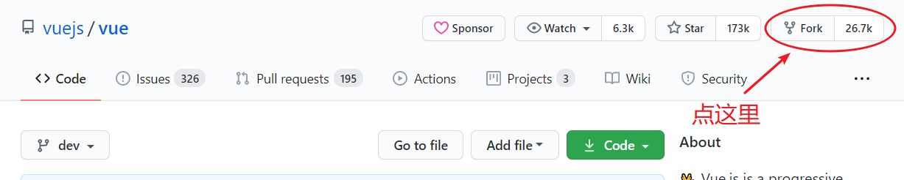
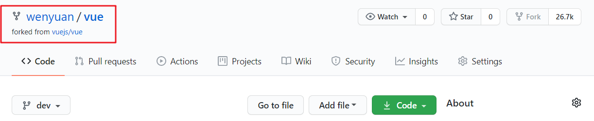
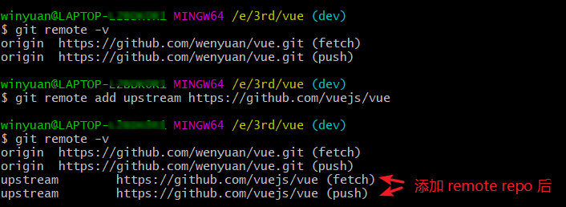
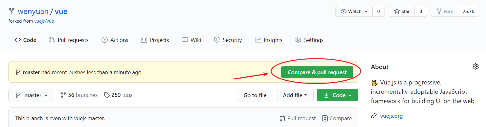
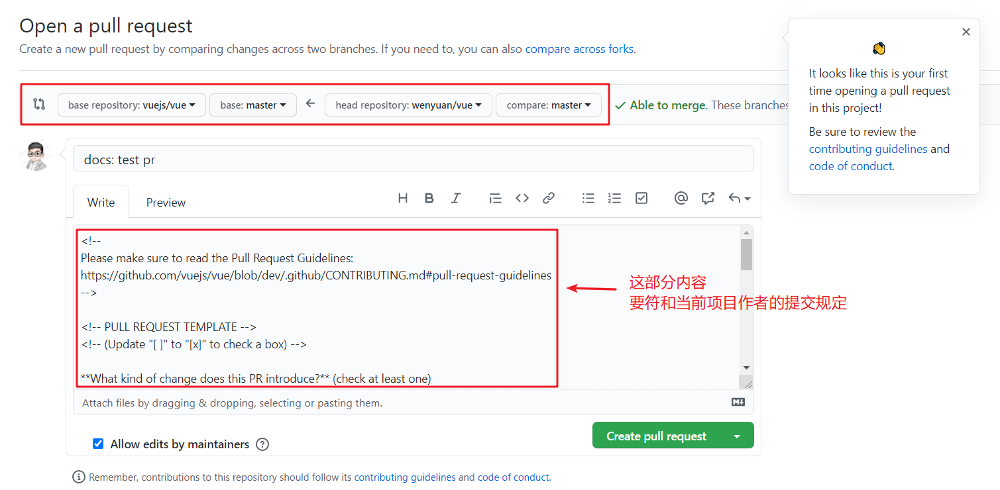

# 如何参与开源项目 - 提交 PR 与更新 Fork 分支

> 总结一下如何参加一个开源项目，包括 Fork 代码，提出 PR，更新 Fork 分支等主要步骤。

## Fork 代码

以 vue 代码举例，首先需要将 vue 官方仓库通过 GitHub 的 Fork 功能复制一份到自己的 GitHub。

<div style="text-align: center;">
  
  <p style="text-align:center; color: #888;">（Fork vuejs/vue）</p>
</div>

复制后的结果：

<div style="text-align: center;">
  
  <p style="text-align:center; color: #888;">（Fork [your-github-id]/vue）</p>
</div>

* 原仓库路径：`https://github.com/vuejs/vue`
* Fork 后的仓库路径：`https://github.com/[your-github-id]/vue`（注意该代码仓库是挂在自己的用户名下的）

## Clone 到本地

下载刚才 Fork 的代码（我比较喜欢 SSH 方式，即 Clone with SSH）：

```bash
git clone https://github.com/[your-github-id]/vue.git
```

## 开发前同步官方最新代码

Fork 的代码需要随时拉取官方最新的代码更新，保持同步。

### 添加原作者远程分支

这个操作只需要做一次，目的是添加原作者 remote-repo（远程库）。

```bash
git remote add upstream https://github.com/vuejs/vue
```

这个时候输入 `git remote -v`，会得到结果：

<div style="text-align: center;">
  
  <p style="text-align:center; color: #888;">（Add Remote Repo）</p>
</div>

### 拉取合并远程分支到 master 分支

这个需要随时做，保持你的 master 分支永远跟官方最新代码保持一致。

```bash
# fetch 源仓库最新的 master 分支到本地的 upstream/master
git fetch upstream master

# 切换到本地的 master 分支
git checkout master

# 将来自 upstream/master 的更改合并到本地 master 分支中
git merge upstream/master
```

## 提交 PR（Pull Request）

在本地修改完代码后，接下来就是最后一步 Pull Request，即 PR。

### 推送本地分支到 GitHub

先 commit，后 push。

### Pull Request

当你在上一步 push 代码后，再访问你自己的 GitHub 主页时，会有 pull request 提示：

<div style="text-align: center;">
  
  <p style="text-align:center; color: #888;">（Compare & pull request 提示）</p>
</div>

点击 **Compare & pull request** 后，就会到下面这个页面，文本框中的内容要遵循统一的规定（一般符和该项目作者的规范即可），然后点击 **Create pull request**。

<div style="text-align: center;">
  
  <p style="text-align:center; color: #888;">（Create pull request）</p>
</div>

最后就可以等待源仓库作者的处理结果了。

## 参考资料

* [GitHub Docs](https://docs.github.com/cn/free-pro-team@latest/github/collaborating-with-issues-and-pull-requests/syncing-a-fork)

（完）
