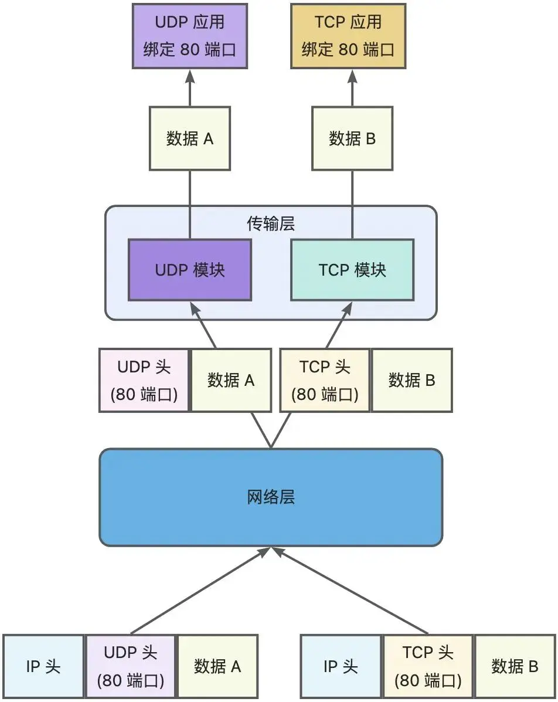
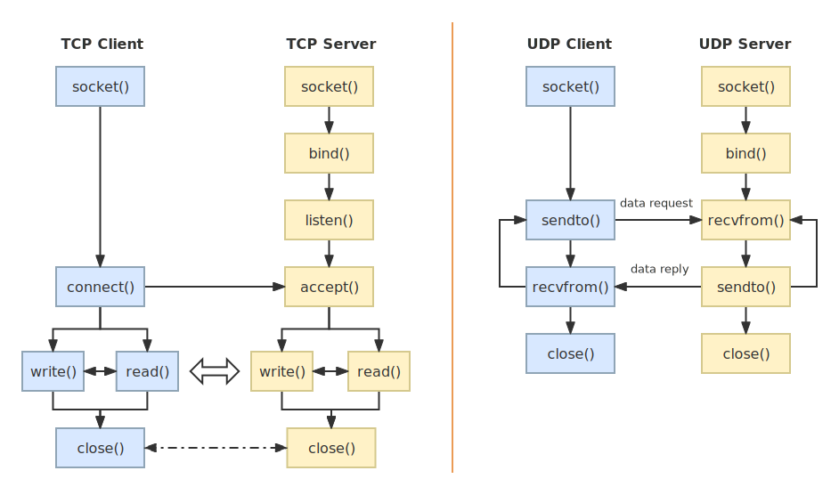
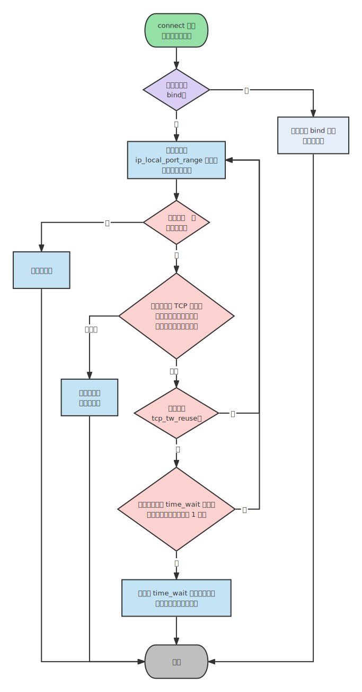

# TCP 和 UDP 可以使用同一个端口吗？

关于端口的知识点，还是挺多可以讲的，比如还可以牵扯到这几个问题：

* 多个 TCP 服务进程可以同时绑定同一个端口吗？
* 重启 TCP 服务进程时，为什么会出现 `Address in use` 的报错信息？又该怎么避免？
* 客户端的端口可以重复使用吗？
* 多个客户端可以 bind 同一个端口吗？
* 客户端 TCP 连接 `TIME_WAIT` 状态过多，会导致端口资源耗尽而无法建立新的连接吗？

所以，这次就统一盘点下这些问题。

## TCP 和 UDP 可以同时绑定相同的端口吗？

### 参考答案

**可以的**。

回顾一下：

* 在数据链路层中，通过 MAC 地址来寻找局域网中的主机。
* 在网际层中，通过 IP 地址来寻找网络中互连的主机或路由器。
* 在传输层中，需要通过端口进行寻址，来识别同一计算机中同时通信的不同应用程序。

所以，传输层的「端口号」的作用，是为了区分同一个主机上不同应用程序的数据包。而传输层有两个传输协议分别是 TCP 和 UDP，在内核中是两个完全独立的软件模块。

当主机收到数据包后，可以在 IP 包头的「协议号」字段知道该数据包是 TCP/UDP，然后可以根据这个信息确定送给哪个模块（TCP/UDP）处理，送给 TCP/UDP 模块的报文根据「端口号」确定送给哪个应用程序处理。

因此，TCP/UDP 各自的端口号也相互独立，互不影响。

如下图所示：

<div style="text-align: center;">
  
  <p style="text-align: center; color: #888;">（TCP 和 UDP 模块）</p>
</div>

因此，TCP/UDP 各自的端口号也相互独立，如 TCP 有一个 `80` 号端口，UDP 也可以有一个 `80` 号端口，二者并不冲突。

### 实验验证

使用 Python 的一个库 [socketserver](https://docs.python.org/zh-cn/3/library/socketserver.html)，简单写一个 TCP 和 UDP 服务端的程序，它们都绑定同一个端口号 `9999`。

官方 TCP 服务端的实现 Demo：

```python
import socketserver

class MyTCPHandler(socketserver.BaseRequestHandler):
    """
    The request handler class for our server.

    It is instantiated once per connection to the server, and must
    override the handle() method to implement communication to the
    client.
    """

    def handle(self):
        # self.request is the TCP socket connected to the client
        self.data = self.request.recv(1024).strip()
        print("{} wrote:".format(self.client_address[0]))
        print(self.data)
        # just send back the same data, but upper-cased
        self.request.sendall(self.data.upper())

if __name__ == "__main__":
    HOST, PORT = "localhost", 9999

    # Create the server, binding to localhost on port 9999
    with socketserver.TCPServer((HOST, PORT), MyTCPHandler) as server:
        # Activate the server; this will keep running until you
        # interrupt the program with Ctrl-C
        server.serve_forever()
```

官方 UDP 服务端的实现 Demo：

```python
import socketserver

class MyUDPHandler(socketserver.BaseRequestHandler):
    """
    This class works similar to the TCP handler class, except that
    self.request consists of a pair of data and client socket, and since
    there is no connection the client address must be given explicitly
    when sending data back via sendto().
    """

    def handle(self):
        data = self.request[0].strip()
        socket = self.request[1]
        print("{} wrote:".format(self.client_address[0]))
        print(data)
        socket.sendto(data.upper(), self.client_address)

if __name__ == "__main__":
    HOST, PORT = "localhost", 9999
    with socketserver.UDPServer((HOST, PORT), MyUDPHandler) as server:
        server.serve_forever()
```

运行这两个程序后，通过 `netstat` 命令可以看到，TCP 和 UDP 是可以同时绑定同一个端口号的。

```bash
[root@study ~]# netstat -anp | grep 9999
tcp        0      0 127.0.0.1:9999          0.0.0.0:*           LISTEN      19589/python3
udp        0      0 127.0.0.1:9999          0.0.0.0:*                       19669/python3
```

### 「监听」还是「绑定」

「监听」这个动作是在 TCP 服务端网络编程中才具有的，而 UDP 服务端网络编程中是没有「监听」这个动作的。

TCP 和 UDP 服务端网络相似的一个地方，就是会调用 bind 绑定端口。

两者的区别如下图，其中：

* TCP 网络编程中，服务端执行 `listen()` 系统调用就是监听端口的动作。
* UDP 网络编程中，服务端是没有监听这个动作的，只有执行 `bind()` 系统调用来绑定端口的动作。

<div style="text-align: center;">
  
  <p style="text-align: center; color: #888;">（TCP 和 UDP 网络编程的区别）</p>
</div>

## 多个 TCP 服务进程可以绑定同一个端口吗？

### 参考答案

**如果两个 TCP 服务进程同时绑定的 IP 地址和端口都相同，那么执行 `bind()` 时候就会出错，错误是 `Address already in use`**。如果两个 TCP 服务进程绑定的端口都相同，而 IP 地址不同，那么执行 `bind()` 不会出错。

注意：如果 TCP 服务进程 A 绑定的地址是 `0.0.0.0` 和端口 `9999`，而如果 TCP 服务进程 B 绑定的地址是 `192.168.1.100` 地址（或者其他地址）和端口 `9999`，那么执行 `bind()` 时候也会出错。

这是因为 `0.0.0.0` 地址比较特殊，代表任意地址，意味着绑定了 `0.0.0.0` 地址，相当于把主机上的所有 IP 地址都绑定了。

### 实验验证

以前面的 TCP 服务端程序作为例子，启动两个同时绑定 `0.0.0.0` 地址和 `9999` 端口的服务进程，会出现报错：

```bash
[root@study ~]# netstat -anp | grep 9999
tcp        0      0 127.0.0.1:9999          0.0.0.0:*            LISTEN      3915/python3
[root@study ~]# 
[root@study ~]# python3 tcp_server.py 
Traceback (most recent call last):
  File "tcp_server.py", line 24, in <module>
    with socketserver.TCPServer((HOST, PORT), MyTCPHandler) as server:
  File "/usr/lib64/python3.6/socketserver.py", line 456, in __init__
    self.server_bind()
  File "/usr/lib64/python3.6/socketserver.py", line 470, in server_bind
    self.socket.bind(self.server_address)
OSError: [Errno 98] Address already in use
[root@study ~]#
```

::: tip 小贴士
如果想多个进程绑定相同的 IP 地址和端口，也是有办法的，就是对 socket 设置 `SO_REUSEPORT` 属性（内核 3.9 版本提供的新特性），本文不做具体介绍。
:::

### 如何避免重启报错

**重启 TCP 服务进程时，为什么会有 `Address in use` 的报错信息？**

这是在实际开发过程中经常会碰到的一个问题，当 TCP 服务进程重启之后，总是碰到 `Address in use` 的报错信息，TCP 服务进程不能很快地重启，而是要过一会才能重启成功。

原因就是当我们重启 TCP 服务进程的时候，意味着通过服务器端发起了关闭连接操作，于是就会经过四次挥手，而对于主动关闭方，会在 `TIME_WAIT` 这个状态里停留一段时间，这个时间大约为 2MSL（详情见[TCP 的四次挥手](/basic-skills/network/tcp/#tcp-的四次挥手)）。`TIME_WAIT` 这段时间里连接使用的 IP + PORT 仍然被认为是一个有效的 IP + PORT 组合，相同机器上不能够在该 IP + PORT 组合上进行绑定，那么执行 `bind()` 函数的时候，就会返回了 `Address already in use` 的错误。

::: tip 小贴士
重启 TCP 服务进程时如果想要秒启动成功，可以在调用 bind 前，对 socket 设置 `SO_REUSEADDR` 属性，从而解决这个问题。

其原理就是如果当前启动进程绑定的 IP + PORT 与处于 `TIME_WAIT` 状态的连接占用的 IP + PORT 存在冲突，但是新启动的进程使用了 `SO_REUSEADDR` 选项，那么该进程就可以绑定成功。

这个方法还可以用来解决绑定了 `0.0.0.0:9999`，就不能绑定 `192.168.1.100:9999` 的问题。
:::

## 客户端的端口可以重复使用吗？

### 参考答案

在客户端执行 `connect` 函数的时候，只要客户端连接的服务器不是同一个，内核允许端口重复使用。

TCP 连接是由四元组（源IP地址，源端口，目的IP地址，目的端口）唯一确认的，那么只要四元组中其中一个元素发生了变化，那么就表示不同的 TCP 连接的。

所以，如果客户端已使用端口 `64992` 与服务端 A 建立了连接，那么客户端要与服务端 B 建立连接，还是可以使用端口 `64992` 的，因为内核是通过四元祖信息来定位一个 TCP 连接的，并不会因为客户端的端口号相同，而导致连接冲突的问题。

### 理论验证

客户端在执行 `connect` 函数的时候，会在内核里随机选择一个端口，然后向服务端发起 SYN 报文，然后与服务端进行三次握手。

<div style="text-align: center;">
  <svg id="SvgjsSvg1006" width="652" height="624" xmlns="http://www.w3.org/2000/svg" version="1.1" xmlns:xlink="http://www.w3.org/1999/xlink" xmlns:svgjs="http://svgjs.com/svgjs"><defs id="SvgjsDefs1007"><marker id="SvgjsMarker1052" markerWidth="14" markerHeight="10" refX="10" refY="5" viewBox="0 0 14 10" orient="auto" markerUnits="userSpaceOnUse" stroke-dasharray="0,0"><path id="SvgjsPath1053" d="M0,0 L14,5 L0,10 L0,0" fill="#323232" stroke="#323232" stroke-width="1"></path></marker><marker id="SvgjsMarker1056" markerWidth="14" markerHeight="10" refX="10" refY="5" viewBox="0 0 14 10" orient="auto" markerUnits="userSpaceOnUse" stroke-dasharray="0,0"><path id="SvgjsPath1057" d="M0,0 L14,5 L0,10 L0,0" fill="#323232" stroke="#323232" stroke-width="1"></path></marker><marker id="SvgjsMarker1060" markerWidth="14" markerHeight="10" refX="10" refY="5" viewBox="0 0 14 10" orient="auto" markerUnits="userSpaceOnUse" stroke-dasharray="0,0"><path id="SvgjsPath1061" d="M0,0 L14,5 L0,10 L0,0" fill="#323232" stroke="#323232" stroke-width="1"></path></marker><marker id="SvgjsMarker1070" markerWidth="14" markerHeight="10" refX="10" refY="5" viewBox="0 0 14 10" orient="auto" markerUnits="userSpaceOnUse" stroke-dasharray="0,0"><path id="SvgjsPath1071" d="M0,0 L14,5 L0,10 L0,0" fill="#323232" stroke="#323232" stroke-width="1"></path></marker><marker id="SvgjsMarker1074" markerWidth="14" markerHeight="10" refX="10" refY="5" viewBox="0 0 14 10" orient="auto" markerUnits="userSpaceOnUse" stroke-dasharray="0,0"><path id="SvgjsPath1075" d="M0,0 L14,5 L0,10 L0,0" fill="#323232" stroke="#323232" stroke-width="1"></path></marker><marker id="SvgjsMarker1090" markerWidth="14" markerHeight="10" refX="10" refY="5" viewBox="0 0 14 10" orient="auto" markerUnits="userSpaceOnUse" stroke-dasharray="0,0"><path id="SvgjsPath1091" d="M0,0 L14,5 L0,10 L0,0" fill="#323232" stroke="#323232" stroke-width="1"></path></marker><marker id="SvgjsMarker1100" markerWidth="14" markerHeight="10" refX="10" refY="5" viewBox="0 0 14 10" orient="auto" markerUnits="userSpaceOnUse" stroke-dasharray="0,0"><path id="SvgjsPath1101" d="M0,0 L14,5 L0,10 L0,0" fill="#323232" stroke="#323232" stroke-width="1"></path></marker><marker id="SvgjsMarker1104" markerWidth="14" markerHeight="10" refX="10" refY="5" viewBox="0 0 14 10" orient="auto" markerUnits="userSpaceOnUse" stroke-dasharray="0,0"><path id="SvgjsPath1105" d="M0,0 L14,5 L0,10 L0,0" fill="#323232" stroke="#323232" stroke-width="1"></path></marker><marker id="SvgjsMarker1132" markerWidth="14" markerHeight="10" refX="10" refY="5" viewBox="0 0 14 10" orient="auto" markerUnits="userSpaceOnUse" stroke-dasharray="0,0"><path id="SvgjsPath1133" d="M0,0 L14,5 L0,10 L0,0" fill="#323232" stroke="#323232" stroke-width="1"></path></marker><marker id="SvgjsMarker1136" markerWidth="14" markerHeight="10" refX="10" refY="5" viewBox="0 0 14 10" orient="auto" markerUnits="userSpaceOnUse" stroke-dasharray="0,0"><path id="SvgjsPath1137" d="M0,0 L14,5 L0,10 L0,0" fill="#323232" stroke="#323232" stroke-width="1"></path></marker><marker id="SvgjsMarker1140" markerWidth="14" markerHeight="10" refX="10" refY="5" viewBox="0 0 14 10" orient="auto" markerUnits="userSpaceOnUse" stroke-dasharray="0,0"><path id="SvgjsPath1141" d="M0,0 L14,5 L0,10 L0,0" fill="#323232" stroke="#323232" stroke-width="1"></path></marker><marker id="SvgjsMarker1150" markerWidth="14" markerHeight="10" refX="10" refY="5" viewBox="0 0 14 10" orient="auto" markerUnits="userSpaceOnUse" stroke-dasharray="0,0"><path id="SvgjsPath1151" d="M0,0 L14,5 L0,10 L0,0" fill="#323232" stroke="#323232" stroke-width="1"></path></marker><marker id="SvgjsMarker1160" markerWidth="14" markerHeight="10" refX="10" refY="5" viewBox="0 0 14 10" orient="auto" markerUnits="userSpaceOnUse" stroke-dasharray="0,0"><path id="SvgjsPath1161" d="M0,0 L14,5 L0,10 L0,0" fill="#323232" stroke="#323232" stroke-width="1"></path></marker><marker id="SvgjsMarker1170" markerWidth="14" markerHeight="10" refX="10" refY="5" viewBox="0 0 14 10" orient="auto" markerUnits="userSpaceOnUse" stroke-dasharray="0,0"><path id="SvgjsPath1171" d="M0,0 L14,5 L0,10 L0,0" fill="#323232" stroke="#323232" stroke-width="1"></path></marker><marker id="SvgjsMarker1174" markerWidth="14" markerHeight="10" refX="10" refY="5" viewBox="0 0 14 10" orient="auto" markerUnits="userSpaceOnUse" stroke-dasharray="0,0"><path id="SvgjsPath1175" d="M0,0 L14,5 L0,10 L0,0" fill="#323232" stroke="#323232" stroke-width="1"></path></marker><marker id="SvgjsMarker1178" markerWidth="14" markerHeight="10" refX="10" refY="5" viewBox="0 0 14 10" orient="auto" markerUnits="userSpaceOnUse" stroke-dasharray="0,0"><path id="SvgjsPath1179" d="M0,0 L14,5 L0,10 L0,0" fill="#323232" stroke="#323232" stroke-width="1"></path></marker></defs><g id="SvgjsG1008" transform="translate(69,25)"><path id="SvgjsPath1009" d="M 0 0L 120 0L 120 40L 0 40Z" stroke="none" fill="none"></path><g id="SvgjsG1010"><text id="SvgjsText1011" font-family="微软雅黑" text-anchor="middle" font-size="16px" width="120px" fill="#323232" font-weight="700" align="middle" lineHeight="125%" anchor="middle" family="微软雅黑" size="16px" weight="700" font-style="" opacity="1" y="6" transform="rotate(0)"><tspan id="SvgjsTspan1012" dy="20" x="60"><tspan id="SvgjsTspan1013" style="text-decoration:;">TCP Client</tspan></tspan></text></g></g><g id="SvgjsG1014" transform="translate(451,25)"><path id="SvgjsPath1015" d="M 0 0L 120 0L 120 40L 0 40Z" stroke="none" fill="none"></path><g id="SvgjsG1016"><text id="SvgjsText1017" font-family="微软雅黑" text-anchor="middle" font-size="16px" width="120px" fill="#323232" font-weight="700" align="middle" lineHeight="125%" anchor="middle" family="微软雅黑" size="16px" weight="700" font-style="" opacity="1" y="6" transform="rotate(0)"><tspan id="SvgjsTspan1018" dy="20" x="60"><tspan id="SvgjsTspan1019" style="text-decoration:;">TCP Server</tspan></tspan></text></g></g><g id="SvgjsG1020" transform="translate(88,71)"><path id="SvgjsPath1021" d="M 0 0L 82 0L 82 44L 0 44Z" stroke="rgba(144,165,182,1)" stroke-width="2" fill-opacity="1" fill="#d8e8ff"></path><g id="SvgjsG1022"><text id="SvgjsText1023" font-family="微软雅黑" text-anchor="middle" font-size="16px" width="62px" fill="#323232" font-weight="400" align="middle" lineHeight="125%" anchor="middle" family="微软雅黑" size="16px" weight="400" font-style="" opacity="1" y="8" transform="rotate(0)"><tspan id="SvgjsTspan1024" dy="20" x="41"><tspan id="SvgjsTspan1025" style="text-decoration:;">socket</tspan></tspan></text></g></g><g id="SvgjsG1026" transform="translate(470,71)"><path id="SvgjsPath1027" d="M 0 0L 82 0L 82 44L 0 44Z" stroke="rgba(213,201,142,1)" stroke-width="2" fill-opacity="1" fill="#fff2c7"></path><g id="SvgjsG1028"><text id="SvgjsText1029" font-family="微软雅黑" text-anchor="middle" font-size="16px" width="62px" fill="#323232" font-weight="400" align="middle" lineHeight="125%" anchor="middle" family="微软雅黑" size="16px" weight="400" font-style="" opacity="1" y="8" transform="rotate(0)"><tspan id="SvgjsTspan1030" dy="20" x="41"><tspan id="SvgjsTspan1031" style="text-decoration:;">socket</tspan></tspan></text></g></g><g id="SvgjsG1032" transform="translate(470,146)"><path id="SvgjsPath1033" d="M 0 0L 82 0L 82 44L 0 44Z" stroke="rgba(213,201,142,1)" stroke-width="2" fill-opacity="1" fill="#fff2c7"></path><g id="SvgjsG1034"><text id="SvgjsText1035" font-family="微软雅黑" text-anchor="middle" font-size="16px" width="62px" fill="#323232" font-weight="400" align="middle" lineHeight="125%" anchor="middle" family="微软雅黑" size="16px" weight="400" font-style="" opacity="1" y="8" transform="rotate(0)"><tspan id="SvgjsTspan1036" dy="20" x="41"><tspan id="SvgjsTspan1037" style="text-decoration:;">bind</tspan></tspan></text></g></g><g id="SvgjsG1038" transform="translate(470,221)"><path id="SvgjsPath1039" d="M 0 0L 82 0L 82 44L 0 44Z" stroke="rgba(213,201,142,1)" stroke-width="2" fill-opacity="1" fill="#fff2c7"></path><g id="SvgjsG1040"><text id="SvgjsText1041" font-family="微软雅黑" text-anchor="middle" font-size="16px" width="62px" fill="#323232" font-weight="400" align="middle" lineHeight="125%" anchor="middle" family="微软雅黑" size="16px" weight="400" font-style="" opacity="1" y="8" transform="rotate(0)"><tspan id="SvgjsTspan1042" dy="20" x="41"><tspan id="SvgjsTspan1043" style="text-decoration:;">listen</tspan></tspan></text></g></g><g id="SvgjsG1044" transform="translate(470,296)"><path id="SvgjsPath1045" d="M 0 0L 82 0L 82 44L 0 44Z" stroke="rgba(213,201,142,1)" stroke-width="2" fill-opacity="1" fill="#fff2c7"></path><g id="SvgjsG1046"><text id="SvgjsText1047" font-family="微软雅黑" text-anchor="middle" font-size="16px" width="62px" fill="#323232" font-weight="400" align="middle" lineHeight="125%" anchor="middle" family="微软雅黑" size="16px" weight="400" font-style="" opacity="1" y="8" transform="rotate(0)"><tspan id="SvgjsTspan1048" dy="20" x="41"><tspan id="SvgjsTspan1049" style="text-decoration:;">accept</tspan></tspan></text></g></g><g id="SvgjsG1050"><path id="SvgjsPath1051" d="M511 116L511 130.5L511 130.5L511 142.4" stroke="#323232" stroke-width="2" fill="none" marker-end="url(#SvgjsMarker1052)"></path></g><g id="SvgjsG1054"><path id="SvgjsPath1055" d="M511 191L511 205.5L511 205.5L511 217.4" stroke="#323232" stroke-width="2" fill="none" marker-end="url(#SvgjsMarker1056)"></path></g><g id="SvgjsG1058"><path id="SvgjsPath1059" d="M511 266L511 280.5L511 280.5L511 292.4" stroke="#323232" stroke-width="2" fill="none" marker-end="url(#SvgjsMarker1060)"></path></g><g id="SvgjsG1062" transform="translate(88,296)"><path id="SvgjsPath1063" d="M 0 0L 82 0L 82 44L 0 44Z" stroke="rgba(144,165,182,1)" stroke-width="2" fill-opacity="1" fill="#d8e8ff"></path><g id="SvgjsG1064"><text id="SvgjsText1065" font-family="微软雅黑" text-anchor="middle" font-size="16px" width="62px" fill="#323232" font-weight="400" align="middle" lineHeight="125%" anchor="middle" family="微软雅黑" size="16px" weight="400" font-style="" opacity="1" y="8" transform="rotate(0)"><tspan id="SvgjsTspan1066" dy="20" x="41"><tspan id="SvgjsTspan1067" style="text-decoration:;">connect</tspan></tspan></text></g></g><g id="SvgjsG1068"><path id="SvgjsPath1069" d="M129 116L129 205.5L129 205.5L129 292.4" stroke="#323232" stroke-width="2" fill="none" marker-end="url(#SvgjsMarker1070)"></path></g><g id="SvgjsG1072"><path id="SvgjsPath1073" d="M171 318L320 318L320 318L466.4 318" stroke-dasharray="8,5" stroke="#323232" stroke-width="2" fill="none" marker-end="url(#SvgjsMarker1074)"></path></g><g id="SvgjsG1076" transform="translate(227.5,286)"><path id="SvgjsPath1077" d="M 0 0L 185 0L 185 32L 0 32Z" stroke="none" fill="none"></path><g id="SvgjsG1078"><text id="SvgjsText1079" font-family="微软雅黑" text-anchor="middle" font-size="13px" width="185px" fill="#323232" font-weight="400" align="middle" lineHeight="125%" anchor="middle" family="微软雅黑" size="13px" weight="400" font-style="" opacity="1" y="5.375" transform="rotate(0)"><tspan id="SvgjsTspan1080" dy="16" x="92.5"><tspan id="SvgjsTspan1081" style="text-decoration:;">连接请求（TCP 三次握手）</tspan></tspan></text></g></g><g id="SvgjsG1082" transform="translate(159.5,402)"><path id="SvgjsPath1083" d="M 0 0L 81.5 0L 81.5 44L 0 44Z" stroke="rgba(144,165,182,1)" stroke-width="2" fill-opacity="1" fill="#d8e8ff"></path><g id="SvgjsG1084"><text id="SvgjsText1085" font-family="微软雅黑" text-anchor="middle" font-size="16px" width="62px" fill="#323232" font-weight="400" align="middle" lineHeight="125%" anchor="middle" family="微软雅黑" size="16px" weight="400" font-style="" opacity="1" y="8" transform="rotate(0)"><tspan id="SvgjsTspan1086" dy="20" x="41"><tspan id="SvgjsTspan1087" style="text-decoration:;">write</tspan></tspan></text></g></g><g id="SvgjsG1088"><path id="SvgjsPath1089" d="M129.8079132523299 340.5893014311112L211.0915122916124 399.8785148479996" stroke="#323232" stroke-width="2" fill="none" marker-end="url(#SvgjsMarker1090)"></path></g><g id="SvgjsG1092" transform="translate(25,402)"><path id="SvgjsPath1093" d="M 0 0L 82 0L 82 44L 0 44Z" stroke="rgba(144,165,182,1)" stroke-width="2" fill-opacity="1" fill="#d8e8ff"></path><g id="SvgjsG1094"><text id="SvgjsText1095" font-family="微软雅黑" text-anchor="middle" font-size="16px" width="62px" fill="#323232" font-weight="400" align="middle" lineHeight="125%" anchor="middle" family="微软雅黑" size="16px" weight="400" font-style="" opacity="1" y="8" transform="rotate(0)"><tspan id="SvgjsTspan1096" dy="20" x="41"><tspan id="SvgjsTspan1097" style="text-decoration:;">read</tspan></tspan></text></g></g><g id="SvgjsG1098"><path id="SvgjsPath1099" d="M66 401L66 379L176.37626262626264 379L176.37626262626264 398.4" stroke="#323232" stroke-width="2" fill="none" marker-end="url(#SvgjsMarker1100)"></path></g><g id="SvgjsG1102"><path id="SvgjsPath1103" d="M158.5 424L133.25 424L133.25 424L110.60000000000002 424" stroke="#323232" stroke-width="2" fill="none" marker-end="url(#SvgjsMarker1104)"></path></g><g id="SvgjsG1106" transform="translate(88,480)"><path id="SvgjsPath1107" d="M 0 0L 82 0L 82 44L 0 44Z" stroke="rgba(144,165,182,1)" stroke-width="2" fill-opacity="1" fill="#d8e8ff"></path><g id="SvgjsG1108"><text id="SvgjsText1109" font-family="微软雅黑" text-anchor="middle" font-size="16px" width="62px" fill="#323232" font-weight="400" align="middle" lineHeight="125%" anchor="middle" family="微软雅黑" size="16px" weight="400" font-style="" opacity="1" y="8" transform="rotate(0)"><tspan id="SvgjsTspan1110" dy="20" x="41"><tspan id="SvgjsTspan1111" style="text-decoration:;">close</tspan></tspan></text></g></g><g id="SvgjsG1112" transform="translate(140.25,340)"><path id="SvgjsPath1113" d="M 0 0L 120 0L 120 40L 0 40Z" stroke="none" fill="none"></path><g id="SvgjsG1114"><text id="SvgjsText1115" font-family="微软雅黑" text-anchor="middle" font-size="13px" width="120px" fill="#323232" font-weight="400" align="middle" lineHeight="125%" anchor="middle" family="微软雅黑" size="13px" weight="400" font-style="" opacity="1" y="9.375" transform="rotate(0)"><tspan id="SvgjsTspan1116" dy="16" x="60"><tspan id="SvgjsTspan1117" style="text-decoration:;">连接建立</tspan></tspan></text></g></g><g id="SvgjsG1118" transform="translate(403,402)"><path id="SvgjsPath1119" d="M 0 0L 82 0L 82 44L 0 44Z" stroke="rgba(213,201,142,1)" stroke-width="2" fill-opacity="1" fill="#fff2c7"></path><g id="SvgjsG1120"><text id="SvgjsText1121" font-family="微软雅黑" text-anchor="middle" font-size="16px" width="62px" fill="#323232" font-weight="400" align="middle" lineHeight="125%" anchor="middle" family="微软雅黑" size="16px" weight="400" font-style="" opacity="1" y="8" transform="rotate(0)"><tspan id="SvgjsTspan1122" dy="20" x="41"><tspan id="SvgjsTspan1123" style="text-decoration:;">read</tspan></tspan></text></g></g><g id="SvgjsG1124" transform="translate(545,402)"><path id="SvgjsPath1125" d="M 0 0L 82 0L 82 44L 0 44Z" stroke="rgba(213,201,142,1)" stroke-width="2" fill-opacity="1" fill="#fff2c7"></path><g id="SvgjsG1126"><text id="SvgjsText1127" font-family="微软雅黑" text-anchor="middle" font-size="16px" width="62px" fill="#323232" font-weight="400" align="middle" lineHeight="125%" anchor="middle" family="微软雅黑" size="16px" weight="400" font-style="" opacity="1" y="8" transform="rotate(0)"><tspan id="SvgjsTspan1128" dy="20" x="41"><tspan id="SvgjsTspan1129" style="text-decoration:;">write</tspan></tspan></text></g></g><g id="SvgjsG1130"><path id="SvgjsPath1131" d="M510.1954259204142 340.5938522968371L429.8964666865088 399.8621317313864" stroke="#323232" stroke-width="2" fill="none" marker-end="url(#SvgjsMarker1132)"></path></g><g id="SvgjsG1134"><path id="SvgjsPath1135" d="M586 401L586 375L471 375L471 398.4" stroke="#323232" stroke-width="2" fill="none" marker-end="url(#SvgjsMarker1136)"></path></g><g id="SvgjsG1138"><path id="SvgjsPath1139" d="M486 424L515 424L515 424L541.4 424" stroke="#323232" stroke-width="2" fill="none" marker-end="url(#SvgjsMarker1140)"></path></g><g id="SvgjsG1142" transform="translate(470,480)"><path id="SvgjsPath1143" d="M 0 0L 82 0L 82 44L 0 44Z" stroke="rgba(213,201,142,1)" stroke-width="2" fill-opacity="1" fill="#fff2c7"></path><g id="SvgjsG1144"><text id="SvgjsText1145" font-family="微软雅黑" text-anchor="middle" font-size="16px" width="62px" fill="#323232" font-weight="400" align="middle" lineHeight="125%" anchor="middle" family="微软雅黑" size="16px" weight="400" font-style="" opacity="1" y="8" transform="rotate(0)"><tspan id="SvgjsTspan1146" dy="20" x="41"><tspan id="SvgjsTspan1147" style="text-decoration:;">close</tspan></tspan></text></g></g><g id="SvgjsG1148"><path id="SvgjsPath1149" d="M242 424L399.4 424" stroke-dasharray="8,5" stroke="#323232" stroke-width="2" fill="none" marker-end="url(#SvgjsMarker1150)"></path></g><g id="SvgjsG1152" transform="translate(253,388)"><path id="SvgjsPath1153" d="M 0 0L 120 0L 120 40L 0 40Z" stroke="none" fill="none"></path><g id="SvgjsG1154"><text id="SvgjsText1155" font-family="微软雅黑" text-anchor="middle" font-size="13px" width="120px" fill="#323232" font-weight="400" align="middle" lineHeight="125%" anchor="middle" family="微软雅黑" size="13px" weight="400" font-style="" opacity="1" y="9.375" transform="rotate(0)"><tspan id="SvgjsTspan1156" dy="16" x="60"><tspan id="SvgjsTspan1157" style="text-decoration:;">数据发送</tspan></tspan></text></g></g><g id="SvgjsG1158"><path id="SvgjsPath1159" d="M170.96214477496574 501.72746113670496L399.53627881012335 436.98113990786203" stroke="#323232" stroke-width="2" fill="none" marker-end="url(#SvgjsMarker1160)"></path></g><g id="SvgjsG1162" transform="translate(227.5,468)"><path id="SvgjsPath1163" d="M 0 0L 120 0L 120 40L 0 40Z" stroke="none" fill="none"></path><g id="SvgjsG1164"><text id="SvgjsText1165" font-family="微软雅黑" text-anchor="middle" font-size="13px" width="120px" fill="#323232" font-weight="400" align="middle" lineHeight="125%" anchor="middle" family="微软雅黑" size="13px" weight="400" font-style="" opacity="1" y="9.375" transform="rotate(0)"><tspan id="SvgjsTspan1166" dy="16" x="60"><tspan id="SvgjsTspan1167" style="text-decoration:;">EOF</tspan></tspan></text></g></g><g id="SvgjsG1168"><path id="SvgjsPath1169" d="M461.82692650206957 446.56231002140726L508.02306459254964 477.9756839229338" stroke="#323232" stroke-width="2" fill="none" marker-end="url(#SvgjsMarker1170)"></path></g><g id="SvgjsG1172"><path id="SvgjsPath1173" d="M86.77556200371117 445.63127139836956L126.20797678663973 477.72742296586955" stroke="#323232" stroke-width="2" fill="none" marker-end="url(#SvgjsMarker1174)"></path></g><g id="SvgjsG1176"><path id="SvgjsPath1177" d="M586 447L586 561L66 561L66 449.6" stroke-dasharray="8,5" stroke="#323232" stroke-width="2" fill="none" marker-end="url(#SvgjsMarker1178)"></path></g><g id="SvgjsG1180" transform="translate(253,559)"><path id="SvgjsPath1181" d="M 0 0L 120 0L 120 40L 0 40Z" stroke="none" fill="none"></path><g id="SvgjsG1182"><text id="SvgjsText1183" font-family="微软雅黑" text-anchor="middle" font-size="13px" width="120px" fill="#323232" font-weight="400" align="middle" lineHeight="125%" anchor="middle" family="微软雅黑" size="13px" weight="400" font-style="" opacity="1" y="9.375" transform="rotate(0)"><tspan id="SvgjsTspan1184" dy="16" x="60"><tspan id="SvgjsTspan1185" style="text-decoration:;">数据发送</tspan></tspan></text></g></g></svg>
  <p style="text-align: center; color: #888;">（客户端执行 TCP 连接请求后的数据流通过程）</p>
</div>

所以，客户端的端口选择发生在 `connect` 函数，内核在选择端口的时候，会从 `net.ipv4.ip_local_port_range` 这个内核参数指定的范围来选取一个端口作为客户端端口。

该参数的默认值是 `32768～61000`，意味着端口总可用的数量是 61000 - 32768 = 28232 个。

当客户端与服务端完成 TCP 连接建立后，我们可以通过 `netstat -anpt` 命令查看 TCP 连接。

那问题来了，**如果客户端已经用了某个端口，那么还可以继续使用该端口发起连接吗？**

如果说不可以继续使用该端口了，按这个理解的话，默认情况下客户端可以选择的端口是 28232 个，那么意味着客户端只能最多建立 28232 个 TCP 连接，如果真是这样的话，那么这个客户端并发连接也太少了，显然这是错误理解。

正确的理解是：**TCP 连接是由四元组（源IP地址，源端口，目的IP地址，目的端口）唯一确认的，那么只要四元组中其中一个元素发生了变化，那么就表示不同的 TCP 连接的。所以如果客户端已使用某个端口与服务端 A 建立了连接，那么客户端要与服务端 B 建立连接，还是可以使用该端口的，因为内核是通过四元祖信息来定位一个 TCP 连接的，并不会因为客户端的端口号相同，而导致连接冲突的问题。**

比如下面，使用 `nc` 命令建立 2 个 TCP 连接，指定这两个连接都是从本地 `50001` 端口发起的：

```bash
# 先开一个 shell 命令窗口
[root@study ~]# nc -p 50001 183.232.231.174 80

# 再开一个 shell 命令窗口
[root@study ~]# nc -p 50001 39.156.66.18 80
```

使用命令查看 TCP 连接，查询结果中，左边是客户端，右边是服务端，客户端使用了相同的端口 `50001` 与两个服务端建立了 TCP 连接。而这两条 TCP 连接的四元组信息中的「目的 IP 地址」是不同的，一个是 `39.156.66.18`，另外一个是 `183.232.231.174`。

```bash
[root@study ~]# netstat -npt | grep 50001
tcp        0      0 10.0.16.7:50001         39.156.66.18:80         ESTABLISHED 30412/nc
tcp        0      0 10.0.16.7:50001         183.232.231.174:80      ESTABLISHED 30406/nc
```

## 多个客户端可以 bind 同一个端口吗？

### 参考答案

要看多个客户端绑定的 IP + PORT 是否都相同：

* 如果多个客户端同时绑定的 IP 地址和端口都是相同的，那么执行 `bind()` 时候就会出错，错误是 `Address already in use`。
* 如果绑定的 IP 不相同，那么执行 `bind()` 的时候，能正常绑定。

一般而言，客户端不建议使用 bind 函数，应该交由 connect 函数来选择端口会比较好，因为客户端的端口通常都没什么意义。

### 理论验证

`bind` 函数虽然常用于服务端网络编程中，但是它也是用于客户端的。

前面我们知道，客户端是在调用 `connect` 函数的时候，由内核随机选取一个端口作为连接的端口。

而如果我们想自己指定连接的端口，就可以用 `bind` 函数来实现：客户端先通过 `bind` 函数绑定一个端口，然后调用 `connect` 函数就会跳过端口选择的过程了，转而使用 `bind` 时确定的端口。

## 客户端 TCP 连接 `TIME_WAIT` 状态过多，会导致端口资源耗尽而无法建立新的连接吗？

### 参考答案

针对这个问题要看，客户端是否都是与同一个服务器（目标地址和目标端口一样）建立连接。

如果客户端都是与同一个服务器（目标地址和目标端口一样）建立连接，那么如果客户端 `TIME_WAIT` 状态的连接过多，当端口资源被耗尽，就无法与这个服务器再建立连接了。

但是，**因为只要客户端连接的服务器不同，端口资源可以重复使用的**。

所以，如果客户端都是与不同的服务器建立连接，即使客户端端口资源只有几万个， 客户端发起百万级连接也是没问题的（当然这个过程还会受限于其他资源，比如文件描述符、内存、CPU 等）。

## 如何解决客户端 TCP 连接 `TIME_WAIT` 过多，导致无法与同一个服务器建立连接的问题？

### 参考答案

前面提到，如果客户端都是与同一个服务器（目标地址和目标端口一样）建立连接，那么如果客户端 `TIME_WAIT` 状态的连接过多，当端口资源被耗尽，就无法与这个服务器再建立连接了。

针对这个问题，也是有解决办法的，那就是打开 `net.ipv4.tcp_tw_reuse` 这个内核参数。

**因为开启了这个内核参数后，客户端调用 connect 函数时，如果选择到的端口，已经被相同四元组的连接占用的时候，就会判断该连接是否处于 `TIME_WAIT` 状态，如果该连接处于 `TIME_WAIT` 状态并且 `TIME_WAIT` 状态持续的时间超过了 1 秒，那么就会重用这个连接，然后就可以正常使用该端口了。**

### 实验验证

举个例子，假设客户端已经与服务器建立了一个 TCP 连接，并且这个状态处于 `TIME_WAIT` 状态：

```bash
客户端地址:端口           服务端地址:端口         TCP 连接状态
192.168.1.100:2222     172.19.11.21:9999     TIME_WAIT
```

然后客户端又与该服务器（172.19.11.21:9999）发起了连接，**在调用 `connect` 函数时，内核刚好选择了 2222 端口，接着发现已经被相同四元组的连接占用了**：

* 如果**没有开启** `net.ipv4.tcp_tw_reuse` 内核参数，那么内核就会选择下一个端口，然后继续判断，直到找到一个没有被相同四元组的连接使用的端口， 如果端口资源耗尽还是没找到，那么 connect 函数就会返回错误。
* 如果**开启了** `net.ipv4.tcp_tw_reuse` 内核参数，就会判断该四元组的连接状态是否处于 `TIME_WAIT` 状态，**如果连接处于 `TIME_WAIT` 状态并且该状态持续的时间超过了 1 秒，那么就会重用该连接**，于是就可以使用 2222 端口了，这时 connect 就会返回成功。

再次提醒一次，开启了 `net.ipv4.tcp_tw_reuse` 内核参数，是客户端（连接发起方）在调用 `connect()` 函数时才起作用，所以在服务端开启这个参数是没有效果的。

### 客户端端口选择的流程总结

客户端在执行 connect 函数时，内核选择端口的过程如下图所示：

<div style="text-align: center;">
  
  <p style="text-align: center; color: #888;">（客户端端口的选择过程）</p>
</div>

（完）
