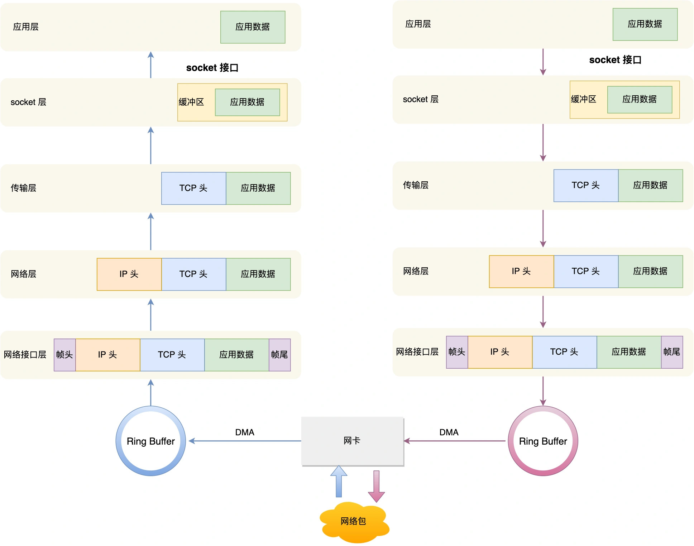
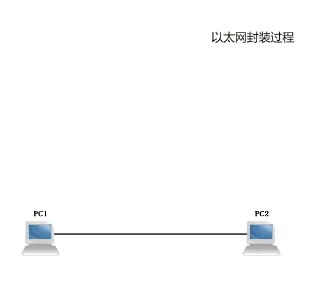

# Linux 系统是如何收发网络包的？

## 网络模型

复习一下谈的最多的 OSI 网络模型，该模型主要有 7 层，每一层负责的职能都不同，如下：

* **应用层**，负责给应用程序提供统一的接口。
* **表示层**，负责把数据转换成兼容另一个系统能识别的格式。
* **会话层**，负责建立、管理和终止表示层实体之间的通信会话。
* **传输层**，负责端到端的数据传输。
* **网络层**，负责数据的路由、转发、分片。
* **数据链路层**，负责数据的封帧和差错检测，以及 MAC 寻址。
* **物理层**，负责在物理网络中传输数据帧.

但由于 OSI 模型实在太复杂，提出的也只是概念理论上的分层，并没有提供具体的实现方案。

事实上，我们比较常见，也比较实用的是四层模型，即 TCP/IP 网络模型，Linux 系统正是按照这套网络模型来实现网络协议栈的。

TCP/IP 网络模型共有 4 层，分别是应用层、传输层、网络层和网络接口层，每一层负责的职能如下：

* **应用层**，负责向用户提供一组应用程序，比如 HTTP、DNS、FTP 等。
* **传输层**，负责端到端的通信，比如 TCP、UDP 等。
* **网络层**，负责网络包的封装、分片、路由、转发，比如 IP、ICMP 等。
* **网络接口层**，负责网络包在物理网络中的传输，比如网络包的封帧、 MAC 寻址、差错检测，以及通过网卡传输网络帧等。

TCP/IP 网络模型相比 OSI 网络模型简化了不少，也更加易记，它们之间的关系如下图：

  <svg id="SvgjsSvg1006" width="390.0000305175781" height="441" xmlns="http://www.w3.org/2000/svg" version="1.1" xmlns:xlink="http://www.w3.org/1999/xlink" xmlns:svgjs="http://svgjs.com/svgjs"><defs id="SvgjsDefs1007"></defs><g id="SvgjsG1008" transform="translate(34.00001525878906,65)"><path id="SvgjsPath1009" d="M 0 4Q 0 0 4 0L 98 0Q 102 0 102 4L 102 47Q 102 51 98 51L 4 51Q 0 51 0 47Z" stroke="rgba(50,50,50,1)" stroke-width="1" fill-opacity="1" fill="#cce5ff"></path><g id="SvgjsG1010"><text id="SvgjsText1011" font-family="微软雅黑" text-anchor="middle" font-size="16px" width="82px" fill="#323232" font-weight="400" align="middle" lineHeight="125%" anchor="middle" family="微软雅黑" size="16px" weight="400" font-style="" opacity="1" y="11.5" transform="rotate(0)"><tspan id="SvgjsTspan1012" dy="20" x="51"><tspan id="SvgjsTspan1013" style="text-decoration:;">应用层</tspan></tspan></text></g></g><g id="SvgjsG1014" transform="translate(34.00001525878906,115)"><path id="SvgjsPath1015" d="M 0 4Q 0 0 4 0L 98 0Q 102 0 102 4L 102 47Q 102 51 98 51L 4 51Q 0 51 0 47Z" stroke="rgba(50,50,50,1)" stroke-width="1" fill-opacity="1" fill="#cce5ff"></path><g id="SvgjsG1016"><text id="SvgjsText1017" font-family="微软雅黑" text-anchor="middle" font-size="16px" width="82px" fill="#323232" font-weight="400" align="middle" lineHeight="125%" anchor="middle" family="微软雅黑" size="16px" weight="400" font-style="" opacity="1" y="11.5" transform="rotate(0)"><tspan id="SvgjsTspan1018" dy="20" x="51"><tspan id="SvgjsTspan1019" style="text-decoration:;">表示层</tspan></tspan></text></g></g><g id="SvgjsG1020" transform="translate(34.00001525878906,166)"><path id="SvgjsPath1021" d="M 0 4Q 0 0 4 0L 98 0Q 102 0 102 4L 102 47Q 102 51 98 51L 4 51Q 0 51 0 47Z" stroke="rgba(50,50,50,1)" stroke-width="1" fill-opacity="1" fill="#cce5ff"></path><g id="SvgjsG1022"><text id="SvgjsText1023" font-family="微软雅黑" text-anchor="middle" font-size="16px" width="82px" fill="#323232" font-weight="400" align="middle" lineHeight="125%" anchor="middle" family="微软雅黑" size="16px" weight="400" font-style="" opacity="1" y="11.5" transform="rotate(0)"><tspan id="SvgjsTspan1024" dy="20" x="51"><tspan id="SvgjsTspan1025" style="text-decoration:;">会话层</tspan></tspan></text></g></g><g id="SvgjsG1026" transform="translate(34.00001525878906,216)"><path id="SvgjsPath1027" d="M 0 4Q 0 0 4 0L 98 0Q 102 0 102 4L 102 47Q 102 51 98 51L 4 51Q 0 51 0 47Z" stroke="rgba(50,50,50,1)" stroke-width="1" fill-opacity="1" fill="#ffcc99"></path><g id="SvgjsG1028"><text id="SvgjsText1029" font-family="微软雅黑" text-anchor="middle" font-size="16px" width="82px" fill="#323232" font-weight="400" align="middle" lineHeight="125%" anchor="middle" family="微软雅黑" size="16px" weight="400" font-style="" opacity="1" y="11.5" transform="rotate(0)"><tspan id="SvgjsTspan1030" dy="20" x="51"><tspan id="SvgjsTspan1031" style="text-decoration:;">传输层</tspan></tspan></text></g></g><g id="SvgjsG1032" transform="translate(34.00001525878906,265)"><path id="SvgjsPath1033" d="M 0 4Q 0 0 4 0L 98 0Q 102 0 102 4L 102 47Q 102 51 98 51L 4 51Q 0 51 0 47Z" stroke="rgba(50,50,50,1)" stroke-width="1" fill-opacity="1" fill="#ffcc99"></path><g id="SvgjsG1034"><text id="SvgjsText1035" font-family="微软雅黑" text-anchor="middle" font-size="16px" width="82px" fill="#323232" font-weight="400" align="middle" lineHeight="125%" anchor="middle" family="微软雅黑" size="16px" weight="400" font-style="" opacity="1" y="11.5" transform="rotate(0)"><tspan id="SvgjsTspan1036" dy="20" x="51"><tspan id="SvgjsTspan1037" style="text-decoration:;">网络层</tspan></tspan></text></g></g><g id="SvgjsG1038" transform="translate(34.00001525878906,314)"><path id="SvgjsPath1039" d="M 0 4Q 0 0 4 0L 98 0Q 102 0 102 4L 102 47Q 102 51 98 51L 4 51Q 0 51 0 47Z" stroke="rgba(50,50,50,1)" stroke-width="1" fill-opacity="1" fill="#faf7ed"></path><g id="SvgjsG1040"><text id="SvgjsText1041" font-family="微软雅黑" text-anchor="middle" font-size="16px" width="82px" fill="#323232" font-weight="400" align="middle" lineHeight="125%" anchor="middle" family="微软雅黑" size="16px" weight="400" font-style="" opacity="1" y="11.5" transform="rotate(0)"><tspan id="SvgjsTspan1042" dy="20" x="51"><tspan id="SvgjsTspan1043" style="text-decoration:;">数据链路层</tspan></tspan></text></g></g><g id="SvgjsG1044" transform="translate(34.00001525878906,365)"><path id="SvgjsPath1045" d="M 0 4Q 0 0 4 0L 98 0Q 102 0 102 4L 102 47Q 102 51 98 51L 4 51Q 0 51 0 47Z" stroke="rgba(50,50,50,1)" stroke-width="1" fill-opacity="1" fill="#faf7ed"></path><g id="SvgjsG1046"><text id="SvgjsText1047" font-family="微软雅黑" text-anchor="middle" font-size="16px" width="82px" fill="#323232" font-weight="400" align="middle" lineHeight="125%" anchor="middle" family="微软雅黑" size="16px" weight="400" font-style="" opacity="1" y="11.5" transform="rotate(0)"><tspan id="SvgjsTspan1048" dy="20" x="51"><tspan id="SvgjsTspan1049" style="text-decoration:;">物理层</tspan></tspan></text></g></g><g id="SvgjsG1050" transform="translate(25.000015258789062,25)"><path id="SvgjsPath1051" d="M 0 0L 120 0L 120 40L 0 40Z" stroke="none" fill="none"></path><g id="SvgjsG1052"><text id="SvgjsText1053" font-family="微软雅黑" text-anchor="middle" font-size="16px" width="120px" fill="#323232" font-weight="400" align="middle" lineHeight="125%" anchor="middle" family="微软雅黑" size="16px" weight="400" font-style="" opacity="1" y="6" transform="rotate(0)"><tspan id="SvgjsTspan1054" dy="20" x="60"><tspan id="SvgjsTspan1055" style="text-decoration:;">OSI 参考模型</tspan></tspan></text></g></g><g id="SvgjsG1056" transform="translate(254.00001525878906,65)"><path id="SvgjsPath1057" d="M 0 4Q 0 0 4 0L 98 0Q 102 0 102 4L 102 147Q 102 151 98 151L 4 151Q 0 151 0 147Z" stroke="rgba(50,50,50,1)" stroke-width="1" fill-opacity="1" fill="#cce5ff"></path><g id="SvgjsG1058"><text id="SvgjsText1059" font-family="微软雅黑" text-anchor="middle" font-size="16px" width="82px" fill="#323232" font-weight="400" align="middle" lineHeight="125%" anchor="middle" family="微软雅黑" size="16px" weight="400" font-style="" opacity="1" y="61.5" transform="rotate(0)"><tspan id="SvgjsTspan1060" dy="20" x="51"><tspan id="SvgjsTspan1061" style="text-decoration:;">应用层</tspan></tspan></text></g></g><g id="SvgjsG1062" transform="translate(254.00001525878906,216)"><path id="SvgjsPath1063" d="M 0 4Q 0 0 4 0L 98 0Q 102 0 102 4L 102 47Q 102 51 98 51L 4 51Q 0 51 0 47Z" stroke="rgba(50,50,50,1)" stroke-width="1" fill-opacity="1" fill="#ffcc99"></path><g id="SvgjsG1064"><text id="SvgjsText1065" font-family="微软雅黑" text-anchor="middle" font-size="16px" width="82px" fill="#323232" font-weight="400" align="middle" lineHeight="125%" anchor="middle" family="微软雅黑" size="16px" weight="400" font-style="" opacity="1" y="11.5" transform="rotate(0)"><tspan id="SvgjsTspan1066" dy="20" x="51"><tspan id="SvgjsTspan1067" style="text-decoration:;">传输层</tspan></tspan></text></g></g><g id="SvgjsG1068" transform="translate(254.00001525878906,265)"><path id="SvgjsPath1069" d="M 0 4Q 0 0 4 0L 98 0Q 102 0 102 4L 102 47Q 102 51 98 51L 4 51Q 0 51 0 47Z" stroke="rgba(50,50,50,1)" stroke-width="1" fill-opacity="1" fill="#ffcc99"></path><g id="SvgjsG1070"><text id="SvgjsText1071" font-family="微软雅黑" text-anchor="middle" font-size="16px" width="82px" fill="#323232" font-weight="400" align="middle" lineHeight="125%" anchor="middle" family="微软雅黑" size="16px" weight="400" font-style="" opacity="1" y="11.5" transform="rotate(0)"><tspan id="SvgjsTspan1072" dy="20" x="51"><tspan id="SvgjsTspan1073" style="text-decoration:;">网络层</tspan></tspan></text></g></g><g id="SvgjsG1074" transform="translate(254.00001525878906,316)"><path id="SvgjsPath1075" d="M 0 4Q 0 0 4 0L 98 0Q 102 0 102 4L 102 96Q 102 100 98 100L 4 100Q 0 100 0 96Z" stroke="rgba(50,50,50,1)" stroke-width="1" fill-opacity="1" fill="#faf7ed"></path><g id="SvgjsG1076"><text id="SvgjsText1077" font-family="微软雅黑" text-anchor="middle" font-size="16px" width="82px" fill="#323232" font-weight="400" align="middle" lineHeight="125%" anchor="middle" family="微软雅黑" size="16px" weight="400" font-style="" opacity="1" y="36" transform="rotate(0)"><tspan id="SvgjsTspan1078" dy="20" x="51"><tspan id="SvgjsTspan1079" style="text-decoration:;">网络接口层</tspan></tspan></text></g></g><g id="SvgjsG1080" transform="translate(245.00001525878906,25)"><path id="SvgjsPath1081" d="M 0 0L 120 0L 120 40L 0 40Z" stroke="none" fill="none"></path><g id="SvgjsG1082"><text id="SvgjsText1083" font-family="微软雅黑" text-anchor="middle" font-size="16px" width="120px" fill="#323232" font-weight="400" align="middle" lineHeight="125%" anchor="middle" family="微软雅黑" size="16px" weight="400" font-style="" opacity="1" y="6" transform="rotate(0)"><tspan id="SvgjsTspan1084" dy="20" x="60"><tspan id="SvgjsTspan1085" style="text-decoration:;">TCP/IP 模型</tspan></tspan></text></g></g></svg>
  
（OSI 模型和 TCP/IP 模型对应关系）

不过，我们常说的七层和四层负载均衡，是用 OSI 网络模型来描述的，七层对应的是应用层，四层对应的是传输层。

## Linux 网络协议栈

网络数据传输的过程就像出门前穿衣服的过程：

* 如果把自己的身体比作应用层中的数据，传输层中的 TCP 头就是打底衣服，网络层中 IP 头就是外套，网络接口层的帧头和帧尾分别是帽子和鞋子。
* 冬天要出门时，会先穿个打底衣服，再套上保暖外套，最后穿上帽子和鞋子。

这个过程就好像我们把 TCP 协议通信的网络包发出去的时候，会把应用层的数据按照网络协议栈层层封装和处理，如下图所示：

  <svg id="SvgjsSvg1006" width="600.5" height="347.01251220703125" xmlns="http://www.w3.org/2000/svg" version="1.1" xmlns:xlink="http://www.w3.org/1999/xlink" xmlns:svgjs="http://svgjs.com/svgjs"><defs id="SvgjsDefs1007"></defs><g id="SvgjsG1008" transform="translate(377.5,268.0124969482422)"><path id="SvgjsPath1009" d="M 0 0L 41 0L 41 54L 0 54Z" stroke="rgba(179,154,192,1)" stroke-width="2" fill-opacity="1" fill="#e1d5e7"></path><g id="SvgjsG1010"><text id="SvgjsText1011" font-family="微软雅黑" text-anchor="middle" font-size="16px" width="21px" fill="#323232" font-weight="400" align="middle" lineHeight="125%" anchor="middle" family="微软雅黑" size="16px" weight="400" font-style="" opacity="1" y="3" transform="rotate(0)"><tspan id="SvgjsTspan1012" dy="20" x="20.5"><tspan id="SvgjsTspan1013" style="text-decoration:;">帧</tspan></tspan><tspan id="SvgjsTspan1014" dy="20" x="20.5"><tspan id="SvgjsTspan1015" style="text-decoration:;">尾</tspan></tspan></text></g></g><g id="SvgjsG1016" transform="translate(467.5,25.012496948242188)"><path id="SvgjsPath1017" d="M 0 4Q 0 0 4 0L 104 0Q 108 0 108 4L 108 50Q 108 54 104 54L 4 54Q 0 54 0 50Z" stroke="rgba(134,182,108,1)" stroke-width="2" fill-opacity="1" fill="#d5e8d4"></path><g id="SvgjsG1018"><text id="SvgjsText1019" font-family="微软雅黑" text-anchor="middle" font-size="16px" width="88px" fill="#323232" font-weight="400" align="middle" lineHeight="125%" anchor="middle" family="微软雅黑" size="16px" weight="400" font-style="" opacity="1" y="13" transform="rotate(0)"><tspan id="SvgjsTspan1020" dy="20" x="54"><tspan id="SvgjsTspan1021" style="text-decoration:;">应用层</tspan></tspan></text></g></g><g id="SvgjsG1022" transform="translate(314,25.512496948242188)"><path id="SvgjsPath1023" d="M 0 0L 104.5 0L 104.5 53L 0 53Z" stroke="rgba(134,182,108,1)" stroke-width="2" fill-opacity="1" fill="#d5e8d4"></path><g id="SvgjsG1024"><text id="SvgjsText1025" font-family="微软雅黑" text-anchor="middle" font-size="16px" width="85px" fill="#323232" font-weight="400" align="middle" lineHeight="125%" anchor="middle" family="微软雅黑" size="16px" weight="400" font-style="" opacity="1" y="12.5" transform="rotate(0)"><tspan id="SvgjsTspan1026" dy="20" x="52.5"><tspan id="SvgjsTspan1027" style="text-decoration:;">应用数据</tspan></tspan></text></g></g><g id="SvgjsG1028" transform="translate(467.5,106.01249694824219)"><path id="SvgjsPath1029" d="M 0 4Q 0 0 4 0L 104 0Q 108 0 108 4L 108 50Q 108 54 104 54L 4 54Q 0 54 0 50Z" stroke="rgba(128,157,200,1)" stroke-width="2" fill-opacity="1" fill="#dae8fc"></path><g id="SvgjsG1030"><text id="SvgjsText1031" font-family="微软雅黑" text-anchor="middle" font-size="16px" width="88px" fill="#323232" font-weight="400" align="middle" lineHeight="125%" anchor="middle" family="微软雅黑" size="16px" weight="400" font-style="" opacity="1" y="13" transform="rotate(0)"><tspan id="SvgjsTspan1032" dy="20" x="54"><tspan id="SvgjsTspan1033" style="text-decoration:;">传输层</tspan></tspan></text></g></g><g id="SvgjsG1034" transform="translate(314,107.01249694824219)"><path id="SvgjsPath1035" d="M 0 0L 104.5 0L 104.5 53L 0 53Z" stroke="rgba(134,182,108,1)" stroke-width="2" fill-opacity="1" fill="#d5e8d4"></path><g id="SvgjsG1036"><text id="SvgjsText1037" font-family="微软雅黑" text-anchor="middle" font-size="16px" width="85px" fill="#323232" font-weight="400" align="middle" lineHeight="125%" anchor="middle" family="微软雅黑" size="16px" weight="400" font-style="" opacity="1" y="12.5" transform="rotate(0)"><tspan id="SvgjsTspan1038" dy="20" x="52.5"><tspan id="SvgjsTspan1039" style="text-decoration:;">应用数据</tspan></tspan></text></g></g><g id="SvgjsG1040" transform="translate(209.5,107.01249694824219)"><path id="SvgjsPath1041" d="M 0 0L 104.5 0L 104.5 53L 0 53Z" stroke="rgba(128,157,200,1)" stroke-width="2" fill-opacity="1" fill="#dae8fc"></path><g id="SvgjsG1042"><text id="SvgjsText1043" font-family="微软雅黑" text-anchor="middle" font-size="16px" width="85px" fill="#323232" font-weight="400" align="middle" lineHeight="125%" anchor="middle" family="微软雅黑" size="16px" weight="400" font-style="" opacity="1" y="12.5" transform="rotate(0)"><tspan id="SvgjsTspan1044" dy="20" x="52.5"><tspan id="SvgjsTspan1045" style="text-decoration:;">TCP 头</tspan></tspan></text></g></g><g id="SvgjsG1046" transform="translate(467.5,187.0124969482422)"><path id="SvgjsPath1047" d="M 0 4Q 0 0 4 0L 104 0Q 108 0 108 4L 108 50Q 108 54 104 54L 4 54Q 0 54 0 50Z" stroke="rgba(225,173,51,1)" stroke-width="2" fill-opacity="1" fill="#ffe6cc"></path><g id="SvgjsG1048"><text id="SvgjsText1049" font-family="微软雅黑" text-anchor="middle" font-size="16px" width="88px" fill="#323232" font-weight="400" align="middle" lineHeight="125%" anchor="middle" family="微软雅黑" size="16px" weight="400" font-style="" opacity="1" y="13" transform="rotate(0)"><tspan id="SvgjsTspan1050" dy="20" x="54"><tspan id="SvgjsTspan1051" style="text-decoration:;">网络层</tspan></tspan></text></g></g><g id="SvgjsG1052" transform="translate(314,187.5124969482422)"><path id="SvgjsPath1053" d="M 0 0L 104.5 0L 104.5 53L 0 53Z" stroke="rgba(134,182,108,1)" stroke-width="2" fill-opacity="1" fill="#d5e8d4"></path><g id="SvgjsG1054"><text id="SvgjsText1055" font-family="微软雅黑" text-anchor="middle" font-size="16px" width="85px" fill="#323232" font-weight="400" align="middle" lineHeight="125%" anchor="middle" family="微软雅黑" size="16px" weight="400" font-style="" opacity="1" y="12.5" transform="rotate(0)"><tspan id="SvgjsTspan1056" dy="20" x="52.5"><tspan id="SvgjsTspan1057" style="text-decoration:;">应用数据</tspan></tspan></text></g></g><g id="SvgjsG1058" transform="translate(209.5,187.5124969482422)"><path id="SvgjsPath1059" d="M 0 0L 104.5 0L 104.5 53L 0 53Z" stroke="rgba(128,157,200,1)" stroke-width="2" fill-opacity="1" fill="#dae8fc"></path><g id="SvgjsG1060"><text id="SvgjsText1061" font-family="微软雅黑" text-anchor="middle" font-size="16px" width="85px" fill="#323232" font-weight="400" align="middle" lineHeight="125%" anchor="middle" family="微软雅黑" size="16px" weight="400" font-style="" opacity="1" y="12.5" transform="rotate(0)"><tspan id="SvgjsTspan1062" dy="20" x="52.5"><tspan id="SvgjsTspan1063" style="text-decoration:;">TCP 头</tspan></tspan></text></g></g><g id="SvgjsG1064" transform="translate(105,187.5124969482422)"><path id="SvgjsPath1065" d="M 0 0L 104.5 0L 104.5 53L 0 53Z" stroke="rgba(225,173,51,1)" stroke-width="2" fill-opacity="1" fill="#ffe6cc"></path><g id="SvgjsG1066"><text id="SvgjsText1067" font-family="微软雅黑" text-anchor="middle" font-size="16px" width="85px" fill="#323232" font-weight="400" align="middle" lineHeight="125%" anchor="middle" family="微软雅黑" size="16px" weight="400" font-style="" opacity="1" y="12.5" transform="rotate(0)"><tspan id="SvgjsTspan1068" dy="20" x="52.5"><tspan id="SvgjsTspan1069" style="text-decoration:;">IP 头</tspan></tspan></text></g></g><g id="SvgjsG1070" transform="translate(467.5,268.0124969482422)"><path id="SvgjsPath1071" d="M 0 4Q 0 0 4 0L 104 0Q 108 0 108 4L 108 50Q 108 54 104 54L 4 54Q 0 54 0 50Z" stroke="rgba(179,154,192,1)" stroke-width="2" fill-opacity="1" fill="#e1d5e7"></path><g id="SvgjsG1072"><text id="SvgjsText1073" font-family="微软雅黑" text-anchor="middle" font-size="16px" width="88px" fill="#323232" font-weight="400" align="middle" lineHeight="125%" anchor="middle" family="微软雅黑" size="16px" weight="400" font-style="" opacity="1" y="13" transform="rotate(0)"><tspan id="SvgjsTspan1074" dy="20" x="54"><tspan id="SvgjsTspan1075" style="text-decoration:;">网络接口层</tspan></tspan></text></g></g><g id="SvgjsG1076" transform="translate(274,268.5124969482422)"><path id="SvgjsPath1077" d="M 0 0L 104.5 0L 104.5 53L 0 53Z" stroke="rgba(134,182,108,1)" stroke-width="2" fill-opacity="1" fill="#d5e8d4"></path><g id="SvgjsG1078"><text id="SvgjsText1079" font-family="微软雅黑" text-anchor="middle" font-size="16px" width="85px" fill="#323232" font-weight="400" align="middle" lineHeight="125%" anchor="middle" family="微软雅黑" size="16px" weight="400" font-style="" opacity="1" y="12.5" transform="rotate(0)"><tspan id="SvgjsTspan1080" dy="20" x="52.5"><tspan id="SvgjsTspan1081" style="text-decoration:;">应用数据</tspan></tspan></text></g></g><g id="SvgjsG1082" transform="translate(169.5,268.5124969482422)"><path id="SvgjsPath1083" d="M 0 0L 104.5 0L 104.5 53L 0 53Z" stroke="rgba(128,157,200,1)" stroke-width="2" fill-opacity="1" fill="#dae8fc"></path><g id="SvgjsG1084"><text id="SvgjsText1085" font-family="微软雅黑" text-anchor="middle" font-size="16px" width="85px" fill="#323232" font-weight="400" align="middle" lineHeight="125%" anchor="middle" family="微软雅黑" size="16px" weight="400" font-style="" opacity="1" y="12.5" transform="rotate(0)"><tspan id="SvgjsTspan1086" dy="20" x="52.5"><tspan id="SvgjsTspan1087" style="text-decoration:;">TCP 头</tspan></tspan></text></g></g><g id="SvgjsG1088" transform="translate(65,268.5124969482422)"><path id="SvgjsPath1089" d="M 0 0L 104.5 0L 104.5 53L 0 53Z" stroke="rgba(225,173,51,1)" stroke-width="2" fill-opacity="1" fill="#ffe6cc"></path><g id="SvgjsG1090"><text id="SvgjsText1091" font-family="微软雅黑" text-anchor="middle" font-size="16px" width="85px" fill="#323232" font-weight="400" align="middle" lineHeight="125%" anchor="middle" family="微软雅黑" size="16px" weight="400" font-style="" opacity="1" y="12.5" transform="rotate(0)"><tspan id="SvgjsTspan1092" dy="20" x="52.5"><tspan id="SvgjsTspan1093" style="text-decoration:;">IP 头</tspan></tspan></text></g></g><g id="SvgjsG1094" transform="translate(25,268.0124969482422)"><path id="SvgjsPath1095" d="M 0 0L 41 0L 41 54L 0 54Z" stroke="rgba(179,154,192,1)" stroke-width="2" fill-opacity="1" fill="#e1d5e7"></path><g id="SvgjsG1096"><text id="SvgjsText1097" font-family="微软雅黑" text-anchor="middle" font-size="16px" width="21px" fill="#323232" font-weight="400" align="middle" lineHeight="125%" anchor="middle" family="微软雅黑" size="16px" weight="400" font-style="" opacity="1" y="3" transform="rotate(0)"><tspan id="SvgjsTspan1098" dy="20" x="20.5"><tspan id="SvgjsTspan1099" style="text-decoration:;">帧</tspan></tspan><tspan id="SvgjsTspan1100" dy="20" x="20.5"><tspan id="SvgjsTspan1101" style="text-decoration:;">头</tspan></tspan></text></g></g></svg>
  
（应用层数据在每一层的封装格式）

其中：

* 传输层，给应用数据前面增加了 TCP 头。
* 网络层，给 TCP 数据包前面增加了 IP 头。
* 网络接口层，给 IP 数据包前后分别增加了帧头和帧尾。

这些新增的头部和尾部，都有各自的作用，也都是按照特定的协议格式填充。既然每一层都增加了各自的协议头，那自然网络包的大小就增大了，但物理链路并不能传输任意大小的数据包，所以在以太网中，规定了最大传输单元（MTU）是 `1500` 字节，也就是规定了单次传输的最大 IP 包大小。

当网络包超过 MTU 的大小，就会在网络层分片，以确保分片后的 IP 包不会超过 MTU 大小。如果 MTU 越小，需要的分包就越多，那么网络吞吐能力就越差，相反的，如果 MTU 越大，需要的分包就越少，那么网络吞吐能力就越好。

知道了 TCP/IP 网络模型，以及网络包的封装原理后，那么 Linux 网络协议栈的样子就可以画出来了，它其实就类似于 TCP/IP 的四层结构：

  <svg id="SvgjsSvg1166" width="576" height="855" xmlns="http://www.w3.org/2000/svg" version="1.1" xmlns:xlink="http://www.w3.org/1999/xlink" xmlns:svgjs="http://svgjs.com/svgjs"><defs id="SvgjsDefs1167"><marker id="SvgjsMarker1186" markerWidth="14" markerHeight="10" refX="10" refY="5" viewBox="0 0 14 10" orient="auto" markerUnits="userSpaceOnUse" stroke-dasharray="0,0"><path id="SvgjsPath1187" d="M0,0 L14,5 L0,10 L0,0" fill="#323232" stroke="#323232" stroke-width="1"></path></marker><marker id="SvgjsMarker1202" markerWidth="14" markerHeight="10" refX="10" refY="5" viewBox="0 0 14 10" orient="auto" markerUnits="userSpaceOnUse" stroke-dasharray="0,0"><path id="SvgjsPath1203" d="M0,0 L14,5 L0,10 L0,0" fill="#323232" stroke="#323232" stroke-width="1"></path></marker><marker id="SvgjsMarker1206" markerWidth="14" markerHeight="10" refX="10" refY="5" viewBox="0 0 14 10" orient="auto" markerUnits="userSpaceOnUse" stroke-dasharray="0,0"><path id="SvgjsPath1207" d="M0,0 L14,5 L0,10 L0,0" fill="#323232" stroke="#323232" stroke-width="1"></path></marker><marker id="SvgjsMarker1216" markerWidth="14" markerHeight="10" refX="10" refY="5" viewBox="0 0 14 10" orient="auto" markerUnits="userSpaceOnUse" stroke-dasharray="0,0"><path id="SvgjsPath1217" d="M0,0 L14,5 L0,10 L0,0" fill="#323232" stroke="#323232" stroke-width="1"></path></marker><marker id="SvgjsMarker1244" markerWidth="14" markerHeight="10" refX="10" refY="5" viewBox="0 0 14 10" orient="auto" markerUnits="userSpaceOnUse" stroke-dasharray="0,0"><path id="SvgjsPath1245" d="M0,0 L14,5 L0,10 L0,0" fill="#323232" stroke="#323232" stroke-width="1"></path></marker><marker id="SvgjsMarker1260" markerWidth="14" markerHeight="10" refX="10" refY="5" viewBox="0 0 14 10" orient="auto" markerUnits="userSpaceOnUse" stroke-dasharray="0,0"><path id="SvgjsPath1261" d="M0,0 L14,5 L0,10 L0,0" fill="#323232" stroke="#323232" stroke-width="1"></path></marker><marker id="SvgjsMarker1264" markerWidth="14" markerHeight="10" refX="10" refY="5" viewBox="0 0 14 10" orient="auto" markerUnits="userSpaceOnUse" stroke-dasharray="0,0"><path id="SvgjsPath1265" d="M0,0 L14,5 L0,10 L0,0" fill="#323232" stroke="#323232" stroke-width="1"></path></marker><marker id="SvgjsMarker1268" markerWidth="14" markerHeight="10" refX="10" refY="5" viewBox="0 0 14 10" orient="auto" markerUnits="userSpaceOnUse" stroke-dasharray="0,0"><path id="SvgjsPath1269" d="M0,0 L14,5 L0,10 L0,0" fill="#323232" stroke="#323232" stroke-width="1"></path></marker><marker id="SvgjsMarker1272" markerWidth="14" markerHeight="10" refX="10" refY="5" viewBox="0 0 14 10" orient="auto" markerUnits="userSpaceOnUse" stroke-dasharray="0,0"><path id="SvgjsPath1273" d="M0,0 L14,5 L0,10 L0,0" fill="#323232" stroke="#323232" stroke-width="1"></path></marker><marker id="SvgjsMarker1276" markerWidth="14" markerHeight="10" refX="10" refY="5" viewBox="0 0 14 10" orient="auto" markerUnits="userSpaceOnUse" stroke-dasharray="0,0"><path id="SvgjsPath1277" d="M0,0 L14,5 L0,10 L0,0" fill="#323232" stroke="#323232" stroke-width="1"></path></marker><marker id="SvgjsMarker1280" markerWidth="14" markerHeight="10" refX="10" refY="5" viewBox="0 0 14 10" orient="auto" markerUnits="userSpaceOnUse" stroke-dasharray="0,0"><path id="SvgjsPath1281" d="M0,0 L14,5 L0,10 L0,0" fill="#323232" stroke="#323232" stroke-width="1"></path></marker><marker id="SvgjsMarker1284" markerWidth="14" markerHeight="10" refX="10" refY="5" viewBox="0 0 14 10" orient="auto" markerUnits="userSpaceOnUse" stroke-dasharray="0,0"><path id="SvgjsPath1285" d="M0,0 L14,5 L0,10 L0,0" fill="#323232" stroke="#323232" stroke-width="1"></path></marker><marker id="SvgjsMarker1300" markerWidth="14" markerHeight="10" refX="10" refY="5" viewBox="0 0 14 10" orient="auto" markerUnits="userSpaceOnUse" stroke-dasharray="0,0"><path id="SvgjsPath1301" d="M0,0 L14,5 L0,10 L0,0" fill="#323232" stroke="#323232" stroke-width="1"></path></marker><marker id="SvgjsMarker1304" markerWidth="14" markerHeight="10" refX="10" refY="5" viewBox="0 0 14 10" orient="auto" markerUnits="userSpaceOnUse" stroke-dasharray="0,0"><path id="SvgjsPath1305" d="M0,0 L14,5 L0,10 L0,0" fill="#323232" stroke="#323232" stroke-width="1"></path></marker><marker id="SvgjsMarker1320" markerWidth="14" markerHeight="10" refX="10" refY="5" viewBox="0 0 14 10" orient="auto" markerUnits="userSpaceOnUse" stroke-dasharray="0,0"><path id="SvgjsPath1321" d="M0,0 L14,5 L0,10 L0,0" fill="#323232" stroke="#323232" stroke-width="1"></path></marker><marker id="SvgjsMarker1324" markerWidth="14" markerHeight="10" refX="10" refY="5" viewBox="0 0 14 10" orient="auto" markerUnits="userSpaceOnUse" stroke-dasharray="0,0"><path id="SvgjsPath1325" d="M0,0 L14,5 L0,10 L0,0" fill="#323232" stroke="#323232" stroke-width="1"></path></marker></defs><g id="SvgjsG1168" transform="translate(25,24.99999237060547)"><path id="SvgjsPath1169" d="M 0 4Q 0 0 4 0L 522 0Q 526 0 526 4L 526 43Q 526 47 522 47L 4 47Q 0 47 0 43Z" stroke="none" fill-opacity="1" fill="#ffcc99"></path><g id="SvgjsG1170"><text id="SvgjsText1171" font-family="微软雅黑" text-anchor="middle" font-size="16px" width="506px" fill="#323232" font-weight="400" align="middle" lineHeight="125%" anchor="middle" family="微软雅黑" size="16px" weight="400" font-style="" opacity="1" y="9.5" transform="rotate(0)"><tspan id="SvgjsTspan1172" dy="20" x="263"><tspan id="SvgjsTspan1173" style="text-decoration:;">应用程序</tspan></tspan></text></g></g><g id="SvgjsG1174" transform="translate(25,97.99999237060547)"><path id="SvgjsPath1175" d="M 0 0L 526 0L 526 655.0000076293945L 0 655.0000076293945Z" stroke="none" fill-opacity="1" fill="#faf7ed"></path><g id="SvgjsG1176"><text id="SvgjsText1177" font-family="微软雅黑" text-anchor="middle" font-size="13px" width="506px" fill="#323232" font-weight="400" align="middle" lineHeight="125%" anchor="middle" family="微软雅黑" size="13px" weight="400" font-style="" opacity="1" y="316.87500381469727" transform="rotate(0)"></text></g></g><g id="SvgjsG1178" transform="translate(45,123.99999237060547)"><path id="SvgjsPath1179" d="M 0 4Q 0 0 4 0L 482 0Q 486 0 486 4L 486 43Q 486 47 482 47L 4 47Q 0 47 0 43Z" stroke="none" fill-opacity="1" fill="#cce5ff"></path><g id="SvgjsG1180"><text id="SvgjsText1181" font-family="微软雅黑" text-anchor="middle" font-size="16px" width="466px" fill="#323232" font-weight="400" align="middle" lineHeight="125%" anchor="middle" family="微软雅黑" size="16px" weight="400" font-style="" opacity="1" y="9.5" transform="rotate(0)"><tspan id="SvgjsTspan1182" dy="20" x="243"><tspan id="SvgjsTspan1183" style="text-decoration:;">系统调用</tspan></tspan></text></g></g><g id="SvgjsG1184"><path id="SvgjsPath1185" d="M288 71.99999237060547L288 121.39999237060547" stroke="#323232" stroke-width="2" fill="none" marker-end="url(#SvgjsMarker1186)"></path></g><g id="SvgjsG1188" transform="translate(45,270.99999237060547)"><path id="SvgjsPath1189" d="M 0 4Q 0 0 4 0L 482 0Q 486 0 486 4L 486 43Q 486 47 482 47L 4 47Q 0 47 0 43Z" stroke="none" fill-opacity="1" fill="#fff2cc"></path><g id="SvgjsG1190"><text id="SvgjsText1191" font-family="微软雅黑" text-anchor="middle" font-size="16px" width="466px" fill="#323232" font-weight="400" align="middle" lineHeight="125%" anchor="middle" family="微软雅黑" size="16px" weight="400" font-style="" opacity="1" y="9.5" transform="rotate(0)"><tspan id="SvgjsTspan1192" dy="20" x="243"><tspan id="SvgjsTspan1193" style="text-decoration:;">Socket</tspan></tspan></text></g></g><g id="SvgjsG1194" transform="translate(400,198.49999237060547)"><path id="SvgjsPath1195" d="M 0 4Q 0 0 4 0L 90 0Q 94 0 94 4L 94 41Q 94 45 90 45L 4 45Q 0 45 0 41Z" stroke="none" fill-opacity="1" fill="#e1d5e7"></path><g id="SvgjsG1196"><text id="SvgjsText1197" font-family="微软雅黑" text-anchor="middle" font-size="16px" width="74px" fill="#323232" font-weight="400" align="middle" lineHeight="125%" anchor="middle" family="微软雅黑" size="16px" weight="400" font-style="" opacity="1" y="8.5" transform="rotate(0)"><tspan id="SvgjsTspan1198" dy="20" x="47"><tspan id="SvgjsTspan1199" style="text-decoration:;">LVS</tspan></tspan></text></g></g><g id="SvgjsG1200"><path id="SvgjsPath1201" d="M446 169.99999237060547L446 195.89999237060547" stroke="#323232" stroke-width="2" fill="none" marker-end="url(#SvgjsMarker1202)"></path></g><g id="SvgjsG1204"><path id="SvgjsPath1205" d="M447 243.49999237060547L447 268.39999237060545" stroke="#323232" stroke-width="2" fill="none" marker-end="url(#SvgjsMarker1206)"></path></g><g id="SvgjsG1208" transform="translate(45,198.49999237060547)"><path id="SvgjsPath1209" d="M 0 0L 51 0L 51 35.5L 0 35.5Z" stroke="none" fill="none"></path><g id="SvgjsG1210"><text id="SvgjsText1211" font-family="微软雅黑" text-anchor="middle" font-size="18px" width="51px" fill="#323232" font-weight="700" align="middle" lineHeight="125%" anchor="middle" family="微软雅黑" size="18px" weight="700" font-style="" opacity="1" y="2" transform="rotate(0)"><tspan id="SvgjsTspan1212" dy="22" x="25.5"><tspan id="SvgjsTspan1213" style="text-decoration:;">内核</tspan></tspan></text></g></g><g id="SvgjsG1214"><path id="SvgjsPath1215" d="M288 170.99999237060547L288 268.39999237060545" stroke="#323232" stroke-width="2" fill="none" marker-end="url(#SvgjsMarker1216)"></path></g><g id="SvgjsG1218" transform="translate(45,348.49999141693115)"><path id="SvgjsPath1219" d="M 0 4Q 0 0 4 0L 121 0Q 125 0 125 4L 125 54.00000190734863Q 125 58.00000190734863 121 58.00000190734863L 4 58.00000190734863Q 0 58.00000190734863 0 54.00000190734863Z" stroke="none" fill-opacity="1" fill="#d6e9d5"></path><g id="SvgjsG1220"><text id="SvgjsText1221" font-family="微软雅黑" text-anchor="middle" font-size="16px" width="105px" fill="#323232" font-weight="400" align="middle" lineHeight="125%" anchor="middle" family="微软雅黑" size="16px" weight="400" font-style="" opacity="1" y="15.000000953674316" transform="rotate(0)"><tspan id="SvgjsTspan1222" dy="20" x="62.5"><tspan id="SvgjsTspan1223" style="text-decoration:;">TCP</tspan></tspan></text></g></g><g id="SvgjsG1224" transform="translate(225.5,348.49999141693115)"><path id="SvgjsPath1225" d="M 0 4Q 0 0 4 0L 121 0Q 125 0 125 4L 125 54.00000190734863Q 125 58.00000190734863 121 58.00000190734863L 4 58.00000190734863Q 0 58.00000190734863 0 54.00000190734863Z" stroke="none" fill-opacity="1" fill="#d6e9d5"></path><g id="SvgjsG1226"><text id="SvgjsText1227" font-family="微软雅黑" text-anchor="middle" font-size="16px" width="105px" fill="#323232" font-weight="400" align="middle" lineHeight="125%" anchor="middle" family="微软雅黑" size="16px" weight="400" font-style="" opacity="1" y="15.000000953674316" transform="rotate(0)"><tspan id="SvgjsTspan1228" dy="20" x="62.5"><tspan id="SvgjsTspan1229" style="text-decoration:;">UDP</tspan></tspan></text></g></g><g id="SvgjsG1230" transform="translate(437,390.99999237060547)"><path id="SvgjsPath1231" d="M 0 4Q 0 0 4 0L 90 0Q 94 0 94 4L 94 41Q 94 45 90 45L 4 45Q 0 45 0 41Z" stroke="none" fill-opacity="1" fill="#fecccb"></path><g id="SvgjsG1232"><text id="SvgjsText1233" font-family="微软雅黑" text-anchor="middle" font-size="16px" width="74px" fill="#323232" font-weight="400" align="middle" lineHeight="125%" anchor="middle" family="微软雅黑" size="16px" weight="400" font-style="" opacity="1" y="8.5" transform="rotate(0)"><tspan id="SvgjsTspan1234" dy="20" x="47"><tspan id="SvgjsTspan1235" style="text-decoration:;">ICMP</tspan></tspan></text></g></g><g id="SvgjsG1236" transform="translate(45,436.99999237060547)"><path id="SvgjsPath1237" d="M 0 4Q 0 0 4 0L 482 0Q 486 0 486 4L 486 43Q 486 47 482 47L 4 47Q 0 47 0 43Z" stroke="none" fill-opacity="1" fill="#fecccb"></path><g id="SvgjsG1238"><text id="SvgjsText1239" font-family="微软雅黑" text-anchor="middle" font-size="16px" width="466px" fill="#323232" font-weight="400" align="middle" lineHeight="125%" anchor="middle" family="微软雅黑" size="16px" weight="400" font-style="" opacity="1" y="9.5" transform="rotate(0)"><tspan id="SvgjsTspan1240" dy="20" x="243"><tspan id="SvgjsTspan1241" style="text-decoration:;">IP</tspan></tspan></text></g></g><g id="SvgjsG1242"><path id="SvgjsPath1243" d="M482 317.9999942779541L482 388.39999237060545" stroke="#323232" stroke-width="2" fill="none" marker-end="url(#SvgjsMarker1244)"></path></g><g id="SvgjsG1246" transform="translate(45,594.9999923706055)"><path id="SvgjsPath1247" d="M 0 4Q 0 0 4 0L 482 0Q 486 0 486 4L 486 43Q 486 47 482 47L 4 47Q 0 47 0 43Z" stroke="none" fill-opacity="1" fill="#ffcc99"></path><g id="SvgjsG1248"><text id="SvgjsText1249" font-family="微软雅黑" text-anchor="middle" font-size="16px" width="466px" fill="#323232" font-weight="400" align="middle" lineHeight="125%" anchor="middle" family="微软雅黑" size="16px" weight="400" font-style="" opacity="1" y="9.5" transform="rotate(0)"><tspan id="SvgjsTspan1250" dy="20" x="243"><tspan id="SvgjsTspan1251" style="text-decoration:;">MAC</tspan></tspan></text></g></g><g id="SvgjsG1252" transform="translate(432,516.9999923706055)"><path id="SvgjsPath1253" d="M 0 4Q 0 0 4 0L 90 0Q 94 0 94 4L 94 41Q 94 45 90 45L 4 45Q 0 45 0 41Z" stroke="none" fill-opacity="1" fill="#ffcc99"></path><g id="SvgjsG1254"><text id="SvgjsText1255" font-family="微软雅黑" text-anchor="middle" font-size="16px" width="74px" fill="#323232" font-weight="400" align="middle" lineHeight="125%" anchor="middle" family="微软雅黑" size="16px" weight="400" font-style="" opacity="1" y="8.5" transform="rotate(0)"><tspan id="SvgjsTspan1256" dy="20" x="47"><tspan id="SvgjsTspan1257" style="text-decoration:;">ARP</tspan></tspan></text></g></g><g id="SvgjsG1258"><path id="SvgjsPath1259" d="M480 483.99999237060547L479.07875172926595 514.4011853048274" stroke="#323232" stroke-width="2" fill="none" marker-end="url(#SvgjsMarker1260)"></path></g><g id="SvgjsG1262"><path id="SvgjsPath1263" d="M479 561.9999923706055L479 592.4" stroke="#323232" stroke-width="2" fill="none" marker-end="url(#SvgjsMarker1264)"></path></g><g id="SvgjsG1266"><path id="SvgjsPath1267" d="M288 483.99999237060547L288 592.3999923706054" stroke="#323232" stroke-width="2" fill="none" marker-end="url(#SvgjsMarker1268)"></path></g><g id="SvgjsG1270"><path id="SvgjsPath1271" d="M288 317.99999237060547L288 345.89999141693113" stroke="#323232" stroke-width="2" fill="none" marker-end="url(#SvgjsMarker1272)"></path></g><g id="SvgjsG1274"><path id="SvgjsPath1275" d="M288 406.4999933242798L288 434.39999237060545" stroke="#323232" stroke-width="2" fill="none" marker-end="url(#SvgjsMarker1276)"></path></g><g id="SvgjsG1278"><path id="SvgjsPath1279" d="M109 316.99999237060547L109 345.89999141693113" stroke="#323232" stroke-width="2" fill="none" marker-end="url(#SvgjsMarker1280)"></path></g><g id="SvgjsG1282"><path id="SvgjsPath1283" d="M107.5 406.4999933242798L107.5 434.39999237060545" stroke="#323232" stroke-width="2" fill="none" marker-end="url(#SvgjsMarker1284)"></path></g><g id="SvgjsG1286" transform="translate(108.5,673.4999914169312)"><path id="SvgjsPath1287" d="M 0 4Q 0 0 4 0L 121 0Q 125 0 125 4L 125 54.00000190734863Q 125 58.00000190734863 121 58.00000190734863L 4 58.00000190734863Q 0 58.00000190734863 0 54.00000190734863Z" stroke="none" fill-opacity="1" fill="#ffcc99"></path><g id="SvgjsG1288"><text id="SvgjsText1289" font-family="微软雅黑" text-anchor="middle" font-size="16px" width="105px" fill="#323232" font-weight="400" align="middle" lineHeight="125%" anchor="middle" family="微软雅黑" size="16px" weight="400" font-style="" opacity="1" y="15.000000953674316" transform="rotate(0)"><tspan id="SvgjsTspan1290" dy="20" x="62.5"><tspan id="SvgjsTspan1291" style="text-decoration:;">网卡驱动程序</tspan></tspan></text></g></g><g id="SvgjsG1292" transform="translate(331.5,673.4999914169312)"><path id="SvgjsPath1293" d="M 0 4Q 0 0 4 0L 121 0Q 125 0 125 4L 125 54.00000190734863Q 125 58.00000190734863 121 58.00000190734863L 4 58.00000190734863Q 0 58.00000190734863 0 54.00000190734863Z" stroke="none" fill-opacity="1" fill="#ffcc99"></path><g id="SvgjsG1294"><text id="SvgjsText1295" font-family="微软雅黑" text-anchor="middle" font-size="16px" width="105px" fill="#323232" font-weight="400" align="middle" lineHeight="125%" anchor="middle" family="微软雅黑" size="16px" weight="400" font-style="" opacity="1" y="15.000000953674316" transform="rotate(0)"><tspan id="SvgjsTspan1296" dy="20" x="62.5"><tspan id="SvgjsTspan1297" style="text-decoration:;">网卡驱动程序</tspan></tspan></text></g></g><g id="SvgjsG1298"><path id="SvgjsPath1299" d="M170 642L170 670.8999914169311" stroke="#323232" stroke-width="2" fill="none" marker-end="url(#SvgjsMarker1300)"></path></g><g id="SvgjsG1302"><path id="SvgjsPath1303" d="M396 642L396 670.8999914169311" stroke="#323232" stroke-width="2" fill="none" marker-end="url(#SvgjsMarker1304)"></path></g><g id="SvgjsG1306" transform="translate(108.5,772)"><path id="SvgjsPath1307" d="M 0 4Q 0 0 4 0L 121 0Q 125 0 125 4L 125 54.00000190734863Q 125 58.00000190734863 121 58.00000190734863L 4 58.00000190734863Q 0 58.00000190734863 0 54.00000190734863Z" stroke="none" fill-opacity="1" fill="#efefef"></path><g id="SvgjsG1308"><text id="SvgjsText1309" font-family="微软雅黑" text-anchor="middle" font-size="16px" width="105px" fill="#323232" font-weight="400" align="middle" lineHeight="125%" anchor="middle" family="微软雅黑" size="16px" weight="400" font-style="" opacity="1" y="15.000000953674316" transform="rotate(0)"><tspan id="SvgjsTspan1310" dy="20" x="62.5"><tspan id="SvgjsTspan1311" style="text-decoration:;">网卡</tspan></tspan></text></g></g><g id="SvgjsG1312" transform="translate(331.5,772)"><path id="SvgjsPath1313" d="M 0 4Q 0 0 4 0L 121 0Q 125 0 125 4L 125 54.00000190734863Q 125 58.00000190734863 121 58.00000190734863L 4 58.00000190734863Q 0 58.00000190734863 0 54.00000190734863Z" stroke="none" fill-opacity="1" fill="#efefef"></path><g id="SvgjsG1314"><text id="SvgjsText1315" font-family="微软雅黑" text-anchor="middle" font-size="16px" width="105px" fill="#323232" font-weight="400" align="middle" lineHeight="125%" anchor="middle" family="微软雅黑" size="16px" weight="400" font-style="" opacity="1" y="15.000000953674316" transform="rotate(0)"><tspan id="SvgjsTspan1316" dy="20" x="62.5"><tspan id="SvgjsTspan1317" style="text-decoration:;">网卡</tspan></tspan></text></g></g><g id="SvgjsG1318"><path id="SvgjsPath1319" d="M171 731.4999933242798L171 769.4" stroke="#323232" stroke-width="2" fill="none" marker-end="url(#SvgjsMarker1320)"></path></g><g id="SvgjsG1322"><path id="SvgjsPath1323" d="M394 731.4999933242798L394 769.4" stroke="#323232" stroke-width="2" fill="none" marker-end="url(#SvgjsMarker1324)"></path></g></svg>
  
（Linux 网络协议栈）

从上图的的网络协议栈，你可以看到：

* 应用程序需要通过系统调用，来跟 Socket 层进行数据交互。
* Socket 层的下面就是传输层、网络层和网络接口层。
* 最下面的一层，则是网卡驱动程序和硬件网卡设备。

::: tip 小贴士
**LVS**（Linux Virtual Server），是一个虚拟的服务器集群系统，主要是为了解决高并发，大数据量的问题，后由 Linux 内核收录成为 Linux 内核的一部分。

**Socket** 是应用层与 TCP/IP 协议簇通信的中间软件抽象层，它是一组接口。Socket 的大致流程是：服务器端先初始化 Socket，然后与端口绑定（bind），对端口进行监听（listen），调用 accept 阻塞，等待客户端连接。在这时如果有个客户端初始化一个 Socket，然后连接服务器（connect），如果连接成功，这时客户端与服务器端的连接就建立了。客户端发送数据请求，服务器端接收请求并处理请求，然后把回应数据发送给客户端，客户端读取数据，最后关闭连接，一次交互结束。

**ICMP** 是因特网控制报文协议，通常被认为是 IP 层的一个组成部分。它是在 IP 数据报内被传输的，且通常来说都是内核帮你实现的，系统自身就支持了，并不需要开个服务监听对应端口、建立连接。ICMP 报文通常被 IP 层或更高协议（TCP/UDP）使用。

**ARP**（Address Resolution Protocol）是地址解析协议，用于完成从 IP 地址到 MAC 地址的映射（因此基于 ARP 协议只需要拿到 IP 地址就能确定一台计算机）。因为 IP 协议使用了 ARP，所以通常将 ARP 归为网络层，但 ARP 协议用于把网络层使用的 IP 地址映射到数据链路层使用的硬件地址，所以也可以把 ARP 归为数据链路层。
:::

> 前置知识铺垫完毕，开始进入正题。

## Linux 接收网络包的流程

网卡是计算机里的一个硬件，专门负责接收和发送网络包，当网卡接收到一个网络包后，会通过 DMA 技术，将网络包写入到指定的内存地址，也就是写入到 Ring Buffer ，这个是一个环形缓冲区，接着就会告诉操作系统这个网络包已经到达。

### 告诉操作系统网络包已到达

那应该怎么告诉操作系统这个网络包已经到达了呢？

最简单的一种方式就是触发中断，也就是每当网卡收到一个网络包，就触发一个中断告诉操作系统。

但是，这存在一个问题，在高性能网络场景下，网络包的数量会非常多，那么就会触发非常多的中断，要知道当 CPU 收到了中断，就会停下手里的事情，而去处理这些网络包，处理完毕后，才会回去继续其他事情，那么频繁地触发中断，则会导致 CPU 一直没完没了的处理中断，而导致其他任务可能无法继续前进，从而影响系统的整体效率。

所以为了解决频繁中断带来的性能开销，Linux 内核在 2.6 版本中引入了 **NAPI 机制**，它是混合「中断和轮询」的方式来接收网络包，它的核心概念就是**不采用中断的方式读取数据**，而是首先采用中断唤醒数据接收的服务程序，然后 poll 的方法来轮询数据。

因此，当有网络包到达时，会通过 DMA 技术，将网络包写入到指定的内存地址，接着网卡向 CPU 发起硬件中断，当 CPU 收到硬件中断请求后，根据中断表，调用已经注册的中断处理函数。

硬件中断处理函数会做如下的事情：

* 需要先「暂时屏蔽中断」，表示已经知道内存中有数据了，告诉网卡下次再收到数据包直接写内存就可以了，不要再通知 CPU 了，这样可以提高效率，避免 CPU 不停的被中断。
* 接着，发起「软中断」，然后恢复刚才屏蔽的中断。

至此，硬件中断处理函数的工作就已经完成。

硬件中断处理函数做的事情很少，主要耗时的工作都交给软中断处理函数了。

### 软中断的处理

内核中的 ksoftirqd 线程专门负责软中断的处理，当 ksoftirqd 内核线程收到软中断后，就会来轮询处理数据。

ksoftirqd 线程会从 Ring Buffer 中获取一个数据帧，用 `sk_buff` 表示，从而可以作为一个网络包交给网络协议栈进行逐层处理。

### 网络协议栈

首先，会先进入到网络接口层，在这一层会检查报文的合法性，如果不合法则丢弃，合法则会找出该网络包的上层协议的类型，比如是 IPv4，还是 IPv6，接着再去掉帧头和帧尾，然后交给网络层。

到了网络层，则取出 IP 包，判断网络包下一步的走向，比如是交给上层处理还是转发出去。当确认这个网络包要发送给本机后，就会从 IP 头里看看上一层协议的类型是 TCP 还是 UDP，接着去掉 IP 头，然后交给传输层。

传输层取出 TCP 头或 UDP 头，根据四元组「源 IP、源端口、目的 IP、目的端口」 作为标识，找出对应的 Socket，并把数据放到 Socket 的接收缓冲区。

最后，应用层程序调用 Socket 接口，将内核的 Socket 接收缓冲区的数据「拷贝」到应用层的缓冲区，然后唤醒用户进程。

至此，一个网络包的接收过程就已经结束了。下图左边部分描述的就是网络包接收的流程，右边部分刚好反过来，它是网络包发送的流程。

  
  
（网络包接收和发送流程）

## Linux 发送网络包的流程

如上图的右半部分，发送网络包的流程正好和接收流程相反。

### 应用层

首先，应用程序会调用 Socket 发送数据包的接口，由于这个是系统调用，所以会从用户态陷入到内核态中的 Socket 层，内核会申请一个内核态的 `sk_buff` 内存，**将用户待发送的数据拷贝到 `sk_buff` 内存，并将其加入到发送缓冲区**。

### 传输层

接下来，网络协议栈从 Socket 发送缓冲区中取出 `sk_buff`，并按照 TCP/IP 协议栈从上到下逐层处理。

如果使用的是 TCP 传输协议发送数据，那么**先拷贝一个新的 `sk_buff` 副本**，这是因为 `sk_buff` 后续在调用网络层，最后到达网卡发送完成的时候，这个 `sk_buff` 会被释放掉。而 TCP 协议是支持丢失重传的，在收到对方的 ACK 之前，这个 `sk_buff` 不能被删除。所以内核的做法就是每次调用网卡发送的时候，实际上传递出去的是 `sk_buff` 的一个拷贝，等收到 ACK 再真正删除。

接着，对 `sk_buff` 填充 TCP 头。这里提一下，`sk_buff` 可以表示各个层的数据包，在应用层数据包叫 data，在 TCP 层我们称为 segment（段），在 IP 层我们叫 packet（包），在数据链路层称为 frame（帧）。

你可能会好奇，为什么全部数据包只用一个结构体来描述呢？协议栈采用的是分层结构，上层向下层传递数据时需要增加包头，下层向上层数据时又需要去掉包头，如果每一层都用一个结构体，那在层之间传递数据的时候，就要发生多次拷贝，这将大大降低 CPU 效率。

于是，为了在层级之间传递数据时，不发生拷贝，只用 `sk_buff` 一个结构体来描述所有的网络包，那它是如何做到的呢？是通过调整 `sk_buff` 中 data 的指针，比如：

* 当接收报文时，从网卡驱动开始，通过协议栈层层往上传送数据报，通过增加 skb -> data 的值，来逐步剥离协议首部。
* 当要发送报文时，创建 `sk_buff` 结构体，数据缓存区的头部预留足够的空间，用来填充各层首部，在经过各下层协议时，通过减少 skb -> data 的值来增加协议首部。

至此，传输层的工作也就都完成了。

### 网络层

然后交给网络层，在网络层里会做这些工作：选取路由（确认下一跳的 IP）、填充 IP 头、netfilter 过滤、对超过 MTU 大小的数据包进行分片。处理完这些工作后会交给网络接口层处理。

### 网络接口层

网络接口层会通过 ARP 协议获得下一跳的 MAC 地址，然后对 `sk_buff` 填充帧头和帧尾，接着将 `sk_buff` 放到网卡的发送队列中。

### 通知网卡有包要发送

这一些工作准备好后，会触发「软中断」告诉网卡驱动程序，这里有新的网络包需要发送，驱动程序会从发送队列中读取 `sk_buff`，将这个 `sk_buff` 挂到 RingBuffer 中，接着将 `sk_buff` 数据映射到网卡可访问的内存 DMA 区域，最后触发真实的发送。

### 完成网络包的发送

当数据发送完成以后，其实工作并没有结束，因为内存还没有清理。当发送完成的时候，网卡设备会触发一个硬中断来释放内存，主要是释放 `sk_buff` 内存和清理 RingBuffer 内存。

最后，当收到这个 TCP 报文的 ACK 应答时，传输层就会释放原始的 `sk_buff` 。

::: tip 小贴士
发送网络数据的时候，涉及几次内存拷贝操作？

* 第一次，调用发送数据的系统调用的时候，内核会申请一个内核态的 `sk_buff` 内存，将用户待发送的数据拷贝到 `sk_buff` 内存，并将其加入到发送缓冲区。
* 第二次，在使用 TCP 传输协议的情况下，从传输层进入网络层的时候，每一个 `sk_buff` 都会被克隆一个新的副本出来。副本 `sk_buff` 会被送往网络层，等它发送完的时候就会释放掉，然后原始的 `sk_buff` 还保留在传输层，目的是为了实现 TCP 的可靠传输，等收到这个数据包的 ACK 时，才会释放原始的 `sk_buff`。
* 第三次，当 IP 层发现 `sk_buff` 大于 MTU 时才需要进行。会再申请额外的 `sk_buff`，并将原来的 `sk_buff` 拷贝为多个小的 `sk_buff`。
:::

## 总结

电脑与电脑之间通常都是通过话网卡、交换机、路由器等网络设备连接到一起，那由于网络设备的异构性，国际标准化组织定义了一个七层的 OSI 网络模型，但是这个模型由于比较复杂，实际应用中并没有采用，而是采用了更为简化的 TCP/IP 模型，Linux 网络协议栈就是按照了该模型来实现的。

TCP/IP 模型主要分为应用层、传输层、网络层、网络接口层四层，每一层负责的职责都不同，这也是 Linux 网络协议栈主要构成部分。

当应用程序通过 Socket 接口发送数据包，数据包会被网络协议栈从上到下进行逐层处理后，才会被送到网卡队列中，随后由网卡将网络包发送出去。

而在接收网络包时，同样也要先经过网络协议栈从下到上的逐层处理，最后才会被送到应用程序。

在网上看到一张不错的动图，附上：

  
  
（OSI 七层协议数据传输的封包与解包过程）

（完）
