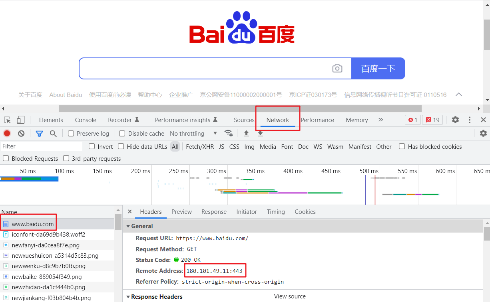
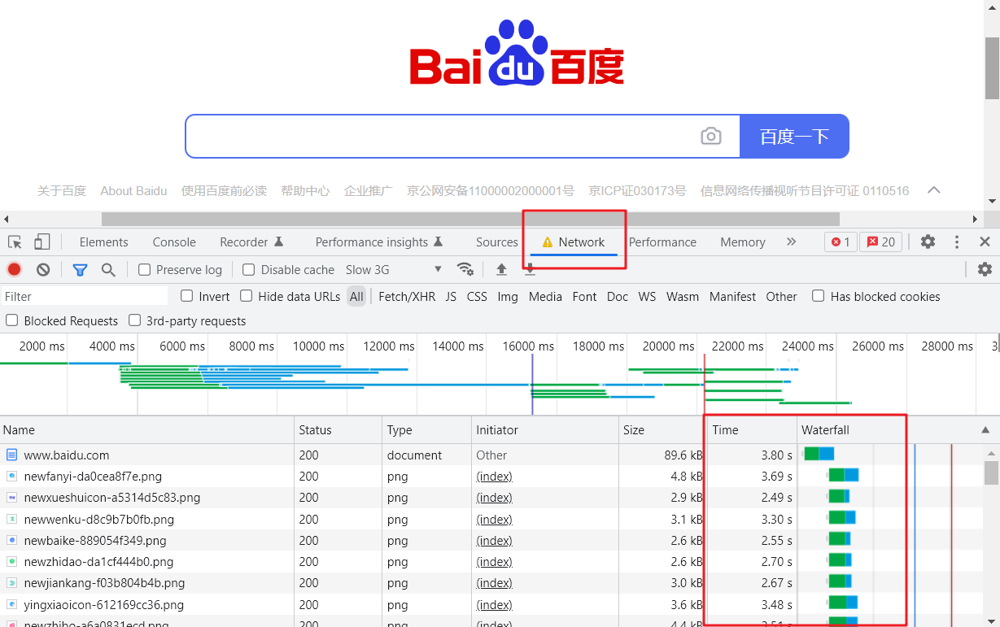
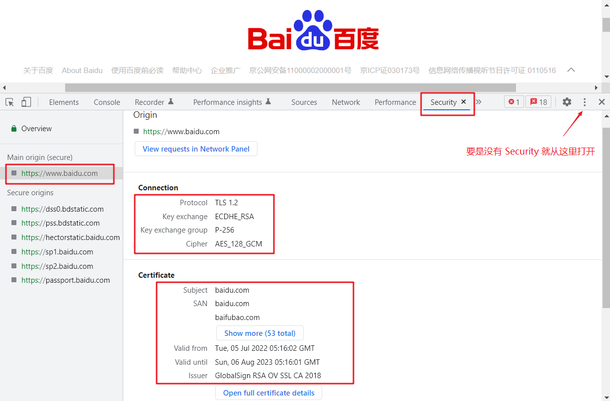
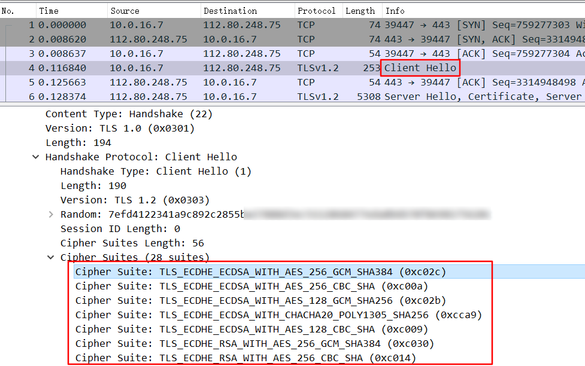
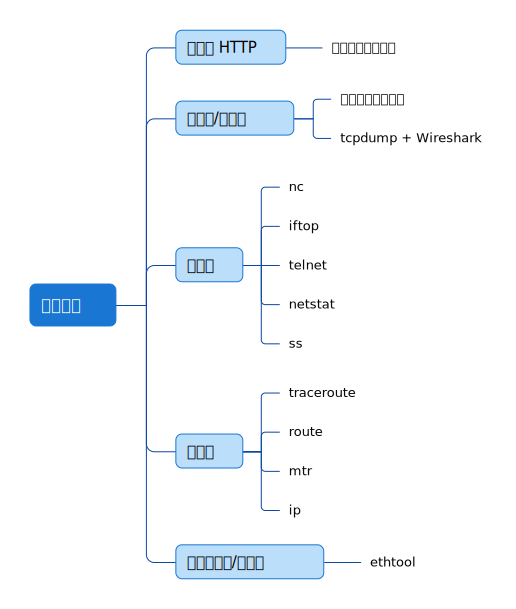

# 网络排查工具

本文介绍网络各层的排查工具。

## 应用层

作为前端开发者，主要以 HTTP 应用的排查工具为主（其他应用开发者应该会有各种熟悉的排查工具）。

现在主流的浏览器是 Google 的 Chrome，它本身就内置了一个开发者工具。在 Chrome 界面里按下 F12，或者是苹果系统的话，还可以按下组合键 option + command + I，启动开发者工具。借助开发者工具，我们可以非常方便地做很多事。

### 找到有问题的服务端 IP

比如有用户报告死活访问不了你的网站，但是你很清楚这个网站的域名对应了很多 IP 地址，你怎么知道用户连的是哪个 IP 呢？

你可以这样做：让客户启用开发者工具，在「Network」页找到主页对象，在它的「Headers」部分，就能看到「Remote address」，这里的 IP 就是当前连接的 IP，比如下面这样：

<div style="text-align: center;">
  
  <p style="text-align: center; color: #888;">（通过开发者工具查询 IP 地址）</p>
</div>

不过因为 DNS 解析的关系，你很可能下次重连就不是这个 IP 了，所以每次都应该重新确认一下这个信息。

这个技巧，在排查公网的访问问题的时候特别有用。因为现在流量大一点的网站都已经上了 CDN，那就必然在全国乃至全球各地，有少则数十个、多则数百个 CDN 终端节点，在给访问者提供就近的服务。如果有人说他访问不了某个站点了，那么请他用开发者工具，找到他连的远程 IP，然后你再根据这个信息展开排查工作，会节省很多排查时间。

### 辅助排查网页慢的问题

访问页面感觉很慢，那么可以借助开发者工具的时间统计功能，找到耗时较高的 HTTP 资源对象，再针对性排查。比如访问百度很慢（这里我手动调节了模拟网速为 Slow 3G），那么可以先打开开发者工具，然后访问站点，等全部加载完成后，到「Network」页查看这些 HTTP 对象的加载时间。

<div style="text-align: center;">
  
  <p style="text-align: center; color: #888;">（通过开发者工具查询资源加载时间）</p>
</div>

不过，这个办法只能排查到是哪个资源对象耗时比较长，但更进一步的排查，比如「为什么这个对象的加载时间比别的对象长」这个问题，开发者工具就难以回答了。关于这个问题，需要用到抓包分析来根本性地排查这类问题。

### 解决失效 Cookie 带来的问题

有时候我们的 Cookie 过期了，导致无法正常登录站点，那么可以打开开发者工具，到 Application 页，找到「Storage」->「Cookie」，把对应的条目清除。这样下次你再访问这个站点时，对站点来说，你就是一次新的访问，可以生成一次新的 Cookie 了。

当然，你通过删除浏览器缓存的方式，也是可以做到这一点的。但开发者工具的优点是，可以**细粒度**到这个网站级别，而删除缓存的方式，删除的就是所有站点的 Cookie 了。

## 表示层和会话层

表示层和会话层的协议并不多，TLS 可以归入这两个层级。为了对 TLS 的问题进行排查，可以使用两种工具。

**第一种，还是基于浏览器做初步的检查，主要是围绕证书本身做检查**。在浏览器的地址栏那里，有一个按钮，点开后就可以查看 TLS 证书等信息：

<div style="text-align: center;">
  
  <p style="text-align: center; color: #888;">（通过浏览器检查证书）</p>
</div>

在上面的菜单中，继续点开「连接是安全的」按钮，进而点击「证书有效」按钮，就能查看证书了。

另外，使用开发者工具的「Security」菜单（如果找不到，就从「More tools 里面打开这个菜单」），还可以查看更为详细的 TLS 信息，包括协议版本、密钥交换算法、证书有效期等等。

<div style="text-align: center;">
  
  <p style="text-align: center; color: #888;">（通过开发者工具查询 TLS 信息）</p>
</div>

**第二种，关于 TLS 握手、密钥交换、密文传输等方面的排查，还是需要用 tcpdump 和 Wireshark 来做**。在 Wireshark 中，可以更加全面地查看 TLS 细节。

比如，我们可以直接看到 TLS 握手阶段里，双方协商**过程中**各自展示的 Cipher suite（密码套件；加密套件；密码组；使用的密码组），而在开发者工具里，我们只能看到协商**完成后**的选择。

```bash
# 先开一个 shell 窗口
tcpdump -i eth0 tcp and port 443 -w baidu.pcap

# 再开一个 shell 窗口
curl --interface eth0 https://www.baidu.com
```

<div style="text-align: center;">
  
  <p style="text-align: center; color: #888;">（访问百度的 TLS 握手阶段报文）</p>
</div>

## 传输层

传输层毫无疑问是重中之重，工具也很多。接下来就按排查场景来介绍工具。

### 路径可达性测试

如果要测试 TCP 握手，我们可以使用 **telnet**、**nc** 这两个常规工具。

使用 telnet：

```bash
[root@study ~]# telnet www.baidu.com 443
Trying 112.80.248.76...
Connected to www.baidu.com.
Escape character is '^]'.

```

::: tip 小贴士
我发现我的那台 CentOS 学习机器没有安装 telnet 命令，可以执行如下命令安装：

```bash
yum list telnet*           # 列出 telnet 相关的安装包
yum install telnet-server  # 安装 telnet 服务
yum install telnet.*       # 安装 telnet 客户端
```
:::

使用 nc：

```bash
[root@study ~]# nc -w 2 -zv www.baidu.com 443
Ncat: Version 7.50 ( https://nmap.org/ncat )
Ncat: Connected to 180.101.49.11:443.
Ncat: 0 bytes sent, 0 bytes received in 0.02 seconds.
```

::: tip 小贴士
同样，我的那台 CentOS 学习机器也没有安装 nc 命令，可以执行如下命令安装：

```bash
yum install nc
```

常用参数：
* `-l`：用于指定 nc 将处于侦听模式。指定该参数，则意味着 nc 被当作 server，侦听并接受连接，而非向其它地址发起连接。
* `-p <port>`：暂未用到（老版本的 nc 可能需要在端口号前加 -p 参数，当前测试环境未用到这个参数）。
* `-s`：指定发送数据的源 IP 地址，适用于多网卡机。
* `-u`：指定 nc 使用 UDP 协议，默认为 TCP。
* `-v`：输出交互或出错信息，新手调试时尤为有用。
* `-w`：超时秒数，后面跟数字。
* `-z`：表示 zero，表示扫描时不发送任何数据。
:::

### 查看当前连接状况

**netstat** 命令是一个经典命令了，很多时候都会使用它来获取当前的 TCP、UDP 等的连接信息，比如显示 TCP 传输协议的连线状况：

```bash
[root@study ~]# netstat -ant
Active Internet connections (servers and established)
Proto Recv-Q Send-Q Local Address           Foreign Address         State      
tcp        0      0 0.0.0.0:22              0.0.0.0:*               LISTEN     
tcp        0      0 127.0.0.1:25            0.0.0.0:*               LISTEN     
tcp        0      0 0.0.0.0:3306            0.0.0.0:*               LISTEN     
tcp        0      0 127.0.0.1:6379          0.0.0.0:*               LISTEN     
tcp        0      0 10.0.16.7:56676         169.254.0.55:5574       ESTABLISHED
```

### 查看当前连接的传输速率

有时候，你的网络跑得挺繁忙的，但你却不知道哪个连接占用了大量的带宽？

这时候可以用 **iftop**。这个工具不是系统默认自带的，需要安装一下，然后用 sudo 权限执行 `iftop`，就能看到不同连接的传输速率了。

```bash
# iftop 安装命令
yum install iftop
```

### 查看丢包和乱序等的统计

用 **netstat** 除了可以获取实时连接状况，还可以获取历史统计信息。比如，你怀疑一台机器的网络很不稳定，除了用 ping 做简单的测试，你还可以用 `netstat -s` 来获取更加详细的统计信息。

比如，其中的 TCP 丢包和乱序计数值，就能帮助你判断传输层的状况。

不过单纯使用 netstat -s 命令的输出是一系列静态值，如果想知道当前情况，可以执行下面的命令：

```bash
watch --diff netstat -s
```

这个命令会把发生变化的数值进行高亮，方便我们查看。

### ss

**ss** 命令是 Iproute2 包里的命令，也是 netstat 的「取代者」。它提供了对 socket 的丰富的统计信息。

比如下面这条命令比较常用，可以查看到当前连接的统计信息：

```bash
[root@study ~]# ss -s
Total: 203 (kernel 277)
TCP:   12 (estab 3, closed 1, orphaned 0, synrecv 0, timewait 1/0), ports 0

Transport Total     IP        IPv6
*	      277       -         -        
RAW	      0         0         0        
UDP	      5         3         2        
TCP	      11        7         4        
INET	  16        10        6        
FRAG	  0         0         0        
```

当然，也不能完全说「ss 等于 netstat」，因为事实上 netstat 命令的功能，被拆分到了 ss 和 ip 这两个命令里，并分别得到了丰富和加强。

## 网络层

在这一层，除了可以直接用 ping 这个非常简便的工具以外，还有另外两个很重要的命令，它们能提供更为强大的排查能力，它们就是 **traceroute** 和 **mtr**。

### 查看网络路径状况

下面这个是我在服务器上做的一个简单的 traceroute 的典型输出：

```bash
[root@study ~]# traceroute www.baidu.com
traceroute to www.baidu.com (112.80.248.76), 30 hops max, 60 byte packets
 1  * * *
 2  * * *
 3  * * *
 4  * * *
 5  * 220.196.197.162 (220.196.197.162)  8.972 ms *
 6  220.196.197.169 (220.196.197.169)  3.346 ms  3.356 ms 220.196.196.13 (220.196.196.13)  2.968 ms
 7  211.95.32.89 (211.95.32.89)  2.964 ms * 211.95.32.45 (211.95.32.45)  3.069 ms
 8  219.158.104.222 (219.158.104.222)  6.010 ms  6.423 ms 219.158.104.218 (219.158.104.218)  5.700 ms
 9  153.3.228.74 (153.3.228.74)  17.048 ms 153.3.228.118 (153.3.228.118)  9.686 ms 153.3.228.122 (153.3.228.122)  9.342 ms
10  153.37.96.130 (153.37.96.130)  9.947 ms 153.37.96.182 (153.37.96.182)  11.665 ms 153.3.226.10 (153.3.226.10)  9.293 ms
11  * * *
12  * * *
13  * * *
14  * * *
15  * * *
16  * * *
17  * * *
18  * * *
19  * * *
20  * * *
```

可以看到有些跳转里面没有 IP，只有星号，相信很多人都会遇到这种情况。其实，你稍微改一下命令，也就是加上 `-I` 参数（I 代表 ICMP），就可以正常运行了：

```bash
[root@study ~]# traceroute www.baidu.com -I
traceroute to www.baidu.com (112.80.248.76), 30 hops max, 60 byte packets
 1  * * *
 2  11.73.56.220 (11.73.56.220)  1.296 ms * *
 3  * * *
 4  * * *
 5  220.196.197.170 (220.196.197.170)  2.791 ms 220.196.197.162 (220.196.197.162)  2.963 ms 220.196.197.170 (220.196.197.170)  2.798 ms
 6  220.196.197.169 (220.196.197.169)  4.736 ms  3.529 ms  2.930 ms
 7  * * *
 8  219.158.11.2 (219.158.11.2)  5.789 ms  5.776 ms  5.761 ms
 9  153.3.228.74 (153.3.228.74)  12.551 ms  12.332 ms  12.390 ms
10  153.3.226.18 (153.3.226.18)  8.614 ms  8.621 ms  8.615 ms
11  182.61.216.0 (182.61.216.0)  13.174 ms  12.333 ms  8.377 ms
12  * * *
13  112.80.248.76 (112.80.248.76)  8.841 ms  8.656 ms  8.668 ms
```

背后的原理，就是 traceroute 默认是用 UDP 作为探测协议的，但是很多网络设备并不会对 UDP 作出回应。所以我们改成 ICMP 协议做探测后，网络设备就有回应了。其实，Windows 上的 tracert，就是默认用 ICMP，这一点跟 Linux 正好是反过来的。

但是，traceroute 也有一个明显的不足：**它不能对这个路径做连续多次的探测**。

于是，mtr 出现了，它可以说是 traceroute 的超集，除了 traceroute 的功能，还能实现丰富的探测报告。尤其是它对每一跳的丢包率的百分比，是用来定位路径中节点问题的重要指标。所以，当你在遇到「**连接状况时好时坏的问题**」的时候，单纯用一次性的 traceroute 恐怕难以看清楚，那就可以用 mtr，来获取更加全面和动态的链路状态信息了。

```bash
[root@study ~]# mtr www.baidu.com -r -c 10
Start: Wed Sep 14 10:34:26 2022
HOST: study                       Loss%   Snt   Last   Avg  Best  Wrst StDev
  1.|-- ???                       100.0    10    0.0   0.0   0.0   0.0   0.0
  2.|-- ???                       100.0    10    0.0   0.0   0.0   0.0   0.0
  3.|-- ???                       100.0    10    0.0   0.0   0.0   0.0   0.0
  4.|-- ???                       100.0    10    0.0   0.0   0.0   0.0   0.0
  5.|-- 220.196.197.162            0.0%    10    2.6   3.3   2.6   8.8   1.9
  6.|-- 220.196.197.161            0.0%    10    3.4   3.3   3.0   3.9   0.0
  7.|-- ???                       100.0    10    0.0   0.0   0.0   0.0   0.0
  8.|-- 219.158.107.6              0.0%    10   22.1  24.0  21.8  32.6   3.9
  9.|-- 110.242.66.178            40.0%    10   26.7  26.6  26.5  26.7   0.0
 10.|-- ???                       100.0    10    0.0   0.0   0.0   0.0   0.0
```

### 查看路由

命令 **route** 可以查看路由表，不过这个命令比较老一点：

```bash
[root@study ~]# route -n
Kernel IP routing table
Destination     Gateway         Genmask         Flags Metric Ref    Use Iface
0.0.0.0         10.0.16.1       0.0.0.0         UG    0      0        0 eth0
10.0.16.0       0.0.0.0         255.255.252.0   U     0      0        0 eth0
169.254.0.0     0.0.0.0         255.255.0.0     U     1002   0        0 eth0
```

传输层工具里介绍的 **netstat**，其实也能帮我们查看路由，只要加上 `-r` 参数：

```bash
[root@study ~]# netstat -r
Kernel IP routing table
Destination     Gateway         Genmask         Flags   MSS Window  irtt Iface
default         gateway         0.0.0.0         UG        0 0          0 eth0
10.0.16.0       0.0.0.0         255.255.252.0   U         0 0          0 eth0
link-local      0.0.0.0         255.255.0.0     U         0 0          0 eth0
```

前面说过，netstat 是被 ss 和 ip 这两个命令替代了。所以我们同样可以用 **ip 命令**查看路由。比如这样：

```bash
[root@study ~]# ip route
default via 10.0.16.1 dev eth0 
10.0.16.0/22 dev eth0 proto kernel scope link src 10.0.16.7 
169.254.0.0/16 dev eth0 scope link metric 1002
```

## 数据链路层和物理层

这一层离应用层已经很远了，一般来说是专职的网络团队在负责。如果这一层有问题，就会直接体现在网络层表现上面，比如 IP 会有丢包和延迟等现象，然后会引发传输层异常（如丢包、乱序、重传等）。所以，**一个稳定的数据链路层乃至物理层，是网络可靠性的基石**。

你可能会奇怪：既然底下这两层的稳定性如此重要，那上层的 TCP 不是号称还有传输可靠性的保障吗？难道这种保障形同虚设？

其实，这两点并不矛盾。TCP 的传输可靠性是通过序列号、确认号、重传机制等来保证的，通过这种机制，TCP 可以在**一定程度**的网络不稳定场景下，依然保证传输可靠，但不等于 TCP 可以无限容忍底层的不稳定，因为各种 TCP 拥塞控制算法都会由于这种问题，而极大地降低传输性能。如果你想查看这两层的状况，可以用 ethtool 这个工具。比如这样：

如果想查看这两层的状况，可以用 **ethtool** 这个工具，它是用于查询及设置网卡参数的命令。

```
-a 查看网卡中接收模块RX、发送模块TX 和 Autonegotiate 模块的状态：启动on 或 停用off。
-A 修改网卡中接收模块RX、发送模块TX 和 Autonegotiate 模块的状态：启动on 或 停用off。
-c display the Coalesce(聚合、联合) information of the specified ethernet card.聚合网口信息，使看起来更有规律。
-C Change the Coalesce setting of the specified ethernet card.修改网卡聚合信息。
-g Display the rx/tx ring parameter information of the specified ethernet card. 显示网卡的接收/发送环形参数。
-G Change the rx/tx ring setting of the specified ethernet card. 修改网卡的接收/发送环形参数。
-i 显示网卡驱动的信息，如驱动的名称、版本等。
-d 显示 register dump 信息，部分网卡驱动不支持该选项。
-e 显示 EEPROM dump 信息，部分网卡驱动不支持该选项。
-E 修改网卡 EEPROM byte。
-k 显示网卡 Offload 参数的状态：on 或 off，包括 rx-checksumming、tx-checksumming 等。
-K 修改网卡 Offload 参数的状态。
-p 用于区别不同 ethX 对应网卡的物理位置，常用的方法是使网卡 port 上的 led 不断的闪；N 指示了网卡闪的持续时间，以秒为单位。
-r 如果 auto-negotiation 模块的状态为 on，则 restarts auto-negotiation.
-s 修改网卡的部分配置，包括网卡速度、单工/全双工模式、mac 地址等。加上 -s 选项修改的内容才会生效。
-S 显示 NIC- and driver-specific 的统计参数，如网卡接收/发送的字节数、接收/发送的广播包个数等。
-t 让网卡执行自我检测，有两种模式：offline or online。
```

查询网口的驱动相关信息：

```bash
[root@study ~]# ethtool -i eth0
driver: virtio_net
version: 1.0.0
firmware-version: 
expansion-rom-version: 
bus-info: 0000:00:05.0
supports-statistics: no
supports-test: no
supports-eeprom-access: no
supports-register-dump: no
supports-priv-flags: no
```

它的原理，是网卡驱动会到内核中注册 ethtool 回调函数，然后我们用 ethtool 命令就可以查看这些信息了。由于信息是由网卡驱动提供的，所以十分「接地气」。

如果你在传输层和网络层的排查工具上，已经看到明确的链路不稳定的信息，那就直接找网络团队去处理吧。

## 总结

总结网络各层的常用排查工具如下：

<div style="text-align: center;">
  
  <p style="text-align: center; color: #888;">（网络各层常用排查工具）</p>
</div>

（完）
