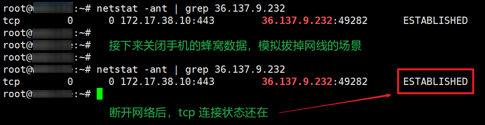
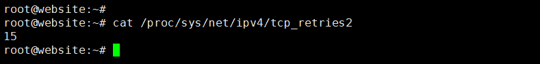
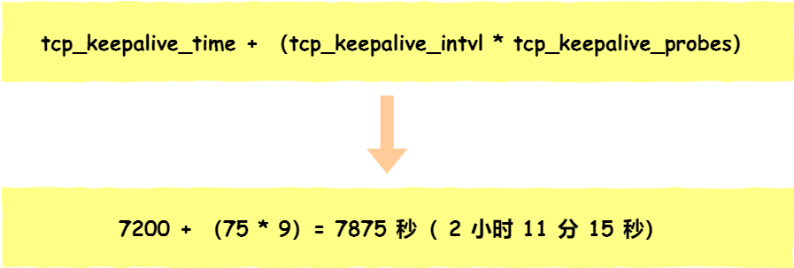
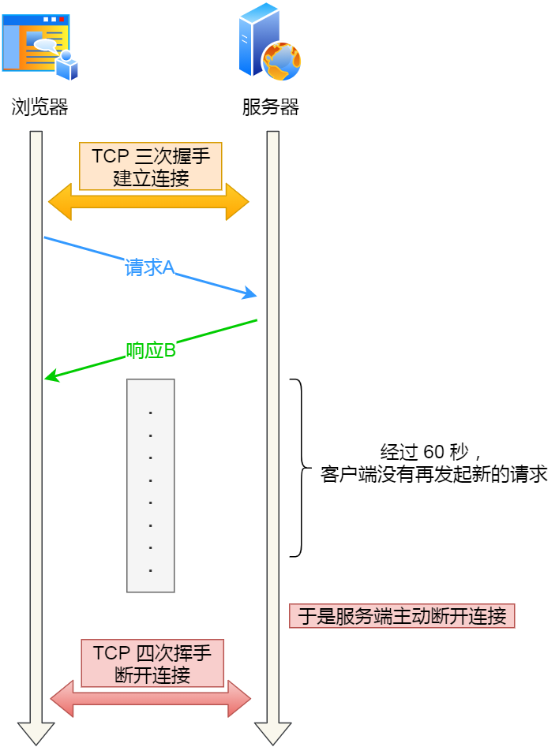

# 拔掉网线后，TCP 连接会断开吗？

现在有一个有趣的问题：拔掉网线几秒，再插回去，原本的 TCP 连接还存在吗？

惯性思维是：网线都被拔掉了，说明物理层被断开了，那在上层的传输层理应也会断开，所以原本的 TCP 连接肯定不会存在了。就好像，我们拨打有线电话的时候，如果某一方的电话线被拔了，那么本次通话就彻底断了。

既然单独把这个问题拎出来，显然是埋了坑。

上面这个惯性思维的逻辑就有问题。问题在于，错误的认为拔掉网线这个动作会影响传输层，事实上并不会影响。

实际上，TCP 连接在 Linux 内核中是一个名为 `struct socket` 的结构体，该结构体的内容包含 TCP 连接的状态等信息。当拔掉网线的时候，操作系统并不会变更该结构体的任何内容，所以 TCP 连接的状态也不会发生改变。

## 做个实验

我在我的电脑上做了个小实验，我用手机的蜂窝数据流量访问了我的云服务器（IP 为 `36.137.9.232`），然后我通过关闭蜂窝数据的方式来模拟拔掉网线的场景，此时查看 TCP 连接的状态没有发生变化，还是处于 `ESTABLISHED` 状态。

<div style="text-align: center;">
  
  <p style="text-align: center; color: #888;">（模拟断开网络）</p>
</div>

通过上面这个实验结果，我们知道了，拔掉网线这个动作并不会影响 TCP 连接的状态。

接下来，要看拔掉网线后，双方做了什么动作。

所以， 针对这个问题，要分场景来讨论：

* 拔掉网线后，有数据传输。
* 拔掉网线后，没有数据传输。

## 拔掉网线后，有数据传输

### 超时重传

在客户端拔掉网线后，服务端向客户端发送的数据报文会得不到任何的响应，在等待一定时长后，服务端就会触发**超时重传**机制，重传未得到响应的数据报文。

**如果在服务端重传报文的过程中，客户端刚好把网线插回去了**，由于拔掉网线并不会改变客户端的 TCP 连接状态，并且还是处于 `ESTABLISHED` 状态，所以这时客户端是可以正常接收服务端发来的数据报文的，然后客户端就会回 `ACK` 响应报文。

此时，客户端和服务端的 TCP 连接依然存在的，就感觉什么事情都没有发生。

但是，**如果如果在服务端重传报文的过程中，客户端一直没有将网线插回去**，服务端超时重传报文的次数达到一定阈值后，内核就会判定出该 TCP 有问题，然后通过 Socket 接口告诉应用程序该 TCP 连接出问题了，于是服务端的 TCP 连接就会断开。

而等客户端插回网线后，如果客户端向服务端发送了数据，由于服务端已经没有与客户端相同四元祖的 TCP 连接了，因此服务端内核就会回复 `RST` 报文，客户端收到后就会释放该 TCP 连接。

此时，客户端和服务端的 TCP 连接都已经断开了。

### 重传几次

那 TCP 的数据报文具体重传几次呢？

在 Linux 系统中，提供了一个叫 `tcp_retries2` 配置项，默认值是 `15`，如下图：

<div style="text-align: center;">
  
  <p style="text-align: center; color: #888;">（TCP 超时重传次数）</p>
</div>

这个内核参数是控制，在 TCP 连接建立的情况下，超时重传的最大次数。

不过 `tcp_retries2` 设置了 `15` 次，并不代表 TCP 超时重传了 `15` 次才会通知应用程序终止该 TCP 连接，内核还会基于「最大超时时间」来判定。

每一轮的超时时间都是倍数增长的，比如第一次触发超时重传是在 2s 后，第二次则是在 4s 后，第三次则是 8s 后，以此类推。

<div style="text-align: center;">
  <svg id="SvgjsSvg1006" width="643" height="729" xmlns="http://www.w3.org/2000/svg" version="1.1" xmlns:xlink="http://www.w3.org/1999/xlink" xmlns:svgjs="http://svgjs.com/svgjs"><defs id="SvgjsDefs1007"></defs><g id="SvgjsG1008" transform="translate(25,24.99999237060547)"><path id="SvgjsPath1009" d="M0 0L148.96159999999998 0L148.96159999999998 39.99399999999999 L0 39.99399999999999Z" stroke="rgba(102, 102, 102,1)" stroke-width="1" fill-opacity="1" fill="#ffffff"></path><path id="SvgjsPath1010" d="M148.96159999999998 0L289.91769999999997 0L289.91769999999997 39.99399999999999 L148.96159999999998 39.99399999999999Z" stroke="rgba(102, 102, 102,1)" stroke-width="1" fill-opacity="1" fill="#ffffff"></path><path id="SvgjsPath1011" d="M289.9177 0L593 0L593 39.99399999999999 L289.9177 39.99399999999999Z" stroke="rgba(102, 102, 102,1)" stroke-width="1" fill-opacity="1" fill="#ffffff"></path><g id="SvgjsG1012"><text id="SvgjsText1013" font-family="微软雅黑" text-anchor="middle" font-size="16px" width="149px" fill="#323232" font-weight="700" align="middle" lineHeight="125%" anchor="middle" family="微软雅黑" size="16px" weight="700" font-style="" opacity="1" y="5.996999999999996" transform="rotate(0)"><tspan id="SvgjsTspan1014" dy="20" x="74.5"><tspan id="SvgjsTspan1015" style="text-decoration:;">Retransmission #</tspan></tspan></text></g><g id="SvgjsG1016"><text id="SvgjsText1017" font-family="微软雅黑" text-anchor="middle" font-size="16px" width="141px" fill="#323232" font-weight="700" align="middle" lineHeight="125%" anchor="middle" family="微软雅黑" size="16px" weight="700" font-style="" opacity="1" y="5.996999999999996" transform="rotate(0)"><tspan id="SvgjsTspan1018" dy="20" x="219.46159999999998"><tspan id="SvgjsTspan1019" style="text-decoration:;">RTO（ms）</tspan></tspan></text></g><g id="SvgjsG1020"><text id="SvgjsText1021" font-family="微软雅黑" text-anchor="middle" font-size="16px" width="304px" fill="#323232" font-weight="700" align="middle" lineHeight="125%" anchor="middle" family="微软雅黑" size="16px" weight="700" font-style="" opacity="1" y="5.996999999999996" transform="rotate(0)"><tspan id="SvgjsTspan1022" dy="20" x="441.9177"><tspan id="SvgjsTspan1023" style="text-decoration:;">Time before a timeout</tspan></tspan></text></g></g><g id="SvgjsG1024" transform="translate(25,63.99999237060547)"><path id="SvgjsPath1025" d="M0 0L148.17383175000003 0L148.17383175000003 39.98654375 L0 39.98654375Z" stroke="rgba(102, 102, 102,1)" stroke-width="1" fill-opacity="1" fill="#ffffff"></path><path id="SvgjsPath1026" d="M148.17383175000003 0L289.46964650000007 0L289.46964650000007 39.98654375 L148.17383175000003 39.98654375Z" stroke="rgba(102, 102, 102,1)" stroke-width="1" fill-opacity="1" fill="#ffffff"></path><path id="SvgjsPath1027" d="M289.46964650000007 0L444.75866825000014 0L444.75866825000014 39.98654375 L289.46964650000007 39.98654375Z" stroke="rgba(102, 102, 102,1)" stroke-width="1" fill-opacity="1" fill="#ffffff"></path><path id="SvgjsPath1028" d="M444.7586682500001 0L592.9325000000001 0L592.9325000000001 39.98654375 L444.7586682500001 39.98654375Z" stroke="rgba(102, 102, 102,1)" stroke-width="1" fill-opacity="1" fill="#ffffff"></path><path id="SvgjsPath1029" d="M0 39.98654375L148.17383175000003 39.98654375L148.17383175000003 79.9730875 L0 79.9730875Z" stroke="rgba(102, 102, 102,1)" stroke-width="1" fill-opacity="1" fill="#ffffff"></path><path id="SvgjsPath1030" d="M148.17383175000003 39.98654375L289.46964650000007 39.98654375L289.46964650000007 79.9730875 L148.17383175000003 79.9730875Z" stroke="rgba(102, 102, 102,1)" stroke-width="1" fill-opacity="1" fill="#ffffff"></path><path id="SvgjsPath1031" d="M289.46964650000007 39.98654375L444.75866825000014 39.98654375L444.75866825000014 79.9730875 L289.46964650000007 79.9730875Z" stroke="rgba(102, 102, 102,1)" stroke-width="1" fill-opacity="1" fill="#ffffff"></path><path id="SvgjsPath1032" d="M444.7586682500001 39.98654375L592.9325000000001 39.98654375L592.9325000000001 79.9730875 L444.7586682500001 79.9730875Z" stroke="rgba(102, 102, 102,1)" stroke-width="1" fill-opacity="1" fill="#ffffff"></path><path id="SvgjsPath1033" d="M0 80.03706597L148.17383175000003 80.03706597L148.17383175000003 120.02360972 L0 120.02360972Z" stroke="rgba(102, 102, 102,1)" stroke-width="1" fill-opacity="1" fill="#ffffff"></path><path id="SvgjsPath1034" d="M148.17383175000003 80.03706597L289.46964650000007 80.03706597L289.46964650000007 120.02360972 L148.17383175000003 120.02360972Z" stroke="rgba(102, 102, 102,1)" stroke-width="1" fill-opacity="1" fill="#ffffff"></path><path id="SvgjsPath1035" d="M289.46964650000007 80.03706597L444.75866825000014 80.03706597L444.75866825000014 120.02360972 L289.46964650000007 120.02360972Z" stroke="rgba(102, 102, 102,1)" stroke-width="1" fill-opacity="1" fill="#ffffff"></path><path id="SvgjsPath1036" d="M444.7586682500001 80.03706597L592.9325000000001 80.03706597L592.9325000000001 120.02360972 L444.7586682500001 120.02360972Z" stroke="rgba(102, 102, 102,1)" stroke-width="1" fill-opacity="1" fill="#ffffff"></path><path id="SvgjsPath1037" d="M0 120.02360972L148.17383175000003 120.02360972L148.17383175000003 160.01015347 L0 160.01015347Z" stroke="rgba(102, 102, 102,1)" stroke-width="1" fill-opacity="1" fill="#ffffff"></path><path id="SvgjsPath1038" d="M148.17383175000003 120.02360972L289.46964650000007 120.02360972L289.46964650000007 160.01015347 L148.17383175000003 160.01015347Z" stroke="rgba(102, 102, 102,1)" stroke-width="1" fill-opacity="1" fill="#ffffff"></path><path id="SvgjsPath1039" d="M289.46964650000007 120.02360972L444.75866825000014 120.02360972L444.75866825000014 160.01015347 L289.46964650000007 160.01015347Z" stroke="rgba(102, 102, 102,1)" stroke-width="1" fill-opacity="1" fill="#ffffff"></path><path id="SvgjsPath1040" d="M444.7586682500001 120.02360972L592.9325000000001 120.02360972L592.9325000000001 160.01015347 L444.7586682500001 160.01015347Z" stroke="rgba(102, 102, 102,1)" stroke-width="1" fill-opacity="1" fill="#ffffff"></path><path id="SvgjsPath1041" d="M0 160.01015347L148.17383175000003 160.01015347L148.17383175000003 199.99669722000002 L0 199.99669722000002Z" stroke="rgba(102, 102, 102,1)" stroke-width="1" fill-opacity="1" fill="#ffffff"></path><path id="SvgjsPath1042" d="M148.17383175000003 160.01015347L289.46964650000007 160.01015347L289.46964650000007 199.99669722000002 L148.17383175000003 199.99669722000002Z" stroke="rgba(102, 102, 102,1)" stroke-width="1" fill-opacity="1" fill="#ffffff"></path><path id="SvgjsPath1043" d="M289.46964650000007 160.01015347L444.75866825000014 160.01015347L444.75866825000014 199.99669722000002 L289.46964650000007 199.99669722000002Z" stroke="rgba(102, 102, 102,1)" stroke-width="1" fill-opacity="1" fill="#ffffff"></path><path id="SvgjsPath1044" d="M444.7586682500001 160.01015347L592.9325000000001 160.01015347L592.9325000000001 199.99669722000002 L444.7586682500001 199.99669722000002Z" stroke="rgba(102, 102, 102,1)" stroke-width="1" fill-opacity="1" fill="#ffffff"></path><path id="SvgjsPath1045" d="M0 200.06067569L148.17383175000003 200.06067569L148.17383175000003 240.04721944000002 L0 240.04721944000002Z" stroke="rgba(102, 102, 102,1)" stroke-width="1" fill-opacity="1" fill="#ffffff"></path><path id="SvgjsPath1046" d="M148.17383175000003 200.06067569L289.46964650000007 200.06067569L289.46964650000007 240.04721944000002 L148.17383175000003 240.04721944000002Z" stroke="rgba(102, 102, 102,1)" stroke-width="1" fill-opacity="1" fill="#ffffff"></path><path id="SvgjsPath1047" d="M289.46964650000007 200.06067569L444.75866825000014 200.06067569L444.75866825000014 240.04721944000002 L289.46964650000007 240.04721944000002Z" stroke="rgba(102, 102, 102,1)" stroke-width="1" fill-opacity="1" fill="#ffffff"></path><path id="SvgjsPath1048" d="M444.7586682500001 200.06067569L592.9325000000001 200.06067569L592.9325000000001 240.04721944000002 L444.7586682500001 240.04721944000002Z" stroke="rgba(102, 102, 102,1)" stroke-width="1" fill-opacity="1" fill="#ffffff"></path><path id="SvgjsPath1049" d="M0 240.04721944L148.17383175000003 240.04721944L148.17383175000003 279.90580625 L0 279.90580625Z" stroke="rgba(102, 102, 102,1)" stroke-width="1" fill-opacity="1" fill="#ffffff"></path><path id="SvgjsPath1050" d="M148.17383175000003 240.04721944L289.46964650000007 240.04721944L289.46964650000007 279.90580625 L148.17383175000003 279.90580625Z" stroke="rgba(102, 102, 102,1)" stroke-width="1" fill-opacity="1" fill="#ffffff"></path><path id="SvgjsPath1051" d="M289.46964650000007 240.04721944L444.75866825000014 240.04721944L444.75866825000014 279.90580625 L289.46964650000007 279.90580625Z" stroke="rgba(102, 102, 102,1)" stroke-width="1" fill-opacity="1" fill="#ffffff"></path><path id="SvgjsPath1052" d="M444.7586682500001 240.04721944L592.9325000000001 240.04721944L592.9325000000001 279.90580625 L444.7586682500001 279.90580625Z" stroke="rgba(102, 102, 102,1)" stroke-width="1" fill-opacity="1" fill="#ffffff"></path><path id="SvgjsPath1053" d="M0 279.96978472L148.17383175000003 279.96978472L148.17383175000003 319.82837153 L0 319.82837153Z" stroke="rgba(102, 102, 102,1)" stroke-width="1" fill-opacity="1" fill="#ffffff"></path><path id="SvgjsPath1054" d="M148.17383175000003 279.96978472L289.46964650000007 279.96978472L289.46964650000007 319.82837153 L148.17383175000003 319.82837153Z" stroke="rgba(102, 102, 102,1)" stroke-width="1" fill-opacity="1" fill="#ffffff"></path><path id="SvgjsPath1055" d="M289.46964650000007 279.96978472L444.75866825000014 279.96978472L444.75866825000014 319.82837153 L289.46964650000007 319.82837153Z" stroke="rgba(102, 102, 102,1)" stroke-width="1" fill-opacity="1" fill="#ffffff"></path><path id="SvgjsPath1056" d="M444.7586682500001 279.96978472L592.9325000000001 279.96978472L592.9325000000001 319.82837153 L444.7586682500001 319.82837153Z" stroke="rgba(102, 102, 102,1)" stroke-width="1" fill-opacity="1" fill="#ffffff"></path><path id="SvgjsPath1057" d="M0 319.82837153L148.17383175000003 319.82837153L148.17383175000003 359.68695834000005 L0 359.68695834000005Z" stroke="rgba(102, 102, 102,1)" stroke-width="1" fill-opacity="1" fill="#ffffff"></path><path id="SvgjsPath1058" d="M148.17383175000003 319.82837153L289.46964650000007 319.82837153L289.46964650000007 359.68695834000005 L148.17383175000003 359.68695834000005Z" stroke="rgba(102, 102, 102,1)" stroke-width="1" fill-opacity="1" fill="#ffffff"></path><path id="SvgjsPath1059" d="M289.46964650000007 319.82837153L444.75866825000014 319.82837153L444.75866825000014 359.68695834000005 L289.46964650000007 359.68695834000005Z" stroke="rgba(102, 102, 102,1)" stroke-width="1" fill-opacity="1" fill="#ffffff"></path><path id="SvgjsPath1060" d="M444.7586682500001 319.82837153L592.9325000000001 319.82837153L592.9325000000001 359.68695834000005 L444.7586682500001 359.68695834000005Z" stroke="rgba(102, 102, 102,1)" stroke-width="1" fill-opacity="1" fill="#ffffff"></path><path id="SvgjsPath1061" d="M0 359.68695834000005L148.17383175000003 359.68695834000005L148.17383175000003 399.54554515000007 L0 399.54554515000007Z" stroke="rgba(102, 102, 102,1)" stroke-width="1" fill-opacity="1" fill="#ffffff"></path><path id="SvgjsPath1062" d="M148.17383175000003 359.68695834000005L289.46964650000007 359.68695834000005L289.46964650000007 399.54554515000007 L148.17383175000003 399.54554515000007Z" stroke="rgba(102, 102, 102,1)" stroke-width="1" fill-opacity="1" fill="#ffffff"></path><path id="SvgjsPath1063" d="M289.46964650000007 359.68695834000005L444.75866825000014 359.68695834000005L444.75866825000014 399.54554515000007 L289.46964650000007 399.54554515000007Z" stroke="rgba(102, 102, 102,1)" stroke-width="1" fill-opacity="1" fill="#ffffff"></path><path id="SvgjsPath1064" d="M444.7586682500001 359.68695834000005L592.9325000000001 359.68695834000005L592.9325000000001 399.54554515000007 L444.7586682500001 399.54554515000007Z" stroke="rgba(102, 102, 102,1)" stroke-width="1" fill-opacity="1" fill="#ffffff"></path><path id="SvgjsPath1065" d="M0 399.48156668L148.17383175000003 399.48156668L148.17383175000003 439.34015349000003 L0 439.34015349000003Z" stroke="rgba(102, 102, 102,1)" stroke-width="1" fill-opacity="1" fill="#ffffff"></path><path id="SvgjsPath1066" d="M148.17383175000003 399.48156668L289.46964650000007 399.48156668L289.46964650000007 439.34015349000003 L148.17383175000003 439.34015349000003Z" stroke="rgba(102, 102, 102,1)" stroke-width="1" fill-opacity="1" fill="#ffffff"></path><path id="SvgjsPath1067" d="M289.46964650000007 399.48156668L444.75866825000014 399.48156668L444.75866825000014 439.34015349000003 L289.46964650000007 439.34015349000003Z" stroke="rgba(102, 102, 102,1)" stroke-width="1" fill-opacity="1" fill="#ffffff"></path><path id="SvgjsPath1068" d="M444.7586682500001 399.48156668L592.9325000000001 399.48156668L592.9325000000001 439.34015349000003 L444.7586682500001 439.34015349000003Z" stroke="rgba(102, 102, 102,1)" stroke-width="1" fill-opacity="1" fill="#ffffff"></path><path id="SvgjsPath1069" d="M0 439.40413196000003L148.17383175000003 439.40413196000003L148.17383175000003 479.39067571000004 L0 479.39067571000004Z" stroke="rgba(102, 102, 102,1)" stroke-width="1" fill-opacity="1" fill="#ffffff"></path><path id="SvgjsPath1070" d="M148.17383175000003 439.40413196000003L289.46964650000007 439.40413196000003L289.46964650000007 479.39067571000004 L148.17383175000003 479.39067571000004Z" stroke="rgba(102, 102, 102,1)" stroke-width="1" fill-opacity="1" fill="#ffffff"></path><path id="SvgjsPath1071" d="M289.46964650000007 439.40413196000003L444.75866825000014 439.40413196000003L444.75866825000014 479.39067571000004 L289.46964650000007 479.39067571000004Z" stroke="rgba(102, 102, 102,1)" stroke-width="1" fill-opacity="1" fill="#ffffff"></path><path id="SvgjsPath1072" d="M444.7586682500001 439.40413196000003L592.9325000000001 439.40413196000003L592.9325000000001 479.39067571000004 L444.7586682500001 479.39067571000004Z" stroke="rgba(102, 102, 102,1)" stroke-width="1" fill-opacity="1" fill="#ffffff"></path><path id="SvgjsPath1073" d="M0 479.39067571000004L148.17383175000003 479.39067571000004L148.17383175000003 519.56915487 L0 519.56915487Z" stroke="rgba(102, 102, 102,1)" stroke-width="1" fill-opacity="1" fill="#ffffff"></path><path id="SvgjsPath1074" d="M148.17383175000003 479.39067571000004L289.46964650000007 479.39067571000004L289.46964650000007 519.56915487 L148.17383175000003 519.56915487Z" stroke="rgba(102, 102, 102,1)" stroke-width="1" fill-opacity="1" fill="#ffffff"></path><path id="SvgjsPath1075" d="M289.46964650000007 479.39067571000004L444.75866825000014 479.39067571000004L444.75866825000014 519.56915487 L289.46964650000007 519.56915487Z" stroke="rgba(102, 102, 102,1)" stroke-width="1" fill-opacity="1" fill="#ffffff"></path><path id="SvgjsPath1076" d="M444.7586682500001 479.39067571000004L592.9325000000001 479.39067571000004L592.9325000000001 519.56915487 L444.7586682500001 519.56915487Z" stroke="rgba(102, 102, 102,1)" stroke-width="1" fill-opacity="1" fill="#ffffff"></path><path id="SvgjsPath1077" d="M0 519.56915487L148.17383175000003 519.56915487L148.17383175000003 559.68365556 L0 559.68365556Z" stroke="rgba(102, 102, 102,1)" stroke-width="1" fill-opacity="1" fill="#ffffff"></path><path id="SvgjsPath1078" d="M148.17383175000003 519.56915487L289.46964650000007 519.56915487L289.46964650000007 559.68365556 L148.17383175000003 559.68365556Z" stroke="rgba(102, 102, 102,1)" stroke-width="1" fill-opacity="1" fill="#ffffff"></path><path id="SvgjsPath1079" d="M289.46964650000007 519.56915487L444.75866825000014 519.56915487L444.75866825000014 559.68365556 L289.46964650000007 559.68365556Z" stroke="rgba(102, 102, 102,1)" stroke-width="1" fill-opacity="1" fill="#ffffff"></path><path id="SvgjsPath1080" d="M444.7586682500001 519.56915487L592.9325000000001 519.56915487L592.9325000000001 559.68365556 L444.7586682500001 559.68365556Z" stroke="rgba(102, 102, 102,1)" stroke-width="1" fill-opacity="1" fill="#ffffff"></path><path id="SvgjsPath1081" d="M0 559.68365556L148.17383175000003 559.68365556L148.17383175000003 599.60622084 L0 599.60622084Z" stroke="rgba(102, 102, 102,1)" stroke-width="1" fill-opacity="1" fill="#ffffff"></path><path id="SvgjsPath1082" d="M148.17383175000003 559.68365556L289.46964650000007 559.68365556L289.46964650000007 599.60622084 L148.17383175000003 599.60622084Z" stroke="rgba(102, 102, 102,1)" stroke-width="1" fill-opacity="1" fill="#ffffff"></path><path id="SvgjsPath1083" d="M289.46964650000007 559.68365556L444.75866825000014 559.68365556L444.75866825000014 599.60622084 L289.46964650000007 599.60622084Z" stroke="rgba(102, 102, 102,1)" stroke-width="1" fill-opacity="1" fill="#ffffff"></path><path id="SvgjsPath1084" d="M444.7586682500001 559.68365556L592.9325000000001 559.68365556L592.9325000000001 599.60622084 L444.7586682500001 599.60622084Z" stroke="rgba(102, 102, 102,1)" stroke-width="1" fill-opacity="1" fill="#ffffff"></path><path id="SvgjsPath1085" d="M0 599.67019931L148.17383175000003 599.67019931L148.17383175000003 639.7847 L0 639.7847Z" stroke="rgba(102, 102, 102,1)" stroke-width="1" fill-opacity="1" fill="#ffffff"></path><path id="SvgjsPath1086" d="M148.17383175000003 599.67019931L289.46964650000007 599.67019931L289.46964650000007 639.7847 L148.17383175000003 639.7847Z" stroke="rgba(102, 102, 102,1)" stroke-width="1" fill-opacity="1" fill="#ffffff"></path><path id="SvgjsPath1087" d="M289.46964650000007 599.67019931L444.75866825000014 599.67019931L444.75866825000014 639.7847 L289.46964650000007 639.7847Z" stroke="rgba(102, 102, 102,1)" stroke-width="1" fill-opacity="1" fill="#ffffff"></path><path id="SvgjsPath1088" d="M444.7586682500001 599.67019931L592.9325000000001 599.67019931L592.9325000000001 639.7847 L444.7586682500001 639.7847Z" stroke="rgba(102, 102, 102,1)" stroke-width="1" fill-opacity="1" fill="#ffffff"></path><g id="SvgjsG1089"><text id="SvgjsText1090" font-family="微软雅黑" text-anchor="end" font-size="16px" width="149px" fill="#323232" font-weight="400" align="middle" lineHeight="125%" anchor="end" family="微软雅黑" size="16px" weight="400" font-style="" opacity="1" y="5.993271875000001" transform="rotate(0)"><tspan id="SvgjsTspan1091" dy="20" x="149"><tspan id="SvgjsTspan1092" style="text-decoration:;">1 </tspan></tspan></text></g><g id="SvgjsG1093"><text id="SvgjsText1094" font-family="微软雅黑" text-anchor="end" font-size="16px" width="142px" fill="#323232" font-weight="400" align="middle" lineHeight="125%" anchor="end" family="微软雅黑" size="16px" weight="400" font-style="" opacity="1" y="5.993271875000001" transform="rotate(0)"><tspan id="SvgjsTspan1095" dy="20" x="290.17383175000003"><tspan id="SvgjsTspan1096" style="text-decoration:;">200 </tspan></tspan></text></g><g id="SvgjsG1097"><text id="SvgjsText1098" font-family="微软雅黑" text-anchor="end" font-size="16px" width="156px" fill="#323232" font-weight="400" align="middle" lineHeight="125%" anchor="end" family="微软雅黑" size="16px" weight="400" font-style="" opacity="1" y="5.993271875000001" transform="rotate(0)"><tspan id="SvgjsTspan1099" dy="20" x="445.46964650000007"><tspan id="SvgjsTspan1100" style="text-decoration:;">0.2 secs </tspan></tspan></text></g><g id="SvgjsG1101"><text id="SvgjsText1102" font-family="微软雅黑" text-anchor="end" font-size="16px" width="149px" fill="#323232" font-weight="400" align="middle" lineHeight="125%" anchor="end" family="微软雅黑" size="16px" weight="400" font-style="" opacity="1" y="5.993271875000001" transform="rotate(0)"><tspan id="SvgjsTspan1103" dy="20" x="593.75866825"><tspan id="SvgjsTspan1104" style="text-decoration:;">0.0 mins </tspan></tspan></text></g><g id="SvgjsG1105"><text id="SvgjsText1106" font-family="微软雅黑" text-anchor="end" font-size="16px" width="149px" fill="#323232" font-weight="400" align="middle" lineHeight="125%" anchor="end" family="微软雅黑" size="16px" weight="400" font-style="" opacity="1" y="45.979815625" transform="rotate(0)"><tspan id="SvgjsTspan1107" dy="20" x="149"><tspan id="SvgjsTspan1108" style="text-decoration:;">2 </tspan></tspan></text></g><g id="SvgjsG1109"><text id="SvgjsText1110" font-family="微软雅黑" text-anchor="end" font-size="16px" width="142px" fill="#323232" font-weight="400" align="middle" lineHeight="125%" anchor="end" family="微软雅黑" size="16px" weight="400" font-style="" opacity="1" y="45.979815625" transform="rotate(0)"><tspan id="SvgjsTspan1111" dy="20" x="290.17383175000003"><tspan id="SvgjsTspan1112" style="text-decoration:;">400 </tspan></tspan></text></g><g id="SvgjsG1113"><text id="SvgjsText1114" font-family="微软雅黑" text-anchor="end" font-size="16px" width="156px" fill="#323232" font-weight="400" align="middle" lineHeight="125%" anchor="end" family="微软雅黑" size="16px" weight="400" font-style="" opacity="1" y="45.979815625" transform="rotate(0)"><tspan id="SvgjsTspan1115" dy="20" x="445.46964650000007"><tspan id="SvgjsTspan1116" style="text-decoration:;">0.6 secs </tspan></tspan></text></g><g id="SvgjsG1117"><text id="SvgjsText1118" font-family="微软雅黑" text-anchor="end" font-size="16px" width="149px" fill="#323232" font-weight="400" align="middle" lineHeight="125%" anchor="end" family="微软雅黑" size="16px" weight="400" font-style="" opacity="1" y="45.979815625" transform="rotate(0)"><tspan id="SvgjsTspan1119" dy="20" x="593.75866825"><tspan id="SvgjsTspan1120" style="text-decoration:;">0.0 mins </tspan></tspan></text></g><g id="SvgjsG1121"><text id="SvgjsText1122" font-family="微软雅黑" text-anchor="end" font-size="16px" width="149px" fill="#323232" font-weight="400" align="middle" lineHeight="125%" anchor="end" family="微软雅黑" size="16px" weight="400" font-style="" opacity="1" y="86.030337845" transform="rotate(0)"><tspan id="SvgjsTspan1123" dy="20" x="149"><tspan id="SvgjsTspan1124" style="text-decoration:;">3 </tspan></tspan></text></g><g id="SvgjsG1125"><text id="SvgjsText1126" font-family="微软雅黑" text-anchor="end" font-size="16px" width="142px" fill="#323232" font-weight="400" align="middle" lineHeight="125%" anchor="end" family="微软雅黑" size="16px" weight="400" font-style="" opacity="1" y="86.030337845" transform="rotate(0)"><tspan id="SvgjsTspan1127" dy="20" x="290.17383175000003"><tspan id="SvgjsTspan1128" style="text-decoration:;">800 </tspan></tspan></text></g><g id="SvgjsG1129"><text id="SvgjsText1130" font-family="微软雅黑" text-anchor="end" font-size="16px" width="156px" fill="#323232" font-weight="400" align="middle" lineHeight="125%" anchor="end" family="微软雅黑" size="16px" weight="400" font-style="" opacity="1" y="86.030337845" transform="rotate(0)"><tspan id="SvgjsTspan1131" dy="20" x="445.46964650000007"><tspan id="SvgjsTspan1132" style="text-decoration:;">1.4 secs </tspan></tspan></text></g><g id="SvgjsG1133"><text id="SvgjsText1134" font-family="微软雅黑" text-anchor="end" font-size="16px" width="149px" fill="#323232" font-weight="400" align="middle" lineHeight="125%" anchor="end" family="微软雅黑" size="16px" weight="400" font-style="" opacity="1" y="86.030337845" transform="rotate(0)"><tspan id="SvgjsTspan1135" dy="20" x="593.75866825"><tspan id="SvgjsTspan1136" style="text-decoration:;">0.0 mins </tspan></tspan></text></g><g id="SvgjsG1137"><text id="SvgjsText1138" font-family="微软雅黑" text-anchor="end" font-size="16px" width="149px" fill="#323232" font-weight="400" align="middle" lineHeight="125%" anchor="end" family="微软雅黑" size="16px" weight="400" font-style="" opacity="1" y="126.016881595" transform="rotate(0)"><tspan id="SvgjsTspan1139" dy="20" x="149"><tspan id="SvgjsTspan1140" style="text-decoration:;">4 </tspan></tspan></text></g><g id="SvgjsG1141"><text id="SvgjsText1142" font-family="微软雅黑" text-anchor="end" font-size="16px" width="142px" fill="#323232" font-weight="400" align="middle" lineHeight="125%" anchor="end" family="微软雅黑" size="16px" weight="400" font-style="" opacity="1" y="126.016881595" transform="rotate(0)"><tspan id="SvgjsTspan1143" dy="20" x="290.17383175000003"><tspan id="SvgjsTspan1144" style="text-decoration:;">1600 </tspan></tspan></text></g><g id="SvgjsG1145"><text id="SvgjsText1146" font-family="微软雅黑" text-anchor="end" font-size="16px" width="156px" fill="#323232" font-weight="400" align="middle" lineHeight="125%" anchor="end" family="微软雅黑" size="16px" weight="400" font-style="" opacity="1" y="126.016881595" transform="rotate(0)"><tspan id="SvgjsTspan1147" dy="20" x="445.46964650000007"><tspan id="SvgjsTspan1148" style="text-decoration:;">3.0 secs </tspan></tspan></text></g><g id="SvgjsG1149"><text id="SvgjsText1150" font-family="微软雅黑" text-anchor="end" font-size="16px" width="149px" fill="#323232" font-weight="400" align="middle" lineHeight="125%" anchor="end" family="微软雅黑" size="16px" weight="400" font-style="" opacity="1" y="126.016881595" transform="rotate(0)"><tspan id="SvgjsTspan1151" dy="20" x="593.75866825"><tspan id="SvgjsTspan1152" style="text-decoration:;">0.1 mins </tspan></tspan></text></g><g id="SvgjsG1153"><text id="SvgjsText1154" font-family="微软雅黑" text-anchor="end" font-size="16px" width="149px" fill="#323232" font-weight="400" align="middle" lineHeight="125%" anchor="end" family="微软雅黑" size="16px" weight="400" font-style="" opacity="1" y="166.003425345" transform="rotate(0)"><tspan id="SvgjsTspan1155" dy="20" x="149"><tspan id="SvgjsTspan1156" style="text-decoration:;">5 </tspan></tspan></text></g><g id="SvgjsG1157"><text id="SvgjsText1158" font-family="微软雅黑" text-anchor="end" font-size="16px" width="142px" fill="#323232" font-weight="400" align="middle" lineHeight="125%" anchor="end" family="微软雅黑" size="16px" weight="400" font-style="" opacity="1" y="166.003425345" transform="rotate(0)"><tspan id="SvgjsTspan1159" dy="20" x="290.17383175000003"><tspan id="SvgjsTspan1160" style="text-decoration:;">3200 </tspan></tspan></text></g><g id="SvgjsG1161"><text id="SvgjsText1162" font-family="微软雅黑" text-anchor="end" font-size="16px" width="156px" fill="#323232" font-weight="400" align="middle" lineHeight="125%" anchor="end" family="微软雅黑" size="16px" weight="400" font-style="" opacity="1" y="166.003425345" transform="rotate(0)"><tspan id="SvgjsTspan1163" dy="20" x="445.46964650000007"><tspan id="SvgjsTspan1164" style="text-decoration:;">6.2 secs </tspan></tspan></text></g><g id="SvgjsG1165"><text id="SvgjsText1166" font-family="微软雅黑" text-anchor="end" font-size="16px" width="149px" fill="#323232" font-weight="400" align="middle" lineHeight="125%" anchor="end" family="微软雅黑" size="16px" weight="400" font-style="" opacity="1" y="166.003425345" transform="rotate(0)"><tspan id="SvgjsTspan1167" dy="20" x="593.75866825"><tspan id="SvgjsTspan1168" style="text-decoration:;">0.1 mins </tspan></tspan></text></g><g id="SvgjsG1169"><text id="SvgjsText1170" font-family="微软雅黑" text-anchor="end" font-size="16px" width="149px" fill="#323232" font-weight="400" align="middle" lineHeight="125%" anchor="end" family="微软雅黑" size="16px" weight="400" font-style="" opacity="1" y="206.05394756500002" transform="rotate(0)"><tspan id="SvgjsTspan1171" dy="20" x="149"><tspan id="SvgjsTspan1172" style="text-decoration:;">6 </tspan></tspan></text></g><g id="SvgjsG1173"><text id="SvgjsText1174" font-family="微软雅黑" text-anchor="end" font-size="16px" width="142px" fill="#323232" font-weight="400" align="middle" lineHeight="125%" anchor="end" family="微软雅黑" size="16px" weight="400" font-style="" opacity="1" y="206.05394756500002" transform="rotate(0)"><tspan id="SvgjsTspan1175" dy="20" x="290.17383175000003"><tspan id="SvgjsTspan1176" style="text-decoration:;">6400 </tspan></tspan></text></g><g id="SvgjsG1177"><text id="SvgjsText1178" font-family="微软雅黑" text-anchor="end" font-size="16px" width="156px" fill="#323232" font-weight="400" align="middle" lineHeight="125%" anchor="end" family="微软雅黑" size="16px" weight="400" font-style="" opacity="1" y="206.05394756500002" transform="rotate(0)"><tspan id="SvgjsTspan1179" dy="20" x="445.46964650000007"><tspan id="SvgjsTspan1180" style="text-decoration:;">12.6 secs </tspan></tspan></text></g><g id="SvgjsG1181"><text id="SvgjsText1182" font-family="微软雅黑" text-anchor="end" font-size="16px" width="149px" fill="#323232" font-weight="400" align="middle" lineHeight="125%" anchor="end" family="微软雅黑" size="16px" weight="400" font-style="" opacity="1" y="206.05394756500002" transform="rotate(0)"><tspan id="SvgjsTspan1183" dy="20" x="593.75866825"><tspan id="SvgjsTspan1184" style="text-decoration:;">0.2 mins </tspan></tspan></text></g><g id="SvgjsG1185"><text id="SvgjsText1186" font-family="微软雅黑" text-anchor="end" font-size="16px" width="149px" fill="#323232" font-weight="400" align="middle" lineHeight="125%" anchor="end" family="微软雅黑" size="16px" weight="400" font-style="" opacity="1" y="245.976512845" transform="rotate(0)"><tspan id="SvgjsTspan1187" dy="20" x="149"><tspan id="SvgjsTspan1188" style="text-decoration:;">7 </tspan></tspan></text></g><g id="SvgjsG1189"><text id="SvgjsText1190" font-family="微软雅黑" text-anchor="end" font-size="16px" width="142px" fill="#323232" font-weight="400" align="middle" lineHeight="125%" anchor="end" family="微软雅黑" size="16px" weight="400" font-style="" opacity="1" y="245.976512845" transform="rotate(0)"><tspan id="SvgjsTspan1191" dy="20" x="290.17383175000003"><tspan id="SvgjsTspan1192" style="text-decoration:;">12800 </tspan></tspan></text></g><g id="SvgjsG1193"><text id="SvgjsText1194" font-family="微软雅黑" text-anchor="end" font-size="16px" width="156px" fill="#323232" font-weight="400" align="middle" lineHeight="125%" anchor="end" family="微软雅黑" size="16px" weight="400" font-style="" opacity="1" y="245.976512845" transform="rotate(0)"><tspan id="SvgjsTspan1195" dy="20" x="445.46964650000007"><tspan id="SvgjsTspan1196" style="text-decoration:;">25.4 secs </tspan></tspan></text></g><g id="SvgjsG1197"><text id="SvgjsText1198" font-family="微软雅黑" text-anchor="end" font-size="16px" width="149px" fill="#323232" font-weight="400" align="middle" lineHeight="125%" anchor="end" family="微软雅黑" size="16px" weight="400" font-style="" opacity="1" y="245.976512845" transform="rotate(0)"><tspan id="SvgjsTspan1199" dy="20" x="593.75866825"><tspan id="SvgjsTspan1200" style="text-decoration:;">0.4 mins </tspan></tspan></text></g><g id="SvgjsG1201"><text id="SvgjsText1202" font-family="微软雅黑" text-anchor="end" font-size="16px" width="149px" fill="#323232" font-weight="400" align="middle" lineHeight="125%" anchor="end" family="微软雅黑" size="16px" weight="400" font-style="" opacity="1" y="285.899078125" transform="rotate(0)"><tspan id="SvgjsTspan1203" dy="20" x="149"><tspan id="SvgjsTspan1204" style="text-decoration:;">8 </tspan></tspan></text></g><g id="SvgjsG1205"><text id="SvgjsText1206" font-family="微软雅黑" text-anchor="end" font-size="16px" width="142px" fill="#323232" font-weight="400" align="middle" lineHeight="125%" anchor="end" family="微软雅黑" size="16px" weight="400" font-style="" opacity="1" y="285.899078125" transform="rotate(0)"><tspan id="SvgjsTspan1207" dy="20" x="290.17383175000003"><tspan id="SvgjsTspan1208" style="text-decoration:;">25600 </tspan></tspan></text></g><g id="SvgjsG1209"><text id="SvgjsText1210" font-family="微软雅黑" text-anchor="end" font-size="16px" width="156px" fill="#323232" font-weight="400" align="middle" lineHeight="125%" anchor="end" family="微软雅黑" size="16px" weight="400" font-style="" opacity="1" y="285.899078125" transform="rotate(0)"><tspan id="SvgjsTspan1211" dy="20" x="445.46964650000007"><tspan id="SvgjsTspan1212" style="text-decoration:;">51.0 secs </tspan></tspan></text></g><g id="SvgjsG1213"><text id="SvgjsText1214" font-family="微软雅黑" text-anchor="end" font-size="16px" width="149px" fill="#323232" font-weight="400" align="middle" lineHeight="125%" anchor="end" family="微软雅黑" size="16px" weight="400" font-style="" opacity="1" y="285.899078125" transform="rotate(0)"><tspan id="SvgjsTspan1215" dy="20" x="593.75866825"><tspan id="SvgjsTspan1216" style="text-decoration:;">0.9 mins </tspan></tspan></text></g><g id="SvgjsG1217"><text id="SvgjsText1218" font-family="微软雅黑" text-anchor="end" font-size="16px" width="149px" fill="#323232" font-weight="400" align="middle" lineHeight="125%" anchor="end" family="微软雅黑" size="16px" weight="400" font-style="" opacity="1" y="325.75766493500004" transform="rotate(0)"><tspan id="SvgjsTspan1219" dy="20" x="149"><tspan id="SvgjsTspan1220" style="text-decoration:;">9 </tspan></tspan></text></g><g id="SvgjsG1221"><text id="SvgjsText1222" font-family="微软雅黑" text-anchor="end" font-size="16px" width="142px" fill="#323232" font-weight="400" align="middle" lineHeight="125%" anchor="end" family="微软雅黑" size="16px" weight="400" font-style="" opacity="1" y="325.75766493500004" transform="rotate(0)"><tspan id="SvgjsTspan1223" dy="20" x="290.17383175000003"><tspan id="SvgjsTspan1224" style="text-decoration:;">51200 </tspan></tspan></text></g><g id="SvgjsG1225"><text id="SvgjsText1226" font-family="微软雅黑" text-anchor="end" font-size="16px" width="156px" fill="#323232" font-weight="400" align="middle" lineHeight="125%" anchor="end" family="微软雅黑" size="16px" weight="400" font-style="" opacity="1" y="325.75766493500004" transform="rotate(0)"><tspan id="SvgjsTspan1227" dy="20" x="445.46964650000007"><tspan id="SvgjsTspan1228" style="text-decoration:;">102.2 secs </tspan></tspan></text></g><g id="SvgjsG1229"><text id="SvgjsText1230" font-family="微软雅黑" text-anchor="end" font-size="16px" width="149px" fill="#323232" font-weight="400" align="middle" lineHeight="125%" anchor="end" family="微软雅黑" size="16px" weight="400" font-style="" opacity="1" y="325.75766493500004" transform="rotate(0)"><tspan id="SvgjsTspan1231" dy="20" x="593.75866825"><tspan id="SvgjsTspan1232" style="text-decoration:;">1.7 mins </tspan></tspan></text></g><g id="SvgjsG1233"><text id="SvgjsText1234" font-family="微软雅黑" text-anchor="end" font-size="16px" width="149px" fill="#323232" font-weight="400" align="middle" lineHeight="125%" anchor="end" family="微软雅黑" size="16px" weight="400" font-style="" opacity="1" y="365.61625174500006" transform="rotate(0)"><tspan id="SvgjsTspan1235" dy="20" x="149"><tspan id="SvgjsTspan1236" style="text-decoration:;">10 </tspan></tspan></text></g><g id="SvgjsG1237"><text id="SvgjsText1238" font-family="微软雅黑" text-anchor="end" font-size="16px" width="142px" fill="#323232" font-weight="400" align="middle" lineHeight="125%" anchor="end" family="微软雅黑" size="16px" weight="400" font-style="" opacity="1" y="365.61625174500006" transform="rotate(0)"><tspan id="SvgjsTspan1239" dy="20" x="290.17383175000003"><tspan id="SvgjsTspan1240" style="text-decoration:;">102400 </tspan></tspan></text></g><g id="SvgjsG1241"><text id="SvgjsText1242" font-family="微软雅黑" text-anchor="end" font-size="16px" width="156px" fill="#323232" font-weight="400" align="middle" lineHeight="125%" anchor="end" family="微软雅黑" size="16px" weight="400" font-style="" opacity="1" y="365.61625174500006" transform="rotate(0)"><tspan id="SvgjsTspan1243" dy="20" x="445.46964650000007"><tspan id="SvgjsTspan1244" style="text-decoration:;">204.6 secs </tspan></tspan></text></g><g id="SvgjsG1245"><text id="SvgjsText1246" font-family="微软雅黑" text-anchor="end" font-size="16px" width="149px" fill="#323232" font-weight="400" align="middle" lineHeight="125%" anchor="end" family="微软雅黑" size="16px" weight="400" font-style="" opacity="1" y="365.61625174500006" transform="rotate(0)"><tspan id="SvgjsTspan1247" dy="20" x="593.75866825"><tspan id="SvgjsTspan1248" style="text-decoration:;">3.4 mins </tspan></tspan></text></g><g id="SvgjsG1249"><text id="SvgjsText1250" font-family="微软雅黑" text-anchor="end" font-size="16px" width="149px" fill="#323232" font-weight="400" align="middle" lineHeight="125%" anchor="end" family="微软雅黑" size="16px" weight="400" font-style="" opacity="1" y="405.410860085" transform="rotate(0)"><tspan id="SvgjsTspan1251" dy="20" x="149"><tspan id="SvgjsTspan1252" style="text-decoration:;">11 </tspan></tspan></text></g><g id="SvgjsG1253"><text id="SvgjsText1254" font-family="微软雅黑" text-anchor="end" font-size="16px" width="142px" fill="#323232" font-weight="400" align="middle" lineHeight="125%" anchor="end" family="微软雅黑" size="16px" weight="400" font-style="" opacity="1" y="405.410860085" transform="rotate(0)"><tspan id="SvgjsTspan1255" dy="20" x="290.17383175000003"><tspan id="SvgjsTspan1256" style="text-decoration:;">120000 </tspan></tspan></text></g><g id="SvgjsG1257"><text id="SvgjsText1258" font-family="微软雅黑" text-anchor="end" font-size="16px" width="156px" fill="#323232" font-weight="400" align="middle" lineHeight="125%" anchor="end" family="微软雅黑" size="16px" weight="400" font-style="" opacity="1" y="405.410860085" transform="rotate(0)"><tspan id="SvgjsTspan1259" dy="20" x="445.46964650000007"><tspan id="SvgjsTspan1260" style="text-decoration:;">324.6 secs </tspan></tspan></text></g><g id="SvgjsG1261"><text id="SvgjsText1262" font-family="微软雅黑" text-anchor="end" font-size="16px" width="149px" fill="#323232" font-weight="400" align="middle" lineHeight="125%" anchor="end" family="微软雅黑" size="16px" weight="400" font-style="" opacity="1" y="405.410860085" transform="rotate(0)"><tspan id="SvgjsTspan1263" dy="20" x="593.75866825"><tspan id="SvgjsTspan1264" style="text-decoration:;">5.4 mins </tspan></tspan></text></g><g id="SvgjsG1265"><text id="SvgjsText1266" font-family="微软雅黑" text-anchor="end" font-size="16px" width="149px" fill="#323232" font-weight="400" align="middle" lineHeight="125%" anchor="end" family="微软雅黑" size="16px" weight="400" font-style="" opacity="1" y="445.39740383500003" transform="rotate(0)"><tspan id="SvgjsTspan1267" dy="20" x="149"><tspan id="SvgjsTspan1268" style="text-decoration:;">12 </tspan></tspan></text></g><g id="SvgjsG1269"><text id="SvgjsText1270" font-family="微软雅黑" text-anchor="end" font-size="16px" width="142px" fill="#323232" font-weight="400" align="middle" lineHeight="125%" anchor="end" family="微软雅黑" size="16px" weight="400" font-style="" opacity="1" y="445.39740383500003" transform="rotate(0)"><tspan id="SvgjsTspan1271" dy="20" x="290.17383175000003"><tspan id="SvgjsTspan1272" style="text-decoration:;">120000 </tspan></tspan></text></g><g id="SvgjsG1273"><text id="SvgjsText1274" font-family="微软雅黑" text-anchor="end" font-size="16px" width="156px" fill="#323232" font-weight="400" align="middle" lineHeight="125%" anchor="end" family="微软雅黑" size="16px" weight="400" font-style="" opacity="1" y="445.39740383500003" transform="rotate(0)"><tspan id="SvgjsTspan1275" dy="20" x="445.46964650000007"><tspan id="SvgjsTspan1276" style="text-decoration:;">444.6 secs </tspan></tspan></text></g><g id="SvgjsG1277"><text id="SvgjsText1278" font-family="微软雅黑" text-anchor="end" font-size="16px" width="149px" fill="#323232" font-weight="400" align="middle" lineHeight="125%" anchor="end" family="微软雅黑" size="16px" weight="400" font-style="" opacity="1" y="445.39740383500003" transform="rotate(0)"><tspan id="SvgjsTspan1279" dy="20" x="593.75866825"><tspan id="SvgjsTspan1280" style="text-decoration:;">7.4 mins </tspan></tspan></text></g><g id="SvgjsG1281"><text id="SvgjsText1282" font-family="微软雅黑" text-anchor="end" font-size="16px" width="149px" fill="#323232" font-weight="400" align="middle" lineHeight="125%" anchor="end" family="微软雅黑" size="16px" weight="400" font-style="" opacity="1" y="485.47991529000006" transform="rotate(0)"><tspan id="SvgjsTspan1283" dy="20" x="149"><tspan id="SvgjsTspan1284" style="text-decoration:;">13 </tspan></tspan></text></g><g id="SvgjsG1285"><text id="SvgjsText1286" font-family="微软雅黑" text-anchor="end" font-size="16px" width="142px" fill="#323232" font-weight="400" align="middle" lineHeight="125%" anchor="end" family="微软雅黑" size="16px" weight="400" font-style="" opacity="1" y="485.47991529000006" transform="rotate(0)"><tspan id="SvgjsTspan1287" dy="20" x="290.17383175000003"><tspan id="SvgjsTspan1288" style="text-decoration:;">120000 </tspan></tspan></text></g><g id="SvgjsG1289"><text id="SvgjsText1290" font-family="微软雅黑" text-anchor="end" font-size="16px" width="156px" fill="#323232" font-weight="400" align="middle" lineHeight="125%" anchor="end" family="微软雅黑" size="16px" weight="400" font-style="" opacity="1" y="485.47991529000006" transform="rotate(0)"><tspan id="SvgjsTspan1291" dy="20" x="445.46964650000007"><tspan id="SvgjsTspan1292" style="text-decoration:;">564.6 secs </tspan></tspan></text></g><g id="SvgjsG1293"><text id="SvgjsText1294" font-family="微软雅黑" text-anchor="end" font-size="16px" width="149px" fill="#323232" font-weight="400" align="middle" lineHeight="125%" anchor="end" family="微软雅黑" size="16px" weight="400" font-style="" opacity="1" y="485.47991529000006" transform="rotate(0)"><tspan id="SvgjsTspan1295" dy="20" x="593.75866825"><tspan id="SvgjsTspan1296" style="text-decoration:;">9.4 mins </tspan></tspan></text></g><g id="SvgjsG1297"><text id="SvgjsText1298" font-family="微软雅黑" text-anchor="end" font-size="16px" width="149px" fill="#323232" font-weight="400" align="middle" lineHeight="125%" anchor="end" family="微软雅黑" size="16px" weight="400" font-style="" opacity="1" y="525.6264052150001" transform="rotate(0)"><tspan id="SvgjsTspan1299" dy="20" x="149"><tspan id="SvgjsTspan1300" style="text-decoration:;">14 </tspan></tspan></text></g><g id="SvgjsG1301"><text id="SvgjsText1302" font-family="微软雅黑" text-anchor="end" font-size="16px" width="142px" fill="#323232" font-weight="400" align="middle" lineHeight="125%" anchor="end" family="微软雅黑" size="16px" weight="400" font-style="" opacity="1" y="525.6264052150001" transform="rotate(0)"><tspan id="SvgjsTspan1303" dy="20" x="290.17383175000003"><tspan id="SvgjsTspan1304" style="text-decoration:;">120000 </tspan></tspan></text></g><g id="SvgjsG1305"><text id="SvgjsText1306" font-family="微软雅黑" text-anchor="end" font-size="16px" width="156px" fill="#323232" font-weight="400" align="middle" lineHeight="125%" anchor="end" family="微软雅黑" size="16px" weight="400" font-style="" opacity="1" y="525.6264052150001" transform="rotate(0)"><tspan id="SvgjsTspan1307" dy="20" x="445.46964650000007"><tspan id="SvgjsTspan1308" style="text-decoration:;">684.6 secs </tspan></tspan></text></g><g id="SvgjsG1309"><text id="SvgjsText1310" font-family="微软雅黑" text-anchor="end" font-size="16px" width="149px" fill="#323232" font-weight="400" align="middle" lineHeight="125%" anchor="end" family="微软雅黑" size="16px" weight="400" font-style="" opacity="1" y="525.6264052150001" transform="rotate(0)"><tspan id="SvgjsTspan1311" dy="20" x="593.75866825"><tspan id="SvgjsTspan1312" style="text-decoration:;">11.4 mins </tspan></tspan></text></g><g id="SvgjsG1313"><text id="SvgjsText1314" font-family="微软雅黑" text-anchor="end" font-size="16px" width="149px" fill="#323232" font-weight="400" align="middle" lineHeight="125%" anchor="end" family="微软雅黑" size="16px" weight="400" font-style="" opacity="1" y="565.6449382000001" transform="rotate(0)"><tspan id="SvgjsTspan1315" dy="20" x="149"><tspan id="SvgjsTspan1316" style="text-decoration:;">15 </tspan></tspan></text></g><g id="SvgjsG1317"><text id="SvgjsText1318" font-family="微软雅黑" text-anchor="end" font-size="16px" width="142px" fill="#323232" font-weight="400" align="middle" lineHeight="125%" anchor="end" family="微软雅黑" size="16px" weight="400" font-style="" opacity="1" y="565.6449382000001" transform="rotate(0)"><tspan id="SvgjsTspan1319" dy="20" x="290.17383175000003"><tspan id="SvgjsTspan1320" style="text-decoration:;">120000 </tspan></tspan></text></g><g id="SvgjsG1321"><text id="SvgjsText1322" font-family="微软雅黑" text-anchor="end" font-size="16px" width="156px" fill="#323232" font-weight="400" align="middle" lineHeight="125%" anchor="end" family="微软雅黑" size="16px" weight="400" font-style="" opacity="1" y="565.6449382000001" transform="rotate(0)"><tspan id="SvgjsTspan1323" dy="20" x="445.46964650000007"><tspan id="SvgjsTspan1324" style="text-decoration:;">804.6 secs </tspan></tspan></text></g><g id="SvgjsG1325"><text id="SvgjsText1326" font-family="微软雅黑" text-anchor="end" font-size="16px" width="149px" fill="#323232" font-weight="400" align="middle" lineHeight="125%" anchor="end" family="微软雅黑" size="16px" weight="400" font-style="" opacity="1" y="565.6449382000001" transform="rotate(0)"><tspan id="SvgjsTspan1327" dy="20" x="593.75866825"><tspan id="SvgjsTspan1328" style="text-decoration:;">13.4 mins </tspan></tspan></text></g><g id="SvgjsG1329"><text id="SvgjsText1330" font-family="微软雅黑" text-anchor="end" font-size="16px" width="149px" fill="#323232" font-weight="400" align="middle" lineHeight="125%" anchor="end" family="微软雅黑" size="16px" weight="400" font-style="" opacity="1" y="605.7274496550001" transform="rotate(0)"><tspan id="SvgjsTspan1331" dy="20" x="149"><tspan id="SvgjsTspan1332" style="text-decoration:;">16 </tspan></tspan></text></g><g id="SvgjsG1333"><text id="SvgjsText1334" font-family="微软雅黑" text-anchor="end" font-size="16px" width="142px" fill="#323232" font-weight="400" align="middle" lineHeight="125%" anchor="end" family="微软雅黑" size="16px" weight="400" font-style="" opacity="1" y="605.7274496550001" transform="rotate(0)"><tspan id="SvgjsTspan1335" dy="20" x="290.17383175000003"><tspan id="SvgjsTspan1336" style="text-decoration:;">120000 </tspan></tspan></text></g><g id="SvgjsG1337"><text id="SvgjsText1338" font-family="微软雅黑" text-anchor="end" font-size="16px" width="156px" fill="#323232" font-weight="400" align="middle" lineHeight="125%" anchor="end" family="微软雅黑" size="16px" weight="400" font-style="" opacity="1" y="605.7274496550001" transform="rotate(0)"><tspan id="SvgjsTspan1339" dy="20" x="445.46964650000007"><tspan id="SvgjsTspan1340" style="text-decoration:;">924.6 secs </tspan></tspan></text></g><g id="SvgjsG1341"><text id="SvgjsText1342" font-family="微软雅黑" text-anchor="end" font-size="16px" width="149px" fill="#323232" font-weight="400" align="middle" lineHeight="125%" anchor="end" family="微软雅黑" size="16px" weight="400" font-style="" opacity="1" y="605.7274496550001" transform="rotate(0)"><tspan id="SvgjsTspan1343" dy="20" x="593.75866825"><tspan id="SvgjsTspan1344" style="text-decoration:;">15.4 mins </tspan></tspan></text></g></g></svg>
  <p style="text-align: center; color: #888;">（TCP 最大超时时间）</p>
</div>

内核会根据 `tcp_retries2` 设置的值，计算出一个最大超时时间。

在重传报文且一直没有收到对方响应的情况时，先达到「最大重传次数」或者「最大超时时间」这两个的其中一个条件后，就会停止重传，然后就会断开 TCP 连接。

::: tip 小贴士
RTO：Retransmission Timeout，即 TCP 超时重传机制，是 TCP 操作计时器的一种。
:::

## 拔掉网线后，没有数据传输

### 保活机制

针对拔掉网线后，没有数据传输的场景，还得看是否开启了 TCP keepalive 机制 （TCP 保活机制）。

如果**没有开启** TCP keepalive 机制，在客户端拔掉网线后，并且双方都没有进行数据传输，那么客户端和服务端的 TCP 连接将会一直保持存在。

而如果**开启**了 TCP keepalive 机制，在客户端拔掉网线后，即使双方都没有进行数据传输，在持续一段时间后，内核里的 TCP 协议栈就会发送探测报文：

* 如果**对端是正常工作**的。当 TCP 保活的探测报文发送给对端, 对端会正常响应，这样 **TCP 保活时间会被重置**，等待下一个 TCP 保活时间的到来。
* 如果**对端主机崩溃，或对端由于其他原因导致报文不可达**。当 TCP 保活的探测报文发送给对端后，石沉大海，没有响应，连续几次，达到保活探测次数后，**TCP 会报告该 TCP 连接已经死亡**。

所以，TCP 保活机制可以在双方没有数据交互的情况，通过探测报文，来确定对方的 TCP 连接是否存活。

::: tip 小贴士
* 保活功能在默认情况下是关闭的。TCP 连接的任何一端都可以请求打开这一功能。当定时器开始工作时，就会定时地向网络通信的另一端发送保活探测的 TCP 报文。如果服务器接收到了 `ACK` 报文，那么对方是存活的，否则网络存在故障。
* 保活探测报文为一个空报文段（或只包含 1 字节）。它的序列号等于对方主机发送的 `ACK` 报文的最大序列号减1。因为这一序列号的数据段已经被成功接收，所以不会对到达的报文段造成影响，但探测报文返回的响应可以确定连接是否仍在工作。
* 由于默认情况下 TCP 不会对保活报文进行加密，所以保活探测报文和确认报文都有可能被利用。一般情况下我们会在应用层来实现保活机制（例如 SSH），这些报文都会被加密。
:::

### 保活原理

TCP keepalive 机制具体是怎么样的？

这个机制的原理是这样的：

定义一个时间段，在这个时间段内，如果没有任何连接相关的活动，TCP 保活机制会开始作用，每隔一个时间间隔，发送一个探测报文，该探测报文包含的数据非常少，如果连续几个探测报文都没有得到响应，则认为当前的 TCP 连接已经死亡，系统内核将错误信息通知给上层应用程序。

在 Linux 内核可以有对应的参数可以设置保活时间、保活探测的次数、保活探测的时间间隔，以下都为默认值：

```bash
net.ipv4.tcp_keepalive_time=7200
net.ipv4.tcp_keepalive_intvl=75
net.ipv4.tcp_keepalive_probes=9
```

* `tcp_keepalive_time=7200`：表示保活时间是 7200 秒（2小时），也就 2 小时内如果没有任何连接相关的活动，则会启动保活机制。
* `tcp_keepalive_intvl=75`：表示每次检测间隔 75 秒。
* `tcp_keepalive_probes=9`：表示检测 9 次无响应，认为对方是不可达的，从而中断本次的连接。

也就是说在 Linux 系统中，最少需要经过 2 小时 11 分 15 秒才可以发现一个「死亡」连接。

<div style="text-align: center;">
  
  <p style="text-align: center; color: #888;">（TCP 保活机制总时间）</p>
</div>

注意，应用程序若想使用 TCP 保活机制需要通过 socket 接口设置 `SO_KEEPALIVE` 选项才能够生效，如果没有设置，那么就无法使用 TCP 保活机制。

> TCP keepalive 机制探测的时间也太长了吧？

对的，是有点长。

TCP keepalive 是 **TCP 层（内核态）** 实现的，它是给所有基于 TCP 传输协议的程序一个兜底的方案。

实际上，我们应用层可以自己实现一套探测机制，可以在较短的时间内，探测到对方是否存活。

比如，WEB 服务软件（比如 Nginx）一般都会提供 `keepalive_timeout` 参数，用来指定 HTTP 长连接的超时时间。如果设置了 HTTP 长连接的超时时间是 `60` 秒，WEB 服务软件就会**启动一个定时器**，如果客户端在完后一个 HTTP 请求后，在 `60` 秒内都没有再发起新的请求，**定时器的时间一到，就会触发回调函数来释放该连接**。

<div style="text-align: center;">
  
  <p style="text-align: center; color: #888;">（WEB 服务软件的保活机制）</p>
</div>

## 总结

客户端拔掉网线后，并不会直接影响 TCP 连接状态。所以，拔掉网线后，TCP 连接是否还会存在，关键要看拔掉网线之后，有没有进行数据传输。

有数据传输的情况：

* 在客户端拔掉网线后，如果服务端发送了数据报文，那么在服务端重传次数没有达到最大值之前，客户端就插回了网线，那么双方原本的 TCP 连接还是能正常存在，就好像什么事情都没有发生。
* 在客户端拔掉网线后，如果服务端发送了数据报文，在客户端插回网线之前，服务端重传次数达到了最大值时，服务端就会断开 TCP 连接。等到客户端插回网线后，向服务端发送了数据，因为服务端已经断开了与客户端相同四元组的 TCP 连接，所以就会回 `RST` 报文，客户端收到后就会断开 TCP 连接。至此， 双方的 TCP 连接都断开了。

没有数据传输的情况：

* 如果双方都没有开启 TCP keepalive 机制，那么在客户端拔掉网线后，如果客户端一直不插回网线，那么客户端和服务端的 TCP 连接状态将会一直保持存在。
* 如果双方都开启了 TCP keepalive 机制，那么在客户端拔掉网线后，如果客户端一直不插回网线，TCP keepalive 机制会探测到对方的 TCP 连接没有存活，于是就会断开 TCP 连接。而如果在 TCP 探测期间，客户端插回了网线，那么双方原本的 TCP 连接还是能正常存在。

除了客户端拔掉网线的场景，还有客户端「宕机和进程崩解」的两种场景。

**第一个场景**，客户端宕机这件事跟拔掉网线是一样无法被服务端的感知的，所以如果在没有数据传输，并且没有开启 TCP keepalive 机制时，**服务端的 TCP 连接将会一直处于 `ESTABLISHED` 连接状态**，直到服务端重启进程。

所以，我们可以得知一个点。在没有使用 TCP 保活机制，且双方不传输数据的情况下，一方的 TCP 连接处在 `ESTABLISHED` 状态时，并不代表另一方的 TCP 连接还一定是正常的。

**第二个场景**，客户端的进程崩解后，客户端的内核就会向服务端发送 `FIN` 报文，**与服务端进行四次挥手**。

所以，即使没有开启 TCP keepalive，且双方也没有数据交互的情况下，如果其中一方的进程发生了崩溃，这个过程操作系统是可以感知的到的，于是就会发送 `FIN` 报文给对方，然后与对方进行 TCP 四次挥手。

（完）
