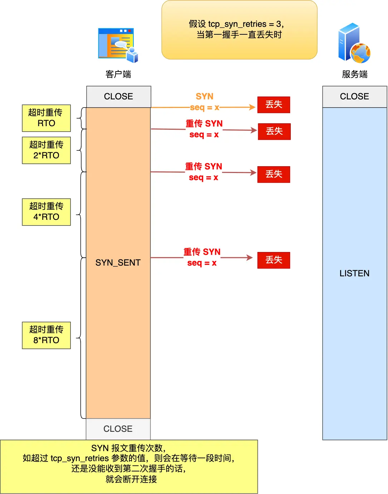
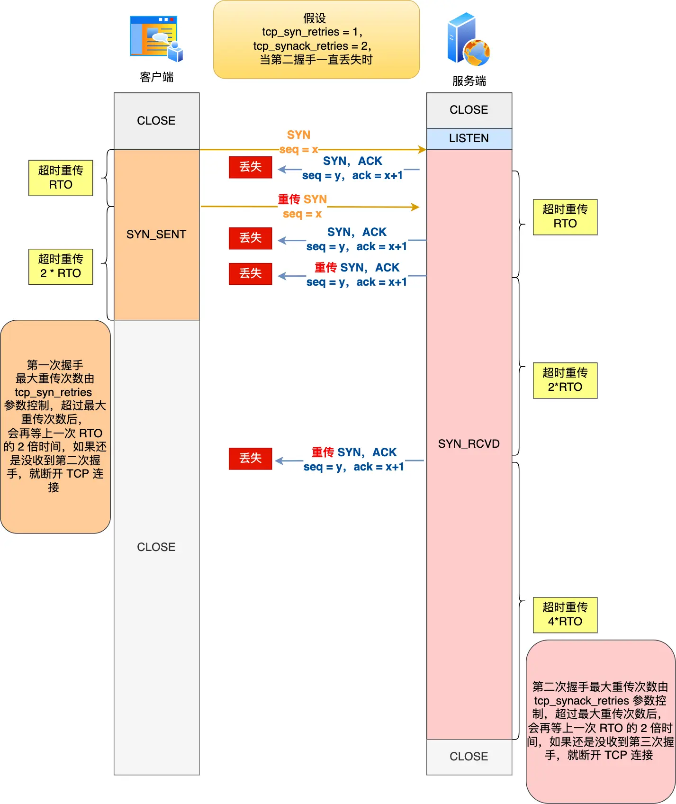
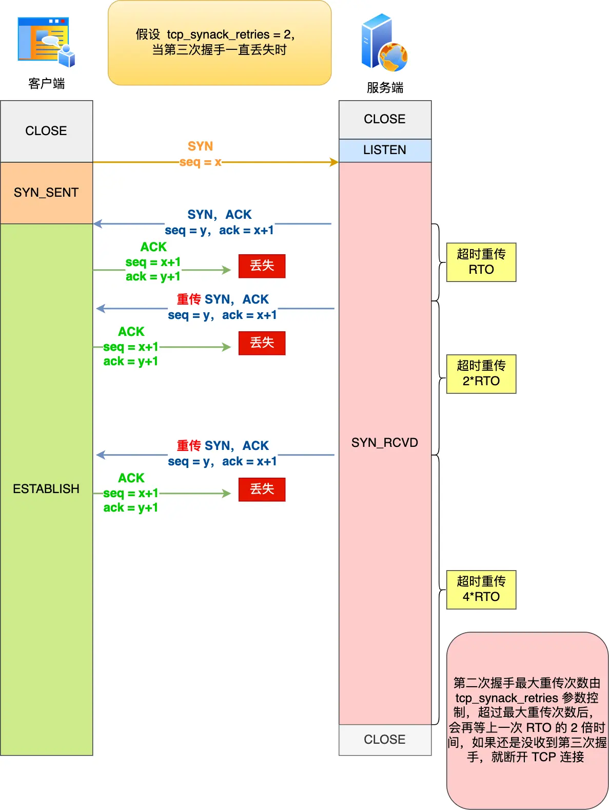
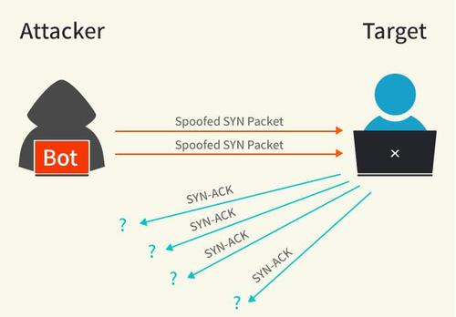
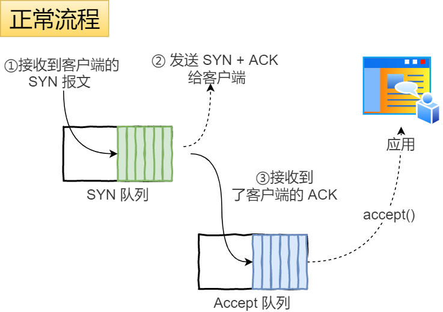
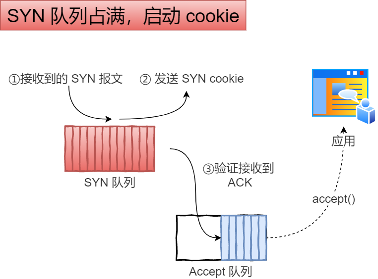

# TCP 三次握手期间异常，会发生什么？

## 复习三次握手

TCP 是面向连接的协议，所以使用 TCP 前必须先建立连接，而**建立连接是通过三次握手来进行的**。三次握手的过程如下图：

<div style="text-align: center;">
  <svg id="SvgjsSvg1008" width="608" height="445" xmlns="http://www.w3.org/2000/svg" version="1.1" xmlns:xlink="http://www.w3.org/1999/xlink" xmlns:svgjs="http://svgjs.com/svgjs"><defs id="SvgjsDefs1007"><marker id="SvgjsMarker1059" markerWidth="14" markerHeight="10" refX="10" refY="5" viewBox="0 0 14 10" orient="auto" markerUnits="userSpaceOnUse" stroke-dasharray="0,0"><path id="SvgjsPath1060" d="M0,0 L14,5 L0,10 L0,0" fill="#323232" stroke="#323232" stroke-width="1"></path></marker><marker id="SvgjsMarker1067" markerWidth="14" markerHeight="10" refX="10" refY="5" viewBox="0 0 14 10" orient="auto" markerUnits="userSpaceOnUse" stroke-dasharray="0,0"><path id="SvgjsPath1068" d="M0,0 L14,5 L0,10 L0,0" fill="#323232" stroke="#323232" stroke-width="1"></path></marker><marker id="SvgjsMarker1075" markerWidth="14" markerHeight="10" refX="10" refY="5" viewBox="0 0 14 10" orient="auto" markerUnits="userSpaceOnUse" stroke-dasharray="0,0"><path id="SvgjsPath1076" d="M0,0 L14,5 L0,10 L0,0" fill="#323232" stroke="#323232" stroke-width="1"></path></marker><marker id="SvgjsMarker1083" markerWidth="14" markerHeight="10" refX="4" refY="5" viewBox="0 0 14 10" orient="auto" markerUnits="userSpaceOnUse" stroke-dasharray="0,0"><path id="SvgjsPath1084" d="M14,0 L0,5 L14,10 L14,0" fill="#323232" stroke="#323232" stroke-width="1"></path></marker><marker id="SvgjsMarker1085" markerWidth="14" markerHeight="10" refX="10" refY="5" viewBox="0 0 14 10" orient="auto" markerUnits="userSpaceOnUse" stroke-dasharray="0,0"><path id="SvgjsPath1086" d="M0,0 L14,5 L0,10 L0,0" fill="#323232" stroke="#323232" stroke-width="1"></path></marker></defs><g id="SvgjsG1008" transform="translate(25,65)"><path id="SvgjsPath1009" d="M0 0L140 0L140 40.00773364 L0 40.00773364Z" stroke="rgba(102, 102, 102,1)" stroke-width="1" fill-opacity="1" fill="#ffffff"></path><path id="SvgjsPath1010" d="M0 40.00773364L140 40.00773364L140 193.04530216 L0 193.04530216Z" stroke="rgba(102, 102, 102,1)" stroke-width="1" fill-opacity="1" fill="#ffffff"></path><path id="SvgjsPath1011" d="M0 193.00980284L140 193.00980284L140 354.9932 L0 354.9932Z" stroke="rgba(102, 102, 102,1)" stroke-width="1" fill-opacity="1" fill="#ffffff"></path><g id="SvgjsG1012"><text id="SvgjsText1013" font-family="微软雅黑" text-anchor="middle" font-size="16px" width="140px" fill="#323232" font-weight="400" align="middle" lineHeight="125%" anchor="middle" family="微软雅黑" size="16px" weight="400" font-style="" opacity="1" y="6.003866819999999" transform="rotate(0)"><tspan id="SvgjsTspan1014" dy="20" x="70"><tspan id="SvgjsTspan1015" style="text-decoration:;">CLOSED</tspan></tspan></text></g><g id="SvgjsG1016"><text id="SvgjsText1017" font-family="微软雅黑" text-anchor="middle" font-size="16px" width="140px" fill="#323232" font-weight="400" align="middle" lineHeight="125%" anchor="middle" family="微软雅黑" size="16px" weight="400" font-style="" opacity="1" y="102.5265179" transform="rotate(0)"><tspan id="SvgjsTspan1018" dy="20" x="70"><tspan id="SvgjsTspan1019" style="text-decoration:;">SYN_SENT</tspan></tspan></text></g><g id="SvgjsG1020"><text id="SvgjsText1021" font-family="微软雅黑" text-anchor="middle" font-size="16px" width="140px" fill="#323232" font-weight="400" align="middle" lineHeight="125%" anchor="middle" family="微软雅黑" size="16px" weight="400" font-style="" opacity="1" y="260.00150142" transform="rotate(0)"><tspan id="SvgjsTspan1022" dy="20" x="70"><tspan id="SvgjsTspan1023" style="text-decoration:;">ESTABLISHED</tspan></tspan></text></g></g><g id="SvgjsG1024" transform="translate(443,65)"><path id="SvgjsPath1025" d="M0 0L140 0L140 40.01570307 L0 40.01570307Z" stroke="rgba(102, 102, 102,1)" stroke-width="1" fill-opacity="1" fill="#ffffff"></path><path id="SvgjsPath1026" d="M0 40.01570307L140 40.01570307L140 83.02290549 L0 83.02290549Z" stroke="rgba(102, 102, 102,1)" stroke-width="1" fill-opacity="1" fill="#ffffff"></path><path id="SvgjsPath1027" d="M0 83.02290549L140 83.02290549L140 244.98619971 L0 244.98619971Z" stroke="rgba(102, 102, 102,1)" stroke-width="1" fill-opacity="1" fill="#ffffff"></path><path id="SvgjsPath1028" d="M0 244.98619971000002L140 244.98619971000002L140 351.9411 L0 351.9411Z" stroke="rgba(102, 102, 102,1)" stroke-width="1" fill-opacity="1" fill="#ffffff"></path><g id="SvgjsG1029"><text id="SvgjsText1030" font-family="微软雅黑" text-anchor="middle" font-size="16px" width="140px" fill="#323232" font-weight="400" align="middle" lineHeight="125%" anchor="middle" family="微软雅黑" size="16px" weight="400" font-style="" opacity="1" y="6.007851535" transform="rotate(0)"><tspan id="SvgjsTspan1031" dy="20" x="70"><tspan id="SvgjsTspan1032" style="text-decoration:;">CLOSED</tspan></tspan></text></g><g id="SvgjsG1033"><text id="SvgjsText1034" font-family="微软雅黑" text-anchor="middle" font-size="16px" width="140px" fill="#323232" font-weight="400" align="middle" lineHeight="125%" anchor="middle" family="微软雅黑" size="16px" weight="400" font-style="" opacity="1" y="47.51930428" transform="rotate(0)"><tspan id="SvgjsTspan1035" dy="20" x="70"><tspan id="SvgjsTspan1036" style="text-decoration:;">LISTEN</tspan></tspan></text></g><g id="SvgjsG1037"><text id="SvgjsText1038" font-family="微软雅黑" text-anchor="middle" font-size="16px" width="140px" fill="#323232" font-weight="400" align="middle" lineHeight="125%" anchor="middle" family="微软雅黑" size="16px" weight="400" font-style="" opacity="1" y="150.0045526" transform="rotate(0)"><tspan id="SvgjsTspan1039" dy="20" x="70"><tspan id="SvgjsTspan1040" style="text-decoration:;">SYN_RCVD</tspan></tspan></text></g><g id="SvgjsG1041"><text id="SvgjsText1042" font-family="微软雅黑" text-anchor="middle" font-size="16px" width="140px" fill="#323232" font-weight="400" align="middle" lineHeight="125%" anchor="middle" family="微软雅黑" size="16px" weight="400" font-style="" opacity="1" y="284.463649855" transform="rotate(0)"><tspan id="SvgjsTspan1043" dy="20" x="70"><tspan id="SvgjsTspan1044" style="text-decoration:;">ESTABLISHED</tspan></tspan></text></g></g><g id="SvgjsG1045" transform="translate(34,25)"><path id="SvgjsPath1046" d="M 0 0L 120 0L 120 40L 0 40Z" stroke="none" fill="none"></path><g id="SvgjsG1047"><text id="SvgjsText1048" font-family="微软雅黑" text-anchor="middle" font-size="16px" width="120px" fill="#323232" font-weight="400" align="middle" lineHeight="125%" anchor="middle" family="微软雅黑" size="16px" weight="400" font-style="" opacity="1" y="6" transform="rotate(0)"><tspan id="SvgjsTspan1049" dy="20" x="60"><tspan id="SvgjsTspan1050" style="text-decoration:;">客户端</tspan></tspan></text></g></g><g id="SvgjsG1051" transform="translate(454,25)"><path id="SvgjsPath1052" d="M 0 0L 120 0L 120 40L 0 40Z" stroke="none" fill="none"></path><g id="SvgjsG1053"><text id="SvgjsText1054" font-family="微软雅黑" text-anchor="middle" font-size="16px" width="120px" fill="#323232" font-weight="400" align="middle" lineHeight="125%" anchor="middle" family="微软雅黑" size="16px" weight="400" font-style="" opacity="1" y="6" transform="rotate(0)"><tspan id="SvgjsTspan1055" dy="20" x="60"><tspan id="SvgjsTspan1056" style="text-decoration:;">服务端</tspan></tspan></text></g></g><g id="SvgjsG1057"><path id="SvgjsPath1058" d="M165.49438963502843 105.0746919592489L439.93478426282365 146.5369098526568" stroke="#323232" stroke-width="2" fill="none" marker-end="url(#SvgjsMarker1059)"></path><rect id="SvgjsRect1061" width="71" height="16" x="267.214586948926" y="117.80580090595285" fill="#ffffff"></rect><text id="SvgjsText1062" font-family="微软雅黑" text-anchor="middle" font-size="13px" width="71px" fill="#323232" font-weight="400" align="top" lineHeight="16px" anchor="middle" family="微软雅黑" size="13px" weight="400" font-style="" opacity="1" y="115.18080090595285" transform="rotate(0)"><tspan id="SvgjsTspan1063" dy="16" x="302.714586948926"><tspan id="SvgjsTspan1064" style="text-decoration:;">SYN, seq=x</tspan></tspan></text></g><g id="SvgjsG1065"><path id="SvgjsPath1066" d="M442.5322515933258 151.1766675636719L167.9000401213799 254.9046611052342" stroke="#323232" stroke-width="2" fill="none" marker-end="url(#SvgjsMarker1067)"></path><rect id="SvgjsRect1069" width="165" height="16" x="222.71614585735284" y="195.04066433445306" fill="#ffffff"></rect><text id="SvgjsText1070" font-family="微软雅黑" text-anchor="middle" font-size="13px" width="165px" fill="#323232" font-weight="400" align="top" lineHeight="16px" anchor="middle" family="微软雅黑" size="13px" weight="400" font-style="" opacity="1" y="192.41566433445306" transform="rotate(0)"><tspan id="SvgjsTspan1071" dy="16" x="305.21614585735284"><tspan id="SvgjsTspan1072" style="text-decoration:;">SYN, ACK, seq=y, ack=x+1</tspan></tspan></text></g><g id="SvgjsG1073"><path id="SvgjsPath1074" d="M165.4917928161331 259.09022098425464L439.9508845399748 309.44062989762125" stroke="#323232" stroke-width="2" fill="none" marker-end="url(#SvgjsMarker1075)"></path><rect id="SvgjsRect1077" width="150" height="16" x="227.72133867805394" y="276.265425440938" fill="#ffffff"></rect><text id="SvgjsText1078" font-family="微软雅黑" text-anchor="middle" font-size="13px" width="150px" fill="#323232" font-weight="400" align="top" lineHeight="16px" anchor="middle" family="微软雅黑" size="13px" weight="400" font-style="" opacity="1" y="273.640425440938" transform="rotate(0)"><tspan id="SvgjsTspan1079" dy="16" x="302.72133867805394"><tspan id="SvgjsTspan1080" style="text-decoration:;">ACK, seq=x+1, ack=y+1</tspan></tspan></text></g><g id="SvgjsG1081"><path id="SvgjsPath1082" d="M168.10000000000002 395L439.9 395" stroke="#323232" stroke-width="2" fill="none" marker-start="url(#SvgjsMarker1083)" marker-end="url(#SvgjsMarker1085)"></path><rect id="SvgjsRect1087" width="52" height="16" x="278" y="387" fill="#ffffff"></rect><text id="SvgjsText1088" font-family="微软雅黑" text-anchor="middle" font-size="13px" width="52px" fill="#323232" font-weight="400" align="top" lineHeight="16px" anchor="middle" family="微软雅黑" size="13px" weight="400" font-style="" opacity="1" y="384.375" transform="rotate(0)"><tspan id="SvgjsTspan1089" dy="16" x="304"><tspan id="SvgjsTspan1090" style="text-decoration:;">数据传输</tspan></tspan></text></g></svg>
  <p style="text-align: center; color: #888;">（三次握手）</p>
</div>

一开始，客户端和服务端都处于 `CLOSED` 状态。先是服务端主动监听某个端口，处于 `LISTEN` 状态。

* **第一次握手**：
  * 客户端随机初始化序号，将此序号置于 TCP 首部的「序号」字段中，同时把 `SYN` 标志位置为 `1` ，表示发起连接的报文。接着把第一个 `SYN` 报文发送给服务端，表示向服务端发起连接，该报文不包含应用层数据，之后客户端处于 `SYN_SENT` 状态。
* **第二次握手**：
  * 服务端收到客户端的 `SYN` 报文后，首先服务端也随机初始化自己的序号，将此序号填入 TCP 首部的「序号」字段中（`seq=y`），其次把 TCP 首部的「确认应答号」字段填入（`ack=x+1`），接着把 `SYN` 和 `ACK` 标志位置为 `1`。最后把该报文发给客户端，该报文也不包含应用层数据，之后服务端处于 `SYN_RCVD` 状态。
* **第三次握手**：
  * 客户端收到服务端报文后，还要向服务端回应最后一个应答报文，首先该应答报文 TCP 首部 `ACK` 标志位置为 `1`，其次「确认应答号」字段填入 `y+1`（即 `ack=y+1`），最后把报文发送给服务端，这次报文可以携带客户到服务器的数据，之后客户端处于 `ESTABLISHED` 状态。
  * 服务器收到客户端的应答报文后，也进入 `ESTABLISHED` 状态，因为它也一发一收成功了。

从上面的过程可以发现**第三次握手是可以携带数据的，前两次握手是不可以携带数据的**，这也是面试常问的题。

一旦完成三次握手，双方都处于 `ESTABLISHED` 状态，此时连接就已建立完成，客户端和服务端就可以相互发送数据了。

但是如果在三次握手的过程中，发生了异常，会怎么样呢？下面分情况来讨论。

## 第一次握手丢失了，会发生什么？

当客户端想和服务端建立 TCP 连接的时候，首先第一个发的就是 SYN 报文，然后进入到 `SYN_SENT` 状态。

在这之后，如果客户端迟迟收不到服务端的 SYN-ACK 报文（第二次握手），就会触发「超时重传」机制，重传 SYN 报文，而且**重传的 SYN 报文的序列号都是一样的**。

对于超时时间，不同版本的操作系统可能不同，有的 1 秒的，也有 3 秒的，这个超时时间是写死在内核里的，如果想要更改则需要重新编译内核，比较麻烦。

当客户端在 1 秒后没收到服务端的 SYN-ACK 报文后，客户端就会重发 SYN 报文，那到底重发几次呢？

在 Linux 里，客户端的 SYN 报文最大重传次数由 `tcp_syn_retries` 内核参数控制，这个参数是可以自定义的，默认值一般是 5。

```bash
# cat /proc/sys/net/ipv4/tcp_syn_retries
5
```

通常，第一次超时重传是在 1 秒后，第二次超时重传是在 2 秒，第三次超时重传是在 4 秒后，第四次超时重传是在 8 秒后，第五次是在超时重传 16 秒后。没错，**每次超时的时间是上一次的 2 倍**。

当第五次超时重传后，会继续等待 32 秒，如果服务端仍然没有回应 ACK，客户端就不再发送 SYN 包，然后断开 TCP 连接。

所以，总耗时是 1+2+4+8+16+32=63 秒，大约 1 分钟左右。

举个例子，假设 `tcp_syn_retries` 参数值为 3，那么当客户端的 SYN 报文一直在网络中丢失时，会发生下图的过程：

<div style="text-align: center;">
  
  <p style="text-align: center; color: #888;">（第一次握手丢失）</p>
</div>

具体过程：

* 当客户端超时重传 3 次 SYN 报文后，由于 `tcp_syn_retries` 为 3，已达到最大重传次数，于是再等待一段时间（时间为上一次超时时间的 2 倍），如果还是没能收到服务端的第二次握手（SYN-ACK 报文），那么客户端就会断开连接。

## 第二次握手丢失了，会发生什么？

当服务端收到客户端的第一次握手后，就会回 SYN-ACK 报文给客户端，这个就是第二次握手，此时服务端会进入 `SYN_RCVD` 状态。

第二次握手的 SYN-ACK 报文其实有两个目的：

* 第二次握手里的 ACK， 是对第一次握手的确认报文；
* 第二次握手里的 SYN，是服务端发起建立 TCP 连接的报文；

所以，如果第二次握手丢了，就会发生比较有意思的事情，具体会怎么样呢？

因为第二次握手报文里是包含对客户端的第一次握手的 ACK 确认报文，所以，如果客户端迟迟没有收到第二次握手，那么客户端就觉得可能自己的 SYN 报文（第一次握手）丢失了，于是**客户端就会触发超时重传机制，重传 SYN 报文**。

然后，因为第二次握手中包含服务端的 SYN 报文，所以当客户端收到后，需要给服务端发送 ACK 确认报文（第三次握手），服务端才会认为该 SYN 报文被客户端收到了。

那么，如果第二次握手丢失了，服务端就收不到第三次握手，于是服务端这边会触发超时重传机制，重传 SYN-ACK 报文。

因此，当第二次握手丢失了，**客户端和服务端都会重传**：

* 客户端会重传 SYN 报文，也就是第一次握手，最大重传次数由 `tcp_syn_retries` 内核参数决定；
* 服务端会重传 SYN-ACK 报文，也就是第二次握手，最大重传次数由 `tcp_synack_retries` 内核参数决定。

在 Linux 下，SYN-ACK 报文的最大重传次数由 `tcp_synack_retries` 内核参数决定，默认值是 5。

```bash
# cat /proc/sys/net/ipv4/tcp_synack_retries
5
```

举个例子，假设 `tcp_syn_retries` 参数值为 1，`tcp_synack_retries` 参数值为 2，那么当第二次握手一直丢失时，发生的过程如下图：

<div style="text-align: center;">
  
  <p style="text-align: center; color: #888;">（第二次握手丢失）</p>
</div>

具体过程：

* 当客户端超时重传 1 次 SYN 报文后，由于 `tcp_syn_retries` 为 1，已达到最大重传次数，于是再等待一段时间（时间为上一次超时时间的 2 倍），如果还是没能收到服务端的第二次握手（SYN-ACK 报文），那么客户端就会断开连接。
* 当服务端超时重传 2 次 SYN-ACK 报文后，由于 `tcp_synack_retries` 为 2，已达到最大重传次数，于是再等待一段时间（时间为上一次超时时间的 2 倍），如果还是没能收到客户端的第三次握手（ACK 报文），那么服务端就会断开连接。

## 第三次握手丢失了，会发生什么？

客户端收到服务端的 SYN-ACK 报文后，就会给服务端回一个 ACK 报文，也就是第三次握手，此时客户端状态进入到 `ESTABLISH` 状态。

因为这个第三次握手的 ACK 是对第二次握手的 SYN 的确认报文，所以当第三次握手丢失了，如果服务端那一方迟迟收不到这个确认报文，就会触发超时重传机制，重传 SYN-ACK 报文，直到收到第三次握手，或者达到最大重传次数。

注意，**ACK 报文是不会有重传的，当 ACK 丢失了，就由对方重传对应的报文**。

举个例子，假设 `tcp_synack_retries` 参数值为 2，那么当第三次握手一直丢失时，发生的过程如下图：

<div style="text-align: center;">
  
  <p style="text-align: center; color: #888;">（第三次握手丢失）</p>
</div>

具体过程：

* 当服务端超时重传 2 次 SYN-ACK 报文后，由于 `tcp_synack_retries` 为 2，已达到最大重传次数，于是再等待一段时间（时间为上一次超时时间的 2 倍），如果还是没能收到客户端的第三次握手（ACK 报文），那么服务端就会断开连接。

## 关于 SYN 攻击

### 什么是 SYN 攻击

我们都知道 TCP 连接建立是需要三次握手，假设攻击者短时间伪造不同 IP 地址的 `SYN` 报文，服务端每接收到一个 `SYN` 报文，就进入 `SYN_RCVD` 状态，但服务端发送出去的 `SYN-ACK` 报文，无法得到未知 IP 主机的 `ACK` 应答，久而久之就会**占满服务端的半连接队列**，使得服务器不能为正常用户服务。

<div style="text-align: center;">
  
  <p style="text-align: center; color: #888;">（SYN 攻击）</p>
</div>

下面先来看一下什么是 TCP 半连接和全连接队列。

### 半连接和全连接队列

在 TCP 三次握手的时候，Linux 内核会维护两个队列，分别是：

* 半连接队列，也称 SYN 队列。
* 全连接队列，也称 Accpet 队列。

先来看下 Linux 内核的 `SYN` 队列（半连接队列）与 `Accpet` 队列（全连接队列）是如何工作的？

<div style="text-align: center;">
  
  <p style="text-align: center; color: #888;">（SYN 队列 和 Accpet 队列正常流程）</p>
</div>

正常流程：

* 当服务端接收到客户端的 SYN 报文时，会创建一个半连接的对象，然后将其加入到内核的「SYN 队列」。
* 接着发送 SYN-ACK 给客户端，等待客户端回应 ACK 报文。
* 服务端接收到 ACK 报文后，从「SYN 队列」取出一个半连接对象，然后创建一个新的连接对象放入到「Accept 队列」。
* 应用通过调用 `accpet()` socket 接口，从「Accept 队列」取出连接对象。

不管是半连接队列还是全连接队列，都有最大长度限制，超过限制时，默认情况都会丢弃报文。

SYN 攻击方式最直接的表现就是把 TCP 半连接队列打满，这样**当 TCP 半连接队列满了，后续再收到 SYN 报文就会丢弃**，导致客户端无法和服务端建立连接。

### 避免 SYN 攻击方式

避免 SYN 攻击方式，可以有以下四种方法：

* 调大 `netdev_max_backlog`
* 增大 TCP 半连接队列
* 开启 `tcp_syncookies`
* 减少 SYN-ACK 重传次数

#### 1）方式一：调大 `netdev_max_backlog`

当网卡接收数据包的速度大于内核处理的速度时，会有一个队列保存这些数据包。控制该队列的最大值如下参数，默认值是 1000，我们要适当调大该参数的值，比如设置为 10000：

```bash
net.core.netdev_max_backlog = 10000
```

#### 2）方式二：增大 TCP 半连接队列

增大 TCP 半连接队列，要同时增大下面这三个参数：

* 增大 `net.ipv4.tcp_max_syn_backlog`
* 增大 `listen()` 函数中的 `backlog`
* 增大 `net.core.somaxconn`

具体为什么是这三个参数决定 TCP 半连接队列的大小，这里暂不深入研究。

#### 3）方式三：开启 `net.ipv4.tcp_syncookies`

开启 syncookies 功能就可以在不使用 SYN 半连接队列的情况下成功建立连接，相当于绕过了 SYN 半连接来建立连接。

<div style="text-align: center;">
  
  <p style="text-align: center; color: #888;">（SYN 队列占满，启动 cookie）</p>
</div>

具体过程：

* 当「SYN 队列」满之后，后续服务器收到 SYN 包，不会丢弃，而是根据算法，计算出一个 cookie 值。
* 将 cookie 值放到第二次握手报文的「序列号」里，然后服务端回第二次握手给客户端。
* 服务端接收到客户端的应答报文时，服务器会检查这个 ACK 包的合法性。如果合法，将该连接对象放入到「Accept 队列」。
* 最后应用程序通过调用 `accpet()` 接口，从「Accept 队列」取出的连接。

可以看到，当开启了 `tcp_syncookies` 了，即使受到 SYN 攻击而导致 SYN 队列满时，也能保证正常的连接成功建立。

`net.ipv4.tcp_syncookies` 参数主要有以下三个值：

* `0` 值，表示关闭该功能。
* `1` 值，表示仅当 SYN 半连接队列放不下时，再启用它。
* `2` 值，表示无条件开启功能。

那么在应对 SYN 攻击时，只需要设置为 `1` 即可：

```bash
$ echo 1 > /proc/sys/net/ipv4/tcp_syncookies
```

#### 4）减少 SYN-ACK 重传次数

当服务端受到 SYN 攻击时，就会有大量处于 `SYN_REVC` 状态的 TCP 连接，处于这个状态的 TCP 会重传 SYN-ACK ，当重传超过次数达到上限后，就会断开连接。

那么针对 SYN 攻击的场景，我们可以减少 SYN-ACK 的重传次数，以加快处于 `SYN_REVC` 状态的 TCP 连接断开。

SYN-ACK 报文的最大重传次数由 `tcp_synack_retries` 内核参数决定（默认值是 5 次），比如将 `tcp_synack_retries` 减少到 2 次：

```bash
$ echo 2 > /proc/sys/net/ipv4/tcp_synack_retries
```

（完）
