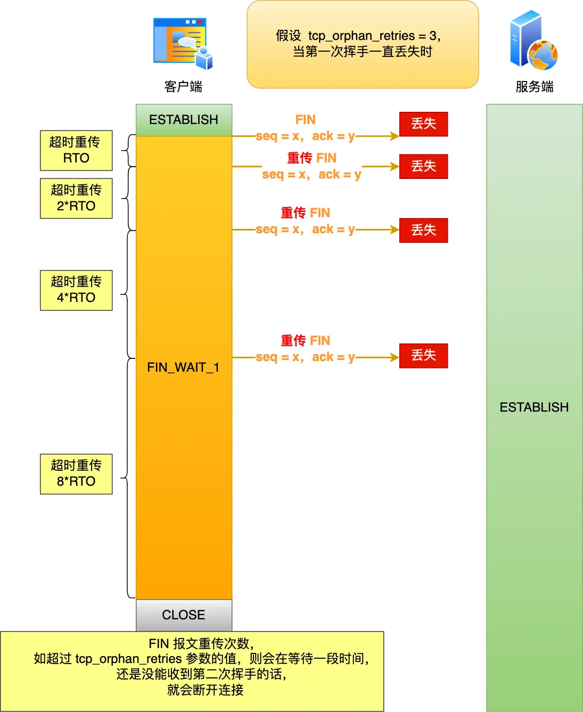
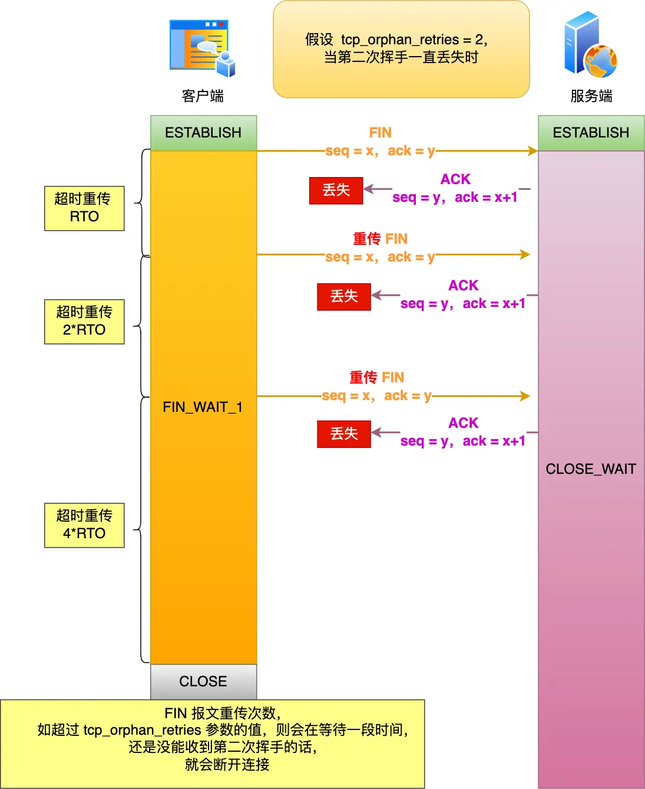
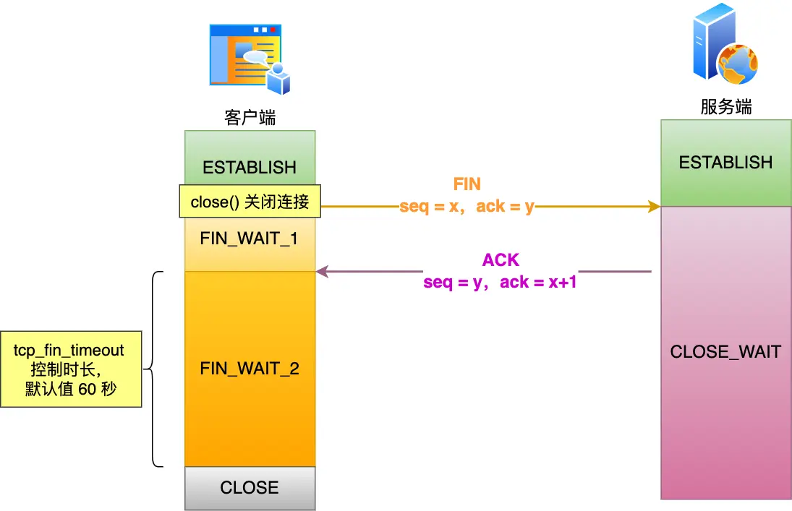
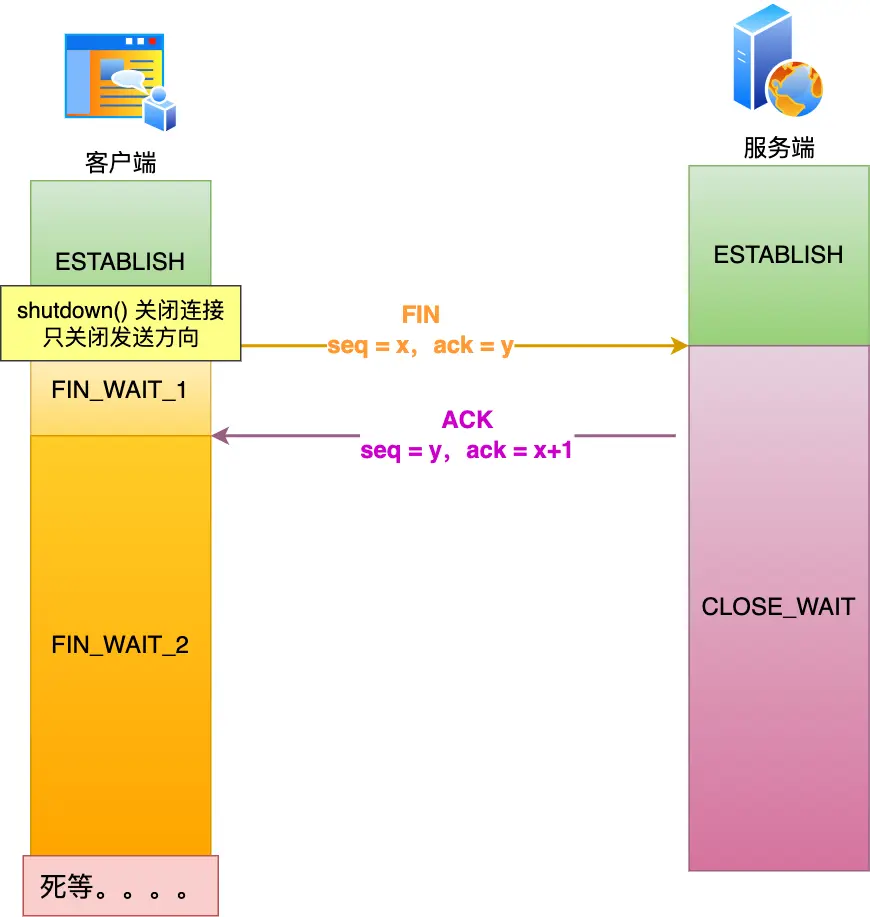
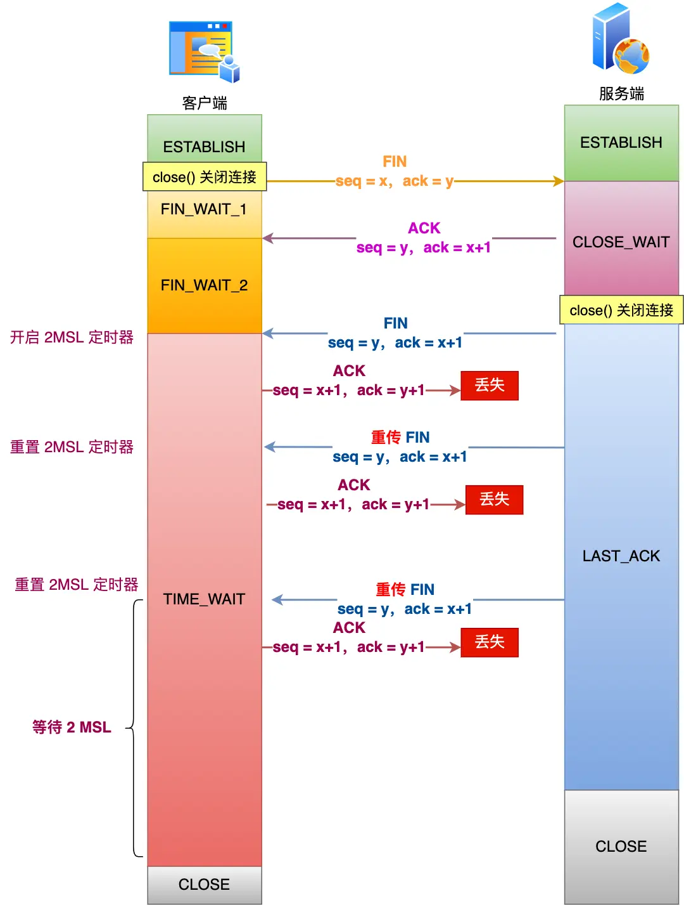

# TCP 四次挥手期间异常，会发生什么？

## 复习四次挥手

TCP 断开连接是通过**四次挥手**方式。

双方都可以主动断开连接，断开连接后主机中的「资源」将被释放，四次挥手的过程如下图：

<div style="text-align: center;">
  <svg id="SvgjsSvg1009" width="610.0000305175781" height="550" xmlns="http://www.w3.org/2000/svg" version="1.1" xmlns:xlink="http://www.w3.org/1999/xlink" xmlns:svgjs="http://svgjs.com/svgjs"><defs id="SvgjsDefs1007"><marker id="SvgjsMarker1071" markerWidth="14" markerHeight="10" refX="4" refY="5" viewBox="0 0 14 10" orient="auto" markerUnits="userSpaceOnUse" stroke-dasharray="0,0"><path id="SvgjsPath1072" d="M14,0 L0,5 L14,10 L14,0" fill="#323232" stroke="#323232" stroke-width="1"></path></marker><marker id="SvgjsMarker1073" markerWidth="14" markerHeight="10" refX="10" refY="5" viewBox="0 0 14 10" orient="auto" markerUnits="userSpaceOnUse" stroke-dasharray="0,0"><path id="SvgjsPath1074" d="M0,0 L14,5 L0,10 L0,0" fill="#323232" stroke="#323232" stroke-width="1"></path></marker><marker id="SvgjsMarker1081" markerWidth="14" markerHeight="10" refX="10" refY="5" viewBox="0 0 14 10" orient="auto" markerUnits="userSpaceOnUse" stroke-dasharray="0,0"><path id="SvgjsPath1082" d="M0,0 L14,5 L0,10 L0,0" fill="#323232" stroke="#323232" stroke-width="1"></path></marker><marker id="SvgjsMarker1089" markerWidth="14" markerHeight="10" refX="10" refY="5" viewBox="0 0 14 10" orient="auto" markerUnits="userSpaceOnUse" stroke-dasharray="0,0"><path id="SvgjsPath1090" d="M0,0 L14,5 L0,10 L0,0" fill="#323232" stroke="#323232" stroke-width="1"></path></marker><marker id="SvgjsMarker1097" markerWidth="14" markerHeight="10" refX="10" refY="5" viewBox="0 0 14 10" orient="auto" markerUnits="userSpaceOnUse" stroke-dasharray="0,0"><path id="SvgjsPath1098" d="M0,0 L14,5 L0,10 L0,0" fill="#323232" stroke="#323232" stroke-width="1"></path></marker><marker id="SvgjsMarker1105" markerWidth="14" markerHeight="10" refX="10" refY="5" viewBox="0 0 14 10" orient="auto" markerUnits="userSpaceOnUse" stroke-dasharray="0,0"><path id="SvgjsPath1106" d="M0,0 L14,5 L0,10 L0,0" fill="#323232" stroke="#323232" stroke-width="1"></path></marker></defs><g id="SvgjsG1008" transform="translate(25.000015258789062,65)"><path id="SvgjsPath1009" d="M0 0L140 0L140 40.01641559999999 L0 40.01641559999999Z" stroke="rgba(102, 102, 102,1)" stroke-width="1" fill-opacity="1" fill="#ffffff"></path><path id="SvgjsPath1010" d="M0 40.01641559999999L140 40.01641559999999L140 193.04470835999996 L0 193.04470835999996Z" stroke="rgba(102, 102, 102,1)" stroke-width="1" fill-opacity="1" fill="#ffffff"></path><path id="SvgjsPath1011" d="M0 193.04470835999996L140 193.04470835999996L140 253.02333587999993 L0 253.02333587999993Z" stroke="rgba(102, 102, 102,1)" stroke-width="1" fill-opacity="1" fill="#ffffff"></path><path id="SvgjsPath1012" d="M0 253.02333587999996L140 253.02333587999996L140 414.97482935999994 L0 414.97482935999994Z" stroke="rgba(102, 102, 102,1)" stroke-width="1" fill-opacity="1" fill="#ffffff"></path><path id="SvgjsPath1013" d="M0 414.9748293599999L140 414.9748293599999L140 459.9587999999999 L0 459.9587999999999Z" stroke="rgba(102, 102, 102,1)" stroke-width="1" fill-opacity="1" fill="#ffffff"></path><g id="SvgjsG1014"><text id="SvgjsText1015" font-family="微软雅黑" text-anchor="middle" font-size="16px" width="140px" fill="#323232" font-weight="400" align="middle" lineHeight="125%" anchor="middle" family="微软雅黑" size="16px" weight="400" font-style="" opacity="1" y="6.008207799999994" transform="rotate(0)"><tspan id="SvgjsTspan1016" dy="20" x="70"><tspan id="SvgjsTspan1017" style="text-decoration:;">ESTABLISHED</tspan></tspan></text></g><g id="SvgjsG1018"><text id="SvgjsText1019" font-family="微软雅黑" text-anchor="middle" font-size="16px" width="140px" fill="#323232" font-weight="400" align="middle" lineHeight="125%" anchor="middle" family="微软雅黑" size="16px" weight="400" font-style="" opacity="1" y="102.53056197999997" transform="rotate(0)"><tspan id="SvgjsTspan1020" dy="20" x="70"><tspan id="SvgjsTspan1021" style="text-decoration:;">FIN_WAIT_1</tspan></tspan></text></g><g id="SvgjsG1022"><text id="SvgjsText1023" font-family="微软雅黑" text-anchor="middle" font-size="16px" width="140px" fill="#323232" font-weight="400" align="middle" lineHeight="125%" anchor="middle" family="微软雅黑" size="16px" weight="400" font-style="" opacity="1" y="209.03402211999995" transform="rotate(0)"><tspan id="SvgjsTspan1024" dy="20" x="70"><tspan id="SvgjsTspan1025" style="text-decoration:;">FIN_WAIT_2</tspan></tspan></text></g><g id="SvgjsG1026"><text id="SvgjsText1027" font-family="微软雅黑" text-anchor="middle" font-size="16px" width="140px" fill="#323232" font-weight="400" align="middle" lineHeight="125%" anchor="middle" family="微软雅黑" size="16px" weight="400" font-style="" opacity="1" y="309.99908261999997" transform="rotate(0)"><tspan id="SvgjsTspan1028" dy="20" x="70"><tspan id="SvgjsTspan1029" style="text-decoration:;">TIME_WAIT</tspan></tspan><tspan id="SvgjsTspan1030" dy="20" x="70"><tspan id="SvgjsTspan1031" style="text-decoration:;">（等待 2MSL）</tspan></tspan></text></g><g id="SvgjsG1032"><text id="SvgjsText1033" font-family="微软雅黑" text-anchor="middle" font-size="16px" width="140px" fill="#323232" font-weight="400" align="middle" lineHeight="125%" anchor="middle" family="微软雅黑" size="16px" weight="400" font-style="" opacity="1" y="423.46681467999986" transform="rotate(0)"><tspan id="SvgjsTspan1034" dy="20" x="70"><tspan id="SvgjsTspan1035" style="text-decoration:;">CLOSED</tspan></tspan></text></g></g><g id="SvgjsG1036" transform="translate(35.00001525878906,25)"><path id="SvgjsPath1037" d="M 0 0L 120 0L 120 40L 0 40Z" stroke="none" fill="none"></path><g id="SvgjsG1038"><text id="SvgjsText1039" font-family="微软雅黑" text-anchor="middle" font-size="16px" width="120px" fill="#323232" font-weight="400" align="middle" lineHeight="125%" anchor="middle" family="微软雅黑" size="16px" weight="400" font-style="" opacity="1" y="6" transform="rotate(0)"><tspan id="SvgjsTspan1040" dy="20" x="60"><tspan id="SvgjsTspan1041" style="text-decoration:;">客户端</tspan></tspan></text></g></g><g id="SvgjsG1042" transform="translate(455.00001525878906,25)"><path id="SvgjsPath1043" d="M 0 0L 120 0L 120 40L 0 40Z" stroke="none" fill="none"></path><g id="SvgjsG1044"><text id="SvgjsText1045" font-family="微软雅黑" text-anchor="middle" font-size="16px" width="120px" fill="#323232" font-weight="400" align="middle" lineHeight="125%" anchor="middle" family="微软雅黑" size="16px" weight="400" font-style="" opacity="1" y="6" transform="rotate(0)"><tspan id="SvgjsTspan1046" dy="20" x="60"><tspan id="SvgjsTspan1047" style="text-decoration:;">服务端</tspan></tspan></text></g></g><g id="SvgjsG1048" transform="translate(445.00001525878906,65.49199999999996)"><path id="SvgjsPath1049" d="M0 0L140 0L140 120.95114467999998 L0 120.95114467999998Z" stroke="rgba(102, 102, 102,1)" stroke-width="1" fill-opacity="1" fill="#ffffff"></path><path id="SvgjsPath1050" d="M0 120.95114467999998L140 120.95114467999998L140 193.99812527999998 L0 193.99812527999998Z" stroke="rgba(102, 102, 102,1)" stroke-width="1" fill-opacity="1" fill="#ffffff"></path><path id="SvgjsPath1051" d="M0 193.99812527999998L140 193.99812527999998L140 411.94833259999996 L0 411.94833259999996Z" stroke="rgba(102, 102, 102,1)" stroke-width="1" fill-opacity="1" fill="#ffffff"></path><path id="SvgjsPath1052" d="M0 411.94833259999996L140 411.94833259999996L140 457.97479999999996 L0 457.97479999999996Z" stroke="rgba(102, 102, 102,1)" stroke-width="1" fill-opacity="1" fill="#ffffff"></path><g id="SvgjsG1053"><text id="SvgjsText1054" font-family="微软雅黑" text-anchor="middle" font-size="16px" width="140px" fill="#323232" font-weight="400" align="middle" lineHeight="125%" anchor="middle" family="微软雅黑" size="16px" weight="400" font-style="" opacity="1" y="46.47557233999999" transform="rotate(0)"><tspan id="SvgjsTspan1055" dy="20" x="70"><tspan id="SvgjsTspan1056" style="text-decoration:;">ESTABLISHED</tspan></tspan></text></g><g id="SvgjsG1057"><text id="SvgjsText1058" font-family="微软雅黑" text-anchor="middle" font-size="16px" width="140px" fill="#323232" font-weight="400" align="middle" lineHeight="125%" anchor="middle" family="微软雅黑" size="16px" weight="400" font-style="" opacity="1" y="143.47463498" transform="rotate(0)"><tspan id="SvgjsTspan1059" dy="20" x="70"><tspan id="SvgjsTspan1060" style="text-decoration:;">CLOSE_WAIT</tspan></tspan></text></g><g id="SvgjsG1061"><text id="SvgjsText1062" font-family="微软雅黑" text-anchor="middle" font-size="16px" width="140px" fill="#323232" font-weight="400" align="middle" lineHeight="125%" anchor="middle" family="微软雅黑" size="16px" weight="400" font-style="" opacity="1" y="288.97322893999996" transform="rotate(0)"><tspan id="SvgjsTspan1063" dy="20" x="70"><tspan id="SvgjsTspan1064" style="text-decoration:;">LAST_ACK</tspan></tspan></text></g><g id="SvgjsG1065"><text id="SvgjsText1066" font-family="微软雅黑" text-anchor="middle" font-size="16px" width="140px" fill="#323232" font-weight="400" align="middle" lineHeight="125%" anchor="middle" family="微软雅黑" size="16px" weight="400" font-style="" opacity="1" y="420.96156629999996" transform="rotate(0)"><tspan id="SvgjsTspan1067" dy="20" x="70"><tspan id="SvgjsTspan1068" style="text-decoration:;">CLOSED</tspan></tspan></text></g></g><g id="SvgjsG1069"><path id="SvgjsPath1070" d="M167.70000610351565 87L442.5000061035156 87" stroke="#323232" stroke-width="2" fill="none" marker-start="url(#SvgjsMarker1071)" marker-end="url(#SvgjsMarker1073)"></path><rect id="SvgjsRect1075" width="52" height="16" x="279.1000061035156" y="79" fill="#ffffff"></rect><text id="SvgjsText1076" font-family="微软雅黑" text-anchor="middle" font-size="13px" width="52px" fill="#323232" font-weight="400" align="top" lineHeight="16px" anchor="middle" family="微软雅黑" size="13px" weight="400" font-style="" opacity="1" y="76.375" transform="rotate(0)"><tspan id="SvgjsTspan1077" dy="16" x="305.1000061035156"><tspan id="SvgjsTspan1078" style="text-decoration:;">数据传输</tspan></tspan></text></g><g id="SvgjsG1079"><path id="SvgjsPath1080" d="M165.0808970237161 105.13690844703217L442.6184823982728 184.15116762840063" stroke="#323232" stroke-width="2" fill="none" marker-end="url(#SvgjsMarker1081)"></path><rect id="SvgjsRect1083" width="68" height="16" x="269.8496897109944" y="136.6440380377164" fill="#ffffff"></rect><text id="SvgjsText1084" font-family="微软雅黑" text-anchor="middle" font-size="13px" width="68px" fill="#323232" font-weight="400" align="top" lineHeight="16px" anchor="middle" family="微软雅黑" size="13px" weight="400" font-style="" opacity="1" y="134.0190380377164" transform="rotate(0)"><tspan id="SvgjsTspan1085" dy="16" x="303.8496897109944"><tspan id="SvgjsTspan1086" style="text-decoration:;">FIN, seq=p</tspan></tspan></text></g><g id="SvgjsG1087"><path id="SvgjsPath1088" d="M443.6000061035156 189L167.614308642806 255.27613523250017" stroke="#323232" stroke-width="2" fill="none" marker-end="url(#SvgjsMarker1089)"></path><rect id="SvgjsRect1091" width="89" height="16" x="261.1071573731608" y="214.13806761625008" fill="#ffffff"></rect><text id="SvgjsText1092" font-family="微软雅黑" text-anchor="middle" font-size="13px" width="89px" fill="#323232" font-weight="400" align="top" lineHeight="16px" anchor="middle" family="微软雅黑" size="13px" weight="400" font-style="" opacity="1" y="211.51306761625008" transform="rotate(0)"><tspan id="SvgjsTspan1093" dy="16" x="305.6071573731608"><tspan id="SvgjsTspan1094" style="text-decoration:;">ACK, ack=p+1</tspan></tspan></text></g><g id="SvgjsG1095"><path id="SvgjsPath1096" d="M445.11102863036683 259.10440800138406L167.63166643703818 318.35267039141866" stroke="#323232" stroke-width="2" fill="none" marker-end="url(#SvgjsMarker1097)"></path><rect id="SvgjsRect1099" width="164" height="16" x="224.37134753370253" y="280.72853919640136" fill="#ffffff"></rect><text id="SvgjsText1100" font-family="微软雅黑" text-anchor="middle" font-size="13px" width="164px" fill="#323232" font-weight="400" align="top" lineHeight="16px" anchor="middle" family="微软雅黑" size="13px" weight="400" font-style="" opacity="1" y="278.10353919640136" transform="rotate(0)"><tspan id="SvgjsTspan1101" dy="16" x="306.37134753370253"><tspan id="SvgjsTspan1102" style="text-decoration:;">FIN, ACK, seq=q, ack=p+1</tspan></tspan></text></g><g id="SvgjsG1103"><path id="SvgjsPath1104" d="M165.03715810374337 322.2426893666745L442.88966370210346 476.4953259266182" stroke="#323232" stroke-width="2" fill="none" marker-end="url(#SvgjsMarker1105)"></path><rect id="SvgjsRect1107" width="89" height="16" x="259.46341090292344" y="391.3690076466463" fill="#ffffff"></rect><text id="SvgjsText1108" font-family="微软雅黑" text-anchor="middle" font-size="13px" width="89px" fill="#323232" font-weight="400" align="top" lineHeight="16px" anchor="middle" family="微软雅黑" size="13px" weight="400" font-style="" opacity="1" y="388.7440076466463" transform="rotate(0)"><tspan id="SvgjsTspan1109" dy="16" x="303.96341090292344"><tspan id="SvgjsTspan1110" style="text-decoration:;">ACK, ack=q+1</tspan></tspan></text></g></svg>
  <p style="text-align: center; color: #888;">（四次挥手）</p>
</div>

一开始，客户端和服务端都处于 `ESTABLISHED` 状态，双方正常进行数据传输。

* **第一次挥手**：
  * 客户端打算关闭连接，此时会发送一个 TCP 首部 `FIN` 标志位被置为 `1` 的报文，也即 `FIN` 报文，之后客户端进入 `FIN_WAIT_1` 状态。
* **第二次挥手**：
  * 服务端收到该报文后，就向客户端发送 `ACK` 应答报文，接着服务端进入 `CLOSE_WAIT` 状态。
  * 客户端收到服务端的 `ACK` 应答报文后，之后进入 `FIN_WAIT_2` 状态。
* **第三次挥手**：
  * 等待服务端处理完数据后，也向客户端发送 `FIN` 报文，之后服务端进入 `LAST_ACK` 状态。
* **第四次挥手**：
  * 客户端收到服务端的 `FIN` 报文后，回一个 `ACK` 应答报文，之后进入 `TIME_WAIT` 状态。
  * 服务器收到了 `ACK` 应答报文后，就进入了 `CLOSE` 状态，至此服务端已经完成连接的关闭。
  * 客户端在经过 `2MSL` 一段时间后，自动进入 `CLOSE` 状态，至此客户端也完成连接的关闭。

可以看到，每个方向都需要**一个 `FIN` 和一个 `ACK`**，因此通常被称为**四次挥手**。

这里一点需要注意是：**主动关闭连接的，才有 `TIME_WAIT` 状态**。

但是如果在三次握手的过程中，发生了异常，会怎么样呢？下面分情况来讨论。

## 第一次挥手丢失了，会发生什么？

当客户端（主动关闭方）调用 close 函数后，就会向服务端发送 FIN 报文，试图与服务端断开连接，此时客户端的连接进入到 `FIN_WAIT_1` 状态。

正常情况下，如果能及时收到服务端（被动关闭方）的 ACK，则会很快变为 `FIN_WAIT2` 状态。

如果第一次挥手丢失了，那么客户端迟迟收不到被动方的 ACK 的话，也就会触发超时重传机制，重传 FIN 报文，重发次数由 `tcp_orphan_retries` 参数控制。

当客户端重传 FIN 报文的次数超过 `tcp_orphan_retries` 后，就不再发送 FIN 报文，则会在等待一段时间（时间为上一次超时时间的 2 倍），如果还是没能收到第二次挥手，那么直接进入到 `close` 状态。

举个例子，假设 `tcp_orphan_retries` 参数值为 3，当第一次挥手一直丢失时，发生的过程如下图：

<div style="text-align: center;">
  
  <p style="text-align: center; color: #888;">（第一次挥手丢失）</p>
</div>

具体过程：

* 当客户端超时重传 3 次 FIN 报文后，由于 `tcp_orphan_retries` 为 3，已达到最大重传次数，于是再等待一段时间（时间为上一次超时时间的 2 倍），如果还是没能收到服务端的第二次挥手（ACK 报文），那么客户端就会断开连接。

## 第二次挥手丢失了，会发生什么？

当服务端收到客户端的第一次挥手后，就会先回一个 ACK 确认报文，此时服务端的连接进入到 `CLOSE_WAIT` 状态。

在前面我们也提了，ACK 报文是不会重传的，所以如果服务端的第二次挥手丢失了，客户端就会触发超时重传机制，重传 FIN 报文，直到收到服务端的第二次挥手，或者达到最大的重传次数。

举个例子，假设 `tcp_orphan_retries` 参数值为 2，当第二次挥手一直丢失时，发生的过程如下图：

<div style="text-align: center;">
  
  <p style="text-align: center; color: #888;">（第二次挥手丢失）</p>
</div>

具体过程：

* 当客户端超时重传 2 次 FIN 报文后，由于 `tcp_orphan_retries` 为 2，已达到最大重传次数，于是再等待一段时间（时间为上一次超时时间的 2 倍），如果还是没能收到服务端的第二次挥手（ACK 报文），那么客户端就会断开连接。

这里提一下，当客户端收到第二次挥手，也就是收到服务端发送的 ACK 报文后，客户端就会处于 `FIN_WAIT2` 状态，在这个状态需要等服务端发送第三次挥手，也就是服务端的 FIN 报文。

对于 close 函数关闭的连接，由于无法再发送和接收数据，所以 `FIN_WAIT2` 状态不可以持续太久，而 `tcp_fin_timeout` 控制了这个状态下连接的持续时长，默认值是 60 秒。

这意味着对于调用 close 关闭的连接，如果在 60 秒后还没有收到 FIN 报文，客户端（主动关闭方）的连接就会直接关闭，如下图：

<div style="text-align: center;">
  
  <p style="text-align: center; color: #888;">（调用 close 关闭的连接）</p>
</div>

但是注意，如果主动关闭方使用 shutdown 函数关闭连接，指定了只关闭发送方向，而接收方向并没有关闭，那么意味着主动关闭方还是可以接收数据的。

此时，如果主动关闭方一直没收到第三次挥手，那么主动关闭方的连接将会一直处于 `FIN_WAIT2` 状态（`tcp_fin_timeout` 无法控制 shutdown 关闭的连接）。如下图：

<div style="text-align: center;">
  
  <p style="text-align: center; color: #888;">（调用 shutdown 关闭的连接）</p>
</div>

## 第三次挥手丢失了，会发生什么？

当服务端（被动关闭方）收到客户端（主动关闭方）的 FIN 报文后，内核会自动回复 ACK，同时连接处于 `CLOSE_WAIT` 状态，顾名思义，它表示等待应用进程调用 close 函数关闭连接。

此时，内核是没有权利替代进程关闭连接，必须由进程主动调用 close 函数来触发服务端发送 FIN 报文。

服务端处于 `CLOSE_WAIT` 状态时，调用了 close 函数，内核就会发出 FIN 报文，同时连接进入 `LAST_ACK` 状态，等待客户端返回 ACK 来确认连接关闭。

如果迟迟收不到这个 ACK，服务端就会重发 FIN 报文，重发次数仍然由 `tcp_orphan_retries` 参数控制，这与客户端重发 FIN 报文的重传次数控制方式是一样的。

举个例子，假设 `tcp_orphan_retries = 3`，当第三次挥手一直丢失时，发生的过程如下图：

<div style="text-align: center;">
  
  <p style="text-align: center; color: #888;">（第三次挥手丢失）</p>
</div>

具体过程：

* 当服务端重传第三次挥手报文的次数达到了 3 次后，由于 `tcp_orphan_retries` 为 3，达到了重传最大次数，于是再等待一段时间（时间为上一次超时时间的 2 倍），如果还是没能收到客户端的第四次挥手（ACK报文），那么服务端就会断开连接。
* 客户端因为是通过 close 函数关闭连接的，处于 `FIN_WAIT_2` 状态是有时长限制的，如果 `tcp_fin_timeout` 时间内还是没能收到服务端的第三次挥手（FIN 报文），那么客户端就会断开连接。

## 第四次挥手丢失了，会发生什么？

当客户端收到服务端的第三次挥手的 FIN 报文后，就会回 ACK 报文，也就是第四次挥手，此时客户端连接进入 `TIME_WAIT` 状态。

在 Linux 系统，`TIME_WAIT` 状态会持续 2MSL 后才会进入关闭状态。

然后，服务端（被动关闭方）没有收到 ACK 报文前，还是处于 `LAST_ACK` 状态。

如果第四次挥手的 ACK 报文没有到达服务端，服务端就会重发 FIN 报文，重发次数仍然由前面介绍过的 `tcp_orphan_retries` 参数控制。

举个例子，假设 `tcp_orphan_retries` 为 2，当第四次挥手一直丢失时，发生的过程如下：

<div style="text-align: center;">
  
  <p style="text-align: center; color: #888;">（第四次挥手丢失）</p>
</div>

具体过程：

* 当服务端重传第三次挥手报文达到 2 时，由于 `tcp_orphan_retries` 为 2， 达到了最大重传次数，于是再等待一段时间（时间为上一次超时时间的 2 倍），如果还是没能收到客户端的第四次挥手（ACK 报文），那么服务端就会断开连接。
* 客户端在收到第三次挥手后，就会进入 `TIME_WAIT` 状态，开启时长为 2MSL 的定时器，如果途中再次收到第三次挥手（FIN 报文）后，就会重置定时器，当等待 2MSL 时长后，客户端就会断开连接。

## 关于 `TIME_WAIT`

### 为什么 `TIME_WAIT` 等待的时间是 2MSL？

`MSL` 是 Maximum Segment Lifetime，**报文最大生存时间**，它是任何报文在网络上存在的最长时间，超过这个时间报文将被丢弃。因为 TCP 报文基于是 IP 协议的，而 IP 头中有一个 `TTL` 字段，是 IP 数据报可以经过的最大路由数，每经过一个处理他的路由器此值就减 1，当此值为 0 则数据报将被丢弃，同时发送 ICMP 报文通知源主机。

MSL 与 TTL 的区别： MSL 的单位是时间，而 TTL 是经过路由跳数。所以 **MSL 应该要大于等于 TTL 消耗为 0 的时间**，以确保报文已被自然消亡。

**TTL 的值一般是 64，Linux 将 MSL 设置为 30 秒，意味着 Linux 认为数据报文经过 64 个路由器的时间不会超过 30 秒，如果超过了，就认为报文已经消失在网络中了**。

`TIME_WAIT` 等待 2 倍的 MSL，比较合理的解释是： 网络中可能存在来自发送方的数据包，当这些发送方的数据包被接收方处理后又会向对方发送响应，所以**一来一回需要等待 2 倍的时间**。

比如，如果被动关闭方没有收到断开连接的最后的 ACK 报文，就会触发超时重发 FIN 报文，另一方接收到 FIN 后，会重发 ACK 给被动关闭方， 一来一去正好 2 个 MSL。

可以看到 **2MSL时长** 这其实是相当于**至少允许报文丢失一次**。比如，若 ACK 在一个 MSL 内丢失，这样被动方重发的 FIN 会在第 2 个 MSL 内到达，`TIME_WAIT` 状态的连接可以应对。

为什么不是 4 或者 8 MSL 的时长呢？你可以想象一个丢包率达到百分之一的糟糕网络，连续两次丢包的概率只有万分之一，这个概率实在是太小了，忽略它比解决它更具性价比。

`2MSL` 的时间是**从客户端接收到 FIN 后发送 ACK 开始计时的**。如果在 `TIME_WAIT` 时间内，因为客户端的 ACK 没有传输到服务端，客户端又接收到了服务端重发的 FIN 报文，那么 **2MSL 时间将重新计时**。

在 Linux 系统里 `2MSL` 默认是 `60` 秒，那么一个 `MSL` 也就是 `30` 秒。**Linux 系统停留在 `TIME_WAIT` 的时间为固定的 60 秒**。

其定义在 Linux 内核代码里的名称为 `TCP_TIMEWAIT_LEN`：

```c
#define TCP_TIMEWAIT_LEN (60*HZ) /* how long to wait to destroy TIME-WAIT 
                                    state, about 60 seconds  */
```

如果要修改 `TIME_WAIT` 的时间长度，只能修改 Linux 内核代码里 `TCP_TIMEWAIT_LEN` 的值，并重新编译 Linux 内核。

### 为什么需要 `TIME_WAIT` 状态？

主动发起关闭连接的一方，才会有 `TIME_WAIT` 状态。

需要 `TIME_WAIT` 状态，主要是两个原因：

* 防止历史连接中的数据，被后面相同四元组的连接错误的接收。
* 保证「被动关闭连接」的一方，能被正确的关闭。

### `TIME_WAIT` 过多有什么危害？

过多的 `TIME_WAIT` 状态主要的危害有两种：

* 第一是占用系统资源，比如文件描述符、内存资源、CPU 资源、线程资源等。
* 第二是占用端口资源，端口资源也是有限的，一般可以开启的端口为 `32768～61000`，也可以通过 `net.ipv4.ip_local_port_range` 参数指定范围。

客户端和服务端 `TIME_WAIT` 过多，造成的影响是不同的。

**如果客户端（发起连接方）的 `TIME_WAIT` 状态过多**，占满了所有端口资源，那么就无法对「目的IP + 目的PORT」都一样的服务器发起连接了，但是被使用的端口，还是可以继续对另外一个服务器发起连接的。具体可以看这篇文章：[客户端的端口可以重复使用吗？](#还没写)

因此，客户端（发起连接方）都是和「目的IP + 目的PORT 」都一样的服务器建立连接的话，当客户端的 `TIME_WAIT` 状态连接过多的话，就会受端口资源限制，如果占满了所有端口资源，那么就无法再跟「目的IP + 目的PORT」都一样的服务器建立连接了。

不过，即使是在这种场景下，只要连接的是不同的服务器，端口是可以重复使用的，所以客户端还是可以向其他服务器发起连接的，这是因为内核在定位一个连接的时候，是通过四元组（源IP、源端口、目的IP、目的端口）信息来定位的，并不会因为客户端的端口一样，而导致连接冲突。

**如果服务端（发起连接方）的 `TIME_WAIT` 状态过多**，并不会导致端口资源受限，因为服务端只监听一个端口，而且由于一个四元组唯一确定一个 TCP 连接，因此理论上服务端可以建立很多连接，但是 TCP 连接过多，会占用系统资源，比如文件描述符、内存资源、CPU 资源、线程资源等。

### 如何优化 `TIME_WAIT`？

这里给出优化 `TIME_WAIT` 的几个方式，都是有利有弊：

* 打开 `net.ipv4.tcp_tw_reuse` 和 `net.ipv4.tcp_timestamps` 选项。
* `net.ipv4.tcp_max_tw_buckets`
* 程序中使用 `SO_LINGER`，应用强制使用 `RST` 关闭。

#### 1）方式一：`net.ipv4.tcp_tw_reuse` 和 `tcp_timestamps`

如下的 Linux 内核参数开启后，则可以**复用处于 `TIME_WAIT` 的 socket 为新的连接所用**。

有一点需要注意的是，**`tcp_tw_reuse` 功能只能用客户端（连接发起方），因为开启了该功能，在调用 `connect()` 函数时，内核会随机找一个 `time_wait` 状态超过 `1` 秒的连接给新的连接复用**。

```bash
net.ipv4.tcp_tw_reuse = 1
```

使用这个选项，还有一个前提，需要打开对 TCP 时间戳的支持，即

```bash
net.ipv4.tcp_timestamps=1（默认即为 1）
```

这个时间戳的字段是在 TCP 头部的「选项」里，它由一共 8 个字节表示时间戳，其中第一个 4 字节字段用来保存发送该数据包的时间，第二个 4 字节字段用来保存最近一次接收对方发送到达数据的时间。

由于引入了时间戳，我们在前面提到的 `2MSL` 问题就不复存在了，因为重复的数据包会因为时间戳过期被自然丢弃。

#### 2）方式二：`net.ipv4.tcp_max_tw_buckets`

这个值默认为 18000，**当系统中处于 `TIME_WAIT` 的连接一旦超过这个值时，系统就会将后面的 `TIME_WAIT` 连接状态重置**，这个方法比较暴力。

#### 3）方式三：程序中使用 `SO_LINGER`

我们可以通过设置 socket 选项，来设置调用 close 关闭连接行为。

```bash
struct linger so_linger;
so_linger.l_onoff = 1;
so_linger.l_linger = 0;
setsockopt(s, SOL_SOCKET, SO_LINGER, &so_linger,sizeof(so_linger));
```

如果 `l_onoff` 为非 0， 且 `l_linger` 值为 0，那么调用 `close` 后，会立该发送一个 `RST` 标志给对端，该 TCP 连接将跳过四次挥手，也就跳过了 `TIME_WAIT` 状态，直接关闭。

但这为跨越 `TIME_WAIT` 状态提供了一个可能，不过是一个非常危险的行为，不值得提倡。

前面介绍的方法都是试图越过 `TIME_WAIT` 状态的，这样其实不太好。虽然 `TIME_WAIT` 状态持续的时间是有一点长，显得很不友好，但是它被设计来就是用来避免发生乱七八糟的事情。

所以更好的方法应该是：

**如果服务端要避免过多的 `TIME_WAIT` 状态的连接，就永远不要主动断开连接，让客户端去断开，由分布在各处的客户端去承受 `TIME_WAIT`**。

（完）
