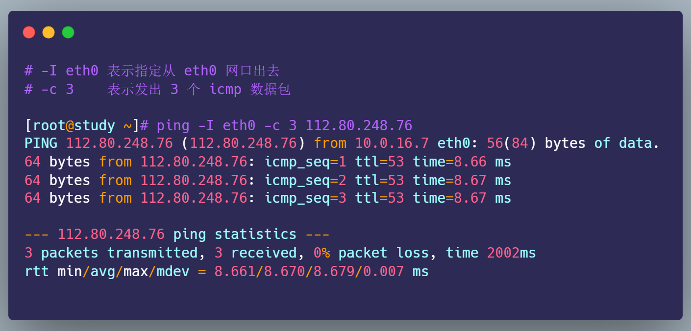
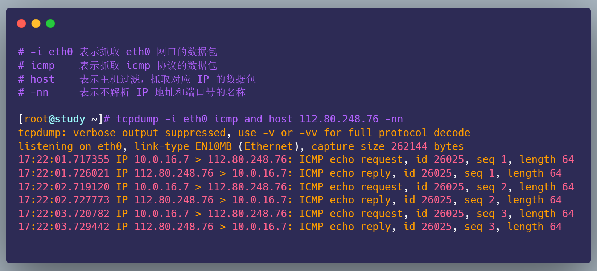
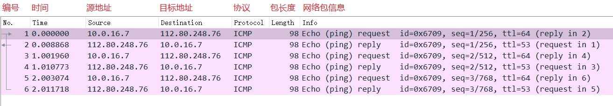
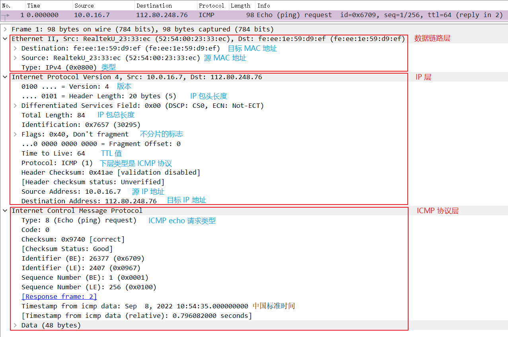
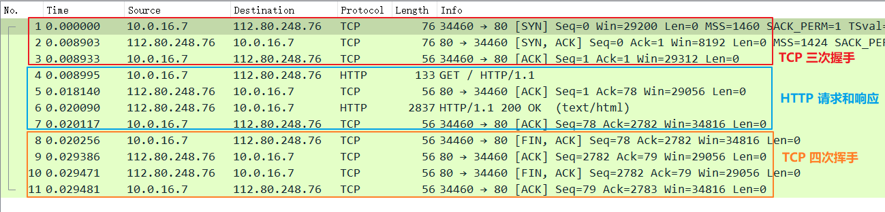
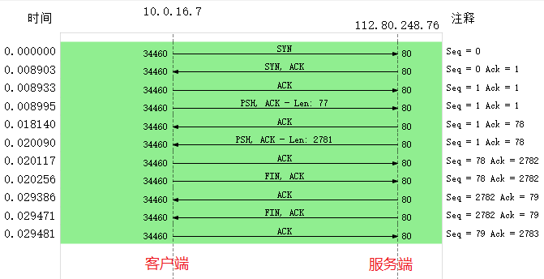
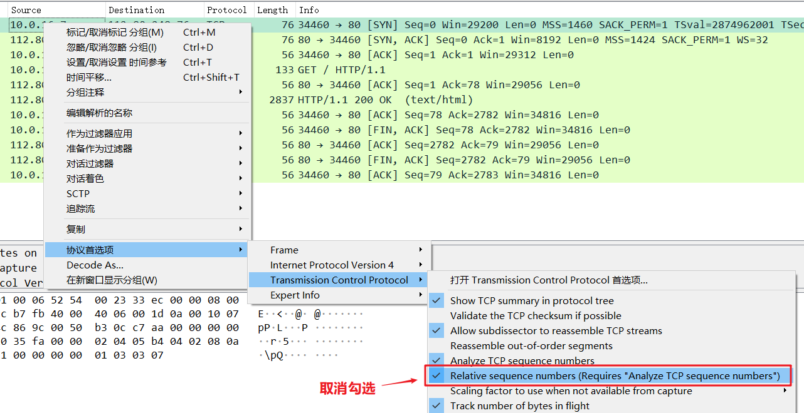
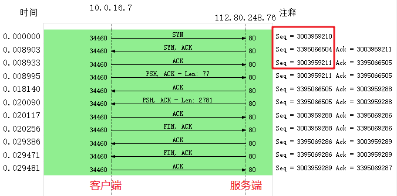
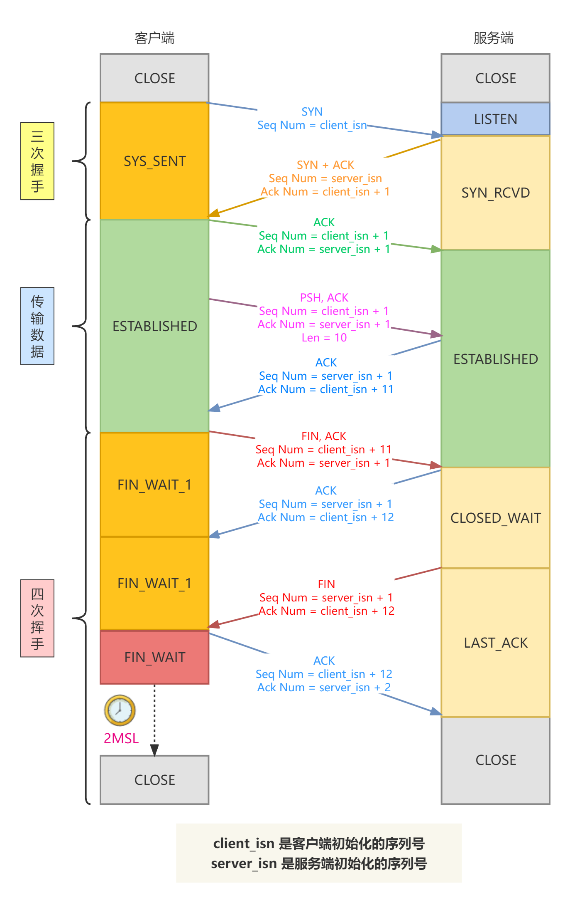

# 抓包与分析

## 前言

**tcpdump** 和 **Wireshark** 是最常用的网络抓包和分析工具，更是分析网络性能必不可少的利器。它们能把我们「看不见」的数据包，呈现在我们眼前，一目了然。

* tcpdump 仅支持命令行格式使用，常用在 Linux 服务器中抓取和分析网络包。
* Wireshark 除了可以抓包外，还提供了可视化分析网络包的图形页面。

所以，这两者实际上是搭配使用的，先用 tcpdump 命令在 Linux 服务器上抓包，接着把抓包的文件拖出到 Windows 电脑后，用 Wireshark 可视化分析。

当然，如果你是在 Windows 上抓包，只需要用 Wireshark 工具就可以。

## 使用 tcpdump 抓包

tcpdump 提供了大量的选项以及各式各样的过滤表达式，来帮助我们抓取指定的数据包。不过只需要掌握一些常用选项和过滤表达式，就可以满足大部分场景的需要了。

### 抓取 ping 包

假设我们要抓取下面的 ping 的数据包：

<div style="text-align: center;">
  
  <p style="text-align: center; color: #888;">（ping 数据包）</p>
</div>

要抓取上面的 ping 命令数据包，首先我们要知道 ping 的数据包是 `icmp` 协议，接着在使用 tcpdump 抓包的时候，就可以指定只抓 icmp 协议的数据包：

```bash
# -i eth0 表示抓取 eth0 网口的数据包
# icmp    表示抓取 icmp 协议的数据包
# host    表示主机过滤，抓取对应 IP 的数据包
# -nn     表示不解析 IP 地址和端口号的名称
tcpdump -i eth0 icmp and host 112.80.248.76 -nn
```

当 tcpdump 抓取到 icmp 数据包后，输出内容如下：

<div style="text-align: center;">
  
  <p style="text-align: center; color: #888;">（抓取 ping 的数据包）</p>
</div>

数据的格式是：`时间戳 协议 源地址.源端口 > 目的地址.目的端口 网络包详细信息`

从 tcpdump 抓取的 icmp 数据包，我们很清楚的看到 `icmp echo` 的交互过程了，首先发送方发起了 `ICMP echo request` 请求报文，接收方收到后回了一个 `ICMP echo reply` 响应报文，之后 `seq` 是递增的。

### 常见用法整理

这里总结一下 tcpdump 最常见的用法。

首先是常用的选项，如下表所示：

<svg id="SvgjsSvg1006" width="738" height="339" xmlns="http://www.w3.org/2000/svg" version="1.1" xmlns:xlink="http://www.w3.org/1999/xlink" xmlns:svgjs="http://svgjs.com/svgjs"><defs id="SvgjsDefs1007"></defs><g id="SvgjsG1008" transform="translate(25,25)"><path id="SvgjsPath1009" d="M0 0L688 0L688 48 L0 48Z" stroke="rgba(205,206,199,1)" stroke-width="1" fill-opacity="1" fill="#cce5ff"></path><g id="SvgjsG1010"><text id="SvgjsText1011" font-family="微软雅黑" text-anchor="middle" font-size="16px" width="688px" fill="#323232" font-weight="700" align="middle" lineHeight="125%" anchor="middle" family="微软雅黑" size="16px" weight="700" font-style="" opacity="1" y="10" transform="rotate(0)"><tspan id="SvgjsTspan1012" dy="20" x="344"><tspan id="SvgjsTspan1013" style="text-decoration:;">tcpdump 使用 —— 选项</tspan></tspan></text></g></g><g id="SvgjsG1014" transform="translate(25,73)"><path id="SvgjsPath1015" d="M0 0L103.26880000000001 0L103.26880000000001 46 L0 46Z" stroke="rgba(205,206,199,1)" stroke-width="1" fill-opacity="1" fill="#cce5ff"></path><path id="SvgjsPath1016" d="M103.26880000000001 0L362.6448 0L362.6448 46 L103.26880000000001 46Z" stroke="rgba(205,206,199,1)" stroke-width="1" fill-opacity="1" fill="#cce5ff"></path><path id="SvgjsPath1017" d="M362.64480000000003 0L688 0L688 46 L362.64480000000003 46Z" stroke="rgba(205,206,199,1)" stroke-width="1" fill-opacity="1" fill="#cce5ff"></path><g id="SvgjsG1018"><text id="SvgjsText1019" font-family="微软雅黑" text-anchor="middle" font-size="16px" width="104px" fill="#323232" font-weight="700" align="middle" lineHeight="125%" anchor="middle" family="微软雅黑" size="16px" weight="700" font-style="" opacity="1" y="9" transform="rotate(0)"><tspan id="SvgjsTspan1020" dy="20" x="52"><tspan id="SvgjsTspan1021" style="text-decoration:;">选项</tspan></tspan></text></g><g id="SvgjsG1022"><text id="SvgjsText1023" font-family="微软雅黑" text-anchor="middle" font-size="16px" width="260px" fill="#323232" font-weight="700" align="middle" lineHeight="125%" anchor="middle" family="微软雅黑" size="16px" weight="700" font-style="" opacity="1" y="9" transform="rotate(0)"><tspan id="SvgjsTspan1024" dy="20" x="233.2688"><tspan id="SvgjsTspan1025" style="text-decoration:;">示例</tspan></tspan></text></g><g id="SvgjsG1026"><text id="SvgjsText1027" font-family="微软雅黑" text-anchor="middle" font-size="16px" width="326px" fill="#323232" font-weight="700" align="middle" lineHeight="125%" anchor="middle" family="微软雅黑" size="16px" weight="700" font-style="" opacity="1" y="9" transform="rotate(0)"><tspan id="SvgjsTspan1028" dy="20" x="525.6448"><tspan id="SvgjsTspan1029" style="text-decoration:;">说明</tspan></tspan></text></g></g><g id="SvgjsG1030" transform="translate(25,118)"><path id="SvgjsPath1031" d="M0 0L103.26880000000001 0L103.26880000000001 49 L0 49Z" stroke="rgba(205,206,199,1)" stroke-width="1" fill-opacity="1" fill="#faf7ed"></path><path id="SvgjsPath1032" d="M103.26880000000001 0L362.6448 0L362.6448 49 L103.26880000000001 49Z" stroke="rgba(205,206,199,1)" stroke-width="1" fill-opacity="1" fill="#faf7ed"></path><path id="SvgjsPath1033" d="M362.64480000000003 0L688 0L688 49 L362.64480000000003 49Z" stroke="rgba(205,206,199,1)" stroke-width="1" fill-opacity="1" fill="#faf7ed"></path><path id="SvgjsPath1034" d="M0 49L103.26880000000001 49L103.26880000000001 98 L0 98Z" stroke="rgba(205,206,199,1)" stroke-width="1" fill-opacity="1" fill="#faf7ed"></path><path id="SvgjsPath1035" d="M103.26880000000001 49L362.6448 49L362.6448 98 L103.26880000000001 98Z" stroke="rgba(205,206,199,1)" stroke-width="1" fill-opacity="1" fill="#faf7ed"></path><path id="SvgjsPath1036" d="M362.64480000000003 49L688 49L688 98 L362.64480000000003 98Z" stroke="rgba(205,206,199,1)" stroke-width="1" fill-opacity="1" fill="#faf7ed"></path><path id="SvgjsPath1037" d="M0 98L103.26880000000001 98L103.26880000000001 147 L0 147Z" stroke="rgba(205,206,199,1)" stroke-width="1" fill-opacity="1" fill="#faf7ed"></path><path id="SvgjsPath1038" d="M103.26880000000001 98L362.6448 98L362.6448 147 L103.26880000000001 147Z" stroke="rgba(205,206,199,1)" stroke-width="1" fill-opacity="1" fill="#faf7ed"></path><path id="SvgjsPath1039" d="M362.64480000000003 98L688 98L688 147 L362.64480000000003 147Z" stroke="rgba(205,206,199,1)" stroke-width="1" fill-opacity="1" fill="#faf7ed"></path><path id="SvgjsPath1040" d="M0 147L103.26880000000001 147L103.26880000000001 196 L0 196Z" stroke="rgba(205,206,199,1)" stroke-width="1" fill-opacity="1" fill="#faf7ed"></path><path id="SvgjsPath1041" d="M103.26880000000001 147L362.6448 147L362.6448 196 L103.26880000000001 196Z" stroke="rgba(205,206,199,1)" stroke-width="1" fill-opacity="1" fill="#faf7ed"></path><path id="SvgjsPath1042" d="M362.64480000000003 147L688 147L688 196 L362.64480000000003 196Z" stroke="rgba(205,206,199,1)" stroke-width="1" fill-opacity="1" fill="#faf7ed"></path><g id="SvgjsG1043"><text id="SvgjsText1044" font-family="微软雅黑" text-anchor="middle" font-size="16px" width="104px" fill="#323232" font-weight="400" align="middle" lineHeight="150%" anchor="middle" family="微软雅黑" size="16px" weight="400" font-style="" opacity="1" y="6.5" transform="rotate(0)"><tspan id="SvgjsTspan1045" dy="24" x="52"><tspan id="SvgjsTspan1046" style="text-decoration:;">-i</tspan></tspan></text></g><g id="SvgjsG1047"><text id="SvgjsText1048" font-family="微软雅黑" text-anchor="middle" font-size="16px" width="260px" fill="#323232" font-weight="400" align="middle" lineHeight="150%" anchor="middle" family="微软雅黑" size="16px" weight="400" font-style="" opacity="1" y="6.5" transform="rotate(0)"><tspan id="SvgjsTspan1049" dy="24" x="233.2688"><tspan id="SvgjsTspan1050" style="text-decoration:;">tcpdump -i eth0</tspan></tspan></text></g><g id="SvgjsG1051"><text id="SvgjsText1052" font-family="微软雅黑" text-anchor="middle" font-size="16px" width="326px" fill="#323232" font-weight="400" align="middle" lineHeight="150%" anchor="middle" family="微软雅黑" size="16px" weight="400" font-style="" opacity="1" y="-5.5" transform="rotate(0)"><tspan id="SvgjsTspan1053" dy="24" x="525.6448"><tspan id="SvgjsTspan1054" style="text-decoration:;">指定网络接口，默认是 0 号接口</tspan></tspan><tspan id="SvgjsTspan1055" dy="24" x="525.6448"><tspan id="SvgjsTspan1056" style="text-decoration:;">（如 eth0），any 表示所有接口</tspan></tspan></text></g><g id="SvgjsG1057"><text id="SvgjsText1058" font-family="微软雅黑" text-anchor="middle" font-size="16px" width="104px" fill="#323232" font-weight="400" align="middle" lineHeight="150%" anchor="middle" family="微软雅黑" size="16px" weight="400" font-style="" opacity="1" y="55.5" transform="rotate(0)"><tspan id="SvgjsTspan1059" dy="24" x="52"><tspan id="SvgjsTspan1060" style="text-decoration:;">-nn</tspan></tspan></text></g><g id="SvgjsG1061"><text id="SvgjsText1062" font-family="微软雅黑" text-anchor="middle" font-size="16px" width="260px" fill="#323232" font-weight="400" align="middle" lineHeight="150%" anchor="middle" family="微软雅黑" size="16px" weight="400" font-style="" opacity="1" y="55.5" transform="rotate(0)"><tspan id="SvgjsTspan1063" dy="24" x="233.2688"><tspan id="SvgjsTspan1064" style="text-decoration:;">tcpdump -nn</tspan></tspan></text></g><g id="SvgjsG1065"><text id="SvgjsText1066" font-family="微软雅黑" text-anchor="middle" font-size="16px" width="326px" fill="#323232" font-weight="400" align="middle" lineHeight="150%" anchor="middle" family="微软雅黑" size="16px" weight="400" font-style="" opacity="1" y="55.5" transform="rotate(0)"><tspan id="SvgjsTspan1067" dy="24" x="525.6448"><tspan id="SvgjsTspan1068" style="text-decoration:;">不解析 IP 地址和端口号的名称</tspan></tspan></text></g><g id="SvgjsG1069"><text id="SvgjsText1070" font-family="微软雅黑" text-anchor="middle" font-size="16px" width="104px" fill="#323232" font-weight="400" align="middle" lineHeight="150%" anchor="middle" family="微软雅黑" size="16px" weight="400" font-style="" opacity="1" y="104.5" transform="rotate(0)"><tspan id="SvgjsTspan1071" dy="24" x="52"><tspan id="SvgjsTspan1072" style="text-decoration:;">-c</tspan></tspan></text></g><g id="SvgjsG1073"><text id="SvgjsText1074" font-family="微软雅黑" text-anchor="middle" font-size="16px" width="260px" fill="#323232" font-weight="400" align="middle" lineHeight="150%" anchor="middle" family="微软雅黑" size="16px" weight="400" font-style="" opacity="1" y="104.5" transform="rotate(0)"><tspan id="SvgjsTspan1075" dy="24" x="233.2688"><tspan id="SvgjsTspan1076" style="text-decoration:;">tcpdump -c 5</tspan></tspan></text></g><g id="SvgjsG1077"><text id="SvgjsText1078" font-family="微软雅黑" text-anchor="middle" font-size="16px" width="326px" fill="#323232" font-weight="400" align="middle" lineHeight="150%" anchor="middle" family="微软雅黑" size="16px" weight="400" font-style="" opacity="1" y="104.5" transform="rotate(0)"><tspan id="SvgjsTspan1079" dy="24" x="525.6448"><tspan id="SvgjsTspan1080" style="text-decoration:;">限制要抓取的网络包的个数</tspan></tspan></text></g><g id="SvgjsG1081"><text id="SvgjsText1082" font-family="微软雅黑" text-anchor="middle" font-size="16px" width="104px" fill="#323232" font-weight="400" align="middle" lineHeight="150%" anchor="middle" family="微软雅黑" size="16px" weight="400" font-style="" opacity="1" y="153.5" transform="rotate(0)"><tspan id="SvgjsTspan1083" dy="24" x="52"><tspan id="SvgjsTspan1084" style="text-decoration:;">-w</tspan></tspan></text></g><g id="SvgjsG1085"><text id="SvgjsText1086" font-family="微软雅黑" text-anchor="middle" font-size="16px" width="260px" fill="#323232" font-weight="400" align="middle" lineHeight="150%" anchor="middle" family="微软雅黑" size="16px" weight="400" font-style="" opacity="1" y="153.5" transform="rotate(0)"><tspan id="SvgjsTspan1087" dy="24" x="233.2688"><tspan id="SvgjsTspan1088" style="text-decoration:;">tcpdump -w file.pcap</tspan></tspan></text></g><g id="SvgjsG1089"><text id="SvgjsText1090" font-family="微软雅黑" text-anchor="middle" font-size="16px" width="326px" fill="#323232" font-weight="400" align="middle" lineHeight="150%" anchor="middle" family="微软雅黑" size="16px" weight="400" font-style="" opacity="1" y="141.5" transform="rotate(0)"><tspan id="SvgjsTspan1091" dy="24" x="525.6448"><tspan id="SvgjsTspan1092" style="text-decoration:;">保存到文件中，文件名通常以</tspan></tspan><tspan id="SvgjsTspan1093" dy="24" x="525.6448"><tspan id="SvgjsTspan1094" style="text-decoration:;">.pcap 为后缀</tspan></tspan></text></g></g></svg>

接下来是常用的过滤表达式，如下表所示：

<svg id="SvgjsSvg1112" width="738" height="386" xmlns="http://www.w3.org/2000/svg" version="1.1" xmlns:xlink="http://www.w3.org/1999/xlink" xmlns:svgjs="http://svgjs.com/svgjs"><defs id="SvgjsDefs1113"></defs><g id="SvgjsG1114" transform="translate(25,25)"><path id="SvgjsPath1115" d="M0 0L688 0L688 48 L0 48Z" stroke="rgba(205,206,199,1)" stroke-width="1" fill-opacity="1" fill="#ffcc99"></path><g id="SvgjsG1116"><text id="SvgjsText1117" font-family="微软雅黑" text-anchor="middle" font-size="16px" width="688px" fill="#323232" font-weight="700" align="middle" lineHeight="125%" anchor="middle" family="微软雅黑" size="16px" weight="700" font-style="" opacity="1" y="10" transform="rotate(0)"><tspan id="SvgjsTspan1118" dy="20" x="344"><tspan id="SvgjsTspan1119" style="text-decoration:;">tcpdump 使用 —— 过滤表达式</tspan></tspan></text></g></g><g id="SvgjsG1120" transform="translate(25,73)"><path id="SvgjsPath1121" d="M0 0L220.2976 0L220.2976 46 L0 46Z" stroke="rgba(205,206,199,1)" stroke-width="1" fill-opacity="1" fill="#ffcc99"></path><path id="SvgjsPath1122" d="M220.2976 0L516.688 0L516.688 46 L220.2976 46Z" stroke="rgba(205,206,199,1)" stroke-width="1" fill-opacity="1" fill="#ffcc99"></path><path id="SvgjsPath1123" d="M516.688 0L688 0L688 46 L516.688 46Z" stroke="rgba(205,206,199,1)" stroke-width="1" fill-opacity="1" fill="#ffcc99"></path><g id="SvgjsG1124"><text id="SvgjsText1125" font-family="微软雅黑" text-anchor="middle" font-size="16px" width="221px" fill="#323232" font-weight="700" align="middle" lineHeight="125%" anchor="middle" family="微软雅黑" size="16px" weight="700" font-style="" opacity="1" y="9" transform="rotate(0)"><tspan id="SvgjsTspan1126" dy="20" x="110.5"><tspan id="SvgjsTspan1127" style="text-decoration:;">选项</tspan></tspan></text></g><g id="SvgjsG1128"><text id="SvgjsText1129" font-family="微软雅黑" text-anchor="middle" font-size="16px" width="297px" fill="#323232" font-weight="700" align="middle" lineHeight="125%" anchor="middle" family="微软雅黑" size="16px" weight="700" font-style="" opacity="1" y="9" transform="rotate(0)"><tspan id="SvgjsTspan1130" dy="20" x="368.7976"><tspan id="SvgjsTspan1131" style="text-decoration:;">示例</tspan></tspan></text></g><g id="SvgjsG1132"><text id="SvgjsText1133" font-family="微软雅黑" text-anchor="middle" font-size="16px" width="172px" fill="#323232" font-weight="700" align="middle" lineHeight="125%" anchor="middle" family="微软雅黑" size="16px" weight="700" font-style="" opacity="1" y="9" transform="rotate(0)"><tspan id="SvgjsTspan1134" dy="20" x="602.688"><tspan id="SvgjsTspan1135" style="text-decoration:;">说明</tspan></tspan></text></g></g><g id="SvgjsG1136" transform="translate(25,118)"><path id="SvgjsPath1137" d="M0 0L220.2288 0L220.2288 48.6 L0 48.6Z" stroke="rgba(205,206,199,1)" stroke-width="1" fill-opacity="1" fill="#faf7ed"></path><path id="SvgjsPath1138" d="M220.2288 0L517.6512 0L517.6512 48.6 L220.2288 48.6Z" stroke="rgba(205,206,199,1)" stroke-width="1" fill-opacity="1" fill="#faf7ed"></path><path id="SvgjsPath1139" d="M517.6512 0L688 0L688 48.6 L517.6512 48.6Z" stroke="rgba(205,206,199,1)" stroke-width="1" fill-opacity="1" fill="#faf7ed"></path><path id="SvgjsPath1140" d="M0 48.6L220.2288 48.6L220.2288 97.2 L0 97.2Z" stroke="rgba(205,206,199,1)" stroke-width="1" fill-opacity="1" fill="#faf7ed"></path><path id="SvgjsPath1141" d="M220.2288 48.6L517.6512 48.6L517.6512 97.2 L220.2288 97.2Z" stroke="rgba(205,206,199,1)" stroke-width="1" fill-opacity="1" fill="#faf7ed"></path><path id="SvgjsPath1142" d="M517.6512 48.6L688 48.6L688 97.2 L517.6512 97.2Z" stroke="rgba(205,206,199,1)" stroke-width="1" fill-opacity="1" fill="#faf7ed"></path><path id="SvgjsPath1143" d="M0 97.2L220.2288 97.2L220.2288 145.8 L0 145.8Z" stroke="rgba(205,206,199,1)" stroke-width="1" fill-opacity="1" fill="#faf7ed"></path><path id="SvgjsPath1144" d="M220.2288 97.2L517.6512 97.2L517.6512 145.8 L220.2288 145.8Z" stroke="rgba(205,206,199,1)" stroke-width="1" fill-opacity="1" fill="#faf7ed"></path><path id="SvgjsPath1145" d="M517.6512 97.2L688 97.2L688 145.8 L517.6512 145.8Z" stroke="rgba(205,206,199,1)" stroke-width="1" fill-opacity="1" fill="#faf7ed"></path><path id="SvgjsPath1146" d="M0 145.79999999999998L220.2288 145.79999999999998L220.2288 194.39999999999998 L0 194.39999999999998Z" stroke="rgba(205,206,199,1)" stroke-width="1" fill-opacity="1" fill="#faf7ed"></path><path id="SvgjsPath1147" d="M220.2288 145.79999999999998L517.6512 145.79999999999998L517.6512 194.39999999999998 L220.2288 194.39999999999998Z" stroke="rgba(205,206,199,1)" stroke-width="1" fill-opacity="1" fill="#faf7ed"></path><path id="SvgjsPath1148" d="M517.6512 145.79999999999998L688 145.79999999999998L688 194.39999999999998 L517.6512 194.39999999999998Z" stroke="rgba(205,206,199,1)" stroke-width="1" fill-opacity="1" fill="#faf7ed"></path><path id="SvgjsPath1149" d="M0 194.4L220.2288 194.4L220.2288 243 L0 243Z" stroke="rgba(205,206,199,1)" stroke-width="1" fill-opacity="1" fill="#faf7ed"></path><path id="SvgjsPath1150" d="M220.2288 194.4L517.6512 194.4L517.6512 243 L220.2288 243Z" stroke="rgba(205,206,199,1)" stroke-width="1" fill-opacity="1" fill="#faf7ed"></path><path id="SvgjsPath1151" d="M517.6512 194.4L688 194.4L688 243 L517.6512 243Z" stroke="rgba(205,206,199,1)" stroke-width="1" fill-opacity="1" fill="#faf7ed"></path><g id="SvgjsG1152"><text id="SvgjsText1153" font-family="微软雅黑" text-anchor="middle" font-size="16px" width="221px" fill="#323232" font-weight="400" align="middle" lineHeight="150%" anchor="middle" family="微软雅黑" size="16px" weight="400" font-style="" opacity="1" y="6.300000000000001" transform="rotate(0)"><tspan id="SvgjsTspan1154" dy="24" x="110.5"><tspan id="SvgjsTspan1155" style="text-decoration:;">host、src host、dst host</tspan></tspan></text></g><g id="SvgjsG1156"><text id="SvgjsText1157" font-family="微软雅黑" text-anchor="middle" font-size="16px" width="298px" fill="#323232" font-weight="400" align="middle" lineHeight="150%" anchor="middle" family="微软雅黑" size="16px" weight="400" font-style="" opacity="1" y="6.300000000000001" transform="rotate(0)"><tspan id="SvgjsTspan1158" dy="24" x="369.2288"><tspan id="SvgjsTspan1159" style="text-decoration:;">tcpdump -nn host 192.168.1.100</tspan></tspan></text></g><g id="SvgjsG1160"><text id="SvgjsText1161" font-family="微软雅黑" text-anchor="middle" font-size="16px" width="171px" fill="#323232" font-weight="400" align="middle" lineHeight="150%" anchor="middle" family="微软雅黑" size="16px" weight="400" font-style="" opacity="1" y="6.300000000000001" transform="rotate(0)"><tspan id="SvgjsTspan1162" dy="24" x="603.1512"><tspan id="SvgjsTspan1163" style="text-decoration:;">主机过滤</tspan></tspan></text></g><g id="SvgjsG1164"><text id="SvgjsText1165" font-family="微软雅黑" text-anchor="middle" font-size="16px" width="221px" fill="#323232" font-weight="400" align="middle" lineHeight="150%" anchor="middle" family="微软雅黑" size="16px" weight="400" font-style="" opacity="1" y="54.900000000000006" transform="rotate(0)"><tspan id="SvgjsTspan1166" dy="24" x="110.5"><tspan id="SvgjsTspan1167" style="text-decoration:;">port、src port、dst port</tspan></tspan></text></g><g id="SvgjsG1168"><text id="SvgjsText1169" font-family="微软雅黑" text-anchor="middle" font-size="16px" width="298px" fill="#323232" font-weight="400" align="middle" lineHeight="150%" anchor="middle" family="微软雅黑" size="16px" weight="400" font-style="" opacity="1" y="54.900000000000006" transform="rotate(0)"><tspan id="SvgjsTspan1170" dy="24" x="369.2288"><tspan id="SvgjsTspan1171" style="text-decoration:;">tcpdump -nn port 80</tspan></tspan></text></g><g id="SvgjsG1172"><text id="SvgjsText1173" font-family="微软雅黑" text-anchor="middle" font-size="16px" width="171px" fill="#323232" font-weight="400" align="middle" lineHeight="150%" anchor="middle" family="微软雅黑" size="16px" weight="400" font-style="" opacity="1" y="54.900000000000006" transform="rotate(0)"><tspan id="SvgjsTspan1174" dy="24" x="603.1512"><tspan id="SvgjsTspan1175" style="text-decoration:;">端口过滤</tspan></tspan></text></g><g id="SvgjsG1176"><text id="SvgjsText1177" font-family="微软雅黑" text-anchor="middle" font-size="16px" width="221px" fill="#323232" font-weight="400" align="middle" lineHeight="150%" anchor="middle" family="微软雅黑" size="16px" weight="400" font-style="" opacity="1" y="91.5" transform="rotate(0)"><tspan id="SvgjsTspan1178" dy="24" x="110.5"><tspan id="SvgjsTspan1179" style="text-decoration:;">ip、ip6、arp、tcp、udp、</tspan></tspan><tspan id="SvgjsTspan1180" dy="24" x="110.5"><tspan id="SvgjsTspan1181" style="text-decoration:;">icmp</tspan></tspan></text></g><g id="SvgjsG1182"><text id="SvgjsText1183" font-family="微软雅黑" text-anchor="middle" font-size="16px" width="298px" fill="#323232" font-weight="400" align="middle" lineHeight="150%" anchor="middle" family="微软雅黑" size="16px" weight="400" font-style="" opacity="1" y="103.5" transform="rotate(0)"><tspan id="SvgjsTspan1184" dy="24" x="369.2288"><tspan id="SvgjsTspan1185" style="text-decoration:;">tcpdump -nn tcp</tspan></tspan></text></g><g id="SvgjsG1186"><text id="SvgjsText1187" font-family="微软雅黑" text-anchor="middle" font-size="16px" width="171px" fill="#323232" font-weight="400" align="middle" lineHeight="150%" anchor="middle" family="微软雅黑" size="16px" weight="400" font-style="" opacity="1" y="103.5" transform="rotate(0)"><tspan id="SvgjsTspan1188" dy="24" x="603.1512"><tspan id="SvgjsTspan1189" style="text-decoration:;">协议过滤</tspan></tspan></text></g><g id="SvgjsG1190"><text id="SvgjsText1191" font-family="微软雅黑" text-anchor="middle" font-size="16px" width="221px" fill="#323232" font-weight="400" align="middle" lineHeight="150%" anchor="middle" family="微软雅黑" size="16px" weight="400" font-style="" opacity="1" y="152.1" transform="rotate(0)"><tspan id="SvgjsTspan1192" dy="24" x="110.5"><tspan id="SvgjsTspan1193" style="text-decoration:;">and、or、not</tspan></tspan></text></g><g id="SvgjsG1194"><text id="SvgjsText1195" font-family="微软雅黑" text-anchor="middle" font-size="16px" width="298px" fill="#323232" font-weight="400" align="middle" lineHeight="150%" anchor="middle" family="微软雅黑" size="16px" weight="400" font-style="" opacity="1" y="140.1" transform="rotate(0)"><tspan id="SvgjsTspan1196" dy="24" x="369.2288"><tspan id="SvgjsTspan1197" style="text-decoration:;">tcpdump -nn host</tspan></tspan><tspan id="SvgjsTspan1198" dy="24" x="369.2288"><tspan id="SvgjsTspan1199" style="text-decoration:;">192.168.1.100 and port 80</tspan></tspan></text></g><g id="SvgjsG1200"><text id="SvgjsText1201" font-family="微软雅黑" text-anchor="middle" font-size="16px" width="171px" fill="#323232" font-weight="400" align="middle" lineHeight="150%" anchor="middle" family="微软雅黑" size="16px" weight="400" font-style="" opacity="1" y="152.1" transform="rotate(0)"><tspan id="SvgjsTspan1202" dy="24" x="603.1512"><tspan id="SvgjsTspan1203" style="text-decoration:;">逻辑表达式</tspan></tspan></text></g><g id="SvgjsG1204"><text id="SvgjsText1205" font-family="微软雅黑" text-anchor="middle" font-size="16px" width="221px" fill="#323232" font-weight="400" align="middle" lineHeight="150%" anchor="middle" family="微软雅黑" size="16px" weight="400" font-style="" opacity="1" y="200.7" transform="rotate(0)"><tspan id="SvgjsTspan1206" dy="24" x="110.5"><tspan id="SvgjsTspan1207" style="text-decoration:;">tcp[tcpflags]</tspan></tspan></text></g><g id="SvgjsG1208"><text id="SvgjsText1209" font-family="微软雅黑" text-anchor="middle" font-size="16px" width="298px" fill="#323232" font-weight="400" align="middle" lineHeight="150%" anchor="middle" family="微软雅黑" size="16px" weight="400" font-style="" opacity="1" y="188.7" transform="rotate(0)"><tspan id="SvgjsTspan1210" dy="24" x="369.2288"><tspan id="SvgjsTspan1211" style="text-decoration:;">tcpdump -nn "tcp[tcpflags] &amp;</tspan></tspan><tspan id="SvgjsTspan1212" dy="24" x="369.2288"><tspan id="SvgjsTspan1213" style="text-decoration:;">tcp-syn != 0"</tspan></tspan></text></g><g id="SvgjsG1214"><text id="SvgjsText1215" font-family="微软雅黑" text-anchor="middle" font-size="16px" width="171px" fill="#323232" font-weight="400" align="middle" lineHeight="150%" anchor="middle" family="微软雅黑" size="16px" weight="400" font-style="" opacity="1" y="200.7" transform="rotate(0)"><tspan id="SvgjsTspan1216" dy="24" x="603.1512"><tspan id="SvgjsTspan1217" style="text-decoration:;">特定状态的 TCP 包</tspan></tspan></text></g></g></svg>

虽然 tcpdump 功能强大，但是输出的格式并不直观。所以在工作中 tcpdump 只是用来抓取数据包，不用来分析数据包，而是把 tcpdump 抓取的数据包保存成 pcap 后缀的文件，接着用 Wireshark 工具进行数据包分析。

## 使用 Wireshark 分析包

Wireshark 除了可以抓包外，还提供了可视化分析网络包的图形页面，同时，还内置了一系列的汇总分析工具。

### 分析 ping 包

比如，拿上面的 ping 例子来说，我们可以使用下面的命令，把抓取的数据包保存到 ping.pcap 文件。

```bash
# 先开一个 shell 窗口
tcpdump -i eth0 icmp and host 112.80.248.76 -w ping.pcap

# 再开一个 shell 窗口
ping -I eth0 -c 3 112.80.248.76
```

接着把 ping.pcap 文件拖到电脑，再用 Wireshark 打开它。打开后，就可以看到下面这个界面：

<div style="text-align: center; width: 860px;">
  
  <p style="text-align: center; color: #888;">（ping.pcap）</p>
</div>

如上，在 Wireshark 的页面里，可以更加直观的分析数据包，不仅展示各个网络包的头部信息，还会用不同的颜色来区分不同的协议，由于这次抓包只有 ICMP 协议，所以只有紫色的条目。

接着，在网络包列表中选择某一个网络包后，在其下面的网络包详情中，**可以更清楚的看到，这个网络包在协议栈各层的详细信息**。比如，以编号 1 的网络包为例子：

<div style="text-align: center; width: 860px;">
  
  <p style="text-align: center; color: #888;">（编号 1 的网络包）</p>
</div>

Wireshark 用了分层的方式，展示了各个层的包头信息：

* 可以在数据链路层，看到 MAC 包头信息，如源 MAC 地址和目标 MAC 地址等字段。
* 可以在 IP 层，看到 IP 包头信息，如源 IP 地址和目标 IP 地址、TTL、IP 包长度、协议等 IP 协议各个字段的数值和含义。
* 可以在 ICMP 层，看到 ICMP 包头信息，比如 Type、Code 等 ICMP 协议各个字段的数值和含义。

从 ping 的例子中，我们可以看到网络分层就像有序的分工，每一层都有自己的责任范围和信息，上层协议完成工作后就交给下一层，最终形成一个完整的网络包。

<div style="text-align: center; width: 860px;">
  <svg id="SvgjsSvg1007" width="566" height="315" xmlns="http://www.w3.org/2000/svg" version="1.1" xmlns:xlink="http://www.w3.org/1999/xlink" xmlns:svgjs="http://svgjs.com/svgjs"><defs id="SvgjsDefs1007"></defs><g id="SvgjsG1008" transform="translate(396.9375,25)"><path id="SvgjsPath1009" d="M 9.920625000000001 0L 20.141875000000002 0L 20.141875000000002 249.96875L 30.0625 249.96875L 15.03125 265L 0 249.96875L 9.920625000000001 249.96875L 9.920625000000001 0Z" stroke="none" fill-opacity="1" fill="#ffcc99"></path><g id="SvgjsG1010"><text id="SvgjsText1011" font-family="微软雅黑" text-anchor="middle" font-size="13px" width="43px" fill="#323232" font-weight="400" align="middle" lineHeight="125%" anchor="middle" family="微软雅黑" size="13px" weight="400" font-style="" opacity="1" y="108.625" transform="rotate(0)"></text></g></g><g id="SvgjsG1012" transform="translate(231,36)"><path id="SvgjsPath1013" d="M 0 0L 139 0L 139 50L 0 50Z" stroke="rgba(149,116,162,1)" stroke-width="2" fill-opacity="1" fill="#e1d6e5"></path><g id="SvgjsG1014"><text id="SvgjsText1015" font-family="微软雅黑" text-anchor="middle" font-size="16px" width="119px" fill="#323232" font-weight="400" align="middle" lineHeight="125%" anchor="middle" family="微软雅黑" size="16px" weight="400" font-style="" opacity="1" y="11" transform="rotate(0)"><tspan id="SvgjsTspan1016" dy="20" x="69.5"><tspan id="SvgjsTspan1017" style="text-decoration:;">ICMP 头 + Data</tspan></tspan></text></g></g><g id="SvgjsG1018" transform="translate(231,122)"><path id="SvgjsPath1019" d="M 0 0L 139 0L 139 50L 0 50Z" stroke="rgba(149,116,162,1)" stroke-width="2" fill-opacity="1" fill="#e1d6e5"></path><g id="SvgjsG1020"><text id="SvgjsText1021" font-family="微软雅黑" text-anchor="middle" font-size="16px" width="119px" fill="#323232" font-weight="400" align="middle" lineHeight="125%" anchor="middle" family="微软雅黑" size="16px" weight="400" font-style="" opacity="1" y="11" transform="rotate(0)"><tspan id="SvgjsTspan1022" dy="20" x="69.5"><tspan id="SvgjsTspan1023" style="text-decoration:;">ICMP 头 + Data</tspan></tspan></text></g></g><g id="SvgjsG1024" transform="translate(231,208)"><path id="SvgjsPath1025" d="M 0 0L 139 0L 139 50L 0 50Z" stroke="rgba(149,116,162,1)" stroke-width="2" fill-opacity="1" fill="#e1d6e5"></path><g id="SvgjsG1026"><text id="SvgjsText1027" font-family="微软雅黑" text-anchor="middle" font-size="16px" width="119px" fill="#323232" font-weight="400" align="middle" lineHeight="125%" anchor="middle" family="微软雅黑" size="16px" weight="400" font-style="" opacity="1" y="11" transform="rotate(0)"><tspan id="SvgjsTspan1028" dy="20" x="69.5"><tspan id="SvgjsTspan1029" style="text-decoration:;">ICMP 头 + Data</tspan></tspan></text></g></g><g id="SvgjsG1030" transform="translate(128,122)"><path id="SvgjsPath1031" d="M 0 0L 103 0L 103 50L 0 50Z" stroke="rgba(213,182,90,1)" stroke-width="2" fill-opacity="1" fill="#fff2cc"></path><g id="SvgjsG1032"><text id="SvgjsText1033" font-family="微软雅黑" text-anchor="middle" font-size="16px" width="83px" fill="#323232" font-weight="400" align="middle" lineHeight="125%" anchor="middle" family="微软雅黑" size="16px" weight="400" font-style="" opacity="1" y="11" transform="rotate(0)"><tspan id="SvgjsTspan1034" dy="20" x="51.5"><tspan id="SvgjsTspan1035" style="text-decoration:;">IP 头</tspan></tspan></text></g></g><g id="SvgjsG1036" transform="translate(128,208)"><path id="SvgjsPath1037" d="M 0 0L 103 0L 103 50L 0 50Z" stroke="rgba(213,182,90,1)" stroke-width="2" fill-opacity="1" fill="#fff2cc"></path><g id="SvgjsG1038"><text id="SvgjsText1039" font-family="微软雅黑" text-anchor="middle" font-size="16px" width="83px" fill="#323232" font-weight="400" align="middle" lineHeight="125%" anchor="middle" family="微软雅黑" size="16px" weight="400" font-style="" opacity="1" y="11" transform="rotate(0)"><tspan id="SvgjsTspan1040" dy="20" x="51.5"><tspan id="SvgjsTspan1041" style="text-decoration:;">IP 头</tspan></tspan></text></g></g><g id="SvgjsG1042" transform="translate(25,208)"><path id="SvgjsPath1043" d="M 0 0L 103 0L 103 50L 0 50Z" stroke="rgba(115,141,177,1)" stroke-width="2" fill-opacity="1" fill="#dbe8fd"></path><g id="SvgjsG1044"><text id="SvgjsText1045" font-family="微软雅黑" text-anchor="middle" font-size="16px" width="83px" fill="#323232" font-weight="400" align="middle" lineHeight="125%" anchor="middle" family="微软雅黑" size="16px" weight="400" font-style="" opacity="1" y="11" transform="rotate(0)"><tspan id="SvgjsTspan1046" dy="20" x="51.5"><tspan id="SvgjsTspan1047" style="text-decoration:;">以太帧头</tspan></tspan></text></g></g><g id="SvgjsG1048" transform="translate(417,36)"><path id="SvgjsPath1049" d="M 0 0L 120 0L 120 40L 0 40Z" stroke="none" fill="none"></path><g id="SvgjsG1050"><text id="SvgjsText1051" font-family="微软雅黑" text-anchor="middle" font-size="16px" width="120px" fill="#323232" font-weight="400" align="middle" lineHeight="125%" anchor="middle" family="微软雅黑" size="16px" weight="400" font-style="" opacity="1" y="6" transform="rotate(0)"><tspan id="SvgjsTspan1052" dy="20" x="60"><tspan id="SvgjsTspan1053" style="text-decoration:;">ICMP 协议</tspan></tspan></text></g></g><g id="SvgjsG1054" transform="translate(397,127)"><path id="SvgjsPath1055" d="M 0 0L 120 0L 120 40L 0 40Z" stroke="none" fill="none"></path><g id="SvgjsG1056"><text id="SvgjsText1057" font-family="微软雅黑" text-anchor="middle" font-size="16px" width="120px" fill="#323232" font-weight="400" align="middle" lineHeight="125%" anchor="middle" family="微软雅黑" size="16px" weight="400" font-style="" opacity="1" y="6" transform="rotate(0)"><tspan id="SvgjsTspan1058" dy="20" x="60"><tspan id="SvgjsTspan1059" style="text-decoration:;">IP 层</tspan></tspan></text></g></g><g id="SvgjsG1060" transform="translate(421,213)"><path id="SvgjsPath1061" d="M 0 0L 120 0L 120 40L 0 40Z" stroke="none" fill="none"></path><g id="SvgjsG1062"><text id="SvgjsText1063" font-family="微软雅黑" text-anchor="middle" font-size="16px" width="120px" fill="#323232" font-weight="400" align="middle" lineHeight="125%" anchor="middle" family="微软雅黑" size="16px" weight="400" font-style="" opacity="1" y="6" transform="rotate(0)"><tspan id="SvgjsTspan1064" dy="20" x="60"><tspan id="SvgjsTspan1065" style="text-decoration:;">数据链路层</tspan></tspan></text></g></g></svg>
  <p style="text-align: center; color: #888;">（ping 网络包组装过程）</p>
</div>

接下来通过 tcpdump 和 Wireshark 这两大网络分析利器，抓取和分析 HTTP 协议网络包，并理解 TCP 三次握手和四次挥手的工作原理。

## 分析 TCP 三次握手和四次挥手

以访问 112.80.248.76 为例：

```bash
# 首先打开一个 shell 窗口，用 tcpdump 命令抓取数据包
tcpdump -i any tcp and host 112.80.248.76 and port 80 -w http.pcap

# 接着再打开一个 shell 窗口，执行下面的 curl 命令
curl http://112.80.248.76
```

最后，回到第一个 shell 窗口，按下 Ctrl+C 停止 tcpdump，并把得到的 http.pcap 取出到电脑。

使用 Wireshark 打开 http.pcap 后，你就可以在 Wireshark 中，看到如下的界面：

<div style="text-align: center; width: 860px;">
  
  <p style="text-align: center; color: #888;">（http.pcap）</p>
</div>

我们都知道 HTTP 是基于 TCP 协议进行传输的，那么：

* 最开始的 3 个包就是 TCP 三次握手建立连接的包
* 中间是 HTTP 请求和响应的包
* 而最后的 3 个包则是 TCP 断开连接的挥手包

Wireshark 可以用时序图的方式显示数据包交互的过程，从菜单栏中，点击「统计 (Statistics)」->「流量图 (Flow Graph)」，然后在弹出的界面中的「流类型」选择「TCP Flows」，就可以更清晰的看到整个过程中 TCP 流的执行过程：

<div style="text-align: center; width: 860px;">
  
  <p style="text-align: center; color: #888;">（TCP Flows 时序图）</p>
</div>

你可能会好奇，为什么三次握手连接过程的 Seq 是 0？说好是随机生成的呢，怎么那么巧是 0 的呢？

实际上是因为 Wireshark 工具帮我们做了优化，它默认显示的是序列号 Seq 是相对值，而不是真实值。

如果你想看到实际的序列号的值，可以右键菜单， 然后找到「协议首选项」，接着找到「Relative Seq」后，把它给取消，操作如下：

<div style="text-align: center; width: 860px;">
  
  <p style="text-align: center; color: #888;">（取消 Seq 相对值显示的方式）</p>
</div>

取消后，Seq 显示的就是真实值了：

<div style="text-align: center; width: 860px;">
  
  <p style="text-align: center; color: #888;">（Seq 真实值显示的 TCP Flows 时序图）</p>
</div>

可见，客户端和服务端的序列号实际上是不同的，序列号是一个随机值。

再来回顾下 TCP 三次握手和四次挥手，整个流程基本是这样的：

<div style="text-align: center; width: 860px;">
  
  <p style="text-align: center; color: #888;">（TCP 三次握手和四次挥手）</p>
</div>

（完）
