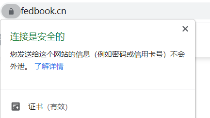
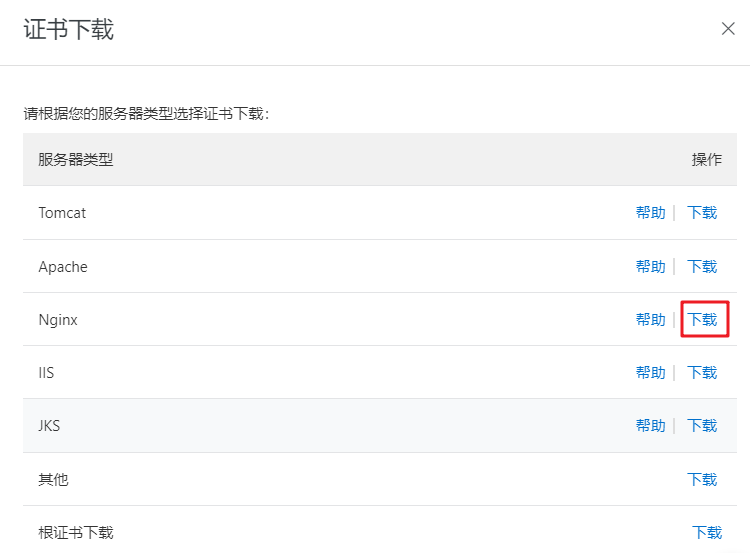

# Nginx 部署 Https 安全认证

> 本文不介绍 https 相关知识，仅分享 Nginx 配置 https 服务的步骤。并且假设你已经购买了服务器、域名和 SSL 证书。

## 模块介绍

网站启用 https 以后会在 SEO 和安全性方面都有一定的好处，这里不展开讲。已经启用 https 的网站，一个比较直观的变化就是浏览器的域名前面有一把小锁的图标，如下所示：

<div style="text-align: center;">
  
  <p style="text-align: center; color: #888;">（启用 https 的网站）</p>
</div>

该功能用到了 `http_ssl_module` 这个模块，默认情况下 ssl 模块并未被安装，如果要使用该模块则需要在编译 Nginx 时指定 `--with-http_ssl_module` 参数，详见《[Nginx 编译安装](/basic-skills/nginx/installation-of-nginx/#编译安装 "Nginx 编译安装")》。

## 购买并下载 CA 证书

配置 SSL 模块首先需要 CA 证书，CA 证书可以自己手动颁发也可以在阿里云申请（[阿里云购买 CA 证书](https://help.aliyun.com/document_detail/28542.html "阿里云购买 CA 证书")），普通用户可以在阿里云申请免费的 `Symantec` 的 `DV SSL`。

购买成功后，通过阿里云后台依次进入 控制台 => 产品与服务 => 安全（云盾）=> SSL 证书（应用安全），找到自己将要使用的证书，点击下载，然后选择对应 Nginx 服务器的证书，如下图所示：

<div style="text-align: center;">
  
  <p style="text-align: center; color: #888;">（下载用于 Nginx 服务器的证书，未来界面可能会变化）</p>
</div>

证书下载下来后解压，有两份文件：

* 证书名称.key：存储的是私钥 base64 加密
* 证书名称.pem：存储的是证书 base64 加密

## 上传证书到服务器

在 Nginx 的配置文件所在的目录下创建 cert 文件夹，并且将下载的全部文件拷贝到 cert 目录中：

```bash
cd /usr/local/nginx/
mkdir cert
cd cert/
rz -be  # 上传文件
```

此时的 Nginx 文件目录结构：

```bash
├── nginx
    │── html
    │── logs
    │── sbin
    │── ...
    │── cert
    │   ├── 证书名称.key        # 存储私钥
    │   └── 证书名称.pem        # 存储证书
    └── conf
        ├── ...
        ├── nginx.conf         # 主配置文件
        └── vhosts             # 子配置文件的目录
            ├── web.conf       # 子配置文件 1
            └── api.conf       # 子配置文件 2
```

## 配置案例

前端我们已经下载并上传了 SSL 证书，接下来在 Nginx 配置文件中进行配置。

```bash {2,8-13,21-23}
server {
    listen 443 ssl;
    server_name  www.fedbook.cn fedbook.cn;

    root /sites/fedbook;
    index index.html;

    ssl_certificate  /usr/local/nginx/cert/证书名称.pem;
    ssl_certificate_key  /usr/local/nginx/cert/证书名称.key;
    ssl_session_timeout 5m;
    ssl_ciphers ECDHE-RSA-AES128-GCM-SHA256:ECDHE:ECDH:AES:HIGH:!NULL:!aNULL:!MD5:!ADH:!RC4;
    ssl_protocols TLSv1 TLSv1.1 TLSv1.2;
    ssl_prefer_server_ciphers on;

    location / {
        ......
    }
}

server {
    listen 80;
    server_name  www.fedbook.cn fedbook.cn;
    return 301 https://$host$request_uri;
}
```

（完）
