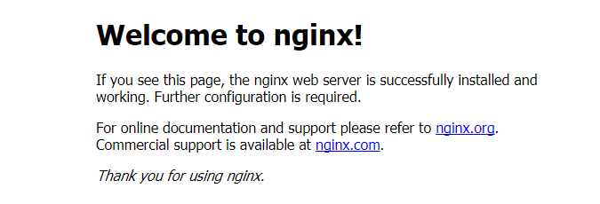

# Nginx 的安装

## Windows 下安装

> Windows 下的 Nginx 不能用于生产，一般用于开发目的或者尝鲜体验。

### 下载 Nginx

从 [官方网站](http://nginx.org/en/download.html) 下载稳定版本。

以 nginx/Windows-1.18.0 为例，直接下载 nginx-1.18.0.zip。

下载后解压，解压后如下：

<div style="text-align: center;">
  
  <p style="text-align: center; color: #888;">（Nginx for Windows）</p>
</div>

### 启动 Nginx

有两种方法启动 Nginx：

* 直接双击 nginx.exe，双击后一个黑色的弹窗一闪而过。（不建议用这种方式）
* 打开 cmd 命令窗口，切换到 Nginx 解压目录下，输入命令 `nginx.exe`，回车即可。

### 检查 Nginx 是否启动成功

直接在浏览器地址栏输入网址 `http://localhost:80` 回车，出现以下页面说明启动成功：

<div style="text-align: center;">
  
  <p style="text-align: center; color: #888;">（Welcome to nginx）</p>
</div>

### 配置监听

Nginx 的配置文件是 `conf/` 目录下的 `nginx.conf`，默认配置的 Nginx 监听的端口为 80，如果 80 端口被占用可以修改为未被占用的端口即可。

```text
server {
    listen       80;
    server_name  localhost;
```

当我们修改了 Nginx 的配置文件 `nginx.conf` 时，不需要关闭 Nginx 后重新启动 Nginx，只需要执行命令 `nginx -s reload` 即可让改动生效。

### 关闭 Nginx

如果使用 cmd 命令窗口启动 Nginx，关闭 cmd 窗口是不能结束 Nginx 进程的，可使用两种方法关闭 Nginx：

* 输入 Nginx 命令 `nginx -s stop`（快速停止 Nginx）或 `nginx -s quit`（完整有序的停止 Nginx）
* 使用 taskkill：`taskkill /f /t /im nginx.exe`

> taskkill 是用来终止进程的  
> /f 是强制终止  
> /t 终止指定的进程和任何由此启动的子进程  
> /im 根据名字指定要终止的进程

## Linux 下安装

有三种安装方式：

* 编译安装：根据源码，根据实际业务需求，需要什么功能，编译时添加相应的模块。这种方式可以让 Nginx 最轻量化安装。
* 自动化安装：配置好安装源，直接通过自动化安装工具安装。这种方式有可能会因为缺少相关依赖而安装失败。
  * CentOS：`yum install nginx`
  * Ubuntu：`apt-get install nginx`
* 二进制安装：类似于绿色免安装版，把编译安装好的程序封装起来的一个包。

一般采用第一种**编译安装**的方式。

### 准备依赖环境

以下命令，如果你是 root 账户，直接执行即可，不是的话前面加 `sudo` 获取权限。

CentOS（7.6）：

```bash
# 安装 gcc 依赖库
yum install gcc-c++

# 安装 PCRE pcre-devel 依赖库
yum install -y pcre pcre-devel

# 安装 zlib 依赖库
yum install -y zlib zlib-devel

# 安装 OpenSSL 依赖库
yum install -y openssl openssl-devel
```

Ubuntu（16.04、18.04、20.04）：

```bash
# 建议先执行下 apt-get 的更新
apt-get update

# 安装 gcc 和 g++ 依赖库
apt-get install build-essential
apt-get install libtool

# 安装 PCRE pcre-devel 依赖库
apt-get install libpcre3 libpcre3-dev

# 安装 zlib 依赖库（注意 lib 后面是阿拉伯数字 1，不是字母 l）
apt-get install zlib1g-dev

# 安装 OpenSSL 依赖库
apt-get install openssl
apt-get install libssl-dev # 未安装该库会报 SSL modules require the OpenSSL library.
```

> **gcc 依赖库**：安装 Nginx 需要先将官网下载的源码进行编译，编译依赖 gcc 环境，如果没有 gcc 环境，则需要安装。  
> **PCRE pcre-devel 依赖库**：PCRE（Perl Compatible Regular Expressions）是一个 Perl 库，包括 perl 兼容的正则表达式库。Nginx 的 http 模块使用 pcre 来解析正则表达式，所以需要在 Linux 上安装 pcre 库，pcre-devel 是使用 pcre 开发的一个二次开发库，Nginx 也需要此库。  
> **zlib 依赖库**：lib 库提供了很多种压缩和解压缩的方式，Nginx 使用 zlib 对 http 包的内容进行 gzip ，所以需要安装 zlib 库。  
> **OpenSSL 依赖库**：OpenSSL 是一个强大的安全套接字层密码库，囊括主要的密码算法、常用的密钥和证书封装管理功能及 SSL 协议，并提供丰富的应用程序供测试或其它目的使用。Nginx 不仅支持 http 协议，还支持 https（即在ssl协议上传输http），所以需要安装 OpenSSL 库。

### 准备源码包

以下命令，如果你是 root 账户，直接执行即可，不是的话前面加 `sudo` 获取权限。

从 [官方网站](http://nginx.org/en/download.html) 下载稳定版本到任意目录（自己规划好），并解压。

```bash
# 下载
wget http://nginx.org/download/nginx-1.18.0.tar.gz

# 解压并进入解压目录
tar -zxvf nginx-1.18.0.tar.gz
cd nginx-1.18.0/
```

### 配置