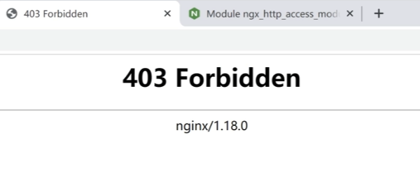

# Nginx 安全访问控制

## 模块介绍

有时候我们需要根据客户端 IP 来限制访问，如果是不允许的 IP 则返回 403 Forbidden，如下所示：

<div style="text-align: center;">
  
  <p style="text-align: center; color: #888;">（403 Forbidden）</p>
</div>

该功能用到了 `ngx_http_access_module` 这个模块，该模块默认是关闭的。

语法：

* 配置允许访问：`allow 地址值;`
* 配置拒绝访问：`deny 地址值;`
* 地址值的形式支持：address | CIDR | unix: | all

可以将它配置在 `http`，`server`，`location`，`limit_except` 中的任一位置。

## 配置案例

假设我们有个网站，要限制外人不能访问管理页面（只允许指定 IP 访问 `/admin` 开始的 uri）。

```bash {8,9}
server {
    listen 80;
    server_name  www.fedbook.cn;
    root /sites/fedbook;
    index index.html;

    location /admin {
        allow 192.168.10.50;
        deny all;
    }
}
```

## 参考资料

* [Module ngx_http_access_module](http://nginx.org/en/docs/http/ngx_http_access_module.html "Module ngx_http_access_module")

（完）
