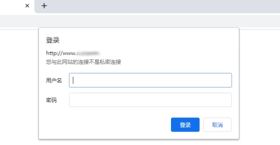

# Nginx 页面安全认证

## 模块介绍

有时候出于权限和安全考虑，我们希望某些页面不允许随便访问，必须通过用户认证才可以访问，如下所示：

<div style="text-align: center;">
  
  <p style="text-align: center; color: #888;">（Nginx Http Auth Basic）</p>
</div>

该功能用到了 `ngx_http_auth_basic_module` 这个模块，该模块默认是关闭的。

语法：

* 配置弹框提示：`auth_basic "提示语";`
* 配置密码路径：`auth_basic_user_file 密码文件路径;`

可以将它配置在 `http`，`server`，`location`，`limit_except` 中的任一位置。

## htpasswd 创建密码文件

首先需要准备用户文件，用户名密码格式为：`用户名:密码`，其中密码不是明文。我们需要借助于 htpasswd 加密工具生成。

查看服务器中是否已经安装了 htpasswd：

```bash
whereis htpasswd
```

如果没有安装，需要先进行安装：

```bash
# Ubuntu 系统下安装 htpasswd
sudo apt-get install apache2-utils

# CentOS 系统下安装 htpasswd
sudo yum install -y httpd-tools
```

htpasswd 工具的语法为：

* htpasswd(选项)(参数)

> * `-c`：创建一个加密文件；
> * `-n`：不更新加密文件，只将加密后的用户名密码显示在屏幕上；
> * `-m`：默认采用 MD5 算法对密码进行加密；
> * `-d`：采用 CRYPT 算法对密码进行加密；
> * `-p`：不对密码进行进行加密，即明文密码；
> * `-s`：采用 SHA 算法对密码进行加密；
> * `-b`：在命令行中一并输入用户名和密码而不是根据提示输入密码；
> * `-D`：删除指定的用户。


通过 htpasswd 工具生成用户名密码文件给 Nginx 使用：

```bash
# 进入 Nginx 文件
cd /usr/local/nginx/

# 如果是首次创建，通过 -c 选项可以在当前目录创建一个加密文件
htpasswd -bc passwd.db admin 123456

# 去掉 -c 选项，即可在第一个用户之后添加第二个用户
htpasswd -b passwd.db test 123456

# 利用 htpasswd 命令删除用户名和密码
htpasswd -D passwd.db test

# 如果要利用 htpasswd 命令修改密码
# 先删除指定用户，再创建用户即可实现修改密码的功能
```

出于安全考虑，我们最好修改一下用户文件 `passwd.db` 的权限：

```bash
# 修改用户文件权限 
chmod 400 /usr/local/nginx/passwd.db

# 修改用户文件属主和属组
chown root:root /usr/local/nginx/passwd.db
```

此时的 Nginx 文件目录结构：

```bash
├── nginx
    │── html
    │── logs
    │── sbin
    │── ...
    │── passwd.db              # 用户文件，存储用户认证信息
    └── conf
        ├── ...
        ├── nginx.conf         # 主配置文件
        └── vhosts             # 子配置文件的目录
            ├── web.conf       # 子配置文件 1
            └── api.conf       # 子配置文件 2
```

## 配置案例

前端我们已经通过使用 htpasswd 工具，在 `/usr/local/nginx/` 目录下生成了用户文件 `passwd.db`，接下来在 Nginx 配置文件中进行配置。

假设我们有个网站，要限制外人不能访问管理页面（只允许指定 IP 访问 `/admin` 开始的 uri）。

```bash {9,10}
server {
    listen 80;
    server_name  www.fedbook.cn;
    root /sites/fedbook;
    index index.html;

    location /download {
        autoindex on;
        auth_basic           "请输入用户名及密码";
        auth_basic_user_file /usr/local/nginx/passwd.db;
    }
}
```

## 参考资料

* [Module ngx_http_auth_basic_module](https://nginx.org/en/docs/http/ngx_http_auth_basic_module.html "Module ngx_http_auth_basic_module")

（完）
