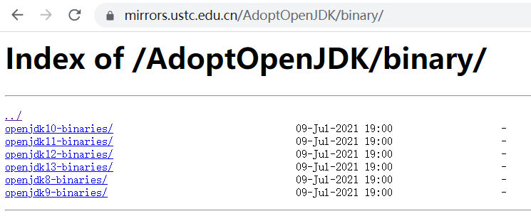

# Nginx 文件列表功能

## 模块介绍

有时候我们需要搭建一个文件下载平台，类似镜像站的内容列表，供用户下载，如下所示：

<div style="text-align: center;">
  
  <p style="text-align: center; color: #888;">（中国科学技术大学开源镜像站）</p>
</div>

该功能用到了 `ngx_http_autoindex_module` 这个模块，该模块默认是关闭的。

语法：

* 开启文件列表功能：`autoindex on;`

可以将它配置在 `http`，`server`，`location` 中的任一位置。

## 配置案例

需要将 `/sites/fedbook/download/` 目录变成可下载的内容列表，只需配置如下 `location`：

```bash {8}
server {
    listen 80;
    server_name  www.fedbook.cn;
    root /sites/fedbook;
    index index.html;

    location /download {
        autoindex on;
    }
}
```

## 参考资料

* [Module ngx_http_autoindex_module](https://nginx.org/en/docs/http/ngx_http_autoindex_module.html "Module ngx_http_autoindex_module")

（完）
