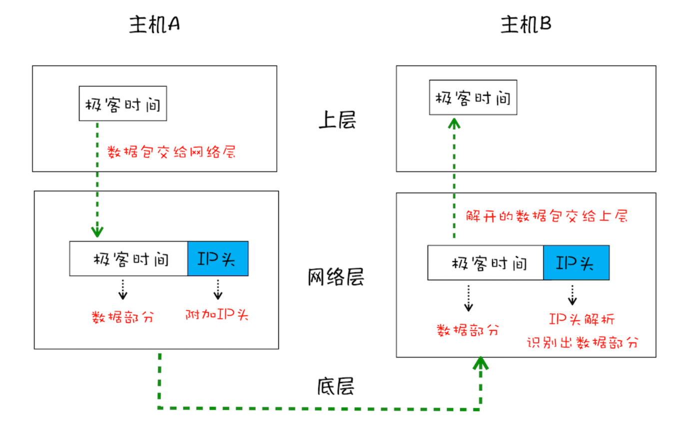
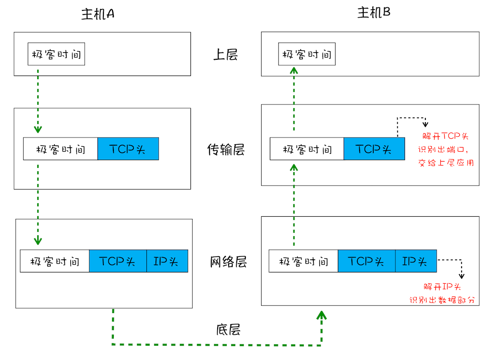
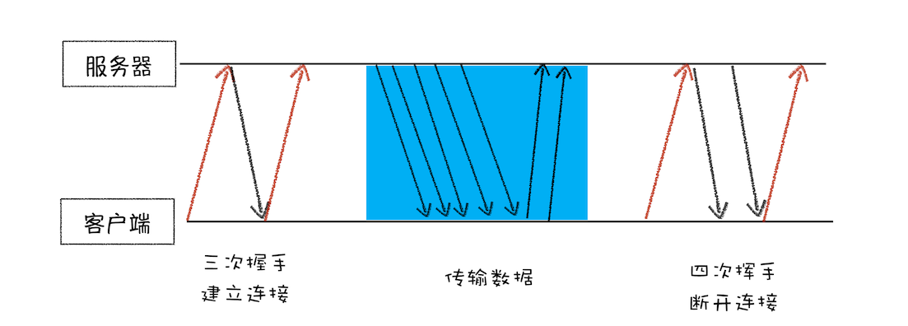
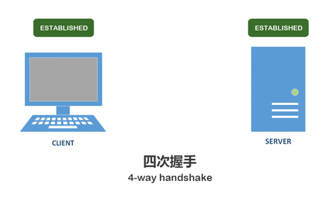
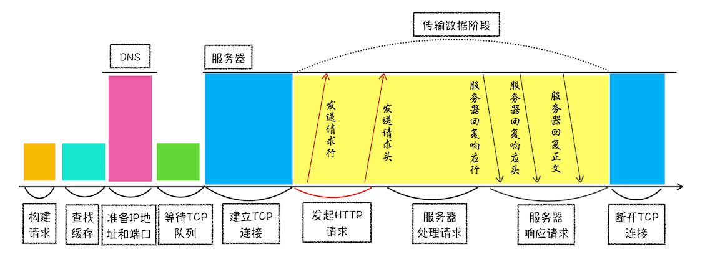
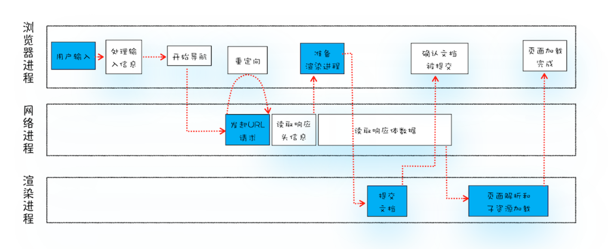

# 浏览器宏观认识

## 浏览器的架构

### 线程和进程

**线程和进程的区别**：
* 多线程可以并行处理任务，但是线程是不能单独存在的，它是由进程来启动和管理的。
* 一个进程就是一个程序的运行实例。启动一个程序的时候，操作系统会为该程序创建一块内存，用来存放代码、运行中的数据和一个执行任务的主线程，我们把这样的一个运行环境叫进程。

**进程和线程的关系**：

* 线程需要依附于进程，而进程中使用多线程并行处理能提升运算效率。
* 进程中的任意一线程执行出错，都会导致整个进程的崩溃。
* 线程之间共享进程中的数据。
* 当一个进程关闭后，操作系统会回收进程所占用的内存。
* 进程之间的内容相互隔离。

**过去的单进程浏览器**：

* 不稳定。单进程中的插件、渲染线程崩溃导致整个浏览器崩溃。
* 不流畅。脚本（死循环）或插件会使浏览器卡顿。
* 不安全。插件和脚本可以获取到操作系统任意资源。

**现在的多进程浏览器**：

* 解决不稳定。进程相互隔离，一个页面或者插件崩溃时，影响仅仅时当前插件或者页面，不会影响到其他页面。
* 解决不流畅。脚本阻塞当前页面渲染进程，不会影响到其他页面。
* 解决不安全。采用多进程架构使用沙箱。沙箱看成时操作系统给进程上来一把锁，沙箱的程序可以运行，但是不能在硬盘上写入任何数据，也不能在敏感位置读取任何数据。

### Chrome 架构

在《浏览器工作原理与实践》中描述的 Chrome 进程架构如下如所示：

<div style="text-align: center;">
  
  <p style="text-align: center; color: #888;">（Chrome 进程架构图，图来源于网络）</p>
</div>

根据实际观察，目前最新的架构又有了很多新的变化，主要是模块分割更加细化了。但大体的进程划分还是如上图所示，包括了：1 个浏览器（Browser）主进程、1 个 GPU 进程、1 个网络（NetWork）进程、多个渲染进程和多个插件进程。

* **浏览器进程**：主要负责界面显示、用户交互、子进程管理，同时提供存储等功能。
* **渲染进程**：核心任务是将 HTML、CSS 和 JavaScript 转换为用户可以与之交互的网页，排版引擎 Blink 和 JavaScript 引擎 V8 都是运行在该进程中，默认情况下，Chrome 会为每个 Tab 标签创建一个渲染进程。出于安全考虑，渲染进程都是运行在沙箱模式下。
* **GPU 进程**：GPU 的使用初衷是为了实现 3D CSS 的效果，但随着网页、Chrome 的 UI 界面都选择采用 GPU 来绘制，这使得 GPU 成为浏览器普遍的需求。最后，Chrome 在其多进程架构上也引入了 GPU 进程。
* **网络进程**：主要负责页面的网络资源加载，之前是作为一个模块运行在浏览器进程里面的，直至最近才独立出来，成为一个单独的进程。
* **插件进程**：主要是负责插件的运行，因插件易崩溃，所以需要通过插件进程来隔离，以保证插件进程崩溃不会对浏览器和页面造成影响。

不过目前的这种架构也存在问题：一是资源占用高，二是体系架构复杂。

::: tip 拓展：未来面向服务的架构
李兵老师提到目前 Chrome 官方团队使用**面向服务的架构**思想设计了新的 Chrome 架构。这种架构的特点就是将各种模块重构成独立的服务，每个服务都可以在独立的进程中运行，访问服务必须使用定义好的接口，通过 IPC 来通信，使得系统更内聚、松耦合、易维护和拓展。
:::

## TCP/IP 协议

> 仅重点介绍在 Web 世界中的 TCP/IP 是如何工作的，更系统的网络协议知识未来会专门针对性地去学习。

### IP：把数据包送达目的主机

互联网中的数据是通过数据包来传输的。如果发送的数据很大，那么该数据就会被拆分为很多小数据包来传输。数据包要在互联网上进行传输，就要符合**网际协议**（Internet Protocol，简称 **IP**）标准。

计算机的地址就称为 IP 地址，访问任何网站实际上只是你的计算机向另外一台计算机请求信息。

以一个数据包从主机 A 到主机 B 的传输过程为例，可以把网络简单分为三层结构，如下图所示：

<div style="text-align: center;">
  
  <p style="text-align: center; color: #888;">（简化的 IP 网络三层传输模型，图来源于网络）</p>
</div>

* 上层将含有「极客时间」的数据包交给网络层。
* 网络层再将 IP 头附加到数据包上，组成新的 **IP 数据包**，并交给底层。
  * IP 通过 IP 地址信息把数据包发送给指定的电脑。
  * IP 头是 IP 数据包开头的信息，包含 IP 版本、源 IP 地址、目标 IP 地址、生存时间等信息。
* 底层通过物理网络将数据包传输给主机 B。
* 数据包被传输到主机 B 的网络层，在这里主机 B 拆开数据包的 IP 头信息，并将拆开来的数据部分交给上层。
* 最终，含有「极客时间」信息的数据包就到达了主机 B 的上层了。

### UDP：把数据包送达应用程序

IP 是非常底层的协议，只负责把数据包传送到对方电脑，如果要让对方电脑知道该数据包具体是发给哪个程序的，就需要基于 IP 之上能和应用打交道的协议。

最常见的是「**用户数据包协议**（User Datagram Protocol）」，简称 UDP。

为了支持 UDP 协议，前面的三层结构将被扩充为四层结构，在网络层和上层之间增加了传输层，如下图所示：

<div style="text-align: center;">
  
  <p style="text-align: center; color: #888;">（简化的 UDP 网络四层传输模型，图来源于网络）</p>
</div>

此时这个数据包从主机 A 到主机 B 的传输过程为：

* 上层将含有「极客时间」的数据包交给传输层。
* 传输层会在数据包前面附加上 UDP 头，组成新的 UDP 数据包，再将新的 UDP 数据包交给网络层。
  * UDP 引入了端口号，通过端口号可以把数据包发送给正确的程序。
  * 端口号会被装进 UDP 头里面，UDP 头再和原始数据包合并组成新的 UDP 数据包。
  * UDP 头中除了目的端口，还有源端口号等信息。
* 网络层再将 IP 头附加到数据包上，组成新的 IP 数据包，并交给底层。
* 数据包被传输到主机 B 的网络层，在这里主机 B 拆开 IP 头信息，并将拆开来的数据部分交给传输层。
* 在传输层，数据包中的 UDP 头会被拆开，**并根据 UDP 中所提供的端口号，把数据部分交给上层的应用程序**。
* 最终，含有「极客时间」信息的数据包就抵达了主机 B 上层应用程序这里。

**UDP 的优点**：

* 传输速度非常快，可以应用在一些关注速度、对数据完整性要求不严格的领域，如在线视频、互动游戏等。

**UDP 的缺点**：

* 不保证数据完整性，对于错误的数据包，UDP 不提供重发机制，只是丢弃当前的包。
* 大文件会被拆分成很多小的数据包来传输，这些小的数据包会经过不同的路由，并在不同的时间到达接收端，而 UDP 协议并不知道如何组装这些数据包，从而把这些数据包还原成完整的文件。

### TCP：把数据完整地送达应用程序

为了解决 UDP 的数据可靠性问题，就有了「**传输控制协议**（Transmission Control Protocol）」。

它有下面两个特点：

* 对于数据包丢失的情况，TCP 提供重传机制。
* TCP 引入了数据包排序机制，用来保证把乱序的数据包组合成一个完整的文件。

TCP 下的单个数据包的传输过程，如下图所示：

<div style="text-align: center;">
  
  <p style="text-align: center; color: #888;">（简化的 TCP 网络四层传输模型，图来源于网络）</p>
</div>

TCP 单个数据包的传输流程和 UDP 流程差不多，不同的地方在于，TCP 头除了包含了目标端口和本机端口号外，还提供了用于排序的序列号，以便接收端通过序号来重排数据包，从而保证了一块大的数据传输的完整性。

那么 TCP 是如何保证重传机制和数据包的排序功能的呢？

一个完整的 TCP 连接的生命周期包括了「**建立连接**」、「**传输数据**」和「**断开连接**」三个阶段，以客户端主动向服务器发起连接为例，如下图所示：

<div style="text-align: center;">
  
  <p style="text-align: center; color: #888;">（一个 TCP 连接的生命周期，图来源于网络）</p>
</div>

* **首先，建立连接阶段**。这个阶段客户端和服务器之间总共要发送三个数据包以确认连接的建立（**三次握手**）。
  * 客户端：发送 SYN         &nbsp;&emsp;&emsp;&emsp;&emsp;--- 请求建立新连接
  * 服务器：发送 SYN 和 ACK  &nbsp;&nbsp;&nbsp;--- 服务器能正常接收客户端发送的数据，同意创建新连接
  * 客户端：发送 ACK         &nbsp;&emsp;&emsp;&emsp;&emsp;--- 确认收到服务器端同意连接的信号
  <div style="text-align: center;">
    
    <p style="text-align: center; color: #888;">（三次握手的动态过程，图来源于网络）</p>
  </div>
* **其次，传输数据阶段**。在该阶段，服务器需要对每个数据包进行确认操作。
  * 客户端：发送数据包。
  * 服务器：接收到数据包，并发送确认数据包给客户端。同时按照 TCP 头中的序号为数据包排序。
  * 客户端：如果在规定时间内没有接收到客户端反馈的确认消息，则判断为数据包丢失，触发重发机制。
* **最后，断开连接阶段**。数据传输完毕之后，会通过四个数据包的交互来保证双方都能断开连接（**四次挥手**）。
  * 客户端：发送 FIN         &nbsp;&nbsp;&emsp;&emsp;&emsp;&emsp;--- 请求释放连接
  * 服务器：发送 ACK         &nbsp;&emsp;&emsp;&emsp;&emsp;--- 接收到客户端发送的释放连接的请求
  * 服务器：发送 FIN 和 ACK  &nbsp;&nbsp;&nbsp;&nbsp;--- 已经准备好释放连接了（这里的 ACK 并不是上一次发给客户端的 ACK）
  * 客户端：发送 ACK         &nbsp;&emsp;&emsp;&emsp;&emsp;--- 接收到服务器准备好释放连接的信号
  <div style="text-align: center;">
    
    <p style="text-align: center; color: #888;">（四次挥手的动态过程，图来源于网络）</p>
  </div>

## HTTP 请求流程

HTTP 协议是建立在 TCP 连接基础之上的。通常由浏览器发起请求，用来向服务器获取不同类型的文件，例如 HTML 文件、CSS 文件、JavaScript 文件、图片、视频等。

### 带着问题去学习

思考两个问题：

* 为什么通常在第一次访问一个站点时，打开速度很慢，当再次访问这个站点时，速度就很快了？
* 当登录过一个网站之后，下次再访问该站点，就已经处于登录状态了，这是怎么做到的呢？

### 浏览器地址栏键入域名后的动作

在浏览器地址栏里键入网站域名会完成的动作：

* **构建请求**。浏览器构建请求行信息，构建好后，准备发起网络请求。（例如：`GET /index.html HTTP1.1`）
* **查找缓存**。在真正发起请求前浏览器会查询缓存中是否有请求资源副本，有则拦截请求，返回资源副本，否则进入网络请求。
* **准备 IP 和端口**。HTTP 网络请求需要和服务器建立 TCP 连接，而建立 TCP 连接需要准备 IP 地址和端口号，浏览器需要请求 DNS 返回域名对应的 IP，同时会缓存域名解析结果，供下次查询使用。如果 URL 没有特别指明端口号，那么 HTTP 协议默认是 `80` 端口。
* **等待 TCP 队列**。Chrome 有个机制，同一个域名同时最多只能建立 6 个 TCP 连接，超过则会进入排队等待状态。
* **建立 TCP 连接**。TCP 通过「三次握手」建立连接，传输数据，「四次挥手」断开连接。
* **发送 HTTP 请求**。建立 TCP 连接后，浏览器就可以和服务器进行 HTTP 数据传输了，首先会向服务器发送请求行，然后以请求头形式发送一些其他信息，如果是 POST 请求还会发送请求体。
* **服务器处理并返回请求**。服务器返回的响应数据包括**响应行**（协议版本、状态码），**响应头**，**响应体**。
* **服务器断开 TCP 连接**。通常服务器向客户端返回了请求数据后，就要关闭 TCP 连接。如果请求头或者响应头有 `Connection: keep-alive`，那么 TCP 保持连接状态。
  * 保持 TCP 连接可以省去下次请求时需要建立连接的时间，提升资源加载速度。
* **重定向**。如果响应行返回的状态码是 301，代表的重定向，此时浏览器就会从响应头的 Location 字段中获取目标地址，并使用该地址重新导航。

总结 HTTP 请求流程如下图所示：

<div style="text-align: center;">
  
  <p style="text-align: center; color: #888;">（HTTP 请求流程示意图，图来源于网络）</p>
</div>

### 问题解答

为什么很多站点第二次打开速度会很快？
  
* **DNS 缓存**：DNS 缓存比较简单，它主要就是在浏览器本地把对应的 IP 和域名关联起来。
* **页面资源缓存**：网站把很多资源都缓存在了本地，浏览器可以直接使用本地副本来回应请求，而不会产生真实的网络请求，
  * 服务器返回 HTTP 响应头后，浏览器通过响应头中的 `Cache-Control` 字段来设置是否缓存该资源，以及缓存过期时长。
  * 缓存过期后，服务器通过 HTTP 请求头中的 `If-None-Match` 字段值来判断请求的资源是否有更新。如果没有更新，就返回 304 状态码表示缓存可以继续使用，如果资源有更新就返回最新资源给浏览器。

登录状态是如何保持的？

* 服务器验证用户登录信息正确，就会生成一段表示用户身份的字符串，并把该字符串写到响应头的 `Set-Cookie` 字段里。
* 浏览器接收到响应头并解析，如果发现有 `Set-Cookie` 字段，就会把这个字段信息保存到本地。
* 当用户再次访问时，浏览器在发起 HTTP 请求之前，会读取之前保存的 Cookie 数据，并把数据写进请求头里的 `Cookie` 字段里，然后浏览器再将请求头发送给服务器。
* 服务器在收到 HTTP 请求头数据之后，就会查找请求头里面的 `Cookie` 字段信息，获取到信息后，服务器查询后台，并判断该用户是已登录状态，然后生成含有该用户信息的页面数据，并把生成的数据发送给浏览器。
* 浏览器在接收到该含有当前用户的页面数据后，就可以正确展示用户登录的状态信息了。

## 导航流程：输入 URL 到页面展示

这几乎是一道面试必问的题目：「浏览器从输入 URL 到页面展示，中间发生了什么？」

### 完整流程小结

下面总结一下这个问题该如何回答（以下只是我的一种回答，并不是标准答案，每个人都应该有自己的理解和侧重点）：

* 用户输入 URL 并回车
* 浏览器进程检查 URL，组装协议，构成完整的 URL
* 浏览器进程通过进程间通信（IPC）把 URL 请求发送给网络进程
* 网络进程接收到 URL 请求后检查本地缓存是否缓存了该请求资源，如果有则将该资源返回给浏览器进程
* 如果没有，网络进程向 Web 服务器发起 HTTP 请求（网络请求），请求流程如下：
  * 进行 DNS 解析，获取服务器 IP 地址和端口（URL 里若未指定端口，则 HTTP 请求默认是 `80`，HTTPS 默认是 `443`）
  * 利用 IP 地址和服务器建立 TCP 连接
  * 构建请求头信息
  * 发送请求头信息
  * 服务器响应后，网络进程接收响应头和响应信息，并解析响应内容
* 网络进程解析响应流程；
  * 检查状态码，如果是 `301`/`302`，则需要重定向，从 `Location` 自动中读取地址，重新把 URL 请求发送给网络进程（重复上面的操作），如果是 `200`，则继续处理请求。
  * `200` 响应处理：检查响应类型 `Content-Type`，如果是字节流类型，则将该请求提交给下载管理器，该导航流程结束，不再进行后续的渲染，如果是 html 则通知浏览器进程准备渲染进程准备进行渲染。
* 准备渲染进程
  * 浏览器进程检查当前 URL 是否和之前打开的渲染进程根域名是否相同，如果相同，则复用原来的进程，如果不同，则开启新的渲染进程
* 传输数据、更新状态
  * 渲染进程准备好后，浏览器进程向渲染进程发起「提交文档」的消息，渲染进程接收到消息和网络进程建立传输数据的「管道」
  * 文档数据传输完成后，渲染进程向浏览器进程返回「确认提交」的消息
  * 浏览器进程收到「确认提交」的消息后，会更新浏览器界面状态，包括安全状态、地址栏的 URL、前进后退的历史状态、更新 Web 页面，此时的 Web 页面是空白页
* 渲染进程对文档进行页面解析和子资源加载，生成最终页面
  * 构建 DOM 树：通过 HTML 解析器将 HTML 转换成 DOM 树。
  * 样式计算：渲染引擎将 CSS 文本转换为 styleSheets，计算出 DOM 节点的样式。
  * 布局：创建布局树（只包含可见元素的树），并计算元素的布局信息。
  * 分层：对布局树进行分层，并生成分层树。
  * 图层绘制：为每个图层生成绘制列表，并将其提交到合成线程。
  * 栅格化：合成线程将图层分成图块，通过栅格化把图块转换为位图。
  * 合成：所有图块都被光栅化后，渲染引擎中的合成线程发送一个绘制图块的命令「DrawQuad」给浏览器进程。
  * 显示：浏览器进程根据接收到的「DrawQuad」消息绘制页面，并显示到显示器上。

### 完整流程示意图

下图是一张李兵老师梳理的「从输入 URL 到页面展示完整流程示意图」：

<div style="text-align: center;">
  
  <p style="text-align: center; color: #888;">（从输入 URL 到页面展示完整流程示意图，图来源于网络）</p>
</div>

从图中可以看出，整个过程需要各个进程之间的配合。

另外 GitHub 上还有个仓库，讲了从浏览器地址框输入 `google.com` 后会发生什么：[what-happens-when-zh_CN](https://github.com/skyline75489/what-happens-when-zh_CN)

## 渲染流程：HTML、CSS 和 JavaScript 是如何变成页面的

上面对「浏览器从输入 URL 到页面展示」的整个流程做了小结，但其实最后一步在获得到 HTML、CSS 和 JavaScript 文件后，对渲染进程做的工作只是做了简单的概括，其实每一步里面还有一些细节知识点，这里分别展开一下作为补充。

实际上如果把 HTML、CSS、JavaScript 数据当作输入源，渲染模块作为黑盒子的加工厂，它是经过了很复杂的流程才最终输出为屏幕上的像素。

<div style="text-align: center;">
  
  <p style="text-align: center; color: #888;">（简单的渲染流程示意图，图来源于网络）</p>
</div>

### 渲染流程各步骤细节

一个完整的渲染流程还是**复制上面整理的 8 个步骤**，然后在每个步骤之下整理一些细节知识点：

* 构建 DOM 树：通过 HTML 解析器将 HTML 转换成 DOM 树。
* 样式计算：渲染引擎将 CSS 文本转换为 styleSheets，计算出 DOM 节点的样式。
  * 转成 styleSheets 后，会先进行属性值的标准化操作，再根据 CSS 的继承规则和层叠规则计算每个节点的具体样式。
* 布局：创建布局树（只包含可见元素的树），并计算元素的布局信息。
  * 布局是为了计算 DOM 树中可见元素的几何位置，因为前一步只是获得了元素样式，并不知道它应该放哪。
  * 布局树会忽略不可见节点，比如 `head` 标签，和使用了 `display:none` 属性的元素等。
  * 目前的布局操作中，布局树既是输入内容也是输出内容，Chrome 团队为了分离输入和输出，正在重构布局代码，下一代布局系统叫 LayoutNG。
* 分层：对布局树进行分层，并生成分层树。
  * 分层是为了实现页面中一些复杂的效果：3D 变换、页面滚动，或者使用 z-indexing 做 z 轴排序等。
  * 如果一个节点没有对应的层，那么这个节点就从属于父节点的图层。
  * 拥有层叠上下文属性的元素（比如定位属性元素、透明属性元素、CSS 滤镜属性元素）提升为单独的一层，需要裁剪（clip）的地方也会被创建为图层。
* 图层绘制：为每个图层生成绘制列表，并将其提交到合成线程。
  * 把一个图层的绘制拆分成很多小的绘制指令，然后再把这些指令按照顺序组成一个待绘制列表。（就跟绘画一样，先画什么，再画什么……）
* 栅格化：合成线程将图层分成图块，通过栅格化把图块转换为位图。
  * 为了提高性能，即不绘制视口（viewport）以外的图层，合成线程会将图层划分为图块。
  * 图块是栅格化执行的最小单位，合成线程会按照视口附近的图块来优先生成位图。
  * 通常栅格化过程都会使用 GPU 来加速生成，这是一种跨进程操作（GPU 操作是运行在 GPU 进程中）。
* 合成：所有图块都被光栅化后，渲染引擎中的合成线程发送一个绘制图块的命令「DrawQuad」给浏览器进程。
* 显示：浏览器进程根据接收到的「DrawQuad」消息绘制页面，并显示到显示器上。

下图是一张李兵老师梳理的「完整的渲染流水线示意图」：

<div style="text-align: center;">
  
  <p style="text-align: center; color: #888;">（完整的渲染流水线示意图，图来源于网络）</p>
</div>

### 重排、重绘、和合成

这是三个和渲染流水线相关的概念 —— 「重排」、「重绘」和「合成」，这三个概念与 Web 的性能优化有关。

* 重排：更新了元素的几何属性
  * 如果修改了元素的几何属性（元素的位置和尺寸大小），就会触发重新布局、解析之后的一系列子阶段。
  * 重排需要更新完整的渲染流水线，所以开销也是最大的。
  * 常见的引起重排的操作：
    * 添加或者删除可见的 DOM 元素。
    * 元素尺寸改变 —— 边距、填充、边框、宽度和高度。
    * 内容变化，比如用户在 `input` 框中输入文字。
    * 浏览器窗口尺寸改变 —— `resize` 事件发生时。
    * 计算 `offsetWidth` 和 `offsetHeight` 属性。
    * 设置 `style` 属性的值。
* 重绘：更新元素的绘制属性
  * 如果修改了元素的外观属性（颜色、背景、边框等），就会直接进入了绘制阶段，然后执行之后的一系列子阶段。
  * 因为几何位置没有变换，所以布局阶段不会被执行，省去了布局和分层阶段，所以执行效率会比重排操作要高一些。
* 合成：直接合成阶段
  * 如果更改的是一个既不要布局也不要绘制的属性，渲染引擎将跳过布局和绘制，只执行后续的合成操作。
  * 例如：使用 CSS3 的 `transform` 来实现动画效果，比使用 JS 修改 style 高效。

常见的引起重排的属性和方法：

|                         |                          |                    |            |
|:----------------------- |:-------------------------|:-------------------|:-----------|
| width                   | height                   | margin             | padding    |
| display                 | border                   | position           | overflow   |
| clientWidth             | clientHeight             | clientTop          | clientLeft |
| offsetWidth             | offsetHeight             | offsetTop          | offsetLeft |
| scrollWidth             | scrollHeight             | scrollTop          | scrollLeft |
| scrollIntoView()        | scrollTo()               | getComputedStyle() |            |
| getBoundingClientRect() | scrollIntoViewIfNeeded() | 	                  |            |

常见的引起重绘的属性：

|                 |                  |                     |                   |
|:--------------- |:-----------------|:--------------------|:------------------|
| color           | border-style     | visibility          | background        |
| text-decoration | background-image | background-position | background-repeat |
| outline-color   | outline          | outline-style       | border-radius     |
| outline-width   | box-shadow       | background-size     |                   |

### 优化策略：减少重排和重绘

#### 1）对 dom 属性的读写操作要分离

```javascript
// 这段代码会触发 4 次重排 + 重绘
// 因为在 console 中用到的这几个属性虽然跟操作修改的值没关联, 
// 但浏览器为了给我们最精确的值, 会立即重排 + 重绘.
// 
// 这种会强制刷新渲染队列并触发立即重排的属性还有:
// offsetTop, offsetLeft, offsetWidth, offsetHeight
// scrollTop, scrollLeft, scrollWidth, scrollHeight
// clientTop, clientLeft, clientWidth, clientHeight
// getComputedStyle(), 或者 IE 的 currentStyle
div.style.left = '10px';
console.log(div.offsetLeft);
div.style.top = '10px';
console.log(div.offsetTop);
div.style.width = '20px';
console.log(div.offsetWidth);
div.style.height = '20px';
console.log(div.offsetHeight);

// 这段代码只会触发 1 次重排 + 重绘
// 因为操作值的时候, 只有等到渲染队列中到了一定大小, 或一定时间间隔后, 浏览器才会批量执行这些操作;
// 而读取值的时候, 因为渲染队列本来就是空的, 所以并没有触发重排, 仅仅拿值而已.
div.style.left = '10px';
div.style.top = '10px';
div.style.width = '20px';
div.style.height = '20px';
console.log(div.offsetLeft);
console.log(div.offsetTop);
console.log(div.offsetWidth);
console.log(div.offsetHeight);
```

#### 2）使用 class 操作样式，而不是频繁操作 style

虽然现在大部分浏览器有渲染队列优化，不排除有些浏览器以及老版本的浏览器效率仍然低下，所以建议通过改变 `class` 或者 `cssText` 属性集中改变样式。

```javascript
// bad
var left = 10;
var top = 10;
el.style.left = left + "px";
el.style.top  = top  + "px";

// good 
el.className += " theclassname";
// good
el.style.cssText += "; left: " + left + "px; top: " + top + "px;";
```

#### 3）缓存布局信息

```javascript
// bad 强制刷新, 触发两次重排
div.style.left = div.offsetLeft + 1 + 'px';
div.style.top = div.offsetTop + 1 + 'px';

// good 缓存布局信息, 相当于读写分离
var curLeft = div.offsetLeft;
var curTop = div.offsetTop;
div.style.left = curLeft + 1 + 'px';
div.style.top = curTop + 1 + 'px';
```

#### 4）离线改变 DOM

* 隐藏要操作的 DOM  
  在要操作 DOM  之前，通过 `display` 隐藏 DOM ，当操作完成之后（比如修改 100 次后），才将元素的 display 属性设置为可见，因为不可见的元素不会触发重排和重绘。
  ```javascript
  dom.display = 'none'
  // 修改 DOM 样式
  dom.display = 'block'
  ```
* 通过使用 [DocumentFragment](https://developer.mozilla.org/zh-CN/docs/Web/API/DocumentFragment) 创建一个 DOM 碎片，在它上面批量操作 DOM，操作完成之后，再添加到文档中，这样只会触发一次重排。
* 复制节点，在副本上工作，然后替换它。
* 使用现代化框架，例如 Vue、React。

#### 5）position 属性为 absolute 或 fixed

position 属性为 absolute 或 fixed 的元素，重排开销比较小，不用考虑它对其他元素的影响。

#### 6）优化动画

* 可以把动画效果应用到 position 属性为 absolute 或 fixed 的元素上，这样对其他元素影响较小。
  * 动画效果还应牺牲一些平滑，来换取速度，这中间的度自己衡量：比如实现一个动画，以 1 个像素为单位移动这样最平滑，但是 reflow 就会过于频繁，大量消耗 CPU 资源，如果以 3 个像素为单位移动则会好很多。
* 启用 GPU 硬件加速
  * GPU 硬件加速是指应用 GPU 的图形性能对浏览器中的一些图形操作交给 GPU 来完成，因为 GPU 是专门为处理图形而设计，所以它在速度和能耗上更有效率。
  * GPU 加速通常包括以下几个部分：Canvas2D，布局合成，CSS3转换（transitions），CSS3 3D 变换（transforms），WebGL 和视频（video）。
  ```css
  /*
   * 根据上面的结论
   * 将 2d transform 换成 3d
   * 就可以强制开启 GPU 加速
   * 提高动画性能
   */
  div {
    transform: translate(10px, 10px);
  }
  div {
    transform: translate3d(10px, 10px, 0);
  }
  ```

#### 7）对 window resize 事件做防抖处理

这个延迟时间视场合而定。

#### 8）不要使用 table 布局

因为 table 中某个元素一旦触发了重排，那么整个 table 的元素都会触发重排。在不得已使用 table 的场合，可以设置 `table-layout: auto;` 或者是 `table-layout:fixed` 这样可以让 table 一行一行的渲染，这种做法也是为了限制重排的影响范围。

#### 9）尽可能不要修改影响范围比较大的 DOM

尽可能限制重排的影响范围，尽可能在低层级的 DOM 节点上作修改。比如要改变 p 标签的样式，class 就不要加在它上层的 div 标签上，通过父元素去影响子元素不好。

#### 10）慎用 CSS 表达式

如果 CSS 里面有计算表达式，每次都会重新计算一遍，都会触发一次重排。

（完）
