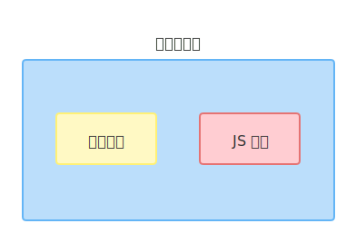
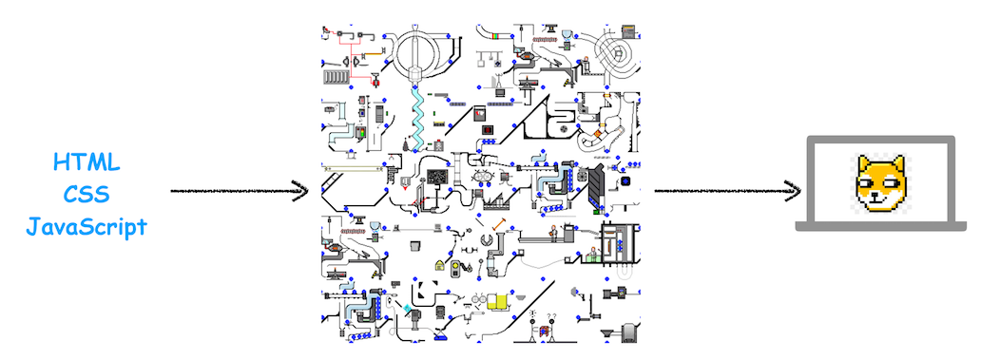

# 浏览器内核与 JavaScript 引擎

## 浏览器内核

不同的浏览器有不同的内核组成：

* **Gecko**：早期被 Netscape 和 Mozilla Firefox 浏览器浏览器使用。
* **Trident**：微软开发，被 IE4 - IE11 浏览器使用，但是 Edge 浏览器已经转向 Blink。
* **Webkit**：苹果基于 KHTML 开发、开源的，用于 Safari，Google Chrome 之前也在使用。
* **Blink**：是 Webkit 的一个分支，Google 开发，目前应用于 Google Chrome、Edge、Opera 等。
* 等等…

我们经常说的浏览器内核指的是浏览器的排版引擎（layout engine），它负责处理 HTML 和 CSS，所以又被称为浏览器引擎（browser engine）、页面**渲染引擎**（rendering engine）或样版引擎。

## JavaScript 引擎

JavaScript 引擎帮助我们将 JavaScript 代码翻译成 CPU 指令来执行。

比较常见的 JavaScript 引擎有：

* SpiderMonkey：第一款 JavaScript 引擎，由 Brendan Eich 开发（也就是 JavaScript 作者）。
* Chakra：微软开发，用于 IE 浏览器。
* JavaScriptCore：WebKit 中的 JavaScript 引擎，Apple 公司开发。
* V8：Google 开发的强大 JavaScript 引擎，也帮助 Chrome 从众多浏览器中脱颖而出。
* 等等…

## 浏览器内核与 JS 引擎的关系

最初内核的概念包括渲染引擎与 JS 引擎，目前习惯直接称渲染引擎为内核，JS 引擎独立。

最初：

  
  
（浏览器内核与 JS 引擎最初的关系）

因此以前称：Chrome 浏览器使用 Chromium 内核，Blink 渲染引擎，V8 JS 引擎。

目前：

  
  
（浏览器内核与 JS 引擎目前的关系）

因此现在称：Chrome 浏览器使用 Blink 内核，V8 JS 引擎。

* **渲染引擎**：Rendering Engine，一般习惯将之称为「浏览器内核」，主要功能是解析 HTML/CSS 进行渲染页面，渲染引擎决定了浏览器如何显示网页的内容以及页面的格式信息。
* **JS 引擎**：专门处理 JavaScript 脚本的虚拟机、解释器，用来解释执行 JS 代码。在早期内核也是包含 JS 引擎的，而现在 JS 引擎越来独立了，可以把它单独提出来。

## 渲染引擎的工作原理

渲染引擎的工作过程相当复杂，所以渲染模块在执行过程中会被划分为很多子阶段，输入的 HTML 经过这些子阶段，最后输出像素。其大致流程如下图所示：

  
  
（简单的渲染流程示意图，图来源于网络）

按照渲染的时间顺序，整个渲染流程可分为如下几个子阶段：构建 DOM 树、样式计算、布局、分层、图层绘制、栅格化、合成和显示。为了方便记忆，每个子阶段都应该重点关注其**输入的内容**，**处理过程**，**输出内容**。

[渲染流程的执行细节](/frontend-basics/browser/execution-details-of-rendering-process/)会在后面单独拎出来整理。

## V8 引擎的工作原理

V8 是用 C++ 编写的 Google 开源高性能 JavaScript 和 WebAssembly 引擎，它用于 Chrome 和 Node.js 等，既可以独立运行，也可以嵌入到任何 C++ 应用程序中。

要深入理解 V8 的工作原理，就需要先搞清楚一些概念和原理，比如编译器（Compiler）、解释器（Interpreter）、抽象语法树（AST）、字节码（Bytecode）、即时编译器（JIT）等概念。

* **编译器**：编译型语言在经过编译器的编译之后，会直接保留机器能读懂的二进制文件，这样每次运行程序时，都可以直接运行该二进制文件，而不需要再次重新编译了。常见的编译型语言有 C/C++、GO 等。
* **解释器**：由解释型语言编写的程序，在每次运行时都需要通过解释器对程序进行动态解释和执行。常见的解释型语言有 Python、JavaScript 等。
* **抽象语法树**：抽象语法树（AST） 是一种特殊的数据结构，它是我们所编写代码的结构化表示。无论是解释型语言还是编译型语言，只有将代码转换成 AST 之后，编译器或者解释器才能理解我们写的代码。
* **字节码**：字节码（Bytecode）是介于 AST 和机器码之间的一种代码。在解释型语言的解释过程中，解释器将源代码转换成抽象语法树（AST），会再基于抽象语法树生成字节码，最后再根据字节码来执行程序、输出结果。
* **即时编译器**：直接编译成机器码的执行效率高，但机器码所占用的空间远远超过了字节码。所以就有了字节码配合解释器和编译器的技术，称为即时编译（JIT）。
  * 具体到 V8，就是指解释器在解释执行字节码的同时，收集代码信息，如果发现有热点代码（一段代码被重复执行多次），后台的编译器就会把该段热点的字节码编译为高效的机器码，并保存起来，以备下次使用。
  * 另外比如 Java 和 Python 的虚拟机也都是基于这种技术实现的，

概括一下 V8 是如何执行一段 JavaScript 代码的：**V8 依据 JavaScript 代码生成 AST 和执行上下文，再基于 AST 生成字节码，然后通过解释器执行字节码，通过编译器来优化编译字节码**。

[V8 引擎的执行细节](/frontend-basics/browser/execution-details-of-v8-engine/)会在后面单独拎出来整理，而且这部分内容也跟 [JavaScript 系列](/frontend-basics/javascript/)的执行上下文、作用域、this 指向、内存管理等知识点关联，属于**重点中的重点**。

（完）
