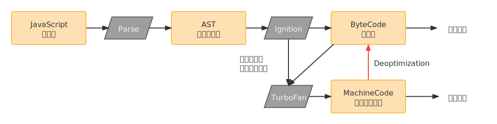

# 浏览器内核与 JavaScript 引擎

## 浏览器内核

不同的浏览器有不同的内核组成：

* **Gecko**：早期被 Netscape 和 Mozilla Firefox 浏览器浏览器使用。
* **Trident**：微软开发，被 IE4-IE11 浏览器使用，但是 Edge 浏览器已经转向 Blink。
* **Webkit**：苹果基于 KHTML 开发、开源的，用于 Safari，Google Chrome 之前也在使用。
* **Blink**：是 Webkit 的一个分支，Google 开发，目前应用于 Google Chrome、Edge、Opera 等。
* 等等…

我们经常说的浏览器内核指的是浏览器的**排版引擎**（layout engine），它负责处理 HTML 和 CSS，所以又被称为浏览器引擎（browser engine）、页面渲染引擎（rendering engine）或样版引擎。

## JavaScript 引擎

JavaScript 引擎帮助我们将 JavaScript 代码翻译成 CPU 指令来执行。

比较常见的 JavaScript 引擎有：

* SpiderMonkey：第一款 JavaScript 引擎，由 Brendan Eich 开发（也就是 JavaScript 作者）。
* Chakra：微软开发，用于 IE 浏览器。
* JavaScriptCore：WebKit 中的 JavaScript 引擎，Apple 公司开发。
* V8：Google 开发的强大 JavaScript 引擎，也帮助 Chrome 从众多浏览器中脱颖而出。
* 等等…

## 浏览器内核与 JS 引擎的关系

最初内核的概念包括渲染引擎与 JS 引擎，目前习惯直接称渲染引擎为内核，JS 引擎独立。

最初：

  
  
（浏览器内核与 JS 引擎最初的关系）

因此以前称：Chrome 浏览器使用 Chromium 内核，Blink 渲染引擎，V8 JS 引擎。

目前：

  
  
（浏览器内核与 JS 引擎目前的关系）

因此现在称：Chrome 浏览器使用 Blink 内核，V8 JS 引擎。

* **渲染引擎**：Rendering Engine，一般习惯将之称为「浏览器内核」，主要功能是解析 HTML/CSS 进行渲染页面，渲染引擎决定了浏览器如何显示网页的内容以及页面的格式信息。
* **JS 引擎**：专门处理 JavaScript 脚本的虚拟机、解释器，用来解释执行 JS 代码。在早期内核也是包含 JS 引擎的，而现在 JS 引擎越来独立了，可以把它单独提出来。

## V8 引擎的原理

V8 是用 C++ 编写的 Google 开源高性能 JavaScript 和 WebAssembly 引擎，它用于 Chrome 和 Node.js 等，既可以独立运行，也可以嵌入到任何 C++ 应用程序中。

在解析 JavaScript 方面，它的架构流程如下图所示：

  
  
（V8 引擎的原理，图修改自网络）

V8 引擎本身的源码非常复杂，大概有超过 100w 行 C++ 代码，作为前端开发者我暂时没有对它进行深入研究。只是通过了解它的架构，了解它是如何对 JavaScript 执行的：

* **Parse** 模块会将 JavaScript 代码转换成 AST（抽象语法树），这是因为解释器并不直接认识 JavaScript 代码。
  * 如果函数没有被调用，那么是不会被转换成 AST 的。
* **Ignition** 是一个解释器，会将 AST 转换成 ByteCode（字节码）
  * 同时会收集 TurboFan 优化所需要的信息（比如函数参数的类型信息，有了类型才能进行真实的运算）。
  * 如果函数只调用一次，Ignition 会执行解释执行 ByteCode。
* **TurboFan** 是一个编译器，可以将字节码编译为 CPU 可以直接执行的机器码。
  * 如果一个函数被多次调用，那么就会被标记为**热点函数**，那么就会**经过 TurboFan 转换成优化的机器码，提高代码的执行性能**。
  * 但是，**机器码实际上也会被还原为 ByteCode**，这是因为如果后续执行函数的过程中，**类型发生了变化（比如 `sum` 函数原来执行的是 `number` 类型，后来执行变成了 `string` 类型）**，之前优化的机器码并不能正确的处理运算，就会逆向的转换（Deoptimization）成字节码。

总结整个过程：在形成抽象语法树之后，解释器会翻译成字节码。等到真正运行的时候，再将字节码转换成汇编代码，并执行 CPU 可以理解的机器码。

转成字节码的优点是字节码可以跨平台，在需要的时候转换成对应平台的机器指令就能运行。缺点是每次**字节码 --> 汇编指令 --> 执行机器指令**这样的过程比较耗费性能。

鉴于这个缺点，V8 就考虑把**热点函数的字节码直接转换成对应平台的机器码**存储下来，等真正运行的时候直接执行机器码就可以了。对于只执行一次的函数，就保持原来的逻辑以节省空间。

这么做性能问题解决了，但又引入了新的麻烦：因为 JavaScript 是动态语言，不会对类型做检测。像 `sum` 函数这种，传入的参数类型不一样，其内部执行的逻辑是不一样的（数字是相加，字符串是拼接）。此时 V8 就引入了 Deoptimization 操作，一旦发现执行操作不一样，就把机器码反向转成字节码。

根据这个底层原理可知，出于优化考虑，我们在调用某个函数的时候应该尽量传相同类型的参数。所以从某种程度上来说，TypeScript 编译出来的最终 JS 代码，会比我们平时直接写的 JS 代码运行效率高一些。

::: tip 相关文档
* [Parse 的 V8 官方文档](https://v8.dev/blog/scanner)
* [Ignition 的 V8 官方文档](https://v8.dev/blog/ignition-interpreter)
* [TurboFan 的 V8 官方文档](https://v8.dev/blog/turbofan-jit)
:::

## V8 执行的细节

  
  
（V8 引擎的解析图，图片来源于官方文档）

上面这张图来自于 [V8 官方文档](https://v8.dev/blog/scanner)，它描述了 V8 执行的细节 —— JavaScript 源码是如何被解析（Parse 过程）的：

* Blink 将源码交给 V8 引擎，Stream 获取到源码并且进行编码转换。
* Scanner 会进行词法分析（lexical analysis），词法分析会将代码转换成 tokens。
* 接下来 tokens 会被转换成 AST 树，经过 Parser 和 PreParser：
  * Parser 就是直接将 tokens 转成 AST 树架构。
  * PreParser 称之为预解析，为什么需要预解析呢？
    * 这是因为并不是所有的 JavaScript 代码，在一开始时就会被执行。那么对所有的 JavaScript 代码进行解析，必然会影响网页的运行效率；
    * 所以 V8 引擎就实现了 **Lazy Parsing（延迟解析）**的方案，它的作用是**将不必要的函数进行预解析**，也就是只解析暂时需要的内容，而对**函数的全量解析**是在**函数被调用时**才会进行；
    * 比如我们在一个函数 `outer` 内部定义了另外一个函数 `inner`，那么 `inner` 函数就会进行预解析。
* 生成 AST 树后，会被 Ignition 转成字节码（ByteCode），之后的过程就是[代码的执行过程](#javascript-代码的执行过程)。

::: tip 小工具
通过 [AST Explorer](https://astexplorer.net/) 在线小工具，可以观察 JS 语法经过转换后的 AST 是长什么样的。
:::

## JavaScript 代码的执行过程

TODO...
