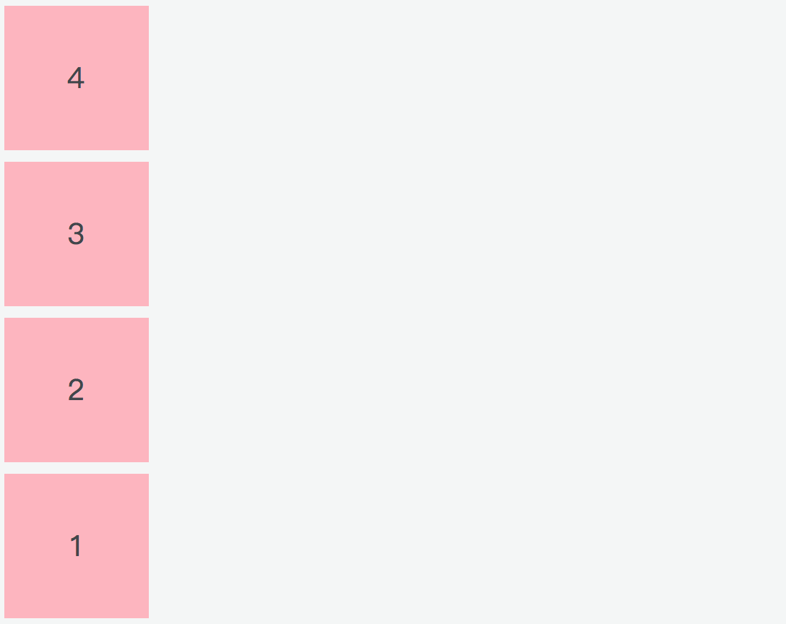
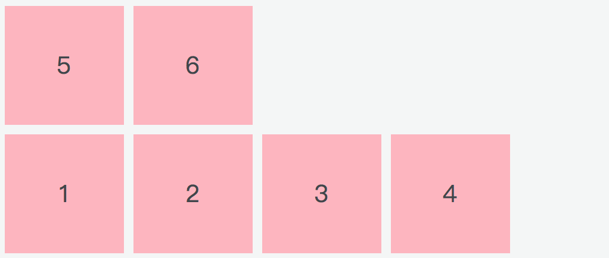

# Flexbox 布局

布局的传统解决方案，是基于盒模型，通过它的 `display`、`position`、`float` 等属性来进行布局。它对于一些特殊布局不是很方便，比如垂直居中水平居中，如果运用了浮动特性的话，就需要清除浮动，不但比较麻烦，一不小心还会出现意料之外的布局，最后呈现的结果往往不尽人意。

## 1. 基础知识

Flexbox（全称 Flexible Box）布局，也叫 Flex 布局，意为「弹性布局」。

采用 Flex 布局的元素，称为 Flex 容器（flex container），简称「容器」。它的所有子元素自动成为容器成员，称为 Flex 项目（flex item），简称「项目」。

结合下面这张图片，先介绍一下 flex 布局背后的主要思想。

<div style="text-align: center;">
  
  <p style="text-align: center; color: #888;">（Flexbox 布局模块，图来源于网络）</p>
</div>

在 Flex 布局中，Flex 项目（就是子元素）要么按照 main axis（主轴）（从 main start 到 main end）排布，要么按照 cross axis（交叉轴）（从 cross start 到 cross end）排布。

* **main axis**：Flex 容器的主轴，Flex 项目沿着主轴排布，注意主轴不一定是水平的，主轴是水平还是垂直取决于 `flex-direction` 属性（见下文）。
* **main start|main end**：分别表示主轴的开始位置和结束位置，Flex 项目在容器中会从 main start 到 main end 排布。
* **main size**：Flex 项目占据主轴的宽度或高度。Flex 项目的 main size 属性要么是「宽度」，要么是「高度」，这取决于主轴方向。
* **cross axis**：垂直于主轴的轴线称为交叉轴，其方向取决于主轴方向。
* **cross start|cross end**：分别表示交叉轴的开始位置和结束位置。Flex 项目在交叉轴上的排布从 cross start 开始位置到 cross end 结束位置。
* **cross size**：Flex 项目占据交叉轴的高度或宽度。Flex 项目的 cross size 属性要么是「高度」，要么是「宽度」，这取决于交叉轴方向。

了解完 Flex 布局相关的抽象概念，接下来我们来看看有关 Flex 布局的属性部分，这里分为两部分介绍，一是作用于父元素（容器）的，二是作用于子元素（项目）的。

## 2. 容器属性

display 属性用来将父元素定义为 Flex 布局的容器，设置 display 值为 `display: flex;` 容器对外表现为块级元素；`display: inline-flex;` 容器对外表现为行内元素，对内两者表现是一样的。

（注意，设为 Flex 布局以后，子元素的 `float`、`clear` 和 `vertical-align` 属性将失效）。

```html
<div class="container"></div>
```
```css
.container {
  display: flex | inline-flex;
}
```

上面的代码就定义了一个 Flex 布局的容器，我们有以下 6 个属性可以设置的容器上：

* flex-direction
* flex-wrap
* flex-flow
* justify-content
* align-items
* align-content

### 2.1 flex-direction

flex-direction 定义了主轴的方向，即项目的排列方向。

```html
<div class="container">
  <div class="item">1</div>
  <div class="item">2</div>
  <div class="item">3</div>
  <div class="item">3</div>
</div>
```
```css
.container  {
  flex-direction: row | row-reverse | column | column-reverse;
}
```

* row（默认值）：主轴在水平方向，起点在左侧，也就是我们常见的从左到右；
* row-reverse：主轴在水平方向，起点在右侧；
* column：主轴在垂直方向，起点在上沿；
* column-reverse: 主轴在垂直方向，起点在下沿。

<div style="text-align: left;">
  
  <p style="text-align: center; color: #888;">（flex-direction 为 row）</p>
</div>

<div style="text-align: right;">
  
  <p style="text-align: center; color: #888;">（flex-direction 为 row-reverse）</p>
</div>

<div style="text-align: center;">
  
  <p style="text-align: center; color: #888;">（flex-direction 为 column）</p>
</div>

<div style="text-align: center;">
  
  <p style="text-align: center; color: #888;">（flex-direction 为 column-reverse）</p>
</div>

### 2.2 flex-wrap

默认情况下，项目是排成一行显示的，flex-wrap 用来定义当一行放不下时，项目如何换行。

```css
.container {
  flex-wrap: nowrap | wrap | wrap-reverse;
}
```

假设此时主轴是从左到右的水平方向：

* nowrap（默认）：不换行；
* wrap：换行，第一行在上面；
* wrap-reverse：换行，第一行在下面。

<div style="text-align: left;">
  
  <p style="text-align: center; color: #888;">（默认情况，flex-wrap 为 nowrap，不换行，即使设置了项目的宽度，项目也会根据屏幕的大小被压缩）</p>
</div>

<div style="text-align: left;">
  
  <p style="text-align: center; color: #888;">（flex-wrap 为 wrap）</p>
</div>

<div style="text-align: left;">
  
  <p style="text-align: center; color: #888;">（flex-wrap 为 wrap-reverse）</p>
</div>

将 flex-wrap 设置为 wrap-reverse 可以看做是调换了交叉轴的开始位置（cross start）和结束位置（cross end）。

### 2.3 flex-flow
