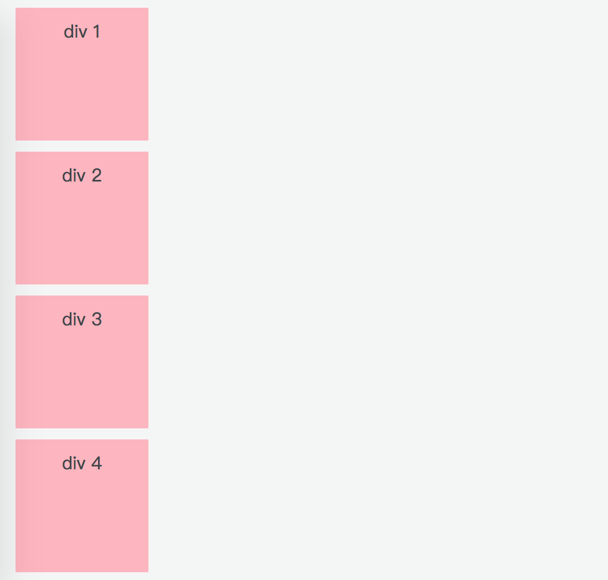
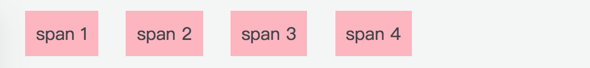
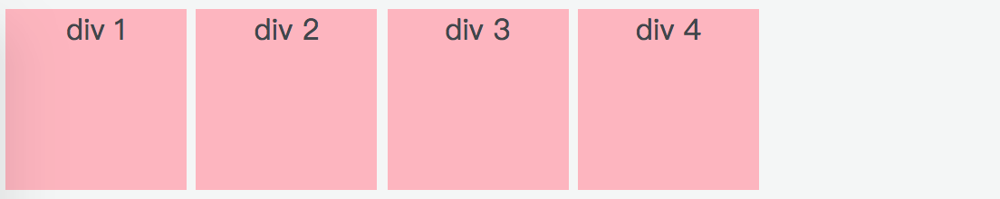
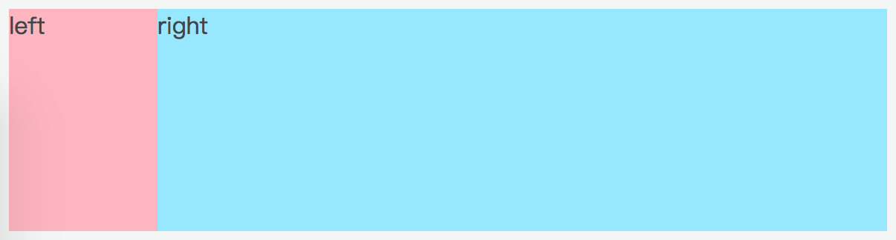

# 经典布局

网页布局（layout）是 CSS 的一个重点应用，在实际开发中，前端工程师在拿到设计稿后，都会先梳理页面的大致结构，构思完页面的布局后，再进行 coding。大多数网站都有着相似的布局，掌握这些布局套路便可以快速高效的完成开发工作。

## 1. 相关属性

与布局相关的 CSS 属性主要有 3 个：display、position 和 float。

### 1.1 display

display 是 CSS 布局中很重要的一个属性，它定义了元素生成的显示框类型，常见的几个属性值有：`block`、`inline`、`inline-block`、`inherit`、`none`、`flex`。

inherit 表示这个元素从父元素继承 display 属性值；none 表示这个元素不显示，也不占用空间位置；flex 是 flex 布局重要的属性设置，后面会单独写一个章节进行介绍，本文先介绍前三个属性值。

每个元素都有默认的 display 属性，比如 div 标签的默认 display 属性是 block，我们通常称这类元素为**块级元素**；span 标签的默认 display 属性是 inline，我们通常称这类元素为**行内元素**。

<div style="display: flow-root">
  <div style="float: left; text-align: center;">
    
    <p style="text-align: center; color: #888;">（块级元素）</p>
  </div>

  <div style="float: right; text-align: center;">
    
    <p style="text-align: center; color: #888;">（行内元素）</p>
  </div>
</div>

从上面的图可以看出，块级元素总是独占一行，从上到下显示，行内元素则是从左到右显示。这是因为块级元素前后有换行符，而行内元素前后没有换行符。除此之外，块级元素和行内元素还有其他一些区别和特性：

块级元素：

* 没有设置宽度时，它的宽度是其容器的 100%；
* 可以给块级元素设置宽高、内边距、外边距等盒模型属性；
* 块级元素可以包含块级元素和行内元素；
* 常见的块级元素有：`<div>`、`<h1>` ~ `<h6>`、`<p>`、`<ul>`、`<ol>`、`<dl>`、`<table>`、`<address>`、`<form>` 等。

行内元素：

* 行内元素不会独占一行，只会占领自身宽高所需要的空间；
* 给行内元素设置宽高不会起作用，margin 值只对左右起作用，padding 值也只对左右起作用；
* 行内元素一般不可以包含块级元素，只能包含行内元素和文本；
* 常见的行内元素有 `<a>`、`<b>`、`<label>`、`<span>`、``、`<em>`、`<strong>`、`<i>`、`<input>` 等。

值得注意的是，给 img 标签设置宽高是可以影响图片大小的，这是因为 img 是[可替换元素](https://developer.mozilla.org/zh-CN/docs/Web/CSS/Replaced_element "可替换元素")，可替换元素具有内在的尺寸，所以宽高可以设定。HTML 中的 input、button、textarea、select 都是可替代元素，这些元素即使是空的，浏览器也会根据其标签和属性来决定显示的内容。

而 inline-block 又是什么呢？顾名思义，作为行内块级元素，它既具有块级元素可以设置宽高的特性，又具有行内元素不换行的特性。我们给 div 标签设置 inline-block 属性看下效果。

<div style="text-align: center;">
  
  <p style="text-align: center; color: #888;">（将块级元素的 display 属性设置为 inline-block 后的效果）</p>
</div>

在上图中，我们没有设置 margin 值，但是 div 之间会有空隙，这是因为浏览器会将 HTML 中的换行符、制表符、空白符合并成空白符，关于消除中间空隙的办法，推荐阅读《[去除 inline-block 元素间间距的 N 种方法 - 张鑫旭](https://www.zhangxinxu.com/wordpress/2012/04/inline-block-space-remove-去除间距/)》。

### 1.2 position

参见《[定位（position）](/frontend-basics/css/position-property/)》章节。

### 1.3 float

参见《[浮动（float）](/frontend-basics/css/float-property/)》章节。

## 2. 布局示例：两栏布局

常见的两栏布局页面一般是左边固定宽度，右边自适应。这种布局相对简单些，大概的效果如下：

<div style="text-align: center;">
  
  <p style="text-align: center; color: #888;">（两栏布局效果图）</p>
</div>

先写出基础部分的代码：

```html
<div class="container">
  <div class="left">left</div>
  <div class="right">right</div>
</div>
```
```css
.left {
  width: 100px;
  height: 150px;
  background-color: #FFB5BF;
}
.right {
  height: 150px;
  background-color: #94E8FF;
}
```

此时大体框架设计好了，.left 和 .right 目前是各自独占一行的，接下来调整样式来实现最终效果图，可以使用 3 种方式。

### 2.1 设置 display 为 inline-block

原理：inline-block 兼具块级元素可以设置宽高和行内元素不独占一行的特性。

方法：设置 .left、.right 的 display 为 inline-block。注意设置了 inline-block 的两个 div 之间会有间距，记得消除。由于左边是固定的，总的宽度是 100%，要计算右边的宽度，可以使用 [calc](https://developer.mozilla.org/zh-CN/docs/Web/CSS/calc) 来计算。

```css
.container {
  font-size: 0;   /* 消除间距 */
}
.left, .right {
  display: inline-block;
}
.right {
  width: calc(100% - 100px);   /* 计算宽度，运算符号左右一定要有空格 */
}
```

### 2.2 使用 float

float 变化多端，下面又能给出三种利用浮动的特性来达到上图两栏布局的方法。

#### 第一种方法

原理：处于文档流中的块级元素无法感知到浮动元素的存在。

方法：设置 .left 为左浮动，此时 .right 会当 .left 不存在，由于块级元素的默认宽度是父级元素的 100%，此时 .right 的宽度就已经是 100% 了，无需再计算。然后设置 .right 的 margin 值来给 .left 预留空间（左外边距等于 .left 的宽度）。

```css
.left {
  float: left;
}
.right {
  margin-left: 100px;   /* 为 .left 留出空间 */
}
.container {
  overflow: hidden;   /* 别忘了清除浮动 */
}
```

#### 第二种方法

原理：浮动元素会脱离文档流，直到它碰到父元素的边框或另一浮动元素为止。

方法：设置 .left、.right 均左浮动，这时，它们便会紧贴着排列在一行。因为 .right 是浮动的，所以需要计算宽度。

```css
.left {
  float: left;
}
.right {
  float: left;
  width: calc(100% - 100px);
}
.container {
  overflow: hidden;
}
```

#### 第三种方法

原理：BFC 不会忽视浮动元素

方法：设置 .left 为左浮动，接下来让 .right 形成 BFC，.right 就不会和 .left 重合了。

```css
.left {
  float: left;
}
.right {
  overflow: auto;    /* 形成 BFC */
}
.container {
  overflow: hidden;
}
```

### 2.3 使用 absolute

原理：给元素的 positon 属性设置 absolute、fixed 时便会脱离文档流，不再遵循从上到下，从左到右的规律了。

方法：设置 .left 的 position 为 absolute，.left 脱离了文档流，.right 会无视 .left 的存在。此时 .right 的宽度是 100% 了，然后设置一下 margin 值。

```css
.container {
  position: relative;
}
.left {
  position: absolute;
}
.right {
  margin-left: 100px;
}
```

## 3. 布局示例：三栏布局
