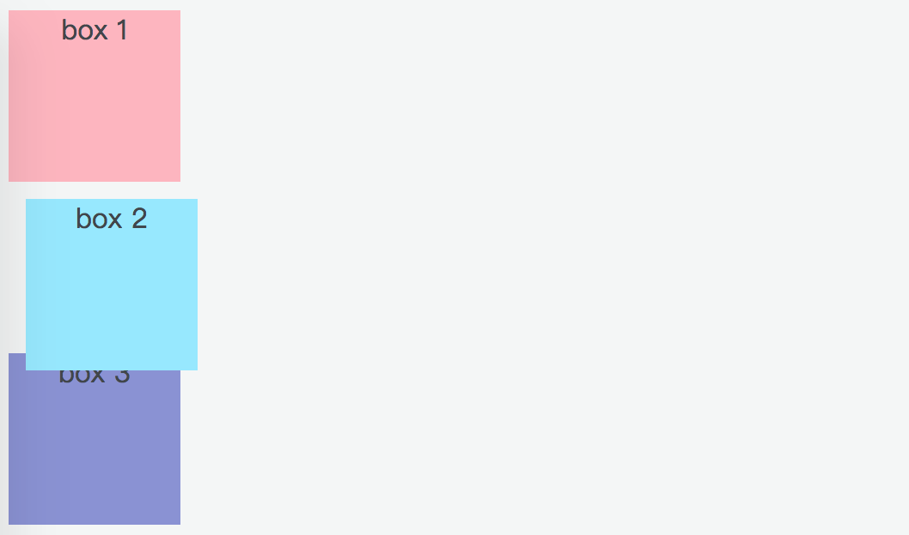
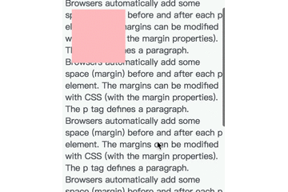

# 定位（position）

## 文档流

在介绍 position 之前，有必要先了解下文档流。

简单说就是元素按照其在 HTML 中的位置顺序决定排布的过程。HTML的布局机制就是用文档流模型的，即块元素（block）独占一行，内联元素（inline），不独占一行。

在不使用其他与排列和定位相关的特殊 CSS 规则（float 和绝对定位）时，元素的默认排列规则就是标准文档流。元素在标准文档流中定位时，一般使用 margin 来控制元素与元素之间的距离；使用 padding 来控制元素与其内容的距离。

## position 属性介绍

* static（静态定位）

  对象遵循标准文档流，top，right，bottom，left 等属性失效。

* relative（相对定位）

  对象遵循标准文档流，使用 top，right，bottom，left 等属性相对于该对象在标准文档流中的位置进行偏移（**相对于元素的正常位置进行定位**），同时可通过 z-index 定义层叠关系。

* absolute（绝对定位）

  对象脱离标准文档流，使用 top，right，bottom，left 等属性进行绝对定位（**相对于 static 定位以外的第一个父元素进行绝对定位**），同时可通过 z-index 定义层叠关系。

* fixed（固定定位）

  对象脱离标准文档流，使用 top，right，bottom，left 等属性进行绝对定位（**相对于浏览器窗口进行绝对定位**），同时可通过 z-index 定义层叠关系。

* inherit

  继承父元素的 position 属性值。

### static 静态定位

默认的 position 值，无特殊定位，遵循标准文档流，不做过多解释。

### relative 相对定位

把一个元素的 position 属性设置为 relative，该元素仍然会呆在原来的地方。但此后，可以通过 top，right，bottom，left 属性，使该元素**相对于初始位置**平移一定距离。

无论相对定位的元素是否位移，都不会改变该对象原本在文档流中的占位空间。因此，这样平移元素会导致它原先位置出现空白，且平移后它会有可能遮挡其他元素。。

当设置了 margin 属性时，该元素在标准文档流中的占位空间也随之改变。同理，padding 也会改变相对定位的元素在标准文档流中的占位空间。

代码示例：

```html
<div class="common box-1">box 1</div>
<div class="common box-2">box 2</div>
<div class="common box-3">box 3</div>
```
```css
.common {
  width: 100px;
  height: 100px;
  text-align: center;
}
.box-1 {
  position: relative;
  background-color: #FFB5BF;
}
.box-2 {
  position: relative;
  background-color: #94E8FF;
  left: 10px;
  top: 10px;
}
.box-3 {
  background-color: #8990D5;
}
```

<br>

<div style="text-align: center;">
  
  <p style="text-align: center; color: #888;">（position 为 relative 示例）</p>
</div>

从上图中我们不难发现，设置 position 为 relative：
* 不添加额外属性（left，right，top，bottom 等）时，表现同 static 一样，如 .box-1；
* 属性 left，right，top，bottom 会使元素偏离正常位置，如 .box-2；
* 元素的偏移会覆盖相邻元素，如 .box-3。

### absolute 绝对定位

相对定位事实上是常规文档流定位模型的一部分，因为元素还是相对于它在常规流中的初始位置来定位。绝对定位则会把元素拿出文档流，因此也就不会再占用原来的空间。与此同时，文档流中的其他元素会各自重新定位，仿佛绝对定位的那个元素没有存在过一样。

绝对定位元素的包含块是距离它最近的定位祖先，也就是 position 属性设置为 **static 之外任意值的祖先元素**。如果没有这么一个定位祖先，那么它就相对于文档的根元素即 html 元素定位。

在使用 absolute 定位时，必须指定 top，right，bottom，left 中的至少一个，否则 left/right/top/bottom 属性会使用它们的默认值 auto ，这将导致对象遵从标准文档流，在前一个对象之后立即被呈递，简单讲就是都变成 relative，会占用文档空间。

如果同时设置了 left/right 属性，那么 left 生效。同理 top/bottom 同时存在时，top 生效。

同时绝对定位（absolute）元素在可视区域之外会导致滚动条出现。而相对定位（relative）元素在可视区域之外，滚动条不会出现。

代码示例：

```html
<div class="relative">
  relative
  <div class="absolute">absolute</div>
</div>
```
```css
.relative {
  width: 200px;
  height: 200px;
  border: 2px solid #FFB5BF;
  position: relative;
}
.absolute {
  width: 100px;
  height: 100px;
  border: 2px solid #94E8FF;
  position: absolute;
  bottom: 10px;
  right: 10px;
}
```

<br>

<div style="text-align: center;">
  
  <p style="text-align: center; color: #888;">（position 为 absolute 示例）</p>
</div>

近年来，已经很少用绝对定位来构建整体布局了，原因是绝对定位的盒子脱离了常规文档流，因此很难用它们创建随视口宽度和内容长度变化而变化的自适应或者响应式布局。Web 技术的特点决定了不太可能指定元素在页面上的确切位置和大小。

### fixed 固定定位

固定定位是由绝对定位衍生出来的，不同之处在于，固定定位元素的包含块是视口（viewport），即用户网页的可视区域。因此，固定定位可用来创建始终停留在窗口相同位置的浮动元素。

代码示例：

```html
<div class="fixed"></div>
<span>The p tag defines a paragraph. Browsers automatically add some space (margin) before and after each p element...</span>
……（此处省略 N 段文字）
<span>The p tag defines a paragraph. Browsers automatically add some space (margin) before and after each p element...</span>
```
```css
.fixed {
  width: 100px;
  height: 100px;
  background-color: #FFB5BF;
  position: fixed;
  left: 20px;
  top: 20px;
}
```

<br>

<div style="text-align: center;">
  
  <p style="text-align: center; color: #888;">（position 为 fixed 示例）</p>
</div>

（完）
