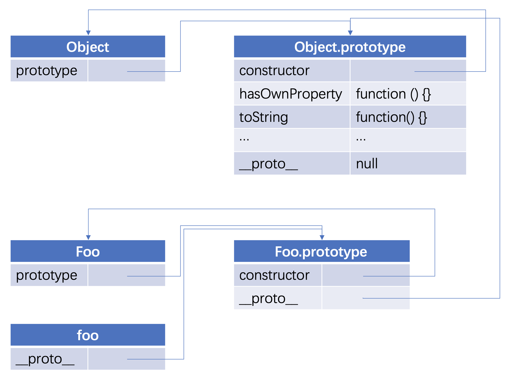

# 原型与原型链

## 前言

ES6 出来之后，原型在平时工作中用得就比较少了。但原型是 JavaScript 中的基础，很多流行框架诸如 Vue 和 React 中就多次用到 `prototype` 。平时在写代码时，也会不知不觉就用上了原型的某个知识点。

本篇主要介绍以下两个知识点：

* 原型
* 原型链

## 原型

任何一个函数，都拥有一个 `prototype` 属性，它指向这个函数的原型对象，如：

```javascript
function Foo () {}
console.log(Foo.prototype); // { constructor: f Foo(), __proto__: Object }
```

画图表示如下：

<div style="text-align: center;">
  
  <p style="text-align: center; color: #888">（Foo 的原型）</p>
</div>

上图左边代表 `Foo` 函数，它有一个 `prototype` 属性，指向右侧这个原型对象，每声明一个函数，都会有这样的一个原型对象，原型对象有一个 `constructor` 属性，指向 `Foo` 函数本身，也有个 `__proto__` 属性，这里我们暂且不讲。

---------------------------------------

我们来看 `Foo` 函数的实例化：

```javascript
const foo = new Foo();
```

这里我们通过 `new` 操作符实例化了一个 `foo` 对象，来看此时的图解：

<div style="text-align: center;">
  
  <p style="text-align: center; color: #888">（new Foo）</p>
</div>

`foo` 默认会有个 `__proto__` 属性，它也指向构造函数 `Foo` 的原型，这就是 `__proto__` 的作用，即**指向构造函数的原型**。

---------------------------------------

那让我们回到 `Foo.prototype.__proto__`，来看看他的指向吧：

<div style="text-align: center;">
  
  <p style="text-align: center; color: #888">（Foo 原型的 __proto__）</p>
</div>

上图的 `Foo.prototype.__proto__` 指向 `Object.prototype`，也就是说：**每个函数的原型，都是 Object 的实例**。就好像每个函数的原型，是由 `new Object()` 产生一样。

以上就是关于原型的阐述，如果看到这里似懂非懂，建议反复看几遍，注意文字与图片对应，线条的指向，看懂了再接着往下看。

## 显式原型和隐式原型

* `prototype`：显式原型对象，每一个函数（除了 bind）在创建之后都会拥有一个名为 `prototype` 的内部属性，它指向函数的原型对象。用来实现基于原型的继承与属性的共享。
* `__proto__`：隐式原型对象，是每个对象都具有的属性，这个属性的值指向该对象的构造函数的原型对象。

**一个对象的隐式原型指向构造该对象的构造函数的显式原型对象**：

```javascript
foo.__proto__ === Foo.prototype // true
```

::: warning
`[[prototype]]` 和 `__proto__` 意义相同，均表示对象的内部属性，其值指向对象原型。前者在一些书籍、规范中表示一个对象的原型属性，默认情况下是不可以再被外部访问的，估计是会被一些内部方法使用的，例如用 for...in 来遍历原型链上可以被枚举的属性的时候，就需要通过这个指针找到当前对象所继承的对象；后者则是在浏览器实现中支持的一个属性，用于指向对象原型。
:::

## 原型方法

在 ES5 之前没有标准的方法访问 `[[prototype]]` 这个内置属性，但是大多数浏览器都支持通过 `__proto__` 访问。

如今，`__proto__` 被认为是过时且不推荐使用的（deprecated），这里的不推荐使用是指 JavaScript 规范中规定，`__proto__` 必须仅在浏览器环境下才能得到支持。

现代的方法有：

* [Object.create(proto, [propertiesObject])](https://developer.mozilla.org/zh-CN/docs/Web/JavaScript/Reference/Global_Objects/Object/create)：利用给定的 `proto` 作为 `[[Prototype]]` 和可选的属性描述来创建一个空对象。
* [Object.getPrototypeOf(obj)](https://developer.mozilla.org/zh-CN/docs/Web/JavaScript/Reference/Global_Objects/Object/getPrototypeOf)：返回对象 `obj` 的 `[[Prototype]]`。
* [Object.setPrototypeOf(obj, prototype)](https://developer.mozilla.org/zh-CN/docs/Web/JavaScript/Reference/Global_Objects/Object/setPrototypeOf)：将对象 `obj` 的 `[[Prototype]]` 设置为 `proto`。

应该使用这些方法来代替 `__proto__`。

例如：

```javascript {6,10,12}
let animal = {
  eats: true
};

// 创建一个以 animal 为原型的新对象
let rabbit = Object.create(animal);

console.log(rabbit.eats); // true

console.log(Object.getPrototypeOf(rabbit) === animal); // true

Object.setPrototypeOf(rabbit, {}); // 将 rabbit 的原型修改为 {}
```

`Object.create` 有一个可选的第二参数：属性描述器。我们可以在此处为新对象提供额外的属性，就像这样：

```javascript
let animal = {
  eats: true
};

let rabbit = Object.create(animal, {
  jumps: {
    value: true
  }
});

console.log(rabbit.jumps); // true
```

我们可以使用 `Object.create` 来实现比复制 `for..in` 循环中的属性更强大的对象克隆方式：

```javascript
let clone = Object.create(Object.getPrototypeOf(obj), Object.getOwnPropertyDescriptors(obj));
```

此调用可以对 `obj` 进行真正准确地拷贝，包括所有的属性：可枚举和不可枚举的，数据属性和 setters/getters —— 包括所有内容，并带有正确的 `[[Prototype]]`。

## 原型的关系

所有原生构造函数的 `__proto__` 都指向 `Function.prototype`，

即：`原生构造函数.__proto__ === Function.prototype`

```javascript
Object.__proto__   === Function.prototype;   // true
Function.__proto__ === Function.prototype;   // true
Number.__proto__   === Function.prototype;   // true
Boolean.__proto__  === Function.prototype;   // true
String.__proto__   === Function.prototype;   // true
Object.__proto__   === Function.prototype;   // true
Array.__proto__    === Function.prototype;   // true
RegExp.__proto__   === Function.prototype;   // true
Error.__proto__    === Function.prototype;   // true
Date.__proto__     === Function.prototype;   // true
```

进而有了：

```javascript
String.__proto__ === Boolean.__proto__
RegExp.__proto__ === Error.__proto__
Date.__proto__ === Number.__proto__
```

同理，函数原型的隐式原型都是对象，所以构造函数是 `Object`，

即：`Function.prototype.__proto__ === Object.prototype`

```javascript
Object.__proto__.__proto__   === Object.prototype;   // true
Function.__proto__.__proto__ === Object.prototype;   // true
Number.__proto__.__proto__   === Object.prototype;   // true
Boolean.__proto__.__proto__  === Object.prototype;   // true
String.__proto__.__proto__   === Object.prototype;   // true
Object.__proto__.__proto__   === Object.prototype;   // true
Array.__proto__.__proto__    === Object.prototype;   // true
RegExp.__proto__.__proto__   === Object.prototype;   // true
Error.__proto__.__proto__    === Object.prototype;   // true
Date.__proto__.__proto__     === Object.prototype;   // true
```

## 原型链

原型链是 JavaScript 作者为了继承而设计的。由上边的分析，`const foo = new Foo()` 语句，其实是产生了一个链条的，如下:

<div style="text-align: center;">
  
  <p style="text-align: center; color: #888">（原型链）</p>
</div>

我们在 new 出 `foo` 对象后，并没有给 `foo` 对象添加任何方法，但我们依然能从 `foo` 对象中调用 `toString()`、 `hasOwnProperty()` 等方法。这是为什么呢？

```javascript
console.log(typeof foo.toString); // function
console.log(typeof foo.hasOwnProperty); // function
```

原因是：JavaScript 在设计之初，`__proto__` 就是用来查找属性和方法的。

从上图的链条来看，我们在 `foo` 这个对象中，查找 toString 方法，没找到，就循着 `foo.__proto__` 查找，`foo.__proto__` 里也没有找到，就循着 `foo.__proto__.__proto__` 找，这个时候找到了，则调用；如果还找不到，就再往上找，即 `foo.__proto__._proto__._proto__`，这个时候值为 `null`，查找结束。

这就是原型链，我们也可以说，`Foo` 继承了 `Object`，所以 `foo` 中能访问到 Object 的原型属性。

（完）
