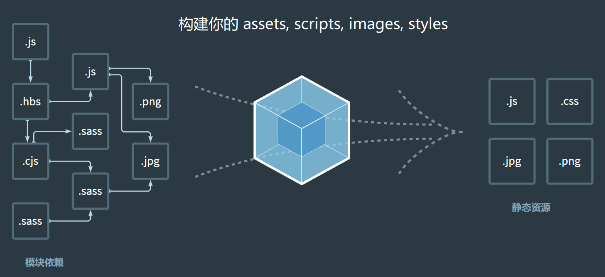

# 基本配置

Webpack 的基本配置主要分为 6 个方面：

* 拆分配置和 merge
* 启动本地服务
* 处理 ES6
* 处理样式
* 处理图片
* 模块化

完成基本配置后，项目就能够在 demo 环境运行。

## 拆分配置和 merge

传统方式，会在项目中新建一个 `webpack.config.js` 文件，将所有配置汇总在一起。

而如果拆分配置，我们会将它分为三个文件：

* webpack.common.js
* webpack.dev.js
* webpack.prod.js

与此同时修改 `package.json` 中的命令语句：

```bash {4,5}
"scripts": {
  "test": "echo \"Error: no test specified\" && exit 1",
  "dev-without-dev-server": "webpack --config build/webpack.dev.js",
  "dev": "webpack serve --config build/webpack.dev.js",
  "build": "webpack --config build/webpack.prod.js"
}
```

`webpack.common.js` 基础配置代码：

```javascript
const path = require('path')
const HtmlWebpackPlugin = require('html-webpack-plugin')
const { srcPath, distPath } = require('./paths')

module.exports = {
  entry: path.join(srcPath, 'index'),
  plugins: [
    new HtmlWebpackPlugin({
      template: path.join(srcPath, 'index.html'),
      filename: 'index.html'
    })
  ],
}
```

在 dev（开发环境配置）和 prod（生产环境配置）中分别都通过 `merge`（需要安装 `webpack-merge` 这个依赖） 将 common（公共配置）引进来。

`webpack.dev.js` 基础配置代码：

```javascript
const path = require('path')
const webpack = require('webpack')
const webpackCommonConf = require('./webpack.common.js')
const { merge } = require('webpack-merge')
const { srcPath, distPath } = require('./paths')

module.exports = merge(webpackCommonConf, {
  mode: 'development',
  devServer: {
    // 这部分配置项省略，后面会单独详细讲……
  },
  plugins: [
    new webpack.DefinePlugin({
      // window.ENV = 'development'
      ENV: JSON.stringify('development')
    })
  ]
})
```

`webpack.prod.js` 基础配置代码：

```javascript
const path = require('path')
const webpack = require('webpack')
const { CleanWebpackPlugin } = require('clean-webpack-plugin')
const webpackCommonConf = require('./webpack.common.js')
const { merge } = require('webpack-merge')
const { srcPath, distPath } = require('./paths')

module.exports = merge(webpackCommonConf, {
  mode: 'production',
  output: {
    filename: 'bundle.[contenthash:8].js',  // 打包代码时，加上 hash 戳
    path: distPath,
    // publicPath: 'http://cdn.abc.com'  // 修改所有静态文件 url 的前缀（如 cdn 域名），这里暂时用不到
  },
  plugins: [
    new CleanWebpackPlugin(), // 会默认清空 output.path 文件夹
    new webpack.DefinePlugin({
      // window.ENV = 'production'
      ENV: JSON.stringify('production')
    })
  ]
})
```

可以看到三份配置文件都引入了 `paths.js`，这是一个通用的 JS 文件，它里面的完整代码是这样的：

```javascript
/**
 * @description 常用文件夹路径
 * @author wenyuan
 */

const path = require('path')

const srcPath = path.join(__dirname, '..', 'src')
const distPath = path.join(__dirname, '..', 'dist')

module.exports = {
  srcPath,
  distPath
}
```

下面是拆分配置后的目录结构。

```bash
├── src/                       # 项目源代码
├── paths.js                   # 常用文件夹路径，返回目录变量给其它文件用
├── webpack.common.js          # 公共配置
├── webpack.dev.js             # 开发环境配置
├── webpack.prod.js            # 生产环境配置
└── .babelrc                   # babel 配置（后面会讲到）
```

## 启动本地服务

这个功能只在 dev 环境下使用，借助了 `webpack-dev-server` 这个依赖，配置写在 `webpack.dev.js` 中：

```javascript {9-30}
const path = require('path')
const webpack = require('webpack')
const webpackCommonConf = require('./webpack.common.js')
const { merge } = require('webpack-merge')
const { srcPath, distPath } = require('./paths')

module.exports = merge(webpackCommonConf, {
  mode: 'development',
  devServer: {
    historyApiFallback: true, // 前端路由配置为 history 模式时用
    contentBase: distPath,    // 根目录
    open: true,               // 自动打开浏览器
    compress: true,           // 启动 gzip 压缩
    hot: true,                // 热更新
    port: 8080,               // 启动端口

    // 设置代理，解决跨域访问 —— 如果有需要的话
    proxy: {
      // 将本地 /api/xxx 代理到 localhost:3000/api/xxx
      '/api': 'http://localhost:3000',

      // 将本地 /api2/xxx 代理到 localhost:3000/xxx
      '/api2': {
        target: 'http://localhost:3000',
        pathRewrite: {
          '/api2': ''
        }
      }
    }
  }
})
```

## 处理 ES6

处理 ES6 是通用的功能，借助了 `babel-loader` 这个依赖，配置写在 `webpack.common.js` 中：

```javascript {8-13}
const path = require('path')
const { srcPath, distPath } = require('./paths')

module.exports = {
  entry: path.join(srcPath, 'index'),
  module: {
    rules: [
      {
        test: /\.js$/,
        use: ['babel-loader'], 
        include: srcPath,
        exclude: /node_modules/
      }
    ]
  }
}
```

由于 `babel-loader` 使用到了 babel，因此还需要配置 `.babelrc`。一般简单配置就已经包含了 ES6、7、8 常用语法，特殊情况再配置 plugins。所以常用配置如下：

```json
{
  "presets": ["@babel/preset-env"],
  "plugins": []
}
```

## 处理样式

处理样式也是通用的功能，借助了 `css-loader`、`style-loader` 和 `postcss-loader` 这几个依赖，配置写在 `webpack.common.js` 中。

* postcss-loader：CSS 语法识别，处理浏览器兼容性
* css-loader：将 .css 结尾的文件解析为 CSS（webpack 中一切皆模块，它不认识 .css 文件和 .js 文件的区别）
* style-loader：将解析完的 CSS 插入到页面中（style 标签中）

处理样式的配置如下：

```javascript {8-17}
const path = require('path')
const { srcPath, distPath } = require('./paths')

module.exports = {
  entry: path.join(srcPath, 'index'),
  module: {
    rules: [
      {
        test: /\.css$/,
        // loader 的执行顺序是：从后往前
        use: ['style-loader', 'css-loader', 'postcss-loader']
      },
      {
        test: /\.less$/,
        // 增加 'less-loader'，注意顺序
        use: ['style-loader', 'css-loader', 'less-loader']
      }
    ]
  }
}
```

其中 postcss-loader 需要配置一份 `postcss.config.js` 文件，在这个文件里可以选择一些插件，此处我们安装并引入 `autoprefixer` 这个依赖（为 CSS 语法添加浏览器兼容性的前缀）：

```javascript
module.exports = {
  plugins: [require('autoprefixer')]
}
```

在处理样式的配置中，除了 CSS，同理还有 Less，Sass 等，都是差不多的思路（解析 Less 语法 => 解析 CSS 语法 => 转成 style），详见上面的配置示例。

## 处理图片

处理图片在 dev 环境和 prod 环境的思路不同。

* dev 环境：借助 `file-loader` 依赖，**直接引入图片 url**。在 `webpack.dev.js` 中的配置如下：

```javascript {8-12}
const webpackCommonConf = require('./webpack.common.js')
const { merge } = require('webpack-merge')

module.exports = merge(webpackCommonConf, {
  mode: 'development',
  module: {
    rules: [
      // 直接引入图片 url
      {
        test: /\.(png|jpg|jpeg|gif)$/,
        use: 'file-loader'
      }
    ]
  }
})
```

* prod 环境：从性能优化的角度考虑，大图片借助 `file-loader` 依赖，直接引入图片 url，并打包到指定目录下；小图片转成 base64 的形式，可以减少一次 http 请求。在 `webpack.prod.js` 中的配置如下：

```javascript {14-31}
const webpackCommonConf = require('./webpack.common.js')
const { merge } = require('webpack-merge')
const { srcPath, distPath } = require('./paths')

module.exports = merge(webpackCommonConf, {
  mode: 'production',
  output: {
    filename: 'bundle.[contenthash:8].js',  // 打包代码时，加上 hash 戳，主要针对 JS 文件
    path: distPath,
    // publicPath: 'http://cdn.abc.com'  // 修改所有静态文件 url 的前缀（如 cdn 域名），这里暂时用不到
  },
  module: {
    rules: [
      // 图片 - 考虑 base64 编码的情况
      {
        test: /\.(png|jpg|jpeg|gif)$/,
        use: {
          loader: 'url-loader',
          options: {
            // 小于 5kb 的图片用 base64 格式产出
            // 否则，依然延用 file-loader 的形式，产出 url 格式
            limit: 5 * 1024,

            // 打包到 img 目录下
            outputPath: '/img/',

            // 设置图片的 cdn 地址（也可以统一在外面的 output 中设置，那将作用于所有静态资源）
            // publicPath: 'http://cdn.abc.com'
          }
        }
      }
    ]
  }
})
```

## 模块化

一个 Web 工程通常会包含一系列的静态资源，并且这些资源一般会存在某种相互依赖的关系。一般静态资源包含：

* HTML/CSS/JavaScript
* 图片/音视频
* 字体
* 模板
。。。

对于 webpack 来说，这些静态资源都是模块，我们可以像加载一个 JS 模块一样去加载它们，如：

```javascript
// 引入 CSS
import './style/style1.css'
import './style/style2.css'

// 引入 JS 方法
import { sum } from './math'

// 引入第三方模块
import _ from 'lodash'
```

<div style="text-align: center;">
  
  <p style="text-align: center; color: #888;">（webpack，图来源于官网文档）</p>
</div>

上图为 webpack 官网上的图片，一切文件：JavaScript、CSS、SCSS、图片、模板，在 webpack 眼中都是一个个模块，这样的好处是能清晰的描述出各个模块之间的依赖关系，以方便 webpack 对模块进行组合和打包。经过 webpack 的处理，最终会输出浏览器能使用的静态资源。

这样做的好处是什么呢？

举个场景：**某页面模块需要用到按钮**，于是我们加载它：

```javascript
// src/page/index.js'
import Button from './components/button/button.js'
```

但是加载了 JS 文件之后发现需要各类样式，因此仍需要引入按钮组件的样式文件：

```scss
// src/page/style.scss  以 SCSS 为例
@import './components/button/style.scss'
```

当然，在 webpack 中实际构建时，可以采用更加简洁的写法来处理：

```javascript
// src/page/index.js
import Button from './components/button/index.js'
```

```javascript
// ./components/button/index.js
import './style.scss' // 引用组件自身样式
```

从上例子可以看到，在 button 的 JS 中加载了组件自身的样式，但对于需要该组件的页面来说，只需要引入 button 的 JS 模块即可，不需要再这里引入 button 的样式了。这样在进行组件的引入与删除时，直接操作一次即可达成目的。

在项目具有一定规模的情况下，可以更加清晰明了的看出 webpack 对我们项目工程优化之处：

* 工程结构更简洁
* 让依赖关系更直观
* 代码可维护性更强

（完）
