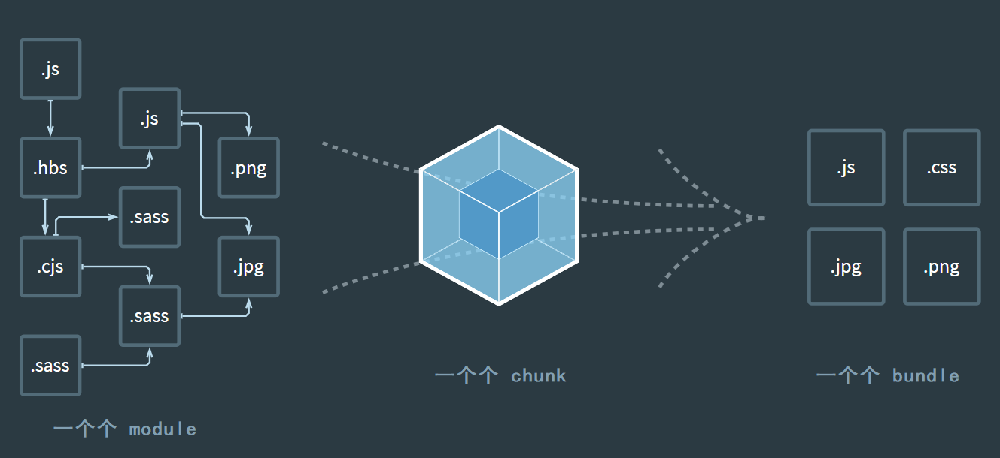

# 核心概念

## Webpack 五个核心概念

### Entry

入口（Entry）是打包时，第一个被访问的源码文件。默认是 src/index.js （可以通过配置文件指定）。

Webpack 通过入口，加载整个项目的依赖。

  
  
（Webpack 入口）

### Output

出口（Output）是打包后，输出的文件名称，默认是 dist/main.js（可以通过配置文件指定）。

如下图，出口是 dist/main.js：

  
  
（Webpack 出口）

### Loader

加载器（Loader）是专门用来处理那些非 JavaScript 文件的工具（Webpack 默认只能识别 JavaScript），将这些资源翻译成 Webpack 能识别的资源。

Loader 的命名方式一般为 xxx-loader（css-loader | html-loader | file-loader），它们都是以 -loader 为后缀的 npm 包，[常用加载器](https://www.webpackjs.com/loaders/)。

Loader 加载的基本逻辑：

  
  
（Webpack loader 加载的基本逻辑）

打包时，我们也可以将不同类型的文件，单独打包：

  
  
（Webpack loader 单独打包其它文件的逻辑）

### Plugins

插件（Plugins）用于实现 Loader 之外的其他功能，包括但不限于打包优化和压缩，重新定义环境中的变量等。Plugin 是 Webpack 的支柱，用来实现丰富的功能。

Plugins 的命名方式一般为 xxx-webpack-plugin（html-webpack-plugin），它们都是以 -webpack-plugin 为后缀的 npm 包，[常用插件](https://www.webpackjs.com/plugins/)。

### Mode

模式（Mode）是用来区分环境的关键字，不同环境的打包逻辑不同，因此需要区分。

Mode 有三种固定的写法（名称固定，不能改）：

* development（开发环境：自动优化打包速度，添加一些调试过程中的辅助）
* production（生产环境：自动优化打包结果）
* none（运行最原始的打包，不做任何额外处理）

通过 `process.env.NODE_ENV` 可以获得当前的 Mode。

## module chunk  bundle 的区别

* module：各个源码文件，Webpack 中一切皆模块
* chunk：多模块合并成的，如 entry import() splitChunk 定义的很多文件的集合称为一个 chunk
* bundle：最终的输出文件，由 chunk 构建分析完后输出

  
  
（module chunk  bundle）

（完）
