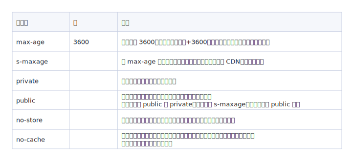

# 浏览器缓存机制

缓存可以减少网络 IO 消耗，提高访问速度。浏览器缓存机制有四个方面，它们按照获取资源时请求的优先级依次排列如下：

* Memory Cache
* Service Worker Cache
* HTTP Cache
* Push Cache

在浏览器的 Network 面板，Size 那一栏写着形如 `(from disk cache)` 这样描述的，就是代表该资源是通过缓存获取到的。

## HTTP 缓存机制

> 考虑到 HTTP 缓存是最主要、最具有代表性的缓存策略，故优先针对 HTTP 缓存机制进行剖析。

HTTP 缓存分为**强缓存**和**协商缓存**。优先级较高的是强缓存，在命中强缓存失败的情况下，才会走协商缓存。

### 强缓存

强缓存是利用 HTTP 头中的 `Expires` 和 `Cache-Control` 两个字段来控制的。强缓存中，当请求再次发出时，浏览器会根据其中的 `expires` 和 `cache-control` 判断目标资源是否**命中强缓存**，若命中则直接从缓存中获取资源，**不会再与服务端发生通信**。

命中强缓存的情况下，返回的 HTTP 状态码为 200 （如下图）。

  
  
（命中强缓存）

在 Http1.0 的规范中，在请求头里用 `expires` 表示资源的过期时间，值是一个**绝对的时间戳**，是由服务器端返回的。在浏览器第一次请求资源时，服务器端会在响应头中将过期时间写入 `expires` 字段。接下来如果我们试图再次向服务器请求资源，浏览器就会先对比本地时间和 `expires` 的时间戳，如果本地时间小于 `expires` 设定的过期时间，那么就直接去缓存中取这个资源。

由于时间戳是服务器来定义的，而本地时间的取值却来自客户端，因此客户端和服务器时间不同，会导致缓存命中误差。

为了解决这个问题，在 HTTP1.1 的规范中，提出了 `cache-control` 字段，这个字段的 `max-age` 属性允许我们通过设定**相对的时间长度**来达到同样的目的：客户端会记录请求到资源的时间点，以此作为相对时间的起点，从而确保参与计算的两个时间节点（起始时间和当前时间）都来源于客户端，由此便能够实现更加精准的判断。

当 `Cache-Control` 与 `Expires` 同时出现时，`Cache-Control` 的优先级更高。

`cache-control` 中常见的几个响应属性值：

  
  
（cache-control 属性值）

### 协商缓存

强缓存是由本地浏览器在确定是否使用缓存，当浏览器没有命中强缓存时就会向服务器发送请求，验证协商缓存是否命中，如果缓存命中则返回 304 状态码（表示缓存资源未改动），否则返回新的资源数据。

  
  
（命中协商缓存）

