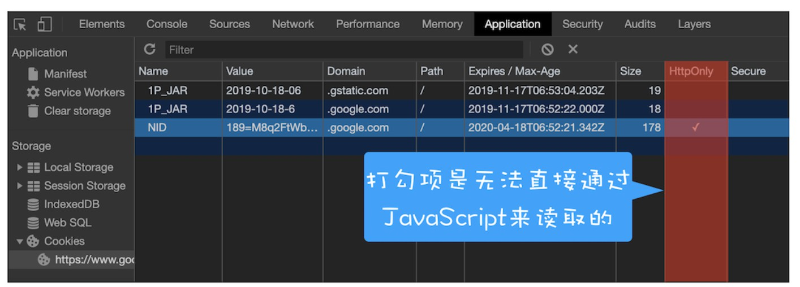

# 跨站脚本攻击（XSS）

## 什么是 XSS 攻击

XSS 攻击全称是跨站脚本攻击，它是因为同源策略支持了页面中的第三方资源引用和 CORS，所带来的安全问题。

这种攻击是指黑客往 HTML 文件中或者 DOM 中注入恶意脚本，从而在用户浏览页面时利用注入的恶意脚本对用户实施攻击的一种手段。

## XSS 的攻击方向

如果页面被注入了恶意 JavaScript 脚本，恶意脚本可以做这些事：

* 窃取 Cookie 信息
  * 它可以通过 `document.cookie` 获取 Cookie 信息，然后通过 XMLHttpRequest 或者 Fetch 加上 CORS 功能将数据发送给恶意服务器。
* 监听用户行为
  * 它可以使用 `addEventListener` 接口来监听键盘事件，比如可以获取用户输入的信用卡等信息，将其发送到恶意服务器。
* 修改 DOM
  * 它可以通过修改 DOM 伪造假的登录窗口，用来欺骗用户输入用户名和密码等信息。
* 在页面内生成浮窗广告
  * 这些广告会严重地影响用户体验。

除了以上几种情况外，恶意脚本还能做很多其他的事情。总之，如果让页面插入了恶意脚本，那么就相当于把我们页面的隐私数据和行为完全暴露给黑客了。

## 恶意脚本是怎么注入的

### 存储型 XSS 攻击

* 首先黑客利用站点漏洞将一段恶意 JavaScript 代码提交到网站的数据库中（比如表单项里填写一段引用外部 JS 的语句）。
* 然后用户向网站请求包含了恶意 JavaScript 脚本的页面。
* 当用户浏览该页面的时候，恶意脚本就会将用户的 Cookie 信息等数据上传到服务器。

### 反射型 XSS 攻击

在反射型 XSS 攻击过程中，恶意 JavaScript 脚本属于用户发送给网站请求中的一部分，随后网站又把恶意 JavaScript 脚本返回给用户。当恶意 JavaScript 脚本在用户页面中被执行时，黑客就可以利用该脚本做一些恶意操作。

常见的触发攻击的方式是将含有攻击内容的参数拼接在 URL 后面，比如黑客经常会通过 QQ 群或者邮件等渠道诱导用户去点击这些恶意链接，所以对于一些链接我们一定要慎之又慎。

### 基于 DOM 的 XSS 攻击

这种攻击是不牵涉到页面 Web 服务器的。具体来讲，黑客通过各种手段将恶意脚本注入用户的页面中，比如通过网络劫持在页面传输过程中修改 HTML 页面的内容，这种劫持类型很多，有通过 WiFi 路由器劫持的，有通过本地恶意软件来劫持的，它们的共同点是在 Web 资源传输过程或者在用户使用页面的过程中修改 Web 页面的数据。

## 如何阻止 XSS 攻击

### 服务器对输入脚本进行过滤或转码

对于反射型或者存储型 XSS 攻击，在服务器端将一些关键的字符进行转码，比如：

```text
code:<script>alert('你被xss攻击了')</script>
```

可以直接将后半段代码过滤掉，变成：

```text
code:
```

或者将部分内容进行转码，比如将尖括号和引号转码后变成：

```text
code:&lt;script&gt;alert(&#39;你被xss攻击了&#39;)&lt;/script&gt;
```

经过转码之后的内容返回给页面后，即使是一段攻击脚本，它也不会被执行。

### 充分利用 CSP

实施严格的 CSP（Content-Security-Policy）可以有效地防范 XSS 攻击，具体来讲 CSP 有如下几个功能：

* 限制加载其他域下的资源文件，这样即使黑客插入了一个 JavaScript 文件，这个 JavaScript 文件也是无法被加载的。
* 禁止向第三方域提交数据，这样用户数据也不会外泄。
* 禁止执行内联脚本和未授权的脚本。
* 提供上报机制，这样可以帮助我们尽快发现有哪些 XSS 攻击，以便尽快修复问题。

### 使用 HttpOnly 属性

由于很多 XSS 攻击都是来盗用 Cookie 的，因此还可以通过使用 `HttpOnly` 属性来保护我们 Cookie 的安全。

通常服务器可以将某些 Cookie 设置为 `HttpOnly` 标志，`HttpOnly` 是服务器通过 HTTP 响应头来设置的，下面是打开 Google 时，HTTP 响应头中的一段：

```text
set-cookie: NID=189=M8q2FtWbsR8RlcldPVt7qkrqR38LmFY9jUxkKo3-4Bi6Qu_ocNOat7nkYZUTzolHjFnwBw0izgsATSI7TZyiiiaV94qGh-BzEYsNVa7TZmjAYTxYTOM9L_-0CN9ipL6cXi8l6-z41asXtm2uEwcOC5oh9djkffOMhWqQrlnCtOI; expires=Sat, 18-Apr-2020 06:52:22 GMT; path=/; domain=.google.com; HttpOnly
```

`set-cookie` 属性值最后使用了 `HttpOnly` 来标记该 Cookie。使用 `HttpOnly` 标记的 Cookie 只能使用在 HTTP 请求过程中，所以无法通过 JavaScript 来读取这段 Cookie。

还可以通过 Chrome 开发者工具来查看哪些 Cookie 被标记了 HttpOnly，如下图：

<div style="text-align: center;">
  
  <p style="text-align:center; color: #888;">（HttpOnly 演示，图来源于学习资料）</p>
</div>

图中 `NID` 这个 Cookie 的 `HttpOnly` 属性是被勾选上的，所以 `NID` 的内容是无法通过 `document.cookie` 来读取的。

因此一些比较重要的数据建议设置 `HttpOnly` 标志。

## 各岗位防范 XSS 攻击的职责

产品：

* 业务逻辑层面安全验证，保证即使被攻击也要尽量避免或减少损失，如：资金转出、敏感信息操作（修改登录密码、支付密码）等。

后端：

* 存储型和反射性 XSS，后端占比较大，考虑到可以通过接口绕过前端，所以内容编码后端处理比较可靠。
* 重点头信息返回 `HttpOnly`，这也需要后端实现。

前端：

* 基于 DOM 的 XSS 攻击，CSP 等前端技术运用，这边主要是前端。

测试：

* 丰富测试框架，正对输入框：长度、类型、是否为空、是否重复、组成范围外，也应了解学习安全性测试：XSS 攻击、SQL 注入等攻击类型。

## 参考资料

[内容安全策略（CSP）](https://developer.mozilla.org/zh-CN/docs/Web/HTTP/CSP)

（完）
