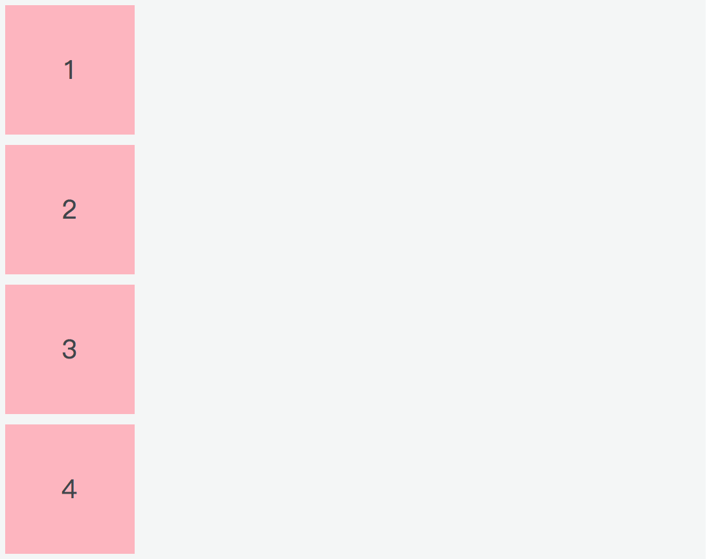
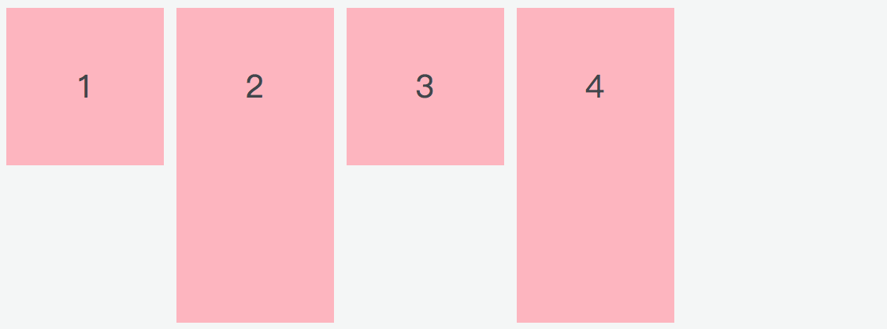
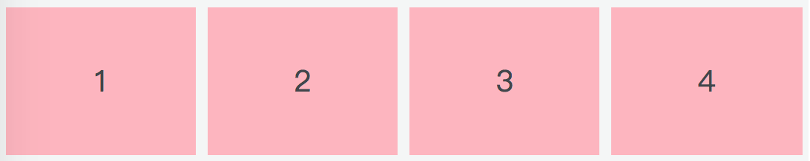

# Flexbox 布局

布局的传统解决方案，是基于盒模型，通过它的 `display`、`position`、`float` 等属性来进行布局。它对于一些特殊布局不是很方便，比如垂直居中水平居中，如果运用了浮动特性的话，就需要清除浮动，不但比较麻烦，一不小心还会出现意料之外的布局，最后呈现的结果往往不尽人意。

## 基础知识

Flexbox（全称 Flexible Box）布局，也叫 Flex 布局，意为「弹性布局」。

采用 Flex 布局的元素，称为 Flex 容器（flex container），简称「容器」。它的所有子元素自动成为容器成员，称为 Flex 项目（flex item），简称「项目」。

结合下面这张图片，先介绍一下 flex 布局背后的主要思想。

<div style="text-align: center;">
  
  <p style="text-align: center; color: #888;">（Flexbox 布局模块，图来源于网络）</p>
</div>

在 Flex 布局中，Flex 项目（就是子元素）要么按照 main axis（主轴）（从 main start 到 main end）排布，要么按照 cross axis（交叉轴）（从 cross start 到 cross end）排布。

* **main axis**：Flex 容器的主轴，Flex 项目沿着主轴排布，注意主轴不一定是水平的，主轴是水平还是垂直取决于 `flex-direction` 属性（见下文）。
* **main start|main end**：分别表示主轴的开始位置和结束位置，Flex 项目在容器中会从 main start 到 main end 排布。
* **main size**：Flex 项目占据主轴的宽度或高度。Flex 项目的 main size 属性要么是「宽度」，要么是「高度」，这取决于主轴方向。
* **cross axis**：垂直于主轴的轴线称为交叉轴，其方向取决于主轴方向。
* **cross start|cross end**：分别表示交叉轴的开始位置和结束位置。Flex 项目在交叉轴上的排布从 cross start 开始位置到 cross end 结束位置。
* **cross size**：Flex 项目占据交叉轴的高度或宽度。Flex 项目的 cross size 属性要么是「高度」，要么是「宽度」，这取决于交叉轴方向。

了解完 Flex 布局相关的抽象概念，接下来我们来看看有关 Flex 布局的属性部分，这里分为两部分介绍，一是作用于父元素（容器）的，二是作用于子元素（项目）的。

## 容器属性

display 属性用来将父元素定义为 Flex 布局的容器，设置 display 值为 `display: flex;` 容器对外表现为块级元素；`display: inline-flex;` 容器对外表现为行内元素，对内两者表现是一样的。

（注意，设为 Flex 布局以后，子元素的 `float`、`clear` 和 `vertical-align` 属性将失效）。

```html
<div class="container"></div>
```
```css
.container {
  display: flex | inline-flex;
}
```

上面的代码就定义了一个 Flex 布局的容器，我们有以下 6 个属性可以设置的容器上：

* flex-direction
* flex-wrap
* flex-flow
* justify-content
* align-items
* align-content

### flex-direction

flex-direction 定义了主轴的方向，即项目的排列方向。

```html
<div class="container">
  <div class="item">1</div>
  <div class="item">2</div>
  <div class="item">3</div>
  <div class="item">3</div>
</div>
```
```css
.container  {
  flex-direction: row | row-reverse | column | column-reverse;
}
```

* row（默认值）：主轴在水平方向，起点在左侧，也就是我们常见的从左到右；
* row-reverse：主轴在水平方向，起点在右侧；
* column：主轴在垂直方向，起点在上沿；
* column-reverse: 主轴在垂直方向，起点在下沿。

<div style="text-align: left;">
  
  <p style="text-align: center; color: #888;">（flex-direction 为 row）</p>
</div>

<div style="text-align: right;">
  
  <p style="text-align: center; color: #888;">（flex-direction 为 row-reverse）</p>
</div>

<div style="text-align: center;">
  
  <p style="text-align: center; color: #888;">（flex-direction 为 column）</p>
</div>

<div style="text-align: center;">
  
  <p style="text-align: center; color: #888;">（flex-direction 为 column-reverse）</p>
</div>

### flex-wrap

默认情况下，项目是排成一行显示的，flex-wrap 用来定义当一行放不下时，项目如何换行。

```css
.container {
  flex-wrap: nowrap | wrap | wrap-reverse;
}
```

假设此时主轴是从左到右的水平方向：

* nowrap（默认）：不换行；
* wrap：换行，第一行在上面；
* wrap-reverse：换行，第一行在下面。

<div style="text-align: left;">
  
  <p style="text-align: center; color: #888;">（默认情况，flex-wrap 为 nowrap，不换行，即使设置了项目的宽度，项目也会根据屏幕的大小被压缩）</p>
</div>

<div style="text-align: left;">
  
  <p style="text-align: center; color: #888;">（flex-wrap 为 wrap）</p>
</div>

<div style="text-align: left;">
  
  <p style="text-align: center; color: #888;">（flex-wrap 为 wrap-reverse）</p>
</div>

将 flex-wrap 设置为 wrap-reverse 可以看做是调换了交叉轴的开始位置（cross start）和结束位置（cross end）。

### flex-flow

flex-flow 是 flex-direction 和 flex-wrap 的简写，默认值是 row no-wrap。

```css
.container {
  flex-flow: <flex-direction> || <flex-wrap>;
}
```

### justify-content

justify-content 定义了项目在主轴上的对齐方式。

```css
.container {
  justify-content: flex-start | flex-end | center | space-between | space-around;
}
```

* flex-start（默认）：与主轴的起点对齐；
* flex-end：与主轴的终点对齐；
* center：项目居中；
* space-between：两端对齐，项目之间的距离都相等；
* space-around：每个项目的两侧间隔相等，所以项目与项目之间的间隔是项目与边框之间间隔的两倍。

假设此时主轴是从左到右的水平方向，下面给出了不同属性值的效果图。

<div style="text-align: left;">
  
  <p style="text-align: center; color: #888;">（justify-content 为 flex-start）</p>
</div>

<div style="text-align: right;">
  
  <p style="text-align: center; color: #888;">（justify-content 为 flex-end）</p>
</div>

<div style="text-align: center;">
  
  <p style="text-align: center; color: #888;">（justify-content 为 center）</p>
</div>

<div style="text-align: center;">
  
  <p style="text-align: center; color: #888;">（justify-content 为 space-between）</p>
</div>

<div style="text-align: center;">
  
  <p style="text-align: center; color: #888;">（justify-content 为 space-around）</p>
</div>

### align-items

align-items 定义了项目在交叉轴上如何对齐。

```css
.container {
  align-items: flex-start | flex-end | center | baseline | stretch;
}
```

* flex-start：与交叉轴的起点对齐；
* flex-end：与交叉轴的终点对齐；
* center：居中对齐；
* baseline：项目第一行文字的基线对齐；
* stretch（默认值）：如果项目未设置高度或者为 auto，项目将占满整个容器的高度。

假设交叉轴是从上到下的垂直方向，下面给出了不同属性值的效果图。

<div style="text-align: center;">
  
  <p style="text-align: center; color: #888;">（align-items 为 flex-start）</p>
</div>

<div style="text-align: center;">
  
  <p style="text-align: center; color: #888;">（align-items 为 flex-end）</p>
</div>

<div style="text-align: center;">
  
  <p style="text-align: center; color: #888;">（align-items 为 center）</p>
</div>

<div style="text-align: center;">
  
  <p style="text-align: center; color: #888;">（align-items 为 baseline）</p>
</div>

<div style="text-align: center;">
  
  <p style="text-align: center; color: #888;">（align-items 为 stretch）</p>
</div>

### align-content

align-content 定义了多根轴线的对齐方式，若此时主轴在水平方向，交叉轴在垂直方向，align-content 就可以理解为多行在垂直方向的对齐方式。项目排列只有一行时，该属性不起作用。

```css
.container {
  align-content: flex-start | flex-end | center | space-between | space-around | stretch;
}
```

* flex-start：与交叉轴的起点对齐；
* flex-end： 与交叉轴的终点对齐；
* center：居中对齐；
* space-between：与交叉轴两端对齐，轴线之间的距离相等；
* space-around：每根轴线两侧的间隔都相等，所以轴线与轴线之间的间隔是轴线与边框之间间隔的两倍；
* stretch（默认值）：如果项目未设置高度或者为 auto，项目将占满整个容器的高度。

<div style="text-align: center;">
  
  <p style="text-align: center; color: #888;">（align-content 为 flex-start）</p>
</div>

<div style="text-align: center;">
  
  <p style="text-align: center; color: #888;">（align-contet 为 flex-end）</p>
</div>

<div style="text-align: center;">
  
  <p style="text-align: center; color: #888;">（align-content 为 center）</p>
</div>

<div style="text-align: center;">
  
  <p style="text-align: center; color: #888;">（align-content 为 space-between）</p>
</div>

<div style="text-align: center;">
  
  <p style="text-align: center; color: #888;">（align-content 为 space-around）</p>
</div>

<div style="text-align: center;">
  
  <p style="text-align: center; color: #888;">（align-content 为 stretch）</p>
</div>

## 项目属性

对项目设置属性，可以更灵活地控制 Flex 布局。以下六种属性可以设置在项目上：

* order
* flex-grow
* flex-shrink
* flex-basis
* flex
* align-self

### order

order 定义了项目的排列顺序，默认值为 0，数值越小，排列越靠前。

```css
.item {
  order: <integer>;
}
```

<br>

<div style="text-align: center;">
  
  <p style="text-align: center; color: #888;">（给第三个项目设置了 order: -1; 后，该项目排到了最前面）</p>
</div>

### flex-grow

flex-grow 定义了项目的放大比例，默认为 0，也就是即使存在剩余空间，也不会放大。

如果所有项目的 flex-grow 都为 1，则所有项目平分剩余空间；如果其中某个项目的 flex-grow 为 2，其余项目的 flex-grow 为 1，则前者占据的剩余空间比其他项目多一倍。

```css
.item {
  flex-grow: <number>;  
}
```

<br>

<div style="text-align: center;">
  
  <p style="text-align: center; color: #888;">（所有项目的 flex-grow 都为 1，平分剩余空间）</p>
</div>

<div style="text-align: center;">
  
  <p style="text-align: center; color: #888;">（flex-grow 属性值越大，所占剩余空间越大）</p>
</div>

### flex-shrink

flex-shrink 定义了项目的缩小比例，默认为 1，即当空间不足时，项目会自动缩小。

如果所有项目的 flex-shrink 都为 1，当空间不足时，所有项目都将等比缩小；如果其中一个项目的 flex-shrink 为 0，其余都为 1，当空间不足时，flex-shrink 为 0 的不缩小。

负值对该属性无效。

```css
.item {
  flex-shrink: <number>；
}
```

<br>

<div style="text-align: center;">
  
  <p style="text-align: center; color: #888;">（空间不足时，默认等比缩小）</p>
</div>

<div style="text-align: center;">
  
  <p style="text-align: center; color: #888;">（flex-shrink 为 0 的不缩小）</p>
</div>

### flex-basis

flex-basis 定义了在分配多余的空间之前，项目占据的主轴空间，默认值为 auto，即项目原来的大小。浏览器会根据这个属性来计算主轴是否有多余的空间。

flex-basis 的设置跟 width 或 height 一样，可以是像素，也可以是百分比。设置了 flex-basis 之后，它的优先级比 width 或 height 高。

```css
.item {
  flex-basis: <length> | auto;
}
```

<br>

<div style="text-align: center;">
  
  <p style="text-align: center; color: #888;">（不同的 flex-basis 值效果展示）</p>
</div>

### flex

flex 属性是 flex-grow、flex-shrink、flex-basis 的缩写，默认值是 0 1 auto，后两个属性可选。

该属性有两个快捷值：auto（1 1 auto）和 none（0 0 auto）。auto 代表在需要的时候可以拉伸也可以收缩，none 表示既不能拉伸也不能收缩。

```css
.item {
  flex: auto | none | [ <'flex-grow'> <'flex-shrink'>? || <'flex-basis'> ]
}
```

### align-self

align-self 用来定义单个项目与其他项目不一样的对齐方式，可以覆盖 align-items 属性。默认属性值是 auto，即继承父元素的 align-items 属性值。当没有父元素时，它的表现等同于 stretch。

align-self 的六个可能属性值，除了 auto 之外，其他的表现和 align-items 一样。

```css
.item {
  align-self: auto | flex-start | flex-end | center | baseline | stretch;
}
```

<br>

<div style="text-align: center;">
  
  <p style="text-align: center; color: #888;">（第三个项目的对齐方式与其他不同）</p>
</div>

## 简单实例

### 三栏布局

我们首先将容器设置为 Flex 布局：

```css
.container {
  display: flex;
}
```

接下来要将 .left 排列在最左边，和将 .center 占满剩余空间。

* order 属性可以改变项目的排列顺序；
* flex-grow 可以定义项目的放大比例。

利用这两个属性便能解决我们的问题。

```css
.left {
  order: -1;
}

.center {
  flex-grow: 1;   /* flex: 1; 也行 */
}
```

示例如下：

<iframe height="257" style="width: 100%;" scrolling="no" title="css-flexbox-三栏布局" src="https://codepen.io/winyuan/embed/GRqOZgd?height=257&theme-id=light&default-tab=result" frameborder="no" loading="lazy" allowtransparency="true" allowfullscreen="true">
  See the Pen <a href='https://codepen.io/winyuan/pen/GRqOZgd'>css-flexbox-三栏布局</a> by wenyuan
  (<a href='https://codepen.io/winyuan'>@winyuan</a>) on <a href='https://codepen.io'>CodePen</a>.
</iframe>

### 居中问题

当子元素的高度不确定时，处理垂直居中就比较麻烦，但是使用 Flex 布局中容器有关对齐方式的属性便能快速解决，以下代码子元素在父元素中是水平、垂直居中的。

```css
.container {
  display: flex;
  justify-content: center;
  align-items: center;
}
```

## 浏览器兼容性及其他

设置为 Flex 布局后，子元素的 float、clear、vertical-align 属性都将失效。

因为历史原因，W3C 对 flex 做了多次更新，也就导致了各浏览器支持度参差不齐。到目前为止，Flex 布局有以下几种写法：

```css
display: box;                   /* 2009 version 老语法 */
display: flexbox;               /* 2011 version 过渡语法 */      
display: flex | inline-flex;    /* 2012 version 新语法 */
```

从 [Can I Use](https://caniuse.com/#search=flex "Can I use flex?") 上可以看出目前 Flex 布局对浏览器的支持情况。从中我们可以总结出新语法目前的支持情况：

* Chrome 29+
* Firefox 28+
* Safari 9+
* iOS Safari 9+
* Android 4.4+
* IE Mobile 11+

更低的版本需要加上前缀进行支持，不同版本所在时期不同也会导致属性值不同，这里有一个推荐的兼容性写法：

```css
.page-wrap {
  display: -webkit-box;      /* 老语法 iOS 6-, Safari 3.1-6 */
  display: -moz-box;         /* 老语法 Firefox 19- (buggy but mostly works) */
  display: -ms-flexbox;      /* 过渡语法 IE 10 */
  display: -webkit-flex;     /* 新语法 Chrome */
  display: flex;             /* 新语法, Spec - Opera 12.1, Firefox 20+ */
 }
```

（完）
