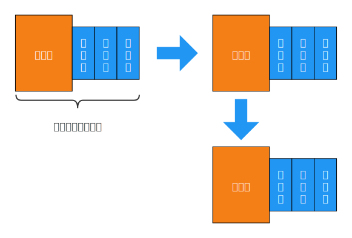
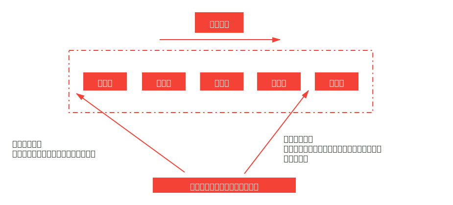

# 事件循环机制，微任务和宏任务的关系

> 本文涉及到的名词：事件循环（Event Loop），宏任务（macro-task）与微任务（micro-task），执行栈和任务队列等。

## 前言

JavaScript 是单线程的，同一时间只能做一件事情。如果碰到某个耗时长的任务（比如一个需要 3s 的网络请求），那么后续的任务都要等待，这种效果是无法接受的，这时我们就引入了[异步任务](/frontend-languages/javascript/sync-and-async/ "同步与异步 Promise，async/await")的概念。

所以 JavaScript 执行主要包括同步任务和异步任务：

* **同步任务**：会放入到[执行栈](/frontend-languages/javascript/execution-context.html "执行上下文")中，他们是要按顺序执行的任务；
* **异步任务**：会放入到任务队列中，这些异步任务一定要等到执行栈清空后才会执行，也就是说异步任务一定是在同步任务之后执行的。

本文所讲的 JavaScript 事件循环机制，它主要与异步任务有关。

## 消息队列

事件循环主要与消息队列有关，所以必须要先知道宏任务与微任务。

在任务队列中，有两种任务：宏任务和微任务。

**宏任务**：script 标签中的整体代码、setTimeout、setInterval、setImmediate、I/O、UI渲染  
**微任务**：process.nextTick（Node.js）、Promise、Object.observe（不常用）、MutationObserver（Node.js）

**任务优先级**：process.nextTick > Promise.then > setTimeout > setImmediate

以上这些是常见的宏任务和微任务，记住就行了，不用追究为什么它是宏任务或微任务，因为就是这样规定的。

## 事件循环

那么什么是事件循环机制呢？

* 一开始整个脚本（script 标签中的整体代码）作为一个宏任务执行。
* 执行过程中同步代码直接执行，宏任务进入宏任务队列，微任务进入微任务队列。
* 当前宏任务执行完毕后，立即执行当前微任务队列中的所有微任务（依次执行）。
* 当前宏任务执行完毕，开始检查渲染，然后 GUI 线程接管渲染（浏览器会在两个宏任务交接期间，对页面进行重新渲染）。
* 渲染完毕后，JavaScript 线程继续接管，开始下一个宏任务（从任务队列中获取），依此循环，直到宏任务和微任务队列都为空。

上面这一过程就称为：事件循环（Event Loop）。

说的通俗一点：宏任务和他所产生的微任务是绑定的，一个宏任务执行完成后，开始执行这个宏任务所产生的微任务，以及微任务产生的微任务。等它们全部执行完后，才会执行下一个宏任务。

<div style="text-align: center;">
  
  <p style="text-align: center; color: #888;">（图解 JavaScript 事件循环）</p>
</div>

## 为什么要分两种任务

每一个任务的执行当中，有可能会产生新的任务，那么这些新的任务有两种插入消息队列的方式：

<div style="text-align: center;">
  
  <p style="text-align: center; color: #888;">（两种插入消息队列的方式）</p>
</div>

这也主要是宏任务和微任务的区别，在任务执行过程中：

* 产生的宏任务直接插入消息队列尾部依次执行。
* 产生的微任务直接插入当前宏任务的微任务队列中，在此宏任务执行完成后，直接执行此宏任务的微任务队列。

**可以看出微任务的存在主要是保证任务执行的时效性，而宏任务就是正常的直接插入消息队列尾部**。

## 代码示例

我们执行如下一段代码，用上面的思路执行，看一下结果是否和预期的一致。

```javascript
console.log('script start')

// 宏任务
setTimeout(() => {
  console.log('setTimeout')
}, 0)

// 微任务 跟在当前宏任务后面
new Promise((resolve) => {
  console.log('new Promise')
  resolve()
  console.log('promise body')
}).then(() => {
  console.log('promise.then 1')
}).then(() => {
  console.log('promise.then 2')
})

console.log('script end')
```

按照上面的思路，我们来理一下，预测一下执行结果，看看实际效果是否是这样的。

执行流程：

* 第一次事件循环
  * 首先这一整段 JavaScript 代码作为一个宏任务先被执行
  * 遇到 `console.log('script start')`，打印出 `"script start"`；
  * 遇到 `setTimeout`，回调函数作为宏任务压入到宏任务队列中，此时宏任务队列：`[setTimeout]`；
  * 遇到 `new Promise`，由于 `new` 一个对象是瞬间执行的，不是异步，所以打印出 `"new Promise"`；
  * 继续执行，由于 Promise 中的异步逻辑在 `then` 里面，在 `then` 之前的都不是异步，所以打印出 `"promise body"`；
  * 遇到了第一个 `.then`，它是个微任务，将它放入微任务队列，跟在当前宏任务（整体代码）后面，此时微任务队列：`[promise 1]`；
  * Promise 的第一个 `.then` 还没执行，只是排好队伍了，因此继续往后，遇到 `console.log('script end')`，打印出 `"script end"`。
  * 执行第一个宏任务后的微任务
  * 执行 Promise 的第一个 `.then`，打印出 `"promise 1"`，，此时微任务队列：`[]`；
  * 又遇到 `.then`，它是个微任务，将它放入微任务队列，跟在当前宏任务（整体代码）后面，此时微任务队列：`[promise 2]`；
  * 执行 Promise 的第二个 `.then`，打印出 `"promise 2"`，此时微任务队列：`[]`；
  * 整体代码执行完，微任务队列也执行完，当前的事件循环结束。
* 第二次事件循环
  * 执行 `setTimeout` 的回调，打印出 `"setTimeout"`。

预测打印结果：

```text
"script start"
"new Promise"
"promise body"
"script end"
"promise.then 1"
"promise.then 2"
"setTimeout"
```

执行代码后可以发现，实际打印结果和预测一致。

## 复杂情况

如果遇到更复杂的场景，比如当前微任务里有微任务，微任务里有宏任务，多层嵌套的情况，只需记住一句话：**微任务跟在当前宏任务后面，执行完当前宏任务，微任务就跟上，然后再执行下一个宏任务**。

## 应用场景

除了在前端面试中，会问到关于事件循环、执行栈的问题，了解 JavaScript 事件循环机制有没有实质的作用呢？

* 以后我们在代码中使用 Promise，setTimeout 时，思路将更加清晰，用起来更佳得心应手；
* 在阅读一些源码时，对于一些 setTimeout 相关的骚操作可以理解的更加深入；
* 理解 JavaScript 中的任务执行流程，加深对异步流程的理解，少犯错误。

## 总结

* JavaScript 事件循环总是从一个宏任务开始执行；
* 一个事件循环过程中，只执行一个宏任务，但是可能执行多个微任务；
* 执行栈中的任务产生的微任务会在当前事件循环内执行；
* 执行栈中的任务产生的宏任务要在下一次事件循环才会执行。

最后的最后，记住，JavaScript 是一门单线程语言，异步操作都是放到事件循环队列里面，等待主执行栈来执行的，并没有专门的异步执行线程。

（完）
