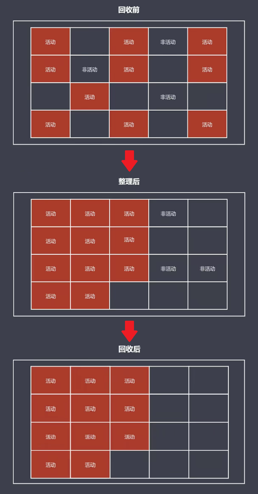
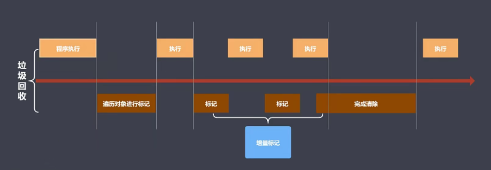

# 垃圾回收

## 前置概念

### 内存管理

内存管理指申请内存空间、使用内存空间和释放内存空间的这一系列步骤。

JavaScript 不能像 C 或 C++ 那样由开发者主动调用 API 来完成内存管理，而是使用垃圾回收机制来自动管理内存，其好处是可以大幅简化程序的内存管理代码，降低程序员的负担，减少因长时间运转而带来的内存泄露问题。

### 何为垃圾

在 JavaScript 中以下两种对象数据被定义为垃圾：

* 对象不再被引用时就是垃圾。
* 对象不能**从根上访问到**时就是垃圾（对象不是可达对象 === 垃圾）。

### 可达对象

在谈到 JavaScript 的垃圾回收时，「可达对象」这个名词会经常提及，那么什么是可达对象呢？

* 可以访问到的对象就是可达对象（通过引用、作用域链可以查找到）。
* 可达的标准就是从根出发是否能够被找到。
* JavaScript 中的根可以理解为是全局变量对象（全局执行上下文）。

在清楚上述这些前置概念后，就可以进入正文了。

## GC 算法

### GC 里的垃圾

GC（Garbage Collection）是垃圾回收机制的简写，它可以查找内存中的垃圾、释放空间和回收空间。在 GC 中，有两种判定为垃圾的标准（当作垃圾 ≠ 被回收）：

* 程序中不再需要使用的对象

```javascript
function func() {
  // 没有声明变量的关键字，name 被挂载在当前的 Window 对象下
  name = 'peter';
  return `${name} is a dog.`;
}

func();
```

* 程序中不能再访问到的对象

```javascript
function func() {
  // 增加声明变量的关键字，当函数调用结束后，在外部空间就不能访问到 name 了
  const name = 'peter';
  return `${name} is a dog.`;
}

func();
```

在垃圾回收器进行工作的时候，如何查找垃圾、怎样释放空间、回收空间时如何进行分配，这一系列过程中遵循的规则，就是 GC 算法。

常见的 GC 算法有：

* 引用计数：通过一个数字判断当前对象是不是垃圾。
* 标记清除：在 GC 工作时给活动对象添加一个标记，来判断它是否是一个垃圾。
* 标记整理：同标记清除，但在后续回收过程中可以做一些不同的事情。
* 分代回收：V8 中的回收机制。

下面分别讲一下这几种常见算法的实现原理。

### 引用计数算法实现原理

核心思想：在内部通过一个引用计数器，维护当前对象的引用数。在引用关系改变时修改引用计数器的数字。当这个数值为 0 的时候，GC 开始工作，将其所在的对象空间进行回收和释放。

引用计数算法优点：

* 可以即时回收垃圾对象
* 最大限度减少程序卡顿时间（能尽可能保证内存不会有占满的时候）

引用计数算法缺点：

* 无法回收循环引用的对象
```javascript
function fn() {
  const obj1 = {};
  const obj2 = {};
  obj1.name = obj2;
  obj2.name = obj1;
  return 'peter is a dog.';
}

// 函数调用完后，虽然全局作用域内找不到 obj1 和 obj2
// 但由于他们两者之间有互相指引关系，所以引用计数器数值不为 0，因此空间无法回收
fn()
```
* 资源消耗较大（需要时刻监控当前对象的引用数值）

### 标记清除算法实现原理

核心思想：将整个垃圾回收操作分成「标记」和「清除」二个阶段完成。

第一个阶段会遍历所有对象，找出活动对象（可达对象）并标记。第二个阶段仍是遍历所有对象，清除没有标记的对象，同时消除在第一阶段设置的标记，便于 GC 下一次的正常工作。

经过两个阶段的遍历行为，可以回收相应的空间，交给空闲列表维护以供后续的程序代码使用。

标记清除算法优点：

* 可以回收循环引用的对象（例如函数局部作用域内互相引用的变量，当函数调用结束之后，局部空间的变量失去了与全局空间在作用域上的连接，成为了不可达对象，在标记阶段就无法完成标记，在清除阶段会被清除）

标记清除算法缺点：

* 容易产生碎片化空间，浪费空间（由于当前所回收的垃圾对象在地址上本身是不连续的，在回收之后它们会分散在各个角落，后续使用的时候如果新的生成空间刚好大小匹配就可以直接用，如果多了或者少了就不太适合使用了）
* 不会立即回收垃圾对象

### 标记整理算法实现原理

核心思想：标记整理可以看作是标记清除的增强。标记阶段的操作和标记清除一致，清除阶段会先执行整理，移动对象位置（让它们在地址上产生连续）。

<div style="text-align: center;">
  
  <p style="text-align: center; color: #888">（标记整理算法图示）</p>
</div>

标记整理算法优点：

* 减少碎片化空间

标记整理算法缺点：

* 不会立即回收垃圾对象

## V8 垃圾回收

### V8 是什么

V8 是一款主流的 JavaScript 执行引擎，日常使用的 Chrome 浏览器和目前的 Node.js 平台都采用这个引擎去执行 JavaScript 代码。因为 V8 采用即时编译，能将源代码直接翻译成可直接执行的机器码，所以速度非常快。

V8 对所能使用的内存空间进行了上限约束：64 位操作系统为 1.5GB，32 位操作系统为 800MB。

::: tip 为什么是 1.5GB 这个数值？
V8 最初是作为浏览器的 JavaScript 引擎而设计，所以对网页应用来说不太可能遇到大量内存的场景。  
V8 内部实现的垃圾回收机制，也决定了这个数值设定比较合理（V8 在执行垃圾回收时会阻塞 JavaScript应用逻辑，经官方测试，当垃圾内存达到 1.5GB 时，采用增量标记算法进行垃圾回收需要消耗 50ms，采用非增量标记算法进行垃圾回收需要消耗 1s，这样浏览器将在 1s 内失去对用户的响应，造成假死现象）。
:::

### V8 内存分配

V8 将内存（堆）空间一分为二，其中小空间用于存储新生代对象（64 位 - 32MB | 32 位 - 16MB），另一部分较大空间用于存储老生代对象（64 位 - 1.4GB | 32 位 - 700MB）。

::: tip 解释
新生代对象指的是存活时间较短的对象（例如局部作用域中的变量）。  
老生代对象指的是存活时间较长的对象（例如全局作用域下的变量、闭包中放置的变量）。
:::

<div style="text-align: center;">
  
  <p style="text-align: center; color: #888">（V8 内存分配）</p>
</div>

### V8 垃圾回收策略

在 JavaScript 中的数据，分为基本数据类型和引用数据类型两种，其中基本数据类型由程序语言自身进行控制，V8 所进行的垃圾回收操作主要针对存在堆内存中的引用数据类型。

V8 采用分代回收的思想，将内存分为新生代、老生代。针对不同代的对象采用不同的 GC 算法进行回收。

V8 中常用的 GC 算法有：

* 分代回收
* 空间复制
* 标记清除
* 标记整理
* 增量标记

### V8 如何回收新生代对象

* 采用复制算法 + 标记整理算法。
* 新生代内存区分为两个大小相等的空间：使用空间为 From，空闲空间为 To。
* 每当有新生对象诞生，就会在 From 空间出现。
* 一旦 From 空间被占满，就触发 GC。
* 对 From 空间的活动对象进行标记整理，然后将它们整个拷贝至 To。
* 清空 From 空间 （这样就可以实现把不活跃的对象给回收掉）。
* From 与 To 交换空间，开始下一轮循环。

注意点：

* 拷贝过程中可能出现晋升：将新生代对象移动至老生代存储区。
* 一轮 GC 结束还存活的新生代对象需要晋升。
* 拷贝时发现 To 空间的使用率超过 25%，则将本次拷贝对象直接移动至老生代存储区（25%：防止交换空间后，From 空间直接爆满，新的活动对象存不进去）。

### V8 如何回收老生代对象

* 主要采用标记清除、标记整理、增量标记算法
* 首先使用标记清除完成垃圾空间的回收（相对于空间碎片的问题，能够明显提升速度）
* 采用标记整理进行空间优化（新生代对象晋升时，如果老生代存储区空间不够，就触发标记整理）
* 采用增量标记进行效率优化

细节对比：

* 新生代区域垃圾回收使用空间换时间（复制算法导致每时每刻都会存在一个空闲空间）
* 老生代区域垃圾回收不适合复制算法（老生代存储空间较大，如果一分为二会浪费太多空间。且老生代存储空间会存储较多对象数据，如果进行复制操作会消耗过多时间。）

增量标记算法如何优化垃圾回收：

当垃圾回收开始工作的时候，会阻塞当前 JavaScript 程序的执行，于是就会产生「空档期」。增量标记算法能够将原本一整段的垃圾回收操作拆分成多个小步骤，从而替代原先一口气完成的垃圾回收操作，这样做可以让垃圾回收与程序执行交替工作。

如下图所示，当程序运行到某个时刻，触发垃圾回收机制。首先对老生代存储区的对象数据进行遍历，先找到第一层的可达对象，然后程序继续执行，接着对子元素（第二层可达对象）进行标记操作，接着程序继续执行，以此循环直到标记过程结束，最后完成垃圾回收操作后，程序继续执行。

<div style="text-align: center;">
  
  <p style="text-align: center; color: #888">（增量标记算法如何优化垃圾回收）</p>
</div>

上述这个过程看似程序停顿了很多次，但整个 V8 最大的垃圾回收（达到 1.5GB）即使采用非增量标记的方式去回收也不会超过 1s。

## 内存问题

### 内存泄漏和内存溢出

#### 1）内存泄漏

内存泄漏是指程序执行时，一些变量没有及时释放，一直占用着内存，而这种占用内存的行为就叫做内存泄漏。

作为一般的用户，根本感觉不到内存泄漏的存在。真正有危害的是内存泄漏的堆积，这会最终消耗尽系统所有的内存。从这个角度来说，内存泄漏如果一直堆积，最终会导致内存溢出问题。

在 JavaScript 中，内存泄漏一般有下面几个：

* 全局变量引起的内存泄漏
  * 根据 JavaScript 的垃圾回收机制我们知道，全局变量是不会被回收的，所以一些意外的、不需要的全局变量多了，没有释放，就造成了内存泄漏。
* 闭包的使用不恰当
  * 闭包其实也是跟全局变量挂钩了，但是闭包只是因为被全局变量引用了，内部的变量因为被闭包引用得不到释放，也会造成内存泄漏。
* 计时器、回调、监听等事件没有移除
  * 计时器、回调、事件监听等没有清除是一直存在的，一直存在没有被释放就会造成内存泄漏。
* 给 DOM 添加属性或方法
  * 给 DOM 添加点击方法、添加属性等，也会造成变量引用得不到释放，造成内存泄漏。

#### 2）内存溢出

执行程序时，程序会向系统申请一定大小的内存，当系统现在的实际内存少于需要的内存时，就会造成内存溢出。内存溢出造成的结果是先前保存的数据会被覆盖或者后来的数据会没地方存。

最简单的就是写一个千万级别的循环，然后用浏览器打开，浏览器会非常卡，甚至直接报错内存不足，崩溃了。不同浏览器会有不同的表现。

在 JavaScript 中，内存溢出一般是内存泄漏造成的，占用的内存不需要用到了但是没有及时释放，内存泄漏积累的多了轻的话影响系统性能，严重直接引起内存溢出系统崩溃。

### 内存问题的体现

当程序的内存出现问题的时候，具体会表现出什么样的形式。

首先，如果界面出现延迟加载或者经常性的暂停，排除完网络环境的问题，这种情况一般都会判定内存存在问题，而且与 GC 存在着频繁的垃圾回收操作是相关的。也就是代码中肯定存在瞬间让内存爆炸的代码。这样的代码是不合适的需要去进行定位。

其次，就是当界面出现了持续性的糟糕性能表现，也就是在使用过程中，一直都不是特别的好用，这种情况底层一般会认为存在着内存溢出。所谓内存溢出指的就是，当前界面为了达到最佳的使用速度，可能会申请一定的内存空间，但是这个内存空间的大小，远超过了当前设备本身所能提供的大小，这个时候就会感知到一段持续性的糟糕性能的体验，同样肯定是假设当前网络环境是正常的。

最后，当使用一些界面的时候，如果感知到界面的使用流畅度，随着时间的加长越来越慢，或者说越来越差，这个过程就伴随着内存泄露，因为在这种情况下刚开始的时候是没有问题的，由于我们某些代码的出现，可能随着时间的增长让内存空间越来越少，这也就是所谓的内存泄漏，因此，出现这种情况的时候界面会随着使用时间的增长表现出性能越来越差的现象。

在排查内存问题的时候，可以借助浏览器所提供的几个工具：

* 浏览器所带的任务管理器：可以直接以数值的方式将当前应用程序在执行过程中内存的变化体现出来。
* Timeline 时序图：可以直接把应用程序执行过程中所有内存的走势以时间点的方式呈现出来。
* 浏览器中的堆快照功能：可以很有针对性的查找界面对象中是否存在一些分离的 DOM，因为分离 DOM 的存在也就是一种内存上的泄露。

至于怎样判断界面是否存在着频繁的垃圾回收，这就需要借助于不同的工具来获取当前内存的走势图，然后进行一个时间段的分析，从而得出判断。
