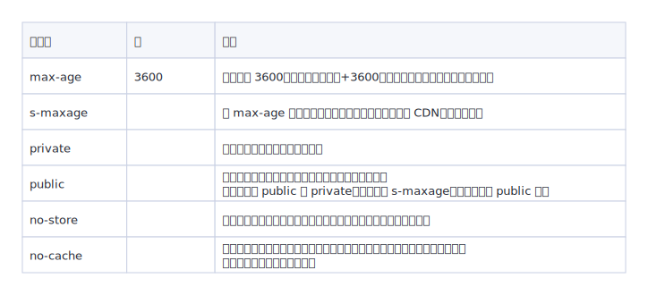

# 浏览器缓存机制

缓存可以减少网络 IO 消耗，提高访问速度。浏览器缓存机制有四个方面，它们按照获取资源时请求的优先级依次排列如下：

* Memory Cache
* Service Worker Cache
* HTTP Cache
* Push Cache

在浏览器的 Network 面板，Size 那一栏写着形如 `(from disk cache)` 这样描述的，就是代表该资源是通过缓存获取到的。

## HTTP 缓存机制

> 考虑到 HTTP 缓存是最主要、最具有代表性的缓存策略，故优先针对 HTTP 缓存机制进行剖析。

HTTP 缓存分为**强缓存**和**协商缓存**。优先级较高的是强缓存，在命中强缓存失败的情况下，才会走协商缓存。

### 强缓存

强缓存是利用 HTTP 头中的 `Expires` 和 `Cache-Control` 两个字段来控制的。强缓存中，当请求再次发出时，浏览器会根据其中的 `expires` 和 `cache-control` 判断目标资源是否**命中强缓存**，若命中则直接从缓存中获取资源，**不会再与服务端发生通信**。

命中强缓存的情况下，返回的 HTTP 状态码为 200 （如下图）。

<div style="text-align: center;">
  
  <p style="text-align: center; color: #888;">（命中强缓存）</p>
</div>

在 Http1.0 的规范中，在请求头里用 `expires` 表示资源的过期时间，值是一个**绝对的时间戳**，是由服务器端返回的。在浏览器第一次请求资源时，服务器端会在 Response Headers 中将过期时间写入 `expires` 字段。接下来如果我们试图再次向服务器请求资源，浏览器就会先对比本地时间和 `expires` 的时间戳，如果本地时间小于 `expires` 设定的过期时间，那么就直接去缓存中取这个资源。

由于时间戳是服务器来定义的，而本地时间的取值却来自客户端，因此客户端和服务器时间不同，会导致缓存命中误差。

为了解决这个问题，在 HTTP1.1 的规范中，提出了 `cache-control` 字段，这个字段的 `max-age` 属性允许我们通过设定**相对的时间长度**来达到同样的目的：客户端会记录请求到资源的时间点，以此作为相对时间的起点，从而确保参与计算的两个时间节点（起始时间和当前时间）都来源于客户端，由此便能够实现更加精准的判断。

当 `Cache-Control` 与 `Expires` 同时出现时，`Cache-Control` 的优先级更高。

`cache-control` 中常见的几个响应属性值：

<div style="text-align: center;">
  
  <p style="text-align: center; color: #888;">（cache-control 属性值）</p>
</div>

### 协商缓存

强缓存是由本地浏览器在确定是否使用缓存，当浏览器没有命中强缓存时就会使用协商缓存：浏览器向服务器发送请求，验证协商缓存是否命中，如果缓存命中则返回 304 状态码（表示缓存资源未改动），否则返回新的资源数据。

<div style="text-align: center;">
  
  <p style="text-align: center; color: #888;">（命中协商缓存）</p>
</div>

如果启用了协商缓存，它会在首次请求时随着 Response Headers 返回：

```
Last-Modified: Wed, 31 May 2023 08:21:46 GMT
```

随后我们每次请求时，会带上一个叫 `If-Modified-Since` 的时间戳字段，它的值正是上一次 Response 返回给它的 `Last-Modified` 值：

```
If-Modified-Since: Wed, 31 May 2023 08:21:46 GMT
```

服务器接收到这个时间戳后，会比对该时间戳和资源在服务器上的最后修改时间是否一致，从而判断资源是否发生了变化。如果发生了变化，就会返回一个完整的响应内容，并在 Response Headers 中添加新的 `Last-Modified` 值；否则，返回如上图的 304 响应，Response Headers 不会再添加 `Last-Modified` 字段。

单纯使用 `Last-Modified` 存在一些弊端，比如：

* 我们编辑了文件，但文件的内容没有改变。服务端并不清楚我们是否真正改变了文件，它仍然通过最后编辑时间进行判断。因此这个资源在再次被请求时，会被当做新资源，进而引发一次完整的响应 —— 不该重新请求的时候，也会重新请求。
* 当我们修改文件的速度过快时（比如花了 `100ms` 完成了改动），由于 `If-Modified-Since` 只能检查到以秒为最小计量单位的时间差，所以它是感知不到这个改动的 —— 该重新请求的时候，反而没有重新请求了。

为了让服务器正确感知文件的变化，就引入了 `Etag`。它是由服务器为每个资源生成的**唯一的标识字符串**，这个标识字符串是基于文件内容编码的，只要文件内容不同，它们对应的 `Etag` 就是不同的，反之亦然。

`Etag` 和 `Last-Modified` 类似，当首次请求时，我们会在 Response Headers 里获取到一个最初的标识符字符串：

```
Etag: W/"d989f816c318997ceef047a94f447c2a"
```

那么下一次请求时，请求头里就会带上一个值相同的、名为 `if-None-Match` 的字符串供服务端比对了：

```
If-None-Match: W/"d989f816c318997ceef047a94f447c2a"
```

`Etag` 的生成过程需要服务器额外付出开销，会影响服务端的性能，这是它的弊端。因此启用 `Etag` 并不能替代 `Last-Modified`，它只能作为 `Last-Modified` 的补充和强化存在。**`Etag` 在感知文件变化上比 `Last-Modified` 更加准确，优先级也更高。当 `Etag` 和 `Last-Modified` 同时存在时，以 `Etag` 为准**。

### 如何配置缓存策略

## MemoryCache

指存在内存中的缓存。从优先级上来说，它是浏览器最先尝试去命中的一种缓存。从效率上来说，它是响应速度最快的一种缓存。

当进程结束后，也就是 tab 关闭以后，内存里的数据也将不复存在。

在日常开发中，Base64 格式的图片，一般可以被塞进 memory cache，这可以视作浏览器为节省渲染开销的自动行为。此外，体积不大的 JS、CSS 文件，也有较大几率被写入内存。但因为内存资源是有限的，对于较大的 JS、CSS 文件就没有这个待遇了，它们往往被直接甩进磁盘。

## Service Worker Cache

Service Worker 是一种独立于主线程之外的 Javascript 线程。它脱离于浏览器窗体，因此无法直接访问 DOM。它可以帮我们实现离线缓存、消息推送和网络代理等功能。我们借助 Service worker 实现的离线缓存就称为 Service Worker Cache。

Service Worker 的生命周期包括 `install`、`active`、`working` 三个阶段。一旦 Service Worker 被 `install`，它将始终存在，只会在 `active` 与 `working` 之间切换，除非我们主动终止它。这是它可以用来实现离线存储的重要先决条件。

要想使用 Service Worker 实现离线缓存，首先在入口文件中插入这样一段 JS 代码，用以判断和引入 Service Worker：

```javascript
window.navigator.serviceWorker.register('/test.js').then(
  function () {
    console.log('注册成功')
  }).catch(err => {
    console.error("注册失败")
  })
```

在 `test.js` 中，我们进行缓存的处理。假设我们需要缓存的文件分别是 `test.html`，`test.css` 和 `test.js`：

```javascript
// Service Worker 会监听 install 事件，我们在其对应的回调里可以实现初始化的逻辑  
self.addEventListener('install', event => {
  event.waitUntil(
    // 考虑到缓存也需要更新，open 内传入的参数为缓存的版本号
    caches.open('test-v1').then(cache => {
      return cache.addAll([
        // 此处传入指定的需缓存的文件名
        '/test.html',
        '/test.css',
        '/test.js'
      ])
    })
  )
})

// Service Worker 会监听所有的网络请求，网络请求的产生触发的是 fetch 事件，我们可以在其对应的监听函数中实现对请求的拦截，进而判断是否有对应到该请求的缓存，实现从 Service Worker 中取到缓存的目的
self.addEventListener('fetch', event => {
  event.respondWith(
    // 尝试匹配该请求对应的缓存值
    caches.match(event.request).then(res => {
      // 如果匹配到了，调用 Server Worker 缓存
      if (res) {
        return res;
      }
      // 如果没匹配到，向服务端发起这个资源请求
      return fetch(event.request).then(response => {
        if (!response || response.status !== 200) {
          return response;
        }
        // 请求成功的话，将请求缓存起来。
        caches.open('test-v1').then(function (cache) {
          cache.put(event.request, response);
        });
        return response.clone();
      });
    })
  );
});
```

需要注意：Server Worker 必须以 HTTPS 协议为前提。因为 Server Worker 中涉及到请求拦截，所以必须使用 HTTPS 协议来保障安全。如果是本地调试的话，localhost 是可以的。

## Push Cache

Push Cache 是指 HTTP2 在 server push 阶段存在的缓存。这块的知识比较新，应用也还处于萌芽阶段。

关键特性：

* Push Cache 是缓存的最后一道防线。浏览器只有在 Memory Cache、HTTP Cache 和 Service Worker Cache 均未命中的情况下才会去询问 Push Cache。
* Push Cache 是一种存在于会话阶段的缓存，当 session 终止时，缓存也随之释放。
* 不同的页面只要共享了同一个 HTTP2 连接，那么它们就可以共享同一个 Push Cache。

（完）
