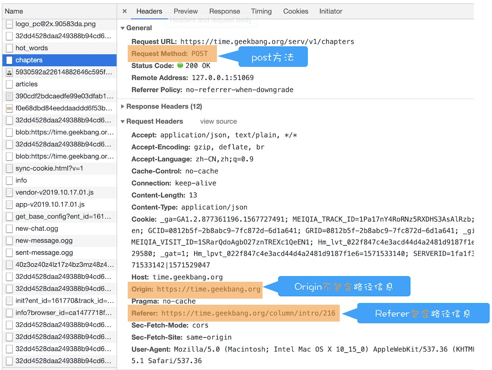

# CSRF 攻击

> 陌生链接不要随便点！！！

## 什么是 CSRF 攻击

CSRF 英文全称是 Cross-site request forgery，所以又称为「跨站请求伪造」，是指黑客引诱用户打开黑客的网站，在黑客的网站中，利用用户的登录状态发起的跨站请求。

简单来讲，CSRF 攻击就是黑客利用了用户的登录状态，并通过第三方的站点来做一些坏事。

和 XSS 不同的是，CSRF 攻击不需要将恶意代码注入用户的页面，仅仅是利用服务器的漏洞和用户的登录状态来实施攻击。

## CSRF 攻击方式

### 自动发起 Get 请求

黑客将带有攻击性质的请求接口（比如转账）隐藏在 img 标签内，欺骗浏览器这是一张图片资源。当该页面被加载时，浏览器会自动发起 img 的资源请求，如果服务器没有对该请求做判断的话，那么服务器就会认为该请求是一个转账请求，于是用户账户上的钱就被转移到黑客的账户上去了。

```html
<!DOCTYPE html>
<html>
  <body>
    <h1>黑客的站点：CSRF攻击演示</h1>
    
  </body>
</html>
```

### 自动发起 POST 请求

黑客在他的页面中构建了一个隐藏的表单，该表单的内容就是带有攻击性质的请求接口（比如转账接口）。当用户打开该站点之后，这个表单会被自动执行提交；当表单被提交之后，服务器就会执行转账操作。因此使用构建自动提交表单这种方式，就可以自动实现跨站点 POST 数据提交。

```html

<!DOCTYPE html>
<html>
<body>
  <h1>黑客的站点：CSRF攻击演示</h1>
  <form id='hacker-form' action="https://zhifubao.com/send-money/send-money" method=POST>
    <input type="hidden" name="user" value="hacker" />
    <input type="hidden" name="number" value="100" />
  </form>
  <script> document.getElementById('hacker-form').submit(); </script>
</body>
</html>
```

### 引诱用户点击链接

黑客诱惑用户点击他站点上的链接，这种方式通常出现在论坛或者恶意邮件上。黑客会采用很多方式去诱惑用户点击链接（比如美女图片的下载地址）。

```html
<div>
  </div> <div>
  <a href="https://zhifubao.com/send-money?user=hacker&number=100" taget="_blank">
    点击下载美女照片
  </a>
</div>
```

## CSRF 攻击的前置条件

发起 CSRF 攻击的三个必要条件：

* 目标站点一定要有 CSRF 漏洞。
* 用户要登录过目标站点，并且在浏览器上保持有该站点的登录状态。
* 需要用户打开一个第三方站点，可以是黑客的站点，也可以是一些论坛。

最关键的一点是要能找到服务器的漏洞，所以说对于 CSRF 攻击我们主要的防护手段是提升服务器的安全性。

## 如何防止 CSRF 攻击

### 充分利用好 Cookie 的 SameSite 属性

Cookie 是浏览器和服务器之间维护登录状态的一个关键数据。通常 CSRF 攻击都是从第三方站点发起的，要防止 CSRF 攻击，浏览器就要实现从第三方站点发送请求时禁止 Cookie 的发送：

* 如果是从第三方站点发起的请求，那么需要浏览器禁止发送某些关键 Cookie 数据到服务器。
* 如果是同一个站点发起的请求，那么就需要保证 Cookie 数据正常发送。

而 Cookie 中的 SameSite 属性正是为了解决这个问题，通过使用 SameSite 可以有效地降低 CSRF 攻击的风险。

在 HTTP 响应头中，通过 `set-cookie` 字段设置 Cookie 时，可以带上 `SameSite` 选项，如下：

```text
set-cookie: 1P_JAR=2019-10-20-06; expires=Tue, 19-Nov-2019 06:36:21 GMT; path=/; domain=.google.com; SameSite=none
```

SameSite 选项通常有 `Strict`、`Lax` 和 `None` 三个值：

* Strict 最为严格。如果 SameSite 的值是 Strict，那么浏览器会完全禁止第三方 Cookie。
* Lax 相对宽松一点。在跨站点的情况下，从第三方站点的链接打开和从第三方站点提交 Get 方式的表单这两种方式都会携带 Cookie。但如果在第三方站点中使用 Post 方法，或者通过 img、iframe 等标签加载的 URL，这些场景都不会携带 Cookie。
* 而如果使用 None 的话，在任何情况下都会发送 Cookie 数据。

对于防范 CSRF 攻击，我们可以针对实际情况将一些关键的 Cookie 设置为 Strict 或者 Lax 模式，这样在跨站点请求时，这些关键的 Cookie 就不会被发送到服务器，从而使得黑客的 CSRF 攻击失效。

### 验证请求的来源站点

即在服务器端验证请求来源的站点。

由于 CSRF 攻击大多来自于第三方站点，因此服务器可以禁止来自第三方站点的请求。

通过 HTTP 请求头中的 `Referer` 和 `Origin` 属性可以判断请求是否来自第三方站点：

* `Referer` 是 HTTP 请求头中的一个字段，记录了该 HTTP 请求的来源地址。
  * 但开发者可以通过浏览器提供的 Referrer Policy 选择不上传 `Referer` 值。
* 通过 XMLHttpRequest、Fetch 发起跨站请求或者通过 Post 方法发送请求时，都会带上 `Origin` 属性。
  * `Origin` 属性只包含了域名信息（出于安全考虑），并没有包含具体的 URL 路径，这是 `Origin` 和 `Referer` 的一个主要区别。

因此，服务器的策略是优先判断 `Origin`，如果请求头中没有包含 `Origin` 属性，再根据实际情况判断是否使用 `Referer` 值。

<div style="text-align: center;">
  
  <p style="text-align: center; color: #888;">（Post 请求时的 Origin 和 Referer 信息，图片来源于网络）</p>
</div>

### CSRF Token

CSRF Token 验证的方式分为两步：

* 第一步，在浏览器向服务器发起请求时，服务器生成一个 CSRF Token。CSRF Token 其实就是服务器生成的字符串，然后将该字符串植入到返回的页面中。
* 第二步，在浏览器端如果要发起转账的请求，那么需要带上页面中的 CSRF Token，然后服务器会验证该 Token 是否合法。如果是从第三方站点发出的请求，那么将无法获取到 CSRF Token 的值，所以即使发出了请求，服务器也会因为 CSRF Token 不正确而拒绝请求。

CSRF Token 传递到页面的示例：

```html
<!DOCTYPE html>
<html>
<body>
    <form action="https://zhifubao.com/send-money" method="POST">
      <input type="hidden" name="csrf-token" value="nc98P987bcpncYhoadjoiydc9ajDlcn">
      <input type="text" name="user">
      <input type="text" name="number">
      <input type="submit">
    </form>
</body>
</html>
```

## 参考资料

* [SameSite cookie 的说明](https://web.dev/samesite-cookies-explained/)

（完）
