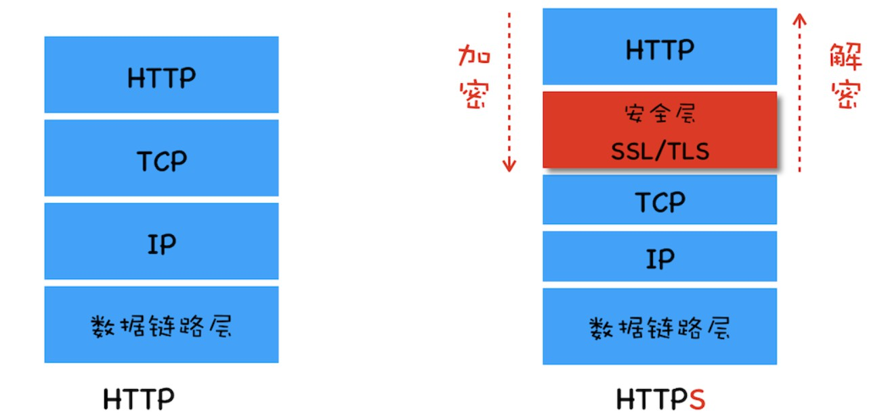
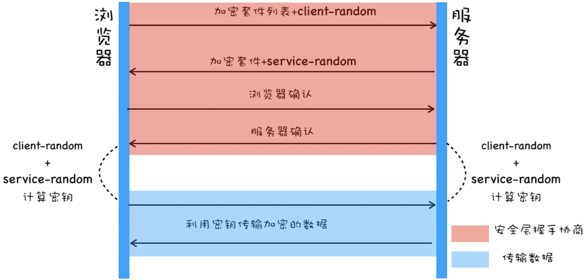
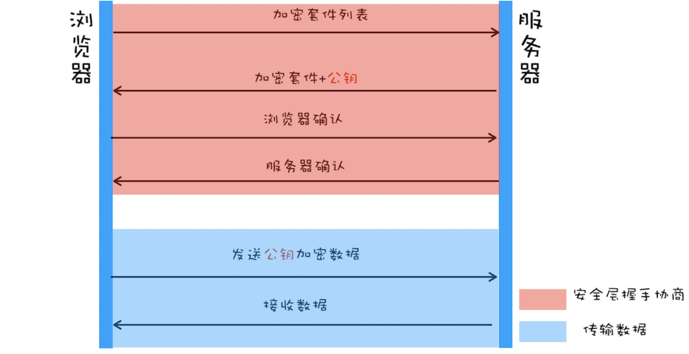
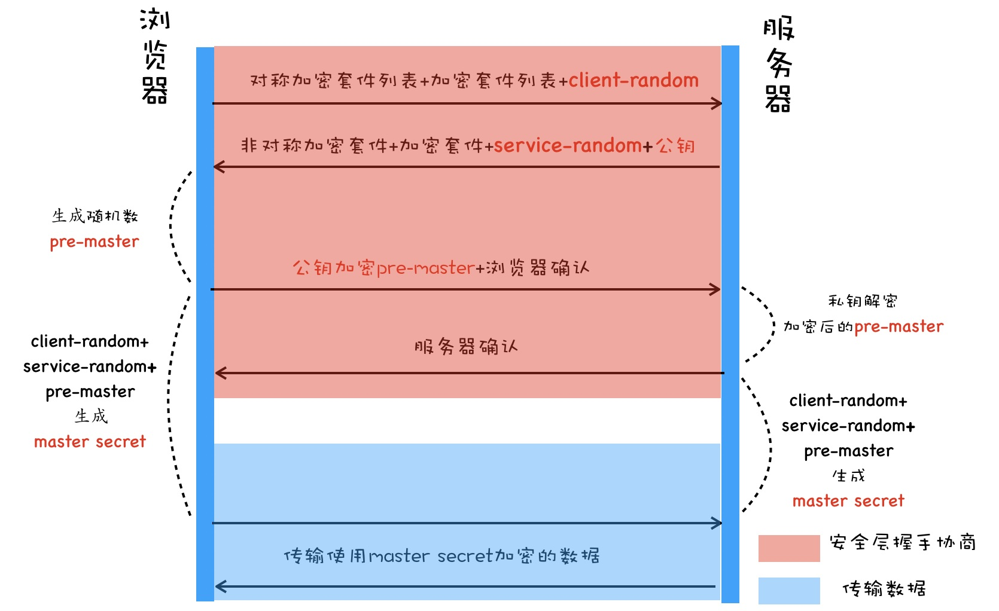
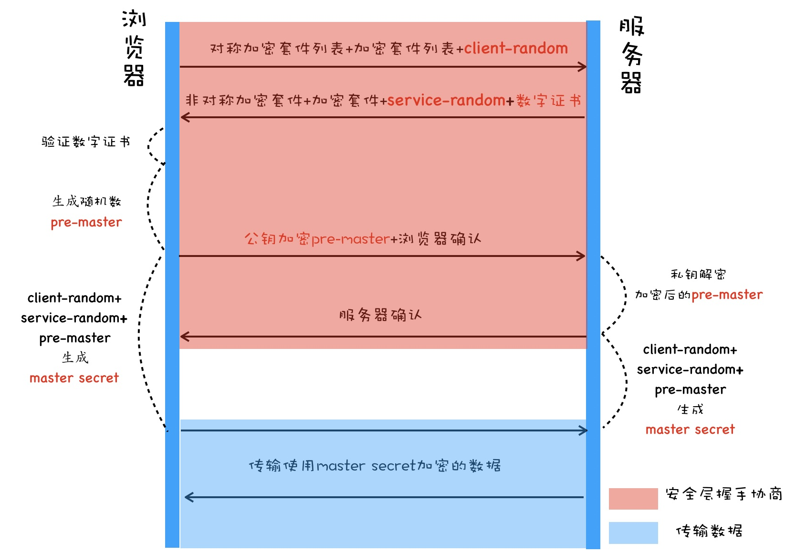

# 网络安全协议（HTTPS）

## HTTP 的明文传输

HTTP 协议最初是为了传输超文本文件，没有加密传输数据的需求，所以是明文传输的。

在将 HTTP 数据提交给 TCP 层之后，数据会经过用户电脑、WiFi 路由器、运营商和目标服务器，在这中间的每个环节中，数据都有可能被窃取或篡改。比如用户电脑被黑客安装了恶意软件，那么恶意软件就能抓取和篡改所发出的 HTTP 请求的内容。或者用户一不小心连接上了 WiFi 钓鱼路由器，那么数据也都能被黑客抓取或篡改。

也就是说，在传输过程中的每一个环节，数据都有可能被中间人窃取、伪造和篡改，这种攻击方式被称为中间人攻击。

## 在 HTTP 协议栈中引入安全层

鉴于安全需要，在整个 HTTP 协议栈里，于 TCP 和 HTTP 之间插入一个安全层，所有经过安全层的数据都会被加密或者解密，如下图示意：

  
  
（HTTP VS HTTPS，图来源于教材）

总的来说，安全层有两个主要的职责：对发起 HTTP 请求的数据进行加密操作和对接收到 HTTP 的内容进行解密操作。下面有几种加解密方式来实现 HTTPS 协议。

### 第一版：使用对称加密

对称加密是最简单的一种加密方式：加密和解密都使用相同的密钥。

对于实现 HTTPS，具体过程如下：

* 浏览器发送它所支持的加密套件列表和一个随机数 `client-random`，这里的加密套件是指加密的方法，加密套件列表就是指浏览器能支持多少种加密方法列表。
* 服务器会从加密套件列表中选取一个加密套件，然后还会生成一个随机数 `service-random`，并将 `service-random` 和加密套件列表返回给浏览器。
* 最后浏览器和服务器分别返回确认消息。
* 浏览器端和服务器端使用相同的方法将 `client-random` 和 `service-random` 混合起来生成一个密钥 master secret。
* 有了密钥 master secret 和加密套件之后，双方就可以进行数据的加密传输了

  
  
（使用对称加密实现 HTTPS，图来源于教材）

缺点：

整个过程中传输 `client-random` 和 `service-random` 的过程却是明文的，黑客一旦拿到协商的加密套件和双方的随机数，就也可以合成密钥，进而使用密钥来伪造或篡改数据了。

### 第二版：使用非对称加密

非对称加密算法有 A、B 两把密钥，如果你用 A 密钥来加密，那么只能使用 B 密钥来解密；反过来，如果你要 B 密钥来加密，那么只能用 A 密钥来解密。

在 HTTPS 中，服务器会将其中的一个密钥通过明文的形式发送给浏览器，我们把这个密钥称为公钥，服务器自己留下的那个密钥称为私钥。

使用非对称加密改造 HTTPS 协议的过程如下：

* 首先浏览器发送加密套件列表给服务器。
* 然后服务器会选择一个加密套件，不过和对称加密不同的是，使用非对称加密时服务器上需要有用于浏览器加密的公钥和服务器解密 HTTP 数据的私钥，由于公钥是给浏览器加密使用的，因此服务器会将加密套件和公钥一道发送给浏览器。
* 浏览器和服务器返回确认消息。
* 浏览器端就有了服务器的公钥，在浏览器端向服务器端发送数据时，就可以使用该公钥来加密数据。
* 由于公钥加密的数据只有私钥才能解密，所以即便黑客截获了数据和公钥，他也是无法使用公钥来解密数据的。

  
  
（非对称加密实现 HTTPS，图来源于教材）

缺点：

* 非对称加密的效率太低。这会严重影响到加解密数据的速度，进而影响到用户打开页面的速度。
* 无法保证服务器发送给浏览器的数据安全。虽然浏览器端可以使用公钥来加密，但是服务器端只能采用私钥来加密，私钥加密只有公钥能解密，但黑客也是可以获取得到公钥的，这样就不能保证服务器端数据的安全了。

### 第三版：对称加密和非对称加密搭配使用

综合上面两种方案，在传输数据阶段依然使用对称加密，但是对称加密的密钥采用非对称加密来传输。

大致流程如下：

* 首先浏览器向服务器发送对称加密套件列表、非对称加密套件列表和随机数 `client-random`。
* 服务器保存随机数 `client-random`，选择对称加密和非对称加密的套件，然后生成随机数 `service-random`，向浏览器发送选择的加密套件、`service-random` 和公钥。
* 浏览器保存公钥，并生成随机数 `pre-master`，然后利用公钥对 `pre-master` 加密，并向服务器发送加密后的数据。
* 服务器拿出自己的私钥，解密出 `pre-master` 数据，并返回确认消息。
* 服务器和浏览器就有了共同的 `client-random`、`service-random` 和 `pre-master`，然后服务器和浏览器会使用这三组随机数生成对称密钥，因为服务器和浏览器使用同一套方法来生成密钥，所以最终生成的密钥也是相同的。
* 有了对称加密的密钥之后，双方就可以使用对称加密的方式来传输数据了。

  
  
（混合加密实现 HTTPS，图来源于教材）

需要特别注意的一点，`pre-master` 是经过公钥加密之后传输的，所以黑客无法获取到 `pre-master`，他就无法生成密钥，也就保证了传输过程中的数据安全性。

缺点：

黑客可以通过 DNS 劫持将正版的官网 IP 地址替换成了黑客的 IP 地址，这样用户访问的其实是黑客的服务器了。黑客可以在自己的服务器上实现公钥和私钥，而对浏览器来说，它完全不知道现在访问的是个黑客的站点。

### 第四版：添加数字证书

数字证书可以让服务器向浏览器提供证明「我就是我」。

数字证书是由权威机构颁发的证书，这个权威机构称为 CA（Certificate Authority），颁发的证书就称为数字证书（Digital Certificate)。

对于浏览器来说，数字证书有两个作用：一个是通过数字证书向浏览器证明服务器的身份，另一个是数字证书里面包含了服务器公钥。

含有数字证书的 HTTPS 的请求流程，相较于混合加密实现的 HTTPS 协议，这里主要有两点改变：

* 服务器没有直接返回公钥给浏览器，而是返回了数字证书，而公钥正是包含在数字证书中的。
* 在浏览器端多了一个证书验证的操作，验证了证书之后，才继续后续流程。

  
  
（完整的 HTTPS 请求流程，图来源于教材）

通过引入数字证书，就实现了服务器的身份认证功能，这样即便黑客伪造了服务器，但是由于证书是没有办法伪造的，所以依然无法欺骗用户。

## 总结：HTTPS 的握手过程

1. 首先是 TCP 的三次握手建立连接。
2. 客户端发送 对称加密套件列表 + 非对称加密套件 + `client-random` 给服务端。
3. 服务端发送 对称加密套件 + 非对称加密套件 + `service-random` + 数字证书（包含公钥）给客户端。
4. 客户端验证证书有效性，用拿到的公钥加密生成 `pre-master`（只能用私钥解密）发送给服务端。
5. 服务端用私钥解密 `pre-master`，生成 **master secret**。
6. 客户端也有 `client-random`，`service-random`，`pre-master` 也能生成 **master secret**。
7. 双方传输使用 **master secret** 加密的数据。

其中的重点就是 `pre-master` 是客户端用公钥生成的，所以能解开这个数据的只有手握私钥的服务端。他们便可使用这个只有双方握有的未被劫持的秘钥进行对称加密数据传输。

（完）
