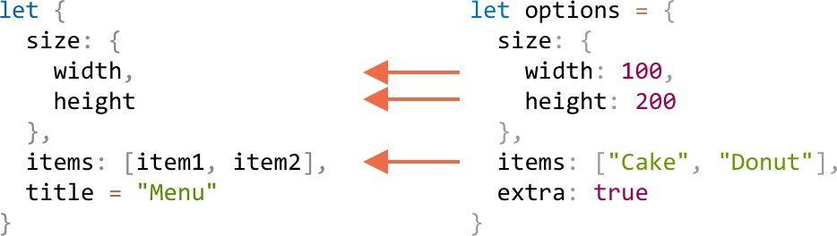

# 解构赋值

## 数组解构赋值

### 基本用法

将值从数组中取出，赋值给其他变量。这是一个拷贝过程，原数组和元素本身不会被改变。

```javascript
let [a, b, c] = ['a', 'b', 'c'] // ["a", "b", "c"]
```

### 可以是任意可遍历的对象

赋值的元素不仅是数组，它可以是任意可遍历的对象。

```javascript
let [a, b, c] = "abc"                       // ["a", "b", "c"]
let [one, two, three] = new Set([1, 2, 3])  // [1, 2, 3]
```

### 使用场景

#### 1）循环体中使用，配合 [`Object.entries()`](https://developer.mozilla.org/zh-CN/docs/Web/JavaScript/Reference/Global_Objects/Object/entries)

* 每次遍历得到一个数组，该数组的元素是给定对象自身可枚举属性的键和值
* 接下来的解构操作本质上就是解构的基本用法

```javascript
let user = {
  name: 'zhangsan',
  age: 13
}

for (let [key, value] of Object.entries(user)) {
  console.log(`${key}:${value}`)
}
// name:zhangsan
// age:13
```

#### 2）循环体中使用，配合 [Map 对象](https://developer.mozilla.org/zh-CN/docs/Web/JavaScript/Reference/Global_Objects/Map)

```javascript
let user = new Map()
user.set('name', 'zhangsan')
user.set('age', 13)

for (let [key, value] of user.entries()) {
  console.log(`${key}:${value}`)
}
// name:zhangsan
// age:13
```

### 跳过赋值元素

如果想忽略数组的某个元素对变量进行赋值，可以使用逗号来处理。

```javascript
let [mon, , wed] = ['Monday', 'Tuesday', 'Wednesday', 'Thursday', 'Friday', 'Saturday', 'Sunday']

console.log(wed) // Wednesday
```

### rest 参数

可以使用 rest 参数（形式为 `...变量名`）来接受赋值数组的剩余元素，不过要确保这个 rest 参数是放在被赋值变量的最后一个位置上。

```javascript
let [mon, tues, ...rest] = ['Monday', 'Tuesday', 'Wednesday', 'Thursday', 'Friday', 'Saturday', 'Sunday']

console.log(mon)         // Monday
console.log(tues)        // Tuesday

// rest 是个数组
console.log(rest[0])     // Wednesday
console.log(rest[1])     // Thursday
console.log(rest.length) // 5
```

### 默认值

如果数组的内容少于变量的个数，没有分配到内容的变量会是 `undefined`。

```javascript
let [firstName, lastName] = []

console.log(firstName) // undefined
console.log(lastName)  // undefined
```

也可以给变量赋予默认值，防止 `undefined` 的情况出现。

```javascript
let [firstName = 'Guest', lastName = 'Anonymous'] = ['Kobe']

console.log(firstName) // Kobe
console.log(lastName)  // Anonymous
```

## 对象解构赋值

### 基本用法

左侧的变量名要和右侧对象中存在的 key 名一致，但是顺序无需一致。

```javascript
let options = {
  title: 'Menu',
  width: 100,
  height: 200
}

let {title, width, height} = options

console.log(title)  // Menu
console.log(width)  // 100
console.log(height) // 200
```

提取出来的值也可以赋值给其它的变量名。

```javascript
let options = {
  title: 'Menu',
  width: 100,
  height: 200
}

let {title: t, width: w, height: h} = options

console.log(t) // Menu
console.log(w) // 100
console.log(h) // 200
```

### rest 运算符

可以像数组一样，只提取指定的属性，将其他可以暂存到一个变量下，这就要用到 rest 运算符（形式为 `...变量名`）了。

```javascript
let options = {
  title: 'Menu',
  height: 200,
  width: 100
}

let {title, ...rest} = options

console.log(rest.height) // 200
console.log(rest.width)  // 100
```

### 默认值

赋值的过程中也可以指定默认值。

```javascript
let options = {
  title: 'Menu'
}

let {width = 100, height = 200, title} = options

console.log(title)  // Menu
console.log(width)  // 100
console.log(height) // 200
```

### 嵌套对象

如果一个 Array 或者 Object 比较复杂，它嵌套了 Array 或者 Object，那只要被赋值的结构和右侧赋值的元素一致就好了。

就像这样：

<div style="text-align: center;">
  
  <p style="text-align: center; color: #888;">（嵌套对象的解构赋值）</p>
</div>

```javascript
let options = {
  size: {
    width: 100,
    height: 200
  },
  items: ["Cake", "Donut"],
  extra: true    // 不提取这个值
}

let {
  size: {
    width,
    height
  },
  items: [item1, item2],
  title = 'Menu' // 默认参数
} = options

console.log(title)  // Menu
console.log(width)  // 100
console.log(height) // 200
console.log(item1)  // Cake
console.log(item2)  // Donut
```

## 字符串解构赋值

本质上就是把字符串当做是数组来解构。

```javascript
let str = 'hello'

let [a, b, c, d, e] = str

console.log(a, b, c, d, e)
```

## 参考资料

* [变量的解构赋值](https://es6.ruanyifeng.com/#docs/destructuring)
* [解构赋值](https://developer.mozilla.org/zh-CN/docs/Web/JavaScript/Reference/Operators/Destructuring_assignment)

（完）
