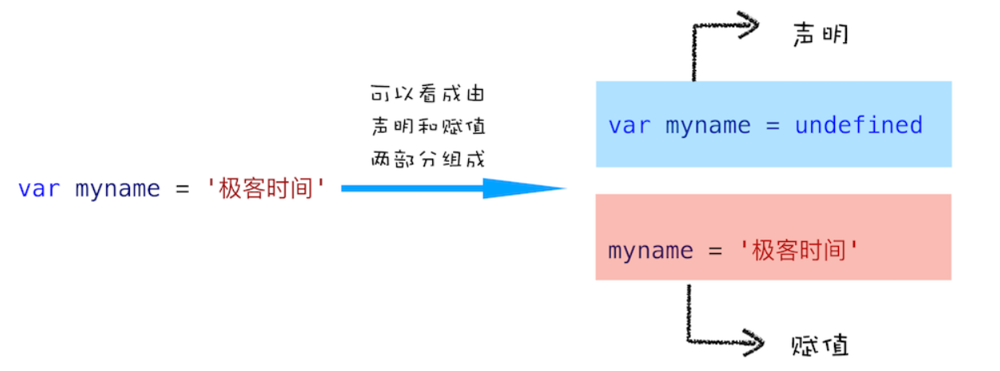
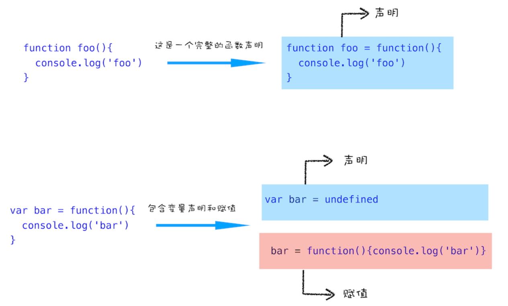

# 执行上下文和调用栈

## 执行上下文的分类

执行上下文是 JavaScript 执行一段代码时的运行环境，它一共有三种：

* **全局执行上下文**：一个程序只有一个全局对象即 `window` 对象（浏览器的情况下），全局对象所处的执行上下文就是全局执行上下文。
* **函数执行上下文**：每当一个函数被调用时, 都会为该函数创建一个新的上下文。每个函数都有它自己的执行上下文，不过是在函数被调用时创建的。
* **Eval 函数执行上下文**：执行在 `eval` 函数内部的代码也会有它属于自己的执行上下文（永远不要使用 `eval`！—— [MDN](https://developer.mozilla.org/zh-CN/docs/Web/JavaScript/Reference/Global_Objects/eval "eval() - JavaScript | MDN")）。

## 执行上下文的产生

执行上下文的产生涉及两个阶段：

* JS 代码的编译阶段：创建全局执行上下文
* JS 代码的执行阶段：函数被调用时创建函数执行上下文

## JS 代码的编译阶段

一段 JavaScript 代码在执行之前需要被编译，编译完成之后，才会进入执行阶段。

从 JavaScript 层面来讲，输入一段代码，经过编译后，会生成两部分内容：**执行上下文**（Execution Context）和可执行代码。

<div style="text-align: center;">
  <svg id="SvgjsSvg1006" width="748.71875" height="287" xmlns="http://www.w3.org/2000/svg" version="1.1" xmlns:xlink="http://www.w3.org/1999/xlink" xmlns:svgjs="http://svgjs.com/svgjs"><defs id="SvgjsDefs1007"><marker id="SvgjsMarker1028" markerWidth="16" markerHeight="12" refX="11" refY="6" viewBox="0 0 16 12" orient="auto" markerUnits="userSpaceOnUse" stroke-dasharray="0,0"><path id="SvgjsPath1029" d="M0,0 L16,6 L0,12 L0,0" fill="#323232" stroke="#323232" stroke-width="1"></path></marker><marker id="SvgjsMarker1032" markerWidth="16" markerHeight="12" refX="11" refY="6" viewBox="0 0 16 12" orient="auto" markerUnits="userSpaceOnUse" stroke-dasharray="0,0"><path id="SvgjsPath1033" d="M0,0 L16,6 L0,12 L0,0" fill="#323232" stroke="#323232" stroke-width="1"></path></marker></defs><g id="SvgjsG1008" transform="translate(25.006696428571445,116)"><path id="SvgjsPath1009" d="M 0 0L 120 0L 120 66L 0 66Z" stroke="rgba(138,138,138,1)" stroke-width="2" fill-opacity="1" fill="#ffffff"></path><g id="SvgjsG1010"><text id="SvgjsText1011" font-family="微软雅黑" text-anchor="middle" font-size="14px" width="100px" fill="#323232" font-weight="400" align="middle" lineHeight="125%" anchor="middle" family="微软雅黑" size="14px" weight="400" font-style="" opacity="1" y="13.75" transform="rotate(0)"><tspan id="SvgjsTspan1012" dy="17" x="60"><tspan id="SvgjsTspan1013" style="text-decoration:;">输入一段</tspan></tspan><tspan id="SvgjsTspan1014" dy="17" x="60"><tspan id="SvgjsTspan1015" style="text-decoration:;">JavaScript 代码</tspan></tspan></text></g></g><g id="SvgjsG1016" transform="translate(220.578125,25)"><path id="SvgjsPath1017" d="M 0 0L 354 0L 354 237L 0 237Z" stroke="rgba(138,138,138,1)" stroke-width="2" fill-opacity="1" fill="#ffffff"></path><g id="SvgjsG1018"><text id="SvgjsText1019" font-family="微软雅黑" text-anchor="middle" font-size="13px" width="334px" fill="#323232" font-weight="400" align="middle" lineHeight="125%" anchor="middle" family="微软雅黑" size="13px" weight="400" font-style="" opacity="1" y="108.875" transform="rotate(0)"></text></g></g><g id="SvgjsG1020" transform="translate(646.7209821428573,116)"><path id="SvgjsPath1021" d="M 0 0L 77 0L 77 66L 0 66Z" stroke="rgba(138,138,138,1)" stroke-width="2" fill-opacity="1" fill="#ffffff"></path><g id="SvgjsG1022"><text id="SvgjsText1023" font-family="微软雅黑" text-anchor="middle" font-size="14px" width="57px" fill="#323232" font-weight="400" align="middle" lineHeight="125%" anchor="middle" family="微软雅黑" size="14px" weight="400" font-style="" opacity="1" y="22.25" transform="rotate(0)"><tspan id="SvgjsTspan1024" dy="17" x="38.5"><tspan id="SvgjsTspan1025" style="text-decoration:;">输出结果</tspan></tspan></text></g></g><g id="SvgjsG1026"><path id="SvgjsPath1027" d="M145.578125 151L180.578125 151L180.578125 151L215.578125 151" stroke="#323232" stroke-width="3" fill="none" marker-end="url(#SvgjsMarker1028)"></path></g><g id="SvgjsG1030"><path id="SvgjsPath1031" d="M575.8638392857143 151L609.3638392857143 151L609.3638392857143 151L642.8638392857143 151" stroke="#323232" stroke-width="3" fill="none" marker-end="url(#SvgjsMarker1032)"></path></g><g id="SvgjsG1034" transform="translate(228.578125,36)"><path id="SvgjsPath1035" d="M 0 0L 338 0L 338 122L 0 122Z" stroke="rgba(207,207,207,1)" stroke-width="2" fill-opacity="1" fill="#ffffff"></path><g id="SvgjsG1036"><text id="SvgjsText1037" font-family="微软雅黑" text-anchor="middle" font-size="13px" width="318px" fill="#323232" font-weight="400" align="middle" lineHeight="125%" anchor="middle" family="微软雅黑" size="13px" weight="400" font-style="" opacity="1" y="51.375" transform="rotate(0)"></text></g></g><g id="SvgjsG1038" transform="translate(340.578125,36)"><path id="SvgjsPath1039" d="M 0 0L 120 0L 120 40L 0 40Z" stroke="none" fill="none"></path><g id="SvgjsG1040"><text id="SvgjsText1041" font-family="微软雅黑" text-anchor="middle" font-size="18px" width="120px" fill="#ff6666" font-weight="400" align="middle" lineHeight="125%" anchor="middle" family="微软雅黑" size="18px" weight="400" font-style="" opacity="1" y="6.25" transform="rotate(0)"><tspan id="SvgjsTspan1042" dy="22" x="60"><tspan id="SvgjsTspan1043" style="text-decoration:;">执行上下文</tspan></tspan></text></g></g><g id="SvgjsG1044" transform="translate(234.078125,81)"><path id="SvgjsPath1045" d="M 0 0L 165.5 0L 165.5 64L 0 64Z" stroke="rgba(138,138,138,1)" stroke-width="2" fill-opacity="1" fill="#66b2ff"></path><g id="SvgjsG1046"><text id="SvgjsText1047" font-family="微软雅黑" text-anchor="middle" font-size="14px" width="146px" fill="#323232" font-weight="400" align="middle" lineHeight="125%" anchor="middle" family="微软雅黑" size="14px" weight="400" font-style="" opacity="1" y="12.75" transform="rotate(0)"><tspan id="SvgjsTspan1048" dy="17" x="83"><tspan id="SvgjsTspan1049" style="text-decoration:;">变量环境</tspan></tspan><tspan id="SvgjsTspan1050" dy="17" x="83"><tspan id="SvgjsTspan1051" style="text-decoration:;">Variable Environment</tspan></tspan></text></g></g><g id="SvgjsG1052" transform="translate(404.078125,81)"><path id="SvgjsPath1053" d="M 0 0L 157.5 0L 157.5 64L 0 64Z" stroke="rgba(138,138,138,1)" stroke-width="2" fill-opacity="1" fill="#ebebeb"></path><g id="SvgjsG1054"><text id="SvgjsText1055" font-family="微软雅黑" text-anchor="middle" font-size="14px" width="138px" fill="#323232" font-weight="400" align="middle" lineHeight="125%" anchor="middle" family="微软雅黑" size="14px" weight="400" font-style="" opacity="1" y="12.75" transform="rotate(0)"><tspan id="SvgjsTspan1056" dy="17" x="79"><tspan id="SvgjsTspan1057" style="text-decoration:;">词法环境</tspan></tspan><tspan id="SvgjsTspan1058" dy="17" x="79"><tspan id="SvgjsTspan1059" style="text-decoration:;">Lexical Environment</tspan></tspan></text></g></g><g id="SvgjsG1060" transform="translate(228.578125,169)"><path id="SvgjsPath1061" d="M 0 0L 338 0L 338 80L 0 80Z" stroke="rgba(138,138,138,1)" stroke-width="2" fill-opacity="1" fill="#66b2ff"></path><g id="SvgjsG1062"><text id="SvgjsText1063" font-family="微软雅黑" text-anchor="middle" font-size="14px" width="318px" fill="#323232" font-weight="400" align="middle" lineHeight="125%" anchor="middle" family="微软雅黑" size="14px" weight="400" font-style="" opacity="1" y="29.25" transform="rotate(0)"><tspan id="SvgjsTspan1064" dy="17" x="169"><tspan id="SvgjsTspan1065" style="text-decoration:;">可执行代码</tspan></tspan></text></g></g><g id="SvgjsG1066" transform="translate(118.578125,112)"><path id="SvgjsPath1067" d="M 0 0L 120 0L 120 40L 0 40Z" stroke="none" fill="none"></path><g id="SvgjsG1068"><text id="SvgjsText1069" font-family="微软雅黑" text-anchor="middle" font-size="14px" width="120px" fill="#323232" font-weight="700" align="middle" lineHeight="125%" anchor="middle" family="微软雅黑" size="14px" weight="700" font-style="" opacity="1" y="9.25" transform="rotate(0)"><tspan id="SvgjsTspan1070" dy="17" x="60"><tspan id="SvgjsTspan1071" style="text-decoration:;">编译代码</tspan></tspan></text></g></g><g id="SvgjsG1072" transform="translate(549.578125,112)"><path id="SvgjsPath1073" d="M 0 0L 120 0L 120 40L 0 40Z" stroke="none" fill="none"></path><g id="SvgjsG1074"><text id="SvgjsText1075" font-family="微软雅黑" text-anchor="middle" font-size="14px" width="120px" fill="#323232" font-weight="700" align="middle" lineHeight="125%" anchor="middle" family="微软雅黑" size="14px" weight="700" font-style="" opacity="1" y="9.25" transform="rotate(0)"><tspan id="SvgjsTspan1076" dy="17" x="60"><tspan id="SvgjsTspan1077" style="text-decoration:;">执行代码</tspan></tspan></text></g></g></svg>
  <p style="text-align: center; color: #888;">（JavaScript 代码编译过程）</p>
</div>

由上图可知，执行上下文在创建过程中还创建了两个对象：

* 词法环境（Lexical Environment）
* 变量环境（Viriable Environment）

所以执行上下文可以用伪代码表示如下:

```javascript
ExecutionContext = {
  LexicalEnvironment = <ref. to LexicalEnvironment in memory>,
  VariableEnvironment = <ref. to VariableEnvironment in  memory>,
}
```

### 词法环境（Lexical Environment）

#### 1）定义

词法环境是一个包含**标识符变量映射**的结构。

* 标识符：变量/函数的名字
* 变量：对实际对象或原始数据的引用

#### 2）结构

词法环境由两个部分组成：

* **环境记录**（enviroment record）：存储变量和函数声明，它分为两种：
  * **声明式环境记录**（主要用于函数环境）：存储变量、函数和参数，主要用于函数。（函数环境下会存储 `arguments` 的值，形式 `{idx1:val1, idx2:val2, ..., length:num}`）
  * **对象环境记录**（主要用于全局环境）：除了变量和函数声明，还存储了一个全局对象 `window`（浏览器中）以及该全局对象提供的属性和方法。
* **对外部环境的引用**（outer）：可以通过它访问外部词法环境（也就是作用域链的原理）。
* **This 绑定**：
  * 全局执行上下文中，`this` 值指向全局变量（浏览器中是 `window` 对象）
  * 函数执行上下文中，`this` 的值的指向取决于函数的调用方式
    * 被对象调用：`this`＝对象
    * 否则：`this`=全局对象（非严格模式），`this`=`undefined`（严格模式）

#### 3）类型

词法环境有两种类型：

* 全局环境：在全局执行上下文中。
  * 拥有内建的 Object、Array 等。
  * 在环境记录内还有任何用户定义的全局变量和函数。
  * 外部环境引用是 `null`。
  * `this` 指向全局对象。
* 函数环境：在函数执行上下文中。
  * 用户在函数内部定义的变量储存在环境记录中。
  * 对外部环境的引用可以是全局环境，也可以是任何包含此内部函数的外部函数。

#### 4）特点

通过 `let` 和 `const` 声明的变量，在编译阶段会被存放到词法环境中。

注意「[暂时性死区](https://es6.ruanyifeng.com/#docs/let)」问题：在代码块内，使用 `let` 命令声明变量之前，该变量都是不可用的（哪怕存在同名全局变量）。

### 变量环境（Viriable Environment）

#### 1）定义

变量环境也是词法环境，它具有上面定义的词法环境的所有属性和组件，主要的区别在于：

在 ES6 中的区别：

* 词法环境（Lexical Environment）用于存储函数声明和变量（通过 `let` 和 `const` 声明的变量）。
* 变量环境（Variable Environment）仅用于存储变量（通过 `var` 声明的变量）。

#### 2）特点

在编译阶段，会声明所有 `var` 变量（初始值设为 `undefined`），然后将这些变量存放到变量环境中。

这也是**变量提升**现象产生的原因：在一个变量定义之前使用它，不会报错，但是该变量的值此时为 `undefined`，而不是定义时的值。

::: details 变量提升
所谓变量提升，是指在 JavaScript 代码执行过程中，JavaScript 引擎把变量的声明部分和函数的声明部分提升到代码开头的「行为」。变量被提升后，会给变量设置默认值 `undefined`。

<div style="text-align: center;">
  
  <p style="text-align: center; color: #888;">（变量的声明和赋值，图片来源于网络）</p>
</div>

<div style="text-align: center;">
  
  <p style="text-align: center; color: #888;">（函数的声明和赋值，图片来源于网络）</p>
</div>
:::

## JS 代码的执行阶段

JavaScript 引擎按照顺序逐行执行编译生成的可执行代码。

对所有变量的分配（赋值）也是在这个过程按照一行一行的执行顺序完成的。

### 调用栈：用来管理执行上下文

调用栈，也叫执行栈，它是**一种用来管理执行上下文的数据结构**，存储了在代码执行期间创建的所有执行上下文。因为是栈，所以遵循 LIFO（后进先出）的原则。

当 JavaScript 引擎第一次遇到 JS 脚本时，它会创建一个全局的执行上下文并且压入当前调用栈。每当引擎遇到一个函数调用，它会为该函数创建一个新的执行上下文并压入栈的顶部。

引擎会执行那些执行上下文位于栈顶的函数。当该函数执行结束时，执行上下文从栈中弹出，控制流程到达当前栈中的下一个上下文。

### 调用栈运行过程

* 首先创建全局执行上下文，压入栈底。
* 每当调用一个函数时，创建函数的函数执行上下文，并且压入栈顶。
* 当函数执行完成后，会从调用栈中弹出，JS 引擎继续执栈顶的函数。
* 程序执行结束时，全局执行上下文弹出调用栈。

以如下代码为例：

```javascript
function foo(i) {
  if (i < 0) return;
  console.log('begin:' + i);
  foo(i - 1);
  console.log('end:' + i);
}
foo(2);
```

当 JavaScript 引擎首次读取该脚本时，它会创建一个全局执行上下文并将其推入当前的调用栈底部。当调用一个函数时，引擎会为该函数创建一个新的执行上下文并将其推到当前调用栈的顶端。

在新的执行上下文中，如果继续发生一个新函数调用，则继续创建新的执行上下文并推到当前调用栈的顶端，直到再无新函数调用。

引擎会运行执行上下文在调用栈顶端的函数，当此函数运行完成后，其对应的执行上下文将会从调用栈中弹出，上下文控制权将移到当前调用栈的下一个执行上下文，直到全局执行上下文。

当程序或浏览器关闭时，全局执行上下文也将退出并销毁。

<div style="text-align: center;">
  <svg id="SvgjsSvg1264" width="815.875" height="201.25" xmlns="http://www.w3.org/2000/svg" version="1.1" xmlns:xlink="http://www.w3.org/1999/xlink" xmlns:svgjs="http://svgjs.com/svgjs"><defs id="SvgjsDefs1265"><marker id="SvgjsMarker1378" markerWidth="16" markerHeight="12" refX="16" refY="6" viewBox="0 0 16 12" orient="auto" markerUnits="userSpaceOnUse" stroke-dasharray="0,0"><path id="SvgjsPath1379" d="M0,2 L14,6 L0,11 L0,2" fill="#323232" stroke="#323232" stroke-width="2"></path></marker><marker id="SvgjsMarker1382" markerWidth="16" markerHeight="12" refX="16" refY="6" viewBox="0 0 16 12" orient="auto" markerUnits="userSpaceOnUse" stroke-dasharray="0,0"><path id="SvgjsPath1383" d="M0,2 L14,6 L0,11 L0,2" fill="#323232" stroke="#323232" stroke-width="2"></path></marker><marker id="SvgjsMarker1386" markerWidth="16" markerHeight="12" refX="16" refY="6" viewBox="0 0 16 12" orient="auto" markerUnits="userSpaceOnUse" stroke-dasharray="0,0"><path id="SvgjsPath1387" d="M0,2 L14,6 L0,11 L0,2" fill="#323232" stroke="#323232" stroke-width="2"></path></marker><marker id="SvgjsMarker1390" markerWidth="16" markerHeight="12" refX="16" refY="6" viewBox="0 0 16 12" orient="auto" markerUnits="userSpaceOnUse" stroke-dasharray="0,0"><path id="SvgjsPath1391" d="M0,2 L14,6 L0,11 L0,2" fill="#323232" stroke="#323232" stroke-width="2"></path></marker><marker id="SvgjsMarker1394" markerWidth="16" markerHeight="12" refX="16" refY="6" viewBox="0 0 16 12" orient="auto" markerUnits="userSpaceOnUse" stroke-dasharray="0,0"><path id="SvgjsPath1395" d="M0,2 L14,6 L0,11 L0,2" fill="#323232" stroke="#323232" stroke-width="2"></path></marker><marker id="SvgjsMarker1398" markerWidth="16" markerHeight="12" refX="16" refY="6" viewBox="0 0 16 12" orient="auto" markerUnits="userSpaceOnUse" stroke-dasharray="0,0"><path id="SvgjsPath1399" d="M0,2 L14,6 L0,11 L0,2" fill="#323232" stroke="#323232" stroke-width="2"></path></marker></defs><g id="SvgjsG1266" transform="translate(25,138.25)"><path id="SvgjsPath1267" d="M 0 0L 99.11918274687855 0L 99.11918274687855 37.75L 0 37.75Z" stroke="rgba(50,50,50,1)" stroke-width="2" fill-opacity="1" fill="#ffffff"></path><g id="SvgjsG1268"><text id="SvgjsText1269" font-family="微软雅黑" text-anchor="middle" font-size="13px" width="80px" fill="#323232" font-weight="400" align="middle" anchor="middle" family="微软雅黑" size="13px" weight="400" font-style="" opacity="1" y="0.925" transform="rotate(0)"><tspan id="SvgjsTspan1270" dy="16" x="50"><tspan id="SvgjsTspan1271" style="text-decoration:;">全局</tspan></tspan><tspan id="SvgjsTspan1272" dy="16" x="50"><tspan id="SvgjsTspan1273" style="text-decoration:;">执行上下文</tspan></tspan></text></g></g><g id="SvgjsG1274" transform="translate(136.2917139614075,138.25)"><path id="SvgjsPath1275" d="M 0 0L 99.11918274687855 0L 99.11918274687855 37.75L 0 37.75Z" stroke="rgba(50,50,50,1)" stroke-width="2" fill-opacity="1" fill="#ffffff"></path><g id="SvgjsG1276"><text id="SvgjsText1277" font-family="微软雅黑" text-anchor="middle" font-size="13px" width="80px" fill="#323232" font-weight="400" align="middle" anchor="middle" family="微软雅黑" size="13px" weight="400" font-style="" opacity="1" y="0.925" transform="rotate(0)"><tspan id="SvgjsTspan1278" dy="16" x="50"><tspan id="SvgjsTspan1279" style="text-decoration:;">全局</tspan></tspan><tspan id="SvgjsTspan1280" dy="16" x="50"><tspan id="SvgjsTspan1281" style="text-decoration:;">执行上下文</tspan></tspan></text></g></g><g id="SvgjsG1282" transform="translate(246.71396140749152,138.25)"><path id="SvgjsPath1283" d="M 0 0L 99.11918274687855 0L 99.11918274687855 37.75L 0 37.75Z" stroke="rgba(50,50,50,1)" stroke-width="2" fill-opacity="1" fill="#ffffff"></path><g id="SvgjsG1284"><text id="SvgjsText1285" font-family="微软雅黑" text-anchor="middle" font-size="13px" width="80px" fill="#323232" font-weight="400" align="middle" anchor="middle" family="微软雅黑" size="13px" weight="400" font-style="" opacity="1" y="0.925" transform="rotate(0)"><tspan id="SvgjsTspan1286" dy="16" x="50"><tspan id="SvgjsTspan1287" style="text-decoration:;">全局</tspan></tspan><tspan id="SvgjsTspan1288" dy="16" x="50"><tspan id="SvgjsTspan1289" style="text-decoration:;">执行上下文</tspan></tspan></text></g></g><g id="SvgjsG1290" transform="translate(357.1362088535755,138.25)"><path id="SvgjsPath1291" d="M 0 0L 99.11918274687855 0L 99.11918274687855 37.75L 0 37.75Z" stroke="rgba(50,50,50,1)" stroke-width="2" fill-opacity="1" fill="#ffffff"></path><g id="SvgjsG1292"><text id="SvgjsText1293" font-family="微软雅黑" text-anchor="middle" font-size="13px" width="80px" fill="#323232" font-weight="400" align="middle" anchor="middle" family="微软雅黑" size="13px" weight="400" font-style="" opacity="1" y="0.925" transform="rotate(0)"><tspan id="SvgjsTspan1294" dy="16" x="50"><tspan id="SvgjsTspan1295" style="text-decoration:;">全局</tspan></tspan><tspan id="SvgjsTspan1296" dy="16" x="50"><tspan id="SvgjsTspan1297" style="text-decoration:;">执行上下文</tspan></tspan></text></g></g><g id="SvgjsG1298" transform="translate(468.427922814983,138.25)"><path id="SvgjsPath1299" d="M 0 0L 99.11918274687855 0L 99.11918274687855 37.75L 0 37.75Z" stroke="rgba(50,50,50,1)" stroke-width="2" fill-opacity="1" fill="#ffffff"></path><g id="SvgjsG1300"><text id="SvgjsText1301" font-family="微软雅黑" text-anchor="middle" font-size="13px" width="80px" fill="#323232" font-weight="400" align="middle" anchor="middle" family="微软雅黑" size="13px" weight="400" font-style="" opacity="1" y="0.925" transform="rotate(0)"><tspan id="SvgjsTspan1302" dy="16" x="50"><tspan id="SvgjsTspan1303" style="text-decoration:;">全局</tspan></tspan><tspan id="SvgjsTspan1304" dy="16" x="50"><tspan id="SvgjsTspan1305" style="text-decoration:;">执行上下文</tspan></tspan></text></g></g><g id="SvgjsG1306" transform="translate(579.7196367763905,138.25)"><path id="SvgjsPath1307" d="M 0 0L 99.11918274687855 0L 99.11918274687855 37.75L 0 37.75Z" stroke="rgba(50,50,50,1)" stroke-width="2" fill-opacity="1" fill="#ffffff"></path><g id="SvgjsG1308"><text id="SvgjsText1309" font-family="微软雅黑" text-anchor="middle" font-size="13px" width="80px" fill="#323232" font-weight="400" align="middle" anchor="middle" family="微软雅黑" size="13px" weight="400" font-style="" opacity="1" y="0.925" transform="rotate(0)"><tspan id="SvgjsTspan1310" dy="16" x="50"><tspan id="SvgjsTspan1311" style="text-decoration:;">全局</tspan></tspan><tspan id="SvgjsTspan1312" dy="16" x="50"><tspan id="SvgjsTspan1313" style="text-decoration:;">执行上下文</tspan></tspan></text></g></g><g id="SvgjsG1314" transform="translate(691.8808172531214,138.25)"><path id="SvgjsPath1315" d="M 0 0L 99.11918274687855 0L 99.11918274687855 37.75L 0 37.75Z" stroke="rgba(50,50,50,1)" stroke-width="2" fill-opacity="1" fill="#ffffff"></path><g id="SvgjsG1316"><text id="SvgjsText1317" font-family="微软雅黑" text-anchor="middle" font-size="13px" width="80px" fill="#323232" font-weight="400" align="middle" anchor="middle" family="微软雅黑" size="13px" weight="400" font-style="" opacity="1" y="0.925" transform="rotate(0)"><tspan id="SvgjsTspan1318" dy="16" x="50"><tspan id="SvgjsTspan1319" style="text-decoration:;">全局</tspan></tspan><tspan id="SvgjsTspan1320" dy="16" x="50"><tspan id="SvgjsTspan1321" style="text-decoration:;">执行上下文</tspan></tspan></text></g></g><g id="SvgjsG1322" transform="translate(136.2917139614075,100.5)"><path id="SvgjsPath1323" d="M 0 0L 99.11918274687855 0L 99.11918274687855 37.75L 0 37.75Z" stroke="rgba(50,50,50,1)" stroke-width="2" fill-opacity="1" fill="#ffffff"></path><g id="SvgjsG1324"><text id="SvgjsText1325" font-family="微软雅黑" text-anchor="middle" font-size="13px" width="80px" fill="#323232" font-weight="400" align="middle" anchor="middle" family="微软雅黑" size="13px" weight="400" font-style="" opacity="1" y="8.925" transform="rotate(0)"><tspan id="SvgjsTspan1326" dy="16" x="50"><tspan id="SvgjsTspan1327" style="text-decoration:;">foo(2)</tspan></tspan></text></g></g><g id="SvgjsG1328" transform="translate(246.71396140749152,100.5)"><path id="SvgjsPath1329" d="M 0 0L 99.11918274687855 0L 99.11918274687855 37.75L 0 37.75Z" stroke="rgba(50,50,50,1)" stroke-width="2" fill-opacity="1" fill="#ffffff"></path><g id="SvgjsG1330"><text id="SvgjsText1331" font-family="微软雅黑" text-anchor="middle" font-size="13px" width="80px" fill="#323232" font-weight="400" align="middle" anchor="middle" family="微软雅黑" size="13px" weight="400" font-style="" opacity="1" y="8.925" transform="rotate(0)"><tspan id="SvgjsTspan1332" dy="16" x="50"><tspan id="SvgjsTspan1333" style="text-decoration:;">foo(2)</tspan></tspan></text></g></g><g id="SvgjsG1334" transform="translate(357.1362088535755,100.5)"><path id="SvgjsPath1335" d="M 0 0L 99.11918274687855 0L 99.11918274687855 37.75L 0 37.75Z" stroke="rgba(50,50,50,1)" stroke-width="2" fill-opacity="1" fill="#ffffff"></path><g id="SvgjsG1336"><text id="SvgjsText1337" font-family="微软雅黑" text-anchor="middle" font-size="13px" width="80px" fill="#323232" font-weight="400" align="middle" anchor="middle" family="微软雅黑" size="13px" weight="400" font-style="" opacity="1" y="8.925" transform="rotate(0)"><tspan id="SvgjsTspan1338" dy="16" x="50"><tspan id="SvgjsTspan1339" style="text-decoration:;">foo(2)</tspan></tspan></text></g></g><g id="SvgjsG1340" transform="translate(468.427922814983,100.5)"><path id="SvgjsPath1341" d="M 0 0L 99.11918274687855 0L 99.11918274687855 37.75L 0 37.75Z" stroke="rgba(50,50,50,1)" stroke-width="2" fill-opacity="1" fill="#ffffff"></path><g id="SvgjsG1342"><text id="SvgjsText1343" font-family="微软雅黑" text-anchor="middle" font-size="13px" width="80px" fill="#323232" font-weight="400" align="middle" anchor="middle" family="微软雅黑" size="13px" weight="400" font-style="" opacity="1" y="8.925" transform="rotate(0)"><tspan id="SvgjsTspan1344" dy="16" x="50"><tspan id="SvgjsTspan1345" style="text-decoration:;">foo(2)</tspan></tspan></text></g></g><g id="SvgjsG1346" transform="translate(579.7196367763905,100.5)"><path id="SvgjsPath1347" d="M 0 0L 99.11918274687855 0L 99.11918274687855 37.75L 0 37.75Z" stroke="rgba(50,50,50,1)" stroke-width="2" fill-opacity="1" fill="#ffffff"></path><g id="SvgjsG1348"><text id="SvgjsText1349" font-family="微软雅黑" text-anchor="middle" font-size="13px" width="80px" fill="#323232" font-weight="400" align="middle" anchor="middle" family="微软雅黑" size="13px" weight="400" font-style="" opacity="1" y="8.925" transform="rotate(0)"><tspan id="SvgjsTspan1350" dy="16" x="50"><tspan id="SvgjsTspan1351" style="text-decoration:;">foo(2)</tspan></tspan></text></g></g><g id="SvgjsG1352" transform="translate(246.71396140749152,62.75)"><path id="SvgjsPath1353" d="M 0 0L 99.11918274687855 0L 99.11918274687855 37.75L 0 37.75Z" stroke="rgba(50,50,50,1)" stroke-width="2" fill-opacity="1" fill="#ffffff"></path><g id="SvgjsG1354"><text id="SvgjsText1355" font-family="微软雅黑" text-anchor="middle" font-size="13px" width="80px" fill="#323232" font-weight="400" align="middle" anchor="middle" family="微软雅黑" size="13px" weight="400" font-style="" opacity="1" y="8.925" transform="rotate(0)"><tspan id="SvgjsTspan1356" dy="16" x="50"><tspan id="SvgjsTspan1357" style="text-decoration:;">foo(1)</tspan></tspan></text></g></g><g id="SvgjsG1358" transform="translate(357.1362088535755,62.75)"><path id="SvgjsPath1359" d="M 0 0L 99.11918274687855 0L 99.11918274687855 37.75L 0 37.75Z" stroke="rgba(50,50,50,1)" stroke-width="2" fill-opacity="1" fill="#ffffff"></path><g id="SvgjsG1360"><text id="SvgjsText1361" font-family="微软雅黑" text-anchor="middle" font-size="13px" width="80px" fill="#323232" font-weight="400" align="middle" anchor="middle" family="微软雅黑" size="13px" weight="400" font-style="" opacity="1" y="8.925" transform="rotate(0)"><tspan id="SvgjsTspan1362" dy="16" x="50"><tspan id="SvgjsTspan1363" style="text-decoration:;">foo(1)</tspan></tspan></text></g></g><g id="SvgjsG1364" transform="translate(468.427922814983,62.75)"><path id="SvgjsPath1365" d="M 0 0L 99.11918274687855 0L 99.11918274687855 37.75L 0 37.75Z" stroke="rgba(50,50,50,1)" stroke-width="2" fill-opacity="1" fill="#ffffff"></path><g id="SvgjsG1366"><text id="SvgjsText1367" font-family="微软雅黑" text-anchor="middle" font-size="13px" width="80px" fill="#323232" font-weight="400" align="middle" anchor="middle" family="微软雅黑" size="13px" weight="400" font-style="" opacity="1" y="8.925" transform="rotate(0)"><tspan id="SvgjsTspan1368" dy="16" x="50"><tspan id="SvgjsTspan1369" style="text-decoration:;">foo(1)</tspan></tspan></text></g></g><g id="SvgjsG1370" transform="translate(357.1362088535755,25)"><path id="SvgjsPath1371" d="M 0 0L 99.11918274687855 0L 99.11918274687855 37.75L 0 37.75Z" stroke="rgba(50,50,50,1)" stroke-width="2" fill-opacity="1" fill="#ffffff"></path><g id="SvgjsG1372"><text id="SvgjsText1373" font-family="微软雅黑" text-anchor="middle" font-size="13px" width="80px" fill="#323232" font-weight="400" align="middle" anchor="middle" family="微软雅黑" size="13px" weight="400" font-style="" opacity="1" y="8.925" transform="rotate(0)"><tspan id="SvgjsTspan1374" dy="16" x="50"><tspan id="SvgjsTspan1375" style="text-decoration:;">foo(0)</tspan></tspan></text></g></g><g id="SvgjsG1376"><path id="SvgjsPath1377" d="M74.55959137343928 138.25L74.55959137343928 119.375L136.2917139614075 119.375" stroke="#323232" stroke-width="2" fill="none" marker-end="url(#SvgjsMarker1378)"></path></g><g id="SvgjsG1380"><path id="SvgjsPath1381" d="M185.85130533484678 100.5L185.85130533484678 81.625L246.71396140749152 81.625" stroke="#323232" stroke-width="2" fill="none" marker-end="url(#SvgjsMarker1382)"></path></g><g id="SvgjsG1384"><path id="SvgjsPath1385" d="M296.27355278093086 62.75L296.27355278093086 43.875L357.1362088535755 43.875" stroke="#323232" stroke-width="2" fill="none" marker-end="url(#SvgjsMarker1386)"></path></g><g id="SvgjsG1388"><path id="SvgjsPath1389" d="M456.2553916004541 43.875L517.9875141884223 43.875L517.9875141884223 62.75" stroke="#323232" stroke-width="2" fill="none" marker-end="url(#SvgjsMarker1390)"></path></g><g id="SvgjsG1392"><path id="SvgjsPath1393" d="M567.5471055618616 81.625L629.2792281498299 81.625L629.2792281498299 100.5" stroke="#323232" stroke-width="2" fill="none" marker-end="url(#SvgjsMarker1394)"></path></g><g id="SvgjsG1396"><path id="SvgjsPath1397" d="M678.8388195232691 119.375L741.4404086265608 119.375L741.4404086265608 138.25" stroke="#323232" stroke-width="2" fill="none" marker-end="url(#SvgjsMarker1398)"></path></g></svg>
  <p style="text-align: center; color: #888;">（JavaScript 调用栈运行过程）</p>
</div>

最后输出结果：

```javascript
"begin:2"
"begin:1"
"begin:0"
"end:0"
"end:1"
"end:2"
```

### 调用栈大小

调用栈是有大小的，当入栈的执行上下文超过一定数目，或达到最大调用深度，就会出现栈溢出（Stack Overflow）的问题，这在递归代码中很容易出现。

如下代码所示，会抛出错误信息：超过了最大栈调用大小（Maximum call stack size exceeded）。

```javascript
function division(a,b){
  return division(a,b);
}
console.log(division(1,2));
```

<div style="text-align: center;">
  <svg xmlns="http://www.w3.org/2000/svg" xmlns:xlink="http://www.w3.org/1999/xlink" width="408" height="221" viewBox="0 0 408 221">
    <image id="wenyuan_maximum-call-stack-size-exceeded" data-name="wenyuan_maximum-call-stack-size-exceeded" width="408" height="221" xlink:href="data:img/png;base64,iVBORw0KGgoAAAANSUhEUgAAAZgAAADdCAYAAACG2WQ+AAAgAElEQVR4nO2dDbQV1Xm/3ygIGPADNYKoDWIhTcCPiB9LUzUtxlT8qGA0ksS0Ej8aYmLaVDH9i9VkGbF0mYQaFROtVqNV0aWxJKa2ShKMCooI0YAiLUpQI0jA8GGS8l+/Ofc9d5+5M+fMnHPmcg7nedaade6dmb1nz9579rvfvWd++z1bt27dagAAAE1mBzIUAACKAAMDAACFgIEBAIBCwMAAAEAhYGAAAKAQMDAAAFAI27WB+fXPVtl//9m/25Y1m7ZZGubPf8s+9am59vbb72YOo3MVRmGzsnnzH+zSSxfY/ff/b1PTf+2119pTTz3V1DidTZs22bRp0+zll18uJH4A2LakGpinn37a3norewMXR426Gvf7dvmWzfnQLbZ+6dpCbvR//u0X0dYKqJH/+tcX2fLlG1oiPY1y7733RjEceeSRdcckYynDl2RgBwwYYOecc4594xvfsLfffjsxvNIwYsSIyNABQHvRJym1W7Zsseeee84WLVpkp59+uu255565b2r1nFfsgL8ebX/232dtswzZ6yPDtun1xeGH72l33nlcrjC7775T7jD9++9o06ePzZm6dORV/OhHP7IZM2Y0Lc4kDjzwQPv4xz9uN998s11yySUVZ8joPPHEE7ZgwQLbfffdC00HADSfRA+mX79+9tnPftYGDRpkDzzwgK1atSr3hTe8vM7eO3y3in2ht/GHjb+3hX/7WNmz+eWM+fbyjc9FHo+20CsJvSFtGvpSOHlGC6Y8Gm2hp6S4n578o2hffIgsPBa/TrU0VOOb3/yFDRv27zZixH02d+7r0Zk+ZKX94RCZfj//+Z9XeDka1vKhLf0qjLb4EFl4LIxT5/n++BBZeCwMo/PuuGO5nXDCI9Ex3UPIwoULo4Y/bNjDe9Kmv7UvC/fdtyIKo+vFPbxx48bZ6tWrE72YoUOHWv/+/TNdAwBai9QhMhkZeS9uZF588cVMCVejrMZ56XULbO5J90V/L75iXs1wv9vwrq2d/7qd/voU+9j8z9hrD74cGQYZhEWXzLUxV33Ezlj/pWiTZ7LLqMF20i/OtbHXj4s27df/2r/jzn3siO993E5Zcb4NHL5rxXVemP6Uve/4/aLzda03H381MljV0lANb9BXrTrLli8/w447bkj0v3sUS5acbvvu+95yDPJOxo3bxxYtKhlWNdAvvLDODj54cPT/hAl/FMX1938/uuKqMgxPPfXrKD4dl4ejuKzLS9K+mTOPqgijhvzWW18qh7n44g/ZNdc8XzYKP/zha3bPPR+Nji9btr7c8GtuZPHixXbooYdWxOf3pLi0HXnkXjZnzms1y/a1135re+zRPwpz9dWH2axZSysMkxuQZcuWVYRbs2aNvfPOOzXjB4DWJHGIrBHe/5kPRZuMypAT3h8Zg6wM/+sxkXHot+cA22nXflGo37663vru2s8Gf3jvhtMmY/X7De/a4COGRv/rWjI2v12xrpzOpDSk4cbh7LMPyJUOGZO77nrFTjppX1u1amO0b9iwnauGGTBgx+j3zDMfsxtvPNpGjBhU8zpr126xkSN3KRuiAw/cJfrdtKnUuE+c+P7omO5jn32qX9+Rp/NP/7Sk/H/cqCUhA/vRjw7tkQYZLOuai5GnEqI5F3k1V199dXQcANqPVAOzfv16mzNnTvQrT2bYsOyGAqoj47D33v0j4yJP5sQTh5Ub2zTce5AxuOKKhfbss2syG5pmoeE2bfJ4ZJjqeWNNRm/QoL5lg2ldHpM8lT322KO8T/MxmgfSCwCXXXYZRgagDUkcItMk/9133x0ZlwkTJjTVuGhuRrw6e6mtfmRFzfPlSbz93Ju29tk3asZZC3kmfQbtZGufXh2dqeGvV25d0mOuKCtq9AcO7FMe7tJwkc/B1OKQQ/awn//8TVu58p1yrz4LbmjGj983aqyrMXhwv2joy+ddHnusdN9h456EGvMxY8ZE8zBx5I0ovOKcPft/Ko5qDmXixIlV3/hSXinPQoO6efNm27BhQ4WBEfp/4MCBdZUNAGx7Uif5DznkkMi41PMGWRpDTzrAfv3T16J5mbcXvmlDTxxeM0y/PQbY2BtOsPkXPFIxye+Ecfokv78U8IPhs2zlvUujX03sa4hs5Bc/HBkVna/9etMtzzBenFNO2d9uuOGX0QT2xo2/L8/B+Lcso0c/EE2m6zecFJdR0RyIdc3LOP7CgIah/vIv/6s8Ka7NJ+S1rV69ycaMKU3A++T/RRc9GW3+goC8G8336NraJ4MwdepBNb0lofkXvUUWTrz79fQywxe+8HM7/vghFWE0l7L//vtHQ1vyShzNwXgaNI904YUfqAj36KOPRkNkvCkGsH3BejCQir5BWbFiRY/Xh6vh3kvWMD4Mpteh4wZGxu2qq66KPsbE+AC0H0jFQCqf+MQnokNZvuSXoTj22GOjv7MaF3k5t99+ezTHkmRAtO/oo4+2sWPH8qElQBuCBwMAAIWABwMAAIWAgQEAgELAwBSM5i/06m6amGMS/rpvHhVjzWd8+ctfLgtUNosi1ZSt60WCZqcZAFqDtjcwraSmvL3JzxetpixOPvnkSNCySCMGANuGpkvFQCVqnGfPnp0rV/T2VN4w+jjyuuuua1ru95aastI9ZcqU6FXlkSNH8joywHZEy3gw8kKkZuyqyf5hpHUtHOYfWfr+amrK+tBS57lQpcK74Kb+lopzktpyvWrKGkbSmiWjR4+2xx9/PNrnQ1baHw6R6Xfy5MkVXk44TOTrn2iL9+rDY2GcOs/3x4ebwmNhGJ132223Ra8WJ6230ptqypLsHzVqVA+xSwBob1pqiOxXc16xY+49NVI6HrDvoEgeRgbjtfuXRQrH2i9xSikiV1NTroUkaj5wyRFRGH3Jr7VrrE41ZW/Qly9fbkuWLLHjjz8++t89Cq1loq/bHTXYarhdhiWuXKxvTxTXBRdcUHGdcG0UHZeH442/vCTtu+aaayrCyIjNmjWrHEbfp+jDRf/K/qGHHrIHH3wwOr506dKy0ettNWUxfPhwmzt3bs24AKB9aCkDo8Ze0jBizJXHRBIu0g1b/t3n7YEh10dehbyVRtnvjFFlQ+Tqz04eNWVviCWpkwc13Aqn8L7WTi29N5e0P+200zLP8UjuXp6BGyINQVmX9pf45Cc/GR1T3Fn15lzKxqVpspCmphwSGmEA2D5oizkYeSihEWh3NCQ0ZMiQyLjIkxk/fnxNtWD3iGSUvvrVr9ozzzxjt9xySxRXb1GUmrJYuXJl5MUAwPZDy79FprVbag1VJakpv/ubLbblrU1RuMXTflZI2tToS+3Xh7sefvjh8hxMLQ477DCbN29epPXlnkXWa8rQ6O0reSjVkBqxhr583kWikhZ4Q9Wu0ZtqykL5gBcDsH3R8gZGQ1n7nnZgpHycVU1Zw2wK8+PD/83+69i7bP8zRxWWPg2PzZw5M5oo37hxY3kOxhtb6WhprkO/mvT3+Q8ZFe23rnkZx18YuOmmm2zSpEnRJLyGxFzryyfspVh80EEHRaF88n/q1KnR5i8I+Hr3urb2aQkGvUadZW2V3lRT1r3JEOYxtADQ+qBFBqn0hpqyD/lpPqiR720AoPXgS35IpWg1ZesaVpRiMsYFYPsDDwYAAAoBDwYAAAoBAwMAAIWAgQEAgEIoxMD4q7bIsAMAdC6FGBi9RfTII4/0+I4CAAA6h8KGyPQV+S677EJVAgDoUAozMPqqe9CgQTXlTAAAYPuk0O9g/CvtoUOH5vr4DgAA2p/CDIyMi1YpPOecc3pV8RcAAFqDwobItObIhg0borkYAADoPPgOBgAACqEwA6PJ/fXr11NqAAAdSmEfWp544onRWiThWicAANA5oKYMAACFwBwMAAAUAgYGAAAKAQOzjZEgaB5RUJ0bru2fBa1IOXHixFy6cDpXYbKsZpknTqW9KH065cm0adOi1TXj6D58OWcA6B22SwOjhkYNmRSd8zasSXhjq/jyNu7VUKP3xBNP2Mknn5x63SIb5N5EeXbVVVdFa++HL348cOc62+89z9u3vvZG5tR4mHi4AQMGRB/26gPfeJ75kswofAP0HtulgVFDc91119mCBQts//33bzg+NYizZ8+OFKKlr9YM1ADOmjXLpkyZEqU3K1onX/eWJ4waV6U/zxt9fs/NWitfa+9LMiiMz43Dt+/IXkZvr/mDrXxli720cbQ9/9aHbP68jTZ/3m/Lx6UaobcXb7755h5hzzvvvEjhO8nDAYDmU4iBCT2IcF2YtP3iO9/5jt12222Jx/S37w89kmrxVcPXq2nGmjXV0iAPxfdrO/bYY8uN27Jly2zUqFE9ZHTC+MaOHWsrV66M9qd5Udo/efLkikbTh92qeXLxdIfDR2F+x4fIwmNhOrRf5ad7jMencxYvXmwTJkyoiOtLl+9tp39qt1z5vfseO0bh+g/YIfr78GN27nHOuHHjbPXq1T28GBlNGZ+FCxfmuiYA1EchBmbmzJl29NFH2/Lly6NNve74/iVLlkTDQ96AvfPOO/bcc89F+8O1ZLTpPHkjChf2xKvFl4YawuHDh+cKk/Vew/jcQ9G96NgFF1xgF110UdmgzJ0714477riq8YUeWJoXFW80vTE/9NBDq3pyzz//fORReBmFYqQqL09ziA/p6T51XOlUep2HHnrIHnzwweh6S5cuLRu9VatWRb/Dhg2rO5+TkDez7IUtNnjPPhVHpeRtXUY8jvJB99CsYU4ASKfpBkYNq3qP6kWG6IGWEVHDZ13DWGqgvIcuND6v/eFaMt5YnHbaaRW99CzxxVEYNS5Tp06NetmjR4+OGsV6qScN9eRdLXR9GRWlJ2tjrjzWsFWeOSXdl+7Ph+d0Xd2/h/f5FZVZs41JnM2b/s+u/YfXbdzJu9iIUf0qjip9Mp5J6L6bNcwJANXp0+r5471wl/5/5pln7JZbbqm7AVPjIi+gaIVnNbIyklI0EKeeemrkwRSB7mXIkCGRcZEnM378+JpzNArzk5/8JDLaSuNhhx1mV199da65nW2FjMuVX15tQ4b1SRxic8OfJLQqCaOBAwe2xX0CtDtN92Dc43j00Ucr9uuB1oPtQznqrd99992ZJ+Hd0OiNKzUS9cSnMGPGjLH7778/9Rw1uJpHyDI3Uy0NauxlzHw4KT4xr+ExDZOFxId2NFGd1RuSgZg3b56tWLHCRo4cmSmMdRkaDWtZlwJ2NeLDS8rHLI21dwbcu8pKWlncNOPXkXHRXEwS1ZS8lZ8aIgWA4mm6gVFjo28R1NDGJ771Fo/v1wS2hlRqvaXkjYzHpSGkgw46qGp8PiGufRoC068PBclAKY6klwZqpUE9/TvvvDMaWvNJ7LQ0qFFVI6dzkybFZQTCeQrPO4WfNGlSeQjPDWa1NHh8Ptznc1TV8iGcrNd+DX15OH8J4qabborS4i8n6L409OT3pHzM4pWlGXZ/3fiLn15pM6a9Ef0dvhEmA7HXXntFRtPRcZ3r52u77MJVkVfjqHOjdMbfmlN+aG7PhzQBoGC2QiE8+eSTW6dPn16Oeu3atVvPPffcrS+99FJ5n865+OKLt27cuHG7LwTdo+5V95w3zD333JM5jPJX+az8jqPyyBMXADQGX/IXhDyK8DVleQnnn39+xdyPPAJ5Dpps394JPdssH44q7+QpKX/8LcRayDO7/fbb7bLLLuvhvfibglnjAoDGQU0ZAAAKAQ8GAAAKAQMDAACF0MdefJGcBQCApvOerevWMQcDAABNhyEyAAAoBAwMAAAUAgYGAAAKIVHscu0zT9mb3/uu/d+LL+lbf9vhgyPtfed+zgYf1pzFpwAAYPunxyT/y1f+P9vppwts576VAoYbf7fJ3v3TsXbgFV+nWkD7s2aN2VlnmV15pdkxx1Cg7YY0/b74RanGmn36052eGy1LxRDZukULrd+8ZyPjstPRR5X362/t0zGd0xTmzTP7x3/sjkkP/HnnlX5bgTvuKG1pKO26h6wort12697yhG0WumaYBq070yr5nYYaEtULrytKr9JdrWy2V8Lyi99/WL+aUbea+TwuXWr2d39XKktojHi7mYV6wjSJCgOz5o67bMCO/SKDssuMq6Pf8G8dW3PH9zNd+fsPPGCbt2yhNoX8y7+YrVtn9h//YXbFFdumcb/44lIatGlJhQRJ+5aja/G5qIH65S/NPvKRxlOo+9b9t5P3orSq3FSP4qgXr2Mq305AS0TcfDPeS4tTYWC2Lnsl+n33iSdt/Ve+GhkWbfpb+0rnrMh0R08tXGjTr7/eFqtByIt6YzfeaDZmTKlHFre+YW9NvSw1PN7Tje+3mDeifepNqVdlCb16XdOPvfFGqbccpsHP/+Y3zcaPr88T+MAHzAYPNnvrrdL/ijvJq6iWD96TD9Pu9xjeU5gPaXie6FpJcemY522YvngavOfsvd9//ufkXrXyV/eUpae9caPZ+vVmQ4ZoMRezJUvMDjlE6xckl5/HqfSHaVXeeV6k9fa1X/eqtPk9exxpdUibzjvzzNK5fs9Z7i2pHlerD80mXn5+f7r+iBFaX7z0G9Y9L7ssnlRS3fNrZulRh2UbPpdpnly1ZyIeLstzEb9fL4taXnW8LcqShniYpOdF+9XmhIR1JbxOtTC9SIWB2WHHvjWv/J4M5zhr162z737/+zZ7zpz8d3TffWaPP262fLnZCy9UVi4t1LV6danHpl6MejPeo/HeucZmZ8+ufg1VjG99S1K73b2/Sy81GzWqdPxf/9Xs+usr0+C9SJ0rT6QeT0BGd9ddtYJX6X9VEk+35gSCde5T80Hn/NVfdXtEUgmeOLF0XOuueP4oH6ZP745PhjGp8VIj/vrrpTC6lvLYj/34x2Zf+UrpmK75wx+WHoipU0vp9TDKS0+f1nDZe+/SMeWv0lTvEIkWLNO6QY89Vvr/T/5ES5OW/vby8DSozJRu9Ww9rUrThg1m3/52qZ5U6+0vWlQytLpn5enBB3d3BNJ48kmzz33OTAuZ6TryMFbU6Iil1WOrUR+aifLG65A29wZ0feWl7l+/OuaNqZ6NxYtL+5R2LbZX69l01FlQndE1axkY1RXVGX82dU1/LtM8OfdKvS6ofPVMmNV+LpJQPZoxo/T8eVko/UJ1SWWteD0fPf8Ur+KP52u1NOjXyyJ8lpSGyy8vtQP+rDsyKFJn97JQ3qsMqoXpZSoMTJ9DxkS/Piwmz8U9GZ+T6XvwmNwp/MmTT9o3Zs601998M3sgZbYqzM47m+23X/f+//zP0rGkVRRDa/6FLzSek25s4mmoF6VJadPw2DXXdN9D2OuL9zbS8iGN+fPNvvc9M61Jn5QPaUNkGoY6++zS39qnxsGP6SH1h1sPizY1FtbljXmYD36wuzFWY/sXf1H6W2HVs/f79UYqz/CUjPEzz5iNHl25P+ypqbcdNuxKtx66M84wO//85DoTR/m9555mH/uYlgnNljY/N8zDWlSrx9XqQzNRGal+5BmfD70E1TEZYqfaPek8lU/WSXnFoU6EOhZ555RknGSUtRiep6XWc5GEOoKhFxeWheJVnVLdUh1zQ6b80cqtXvdD0tKgMD/7WfeIiK7nEl5Kg54rf/7Ce9R1vU1RnL7ya1qYbUCFgRl89ln2bt++5SEy/Vb83bevDZ50Vu5UHnvUUXbZRRfZkPe9r7g7VCVUIXmPK2mcOo4abXkSqsQqJFUMryhFoDSpp6EH23ulaiBvvbW7p5a1t6Gei1euCy8seRj+MPlcj2/baIKvqaisZPTcKP3qV2Zr15Z6mOoIeM8vvhyyvB8ZgHah3vpQD+4JnHBC8lB0Eqq3mgPzXnPWvNV5kyd3D21mwT05Ga48Ly9o5EL3FB9VqOe5CDtkSV6Z7qtrSfBMpKVB9dbbrrjHloY6NF5PfGuxOcUKAzPwj0fYDqecbL/r178852JdczLat8Mpp0TnZGXwbrvZ5yZNsoknndQzhHqJGvLxYRi5mSqoWkNNalg1DJI03KJCUkOkOHVOiFdsVT7vdWlMX4WU5tLXotYwSBKKX708pcOHFnTPyg/dUzzdSeg8DU0kDR8cfriZlk4u+gUC5bN19Zasq2H86U9L91GLPHMw8og0FFENNyqqQ2GZaNhB9UU9TQ0ZNJonSXWoXqrV47z1oVHUKKkuKZ/D9PzmN8nDg75o3rPPVuZDtXsSX+/6xCFvh0fnZxl2tK66pbnTeENbz3Mh7zwclg7xYSjVLd23D3X5c6G6GCctDSpvtX1JYcJ2UptGP6yrHdHS33fdlT3MNqDHl/xDzjvHdr3uWvvdn3/MNg/Z1zbvvW/0t/YNOe8zmVN45KGH2qVTptgYH0KJowbx1FO73U9VzAzru0futQrD3UyfKPvwh0vHtV/fN4Quqv6Wd6Pz1TB7r0vDLpp78LjyTP5pKESVqp6JWFV+eUpymZUPcmeVD0cckW1YxiuXe17hJGg8X+M9v7Q5mLwoDfKa5D0pLqXlqqt61y13Y+1DC2pY3NhomMk9Us8T1Qvdrw+l+osa4QRyGml1qF7S6nG1+uBDZ/Jc3Xv1sq3nnsIhZZXfhAndHSw1esozr2NuFMJ6r/mEMB/S7ilE3qbKpdZzFp+wV/vgz3RaPig+ebRf+1rP57nWc5GE8uBLX6p8znRtn39UfIpXdUz3pDxS/mn4W+mNT75XS4PavjBMUn1Q/Q2H9vy68ee5WpheprPVlFW4cr/Dt0H+5m9KFbQFxi9TUTpVwVWR3ePTPagnxWubANAidLYWmbwr75X65Jp6LK1sXCxwqcOekBnGBQBaCtaDAQCAQkBNGQAACgEDAwAAhYCByYPeBsn6lpmjFwnyvq3lb9D0liBmLWFP2Ha0mggsQA62XwPT6IPZKQ+2y3sU+YFpJxG+XpvlVWGroqdmXS906FVsvTWIGjG0GXgwedBbWnk/xtQ3L3m1ynpL6de12EIVgDid7N2ooc/rsepjOddn0zcf+i6jVvhQT00fPKpMwo6NjuutwVraegAtRnsbmDRl12pqsNUIFU1DXauwVxo2ONovFd2wl+oNchhXfIgsrpwapq3auh5pSrXS+UpSQq5FLc0ipSv0bqopVldLQ9hDz6IWrfxUvvp5fl1f18I/ENQ1FZ+no5a6s8cXro9RrSzUsEs7SwtbJRmJUKHZUSfEOwb6ctuXGgjLsNqQqb6cl3yRfxHu6ANHfeCJFwNtRHsbmDRl12pqsNUIVVBDXSv3KNS7DBsM/9pZX+RbIOGihsXVnZP0sSSxoR5pkiZSmtJvXKk2VGKVxIeEIHVMacwqiaGPTKXZlISnKfTYqilWp6VB5aEeuZeDK9J6Q5mkFu1fIrsMjUv6uFqDvl6+557Sl8+Kz4KPT9PUndOoVhZeHhqiOuWU/MOlqhcSbMzi8XrnIa4r50j+49VXS3kB0Ca0t4GppuxaT1xpKqjVkDHxnqU//C7Dn4YaCzXMeYZf5E2pQfeGR9cNtaNcxVZxqwdcL96jlypAklGuplidlAb1yGUsfIjQpYNcjTlNLVqGTwbQuhrqUMZEYd773pJn5fFt3lwZf1zduZGykEciw3X88ZUGS3mRNmSqDkGS/JEMVtKQqXcsZHA///mehrFZit4AvUh7G5h6lV2biXrb++xTMi7xhjAN97zUU5XeVN5x/iJxL0XCjnEDU49idb24t/Laa2bvvNP9fxHlV6ssdN8SDJSnlUXlQefLE9FaQnlXDFXn5IADehpGX3gti5goQIvQ/pP8acquVkUNNom4OrCMV1a15KOOKi2GpUY5TdwzCTVWarQs6NGnoWE2DZF54ycV1azDL2mEXkIcNy7xBreaYnUSSarZZj3nGOLovlS2Dz9cWs2y1n3271/6TVN39rqQpi6bVhYautJ9/uAHPY1F0hyMrjttWskTSTJGteZg1FFRWuP1SGnXMGGtfANoIdrbwFRTdk1Tg00jrsyrZXl97sRfJlBcvmBQGJ8aAzUofl0Lhu/Clw2Sluz1RZhC0cokVVx/k8iVajWcp7eUGqGaHLmnJZxnqaZYnUaSana42Fo1NAyovNMKlrWopu4c1gUNc2mRKKdaWfi8l6+EWQtX89VcVKjAW+t7pjANU6aY3XBDT2OmDoUUtBvpUAD0MmiRdTo+V5C1Ee1N4mrXnUorlxFAFfgOptPxV3Fb6RsLf61ZjWqjXlq740ORWb0+gBYCDwYAAAoBDwYAAAoBAwMAAIWAgckDasrQSlBu0OKgplxU+HYBNeXmUo+asgWvKsffmAu10uLxqcxUdr3VEQHICR5MHlBT7ix6S03ZjUqSMkKoj6dvrS6/vLvT49/+xNWXAVoE1JRDUFOuBDXl3lFTVjwKFyeuj6ev+aVW4WoFZj2FQQFaCNSUQ1BT7gY15e7y6A015SRCeRiXrJk8ueeJktRJk/wB2IagphzGhZoyaspJ9IaacjVuu62kc6dryWDFiXdgAFoE1JQbBTXlYuhUNeUQGb9Fi8xef71UFkqXOkFx1Plw0VeAFgI1ZQc15UpQUy7R22rKIbqeOlA+jKk6rjoZr2Oqd3gx0IKgpuygptwT1JR7V01ZQ44q9zCMhthkEH21y7hXpLJTGebp2AD0EmiRdTqoKbcvMmh6w00do6JfaQeoA76D6XRQU25fVGYqO4wLtCh4MAAAUAh4MAAAUAgYGAAAKAQMTB5QU4ZWgnKDFgc15aLCtwuoKTcX1JQByuDB5AE15c4CNWWAhkBNOQQ15UpQU0ZNGaABUFMOQU25G9SUu8sDNWWAukBNOYwLNWXUlJNATRmgLlBTbhTUlIsBNWXUlKHtQU3ZQU25EtSUS6CmDFA3qCk7qCn3BDVl1JQBGgAtsk4HNeX2BTVlaHH4DqbTQU25fUFNGVocPBgAACgEPBgAACgEDAwAABQCBiYPqClDK0G5QYuDmnJR4dsF1JSbC2rKAGXwYPKAmnJngZoyQEOgphyCmnIlqCmjpgzQAKgph6Cm3A1qyt3lgeKtkKkAAARaSURBVJoyQF2gphzGhZoyaspJoKYMUBeoKTcKasrFgJoyasrQ9qCm7KCmXAlqyiVQUwaoG9SUHdSUe4KaMmrKAA2AFlmng5py+4KaMrQ4fAfT6aCm3L6gpgwtDh4MAAAUAh4MAAAUAgYGAAAKAQOTB9SUoZWg3KDFQU25qPDtAmrKzQU1ZYAyeDB5QE25s0BNGaAhUFMOQU25EtSUUVMGaADUlENQU+4GNeXu8kBNGaAuUFMO40JNGTXlJFBTBqgL1JQbBTXlYkBNGTVlaHtQU3ZQU64ENeUSqCkD1A1qyg5qyj1BTRk1ZYAGQIus00FNuX1BTRlaHL6D6XRQU25fUFOGFgcPBgAACgEPBgAACgEDAwAAhYCByQNqytBKUG7Q4qCmXFT4dgE15eaCmjJAGTyYPKCm3FmgpgzQEKgph6CmXAlqyqgpAzQAasohqCl3g5pyd3mgpgxQF6gph3GhpoyachKoKQPUBWrKjYKacjGgpoyaMrQ9qCk7qClXgppyCdSUAeoGNWUHNeWeoKaMmjJAA6BF1umgpty+oKYMLQ7fwXQ6qCm3L6gpQ4uDBwMAAIWABwMAAIWAgQEAgELAwOQBNWVoJSg3aHFQUy4qfLuAmnJzQU0ZoAweTB5QU+4sUFMGaAjUlENQU64ENWXUlAEaADXlENSUu0FNubs8UFMGqAvUlMO4UFNGTTkJ1JQB6gI15UZBTbkYUFNGTRnaHtSUHdSUK0FNuQRqygB1g5qyg5pyT1BTRk0ZoAHQIut0UFNuX1BThhaH72A6HdSU2xfUlKHFwYMBAIBCwIMBAIBCwMAAAEAhYGDygJoytBKUG7Q4qCkXFb5dQE25uaCmDFAGDyYPqCl3FqgpAzQEasohqClXgpoyasoADYCacghqyt2gptxdHqgpA9QFasphXKgpo6acBGrKAHWBmnKjoKZcDKgpo6YMbQ9qyg5qypWgplwCNWWAukFN2UFNuSeoKaOmDNAAaJF1Oqgpty+oKUOLw3cwnQ5qyu0LasrQ4uDBAABAIeDBAABAIWBgAACgEDAweUBNGVoJyg1aHNSUiwrfLqCm3FxQUwYogweTB9SUOwvUlAEaAjXlENSUK0FNGTVlgAZATTkENeVuUFPuLg/UlAHqAjXlMC7UlFFTTgI1ZYC6QE25UVBTLgbUlFFThrYHNWUHNeVKUFMugZoyQN2gpuygptwT1JRRUwZoALTIOh3UlNsX1JShxeE7mE4HNeX2BTVlaHHwYAAAoBDwYAAAoBAwMAAAUAgYmDygpgytBOUGLQ5qykWFbxdQU24uqCkDlMGDyQNqyp0FasoADYGacghqypWgpoyaMkADoKYcgppyN6gpd5cHasoAdYGachgXasqoKSeBmjJAXaCm3CioKRcDasqoKUPbg5qyg5pyJagpl0BNGaBuUFN2UFPuCWrKqCkDNABaZJ0OasrtC2rK0OLwHUyng5py+4KaMrQ4eDAAANB8zOz/A8DvqhOgUTL5AAAAAElFTkSuQmCC"/>
  </svg>
  <p style="text-align: center; color: #888;">（JavaScript 栈溢出错误）</p>
</div>

那为什么会出现这个问题呢？这是因为当 JavaScript 引擎开始执行这段代码时，它首先调用函数 `division`，并创建执行环境，压入栈中；然而，这个函数是递归的，并且没有任何终止条件，所以它会一直创建新的函数执行环境，并反复将其压入栈中，但栈是有容量限制的，超过最大数量后就会出现栈溢出的错误。

理解了栈溢出原因后，你就可以使用一些方法来避免或者解决栈溢出的问题，比如把递归调用的形式改造成其他形式，或者使用加入定时器的方法来把当前任务拆分为其他很多小任务。

## 伪代码演示全过程

以执行下面这段代码为例，用伪代码来模拟从编译到执行全过程中，全局执行上下文和函数执行上下文的结构变化：

```javascript
let a = 20;
const b = 30;
var c;

function multiply(e, f) {
 var g = 20;
 return e * f * g;
}

c = multiply(20, 30);
```

首先，上述代码在执行之前需要被编译，编译完成之后的全局执行上下文看起来像这样：

```javascript
// 全局执行上下文
GlobalExectionContext = {
  // 词法环境
  LexicalEnvironment: {
    // 对象环境记录(注意 Type 属性)
    EnvironmentRecord: {
      Type: "Object",
      // 在这里绑定标识符,
      // 注意到 let 和 const 声明的变量此时并没有任何初始值
      a: < uninitialized >,
      b: < uninitialized >,
      multiply: < func >
    }
    // 外部引用
    outer: <null>,
    // this 绑定
    ThisBinding: <Global Object>
  },
  // 变量环境
  VariableEnvironment: {
    // 对象环境记录(注意 Type 属性)
    EnvironmentRecord: {
      Type: "Object",
      // 在这里绑定标识符
      // 注意到 var 声明的变量此时被设置了初始值 undefined
      c: undefined,
    }
    // 外部引用
    outer: <null>,
    // this 绑定
    ThisBinding: <Global Object>
  }
}
```

在执行阶段，完成变量赋值。因此，在执行阶段，全局执行上下文看起来像这样：

```javascript
GlobalExectionContext = {
  LexicalEnvironment: {
    EnvironmentRecord: {
      Type: "Object",
      // 此时 let 和 const 声明的变量可以被访问了
      a: 20,
      b: 30,
      multiply: < func >
    }
    outer: <null>,
    ThisBinding: <Global Object>
  },
  VariableEnvironment: {
    EnvironmentRecord: {
      Type: "Object",
      c: undefined,
    }
    outer: <null>,
    ThisBinding: <Global Object>
  }
}
```

当函数 `multiply(20,30)` 被调用时，将创建一个新的函数执行上下文来执行函数代码。因此，在这个阶段函数执行上下文看起来像这样：

```javascript
// 函数执行上下文
FunctionExectionContext = {
  // 词法环境
  LexicalEnvironment: {
    // 声明式环境记录(注意 Type 属性)
    EnvironmentRecord: {
      Type: "Declarative",
      // 在这里绑定标识符
      // 函数的词法环境中必然会存在一个 arguments 对象
      Arguments: {0: 20, 1: 30, length: 2},
    },
    // 外部引用
    outer: <GlobalLexicalEnvironment>,
    // this 绑定
    ThisBinding: <Global Object or undefined>,
  },
  // 变量环境
  VariableEnvironment: {
    // 声明式环境记录(注意 Type 属性)
    EnvironmentRecord: {
      Type: "Declarative",
      // 在这里绑定标识符
      // 注意到 var 声明的变量此时被设置了初始值 undefined
      g: undefined
    },
    // 外部引用
    outer: <GlobalLexicalEnvironment>,
    // this 绑定
    ThisBinding: <Global Object or undefined>
  }
}
```

在此之后，执行上下文将经历执行阶段，这意味着完成对函数内变量的赋值。所以在执行阶段，函数执行上下文看起来像这样：

```javascript
FunctionExectionContext = {
  LexicalEnvironment: {
    EnvironmentRecord: {
      Type: "Declarative",
      Arguments: {0: 20, 1: 30, length: 2},
    },
    outer: <GlobalLexicalEnvironment>,
    ThisBinding: <Global Object or undefined>,
  },
  VariableEnvironment: {
    EnvironmentRecord: {
      Type: "Declarative",
      // 注意到 var 声明的变量此时被赋值了
      g: 20
    },
    outer: <GlobalLexicalEnvironment>,
    ThisBinding: <Global Object or undefined>
  }
}
```

函数完成后，返回值存储在 `c` 中。因此，更新全局词法环境。之后，全局代码完成，程序结束。


**注意**：

* 只有在调用函数 `multiply` 时，函数执行上下文才会被创建。
* 在代码编译后执行前，`let` 和 `const` 定义的变量并没有关联任何值，但 `var` 定义的变量被设成了 `undefined`。
  * 这是因为在创建阶段时，JS 引擎检查代码找出变量和函数声明，虽然函数声明完全存储在环境中，但是变量最初设置为 `undefined`（`var` 情况下），或者未初始化（`let` 和 `const` 情况下）。
  * 这就是为什么你可以在声明之前访问 `var` 定义的变量（虽然是 `undefined`），但是在声明之前访问 `let` 和 `const` 的变量会得到一个引用错误。
  * 这就是我们说的**变量声明提升**和**暂时性死区**。

## 曾经的 VO/AO

VO（变量对象）和 AO（活动对象）的概念是 ES3 提出的老概念，从 ES5 开始就用词法环境和变量环境替代了。

虽然是过时的知识点，但也需要整理一下，因为不仅仅是换了个名字，功能和执行过程也是不一样的。

### VO 变量对象

* 在 JS 代码执行前，全局执行上下文进入调用栈底，此时会生成一个全局对象（`window`），它就是一个 VO（全局变量对象）。
  * 该对象所有的作用域（scope）都可以访问。
  * 里面会包含 Date、Array、String、Number、setTimeout、setInterval 等等。
  * 其中还有一个 `window` 属性指向自己。
  * 全局定义的变量、函数等也在这个 VO 中，但是并不会赋值 —— 变量提升。
* 在 JS 代码执行时，每一个函数执行上下文中都有一个自己的 VO（函数上下文中的变量对象）。
  * VO 用于存放当前上下文中（即当前函数中）定义的参数列表、内部变量和内部函数。

### AO 活动对象

* 未进入执行阶段前，VO 中的属性不能直接访问。进入执行阶段后，AO 被创建并扮演 VO 的角色。
  * 函数上下文中，活动对象 AO 作为变量对象 VO 使用。
  * AO 中包含 VO、函数的形参、arguments

## 备注

这篇文章参考了很多资料，包括但不仅限于《JavaScript高级程序设计（第3版）》、《浏览器工作原理与实践》、《[译] 理解 JavaScript 中的执行上下文和执行栈》和国内众多文章。

但在执行上下文那一块，我发现很多国内发表的文章都是一个模子，均是翻译自一篇国外的文章《[Understanding Execution Context and Execution Stack in Javascript](https://blog.bitsrc.io/understanding-execution-context-and-execution-stack-in-javascript-1c9ea8642dd0)》，而现在原作者已经重新修改了文章内容，换言之**国内的这些译文都已经过时了**。同时网课里也有部分配图是绘制有误的，容易产生误导。

（完）
