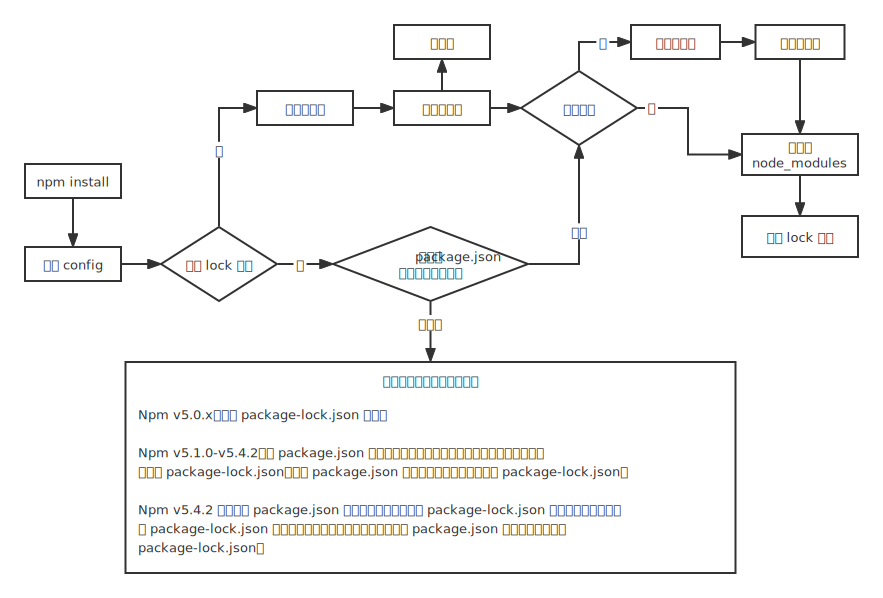

# npm、yarn、pnpm 区别

## npm

### 常用命令

#### 1）初始化

```bash
npm init
```

#### 2）安装依赖

```bash
# 精确安装最新版本
npm install --save-exact 包名 
npm install -E 包名

# 安装指定版本
npm install 包名@版本号
```

`--save-exact` 的作用就是固定依赖包的版本，不要带 `^` 或 `~`，避免出现小版本，有利于版本统一。

#### 3）查询依赖

```bash
# 查看包信息
npm info 包名

# 查看包的信息中的某个字段（常用，例如查看该包在 npm 上提供了哪些版本可以下载）
npm info 包名 versions

# 查看包的文档
npm docs 包名

# 查看全局包的下载路径
npm root -g

# 查看所有全局安装的模块
# npm list –g

# 查看全局模块的一级目录
npm list -g --depth=0
```

#### 4）更新依赖

```bash
# 检查有哪些包需要更新
npm outdated

# 更新包
npm update [-g] [包名]
```

#### 5）卸载依赖

```bash
npm uninstall [-g] 包名
```

#### 6）配置

```bash
# 查看全部 npm 默认设置
npm config ls –l

# 查询当前镜像源
npm get registry

# 设成淘宝镜像源地址
npm config set registry http://registry.npm.taobao.org/

# 设成官方默认的镜像源地址
npm config set registry https://registry.npmjs.org/
```

### npm 脚本（scripts）

在开发的过程中，我们可能会反复使用很多的 CLI 命令，例如：

* 启动工程命令（node 或一些第三方包提供的 CLI 命令）
* 部署工程命令（一些第三方包提供的 CLI 命令）
* 测试工程命令（一些第三方包提供的 CLI 命令）

只需要在 `package.json` 中配置 `scripts` 字段，即可配置各种脚本名称，然后就可以运行简单的指令来完成各种操作了。

运行方式是：

```bash
npm run 脚本名称
```

其中，npm 对某些常用的脚本名称进行了简化，下面的脚本名称是不需要使用 `run` 的：

* start
* stop
* test

### 语义版本书写规则

`package.json` 文件中记录了当前工程的依赖：

* dependencies：生产环境的依赖包
* devDependencies：仅开发环境的依赖包

在 `package.json` 中，依赖包的语义版本书写规则见下表：

|符号 |描述             |示例          |示例描述|
|:--:|:--------------|:------------|:--|
|    |必须确切匹配某个版本| 1.2.1        | 只能是 1.2.1 这个版本  |
|>   |大于某个版本      | >1.2.1        | 大于 1.2.1 版本   |
|>=  |大于等于某个版本   | >=1.2.1       | 大于等于 1.2.1 版本   |
|<   |小于某个版本      | <1.2.1        | 小于 1.2.1 版本   |
|<=	 |小于等于某个版本   | <=1.2.1       | 小于等于 1.2.1 版本   |
|-	 |介于两个版本之间   | 1.2.1 - 1.4.5 | 介于 1.2.1 和 1.4.5 之间   |
|x	 |不固定的版本号     | 1.3.x         | 只要保证主版本号是 1，次版本号是 3 即可    |
|~	 |补丁版本号可增     | ~1.3.4        | 保证主版本号是 1，次版本号是 3，补丁版本号大于等于 4    |
|^	 |次版本和补丁版本可增| ^1.3.4        | 保证主版本号是 1，次版本号可以大于等于 3，补丁版本号可以大于等于 4   |
|*	 |最新版本          | *             | 始终安装最新版本   |

### npm 安装机制

**首先，执行 `npm install` 之后，会检查和获取 npm 的配置**，这里的优先级为：

* 项目级的 `.npmrc` 文件 > 用户级的 `.npmrc` 文件 > 全局级的 `.npmrc` > npm 内置的 `.npmrc` 文件

**然后，检查项目中是否有 `package-lock.json` 文件**：

* 如果有，检查 `package-lock.json` 和 `package.json` 声明的依赖是否一致：
  * 一致，直接使用 `package-lock.json` 中的信息，从网络或者缓存中加载依赖。
  * 不一致，根据下述流程中的不同版本进行处理。
* 如果没有，那么会根据 `package.json` 递归构建依赖树，然后就会根据构建好的依赖去下载完整的依赖资源，在下载的时候，会检查有没有相关的资源缓存：
  * 存在，直接解压到 `node_modules` 文件中。
  * 不存在，从 npm 远端仓库下载包，校验包的完整性，同时添加到缓存中，解压到 `node_modules` 中。

**最后，生成 `package-lock.json` 文件**。

<div style="text-align: center;">
  
  <p style="text-align: center; color: #888;">（npm 的安装机制）</p>
</div>

### npm 缓存机制

在实际的项目开发中，如果每次都去安装对应依赖时，如果相关的依赖包体积过大或者是依赖于网络，无疑会增加安装的时间成本。那么缓存在这里的就是一个解决问题的好办法。

通过下面这个命令可以查看 npm 在本地缓存的位置：

```bash
npm config get cache
```

里面有三个文件夹：

* `_cacache`
* `_locks`
* `_logs`

那么我没有对**缓存是如何存储并且被利用的**进行底层剖析，可以[查看这篇文章](https://github.com/sliwey/blog/issues/1)。

## yarn

### 介绍

yarn 的出现是为了解决历史上 npm 的某些不足：

当时 npm 还没有 `package-lock.json` 文件，安装的时候速度很慢，稳定性很差，yarn 的出现很好的解决了一下的一些问题：

* 依赖目录嵌套层次深：很久以前 npm 的依赖是嵌套的，而 Windows 系统无法支持太深的目录。
* 下载速度慢
  * 由于嵌套层次的问题，所以npm对包的下载只能是串行的，即前一个包下载完后才会下载下一个包，导致带宽资源没有完全利用。
  * 多个相同版本的包被重复的下载。
* 控制台输出繁杂：安装时有大量的信息输出到控制台，遇到错误极难查看。
* 工程移植问题：由于 npm 的版本依赖可以是模糊的，可能会导致工程移植后，依赖的确切版本不一致。

而 yarn 用到了以下手段：

* 使用扁平的目录结构
* 并行下载
* 使用本地缓存
* 控制台仅输出关键信息
* 使用 `yarn-lock` 文件记录确切依赖

不仅如此，yarn 还优化了以下内容：

* 增加了某些功能强大的命令
* 让既有的命令更加语义化
* 本地安装的 CLI 工具可以使用 yarn 直接启动
* 将全局安装的目录当作一个普通的工程，生成 `package.json` 文件，便于全局安装移植

但现在 npm 也通过不断的优化，几乎完全解决了上面的问题：

* 目录扁平化
* 并行下载
* 本地缓存
* 使用 `package-lock` 记录确切依赖
* 增加了大量的命令别名
* 内置了 `npx`，可以启动本地的 CLI 工具
* 极大的简化了控制台输出

所以现在的 npm 已经和 yarn 非常接近，甚至没有差距了。

### 常用命令

#### 1）安装

```bash
# 全局安装 yarn
npm install -g yarn
```

#### 2）初始化

```bash
yarn init
```

#### 3）安装依赖

```bash
# 添加指定包
yarn [global] add package-name [--dev/-D] [--exact/-E]

# 安装 package.json 中的所有依赖
yarn install [--production/--prod]
```

#### 4）脚本和本地 CLI

```bash
# 运行脚本
# start、stop、test 可以省略 run
yarn run 脚本名

# 运行本地安装的 CLI
yarn run CLI名
```

#### 5）查询依赖

```bash
# 查看 bin 目录
yarn [global] bin

# 查询包信息
yarn info 包名 [子字段]

# 列举已安装的依赖
yarn [global] list [--depth=依赖深度]
```

yarn 的 list 命令和 npm 的 list 不同，yarn 输出的信息更加丰富，包括顶级目录结构、每个包的依赖版本号。

#### 6）更新依赖

```bash
# 列举需要更新的包
yarn outdated

# 更新包
yarn [global] upgrade [包名]
```

#### 7）卸载依赖

```bash
# 卸载包
yarn remove 包名
```

### yarn 的特别命令

在终端命令上，yarn 不仅仅是对 npm 的命令做了一个改名，还增加了一些原本没有的命令。

#### 1）yarn check

使用 `yarn check` 命令，可以验证 `package.json` 文件的依赖记录和 lock 文件是否一致，这对于防止篡改非常有用。

#### 2）yarn audit

使用 `yarn audit` 命令，可以检查本地安装的包有哪些已知漏洞，以表格的形式列出，漏洞级别分为以下几种：

* INFO：信息级别
* LOW: 低级别
* MODERATE：中级别
* HIGH：高级别
* CRITICAL：关键级别

#### 3）yarn why

使用 `yarn why 包名` 命令，可以在控制台打印出为什么安装了这个包，哪些包会用到它。

#### 4）yarn create

过去，我们都是使用如下的做法通过脚手架来搭建一个工程结构：

* 全局安装脚手架工具
* 使用全局命令搭建脚手架

由于大部分脚手架工具都是以 `create-xxx` 的方式命名的，比如 React 的官方脚手架名称为 `create-react-app`。

因此，可以使用 `yarn create` 命令来一步完成安装和搭建，例如：

```bash
yarn create react-app my-app

# 等同于下面的两条命令
yarn global add create-react-app
create-react-app my-app
```

### yarn 安装机制

yarn 的安装大致分为 5 个步骤：

检测（checking）、解析包（Resolving Packages）、获取包（Fetching）、链接包（Linking Packages）、构建包（Building Packages）

#### 1）检测包

检测我们的项目中是否存在 npm 相关的文件，比如 `package-lock.json` 等。如果有，就会有相关的提示用户注意：这些文件可能会存在冲突。在这一步骤中也会检测系统 OS、CPU 等信息。

#### 2）解析包

这一步会解析依赖树中的每一个包的信息：

首先呢获取到首层依赖：也就是当前项目中的 `package.json` 定义的 `dependencies`、`devDependencies`、`optionalDependencies`的内容。

接着会采用遍历首层依赖的方式来获取包的依赖信息，以及递归查找每个依赖下嵌套依赖的版本信息，并将解析过的包和正在进行解析的包用 Set 数据结构进行存储，这样就可以保证同一版本范围内的包不会进行重复的解析。

> 举个例子
> * 对于没有解析过的包 A，首次尝试从 `yarn.lock` 中获取版本信息，并且标记为已解析。
> * 如果在 `yarn.lock` 中没有找到包 A，则向 Registry 发起请求获取满足版本范围内的已知的最高版本的包信息，获取之后将该包标记为已解析。

经过解析包这一步之后，我们就已经确定了解析包的具体版本信息和包的下载地址。

#### 3）获取包

这一步首先会检查缓存中是否有当前依赖的包，同时将缓存中不存在的包下载到缓存的目录中。

> 在 yarn 中会根据 cacheFolder+[slug](https://github.com/Trott/slug)+node_modules+pkg.name 生成一个路径，判断系统中是否存在该 path，如果存在证明已经有缓存，不用重新下载。这个 path 也就是依赖包缓存的具体路径。

对于没有命中的缓存包，在 yarn 中存在一个 Fetch 队列，按照具体的规则进行网络请求。如果下载的包是一个 file 协议，或者是相对路径，就说明指向一个本地目录，此时会调用 Fetch From Local 从离线缓存中获取包；否则调用 Fetch From External 获取包，最终获取的结果使用 fs.createWriteStream 写入到缓存目录。

#### 4）链接包

上一步已经把依赖放到了缓存目录，现在要把项目中的依赖复制到 `node_modules` 目录下。此时需要遵循一个扁平化的原则：复制依赖之前，yarn 会先解析 `peerDepdencies`，如果找不到符合要求的 `peerDepdencies` 的包，会有 `warning` 提示，并最终拷贝依赖到项目中。

#### 5）构建包

如果依赖包中存在二进制包需要进行编译，那么会在这一步进行。

## pnpm

### 介绍

pnpm 是一种新起的包管理器，从 npm 的下载量看，目前还没有超过 yarn，但它的实现方式值得主流包管理器学习，某些开发者极力推荐使用 pnpm。

从结果上来看，它具有以下优势：

* 目前，安装效率高于 npm 和 yarn 的最新版
* 极其简洁的 `node_modules` 目录
* 避免了开发时使用间接依赖的问题
* 能极大的降低磁盘空间的占用

### 安装和使用

```bash
# 全局安装 pnpm
npm install -g pnpm
```

之后在使用时，只需要把 `npm` 替换为 `pnpm` 即可。

如果要执行安装在本地的 CLI，可以使用 `pnpx`，它和 `npx` 的功能完全一样，唯一不同的是，在使用 `pnpx` 执行一个需要安装的命令时，会使用 `pnpm` 进行安装。

比如 `npx mocha` 执行本地的 `mocha` 命令时，如果 `mocha` 没有安装，则 npx 会自动的、临时的安装 mocha，安装好后，自动运行 mocha 命令。

### pnpm 安装机制

* 同 yarn 和 npm 一样，pnpm 仍然使用缓存来保存已经安装过的包，以及使用 `pnpm-lock.yaml` 来记录详细的依赖版本。
* 不同于 yarn 和 npm， pnpm 使用符号链接和硬链接（可将它们想象成快捷方式）的做法来放置依赖，从而规避了从缓存中拷贝文件的时间，使得安装和卸载的速度更快。
* 由于使用了符号链接和硬链接，pnpm 可以规避 Windows 操作系统路径过长的问题，因此，它选择使用树形的依赖结果，有着几乎完美的依赖管理。也因为如此，项目中只能使用直接依赖，而不能使用间接依赖。

（完）
