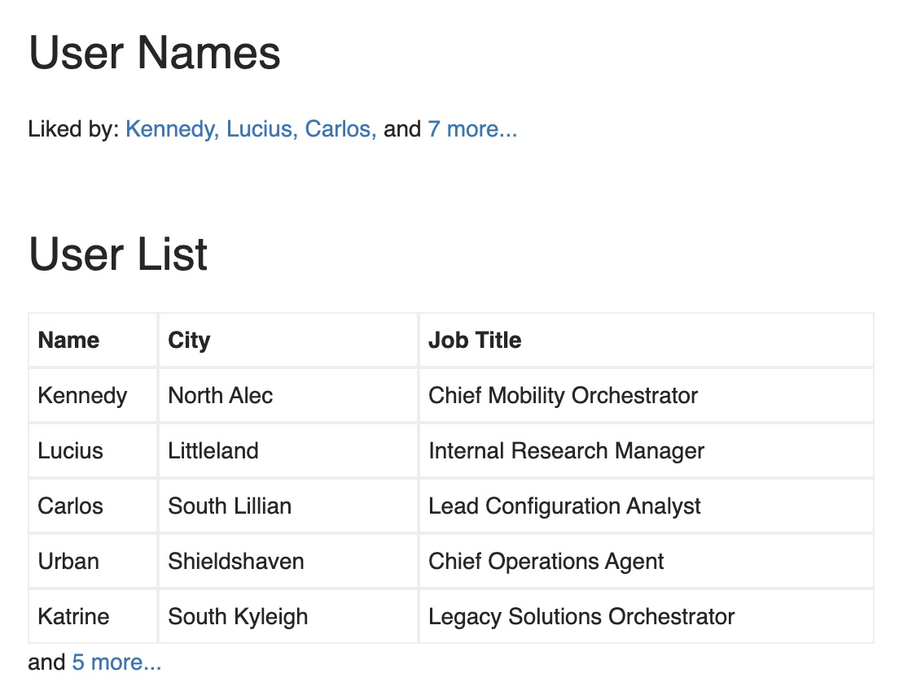

# 函数组件设计模式

## 容器模式

### 定义

容器模式，就是把原来需要条件运行的 Hooks 拆分成子组件，然后通过一个容器组件来进行实际的条件判断，从而渲染不同的组件，实现按条件渲染的目的。

这在一些复杂的场景之下，也能达到拆分复杂度，让每个组件更加精简的目的。

### 举例

Hooks 有一个重要规则，即：Hooks 必须在顶层作用域调用，而不能放在条件判断、循环等语句中，同时也不能在可能的 `return` 语句之后执行。

但有时候我们却需要先进行条件判断，再决定是否调用相应的代码：比如一个对话框组件，通过 `visible` 属性来控制是否显示：

```jsx
import { Modal } from "antd";
import useUser from "../useUser";

function UserInfoModal({ visible, userId, ...rest }) {
  // 当 visible 为 false 时，不渲染任何内容
  if (!visible) return null;
  // 这一行 Hook 在可能的 return 之后，会报错！
  const { data, loading, error } = useUser(userId);

  return (
    <Modal visible={visible} {...rest}>
      {/* 对话框的内容 */}
    </Modal>
  );
};
```

上述代码会报错，因为在 `return` 语句之后使用了 `useUser` 这个 Hook。

要想实现我们期望的逻辑，就可以采用容器模式。具体的做法是把条件判断的结果放到两个组件之中，针对上面的例子，就可以在 `UserInfoModal` 外层加一个容器：

```jsx
// 定义一个容器组件用于封装真正的 UserInfoModal
export default function UserInfoModalWrapper({
  visible,
  ...rest // 使用 rest 获取除了 visible 之外的属性
}) {
  // 如果对话框不显示，则不 render 任何内容
  if (!visible) return null; 
  // 否则真正执行对话框的组件逻辑
  return <UserInfoModal visible {...rest} />;
}
```

这样就间接实现了按条件去执行 Hooks 的逻辑。

### 对比

如果只有一个属性 `visible` 来决定是否展示的话，也可以直接在父级 `visible && <UserInfoModal />`。

但在实际的使用场景中，可能判断条件不止 `visible` 一个属性，而会是一些属性的组合，来具体决定 render 什么内容。这样的情况使用容器模式就有一些好处了，比如说在函数组件可以少写一些条件判断语句，并且确保每个组件尽量短小，这样反而更加易读和维护。

另外，容器模式的隔离对象是多个子组件，它通常用于一些比较大块逻辑的隔离。对于一些比较细节的控制，其实也可以把判断条件放到 Hooks 中去，比如：

```jsx
function useUser(id) {
  const [data, setData] = useState(null);
  const [loading, setLoading] = useState(false);
  const [error, setError] = useState(null);
  useEffect(() => {
    // 当 id 不存在，直接返回，不发送请求
    if (!id) return
    // 只有 id 存在，才进入获取用户信息的逻辑
  });
}
```

## render props 模式

### 定义

render props 模式和 Hooks 没有任何关系，但它可以作为 Hooks 的一个补充。

因为 Hooks 只能用作数据逻辑的重用，而 render props 可以用于 UI 表现逻辑的重用。

### 举例

比如下图的两个列表展示，一个展示名字，一个展示用户。它们都有一个共同点：如果超过一定数量，就把多余的部分折叠起来，通过一个弹出框去显示。

<div style="text-align: center;">
  
  <p style="text-align:center; color: #888;">（render props 案例）</p>
</div>

提炼一下需求：

* 相同点：数据超过一定数量时，显示一个「更多...」的文字；鼠标移上去则弹出一个框，用于显示其它的数据。
* 不同点：每一个列表项如何渲染，是在使用的时候决定的（直接罗列、列表、表格等各种形式）。

通过 render props 这个设计模式，来实现这个 `ListWithMore` 组件：

```jsx
import { Popover } from "antd";

function ListWithMore({ renderItem, data = [], max }) {
  const elements = data.map((item, index) => renderItem(item, index, data));
  const show = elements.slice(0, max);
  const hide = elements.slice(max);
  return (
    <span className="list-with-more">
      {show}
      {hide.length > 0 && (
        <Popover content={<div style={{ maxWidth: 500 }}>{hide}</div>}>
          <span className="more-items-wrapper">
            and{" "}
            <span className="more-items-trigger"> {hide.length} more...</span>
          </span>
        </Popover>
      )}
    </span>
  );
}
```

这个组件接收了三个参数：

* renderItem：用于接收一个函数，由父组件决定如何渲染一个列表项。
* data：需要渲染的数据。
* max：最多显示几条数据。

接下来让父组件调用，实现上面示意图中两个场景的需求：

```jsx
// 这里用一个示例数据
import data from './data';

function ListWithMoreExample () => {
  return (
    <div className="list-with-more">
      <h1>User Names</h1>
      <div className="user-names">
        Liked by:{" "}
        <ListWithMore
          renderItem={(user) => {
            return <span className="user-name">{user.name}</span>;
          }}
          data={data}
          max={3}
        />
      </div>
      <br />
      <br />
      <h1>User List</h1>
      <div className="user-list">
        <div className="user-list-row user-list-row-head">
          <span className="user-name-cell">Name</span>
          <span>City</span>
          <span>Job Title</span>
        </div>
        <ListWithMore
          renderItem={(user) => {
            return (
              <div className="user-list-row">
                <span className="user-name-cell">{user.name}</span>
                <span>{user.city}</span>
                <span>{user.job}</span>
              </div>
            );
          }}
          data={data}
          max={5}
        />
      </div>
    </div>
  );
};
```

可以看到，代码里使用了两个 `ListWithMore` 组件，通过 `renderItem` 这个属性，我们可以自主决定该如何渲染每一个列表项，从而把一部分 UI 逻辑抽象出来，形成一个可复用的逻辑，以简化不同场景的使用。

（完）
