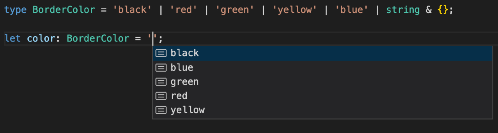

# 联合类型与交叉类型

前面介绍的基础类型、字面量类型、函数类型及接口类型，它们都是单一、原子的类型元素。在一些稍微复杂、实际编程场景中，我们还需要通过组合/结合单一、原子类型构造更复杂的类型，以此描述更复杂的数据和结构。于是引入了联合和交叉类型。

## 联合类型

联合类型表示取值可以为多种类型中的一种，通过 `|` 操作符分隔类型的语法来表示联合类型。

```typescript
let myFavoriteNumber: string | number;
myFavoriteNumber = 'seven';
myFavoriteNumber = 7;
```

当 TypeScript 不确定一个联合类型的变量到底是哪个类型的时候，我们**只能访问此联合类型的所有类型里共有的属性或方法**：

```typescript
function getLength(something: string | number): number {
  return something.length;
}

// error: Property 'length' does not exist on type 'string | number'.
//   Property 'length' does not exist on type 'number'.
```

上例中，`length` 不是 `string` 和 `number` 的共有属性，所以会报错。

访问 `string` 和 `number` 的共有属性是没问题的：

```typescript
function getString(something: string | number): string {
  return something.toString();
}
```

联合类型的变量在被赋值的时候，会根据**类型推论**的规则推断出一个类型：

```typescript
let myFavoriteNumber: string | number;
myFavoriteNumber = 'seven';
console.log(myFavoriteNumber.length); // 5
myFavoriteNumber = 7;
console.log(myFavoriteNumber.length); // 编译时报错

// error: Property 'length' does not exist on type 'number'.
```

上例中，第二行的 `myFavoriteNumber` 被推断成了 `string`，访问它的 `length` 属性不会报错。

而第四行的 `myFavoriteNumber` 被推断成了 `number`，访问它的 `length` 属性时就报错了。

> 类型推论：如果没有明确的指定类型，那么 TypeScript 会依照类型推论的规则推断出一个类型。
> * TypeScript 会在没有明确的指定类型的时候，根据定义时的赋值，推测出一个类型，这就是类型推论。
> * 如果定义的时候没有赋值，不管之后有没有赋值，都会被推断成 `any` 类型而完全不被类型检查。

## 交叉类型

交叉类型可以把多个类型合并成一个类型，合并后的类型将拥有所有成员类型的特性。通过 `&` 操作符来声明交叉类型。

```typescript
type Useless = string & number;
```

显然，如果仅仅把原始类型、字面量类型、函数类型等原子类型合并成交叉类型，是没有任何用处的，因为任何类型都不能满足同时属于多种原子类型，比如既是 `string` 类型又是 `number` 类型。因此，在上述的代码中，类型别名 `Useless` 的类型就是个 `never`。

### 合并接口类型

联合类型真正的用武之地就是将多个接口类型合并成一个类型，从而实现等同接口继承的效果，也就是所谓的合并接口类型，如下代码所示：

```typescript
type IntersectionType = { id: number; name: string; } 
  & { age: number };
const mixed: IntersectionType = {
  id: 1,
  name: 'name',
  age: 18
}
```

在上述示例中，我们通过交叉类型，使得 `IntersectionType` 同时拥有了 `id`、`name`、`age` 所有属性，这里我们可以试着将合并接口类型理解为求并集。

**如果合并的多个接口类型存在同名属性会是什么效果呢**？

* 如果同名属性的类型不兼容（一个是 `number`，另一个是 `string`），合并后就是交叉类型，即 `never`。
* 如果同名属性的类型兼容（一个是 `number`，另一个是 `number` 的子类型、数字字面量类型），合并后就是两者中的子类型。

### 合并联合类型

可以合并联合类型为一个交叉类型，这个交叉类型需要同时满足不同的联合类型限制，也就是提取了所有联合类型的相同类型成员。

**可以将合并联合类型理解为求交集**。

在如下示例中，两个联合类型交叉出来的类型 IntersectionUnion 其实等价于 `'em' | 'rem'`，所以只能把 `'em'` 或者 `'rem'` 字符串赋值给 IntersectionUnion 类型的变量。

```typescript
type UnionA = 'px' | 'em' | 'rem' | '%';
type UnionB = 'vh' | 'em' | 'rem' | 'pt';
type IntersectionUnion = UnionA & UnionB;
const intersectionA: IntersectionUnion = 'em'; // ok
const intersectionB: IntersectionUnion = 'rem'; // ok
const intersectionC: IntersectionUnion = 'px'; // ts(2322)
const intersectionD: IntersectionUnion = 'pt'; // ts(2322)
```

既然是求交集，如果多个联合类型中没有相同的类型成员，交叉出来的类型自然就是 `never` 了，如下代码所示：

```typescript
type UnionC = 'em' | 'rem';
type UnionD = 'px' | 'pt';
type IntersectionUnionE = UnionC & UnionD;
const intersectionE: IntersectionUnionE = 'any' as any; // ts(2322) 不能赋予 'never' 类型
```

在上述示例中，因为 UnionC 和 UnionD 没有交集，交叉出来的类型 IntersectionUnionE 就是 `never`，所以我们不能把任何类型的值赋予 IntersectionUnionE 类型的变量。

## 联合、交叉组合

当联合、交叉类型直接组合使用时，联合操作符 `|` 的优先级低于交叉操作符 `&`。

```typescript
// 交叉操作符优先级高于联合操作符
type UnionIntersectionA = { id: number; } & { name: string; } | { id: string; } & { name: number; };
```

可以通过使用小括弧 `()` 来调整操作符的优先级。

```typescript
// 调整优先级
type UnionIntersectionB = ('px' | 'em' | 'rem' | '%') | ('vh' | 'em' | 'rem' | 'pt');
```

接下来，就可以把数学中的分配率、交换律等基本规则引入类型组合中，然后优化出更简洁、清晰的类型，如下代码所示：

```typescript
// 原类型
type UnionIntersectionC = ({ id: number; } & { name: string; } | { id: string; }) & { name: number; };

// 展开：满足分配率
type UnionIntersectionD = { id: number; } & { name: string; } & { name: number; } | { id: string; } & { name: number; };

// 调整顺序：满足交换律
type UnionIntersectionE = ({ id: string; } | { id: number; } & { name: string; }) & { name: number; };
```

## 类型缩减

如果将 `string` 原始类型和「string 字面量类型」组合成联合类型，效果就是类型缩减成 `string` 了。

同样，对于 `number`、`boolean`、枚举类型也是一样的缩减逻辑。

```typescript
type URStr = 'string' | string; // 类型是 string
type URNum = 2 | number;        // 类型是 number
type URBoolen = true | boolean; // 类型是 boolean
enum EnumUR {
  ONE,
  TWO
}
type URE = EnumUR.ONE | EnumUR; // 类型是 EnumUR
```

TypeScript 对这样的场景做了缩减，它把字面量类型、枚举成员类型缩减掉，只保留原始类型、枚举类型等父类型，这是合理的「优化」。

可是这个缩减，却极大地削弱了 IDE 自动补全的能力，也就是使用如下定义的类型来声明和赋值变量时，由于类型被缩减成 `string` 了，IDE 也就没法联想出这些字符串字面量作为赋值可选值。

```typescript
// 类型缩减成 string
type BorderColor = 'black' | 'red' | 'green' | 'yellow' | 'blue' | string;
```

不过 TypeScript 官方也提供了一个黑魔法，它可以让类型缩减被控制。如下代码所示，我们只需要给父类型添加「& {}」即可。

```typescript
// 字面类型都被保留
type BorderColor = 'black' | 'red' | 'green' | 'yellow' | 'blue' | string & {};
```

<div style="text-align: center;">
  
  <p style="text-align: center; color: #888;">（VS Code 自动提示效果图）</p>
</div>

此外，当联合类型的成员是接口类型，如果满足其中一个接口的属性是另外一个接口属性的子集，这个属性也会类型缩减，如下代码所示：

```typescript
type UnionInterce =
| {
    age: '1';
  }
| ({
    age: '1' | '2';
    [key: string]: string;
  });
```

这里因为 `'1'` 是 `'1' | '2'` 的子集，所以 `age` 的属性变成 `'1' | '2'`。

### 高级用法

如何定义如下所示 `age` 属性是数字类型，而其他不确定的属性是字符串类型的数据结构的对象？

```javascript
{
  age: 1, // 数字类型
  anyProperty: 'str', // 其他不确定的属性都是字符串类型
  ...
}
```

思路肯定是用到两个接口的联合类型及类型缩减。这个问题的核心在于找到一个既是 `number` 的子类型，这样 `age` 类型缩减之后的类型就是 `number`；同时也是 `string` 的子类型，这样才能满足属性和 `string` 索引类型的约束关系。

哪个类型满足这个条件呢？

特殊类型 `never` —— 它是所有类型的子类型。答案如下：

```typescript
type UnionInterce =
| {
    age: number;
  }
| ({
    age: never;
    [key: string]: string;
  });
const O: UnionInterce = {
  age: 2,
  string: 'string'
};
```

在上述代码中，我们在第 3 行定义了 number 类型的 age 属性，第 6 行定义了 never 类型的 age 属性，等价于 age 属性的类型是由 number 和 never 类型组成的联合类型，所以我们可以把 number 类型的值（比如说数字字面量 1）赋予 age 属性；但是不能把其他任何类型的值（比如说字符串字面量 'string' ）赋予 age。

同时，我们在第 5 行~第 8 行定义的接口类型中，还额外定义了 string 类型的字符串索引签名。因为 never 同时又是 string 类型的子类型，所以 age 属性的类型和字符串索引签名类型不冲突。如第 9 行~第 12 行所示，我们可以把一个 age 属性是 2、string 属性是 'string' 的对象字面量赋值给 UnionInterce 类型的变量 O。

（完）
