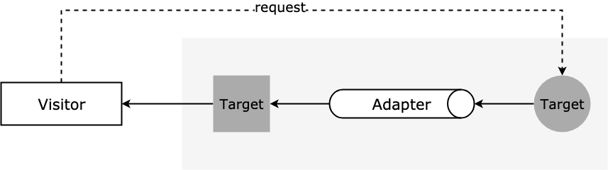

# 适配器模式

## 介绍

适配器模式（Adapter Pattern）又称包装器模式，将一个类（对象）的接口（方法、属性）转化为用户需要的另一个接口，解决类（对象）之间接口不兼容的问题。

主要功能是进行转换匹配，目的是复用已有的功能，而不是来实现新的接口。也就是说，如果访问者需要的功能应该是已经实现好了的，就不需要适配器模式来实现。适配器模式主要是负责把不兼容的接口转换成访问者期望的格式而已。

## 通俗的示例

* 电源接口的转接头、Type-C 转 HDMI 等视频转接头。
* 同声传译，充当两国友人互相交流的中间人

在类似场景中，这些例子有以下特点：

* 旧有接口格式已经不满足现在的需要。
* 通过增加适配器来更好地使用旧有接口。

## 适配器模式的通用实现

传统的工厂模式比较复杂，因为像 Java 等语言中有「接口」的概念。但 JS 中没有接口，即使可以用再加一层父类的形式来代替接口，但「用不同的子类继承父类，从而实现不同子类」的场景比较少，所以我们可以提炼一下工厂模式：

如果我们希望获得产品，通过工厂类就可以拿到产品实例，不用关注产品实例创建流程。主要有下面几个概念：

* **Target**：使用者所期待的类。
* **Adapter**：需要适配的类（旧的类）。

结构如下：

<div style="text-align: center;">
  
  <p style="text-align: center; color: #888;">（适配器模式结构图）</p>
</div>

代码如下：

> 以下代码模拟实现了电源适配器的例子，通过电源转换器，将德国标准的插头转换成中国标准的插头。
>
> `request` 是我们预期需要的接口，`specificRequest` 是需要适配的类里的接口。

```javascript
class Adapter {
  specificRequest() {
    return '德国标准的插头';
  }
}

class Target {
  constructor() {
    this.adapter = new Adapter();
  }
  request() {
    let info = this.adapter.specificRequest();
    return `${info} -> 转换器 -> 中国标准的插头`;
  }
}

// 测试
let target = new Target();
let res = target.request();
console.log(res);
```

访问者需要目标对象的某个功能，但是这个对象的接口不是自己期望的，那么通过适配器模式对现有对象的接口进行包装，来获得自己需要的接口格式。

## 适配器模式的实际应用

适配器模式在日常开发中还是比较常见的，可能你已经使用了，但因为没有学过设计模式，所以不知道这种实现方式有个叫「适配器模式」的名字。

### jQuery.ajax 适配 Axios

有的使用 jQuery 的老项目使用 `$.ajax` 来发送请求，现在的新项目一般使用 Axios，那么现在有个老项目的代码中全是 `$.ajax`，如果逐个修改，无疑工作量巨大而且很容易引发各种乱七八糟 bug，这时可以采用适配器模式来将老的使用形式适配到新的技术栈上：

```javascript
/* 适配器 */
function ajax2AxiosAdapter(ajaxOptions) {
  return axios({
    url: ajaxOptions.url,
    method: ajaxOptions.type,
    responseType: ajaxOptions.dataType,
    data: ajaxOptions.data
  })
    .then(ajaxOptions.success)
    .catch(ajaxOptions.error)
}

/* 经过适配器包装 */
$.ajax = function(options) {
  return ajax2AxiosAdapter(options);
}

// 测试：用 jQuery 的方式发送一个 ajax 请求
$.ajax({
  url: '/demo-url',
  type: 'POST',
  dataType: 'json',
  data: {
    name: '张三',
    id: '13'
  },
  success: function(data) {
    console.log('请求成功！')
  },
  error: function(err) {
    console.error('请求失败！')
  }
})
```

可以看到老的代码表现形式依然不变，但是真正发送请求是通过新的发送方式来进行的。当然你也可以把 Axios 的请求适配到 `$.ajax` 上，就看你如何使用适配器了。

### 业务数据适配

在实际项目中，我们经常会遇到树形数据结构和表形数据结构的转换，比如全国省市区结构、公司组织结构、军队编制结构等等。以公司组织结构为例，在历史代码中，后端给了公司组织结构的树形数据，在以后的业务迭代中，会增加一些要求非树形结构的场景。比如增加了将组织维护起来的功能，因此就需要在新增组织的时候选择上级组织，在某个下拉菜单中选择这个新增组织的上级菜单。或者增加了将人员归属到某一级组织的需求，需要在某个下拉菜单中选择任一级组织。

在这些业务场景中，都需要将树形结构平铺开，但是我们又不能直接将旧有的树形结构状态进行修改，因为在项目别的地方已经使用了老的树形结构状态，这时我们可以引入适配器来将老的数据结构进行适配：

```javascript
/* 原来的树形结构 */
const oldTreeData = [
  {
    name: '总部',
    place: '一楼',
    children: [
      { name: '财务部', place: '二楼' },
      { name: '生产部', place: '三楼' },
      {
        name: '开发部', place: '三楼', children: [
          {
            name: '软件部', place: '四楼', children: [
              { name: '后端部', place: '五楼' },
              { name: '前端部', place: '七楼' },
              { name: '技术支持部', place: '六楼' }]
          }, {
            name: '硬件部', place: '四楼', children: [
              { name: 'DSP部', place: '八楼' },
              { name: 'ARM部', place: '二楼' },
              { name: '调试部', place: '三楼' }]
          }]
      }
    ]
  }
]

/* 树形结构平铺 */
function treeDataAdapter(treeData, lastArrayData = []) {
  treeData.forEach(item => {
    if (item.children) {
      treeDataAdapter(item.children, lastArrayData)
    }
    const { name, place } = item
    lastArrayData.push({ name, place })
  })
  return lastArrayData
}

// 测试：返回平铺的组织结构
treeDataAdapter(oldTreeData)
```

增加适配器后，就可以将原先状态的树形结构转化为所需的结构，而并不改动原先的数据，也不对原来使用旧数据结构的代码有所影响。

### Vue 计算属性

Vue 中的计算属性也是一个适配器模式的实例，以官网的例子为例，我们可以一起来理解一下：

```vue
<template>
  <div id="example">
    <p>Original message: "{{ message }}"</p>  <!-- Hello -->
    <p>Computed reversed message: "{{ reversedMessage }}"</p>  <!-- olleH -->
  </div>
</template>

<script type='text/javascript'>
  export default {
    name: 'demo',
    data() {
      return {
        message: 'Hello'
      }
    },
    computed: {
      reversedMessage: function() {
        return this.message.split('').reverse().join('')
      }
    }
  }
</script>
```

旧有 data 中的数据不满足当前的要求，通过计算属性的规则来适配成我们需要的格式，对原有数据并没有改变，只改变了原有数据的表现形式。

### Axios 源码中的适配器模式

Axios 是比较热门的网络请求库，在浏览器中使用的时候，Axios 的用来发送请求的 `adapter` 本质上是封装浏览器提供的 API [XMLHttpRequest](https://developer.mozilla.org/zh-CN/docs/Web/API/XMLHttpRequest)，我们可以看看源码中是如何封装这个 API 的，为了方便观看，进行了一些省略：

```javascript
module.exports = function xhrAdapter(config) {
  return new Promise(function dispatchXhrRequest(resolve, reject) {
    var requestData = config.data
    var requestHeaders = config.headers

    var request = new XMLHttpRequest()

    // 初始化一个请求
    request.open(config.method.toUpperCase(),
      buildURL(config.url, config.params, config.paramsSerializer), true)

    // 设置最大超时时间
    request.timeout = config.timeout

    // readyState 属性发生变化时的回调
    request.onreadystatechange = function handleLoad() { ... }

    // 浏览器请求退出时的回调
    request.onabort = function handleAbort() { ... }

    // 当请求报错时的回调
    request.onerror = function handleError() { ... }

    // 当请求超时调用的回调
    request.ontimeout = function handleTimeout() { ... }

    // 设置HTTP请求头的值
    if ('setRequestHeader' in request) {
      request.setRequestHeader(key, val)
    }

    // 跨域的请求是否应该使用证书
    if (config.withCredentials) {
      request.withCredentials = true
    }

    // 响应类型
    if (config.responseType) {
      request.responseType = config.responseType
    }

    // 发送请求
    request.send(requestData)
  })
}
```

可以看到这个模块主要是对请求头、请求配置和一些回调的设置，并没有对原生的 API 有改动，所以也可以在其他地方正常使用。这个适配器可以看作是对 `XMLHttpRequest` 的适配，是用户对 Axios 调用层到原生 `XMLHttpRequest` 这个 API 之间的适配层。

源码可以参见 Github 仓库：[axios/lib/adapters/xhr.js](https://github.com/axios/axios/blob/v0.19.0/lib/adapters/xhr.js)

## 设计原则验证

* 将旧接口和使用者进行分离
* 符合开放封闭原则

## 适配器模式的优缺点

优点：

* 已有的功能如果只是接口不兼容，使用适配器适配已有功能，可以使原有逻辑得到**更好的复用**，有助于避免大规模改写现有代码。
* **可扩展性良好**，在实现适配器功能的时候，可以调用自己开发的功能，从而方便地扩展系统的功能。
* **灵活性好**，因为适配器并没有对原有对象的功能有所影响，如果不想使用适配器了，那么直接删掉即可，不会对使用原有对象的代码有影响。

缺点：

* 会让系统变得零乱，明明调用 A，却被适配到了 B，如果系统中这样的情况很多，那么**对可阅读性不太友好**。如果没必要使用适配器模式的话，可以考虑重构，如果使用的话，可以考虑尽量把文档完善。

## 适配器模式的适用场景

当你想用已有对象的功能，却想修改它的接口时，一般可以考虑一下是不是可以应用适配器模式。

* 如果你想要使用一个已经存在的对象，但是它的接口不满足需求，那么可以使用适配器模式，把已有的实现转换成你需要的接口。
* 如果你想创建一个可以复用的对象，而且确定需要和一些不兼容的对象一起工作，这种情况可以使用适配器模式，然后需要什么就适配什么。

## 其他相关模式

### 适配器模式与代理模式

* **适配器模式**：提供一个不一样的接口，由于原来的接口格式**不能用了**，提供新的接口以满足新场景下的需求。
* **代理模式**：提供一模一样的接口，由于不能直接访问目标对象，找个代理来帮忙访问，使用者可以就像访问目标对象一样来访问代理对象。

### 适配器模式、装饰者模式与代理模式

* **适配器模式**：功能不变，只转换了原有接口访问格式。
* **装饰者模式**：扩展功能，原有功能不变且可直接使用。
* **代理模式**：原有功能不变，但一般是经过限制访问的。

（完）
