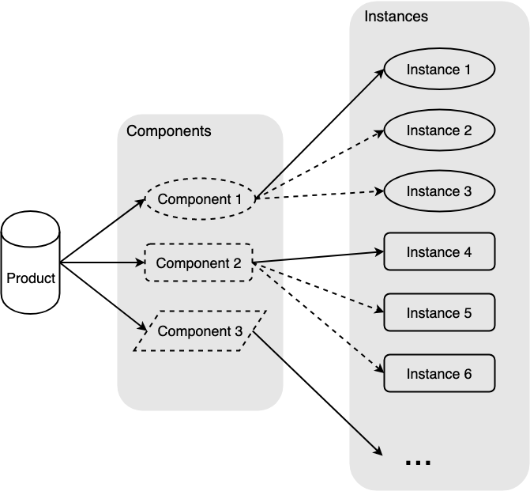

# 桥接模式

## 介绍

桥接模式（Bridge Pattern）又称桥梁模式，将抽象部分与它的实现部分分离，使它们都可以独立地变化。使用组合关系代替继承关系，降低抽象和实现两者间的耦合度。

抽象部分和实现部分可能不太好理解，举个例子，香蕉、苹果、西瓜，它们共同的抽象部分就是水果，可以吃，实现部分就是不同的水果实体。再比如黑色手提包、红色钱包、蓝色公文包，它们共同的抽象部分是包和颜色，这部分的共性就可以被作为抽象提取出来。

## 通俗的示例

比如包包，包的种类是一个维度（钱包、书包、手提包），包的尺寸是一个维度（小号、中号、大号），包的颜色又是一个维度。每个维度可以自由变化后组合在一起形成一个包。

我们在系统设计时，如果给每个种类对应的每个尺寸和颜色都设置一个类，那么系统中的类就会很多。如果根据实际需要对种类、尺寸、颜色这些维度进行组合，那么将大大减少系统中类的个数。

将抽象和实现分离，互相独立互不影响：

* 装饰不影响原有的功能，原有功能可以照常使用。
* 产品有多个维度，每个维度都可以独立变化（实例化过程），包包这个例子的维度就是种类、尺寸、颜色，这几个维度可以独立地进行变化，从而组装成不同的包包。

## 桥接模式的通用实现

实现一下上面这个包包的例子：

```javascript
/* 包包 */
class Bag {
  constructor(type, size, color) {
    this.type = type;
    this.size = size;
    this.color = color;
  }

  /* 展示 */
  show() {
    console.log(
      this.color.show() + this.size.show() + this.type.show()
    )
  }
}

/* 皮包类型 */
class BagType {
  constructor(type) {
    this.type = type;
  }

  show() {
    return this.type;
  }
}

/* 皮包尺寸 */
class BagSize {
  constructor(size) {
    this.size = size;
  }

  show() {
    return this.size;
  }
}

/* 皮包颜色 */
class BagColor {
  constructor(color) {
    this.color = color;
  }

  show() {
    return this.color;
  }
}


/* 抽象实例化 */
const walletType = new BagType('钱包');
const briefcaseType = new BagType('手提包');
const smallSize = new BagSize('小号');
const mediumSize = new BagSize('中号');
const redColor = new BagColor('红色');
const yellowColor = new BagColor('黄色');


const bagA = new Bag(walletType, smallSize, redColor);
bagA.show()
// 输出：红色小号钱包

const bagB = new Bag(briefcaseType, mediumSize, yellowColor);
bagB.show()
// 输出：黄色中号手提包
```

可以看到由于包包的结构被分别抽象为几个部件的组合，部件的实例化是在部件类各自的构造函数中完成，因此部件之间的实例化不会相互影响，新产品的创建也变得容易，这就是桥接模式的好处。

## 桥接模式的原理

我们可以提炼一下桥接模式，包包是产品（Product），种类、尺寸、颜色属于抽象出来的部件种类（Components），也属于独立的维度，而具体的部件钱包、小号、红色等属于部件实例（Instances），这些实例可以沿着各自维度变化，共同组成对应产品。主要有以下几个概念：

* **Product**：产品，由多个独立部件组成的产品
* **Component**：部件，组成产品的部件类
* **Instance**：部件类的实例

结构如下：

<div style="text-align: center;">
  
  <p style="text-align: center; color: #888;">（桥接模式结构图）</p>
</div>

## 桥接模式的实际应用

在某一个开发场景，产品经理提出需求：

* 一个按钮的前景色默认为黑色、背景色为浅灰色。
* 当光标 `mouseover` 的时候改变前景色为蓝色、背景色为绿色、尺寸变为 `1.5` 倍。
* 当光标 `mouseleave` 的时候还原前景色、背景色、尺寸。
* 在鼠标按下的时候前景色变为红色、背景色变为紫色、尺寸变为 `0.5` 倍。
* 抬起后恢复原状。

我们要如何去实现呢？按照通常的思维方式开始码代码：

```javascript
var btn = document.getElementById('btn')

// 设置监听事件
btn.addEventListener('mouseover', function() {
  btn.style.setProperty('color', 'blue');
  btn.style.setProperty('background-color', 'green');
  btn.style.setProperty('transform', 'scale(1.5)');
})

btn.addEventListener('mouseleave', function() {
  btn.style.setProperty('color', 'black');
  btn.style.setProperty('background-color', 'lightgray');
  btn.style.setProperty('transform', 'scale(1)');
})

btn.addEventListener('mousedown', function() {
  btn.style.setProperty('color', 'red');
  btn.style.setProperty('background-color', 'purple');
  btn.style.setProperty('transform', 'scale(.5)');
})

btn.addEventListener('mouseup', function() {
  btn.style.setProperty('color', 'black');
  btn.style.setProperty('background-color', 'lightgray');
  btn.style.setProperty('transform', 'scale(1)');
})
```

经理！我搞定了！

但是我们可以使用桥接模式来改造一下：把 DOM 对象的前景色、背景色作为其外观部件，尺寸属性是另一个尺寸部件，这样的话对各自部件的操作可以作为抽象被提取出来，使得对各自部件可以独立且方便地操作：

```javascript
var btn = document.getElementById('btn');

/* 设置前景色和背景色 */
function setColor(element, color='black', bgc='lightgray') {
  element.style.setProperty('color', color);
  element.style.setProperty('background-color', bgc);
}

/* 设置尺寸 */
function setSize(element, size='1') {
  element.style.setProperty('transform', `scale(${ size })`);
}

// 设置监听事件
btn.addEventListener('mouseover', function() {
  setColor(btn, 'blue', 'green');
  setSize(btn, '1.5');
})

btn.addEventListener('mouseleave', function() {
  setColor(btn);
  setSize(btn);
})

btn.addEventListener('mousedown', function() {
  setColor(btn, 'red', 'purple');
  setSize(btn, '.5');
})

btn.addEventListener('mouseup', function() {
  setColor(btn);
  setSize(btn);
})
```

是不是看起来清晰多了，这里的 `setColor`、`setSize` 就是桥接函数，是将 DOM （产品）及其属性（部件）连接在一起的桥梁，用户只要给桥接函数传递参数即可，十分便捷。其他 DOM 要有类似的对外观部件和尺寸部件的操作，也可以方便地进行复用。

## 设计原则验证

* 抽象和实现分离，解耦
* 符合开放封闭原则

## 桥接模式的优缺点

优点：

* 分离了抽象和实现部分，将实现层（DOM 元素事件触发并执行具体修改逻辑）和抽象层（ 元素外观、尺寸部分的修改函数）解耦，**有利于分层**。
* 提高了**可扩展性**，多个维度的部件自由组合，避免了类继承带来的强耦合关系，也减少了部件类的数量。
* 使用者**不用关心细节的实现**，可以方便快捷地进行使用。

缺点：

* 桥接模式要求两个部件没有耦合关系，否则无法独立地变化，因此要求正确的对系统变化的维度进行识别，使用范围存在局限性。
* 桥接模式的引入增加了系统复杂度。

## 桥接模式的适用场景

* 如果产品的部件有独立的变化维度，可以考虑桥接模式。
* 不希望使用继承，或因为多层次继承导致系统类的个数急剧增加的系统。
* 产品部件的粒度越细，部件复用的必要性越大，可以考虑桥接模式。

## 其他相关模式

### 桥接模式和策略模式

* **桥接模式**：复用部件类，不同部件的实例相互之间无法替换，但是相同部件的实例一般可以替换。
* **策略模式**：复用策略类，不同策略之间地位平等，可以相互替换。

### 桥接模式与模板方法模式

* **桥接模式**：将组成产品的部件实例的创建，延迟到实例的具体创建过程中。
* **模版方法模式**：将创建产品的某一步骤，延迟到子类中实现。

### 桥接模式与抽象工厂模式

这两个模式可以组合使用，比如部件类实例的创建可以结合抽象工厂模式，因为部件类实例也属于一个产品类簇，明显属于抽象工厂模式的适用范围，如果创建的部件类不多，或者比较简单，也可以使用简单工厂模式。

（完）
